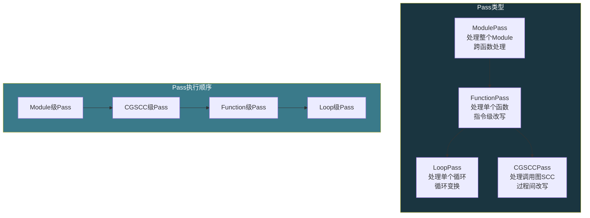
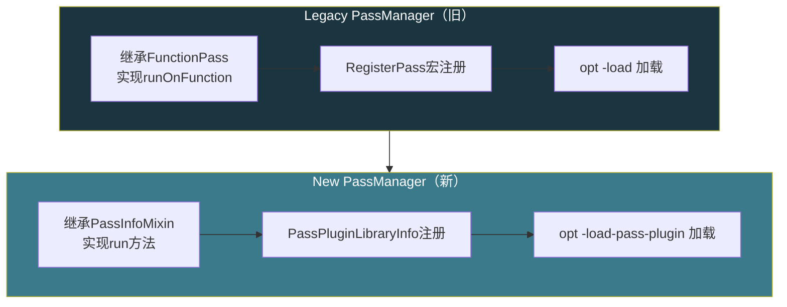

# 【化神·145】LLVM Pass开发：给编译器写插件

> 码农修仙传 · 化神期 · 第145篇
> 我是玄芯散人，带你从炼气修到大乘。

---

## 境界标识

```
╔══════════════════════════════════════╗
║     化神期 · 第145篇                  ║
║     LLVM Pass开发                     ║
║     给编译器写插件                     ║
║     IR基础+Pass机制+手写改写Pass       ║
║     预计阅读：25分钟                   ║
╚══════════════════════════════════════╝
```

---

## 修仙引入

化神期的修士不再只会用别人炼好的法宝，开始往法宝里塞自己的阵纹。

前几篇讲了怎么造编译器：词法切token，语法建AST，语义查类型，代码生成吐汇编，改写pass扫IR。132篇里那些pass，比如常量折叠，死代码消除，循环展开，都是编译器自带的。但LLVM有个设计很妙：pass是可插拔的。你写一个C++类，继承几个接口，编译成动态库，用命令行加载进去，它就在编译流程里跑起来了。

这就是LLVM Pass。你不需要改LLVM源码，不需要重新编译整个LLVM，写个插件就能给编译器加功能。统计指令数、改写IR，还能做静态安全检查，都行。

---

## 硬核主体

### LLVM IR长什么样

写pass之前得先能读懂IR。LLVM IR是带类型的SSA形式中间表示。SSA（Static Single Assignment）的意思是每个变量只被赋值一次，如果有多次赋值就创建新版本。

写一个C函数：

```c
// add.c
int add(int a, int b) {
    int result = a + b;
    return result;
}
```

用Clang编译成IR：

```bash
clang -S -emit-llvm add.c -o add.ll
```

得到的LLVM IR（简化后）：

```llvm
; ModuleID = 'add.c'
source_filename = "add.c"

; Function Attrs: noinline nounwind
define dso_local i32 @add(i32 noundef %0, i32 noundef %1) #0 {
  %3 = alloca i32, align 4        ; 分配result的栈空间
  %4 = alloca i32, align 4        ; 分配参数a的栈空间
  %5 = alloca i32, align 4        ; 分配参数b的栈空间
  store i32 %0, ptr %4, align 4   ; 把参数0存到a
  store i32 %1, ptr %5, align 4   ; 把参数1存到b
  %6 = load i32, ptr %4, align 4  ; 加载a
  %7 = load i32, ptr %5, align 4  ; 加载b
  %8 = add nsw i32 %6, %7         ; a + b，nsw=NoSignedWrap
  store i32 %8, ptr %3, align 4   ; 存到result
  %9 = load i32, ptr %3, align 4  ; 加载result
  ret i32 %9                       ; 返回
}
```

几个要点：

`i32` 是32位整数类型。LLVM IR的类型系统是显式的，不像C有隐式转换。`ptr`是指针类型（LLVM 15+不透明指针，之前是`i32*`这种带类型指针）。

`%0` `%1` 是函数参数。LLVM IR里匿名参数用数字编号，命名参数用`%a` `%b`。

`alloca` 在栈上分配空间。`load` 从内存读。`store` 往内存写。`add` 做加法。

`define dso_local i32 @add` 定义一个函数，`@add`是函数名（全局符号以@开头，局部值以%开头）。

`#0` 是属性组，`noinline nounwind`表示不内联、不会抛异常。

上面这段IR没开改写，所以有大量多余的alloca/load/store。开`-O2`后：

```bash
clang -S -emit-llvm -O2 add.c -o add_opt.ll
```

```llvm
define dso_local i32 @add(i32 noundef %0, i32 noundef %1) #0 {
  %3 = add nsw i32 %1, %0
  ret i32 %3
}
```

改写pass把多余内存操作全删了，直接用寄存器做加法。这就是pass的威力。

### Pass的分类

LLVM的pass分三类，按处理对象不同：

FunctionPass：每次处理一个函数。拿到一个`Function`对象，遍历里面的基本块和指令。适合做函数内改写。

ModulePass：每次处理整个Module（一个编译单元）。拿到`Module`对象，可以跨函数处理。比如全局变量使用统计、跨函数调用图构建。

LoopPass：每次处理一个循环。拿到`Loop`对象，适合做循环变换。

新PassManager（LLVM 13+默认使用）还有CGSCCPass（处理调用图强连通分量）、PassAdaptor等适配器。对于初学者，FunctionPass覆盖80%的需求。



### opt工具：手动跑pass

LLVM自带一个`opt`工具，可以在命令行手动跑pass。这是调试pass的利器。

```bash
# 把C编译成bitcode（二进制IR）
clang -c -emit-llvm add.c -o add.bc

# 跑内置pass：死代码消除
opt -passes=dce add.bc -o add_dce.bc

# 转反汇编查看IR
llvm-dis add_dce.bc -o add_dce.ll

# 同时跑多个pass
opt -passes="dce,instcombine,simplifycfg" add.bc -o add_opt.bc
```

`-passes=`后面跟的是pass pipeline，用逗号分隔。这些是LLVM内置的pass。下面我们写一个自己的pass，用`opt`加载它。

### 手写第一个Pass：统计指令数

写一个FunctionPass，统计每个函数有多少条指令。用新PassManager API（LLVM 15+）。

```cpp
// InstCountPass.cpp
#include "llvm/Passes/PassBuilder.h"
#include "llvm/Passes/PassPlugin.h"
#include "llvm/IR/Function.h"
#include "llvm/Support/raw_ostream.h"

using namespace llvm;

// 新PassManager风格的pass，继承PassInfoMixin
struct InstCountPass : PassInfoMixin<InstCountPass> {
    // run方法是入口，接收Function引用和AnalysisManager引用
    PreservedAnalyses run(Function &F, FunctionAnalysisManager &AM) {
        // 跳过声明（只有函数签名没有函数体）
        if (F.isDeclaration())
            return PreservedAnalyses::all();

        int count = 0;
        // 遍历函数里每个基本块的每条指令
        for (BasicBlock &BB : F) {
            for (Instruction &I : BB) {
                count++;
                // 打印每条指令
                errs() << "  " << I << "\n";
            }
        }

        errs() << "Function " << F.getName() << " has "
               << count << " instructions\n";

        // 返回all表示没修改IR，已有结果都还有效
        return PreservedAnalyses::all();
    }
};
```

这段代码的流程：拿到一个`Function`引用，遍历它的`BasicBlock`（基本块），再遍历每个基本块里的`Instruction`，计数并打印。`errs()`是LLVM的stderr输出流，用来打印调试信息。

`PreservedAnalyses`告诉PassManager这个pass做了什么程度的改写。`all()`表示没改任何东西。如果改了IR，返回`PreservedAnalyses::none()`，这样依赖这个函数已有结果的后续pass知道结果失效了需要重算。

### 注册Pass：让它能被opt加载

新PassManager用插件注册。文件末尾加：

```cpp
// 注册pass，让opt能通过名字找到它
llvm::PassPluginLibraryInfo getInstCountPluginInfo() {
    return llvm::PassPluginLibraryInfo {
        LLVM_PLUGIN_API_VERSION,    // API版本号
        "InstCount",                // 插件名
        LLVM_VERSION_STRING,        // LLVM版本
        [](PassBuilder &PB) {
            // 在optimizer pipeline的extension point注册
            PB.registerPipelineStartEPCallback(
                [](ModulePassManager &MPM, OptimizationLevel) {
                    // FunctionPassManager套在ModulePassManager里
                    FunctionPassManager FPM;
                    FPM.addPass(InstCountPass());
                    MPM.addPass(createModuleToFunctionPassAdaptor(std::move(FPM)));
                }
            );
        }
    };
}

// 这行让opt在加载插件时调用注册函数
extern "C" LLVM_ATTRIBUTE_WEAK
llvm::PassPluginLibraryInfo llvmGetPassPluginInfo() {
    return getInstCountPluginInfo();
}
```

注册逻辑：`PassPluginLibraryInfo`是个结构体，包含插件名和版本。`PassBuilder`的`registerPipelineStartEPCallback`把我们的pass注册到pipeline开始的位置。因为InstCountPass是个FunctionPass，要用`createModuleToFunctionPassAdaptor`包一层才能加进ModulePassManager。

### 编译和运行

把上面的代码存成`InstCountPass.cpp`，编译成动态库：

```bash
# 编译成动态库
clang++ -fPIC -shared InstCountPass.cpp \
    $(llvm-config --cxxflags) \
    -o InstCountPass.so

# 用opt加载插件并运行
opt -load-pass-plugin ./InstCountPass.so \
    -passes="default<O0>" \
    -stats \
    add.bc -o add_count.bc
```

输出大概长这样：

```text
  %3 = alloca i32, align 4
  %4 = alloca i32, align 4
  store i32 %0, ptr %4, align 4
  store i32 %1, ptr %5, align 4
  %6 = load i32, ptr %4, align 4
  %7 = load i32, ptr %5, align 4
  %8 = add nsw i32 %6, %7
  store i32 %8, ptr %3, align 4
  %9 = load i32, ptr %3, align 4
  ret i32 %9
Function add has 10 instructions
```

你的pass在LLVM的编译流程里跑起来了。这不是模拟，是真实的编译器插件。

### 写一个改写Pass：删除冗余Store

统计只是读，不改IR。现在写一个真正改写IR的pass：删除对同一地址的连续store（只保留最后一个）。

比如这段IR：

```llvm
store i32 1, ptr %x     ; 第一次store
store i32 2, ptr %x     ; 第二次store，第一次的结果被覆盖
; 中间没有load %x
store i32 3, ptr %x     ; 第三次store，第二次也被覆盖
; 后面也没有load %x（这个store也死掉了）
```

如果两次store之间没有load那个地址，前一次store就是死存储，可以删掉。

```cpp
// DeadStoreElim.cpp
struct DeadStorePass : PassInfoMixin<DeadStorePass> {
    PreservedAnalyses run(Function &F, FunctionAnalysisManager &AM) {
        if (F.isDeclaration())
            return PreservedAnalyses::all();

        bool changed = false;
        SmallVector<Instruction*, 16> toErase;

        for (BasicBlock &BB : F) {
            // 记录最近一次store的地址，简化版
            // 实际实现需要alias analysis判断是否同一地址
            DenseMap<Value*, StoreInst*> lastStore;

            for (Instruction &I : BB) {
                // 遇到load，清除对应地址的记录（可能有数据竞争）
                if (auto *load = dyn_cast<LoadInst>(&I)) {
                    Value *addr = load->getPointerOperand();
                    lastStore.erase(addr);
                }

                // 遇到store，检查上一个同地址的store
                if (auto *store = dyn_cast<StoreInst>(&I)) {
                    Value *addr = store->getPointerOperand();

                    auto it = lastStore.find(addr);
                    if (it != lastStore.end()) {
                        // 前一个同地址store可以被删除
                        toErase.push_back(it->second);
                    }
                    lastStore[addr] = store;
                }

                // 遇到call，保守清空所有记录
                if (auto *call = dyn_cast<CallBase>(&I)) {
                    lastStore.clear();
                }
            }
        }

        // 统一删除
        for (Instruction *I : toErase) {
            I->eraseFromParent();
            changed = true;
        }

        return changed ? PreservedAnalyses::none()
                       : PreservedAnalyses::all();
    }
};
```

这段代码遍历每个基本块的指令，维护一个`lastStore`表，记录每个地址最近一次被store的指令。遇到新的同地址store就标记前一个为可删。遇到load清除记录（因为load用到了那个地址的值，前面的store不能删）。遇到call清空所有记录（函数调用可能修改任何内存）。

这是个简化版，真实实现要考虑指针别名（两个指针可能指向同一地址），LLVM有`AAResults`做别名查询。但作为入门pass，这个逻辑能处理简单的连续赋值情况。

### Pass的调试技巧

写pass踩坑是常态，几个有用的调试方法。

用`-print-after-all`让opt打印每跑完一个pass后的IR：

```bash
opt -load-pass-plugin ./MyPass.so \
    -passes="default<O2>" \
    -print-after-all \
    input.bc -o output.bc 2>ir_dump.txt
```

`ir_dump.txt`里能看到每个pass执行后的IR变化，对定位"是哪个pass把我的代码改坏了"很有用。

用`llvm-dis`把bitcode反编译成可读IR：

```bash
llvm-dis output.bc -o output.ll
```

在pass代码里用`dbgs()`打印调试信息（只在Debug构建输出，Release构建自动移除）：

```cpp
#include "llvm/Support/Debug.h"
DEBUG_WITH_TYPE("my_pass", dbgs() << "Processing " << F.getName() << "\n");
```

调试时用Debug版LLVM，Release编译的LLVM里`DEBUG_WITH_TYPE`的输出会被移除。

### 新旧PassManager

LLVM有两套PassManager。旧的叫Legacy PassManager，用`RegisterPass<>`模板宏注册，pass继承`FunctionPass`/`ModulePass`类。新的叫New PassManager（也叫PassInfoMixin风格），从LLVM 13开始成为默认。

```cpp
// Legacy风格（旧，不推荐新代码用）
struct LegacyInstCount : public FunctionPass {
    static char ID;
    LegacyInstCount() : FunctionPass(ID) {}

    bool runOnFunction(Function &F) override {
        // 处理逻辑
        return false;  // 返回是否改了IR
    }
};

// New风格（新，推荐）
struct InstCountPass : PassInfoMixin<InstCountPass> {
    PreservedAnalyses run(Function &F, FunctionAnalysisManager &AM) {
        // 处理逻辑
        return PreservedAnalyses::all();
    }
};
```

新代码用New PassManager。很多教程还在用Legacy，因为老教程多。但LLVM官方文档已经推荐New PassManager，Legacy PassManager在逐步淘汰。



### 实际用途

LLVM Pass在实际项目里用途很广，不只是学术练习。

做静态检查：在pass里检查IR的模式，发现潜在bug。比如检查所有`memcpy`的长度参数是否来自外部输入（可能缓冲区溢出）。LLVM自带的`-fsanitize=address`和`-fsanitize=memory`就是用pass插桩的。

做代码插桩：在pass里往IR里插入计数指令，统计代码覆盖率。LLVM的SanitizerCoverage就是这个原理，做模糊测试时用来引导生成输入。

做自定义改写：如果你的代码有特定的模式，通用改写做不好，可以写专门pass。比如TensorFlow的XLA编译器用LLVM pass做算子合并。

做安全加固：在pass里把敏感操作的指令替换成等价的但更难逆向的形式，或者插入校验指令做运行时检查。

这四个方向覆盖了Pass在工业项目里的主要用途。静态检查找bug，插桩做覆盖率，自定义改写做领域专用的事情，安全加固做防逆向。

---

## 修仙术语对照表

| 修仙术语 | 技术现实 | 本篇位置 |
|---------|---------|---------|
| 往法宝里塞阵纹 | 给编译器写插件Pass | 修仙引入 |
| 中间阵图 | LLVM IR，带类型的SSA中间表示 | IR基础段 |
| 基本块 | BasicBlock，指令的顺序执行单元 | IR基础段 |
| 遍历阵图 | FunctionPass，遍历函数内指令做检查 | Pass分类段 |
| 阵纹模板 | PassInfoMixin，新PassManager的基类 | 手写Pass段 |
| 注册阵法 | PassPluginLibraryInfo注册插件 | 注册Pass段 |
| 炼器工具 | opt命令行工具，手动跑pass | opt工具段 |
| 清除残余灵力 | Dead Store Elimination，删除冗余store | 改写Pass段 |
| 旧法新法 | Legacy PassManager vs New PassManager | 新旧对比段 |
| 观阵术 | -print-after-all，查看每个pass后的IR | 调试技巧段 |
| 灵力追踪 | 代码插桩，统计覆盖率或性能 | 实际用途段 |
| 加固阵法 | 安全加固pass，反逆向或运行时校验 | 实际用途段 |

---

## 进阶条件

- [ ] 能读懂LLVM IR的基本结构，说出SSA是什么，基本块和指令的关系
- [ ] 用`clang -S -emit-llvm`生成一段C代码的IR，对比-O0和-O2的输出差异
- [ ] 用`opt -passes=dce`跑一遍内置pass，观察IR变化
- [ ] 写一个FunctionPass插件，统计函数内指令数，用`opt -load-pass-plugin`加载运行
- [ ] 理解`PreservedAnalyses`的用途，能说明改写IR和只读检查返回值的不同
- [ ] 写一个改写Pass（如死存储消除），验证改写后的IR逻辑等价
- [ ] 能区分Legacy PassManager和New PassManager的API差异，写新代码用New风格
- [ ] 用`-print-after-all`调试pass，定位IR被错误改写的位置

下一篇146，离开编译器内部，聊技术选型。为什么大厂选A不选B，选型到底在选什么，沉没成本怎么算。化神期的后半段从工程决策开始。

---

## 下期预告 + 互动

下一篇：**技术选型的真相：为什么大厂选A不选B**

讲选型要考虑的因素（成熟度，团队匹配，社区活跃度，性能等），沉没成本的陷阱，以及为什么"最好的技术"不一定是"最适合的技术"。

互动问题：
1. 你在项目里用LLVM Pass做过什么？静态检查？插桩？自定义改写？聊聊你踩的坑。
2. 如果让你给LLVM加一个Pass，你最想让它自动做什么改写？

我是玄芯散人，带你从炼气修到大乘。

---

*本文是「码农修仙传」系列第145篇。系列导航见 [xren.ren](https://xren.ren)*
