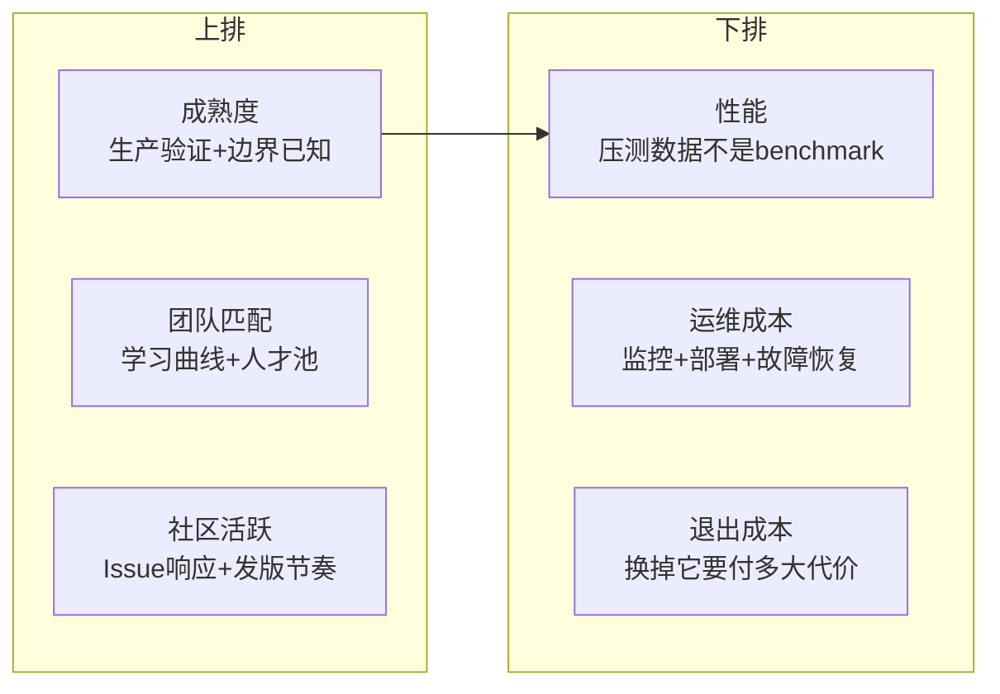
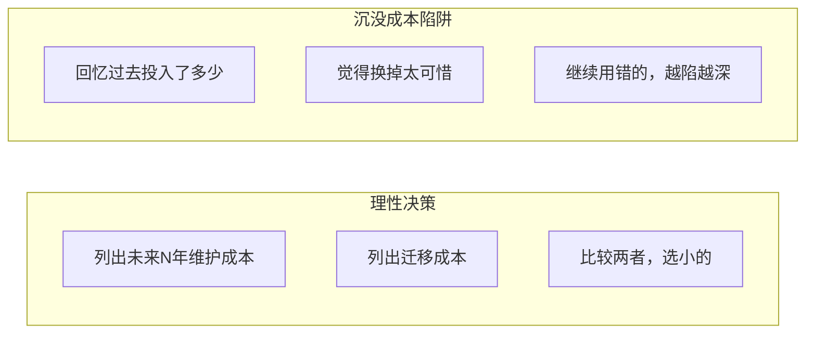
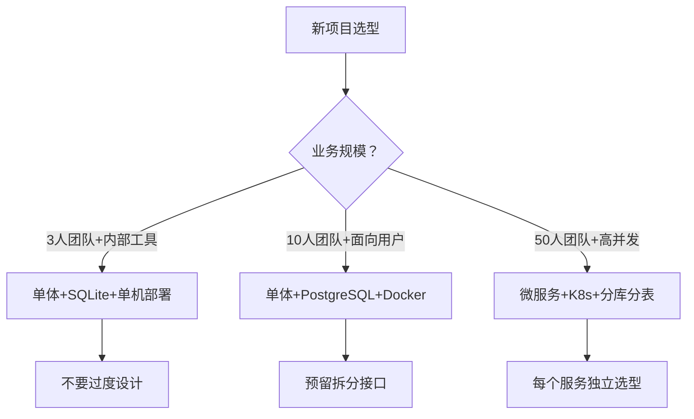

# 【化神·146】技术选型的真相：为什么大厂选A不选B

> 码农修仙传 · 化神期 · 第146篇
> 我是玄芯散人，带你从炼气修到大乘。

---

## 境界标识

```
╔══════════════════════════════════════╗
║     化神期 · 第146篇                  ║
║     技术选型的真相                     ║
║     为什么大厂选A不选B                 ║
║     选型维度+沉没成本+决策框架          ║
║     预计阅读：18分钟                   ║
╚══════════════════════════════════════╝
```

---

## 修仙引入

化神期的修士走到这一步，法宝已经不缺了。缺的是判断力：手里三件法宝，哪件该带上战场，哪件该留在洞府。

前几篇讲了怎么造编译器，怎么造数据库，怎么造操作系统。但现实工程里，大多数时候你做的事情恰好相反：你在选轮子，不是在造轮子。选Kubernetes还是Docker Swarm，选MySQL还是PostgreSQL，选gRPC还是REST，选React还是Vue。每个决定都会左右团队未来三五年的走向。选错了，要么推倒重来，要么在错误的轨道上越跑越远。

技术选型这件事，表面看是技术问题，背后其实是人在博弈，组织在博弈，时间也在博弈。

---

## 硬核主体

### 选型的六维评估框架

很多人做技术选型，拉个对比表格，列出功能列表，打个勾就完事了。这种选法忽略了工程世界的一个事实：技术不是在真空里运行的。



逐个拆解。

成熟度。一个技术是否经过大规模生产验证，已知的边界在哪里。Kubernetes在2014年开源，2018年左右开始大规模生产使用，到今天CNCF调查报告显示超过90%的容器编排用户在用它。它的成熟度体现在：已知的不work的情况有明确文档，升级路径可预测，API版本化（v1beta1到v1的迁移有工具辅助）。反观一些小众项目，你不知道它在什么数据量下会崩，没有人在生产环境替你踩过坑。

成熟度不等于年龄。Rust 1.0是2015年发布的，到2022年Linux 6.1接受Rust补丁，中间七年是社区反复验证语言安全和编译器稳定性的过程。到2024年，Rust在系统编程领域的成熟度已经足够支撑生产决策。

团队匹配。你的团队现在会什么，学新东西要多久，市场上招得到懂这门技术的人吗。这个维度经常被低估。

一个团队全是Java后端，你非要让他们用Rust重写服务，光学习曲线就要烧掉半年。这半年里代码质量一定下降，因为写不熟的人写的Rust，unsafe满天飞，还不如老老实实写Java。反过来，一个团队如果已经用了五年Go，新项目继续用Go，上手即干活，这个"无聊"的决定可能就是对的。

人才池是个硬约束。2024年你在国内招Rust开发者，简历数量大概只有Java的十分之一。薪资也更高。这不是技术问题，是经济学问题。

社区活跃。看三个指标：GitHub Issue的响应速度，发版节奏是否规律，有没有大公司在生产环境用并持续贡献。

Elasticsearch和OpenSearch的分叉是个好案例。2021年Elastic改变许可证后，AWS主导分叉出OpenSearch。到2024年，两个项目的社区走向已经截然不同。选哪个，取决于你看重哪个社区的可持续性。一个社区只有一家公司在维护，和有十家公司在贡献，抗风险能力完全不同。

性能。跑benchmark是应该的，但benchmark不等于生产性能。

很多技术选型报告的性能对比是这样的：在标准测试集上跑个分数，谁高谁低。但你的业务负载不是标准测试集。gRPC在protobuf序列化上比REST+JSON快3到5倍（前提是HTTP/2全栈对比，protobuf序列化确实比JSON解析快得多），这个数据在大量小消息的情况下是真实的。但如果你的瓶颈是数据库查询，序列化省的那两毫秒毫无感觉。性能选型要拿你自己的业务负载去压测，不是看别人的报告。

运维成本。部署，监控，日志，故障恢复，这些都是选型后每天都要面对的事。

选一个技术不只是让它跑起来，还要让它一直跑着不出事。Prometheus + Grafana的监控方案比Zabbix更现代，但你的运维团队如果已经用了十年Zabbix且运维脚本齐全，换一套监控方案的迁移代价和风险都得算进去。

退出成本。如果这个技术三年后被淘汰，或者发现不满足需求，换掉它要付多大代价。

这一条是最容易被忽略的。选一个数据库，你的数据迁移成本是多少？选一个RPC框架，你的接口改造成本是多少？选一个前端框架，你的组件库和构建工具链绑定有多深？退出成本高的技术，选的时候要格外谨慎。

### 沉没成本陷阱

经济学里有个概念叫沉没成本：已经投入且无法收回的成本。理性的决策应该忽略沉没成本，只看未来的收益。但人做不到。

技术选型里，沉没成本陷阱长这样：

```
"我们已经在这个技术上投入了两年，
 现在换掉太可惜了，再坚持一下吧。"
```

这句话在无数公司被说过无数遍。问题在于，"已经投入两年"是沉没成本，不管你换不换，这两年都回不来了。该比较的是：继续用这个技术未来三年的维护代价，vs 换一个新技术未来三年的维护代价（含迁移代价）。

举个真实案例。某团队用了一个内部RPC工具，五年前自研的。现在社区已经有gRPC和Thrift，功能更强，文档更好，新人上手更快。但这个团队迟迟不换，理由是"迁移代价太高"。实际算一下：200个接口需要改proto定义，按团队5个人算，大概两个月能迁完。而继续维护自研工具，每年要花1个人力处理新人培训，bug修复，文档维护。三年就是3个人力。迁移的2个月人力 vs 三年3个人力，答案其实很清楚。

但决策者看到的是"已经投入了五年"，不是"未来要投入三年"。这就是沉没成本在作怪。



### 大厂选型的真实逻辑

大厂选技术，表面看是技术决策，背后往往是组织决策。

Google内部用gRPC，因为gRPC本来就是Google开源出来的。阿里用Dubbo，因为Dubbo是阿里自己造的。字节跳动的RPC框架叫Kitex，也是自研的。这些选择背后的逻辑是自研技术栈可以按需定制，人才培养路径更可控。大厂有能力也有需要去掌控自己的基础设施，所以gRPC和Dubbo谁更好这件事，对他们来说不重要。

但大厂也有"不造轮子"的时候。Google的TensorFlow是开源的，但内部推理用XLA和TPU配套的编译栈。Facebook开源了PyTorch，但训练框架用的自家FBLearner Flow。开源和自研之间有清晰的边界：能开源的部分开源，让社区帮你迭代。不能开源的部分自研，保持竞争力。

小公司学大厂选型，容易踩的坑是只看到大厂用了什么，没看到大厂为什么能用。Kubernetes在Google用得好，因为Google有Borg十几年的运维经验，有自研网络和存储，有专门的SRE团队。你拿一个三人的运维团队去搞Kubernetes，很可能半年还在调网络插件。

### 一个选型决策记录模板

好的选型决策应该有记录。留给后来者的工程文档，比写在PPT里讲给老板听的要值钱得多。

```markdown
# 技术选型决策记录：选择XXX而非YYY

## 背景
业务需要解决什么问题，当前方案的痛点是什么。

## 候选方案
- 方案A：XXX
- 方案B：YYY
- 方案C：ZZZ（如果有的话）

## 评估
| 维度 | 方案A | 方案B |
|------|-------|-------|
| 成熟度 | 生产验证，已知边界 | 较新，部分情况未验证 |
| 团队匹配 | 团队已有3人熟练 | 需要全员培训2个月 |
| 社区活跃 | 200+ contributors | 20+ contributors |
| 性能 | 压测结果：满足需求 | 压测结果：快15%但非瓶颈 |
| 运维成本 | 有成熟监控方案 | 需要自建监控 |
| 退出成本 | 数据可导出，接口可适配 | 数据格式绑定深 |

## 决定
选择方案A。

## 理由
（不是"因为A更好"，而是具体说明在当前约束下A的哪个维度决定了选择）

## 复盘条件
什么情况下重新评估这个决定（如团队规模扩大到XX人，或负载增长到XX QPS）
```

这个模板的意义不在于决策本身，而在于记录了决策时的约束条件。三年后有人问你"为什么选了A不选B"，你不需要回忆，翻出文档就能看到当时的理由。如果约束条件变了，该推翻就推翻，不用纠结面子。

### 什么时候该造轮子

化神期的读者可能面临一个特殊问题：什么时候该自己造，什么时候该选现成的。

三个判断标准：

第一，现成的东西在性能或功能上差一个数量级。不是差10%，是差10倍。比如你需要纳秒级延迟的序列化，protobuf做不到，那自研是合理的。差10%不值得造，因为你的自研版本大概率在别的方面差10%。

第二，这个能力是你的竞争力所在。数据库引擎厂商应该自己造存储引擎，因为这是它的产品命脉。一个电商公司不应该自己造数据库，因为它的竞争力在供应链不在存储。

第三，你有持续维护的人力承诺。造一个轮子用一次就扔，不如用现成的。造一个轮子用十年，值得。LLVM之所以能替代GCC，不是因为Chris Lattner一个人写了更好的代码，而是因为他拉起了一个持续二十年的社区。

### 选型中的反模式

几个常见的错误选法：

追逐热点。新技术出来了，star数涨得快，就急着用。star数不等于生产可用。2016年左右React社区一堆state管理库百花齐放，今天用Redux，明天换MobX，后天又试Recoil，大把团队跟风换了三四次，每次换都在重构。最后大部分回到了最朴素的方案。

只看技术不看人。技术文档写得漂亮的，不一定团队用得顺手。GraphQL的schema设计需要一定的抽象能力，一个CRUD为主的业务团队硬上GraphQL，可能把简单的增删改查搞得异常复杂。

过度选型。一个内部工具，三个人用，你纠结要不要用微服务架构，要不要上Kubernetes。杀鸡用牛刀，运维成本比业务开发成本还高。技术选型要匹配业务规模，不是越先进越好。



---

## 修仙术语对照表

| 修仙术语 | 技术现实 | 本篇位置 |
|---------|---------|---------|
| 法宝 | 技术工具/语言/库 | 引入段 |
| 选法宝 | 技术选型 | 全篇主题 |
| 法宝品阶 | 技术成熟度 | 六维评估 |
| 弟子功法 | 团队技术栈匹配 | 团队匹配维度 |
| 门派底蕴 | 社区活跃度和贡献者 | 社区活跃维度 |
| 法宝威力 | 性能压测数据 | 性能维度 |
| 日常修炼 | 运维成本 | 运维成本维度 |
| 弃宝脱身 | 退出成本/迁移代价 | 退出成本维度 |
| 执念 | 沉没成本陷阱 | 沉没成本段落 |
| 走火入魔 | 追逐热点/过度选型 | 反模式段落 |
| 自炼法宝 | 造轮子 | 造轮子判断标准 |
| 名门大派 | 大厂 | 大厂选型逻辑 |
| 师门传承 | 开源社区可持续性 | 社区活跃维度 |
| 走火入魔的功法 | 选错的技术 | 沉没成本案例 |

---

## 进阶条件

- [ ] 能用六维框架对两个技术方案做系统评估，每个维度有具体数据或事实支撑
- [ ] 写过至少一份技术选型决策记录文档，记录了背景和候选方案以及评估过程和最终决定
- [ ] 在一个项目中识别出沉没成本陷阱，并能理性比较"继续维护"和"迁移"的未来成本
- [ ] 能说出你团队当前技术栈在六个方面各自的状态，知道哪个方面是短板
- [ ] 面对新热点技术，能忍住一周不跟风，先查生产案例和已知边界
- [ ] 能区分"竞争力所在需要自研"和"非关键应该选现成"，并给出具体判断依据
- [ ] 能列出数据迁移的工作量，接口改造的工作量，人员重训的工作量

下一篇进入架构模式，讲分层架构和事件驱动以及微服务这些风格各自的适用范围，还有过度设计会付出什么代价。选型解决了"用什么工具"的问题，架构模式解决"工具怎么组合"的问题。

---

## 下期预告 + 互动

下一篇：**架构模式：分层架构和事件驱动与微服务**

讲各种架构模式各自解决什么问题，什么业务规模该用什么架构，还有过度设计会付出什么代价。单体不丢人，微服务不高级，合不合适取决于你的业务规模和团队能力。

互动问题：
1. 你经历过的最痛苦的选型错误是什么？是选了太新的还是太旧的？事后复盘，哪个方面当时被忽略了？
2. "已经投入两年所以不能换"这个理由站得住脚吗？如果你是技术负责人，会怎么评估该不该推翻重来？

我是玄芯散人，带你从炼气修到大乘。

---

*本文是「码农修仙传」系列第146篇。系列导航见 [xren.ren](https://xren.ren)*
