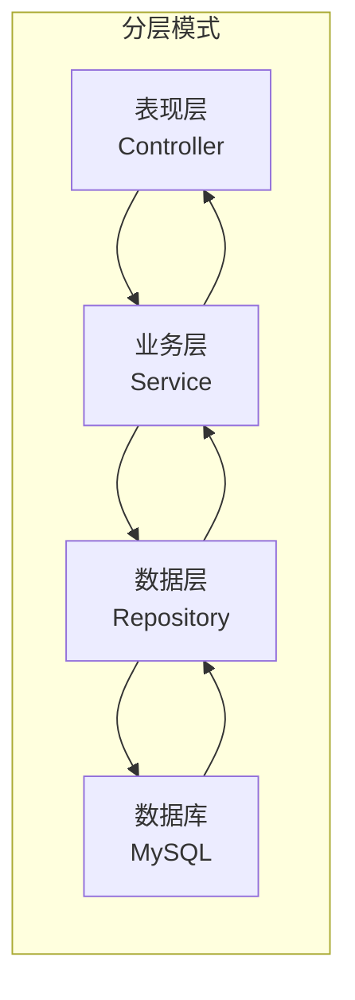
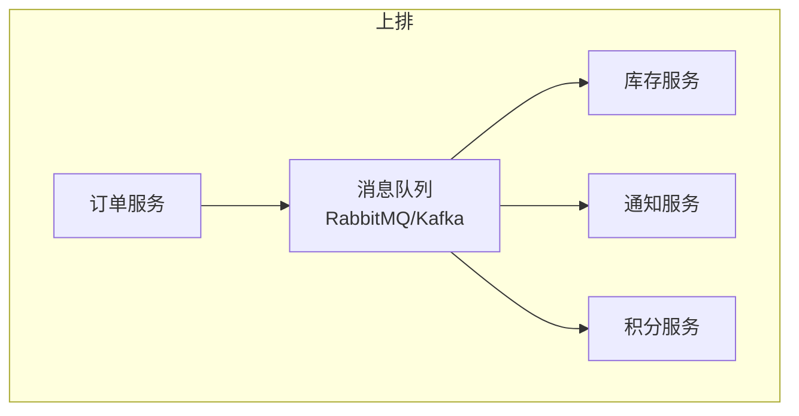
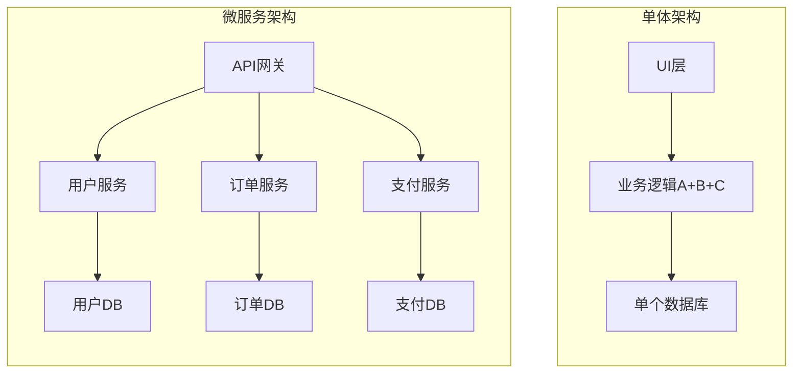
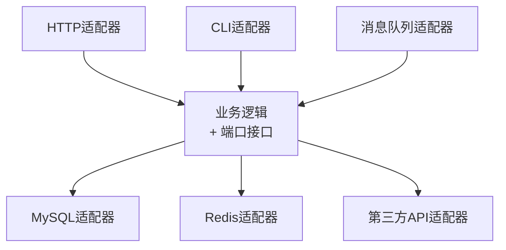

# 【化神·147】架构模式：分层、事件驱动、微服务

> 码农修仙传 · 化神期 · 第147篇
> 我是玄芯散人，带你从炼气修到大乘。

---

## 境界标识

```
╔══════════════════════════════════════╗
║     化神期 · 第147篇                  ║
║     架构模式                           ║
║     分层/事件驱动/微服务               ║
║     什么规模用什么架构                 ║
║     预计阅读：16分钟                   ║
╚══════════════════════════════════════╝
```

---

## 修仙引入

化神期的修士手里已经有了足够的法宝和功法，但到了这个境界，比拼的重心从"多收集法宝"转向了"怎么布阵"。阵法讲究各法器之间的方位配合，把所有法宝往一堆扔不叫布阵，叫堆积。

上篇讲的是选什么法宝（技术选型），这篇讲的是法宝怎么组合布阵（系统设计）。

软件系统设计就是布阵。你手里有数据库，有缓存，有消息队列，有API网关，有前端，有后端。这些东西怎么摆，谁连谁，谁不能碰谁，决定了你的系统是运转自如还是一团乱麻。这篇讲三种最常见的阵法布局：分层模式，事件驱动，微服务。再说说什么时候该用哪种，什么时候不该用。

---

## 硬核主体

### 分层架构：最古老的阵法

分层模式是所有软件设计的祖师爷。思路简单：把系统按职责分成若干层，每层只跟相邻的层打交道，依赖方向永远向下。

最经典的是三层架构：

- 表现层（Presentation）：处理HTTP请求，返回HTML或JSON
- 业务逻辑层（Business Logic）：处理业务规则
- 数据访问层（Data Access）：操作数据库

再细一点就是四层：Controller，Service，Repository，Database。Java Spring项目几乎都是这个套路。

```java
// Controller层 - 只负责接收请求和返回响应
@RestController
@RequestMapping("/api/orders")
public class OrderController {
    private final OrderService orderService;  // 依赖Service接口，不是实现

    @PostMapping
    public ResponseEntity<Order> createOrder(@RequestBody OrderRequest req) {
        Order order = orderService.create(req);  // 调用业务层
        return ResponseEntity.ok(order);
    }
}

// Service层 - 业务规则在这里
@Service
public class OrderService {
    private final OrderRepository repo;
    private final InventoryService inventory;  // 依赖接口，可注入Mock

    public Order create(OrderRequest req) {
        if (!inventory.checkStock(req.getProductId())) {
            throw new OutOfStockException("库存不足");
        }
        Order order = new Order(req.getProductId(), req.getQuantity());
        return repo.save(order);  // 调用数据层
    }
}

// Repository层 - 只管数据库读写
@Repository
public class OrderRepository {
    private final JdbcTemplate jdbc;

    public Order save(Order order) {
        String sql = "INSERT INTO orders (product_id, quantity) VALUES (?, ?)";
        jdbc.update(sql, order.getProductId(), order.getQuantity());
        return order;
    }
}
```

分层模式的好处是清晰。Controller不该出现SQL语句，Repository不该有业务判断，Service不该关心HTTP状态码。每一层有明确的边界，出问题知道去哪层找。

坏处也明显：一个简单的"查订单列表"，请求要在Controller经过Service和Repository才到数据库，回来的路径原路倒一遍。层数越多，一个功能要写的胶水代码越多。



分层模式适合什么情况？团队规模小（五人以内），业务逻辑集中在一个领域，系统不需要水平扩展。大多数内部管理系统，CRM，后台管理面板，用分层模式就够了。简单，好维护，新人三天上手。

造轮子的人会好奇：Spring把Controller→Service→Repository固化成约定，为什么这三层是天然边界？因为HTTP协议处理跟业务规则无关，业务规则跟SQL语法无关。这样做把"容易做对但更容易做错"的事情变成了默认行为。Spring Boot的starter依赖把这些约定打包成自动配置，你写个Controller加注解就能跑，背后是DispatcherServlet路由到Controller，再通过BeanPostProcessor注入Service和Repository。

### 事件驱动架构：传音符模式

分层模式是同步调用：Controller调Service，Service调Repository，一层等一层。如果中间某层慢了，整条链路都卡住。

事件驱动架构换了个思路：不直接调用，而是发消息。组件A做完自己的事情后发一个事件到消息队列，关心这个事件的组件B和C各自去队列里取，A不需要知道谁在监听。

用修仙的话说，分层模式是面对面传功，师徒之间必须有接触。事件驱动是飞剑传书，发出去就不管了，谁捡到谁看。

```python
# 订单服务 - 发事件，不等后续处理
import pika
import json

def place_order(order_data):
    # 1. 保存订单到数据库
    order = save_to_db(order_data)

    # 2. 发送事件到RabbitMQ
    connection = pika.BlockingConnection(
        pika.ConnectionParameters('localhost')
    )
    channel = connection.channel()
    channel.queue_declare(queue='order.created')

    channel.basic_publish(
        exchange='',
        routing_key='order.created',
        body=json.dumps({
            'order_id': order.id,
            'product_id': order.product_id,
            'quantity': order.quantity
        })
    )
    connection.close()
    # 发完就返回，不等库存服务处理
    return order

# 库存服务 - 监听事件，异步处理
def on_order_created(ch, method, properties, body):
    data = json.loads(body)
    reduce_stock(data['product_id'], data['quantity'])
    ch.basic_ack(delivery_tag=method.delivery_tag)

channel.basic_consume(
    queue='order.created',
    on_message_callback=on_order_created
)
channel.start_consuming()  # 一直监听
```

这段代码展示了一个典型的解耦用法：订单服务只管创建订单和通知，库存服务只管扣减库存。两边通过RabbitMQ消息队列连接，互不依赖部署。订单服务挂了，库存服务照常运行。库存服务处理慢了，订单服务不会卡住，消息堆在队列里等。



事件驱动的好处是松耦合和可扩展。加一个新功能（比如下单后送积分），只需要新写一个消费者订阅`order.created`事件，订单服务一行代码都不用改。

坏处也实实在在。第一，调试困难。一个请求在分层模式里是一条直线，出问题打断点就能追。事件驱动里，请求变成了"发消息然后消息被异步消费"，链路分散在多个进程里，不加分布式追踪（比如Jaeger或Zipkin）完全搞不清谁消费了消息。第二，最终一致性。消息可能延迟，可能重复，可能丢。消费者挂了消息堆积，重启后要处理一大批。幂等设计（同一条消息处理两次结果一样）是必须做的，不能偷懒。

事件驱动适合什么情况？系统中有多个独立子系统需要对同一个事件做不同的事情，或者某个操作耗时长但不要求同步返回结果。电商的下单流程是经典案例：下单后要扣库存，发短信，送积分，写日志，这些事情互不依赖，没必要串在一起等。

造轮子的人会追问：消息队列底层怎么保证不丢消息？靠持久化和ack确认两件事。RabbitMQ收到消息后先写磁盘（persistent模式），消费者取走消息后回一个ack，队列才删掉这条消息。消费者取走还没ack就挂了，队列会把消息重新投递给另一个消费者。这就是为什么幂等设计不能偷懒：同一条消息可能被消费两次。Kafka的做法不同，它用append-only log，消费者自己维护offset位置，重启后按上次的位置继续读。两种思路各有取舍，RabbitMQ追求投递可靠性，Kafka追求吞吐量。

### 微服务：各峰自立洞府

微服务不是一种具体的设计模式，更像一种组织系统的方式。把一个大系统拆成若干个小服务，每个服务独立部署，独立数据库，独立技术栈，通过网络API互相通信。

Netflix从2008年数据库故障后开始迁移，到2012年后大规模落地微服务，拆出了几百个独立服务，是微服务模式的标志性案例。Amazon更早，2002年Jeff Bezos发了一封内部邮件，要求所有团队必须通过API暴露数据和功能，不通过API通信的团队要被处分。这封邮件后来被叫做"Bezos API Mandate"，被认为是微服务思想的起点。

拆分微服务的逻辑遵循康威定律（Conway's Law）："设计系统的组织，其产出等价于组织的沟通结构。" 简单说，你的团队怎么分工，你的系统就会长成什么样。十个团队各自负责一个功能模块，系统自然拆成十个服务。一个人的团队非要拆成十个微服务，那是自找麻烦。



微服务的好处是独立部署和独立扩展。订单服务流量大，可以单独扩容到10个实例，支付服务流量小，2个实例够用。一个服务出bug不会拖垮整个系统（前提是做了熔断和降级）。不同团队可以用不同技术栈，Java写订单，Go写网关，Python写推荐，各取所好。

坏处是运维复杂度暴涨。单体只需要部署一个程序，监控一个进程。微服务有十几个服务，每个服务有自己的数据库，自己的日志，自己的配置。服务发现（一个服务怎么找到另一个服务的地址），链路追踪（一个请求经过了哪几个服务），配置管理（十几个服务的配置怎么统一管理），这些都是单体不需要操心的。

还有数据一致性问题。单体里一个数据库事务就能保证"扣款+创建订单"要么都成功要么都失败。微服务里支付服务和订单服务各自的数据库，跨库事务性能差到没法用（XA两阶段提交），只能用Saga模式：一连串本地事务，每步成功后触发下一步，失败时执行补偿操作。

```java
// Saga模式示例 - 订单创建流程
// 每步是本地事务，失败时执行补偿
public class OrderSaga {
    public void execute(OrderRequest req) {
        // Step 1: 创建订单（本地事务）
        Order order = orderService.create(req);

        try {
            // Step 2: 扣减库存（远程调用）
            inventoryClient.deduct(order.getProductId(), order.getQuantity());

            // Step 3: 扣款（远程调用）
            paymentClient.charge(order.getUserId(), order.getTotalAmount());

        } catch (Exception e) {
            // 补偿：取消订单，恢复库存
            orderService.cancel(order.getId());
            inventoryClient.restore(order.getProductId(), order.getQuantity());
            // paymentClient如果已经扣款需要退款
            throw new OrderFailedException("下单失败，已回滚", e);
        }
    }
}
```

微服务适合什么情况？团队规模超过十人，业务领域可以清晰拆分（用户，订单，支付，物流各有边界），系统需要独立扩展（某些模块流量是其他的十倍）。如果你的系统不具备这些条件，强行拆微服务只会收获运维噩梦。

### 六边形架构和Clean Architecture

除了上面三种主流模式，还有几种讨论较多的架构，简单提一下。

六边形架构（Hexagonal Architecture），也叫端口和适配器（Ports and Adapters）。Alistair Cockburn在2005年提出。思路是：把业务逻辑放在中心，外部接口（HTTP，CLI，消息队列）和外部资源（数据库，缓存，第三方API）都通过"端口"接入。业务逻辑不知道外面是HTTP还是gRPC，也不知道数据存在MySQL还是PostgreSQL。

Robert C. Martin（Uncle Bob）的Clean Architecture是这个思路的延伸，把分层按依赖方向排列：外层依赖内层，内层不知道外层。最里面是业务实体和用例，最外面是Web框架和数据库驱动。



这些模式在理论上是好的，实践中全用上的项目不多。它们的要义是"业务逻辑不依赖基础设施"，这个原则可以部分采纳：把业务逻辑抽成独立模块，Controller和Repository依赖它，它不依赖Controller和Repository。不需要把整个项目变成教科书级别的六边形。

### 什么规模用什么

| 规模 | 团队人数 | 设计建议 | 理由 |
|------|---------|---------|------|
| 创业初期 | 1-5人 | 分层单体 | 快速迭代，沟通成本低 |
| 成长期 | 5-20人 | 分层单体 + 模块化 | 按模块划包，为拆分做准备 |
| 扩张期 | 20-50人 | 事件驱动 + 部分微服务 | 主域拆服务，边缘功能保持单体 |
| 成熟期 | 50人以上 | 微服务 + 事件驱动 | 团队边界清晰，独立部署独立扩展 |

注意这张表不是阶梯。不是说20人就必须拆微服务，50人就必须全微服务。它说的是"在这个规模下，这种设计的收益开始大于成本"。低于这个规模强行上复杂方案，成本大于收益。

### 过度设计的代价

选型最容易犯的错是过度设计。一个日活500人的内部系统，用了Spring Cloud全家桶加Kubernetes集群加Kafka消息总线。每次部署要等CI跑20分钟，新人入职两周看不懂系统全貌图。系统本身的功能呢，就是一个增删改查的表单系统。

这种事情在行业里太常见了。某创业公司CTO在技术分享上大谈微服务改造，拆了20多个服务，团队总共8个人。两个开发负责3个服务，天天加班处理服务间调用的各种问题，业务需求排不上。半年后公司资金紧张，大裁员，剩3个人维护20个微服务，最后不得不合并回单体。

设计应该跟着需求走，不是跟着技术热点走。一个原则：如果你现在的系统扛不住当前的流量和团队规模，先改进现有设计。改进不了再考虑换。换的代价永远是低估的。

---

## 修仙术语对照表

| 修仙术语 | 技术现实 | 本篇位置 |
|---------|---------|---------|
| 布阵 | 软件系统设计 | 全文引入 |
| 功法分境界 | 分层模式按职责分层 | 分层模式段 |
| 飞剑传书 | 事件驱动，发消息不等回应 | 事件驱动段 |
| 各峰自立洞府 | 微服务独立部署独立数据库 | 微服务段 |
| 传音符协调 | 微服务间通过API通信 | 微服务段 |
| 法宝一堆乱扔 | 没有设计规划，组件随意堆叠 | 引入段 |
| 分层胶水代码 | 层数过多导致冗余代码膨胀 | 分层模式段 |
| 端口接入 | 六边形架构的Ports and Adapters | 六边形段 |
| 功法不分内外 | Clean Architecture依赖方向向内 | 六边形段 |
| 阵法跟着需求走 | 选型跟着业务需求走 | 过度设计段 |
| 修炼规模决定阵法 | 系统规模决定设计选择 | 规模表段 |
| 强行布大阵 | 过度设计，小系统上重方案 | 过度设计段 |

---

## 进阶条件

- [ ] 能画出自己当前项目的系统全貌图，标注每层职责和依赖方向
- [ ] 能说清当前项目用的是什么设计模式，以及为什么选它（不是"因为流行"）
- [ ] 能列出当前设计的两个痛点，以及换方案能解决哪些、不能解决哪些
- [ ] 理解Saga模式补偿事务的原理，能手写一个简单的Saga流程
- [ ] 能区分"需要拆微服务"和"不需要拆微服务"的判断标准，不靠团队人数一个指标
- [ ] 能解释Conway定律，并说清团队组织结构如何左右系统设计
- [ ] 读过一个开源项目的设计文档，理解它的选型理由

下一篇讲技术债务。选型选错了会变成技术债，代码写烂了也是技术债。什么时候该还债，什么时候先欠着，下篇细说。

---

我是玄芯散人，带你从炼气修到大乘。

*本文是「码农修仙传」系列第147篇。系列导航见 [xren.ren](https://xren.ren)*
