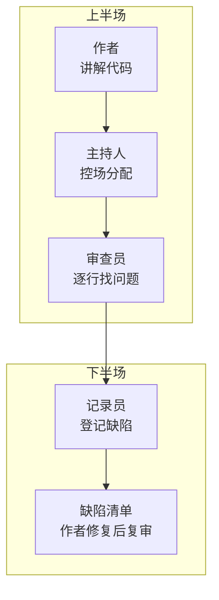
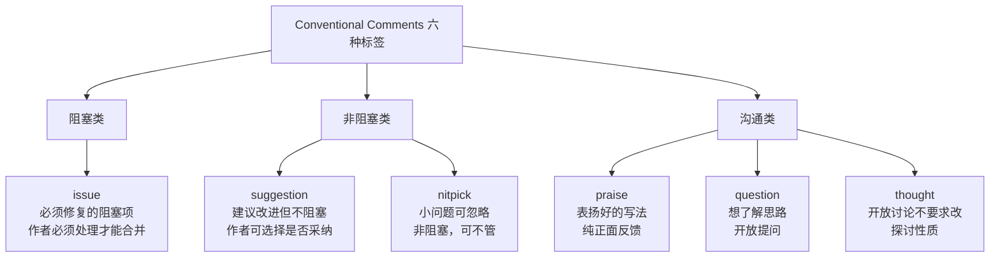

# 【化神·149】Code Review：不只是找Bug

> 码农修仙传 · 化神期 · 第149篇
> 我是玄芯散人，带你从炼气修到大乘。

---

## 境界标识

```
╔══════════════════════════════════════╗
║     化神期 · 第149篇                  ║
║     Code Review                       ║
║     不只是找Bug                        ║
║     评审文化·清单·评论怎么写          ║
║     预计阅读：14分钟                   ║
╚══════════════════════════════════════╝
```

---

## 修仙引入

化神期的宗门里，弟子闭关炼制法宝之后不能直接拿出去用，得先过堂会审。长老和同门围坐一圈，逐一检视法宝的阵纹刻法，灵力回路走向，有没有暗藏走火入魔的隐患。这个过程不是挑刺，是护命。

Code Review 就是工程团队的堂会审。代码写完不能直接合进主干，得让另一个人看过，确认逻辑对，风格统一，没有明显隐患。这件事看起来是找 bug，实际上它承载的东西远比找 bug 多：知识传递，设计共识，质量基线，新人培养，全靠这一道工序撑着。

---

## 硬核主体

### Code Review 的起源

代码审查这件事比多数人以为的古老。1976年，Michael Fagan 在 IBM 发表了一篇论文，提出了正式检查法（Formal Inspection）。做法是拉一组人坐到会议室里，每人分一个角色：作者负责讲解代码，主持人负责控场，审查员负责找问题，记录员负责登记缺陷。开两小时会，逐行过代码，最后输出一份缺陷清单。

Fagan 的数据表明，正式检查能发现约 60% 的缺陷，而单元测试只能发现大约 25%。这个数字在今天看来偏高，因为当年的测试工具远不如现在，但趋势是对的：人眼读代码能发现测试覆盖不到的设计缺陷。



到了 2000 年代，开源运动把审查流程搬到了线上。Linux 内核用邮件列表做 review，提交补丁的人把 diff 发到邮件组，maintainer 逐行回复评论，通过后才能合进分支。Google 内部开发了 Gerrit，把审查做成强制流程：每一笔代码变更叫一个 Change List，必须有至少一个人 LGTM（Looks Good To Me）才能提交。后来 GitHub 把这套东西包装成 Pull Request，成了今天多数开发者接触 Code Review 的入口。

### Review 在做什么

多数人对 Code Review 的理解停留在"找 bug"。这没有错，但只覆盖了三分之一的职责。一个健康的 review 流程同时在干三件事：

找问题。逻辑错误，边界遗漏，安全漏洞，性能隐患。这是最直觉的职责。但实际数据显示，review 发现的问题里，纯 bug 只占一部分，更大比例是可维护性问题：命名不清晰，函数过长，职责混乱，缺少测试。

传递知识。一个人写的代码只有他自己完全理解。review 的过程让第二个人读过这些代码，打破了知识孤岛。如果原作者离职，至少有一个队友对这段代码有印象。大型团队把这个机制制度化：重要模块的 review 轮换着派给不同的人，半年下来每个人都有过手经验。

形成共识。团队的代码风格不是靠文档维护的，是靠 review 一行一行磨出来的。新来的工程师第一次写 `camelCase` 的变量名被指出改成 `snake_case`，第二次就不用提醒了。review 是团队编码标准的执行手段，比写一份没人看的规范文档管用得多。

### Review 的三种姿势

实际工程中的 Code Review 有几种主流形态，各有适用范围。

GitHub Pull Request 是当下最常见的形式。开发者把代码推到一个分支，发起 PR，指定 reviewer。reviewer 在 diff 页面上逐行评论，作者回应并修改，来回几轮后 reviewer 点 approve，PR 合并。这种方式适合中小型变更，Git 原生支持，工具链集成度高。

```yaml
# .github/CODEOWNERS 文件示例
# 每个目录指定默认 reviewer，PR 自动分配
src/payment/     @alice @bob
src/auth/        @charlie
src/frontend/    @david @eve
docs/            @frank
```

Gerrit 的做法不一样。它以单次 commit 为单位审查，每个 commit 是一个独立的 Change。reviewer 可以给每一行代码打分，+1 表示看起来没问题，+2 表示批准提交。一个 Change 需要至少一个 +2 才能合入。Gerrit 的特点是审查粒度极细，适合要求严格的项目，比如 Android 开源项目和 Chromium 的部分模块。

Linux 内核的邮件列表 review 最原始也最实用。你用 `git format-patch` 生成补丁文件，用 `get_maintainer.pl` 脚本查出该文件的相关维护者，然后把补丁以邮件形式发出去。maintainer 会逐行引用你的代码回复评论，你根据评论修改后重新发 `v2` 版本。Linus Torvalds 本人在邮件列表里逐行 review 代码的情形，是内核社区质量控制的日常。

```bash
# Linux内核提交流程
git format-patch -1 HEAD  # 生成最近一个commit的补丁
scripts/get_maintainer.pl 0001-*.patch  # 查出该文件的维护者
git send-email --to=maintainer@kernel.org 0001-*.patch  # 发送补丁
```

三种方式各有侧重。GitHub PR 灵活方便，适合大多数团队。Gerrit 严格可控，适合基础设施级项目。邮件列表透明公开，适合开源社区。选哪种取决于团队规模和项目性质，没有绝对优劣。

### 评审清单

Review 时到底该看什么？凭感觉审容易漏，靠清单可以系统覆盖。下面是一份实用的 review 清单，分成五个方面。

功能正确性。代码做的事情跟需求一致吗？边界条件处理了吗？空输入，超大输入，并发访问。错误路径有测试覆盖吗？这层面是最基本的，但也最容易在 review 中被跳过，因为 reviewer 默认作者已经测过了。

```python
# review时要注意的典型边界问题
def get_items(page, size=20):
    # page=0 或负数怎么办？size=-1呢？
    offset = (page - 1) * size  # page=0时offset=-size，SQL会报错
    return db.query(f"SELECT * FROM items LIMIT {size} OFFSET {offset}")
    # 修正：offset = max(0, (page - 1) * size)
```

安全性。用户输入有没有经过校验？SQL 拼接有没有注入风险？密钥和密码有没有硬编码到源码里？日志里有没有打印敏感信息？安全问题的代价极高，review 是第一道防线。

可读性。变量名是否表意？函数长度是否在合理范围内（一个函数超过 50 行要考虑拆分）？嵌套层次是否太深？注释是否在解释"为什么"而不是"什么"？可读性直接决定维护成本，是最容易被忽略也最该重视的方面。

性能。循环里有没有重复查询数据库？有没有 O(n²) 的算法可以用 O(n) 替代？大对象有没有及时释放？性能问题在测试环境往往暴露不出来，到了生产环境量级一上去就爆。

测试。有没有对应的单元测试？测试覆盖了正常路径和异常路径吗？测试本身有没有断言到位？没有测试的 PR 不应该通过 review，这是底线。

### Conventional Comments：让评论自带分类

Code Review 最容易出问题的地方不在代码，在评论。一句"这里不对"能让作者感到被否定，一句"挺好的"又等于没说。2017 年，一个叫 Conventional Comments 的倡议提出了给评论加标签的方案，让 reviewer 在评论开头标明这条评论的性质：

```text
praise: 这里的错误处理写得很好，考虑了重试和降级
question: 这里用 ArrayList 而不是 LinkedList 是出于什么考虑
suggestion: 建议把这个方法拆成两个，职责更清晰
nitpick: 变量名 tmp 改成 temp 更好（非阻塞，可忽略）
issue: 这里没有判断 null，如果 userId 为空会 NPE
thought: 我在想这个接口以后扩展时参数会不会太多，暂不修改
```

标签的好处是消除歧义。没有标签时，作者分不清这条评论是必须改的阻塞项还是随便说说的想法。有了标签，`issue:` 开头的必须处理，`nitpick:` 开头的可以不管，`thought:` 开头的只是探讨。沟通效率高了不少。



### 好评论和坏评论

看几个真实例子。

坏的评论："这代码不行，重写。"没有说哪里不行，为什么不行，怎么改。作者看到这种评论要么不知道怎么改，要么直接吵起来。

好的评论："`issue: get_user 函数里没有处理 user_id 为 None 的情况，上层调用方传 None 进来会触发 TypeError。建议在函数入口加一个 early return。`"说清了问题在哪，触发条件是什么，后果是什么，怎么修。

坏评论的另一个极端是"轰炸机"式的 review：一口气提了 47 条评论，每条都是 nitpick 级别的命名规范和空格问题。作者看到这个阵势直接关掉 PR 不改了。好的 reviewer 会区分轻重缓急，issue 放在最前面说，nitpick 放在最后或者干脆不提，或者用一条评论汇总所有 nitpick。

还有一种常见问题是 reviewer 把个人偏好当标准。"我喜欢用 switch 不喜欢 if-else"这种评论不应该出现。如果团队的编码规范里没有规定，reviewer 不应该以个人喜好要求作者改。review 的标准是规范和正确性，不是 reviewer 的审美。

### Review 文化怎么建

Review 流程好搭，文化难建。工具链装上 GitHub 就自带 PR review，但让团队认真做 review 需要几个前提。

第一，review 是工作时间的一部分，不是"顺手帮个忙"。如果一个工程师每天要花一小时做 review，这一小时算工时。把 review 当义务劳动，最后的结果是没人认真看，点个 approve 了事。

第二，review 评论对事不对人。"这段代码有问题"和"你写的代码有问题"是两种说法，效果天差地别。用 `issue:` 标签描述代码的问题，不用"你"字开头评价人。这一点看似小事，但决定了团队对 review 的接受度。

第三，作者要主动参与。发 PR 的时候自己先描述清楚这次改了什么，为什么要改，以及有哪些已知的问题还待解决。不要把一个 2000 行的 PR 扔出去就说"帮我看看"。PR 描述里最好包含：

```markdown
## 本PR做了什么
修复了用户注册时邮箱重复校验缺失的问题

## 改动点
- UserService.register() 增加邮箱唯一性校验
- 新增 EmailValidator 类
- 补充3个单元测试

## 已知问题
EmailValidator 目前只校验格式，不校验域名是否存在
后续会加 DNS MX record 查询
```

第四，控制 PR 大小。一个 PR 超过 500 行 diff，reviewer 的注意力会急剧下降。代码审查的心理学实验显示，人眼审代码的可用上限大约在 200-400 行，超过这个范围缺陷发现率断崖式下跌。大改动拆成多个小 PR，每个聚焦一个职责，review 质量会好得多。

第五，别让 review 变成 bottleneck。如果一个 PR 发出去三天没人看，团队的生产力就卡住了。设置 SLA，比如 24 小时内必须有至少一轮 review。如果 reviewer 忙不过来，说明 PR 太多或者 reviewer 太少，这是管理问题不是流程问题。

### AI 辅助 Review

2024 年之后，GitHub Copilot 和 CodeRabbit 这类工具开始自动生成 review 评论，能发现明显的风格问题，也能抓到潜在的安全漏洞。AI review 的用处在于快速过滤掉低层次问题，让人工 reviewer 把精力放在设计逻辑和业务正确性上。

但 AI review 有个陷阱：它会产生大量噪音评论，尤其是对没有标准答案的设计选择给出不需要的"建议"。把 AI review 的结果当作 reviewer 的预筛工具，而不是替代人工 review。真正决定一个 PR 能不能合的，还是人的判断。

---

## 修仙术语对照表

| 修仙术语 | 技术现实 | 本篇位置 |
|---------|---------|---------|
| 堂会审 | Code Review 审查流程 | 修仙引入 |
| 法宝阵纹检视 | 代码逻辑和风格审查 | 修仙引入 |
| 长老围坐审查 | 多人参与 review | 起源段 |
| 正式检查法 | Fagan Inspection | 起源段 |
| 审查员分角 | 主持人/审查员/记录员分工 | 起源段 |
| 邮传补丁 | 邮件列表 review | 三种姿势段 |
| 堂审记录 | 缺陷清单 | 起源段 |
| 法宝过手 | review 传递代码知识 | 在做什么段 |
| 门规行执行 | review 强制编码规范 | 在做什么段 |
| 标签审语 | Conventional Comments | 评论分类段 |
| 阻塞项必须修 | issue 级别评论必须处理 | 评论分类段 |
| 小瑕可忽略 | nitpick 级别评论非阻塞 | 评论分类段 |
| 轰炸机式审 | 大量 nitpick 淹没真正问题 | 好坏评论段 |
| 法宝描述清单 | PR 描述模板 | 文化段 |
| 预筛工具 | AI 辅助 review | AI段 |

---

## 进阶条件

- [ ] 在最近一个月内，你提交的每个 PR 都附有清晰的描述（改了什么，为什么改，已知问题）
- [ ] 你做 review 时使用 Conventional Comments 标签分类，且 issue 和 nitpick 区分清楚
- [ ] 你能列出团队 review 的五个检查方面，且在每次 review 中系统覆盖至少三个
- [ ] 你做过一次超过 200 行 diff 的 review，并能指出其中至少两个可维护性问题
- [ ] 你能区分"个人偏好"和"编码标准"，不在 review 中以个人喜好要求作者修改
- [ ] 你的团队有 review SLA，24 小时内每个 PR 至少有一轮回应
- [ ] 你经历过一次 AI 辅助 review，并能判断哪些 AI 评论有用、哪些是噪音

Code Review 是防止技术债务的第一道防线。最后一篇，我们回到化神期的起点，看看一个化神期工程师到底该具备什么能力。

---

## 下期预告 + 互动

下篇第150篇「化神期毕业：能设计一个完整系统」，讲的是工程师在系统全生命周期中的能力：需求分析，架构设计，实现落地，运维维护。化神期的毕业标准是能不能独立扛住一个系统的全部环节。这是化神期的收尾，也是渡劫前的最后一道考验。

互动问题：

1. 你团队现在做 Code Review 吗？如果不做，最大的阻力是什么？
2. 你收到过的最 helpful 的 review 评论是什么样的？最让人崩溃的呢？

我是玄芯散人，带你从炼气修到大乘。

---

*本文是「码农修仙传」系列第149篇。系列导航见 [xren.ren](https://xren.ren)*
