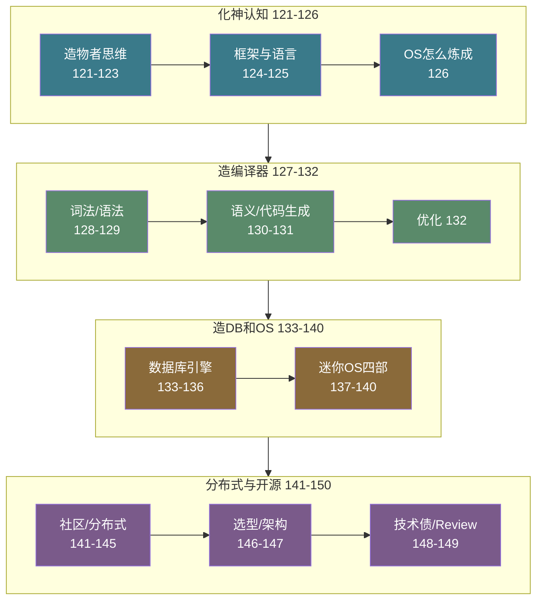
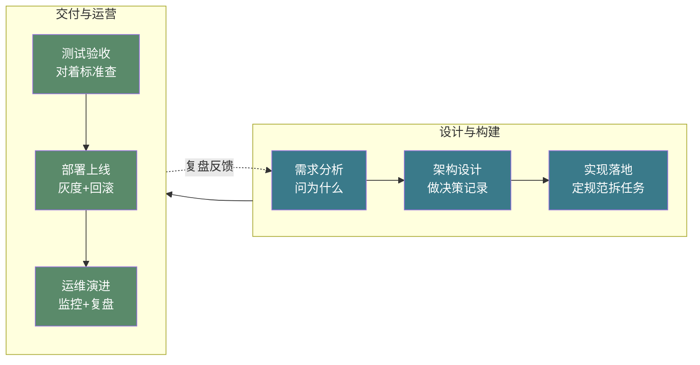
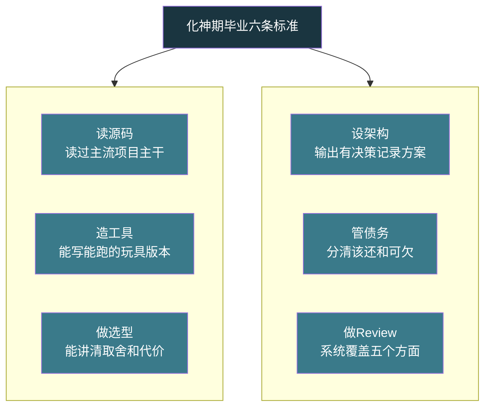

# 【化神·150】化神期毕业：能设计一个完整系统

> 码农修仙传 · 化神期 · 第150篇
> 我是玄芯散人，带你从炼气修到大乘。

---

## 境界标识

```
╔══════════════════════════════════════╗
║     化神期 · 第150篇                  ║
║     化神期毕业                        ║
║     能设计一个完整系统                ║
║     全生命周期·架构决策·毕业标准      ║
║     预计阅读：16分钟                   ║
╚══════════════════════════════════════╝
```

---

## 修仙引入

化神期弟子出宗门之前，掌门会问最后一个问题：给你一块空地，从零开始，你能不能盖起一座能住人的院子？不是搭一个帐篷，不是砌一堵墙，是画出图纸，打好地基，搭好框架，接通水电，装好门窗，最后交钥匙。

这个问题考的不是某一门手艺。前面二十九篇，弟子学了造语言，造编译器，造数据库，造操作系统，造分布式系统。每一门手艺单拎出来都够开一座堂口。但化神期毕业考的不是单科成绩，是综合卷：你能不能把所有手艺串起来，交付一个能跑能维护的系统。

这一篇做两件事：回顾化神期三十篇的知识脉络，然后给出一个系统全生命周期的实战框架。

---

## 硬核主体

### 化神期三十篇回顾：造了哪些轮子

化神期三十篇文章（121至150）分成四组，每一组造一层工具。

第一组化神认知（121到126）讲的是"造物者的思维"。121问创造一门编程语言需要什么，122讲Linus为什么是化神大能，123定义化神期，124讲框架设计的道与术，125讲写代码到造语言，126讲操作系统是怎么炼成的。这六篇回答一个总问题：用工具的人和造工具的人，差别在哪。

第二组造编译器（127到132）拆的是编译器这门手艺。127总览编译器架构，128讲词法分析器，129讲语法分析器，130讲语义分析，131讲代码生成，132讲编译优化。六篇走完一条链路：源代码文本进去，目标汇编出来。中间经过词法分析，语法分析，语义检查，中间表示生成，寄存器分配，指令选择，优化。每一环都是单独的手艺，合在一起就是一门工业。

第三组造数据库和操作系统（133到140）造的是两大基础设施。133讲数据库引擎从零开始有多难，134讲B+树，135讲事务和隔离级别，136讲WAL日志崩溃恢复。然后137到140连写四篇手写迷你操作系统：Bootloader和启动，内存管理，进程调度，Shell和系统调用。数据库和操作系统是软件世界的两根柱子，化神期弟子亲手摸过这两根柱子的内部构造。

第四组分布式与开源（141到150）看的是上层视野。141讲开源社区怎么混，142讲读源码的正确姿势，143讲分布式CAP和Raft共识算法，144讲JIT编译器原理，145讲LLVM Pass开发，146讲技术选型，147讲架构模式，148讲技术债务，149讲Code Review。视角由"造工具"上升到"选工具，用工具，维护工具"。



### 系统全生命周期的六个阶段

化神期毕业考的是"交付一个能跑能维护的系统"。这件事拆开来有六个阶段：需求分析，架构设计，实现落地，测试验收，部署上线，运维演进。每一个阶段都有自己的手艺和坑。

需求分析。多数工程师觉得需求是产品经理的事，但化神期弟子不能这么想。需求文档写得好不好，直接决定后面五步是走大路还是走弯路。需求分析的核心动作是"问为什么"。用户说要一个搜索框，你要问搜索什么数据，多少条，多久更新一次，要不要分词，要不要高亮，要不要权限过滤。每问一层为什么，就离真实需求近一步。不问为什么就开工，大概率做出来的东西跟用户要的不是一回事。

```text
需求分析输出清单：
1. 功能列表（做什么）
2. 非功能需求（性能/可用性/安全/合规）
3. 用户故事（谁在什么场景下做什么）
4. 约束条件（预算/工期/团队能力/技术栈限制）
5. 验收标准（怎么算做完了）
```

架构设计。这一步是化神期的主场。架构设计的输出是一份决策记录：选什么数据库，选什么消息队列，单体还是微服务，同步还是异步，读多还是写多，缓存放不放，索引怎么建。每一个决策都要写清楚选了什么，为什么不选另一个，代价是什么。146篇讲的技术选型六维框架在这里用上：成熟度，团队匹配，社区活跃度，性能，运维成本，退出成本。

```yaml
# 架构决策记录模板（ADR）
title: 选用 PostgreSQL 作为主数据库
date: 2026-09-04
status: accepted
context:
  - 数据量预估：单表5千万行，日增20万
  - 查询模式：读多写少，需要复杂聚合查询
  - 团队熟悉度：3人有PostgreSQL运维经验
decision:
  - 选用 PostgreSQL 16
  - 不选 MySQL：复杂查询性能差距明显
  - 不选 MongoDB：事务一致性要求高
consequences:
  - 需要配置流复制做高可用
  - JSON字段查询性能不如MongoDB，可接受
```

实现落地。设计图纸画好了，开始搬砖。这一步的手艺在工程规范：代码结构怎么分层，接口怎么定义，错误怎么处理，日志怎么打，配置怎么管。化神期弟子在这一步的职责不是自己写完所有代码，是定规范，拆任务，带人一起写。148篇讲的技术债务在这里开始累积：赶工期偷的懒，跳过的测试，硬编码的配置，都会变成以后要还的债。

测试验收。测试不是写完代码之后补几个case，是从需求分析阶段就规划好的。单元测试覆盖函数逻辑，集成测试覆盖模块交互，端到端测试覆盖用户故事。性能测试在真实数据量级下跑，安全测试覆盖注入和越权。验收标准是需求分析阶段定的那五条，一条一条对着查。

部署上线。这一步要回答的问题：灰度策略是什么，回滚方案是什么，监控指标有哪些，告警阈值设多少。没人敢保证第一次上线就完美，灰度发布让问题暴露在5%的流量里而不是全量炸锅。部署脚本要可重入，跑三遍跟跑一遍效果一样。

运维演进。系统上线才是开始，不是结束。运维阶段要做的事：监控大盘，日志检索，故障排查，容量规划，定期复盘，技术债清理。化神期弟子在这个阶段的职责是"让系统活着，并且活得越来越好"。149篇讲的Code Review在这个阶段发挥最大价值：它是防止技术债滚雪球的第一道防线。



图里有一条虚线从"运维演进"绕回"需求分析"。这条线是复盘反馈。系统跑起来之后，运维数据会告诉你需求分析阶段哪些假设是错的。用户实际用法跟设计时猜的不一样，性能瓶颈出在意料之外的地方，容量增长速度跟预估值差三倍。这些反馈修正下一轮需求，形成闭环。

### 一个例子：物联网数据采集平台

把六个阶段串起来走一遍。假设需求是给一家工厂设计设备数据采集系统，300台设备，每台每秒产生一条温度和振动数据，需要在看板上实时展示，历史数据保留一年。

需求分析。300台设备每秒一条，写入速率300条/秒。一年保留期，数据量约95亿条，按每行50字节算约450GB，三副本约1.4TB。查询模式是看板实时展示（最近5分钟）和历史趋势分析（按天/周聚合）。非功能需求：数据不能丢，延迟不超过2秒，7x24运行。

架构设计。写入瓶颈在数据库。95亿条时序数据，用InfluxDB或者TimescaleDB。实时看板用WebSocket推送，历史查询走预聚合。消息中间件用Kafka做缓冲，采集端用MQTT协议。部署用Docker Compose，三台服务器：采集网关，数据存储，前端展示。

```text
采集端（300台设备）
    │ MQTT
    ▼
MQTT Broker（EMQX）
    │ Kafka producer
    ▼
Kafka（缓冲+削峰）
    │ consumer
    ▼
写入服务（Python）
    │ 批量写入
    ▼
TimescaleDB（时序存储）
    │ WebSocket + REST
    ▼
看板前端（Vue3）
```

实现落地。采集端用C写的MQTT客户端，部署在每台设备的网关上。写入服务用Python，消费Kafka消息后批量写入TimescaleDB，每100条或每2秒刷一次。前端用Vue3 + ECharts，WebSocket接实时数据，REST接历史查询。代码分层：采集层，传输层，存储层，展示层，每层之间走接口不走全局变量。

测试验收。单元测试覆盖写入服务的消息解析逻辑。集成测试模拟300个MQTT客户端打流量，验证写入速率和延迟。端到端测试模拟一条数据由采集端到看板展示的全程延迟。性能测试用真实量级跑：每秒300条持续1小时，看TimescaleDB的CPU和磁盘IO。安全测试检查MQTT认证和看板的访问控制。

部署上线。灰度策略：先接10台设备跑一周，验证数据准确性，再扩到50台，100台，最后全量300台。回滚方案：采集端保留本地缓存，MQTT Broker挂了数据不丢。监控指标：MQTT连接数，Kafka积压消息数，写入服务TPS，数据库查询延迟，看板WebSocket连接数。

运维演进。日常运维看监控大盘，关注Kafka积压（消费速度跟不上说明写入服务要扩容），数据库磁盘空间（95亿条约占多少GB），看板WebSocket连接数（太多说明前端有重连风暴）。每周复盘故障，每月做容量规划，每季度清理技术债。

### 化神期毕业的六条标准

综合化神期三十篇的内容，毕业标准可以浓缩成六条：

能读懂开源项目源码。141篇和142篇讲了读源码的姿势。毕业标准是读过至少一个主流开源项目的主干模块，能讲清楚作者解决什么问题，做了什么取舍。

能写出工业级工具。127到132的编译器，133到140的数据库和操作系统，都是造轮子的实例。毕业标准不是造出生产级产品，是能造出一个能跑的玩具版本，并且理解工业级版本和玩具版本的差距在哪。

能做技术选型决策。146篇讲了选型的六维框架。毕业标准是能在两个以上方案中讲清楚为什么选A不选B，代价是什么，什么时候该换。

能设计系统架构。147篇讲了架构模式。毕业标准是能独立完成一个系统的架构设计，输出一份有决策记录的方案，而不是"我觉得应该这么做"。

能管理技术债务。148篇讲了技术债的分类和还债时机。毕业标准是能识别项目里的技术债，分清哪些该立刻还，哪些可以欠着，哪些不能欠。

能做Code Review。149篇讲了Review的方法和文化。毕业标准是能系统地审一个人的PR，覆盖功能正确性，安全性，可读性，性能，测试五个方面，评论用Conventional Comments标签分类。



### 渡劫期在前面等你

化神期毕业不是终点。渡劫期（151到180）讲的是行业与未来。前面四个境界解决的是"怎么做技术"，化神期解决的是"怎么造工具"，渡劫期解决的是"技术人往哪走"。

计算理论，行业认知，AI与未来，技术管理，这四组话题看起来离代码远了，实际上离工程师的命运近了。35岁危机是真的吗？AI会不会取代程序员？RISC-V的机会在哪？大厂还是创业公司？这些问题没有标准答案，但值得每个工程师认真想过。

化神期弟子毕业出关，带着造工具的能力走进渡劫期，要面对的不再是技术问题，是人生选择。

---

## 修仙术语对照表

| 修仙术语 | 技术现实 | 本篇位置 |
|---------|---------|---------|
| 化神期出师考 | 化神期毕业标准考核 | 修仙引入 |
| 造物者的综合卷 | 系统全生命周期交付能力 | 修仙引入 |
| 化神期三十篇回顾 | 四组知识脉络梳理 | 硬核主体 |
| 铸器设计稿 | 架构设计决策记录 | 六个阶段 |
| 搬砖工程规范 | 实现落地的分层和接口规范 | 六个阶段 |
| 过关查验 | 测试验收对标准查 | 六个阶段 |
| 灰度开闸 | 灰度部署策略 | 六个阶段 |
| 运维活着且活得好 | 系统可用性和持续改进 | 六个阶段 |
| 复盘反馈回路 | 运维数据修正需求假设 | 六个阶段 |
| 毕业六条 | 化神期毕业六条标准 | 硬核主体 |
| 渡劫期在前面 | 渡劫期行业认知篇预告 | 硬核主体 |

---

## 突破条件

- [ ] 你读过至少一个主流开源项目的主干模块源码，能讲清楚作者解决什么问题和做了什么取舍
- [ ] 你从零写过至少一个能跑的玩具编译器或数据库或操作系统（80行级别即可，参照127到140篇）
- [ ] 你能在两个以上技术方案中讲清楚选A不选B的理由，且理由覆盖六维框架的至少四个维度
- [ ] 你独立完成过至少一个系统的架构设计，并输出过有决策记录的方案文档
- [ ] 你能识别当前项目中的技术债务，并给出"立刻还"和"可以欠"的分类建议
- [ ] 你做过至少一次系统化的Code Review，覆盖功能/安全/可读性/性能/测试五个方面
- [ ] 你经历过一次覆盖需求至运维全生命周期的项目，独立承担过需求评审至运维复盘的完整链路，并输出过一份架构决策记录

六条全勾，化神期毕业。渡劫期的第一道题，是计算理论。

---

## 下期预告 + 互动

渡劫期开始了。151篇「冯·诺依曼架构」和152篇「图灵机」已发布，本篇之后将推出153篇「信息论：一比特有多大」，讲香农信息熵，数据压缩极限，信道容量，纠错码。造完工具的化神期弟子走进看计算边界的渡劫期，视野由"怎么造"变成"为什么能造"。

互动问题：

1. 回头看化神期三十篇，你觉得哪一组最值，哪一组学得最吃力？
2. 你在工程中经历过"全生命周期"的项目吗？最痛的是哪个阶段？

我是玄芯散人，带你从炼气修到大乘。

---

*本文是「码农修仙传」系列第150篇。系列导航见 [xren.ren](https://xren.ren)*
