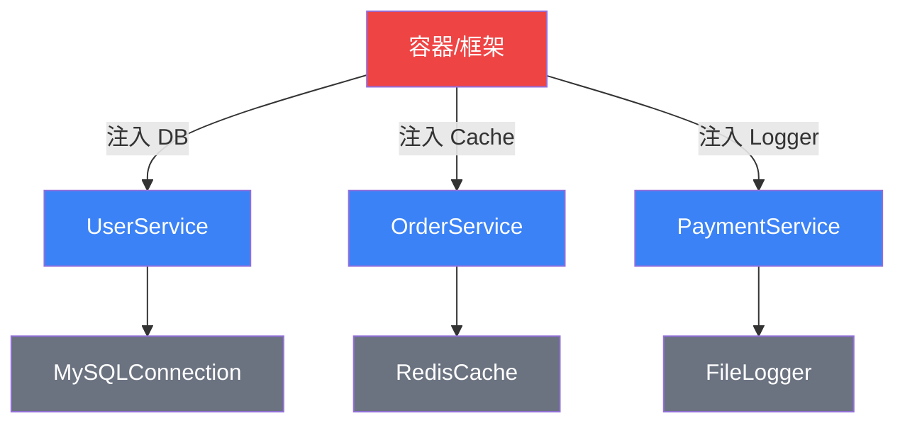
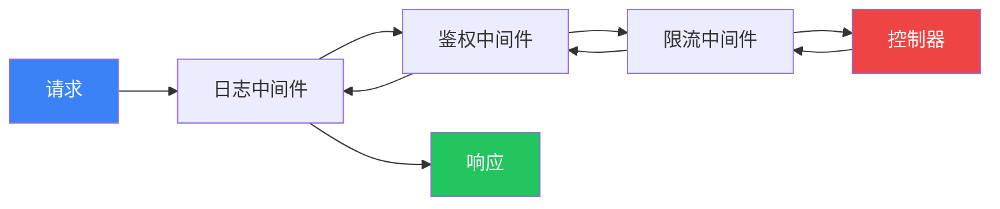

# 【化神·25】框架设计的道与术

> **码农修仙传 · 化神期 · 第25篇**
> 我是玄芯散人，带你从炼气修到大乘。

---

## 境界标识

```
╔══════════════════════════════════╗
║     化神期 · 第25篇              ║
║     框架设计的道与术             ║
║     预计阅读：8分钟               ║
╚══════════════════════════════════╝
```

---

## 修仙引入

你用 Flask 写过 API，用 Vue 写过页面，用 Spring Boot 写过后端。

你觉得框架很神奇——加几行注解就能实现路由，配置一下就有数据库连接池，写个装饰器就能加缓存。

但你是否想过：这些框架是怎么被设计出来的？

修仙小说里，化神期有一个标志：从"用法器"到"炼法器"。你不再只是用别人的框架，你开始理解框架为什么这样设计，甚至能自己造一个。

今天讲框架设计背后的核心原则——道与术。道是设计哲学，术是实现手法。道是心法，术是招式。

---

## 硬核主体

### 框架的本质——控制权的转移

先用一句话说清楚框架和库的区别：

库是你调用它，框架是它调用你。

```python
# 库：你主动调用
import requests
response = requests.get("https://xren.ren")  # 你决定什么时候调用

# 框架：它调用你
from flask import Flask
app = Flask(__name__)

@app.route("/")          # 你注册，框架决定什么时候调用你
def hello():
    return "Hello"
```

这种设计模式叫**控制反转（Inversion of Control, IoC）**——框架设计的核心思想。你不再掌控流程，框架掌控流程，在合适的时机调用你的代码。

修仙类比：库是法器——你拿起来用，用完放下。框架是修炼阵法——你站在阵法里，阵法驱动灵力流转，你只是在关键节点注入灵力。

```mermaid
flowchart LR
 subgraph 库["库（你调用它）"]
 direction TB
 A1[你的代码] -->|调用| B1[库函数]
 B1 -->|返回| A1
 end
 subgraph 框架["框架（它调用你）"]
 direction TB
 B2[框架主循环] -->|回调| A2[你的代码]
 A2 -->|返回| B2
 end

 style A1 fill:#3b82f6,color:#fff
  style B1 fill:#6b7280,color:#fff
  style B2 fill:#ef4444,color:#fff
  style A2 fill:#fbbf24,color:#1a1a2e
 ```

 #### 好莱坞原则——框架的灵魂

 控制反转还有个更接地气的别名：**好莱坞原则（Hollywood Principle）**——"Don't call us, we'll call you"。

 这句话是好莱坞经纪人甩给演员的潜规则：你别成天打电话求角色，有戏的时候我打给你。

 映射到框架世界，意思完全一样——你别主动调用框架，框架在合适的时机反过来调用你。

 听起来只是调换了主语和宾语，但它实际上改变了软件开发的权力结构：

 - **传统编程**：程序员是总指挥，写 `main` 函数、按顺序调用各个模块、控制所有分支
 - **IoC 编程**：框架是中枢，程序员只在节点上登记回调，谁先谁后由框架决定

 这一变，控制权从"代码"手里转移到了"框架"手里。代码不再主动出击，而是被动响应。框架承担了编排、调度、异常处理这些脏活，开发者专注于"当某件事发生时，我要做什么"。

 这种反转带来一个副作用：协作规模指数级上升。

 传统程序里，每个模块都得知道上下游是谁——耦合死死的。IoC 之后，模块只声明"我需要 X"，谁把 X 给我我都收——这是 Rails 有上万个 gem、Spring 有上百万 starter、Django 有上千个 app 的根基。

 修仙类比：传统编程是你自己布阵、自己开阵、自己收阵——累得半死还要操心每一步走位。IoC 是你站在宗门大阵里，阵法宗师把灵力流转安排得明明白白，你只需要在指定的阵眼上注入自己的道。阵法不仅控制灵力走向，还能让你专注修炼，效率自然天差地别。

 容器是怎么跑起来的？来看 IoC 容器的工作流程：

 ```mermaid
 sequenceDiagram
     participant U as 业务代码
     participant C as IoC容器
     participant L as Logger服务
     participant D as DB服务

     Note over U,C: 启动：注册依赖
     U->>C: register("Logger", logger)
     U->>C: register("Database", db)

     Note over U,C: 运行：按需注入
     U->>C: get("UserService")
     C->>L: 注入 Logger
     L-->>C: 实例
     C->>D: 注入 Database
     D-->>C: 实例
     C->>U: 返回组装好的 UserService

     Note over U,C: 业务调用
     U->>L: log("用户登录")
     L-->>U: ok
 ```

 关键看中间那段"按需注入"——容器发现你要 `UserService`，它自动去查 `UserService` 需要 `Logger` 和 `Database`，再去查这两个要不要别的依赖……这样递归到全部就绪为止。你写的代码完全不知道这棵对象树是怎么搭起来的，只管伸手拿。控制反转 + 依赖注入的合体，就体现在这里。

 ---

 ### 道：框架设计的四大原则

#### 原则一：约定优于配置（Convention over Configuration）

Rails 的核心理念：框架有默认约定，你遵循约定就不用配置。只有偏离约定时才需要额外配置。

```python
# Flask 的扩展机制：你注册蓝图，不改框架代码
from flask import Blueprint

user_bp = Blueprint("users", __name__, url_prefix="/api/users")

@user_bp.route("/")
def list_users():
    return [...]

app.register_blueprint(user_bp)  # 注册扩展，不改Flask源码
```

修仙类比：功法有标准经脉路线，按标准走就行。只有你想走偏门（自定义）时，才需要额外标注灵力走向。

#### 原则二：开闭原则（Open-Closed Principle）

框架对扩展开放，对修改关闭。你可以加新功能，但不需要改框架源码。

```python
# ❌ 紧耦合：直接创建依赖
class UserService:
    def __init__(self):
        self.db = MySQLConnection("localhost", "root", "123")  # 写死了

# ✅ 依赖注入：从外部接收依赖
class UserService:
    def __init__(self, db: Database):  # 抽象接口，不关心具体实现
        self.db = db

# 框架/容器负责注入
service = UserService(MySQLConnection(...))
```

修仙类比：阵法留好了"灵力接口"（扩展点），你可以往接口里注入新的灵力属性（插件），但不需要重新布阵（改源码）。

#### 原则三：依赖注入（Dependency Injection）

不要在代码里直接创建依赖，让外部（框架/容器）注入。

```python
# Python 装饰器收集路由信息
routes = {}

def route(path):
    def decorator(func):
        routes[path] = func    # 框架用"反射"收集所有路由
        return func
    return decorator

@route("/api/hello")
def hello():
    return "Hello"

# 框架启动时扫描所有注册的路由，建立路由表
# Flask/Django 路由的核心原理就是这种装饰器反射
```

修仙类比：你修炼时需要法器，但你不自己炼——你告诉宗门"我需要一把剑"，宗门给你什么剑你都能用。换把刀也能战斗，因为你的功法不绑死具体法器。



#### 原则四：关注点分离（Separation of Concerns）

框架把不同关注点分到不同层：路由层、业务层、数据层、展示层。每层只管自己的事。

```
请求进来 → 路由层（匹配URL）→ 中间件层（鉴权/日志）→ 控制器层（参数校验）→ 业务层（核心逻辑）→ 数据层（DB操作）→ 响应层（格式化输出）
```

修仙类比：修炼体系分层——炼气期管基础、筑基期管地基、金丹期管系统。每一境界只管自己的事，不越界。框架也一样，路由层不管数据库怎么查，业务层不管HTTP状态码。

---

### 术：框架的核心实现手法

#### 手法一：中间件模式——功法叠加

```javascript
// Express/Koa 的中间件洋葱模型
async function logger(ctx, next) {
    console.log(`→ ${ctx.url}`);
    await next();           // 交给下一层
    console.log(`← ${ctx.status}`);
}

async function auth(ctx, next) {
    if (!ctx.headers.token) {
        ctx.status = 401;
        return;              // 不调用next，链路终止
    }
    await next();
}

// 请求经过中间件链：logger → auth → controller → auth → logger
app.use(logger);
app.use(auth);
```

修仙类比：中间件就像功法叠加——先穿护甲（日志），再开护盾（鉴权），最后出招（控制器）。响应时反向卸装。



#### 手法二：生命周期钩子——天道节律

框架定义了生命周期，你在特定阶段注册回调。

```javascript
// Vue 组件生命周期
export default {
  created() { /* 组件创建，还没挂载DOM */ },
  mounted() { /* DOM挂载完成 */ },
  updated() { /* 数据更新后 */ },
  unmounted() { /* 组件销毁前 */ }
}
```

修仙类比：框架的天道节律——筑基时要过心魔劫，金丹时要过结丹劫。你不需要知道劫什么时候来，只要在劫来时准备好（注册回调）。

#### 手法三：反射与元数据——天道之眼


修仙类比：装饰器就像在天道法则上刻了符文（元数据），框架启动时用天眼扫一遍，把所有带符文的功法收集起来，建立索引。

---

#### 实战：50 行 Python 写一个迷你 HTTP 框架

原则讲了一堆，不如动手写一个。下面 50 行的微型框架，浓缩了**路由注册、中间件链、依赖注入**三大思想：

```python
import re

class Container:
    """IoC 容器：管理所有服务的生命周期"""
    def __init__(self):
        self._services = {}            # 接口名 -> 实例

    def register(self, name, instance):
        self._services[name] = instance

    def resolve(self, name):
        return self._services.get(name)

class Framework:
    """框架主体：路由 + 中间件 + 依赖注入"""
    def __init__(self):
        self.routes = []               # (正则, handler) 列表
        self.middlewares = []          # 中间件列表
        self.container = Container()

    def route(self, pattern):
        """路由装饰器：把路径和函数关联起来"""
        def decorator(func):
            self.routes.append((re.compile(f"^{pattern}$"), func))
            return func
        return decorator

    def use(self, mw):
        """注册中间件（护甲）"""
        self.middlewares.append(mw)

    def _run_chain(self, req, idx=0):
        """中间件洋葱模型：递归穿过去"""
        if idx >= len(self.middlewares):
            return None
        ctx = {"req": req, "container": self.container}
        nxt = lambda: self._run_chain(req, idx + 1)
        return self.middlewares[idx](ctx, nxt)

    def dispatch(self, method, path, body=b""):
        """框架主循环：控制权的核心所在"""
        for pattern, handler in self.routes:
            if pattern.match(f"{method} {path}"):
                # 依赖注入：扫类型注解自动注入
                deps = {n: self.container.resolve(c)
                        for n, c in handler.__annotations__.items()
                        if n != "return"}
                return handler(body, **deps)
        return b"404 Not Found"

# —— 业务代码 —— 你在这里写"被调用"的代码
app = Framework()

# 注册依赖（宗门给法器）
app.container.register("Logger",
                       lambda msg: print(f"[LOG] {msg}"))
app.container.register("Database",
                       {"host": "xren.ren", "db": "main"})

# 中间件：日志护甲
def logger_mw(ctx, nxt):
    ctx["container"].resolve("Logger")(f"REQ {ctx['req']}")
    nxt()
app.use(logger_mw)

# 路由 + 自动依赖注入
@app.route(r"GET /api/hello")
def hello(req, Logger, Database):
    Logger(f"hello 调用 db={Database['db']}")
    return b'{"msg":"hi from framework"}'

# —— 框架驱动 —— 控制权在这里
if __name__ == "__main__":
    print(app.dispatch("GET", "/api/hello"))
```

这个骨架覆盖了三个最核心的机制：

- **路由注册** —— `@app.route(r"GET /api/hello")` 把路径和函数挂钩，框架决定何时调用
- **中间件** —— `app.use(logger_mw)` 像套上护甲，所有请求自动穿过去再穿回来
- **依赖注入** —— handler 用类型注解声明需要什么，框架从容器自动取出来注入

跑起来后，流程是这样：请求 `GET /api/hello` 进来 → 框架的 `dispatch` 接管 → 扫描路由表匹配 → 调用中间件链 → 从容器取 Logger、Database → 注入到 handler → 执行你的业务函数。

注意关键点：handler 不知道请求从哪来、不知道依赖是谁创建的、不知道前面跑了什么中间件。它只知道"我被调用了，参数都准备好了"。**控制反转的精髓全在这里**——你的代码是被动响应的那一方，框架才是编排一切的中枢。

修仙类比：这个迷你框架就是你的随身小阵。注册路由 = 在阵盘上刻好阵眼；中间件 = 套在身上的护甲和法器；依赖注入 = 宗门按需求自动配发的修炼资源。你只管在阵眼里施法，阵法自动运转。

---

### 从用框架到造框架——你的化神之路

| 阶段 | 修仙类比 | 技术能力 |
|------|---------|---------|
| 用框架 | 用别人炼好的法器 | 会用 Flask/Django/Vue |
| 读框架 | 研究法器的炼制方法 | 读懂框架源码 |
| 改框架 | 修补法器 | 写插件/中间件/扩展 |
| 造框架 | 自己炼制法器 | 设计并实现自己的框架 |

化神期的标志是第四阶段——造框架。不需要你造一个比 Spring 更强的框架，但你需要能设计一个解决特定问题的微型框架。

一个判断自己有没有到化神期的简单方法：拿起一个你用了三年的框架，问自己"如果从零开始写，我能写出它的核心骨架吗？"如果答案是"能，大概知道路由怎么注册、中间件怎么串、依赖怎么注入"，那你到化神了。如果答案是"只知道怎么配置，内部怎么跑的一团黑"，那还差一步，回去读源码。

比如：
- 写一个 100 行的 HTTP 路由框架
- 写一个简单的 ORM
- 写一个插件系统

这些练习会逼你理解控制反转、依赖注入、中间件等核心概念。不是用它们，是理解它们为什么被设计出来。

很多初学者觉得框架"魔法"太多，其实拆开看，框架的核心就两件事：注册和调用。注册是你把代码告诉框架，调用是框架在合适的时机执行你的代码。Django 的 `urlpatterns` 是注册，WSGI handler 是调用。Flask 的 `@app.route` 是注册，werkzeug 的 dispatch 是调用。Spring 的 `@Component` 是注册，ApplicationContext 的 `getBean` 是调用。换个语言、换一个生态，骨架一模一样。

到了化神期，你应该能透过框架的 API 看到这层骨架，而不是被各种配置文件和约定吓住。

一个反直觉的事实：越是"好用"的框架，内部越复杂。Django 的"自动 Admin"看起来像魔法，但打开 `django.contrib.admin` 的源码，你会发现它就是一个 ModelForm 工厂 + URL 路由 + 模板渲染的组合，每一个环节都是你能自己写出来的东西。Spring 的 `@Autowired` 看起来像注解黑魔法，但打开 ApplicationContext 的 refresh 方法，它就是在遍历所有 Bean 定义，发现 `@Autowired` 就从容器里找对应类型的实例塞进去。框架不是魔法，是勤奋的程序员帮你写好的模板代码。化神期，你要成为那个写模板代码的人。

---

## 修仙术语对照表

| 修仙术语 | 技术现实 | 本篇详解 |
|---------|---------|---------|
| 炼法器 | 设计框架 | 全篇主线 |
| 法器 | 框架/库 | §框架的本质 |
| 修炼阵法 | 框架运行时 | §框架的本质 |
| 控制反转 | IoC | §框架的本质 |
| 标准经脉路线 | 约定优于配置 | §原则一 |
| 灵力接口 | 扩展点 | §原则二 |
| 宗门给法器 | 依赖注入 | §原则三 |
| 功法叠加 | 中间件模式 | §手法一 |
| 天道节律 | 生命周期钩子 | §手法二 |
| 天道符文 | 装饰器/元数据 | §手法三 |

想查全系列术语？看[术语词典](/glossary)。

---

## 突破条件

化神期 → 渡劫期的突破：

- [ ] 读完过一个框架的核心源码（Flask/Express/Vue任选）
- [ ] 能解释IoC、DI、中间件、生命周期钩子的原理
- [ ] 自己写过一个小型框架或库（100行以上）
- [ ] 能在白板上画出请求从进入到响应的完整链路
- [ ] 开始思考"这个框架为什么这样设计"而不只是"怎么用"

> 当你不再问"这个框架怎么用"，而是问"如果是我，会怎么设计"——恭喜，化神的灵觉已经苏醒。

---

## 下期预告 + 互动

> 下一篇：【渡劫·26】冯·诺依曼架构
>
> 化神期讲完了。接下来进入渡劫期——回到计算机的起源。
> 冯·诺依曼在1945年提出的架构，统治了计算机80年。
> 为什么这个架构如此强大？它有什么根本缺陷？
> 渡劫期带你回到文明的起点。

现在问你：

> 🎮 挑战：你用过哪些框架？能说出它们的IoC体现在哪里吗？
>
> 💬 话题：如果让你造一个框架解决你日常工作中的某个痛点，你会造什么？
>
> 🔔 关注玄芯散人，下一篇带你回到计算机的创世时刻。

> 我是玄芯散人，带你从炼气修到大乘。

---

*本文是「码农修仙传」系列第25篇。系列导航见 [xren.ren](https://xren.ren)*
