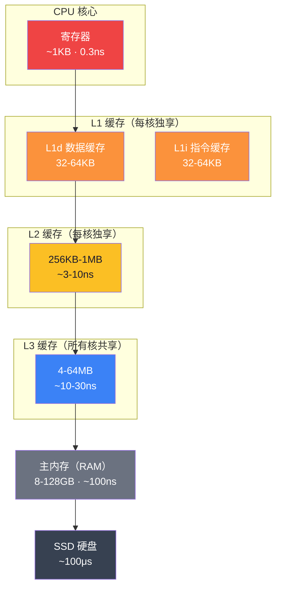
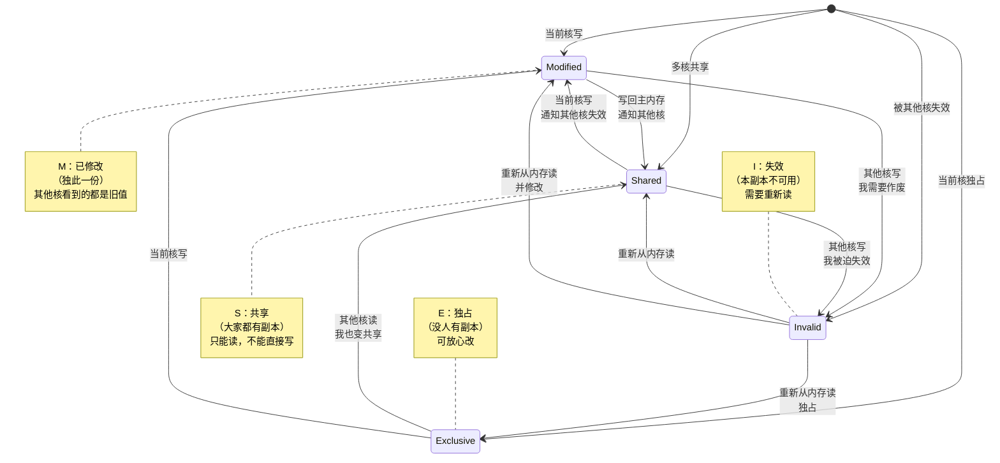
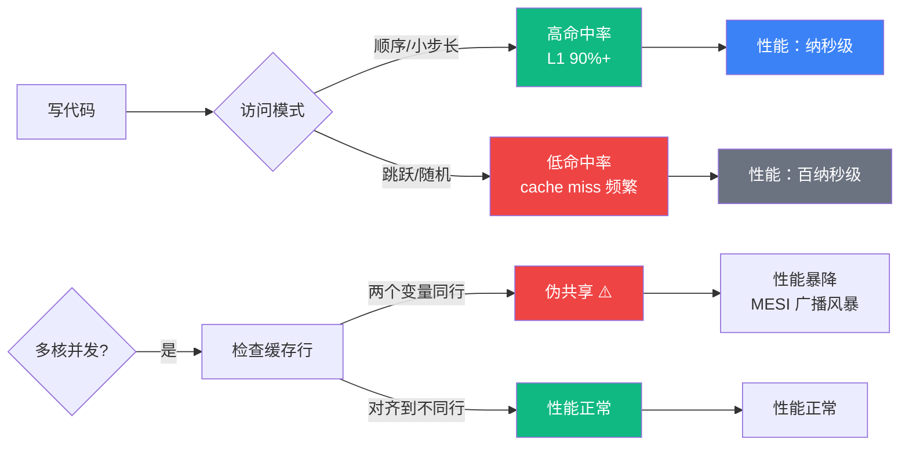

# 【金丹·76】CPU缓存三层塔

> **码农修仙传 · 金丹期 · 第12篇**
> 我是玄芯散人，带你从炼气修到大乘。

---

## 境界标识

```
╔══════════════════════════════════╗
║     金丹期 · 第12篇               ║
║     CPU缓存三层塔                  ║
║     预计阅读：12分钟              ║
╚══════════════════════════════════╝
```

---

## 修仙引入

你的代码跑得慢，第一反应是什么？换算法？升级服务器？换个更快的语言？

都不对。

99% 的"性能问题"，根源不在算法，而在灵气传导路径——CPU 拿数据的快慢。修真界里，跨境界传功要损耗三成灵力；CPU 跨层取数据，损耗的可不止三成——L1 缓存命中是 1 纳秒，命中主内存是 100 纳秒，差 100 倍。

慢，是因为你的代码天天在"跨境界取灵气"。

筑基期讲过寄存器/缓存/内存三层丹田。金丹期我们要杀进缓存塔内部——看看 L1/L2/L3 三层塔是怎么分工的，缓存行（Cache Line）到底是什么，多核为什么会出现"伪共享"这种灵异事件。

讲完这篇，你写代码时会下意识想：这段数据，是放在 L1 里访问，还是天天跑回主内存？

这就叫金丹期的"用芯"。

---

## 硬核主体

### 缓存塔结构——三层修炼塔的分工

CPU 内部的存储塔，是一座倒金字塔：越靠近塔尖（CPU 核），容量越小、速度越快；越靠近塔底（主内存），容量越大、速度越慢。



关键结论：

| 层级 | 容量 | 延迟 | 修仙类比 |
|------|------|------|----------|
| 寄存器 | ~1KB | 0.3ns | 丹田（随身携带） |
| L1 | 32-64KB | 1ns | 贴身储物袋（伸手可取） |
| L2 | 256KB-1MB | 3-10ns | 修炼密室（走动几步） |
| L3 | 4-64MB | 10-30ns | 门内库房（去取要走段路） |
| 主内存 | GB 级 | 100ns | 城外灵石矿（出城采一趟） |
| SSD | TB 级 | 100μs | 北域灵石库（千里迢迢） |

注意一个反直觉的事实：L1 只有 32-64KB。这是什么概念？一本小说 txt 文件都不止 64KB。你的整个项目编译产物，根本塞不进 L1。

那 CPU 怎么用这么小的缓存？靠**缓存行（Cache Line）**——缓存的最小搬运单位是 64 字节。

```c
// 缓存行例子：现代 CPU 通常 64 字节
// 也就是说，哪怕你只读 1 个 int（4字节），CPU 也会把周围 64 字节
// 整块搬到缓存里——它赌你"接下来会访问附近的数据"
int arr[16];  // 64 字节，刚好填满一个缓存行
```

下一节要讲的**局部性原理**就回答了这个问题：CPU 赌你能用上，它几乎每次都赌对。

---

### 命中与未命中——修炼效率的百倍差距

缓存的工作只有两种状态：**命中（Hit）** 和 **未命中（Miss）**。

- 命中：数据已经在缓存里，CPU 直接取，1 纳秒搞定。
- 未命中：数据不在缓存里，CPU 只能去下一层拿——L1 miss 就去 L2，L2 miss 就去 L3，L3 miss 就去主内存。这个下探过程叫 cache miss，是要付"过路费"的。

```c
// 演示：完全相同的运算，命中率不同 → 性能天差地别
#include <time.h>
#include <stdio.h>

int main() {
    // 场景 A：顺序访问（缓存友好）
    int arr[8192] = {0};
    clock_t start = clock();
    long sum = 0;
    for (int i = 0; i < 8192; i++) {
        sum += arr[i];  // 每次访问都在刚搬进来的缓存行里 → 全命中
    }
    printf("顺序访问：%ld, 耗时 %ld\n", sum, clock() - start);

    // 场景 B：跳跃访问（缓存杀手）
    start = clock();
    sum = 0;
    for (int i = 0; i < 8192; i += 16) {  // 步长 16，每次跳一个缓存行
        sum += arr[i];  // 每次都要 cache miss，触发一次 64 字节搬运
    }
    printf("跳跃访问：%ld, 耗时 %ld\n", sum, clock() - start);
    return 0;
}
```

一个直觉数字：L1 命中率 95% 和 90% 的程序，性能能差 2 倍。这不是玄学，是缓存塔的物理规则。

修炼类比：修炼密室里放着三种灵材，A 案台随手可取（命中），B 需要走到隔壁（命中 L2），C 得到城外矿脉去拉（未命中）。密室设计得再好，你去取 C 的次数多了，修炼速度照样上不去。

性能优化的本质：减少去城外矿脉的次数。

---

### 局部性原理——CPU 为什么能赌对

CPU 敢用 64KB 的小缓存扛起整个程序，是因为程序的访问行为有规律。计算机科学家总结出两个规律，叫**局部性原理（Principle of Locality）**：

**时间局部性（Temporal Locality）**：刚访问过的数据，大概率马上会再访问。

```c
int sum = 0;        // sum 反复被用 → 留在 L1
for (int i = 0; i < 1000000; i++) {
    sum += arr[i];  // arr[i] 一次访问，循环体重读一遍 → 命中
}
```

修仙类比：你在修炼一部功法，关键心法口诀会反复默念。念过一遍后把它抄在袖中（缓存），再调用就不用回到记忆深处（主内存）。

**空间局部性（Spatial Locality）**：访问了 a[0]，大概率接下来访问 a[1]。

```c
// 数组按行遍历 → 命中率高（元素在内存中连续）
for (int i = 0; i < N; i++) {
    for (int j = 0; j < M; j++) {
        sum += matrix[i][j];  // C 语言按行存储，j+1 就在下一个 4 字节
    }
}

// 数组按列遍历 → 命中率低（跳跃式访问）
for (int j = 0; j < M; j++) {
    for (int i = 0; i < N; i++) {
        sum += matrix[i][j];  // 每次跳 N*4 字节，可能跨多个缓存行
    }
}
```

修仙类比：功法典籍摆在架上，你读到第 3 章第 5 页，大概率接下来翻第 6 页（空间局部性）。所以文阁管理会把相关章节放在同一层书架——挨着放，调用时不用反复跑。

这两个原理是缓存塔得以存在的根基。如果程序访问毫无规律，缓存就是废物。很多性能差的应用，问题就在"访问毫无规律"——数据到处跳，CPU 永远在搬运缓存行，永远到不了 L1。

---

### MESI 协议——多核修炼不冲突

进入多核时代，缓存塔多了一个副本：每个核都有自己的 L1/L2，但 L3 是共享的。

问题来了：两个核同时读了同一份数据（缓存行），一个核改了，另一个核不知道——它本地的副本还是旧值。这就是**缓存一致性（Cache Coherence）** 问题。

修真界里，这叫"两脉弟子用了同一件灵器，消息不一致"。

解决方案是 **MESI 协议**——缓存行有四种状态：



四种状态简记：

| 状态 | 含义 | 修仙类比 |
|------|------|----------|
| **M**odified | 我改了，我独占 | 我重新炼制了一件灵器，原件已毁 |
| **E**xclusive | 我独占，没人动过 | 我有这件灵器，库房只有我有 |
| **S**hared | 多人都持有 | 师兄弟各持一份副本 |
| **I**nvalid | 我这份已经过期 | 我的副本已毁，必须重新取 |

关键规则：任何写操作前，缓存行必须先变成 Exclusive 或 Modified。如果是 Shared，写之前要广播"我要改了"，其他核把副本置为 Invalid。然后写者获得独占权。

修真类比：师兄弟三人都借了同一本功法抄本，师兄说"我要改这一页"，他必须先传讯给两位师弟："把你们的副本撕掉（Invalid）"。然后他改完，成为唯一一持有有效版本的人（Modified）。下次师弟们要看，就得去他那里重新抄（重新加载）。

这套机制保证：任何时候，所有核看到的同一份数据是一致的。代价是跨核通信很贵——一次广播可能要几十到几百纳秒，比 L1 命中慢 50 倍。

---

### 伪共享——藏在 MESI 背后的小偷

故事讲到这里，本来一切正常。但有个魔鬼藏在细节里——**伪共享（False Sharing）**。

它是这样发生的：

```c
// 假设缓存行 64 字节 = 16 个 int
struct Counters {
    int counter_a;   // 偏移 0-3
    int counter_b;   // 偏移 4-7
    // 中间还有 56 字节没用
};
```

`counter_a` 和 `counter_b` 看起来各住各的格子，但它们在同一间 64 字节的客房（缓存行）里。

现在两个线程分别跑在两个核上：

- 核 1 写 `counter_a`
- 核 2 写 `counter_b`

MESI 看到的是："缓存行要变 Exclusive 才能写"。于是核 1 写之前，广播"核 2，把这一行失效"。核 2 写之前，广播"核 1，把这一行失效"。两个核根本没用对方的变量，但缓存行在两个核之间疯狂来回踢。

这就是伪共享——逻辑上没共享，物理上被强制共享。

修真类比：甲弟子修《清风诀》，乙弟子修《明月诀》，本不相干。但两人住在同一间修炼室（缓存行），一方运功吐纳，整间修炼室的气场都要重置——另一方也被迫中断。重置几万次，谁都修炼不成。

```c
// 伪共享示例：慢
struct BadCounters {
    int counter_a;   // 偏移 0
    int counter_b;   // 偏移 4  ← 同一缓存行！
};

// 修复：缓存行对齐 → 让两个变量各占一个缓存行
struct alignas(64) GoodCounters {
    int counter_a;
    char pad[60];    // 填充，让 b 落在下一个缓存行
    int counter_b;
};

// 高并发下，GoodCounters 可以比 BadCounters 快 5-10 倍
```

这是为什么 `Java ConcurrentHashMap` 内部用 `long padding[]` 填充；Go 的 `runtime` 里有大量 `// noCopy` 加对齐的结构体；Linux 内核的 `struct page` 字段都要小心排布——**都是被伪共享坑过的人。**

来一段实战对比，自己也可以跑跑：

```c
// 两个线程，各对一个字段做 1 亿次自增
#include <pthread.h>
#include <time.h>
#include <stdio.h>

struct Bad      { int a; int b; };                       // 同一缓存行
struct Good     { int a; char pad[60]; int b; };          // 跨缓存行
volatile int sink = 0;

void* worker(void* arg) {
    int* p = (int*)arg;
    for (long i = 0; i < 100000000L; i++) (*p)++;
    return NULL;
}

int main() {
    pthread_t t1, t2;
    struct Bad bad = {0};
    struct Good good = {0};

    clock_t s = clock();
    pthread_create(&t1, NULL, worker, &bad.a);
    pthread_create(&t2, NULL, worker, &bad.b);
    pthread_join(t1, NULL); pthread_join(t2, NULL);
    printf("Bad  (伪共享):  %ld ms\n", (clock() - s) * 1000 / CLOCKS_PER_SEC);

    s = clock();
    pthread_create(&t1, NULL, worker, &good.a);
    pthread_create(&t2, NULL, worker, &good.b);
    pthread_join(t1, NULL); pthread_join(t2, NULL);
    printf("Good (对齐):    %ld ms\n", (clock() - s) * 1000 / CLOCKS_PER_SEC);
    return 0;
}
```

实际跑下来，Good 版本通常比 Bad 版本快 3-8 倍——差别大到让人怀疑人生。"调字段顺序"这种事，是有真功夫在里面的。

---

### 一把量天尺——怎么测出你的缓存命中率

修仙者要内观，程序员要 profiling。几个工具能让你"看见"缓存塔：

```bash
# Linux perf：直接看 cache miss 率
perf stat -e cache-misses,cache-references ./your_program
# 输出：  1,234,567  cache-misses    # 错过缓存的次数
#         98,765,432 cache-references # 总访问次数
#  命中率 = 1 - 1234567/98765432 ≈ 98.7%

# Valgrind cachegrind：模拟缓存，统计每次 miss
valgrind --tool=cachegrind ./your_program
# 输出 L1 miss rate, L2 miss rate 等

# perf record + 火焰图：看哪个函数 miss 多
perf record -g ./your_program
perf script | flamegraph.pl > cache.svg
```

修真类比：这些就是"内视之术"——不开膛破肚，直接照见灵气走哪条经脉、哪里堵住了。

实战经验：一个计算密集的程序，cache miss 率应该低于 5%。如果你看到 20% 以上的 miss 率，第一反应不是换算法，而是重排数据布局。

---

### 你写代码时应该养成的三个习惯

1. 优先顺序访问数组：`for (i=0; i<n; i++)` 永远比 `for (i=0; i<n; i+=16)` 友好。
2. 结构体字段按"热冷"分组：频繁一起访问的字段挨着；冷数据用 `__attribute__((cold))` 或单独放。
3. 多线程下做"对齐填充分割"：每个线程独享的变量，强制占满一个缓存行（64 字节），别让邻居打扰。

这三个习惯，比二十种算法优化都管用。

---

### 用一张图看清这一切



性能优化的内存三板斧：

1. 顺序访问——用好空间局部性
2. 数据紧凑——把同时访问的数据放在同一缓存行
3. 缓存行对齐——把不同时访问的变量分开到不同缓存行

---

## 修仙术语对照表

| 修仙术语 | 技术现实 | 本篇详解 |
|---------|---------|---------|
| 三层修炼塔 | L1/L2/L3 缓存层级 | §缓存塔结构 |
| 城内灵气 | 寄存器 | §缓存塔结构 |
| 贴身储物袋 | L1 缓存 | §缓存塔结构 |
| 门内库房 | L3 缓存 | §缓存塔结构 |
| 城外灵石矿 | 主内存 RAM | §缓存塔结构 |
| 缓存行 | Cache Line（64 字节） | §缓存塔结构 |
| 命中 | Cache Hit | §命中与未命中 |
| 未命中 | Cache Miss | §命中与未命中 |
| 时间局部性 | Temporal Locality | §局部性原理 |
| 空间局部性 | Spatial Locality | §局部性原理 |
| 师兄弟借灵器 | 多核访问同一缓存行 | §MESI 协议 |
| 传讯撕副本 | MESI Invalid 广播 | §MESI 协议 |
| 修炼室灵气重置 | 伪共享（False Sharing） | §伪共享 |
| 缓存行对齐 | Cache Line Padding | §伪共享 |

---

## 突破条件

要真正吃透 CPU 缓存塔，跨入金丹大成：

- [ ] 能说出 L1/L2/L3 的容量、延迟差异，并解释为什么是金字塔结构
- [ ] 能解释 Cache Line 的概念（64 字节）和它的意义
- [ ] 理解时间局部性、空间局部性，能识别代码中是否违反
- [ ] 能解释 MESI 协议的四种状态转换
- [ ] 知道什么是伪共享，能写代码修复（缓存行对齐）
- [ ] 看到性能瓶颈时，会先怀疑数据访问模式，再怀疑算法

> 达成这六项，缓存塔就在你心里了。下次写代码，你下意识会想"这段数据有没有踩在 L1 上"，这是金丹期该有的"内景观察"。

---

## 下期预告 + 互动

> **下一篇：【金丹·13】线程模型与并发真相**

CPU 缓存是单个核的事。一旦多个核心、多个线程同时跑，复杂度直接翻倍——并发不只是"一起干活"，更是"抢资源、互相干扰、还要保证不出错"。

下篇讲：

- 并发 vs 并行——分身术和群殴的区别
- 三种线程模型——1:1、N:1、M:N
- 并发三毒——竞态 / 死锁 / 饥饿
- 锁的家族——互斥锁、自旋锁、读写锁
- 无锁编程——CAS 原子操作

现在问你：

> 🎮 **缓存测速**：你写 C/Go/Rust 时，有没有遇到过"算法没变，改了结构体字段顺序就快了 5 倍"的诡异经历？评论区聊聊你的"伪共享翻车现场"。
>
> 💬 **话题**：你平时写代码，会下意识考虑缓存命中率吗？还是只到"能用就行"？聊聊你的取舍。
>
> 🔔 关注玄芯散人，金丹不迷路。下一篇带你拆穿并发编程的真相。

> 我是玄芯散人，带你从炼气修到大乘。

---

*本文是「码农修仙传」系列第76篇。系列导航见 [xren.ren](https://xren.ren)*
