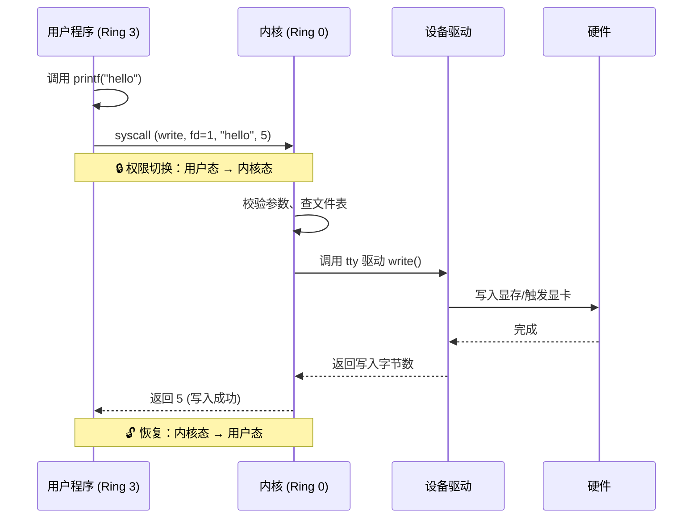
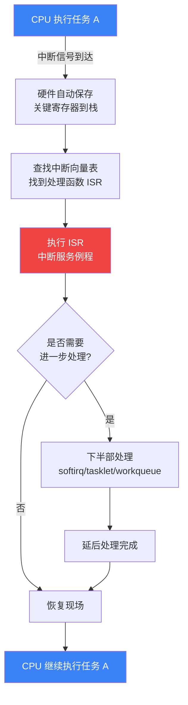
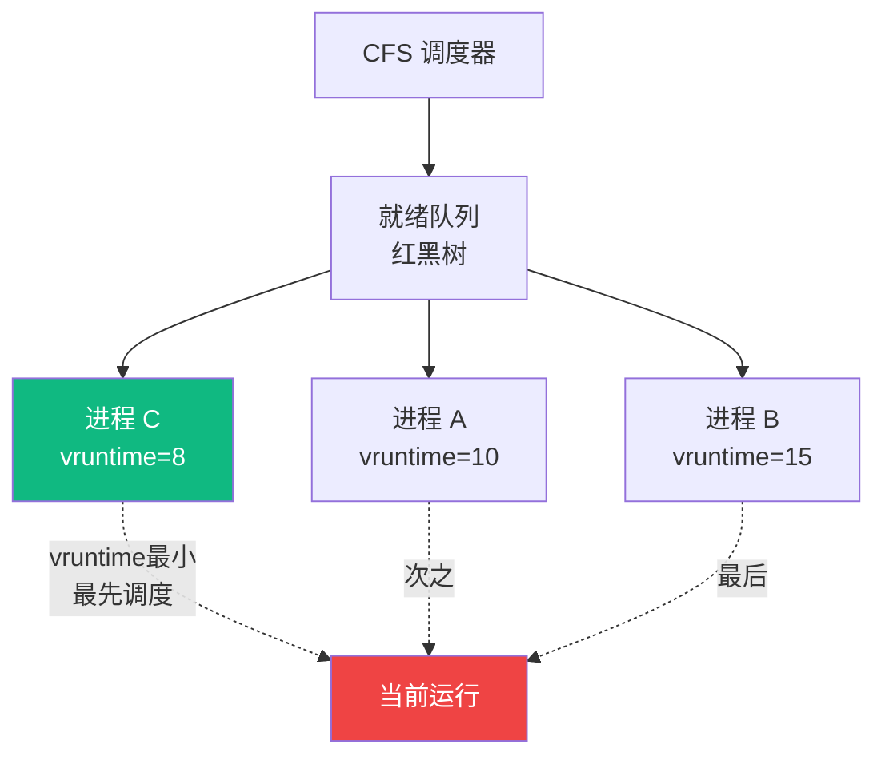

# 【金丹·10】操作系统内核是天道规则

> **码农修仙传 · 金丹期 · 第10篇**
> 我是玄芯散人，带你从炼气修到大乘。

---

## 境界标识

```
╔══════════════════════════════════╗
║     金丹期 · 第10篇              ║
║     操作系统内核是天道规则        ║
║     预计阅读：12分钟              ║
╚══════════════════════════════════╝
```

---

## 修仙引入

筑基期你知道了：操作系统是天道规则——它管着硬件的灵气（CPU、内存、磁盘），决定谁先修炼（进程调度），谁能在哪块灵脉上挖矿（内存分配）。但筑基只是远远看了一眼天道运转的整体轮廓。

金丹期要做的事，是钻进天道规则内部，看清楚它到底是怎么运转的：

- 为什么你的程序不能直接操控硬件？为什么 `printf` 一句话要让 CPU 走那么远的路？
- 网卡收到数据时，天道怎么"突然"知道？它一直在监听吗？
- 几十个进程同时跑，CPU 只有几核，凭什么看起来"同时"运行？
- 装一个新鼠标、插一块新硬盘，天道怎么立刻就"认识"它了？

这一篇，我们就把内核（Kernel）这层天道法则的底层运行机制拆给你看：内核空间与用户空间、中断、内核模块与驱动、调度器。这四块拼起来，就是一个操作系统的"心脏"。

金丹期的核心跃迁是：从"会用 OS"到"懂 OS 在干嘛"。懂完之后，你写的每一行代码，背后都有一整套天道在替你保驾护航。

---

## 硬核主体

### 2.1 内核空间 vs 用户空间——天道的内外之分

修仙小说里，宗门有内外之分：**内门**是核心传承区，只有长老和亲传弟子能进，藏有宗门根本大法；**外门**是普通弟子修炼区，受内门庇护，但也受内门约束。操作系统也是这个结构。

CPU 在硬件层面提供了**特权级（Privilege Level）** 机制，x86 架构分了 4 圈（Ring 0 ~ Ring 3），但实际操作系统只用了两圈：

| 圈层 | 修仙类比 | 操作系统角色 | 权限 |
|------|---------|-------------|------|
| Ring 0 | 内门核心区 | 内核态（Kernel Mode） | 可执行特权指令，直接操控硬件 |
| Ring 3 | 外门修炼区 | 用户态（User Mode） | 只能跑普通指令，碰硬件必须经过"报备" |

你的程序（QQ、Chrome、游戏、Python 脚本）默认都跑在 **Ring 3（用户态）**。它们看起来在控制电脑，但其实只是借用了内门的力量——通过一种叫系统调用（syscall）的正规通道，向内核申请资源。

为什么要分内外？因为天道若不设防，整个修炼界会乱套：

- 没有内核态：任何程序都能直接读写内存，你写的 QQ 就能改 Chrome 的密码字段；
- 没有内核态：任何程序都能直接操作网卡发包，全世界的电脑都是黑客的游乐场；
- 没有内核态：任何程序都能让 CPU 永远占着不放，整个系统卡死。

内核是天道仲裁者：强制规定所有硬件资源必须经内核调度，所有进程必须在内核眼皮底下运行。

#### 系统调用——内外门之间的唯一通道

从用户态想进入内核态，唯一合法的路就是**系统调用（syscall）**。这就像外门弟子想进内门，必须持令牌（系统调用号）从山门（syscall 入口）登记进去，办完事再出来。

```c
// 你写的每一句 printf，背后都是一次 syscall
// 简化版 printf → write 系统调用 → 内核 → 显卡驱动 → 屏幕像素

// libc 封装（glibc 的 write 包装）
ssize_t write(int fd, const void *buf, size_t count);

// 直接发起 syscall（x86-64 Linux）
// syscall number 1 = sys_write
mov $1, %rax        // rax = 系统调用号 (write=1)
mov $1, %rdi        // rdi = fd (stdout=1)
lea buf(%rip), %rsi // rsi = 缓冲区地址
mov $12, %rdx       // rdx = 长度
syscall             // 触发中断/陷入，进入内核态！
```

注意最后一行的 `syscall` 指令（x86-64 用 syscall，x86 用 `int 0x80`）。这条指令就是"从外门扣门，请求进入内门"的动作。

进入内核态之后，内核会做这几件事：

1. 校验参数（fd 合不合法？buf 地址是否属于该进程？count 是否过大？）
2. 找到目标对象（fd=1 对应终端设备的 struct file）
3. 调用驱动（tty 驱动 → 显卡驱动）
5. 返回用户态（用 `sysret` 指令，把结果带回 rax 寄存器）

整个过程，用户态程序就像个伸手要糖的小孩，内核是那个决定给不给、给多少糖的大人。

用 mermaid 把这条调用链画出来：



这条通道的设计哲学值得记住：用户态不能信，内核态必须可信。所有跨边界的动作，都必须在 kernel 这道关卡接受校验。正因如此，安全研究、操作系统研究、驱动开发全都围绕这条边界展开。

---

### 2.2 中断——天道的紧急传讯

如果说 syscall 是"内门主动出来办事"，那**中断（Interrupt）**就是"外门突然敲锣"——硬件或软件触发一个紧急事件，强行让 CPU 暂停当前任务去处理。

修仙类比：你正在闭关修炼，突然宗门敲响警钟（硬中断），或者你主动向宗门发了一封急报（软中断 / 异常 / syscall）。无论哪种，你都得暂停当前修炼、处理紧急事务。

中断分两类：

| 类型 | 修仙类比 | 触发源 | 典型例子 |
|------|---------|--------|---------|
| **硬中断（Hardware Interrupt）** | 警钟敲响 | 外设硬件 | 网卡收到包、键盘按键、磁盘 IO 完成 |
| **软中断（Software Interrupt）** | 主动发急报 | 软件指令 | `int n` / `syscall`、除零异常、缺页异常 |

#### 中断处理流程——保存现场 → 处理 → 恢复现场

CPU 收到中断信号后，必须做一件事：把当前的修炼状态完整记录下来（保存现场），处理完再恢复。这就是经典的三步曲：



关键点：保存哪些现场？

- 硬件自动保存：程序计数器 PC（下一条要执行的指令）、状态寄存器 PSW（特权级、运算标志位）
- 软件保存（ISR 入口处）：通用寄存器（eax/ebx/ecx...）、段寄存器、栈指针

之所以要保存 PSW 中的特权位，是因为中断一进入，CPU 自动从用户态切到内核态（Ring 3 → Ring 0），处理完再切回去。这个切换必须能被精确还原。

#### 上半部与下半部——天道处理紧急事务的智慧

为什么会有"上半部/下半部"这种拆分？因为中断处理要快——如果网卡收到一个包就让 CPU 卡住 10ms 处理，那整个系统就废了（10ms 内 CPU 啥也干不了）。

天道的设计是：

- **上半部（Top Half）**：硬件中断一进来，立刻处理最紧急的事——"收到包了，把数据从网卡寄存器搬到内存"，然后立刻返回，让 CPU 继续跑其他任务。
- **下半部（Bottom Half）**：剩下不那么紧急的事——"解析这个包是 TCP/UDP/ICMP、找出对应的 socket、唤醒等待的进程"——延后到合适的时机慢慢处理。

Linux 内核的下半部机制演进：

| 机制 | 时代 | 特点 |
|------|------|------|
| softirq | 2.0+ | 软中断，编译时静态确定 |
| tasklet | 2.2+ | 基于 softirq 的封装，更易用 |
| workqueue | 2.6+ | 把工作交给内核线程，可睡眠 |
| threaded IRQ | 2.6.30+ | 中断线程化，实时性最好 |

这一节的核心就一句话：天道处理紧急事务，靠的是"轻重分离"：紧急的事立刻处理（关中断、关调度），不紧急的事延后处理（开中断、可睡眠）。

---

### 2.3 内核模块与驱动——天道法则的扩展机制

天道的根本大法是固定的（进程管理、内存管理、文件系统、网络栈），但世间硬件千变万化——鼠标、键盘、网卡、显卡、SSD、U 盘、蓝牙、WiFi……每接一个新设备，难道要重铸天道？

不能。所以内核设计了**可加载内核模块（Loadable Kernel Module, LKM）**机制。

#### LKM——天道法则的补丁

类比：内门有核心功法（内核核心代码），但要适配新情况需要打补丁（驱动）。补丁平时不带，插上设备时装载，卸下设备时卸载。

```bash
# 查看当前加载的内核模块
lsmod

# 装载一个模块
modprobe e1000e    # Intel 千兆网卡驱动

# 卸载
modprobe -r e1000e

# 查看模块信息
modinfo e1000e
```

模块本质上是一个可以动态链接到内核空间的 .ko 文件（kernel object）。它跑在内核态，享受内核的全部权限，但同时也承担全部的责任——一旦崩溃，整个系统一起死。

```c
// 一个最简单的 Linux 内核模块示例
// hello_kernel.c
#include <linux/module.h>      // 模块相关宏
#include <linux/kernel.h>      // printk 等
#include <linux/init.h>        // __init __exit

// 模块装载时调用
static int __init hello_init(void) {
    printk(KERN_INFO "天道补丁已装载：hello kernel module\n");
    return 0;  // 0 表示成功
}

// 模块卸载时调用
static void __exit hello_exit(void) {
    printk(KERN_INFO "天道补丁已卸载：bye bye\n");
}

// 注册装载/卸载函数
module_init(hello_init);
module_exit(hello_exit);

// 模块元信息
MODULE_LICENSE("GPL");
MODULE_AUTHOR("玄芯散人");
MODULE_DESCRIPTION("金丹期演示：天道法则的第一个补丁");
```

```bash
# Makefile 配套使用
obj-m += hello_kernel.o

# 编译（需要内核头文件）
make -C /lib/modules/$(uname -r)/build M=$(pwd) modules

# 装载
sudo insmod hello_kernel.ko
dmesg | tail -3          # 看 printk 输出

# 卸载
sudo rmmod hello_kernel
```

`printk` 不是 `printf`——因为模块运行在内核态，没有标准库，只能用内核自己的打印函数。输出到 `dmesg`（内核环形缓冲区），不是终端。

#### 驱动——沟通硬件的天道使者

驱动（Driver）是内核模块里最重要的一类。它们做的是把内核的统一抽象翻译成具体硬件的操作。

天道对外设的抽象很优雅——内核把千差万别的设备统一成几个标准接口：

- **字符设备（Character Device）**：按字节流访问，如键盘、鼠标、串口
- **块设备（Block Device）**：按固定大小块访问，如硬盘、SSD
- **网络设备（Network Device）**：按包收发，如网卡、WiFi

驱动的作用就是：把这三类抽象翻译成具体硬件的寄存器操作。比如网卡驱动要做的事：


驱动开发者的工作，本质是：看硬件手册 → 写寄存器操作 → 翻译成内核抽象。所以嵌入式 / 驱动开发岗位的简历里，"读过 xxx 芯片手册"是硬通货。

#### 内核模块的安全边界

注意一个重要事实：内核模块跑在内核态，能做任何事。所以：

- 装一个来路不明的 .ko 模块 = 把电脑交给陌生人当管理员
- 内核模块一旦段错误 = 整个系统蓝屏（Linux 是 kernel panic）
- 内核模块不能调用用户态的库函数，也不能用浮点运算（上下文特殊）

这一节的金句：天道留了补丁机制，但补丁必须可信，否则就是给天道开后门。

---

### 2.4 调度器——天道如何分配修炼时间

CPU 是稀缺资源。一台 8 核的服务器上可能跑着 1000 个进程，但 CPU 只有 8 核。天道怎么决定这一刻谁在修炼、下一刻轮到谁？

这就是调度器（Scheduler）的活儿。

#### CFS——完全公平调度器

Linux 2.6.23（2007 年发布）之后，内核默认使用 **CFS（Completely Fair Scheduler）**。它的哲学极其朴素：给每个进程公平的 CPU 时间。

怎么做到"公平"？CFS 的核心数据结构是一个**红黑树（Red-Black Tree）**，按"虚拟运行时间（vruntime）"排序：

- 每个进程有一个 vruntime 计数器，跑得越久越长
- 调度器总是挑红黑树最左节点——vruntime 最小的那个进程来跑
- 跑一段时间（一个时间片）后，把它的 vruntime 增加，重新插入树中



vruntime 还会做"权重调整"——优先级高的进程（nice 值低），vruntime 增长得慢，相当于给它打折，让它跑得更多。这就实现了优先级控制。

```c
// 简化的 vruntime 增长公式
// 实际权重表有 40 个 nice 级别的精确数值
vruntime += delta * (NICE_0_WEIGHT / task_weight);

// 例：nice=0 的进程权重 = 1024
// nice=-20（最高优先级）的进程权重 = 88761
// 计算：1024/88761 ≈ 0.0115 → vruntime 增长极慢
// → 同样的真实运行时间下，nice=-20 的进程 vruntime 更小
// → 调度器更愿意选它来跑
```

#### 实时调度——紧急事务的特权

CFS 是给"普通修士"用的公平调度。但有些任务是不能等的——工业控制、音频播放、自动驾驶的决策环——错过时间窗就是事故。

Linux 提供了两种实时调度策略：

| 策略 | 修仙类比 | 特点 | 用途 |
|------|---------|------|------|
| **SCHED_FIFO** | 内门长老 | 先来先跑，跑完才让位 | 工业控制、嵌入式硬实时 |
| **SCHED_RR** | 内门长老轮值 | 同优先级轮流，一个时间片一换 | 多媒体、实时音视频 |
| **SCHED_DEADLINE** | 天劫督察 | 必须在一个截止时间前完成 | 5G 基站、自动驾驶 |
| SCHED_NORMAL | 外门弟子 | 完全公平，权重调整 | 普通应用、服务器进程 |

实时进程优先级（0-99）高于普通进程（100-139），内核保证只要有实时进程就绪，CPU 立刻让给它跑。所以：

- 一个死循环的实时进程 = 系统卡死，普通进程永远拿不到 CPU
- 写实时进程 = 一份沉甸甸的责任（Linux 文档原话：with great power comes great responsibility）

#### 多核调度与负载均衡

多核时代，调度器还要回答：这个进程应该跑在哪颗 CPU 上？

策略有几种：

- **CPU 亲和性（Affinity）**：把特定进程绑到特定核（用 `taskset` 命令）
- **负载均衡（Load Balancing）**：每隔一段时间（sched_nr_migrate = 32ms），把繁忙核上的进程往空闲核迁一部分
- 节能偏好：手机 SoC 喜欢让任务集中在少数核，让其他核进入低功耗状态

```bash
# 把进程绑到第 0 颗 CPU（不让它跨核跑，减少缓存失效）
taskset -p 0x1 1234

# 查看进程的 CPU 亲和性
taskset -p 1234
```

调度器这一节的金句：天道不偏心，但允许你申请特权；公平是常态，实时是例外。

---

## 修仙术语对照表

| 修仙术语 | 技术现实 | 本篇详解 |
|---------|---------|---------|
| 天道规则 | 操作系统内核 | §硬核主体 |
| 内门核心区 | Ring 0 / 内核态（Kernel Mode） | §2.1 内核态用户态 |
| 外门修炼区 | Ring 3 / 用户态（User Mode） | §2.1 内核态用户态 |
| 山门令牌 | 系统调用号（syscall number） | §2.1 系统调用 |
| 内外门通道 | syscall 指令 / 中断门 | §2.1 系统调用 |
| 警钟 / 急报 | 中断（Interrupt）：硬中断 / 软中断 | §2.2 中断 |
| 保存现场 / 恢复现场 | 中断上下文保存与恢复（寄存器、栈、PSW） | §2.2 中断 |
| 上半部 / 下半部 | Top Half / Bottom Half（tasklet、workqueue） | §2.2 中断 |
| 天道补丁 | 可加载内核模块（LKM） | §2.3 内核模块 |
| 沟通硬件的天道使者 | 设备驱动（Driver） | §2.3 内核模块 |
| 字符 / 块 / 网络设备 | Character / Block / Network Device 三类外设 | §2.3 内核模块 |
| 修炼时间分配 | 进程调度（Scheduling） | §2.4 调度器 |
| 公平外门弟子 | CFS（完全公平调度器） | §2.4 调度器 |
| 内门长老 | SCHED_FIFO / SCHED_RR 实时调度 | §2.4 调度器 |
| 天劫督察 | SCHED_DEADLINE 截止时间调度 | §2.4 调度器 |
| 红黑树 / vruntime | CFS 的核心数据结构与虚拟运行时间 | §2.4 调度器 |
| CPU 亲和性 | taskset / sched_setaffinity | §2.4 调度器 |

想查全系列术语？看[术语词典](/glossary)。

---

## 突破条件

金丹 → 元婴的跃迁，是从懂 OS 到设计 OS。要叩开元婴的大门（嵌入式 / 内核开发 / 系统架构），你需要做到：

- [ ] 能画出 CPU 特权级（Ring 0/3）与系统调用边界，并解释为什么要分层
- [ ] 能描述中断处理的完整流程（保存现场 → ISR → 恢复现场）和上半部/下半部的设计理由
- [ ] 能说出内核模块与普通应用程序的本质区别（特权、地址空间、崩溃影响）
- [ ] 知道至少一种调度策略（CFS / 实时）的核心原理
- [ ] 能解释"为什么我的程序不能直接操控硬件"
- [ ] （加分项）编译并装载过一个简单的 hello 内核模块

> 前三条是必答——面试操作系统岗，几乎必问。第四条是大厂面试和内核开发岗的高频题。第五条是观念转变——从此你看 `printf("hello")` 不再只是一行代码，而是一次穿越 Ring 边界的远征。

六条全勾，你就具备了进入元婴期（硬件底层 / 内核开发）的入门资格。元婴期会真正碰 C 语言写驱动、写中断处理程序、用示波器看内核调度——不再是看文档，是动手碰硅片。

---

## 下期预告 + 互动

> **下一篇：【金丹·11】为什么金丹期看代码像开天眼**
>
> 筑基期你看到了代码怎么跑。金丹期你看代码的方式变了——不是逐行读，而是看到整个系统的结构。
> 这叫"开天眼"——看穿代码表面的逻辑，看到背后的设计模式、架构意图、性能瓶颈。
> 下篇给你三副"天眼"：凡人视、天眼通、法眼通。三层境界看同一段代码，看到的东西完全不同。

现在问你：

> 🎮 **测一测**：你写 `printf("hello")` 的时候，过去会想到什么？现在又会想到什么？评论区说出你的"思维跃迁"。
>
> 💬 **话题**：你在项目中遇到过哪些"差点改崩内核"的瞬间？比如误改 syscall 行为、驱动 panic、调度参数调错……在评论区聊聊你的"内核惊魂"。
>
> 🔔 关注玄芯散人，金丹期每篇都让你对系统多一层理解。下一篇帮你开"天眼"，看代码不再累。

> 我是玄芯散人，带你从炼气修到大乘。

---

*本文是「码农修仙传」系列第10篇。系列导航见 [xren.ren](https://xren.ren)*