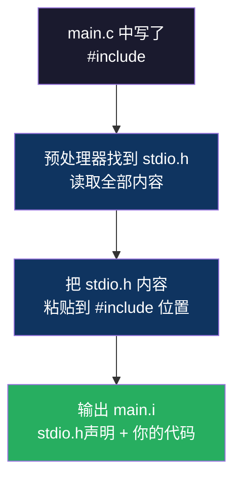
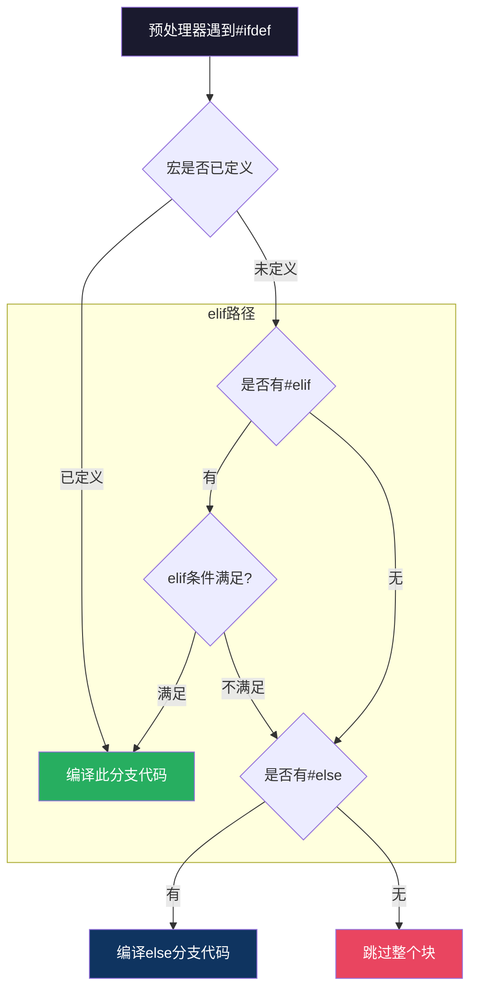

# 【金丹·62】预处理：#include和#define的真相

> **码农修仙传 · 金丹期 · 第62篇**
> 我是玄芯散人，带你从炼气修到大乘。

---

## 境界标识

```
╔══════════════════════════════════╗
║     金丹期 · 第62篇              ║
║     预处理                        ║
║     #include和#define的真相       ║
║     预计阅读：12分钟              ║
╚══════════════════════════════════╝
```

---

## 修仙引入

你在C文件开头写了一行 `#include <stdio.h>`，然后就能用 printf。

你觉得这行代码"引入了stdio库"。实际上#include做的事很简单：把stdio.h的全部内容原封不动地复制到你这行代码的位置。如果你用 `gcc -E main.c -o main.i` 看预处理结果，会发现一个简单的hello world变成了上千行。

但预处理不止是#include。宏定义、条件编译、字符串化，这些都是预处理的活。很多人只会用#include，对宏的陷阱和条件编译的能力一知半解。

金丹期要看透编译器的四段流水线。今天拆第一段：预处理。

---

## 硬核主体

### 预处理器是什么

C语言的编译过程分四步：预处理，编译，汇编，链接。预处理器是第一步，它在编译器真正干活之前先跑一遍，把你的源代码做一些纯文本层面的处理。

处理完之后，输出一个纯文本文件（通常叫 `.i` 文件），这个文件里不再有任何 `#` 开头的指令，全部被展开或删除了。

```bash
# 只做预处理，不编译
gcc -E main.c -o main.i

# 看看预处理后的文件有多大
wc -l main.i
# 一个简单的hello world，预处理后可能有上千行
```

预处理器认识所有以 `#` 开头的指令，主要有四类：文件包含（#include），宏定义（#define），条件编译（#ifdef/#ifndef/#endif），行控制（#line，很少用）。日常打交道最多的是前三类。

### #include：不是"引入库"，是"复制粘贴"

`#include <stdio.h>` 的功能是：找到 stdio.h 这个文件，把它里面的全部内容，原封不动地复制到你写 #include 的那个位置。

注意，是复制文件内容，不是"链接库"。库的链接是第四步（链接器）干的活，跟预处理无关。预处理只负责把头文件的声明搬到你的代码里，让你后面编译的时候"知道printf长什么样"。

两种写法的区别：

```c
#include <stdio.h>    // 尖括号：在系统目录里找（/usr/include/）
#include "myheader.h" // 双引号：先在当前目录找，找不到再去系统目录
```



一个常见的坑：头文件循环包含。a.h包含了b.h，b.h又包含了a.h。预处理器会无限循环展开吗？不会，但会报错。解决方法是用条件编译防止重复包含，下面会讲。

### #define：文本替换的威力与陷阱

`#define` 告诉预处理器：在后面的代码里，凡是遇到这个名字，就把它替换成你指定的内容。

```c
#define MAX_SIZE 100

int buffer[MAX_SIZE];  // 预处理后变成 int buffer[100];
```

注意，这是纯文本替换，不是"定义常量"。预处理器不理解类型，不理解变量范围，不理解任何语义。它只看到MAX_SIZE这个字符串，就换成100。

带参数的宏更像"文本模板"：

```c
#define SQUARE(x) ((x) * (x))

int a = SQUARE(3);     // 变成 int a = ((3) * (3));
int b = SQUARE(1+2);   // 变成 int b = ((1+2) * (1+2));  = 9
```

括号必须加。如果不加括号：

```c
#define SQUARE_BAD(x) x * x

int b = SQUARE_BAD(1+2);  // 变成 int b = 1+2 * 1+2;  = 5（不是9！）
```

因为乘法优先级高于加法，`1+2*1+2` 先算 `2*1=2`，再算 `1+2+2=5`。这就是宏的典型陷阱：你以为传的是"3"，实际上传的是"1+2"这三个字符。

宏的另一个坑是变量被多次求值：

```c
#define MAX(a, b) ((a) > (b) ? (a) : (b))

int x = 5, y = 3;
int z = MAX(x+1, y+1);
// 展开后：int z = ((x+1) > (y+1) ? (x+1) : (y+1));
// x+1被求值了两次！如果x+1有副作用（比如是一个函数调用），就会执行两次
```

修仙类比：宏是"符箓模板"，你把材料塞进去，它按模板加工。但符箓不理解材料是什么，你塞"1+2"进去，它不会帮你先算成3，而是把"1+2"原样填进模板的每个位置。

### 条件编译：一套代码适配多个平台

嵌入式开发里，同一套代码可能要跑在不同的芯片上。STM32F1和STM32F4的寄存器地址不同，你不能写两份代码，但可以用条件编译切换：

```c
#ifdef STM32F1
    #include "stm32f1xx.h"
    #define CLOCK_FREQ 72000000  // F1系列最高72MHz
#elif defined(STM32F4)
    #include "stm32f4xx.h"
    #define CLOCK_FREQ 168000000 // F4系列最高168MHz
#else
    #error "未定义目标芯片"
#endif
```

预处理器会根据编译时传入的宏定义选择只编译其中一个分支，其余分支的代码直接丢弃。上面这段代码里的 `STM32F1` 和 `STM32F4` 不是 GCC 自带的预定义宏，它们由芯片厂商的头文件（STM32CubeMX 生成的 stm32xxxx.h）或者编译命令行参数 `-DSTM32F1` 传入。GCC 自己预定义的跟 ARM 架构相关的宏叫 `__ARM_ARCH_7M__`（Cortex-M3）和 `__ARM_ARCH_7EM__`（Cortex-M4），但日常开发中厂商宏用得更多，因为更直观。

头文件防重复包含也是靠条件编译：

```c
// myheader.h
#ifndef MYHEADER_H
#define MYHEADER_H

// 头文件内容

#endif
```

第一次包含这个头文件时，MYHEADER_H还没定义，所以进入ifndef块，定义MYHEADER_H，复制内容。第二次再被包含时，MYHEADER_H已经定义了，ifndef条件为假，整个块被跳过。这样就不会重复包含。

还有一种更简洁的写法：

```c
// myheader.h
#pragma once
```

大多数现代编译器都支持。效果跟上面的ifndef一样，但更简洁，不用起宏名。缺点是非标准语法，不过实际项目中几乎都支持。



### 预处理器的能力边界

预处理器能做的不多。它不理解C语言的语法，不知道什么是类型，什么是函数，什么是变量。它只是一个"文本搜索替换工具"。

它不能做的事：
- 算术运算（`#define ONE 1` 和 `#define TWO 2`，预处理器不会帮你算 `ONE + TWO`）
- 类型检查（宏没有类型概念）
- 范围控制（宏定义后全局生效，除非用#undef取消）
- 访问变量值（宏在预处理阶段展开，那时变量还不存在）

它能做的事：
- 文本替换（#define）
- 文件包含（#include）
- 条件选择（#ifdef）
- 字符串化（#运算符，把宏参数变成字符串）
- 拼接标记（##运算符，把两个标记拼成一个）

```c
#define STRINGIFY(x) #x
#define CONCAT(a, b) a##b

const char *s = STRINGIFY(Hello);  // 变成 "Hello"
int CONCAT(var, 1) = 10;           // 变成 int var1 = 10;
```

### 一个全的预处理实验

写一个简单的C文件，亲手看看预处理做了什么：

```c
// test.c
#include <stdio.h>

#define VERSION 2
#define PRINT_VAL(x) printf(#x " = %d\n", x)

int main(void)
{
    int a = 10;
    PRINT_VAL(a);
    return 0;
}
```

预处理后的结果（简化）：

```c
// stdio.h展开的上千行声明...
// ...
extern int printf (const char *__restrict, ...);

int main(void)
{
    int a = 10;
    printf("a" " = %d\n", a);
    return 0;
}
```

你看，`PRINT_VAL(a)` 变成了 `printf("a" " = %d\n", a)`。#运算符把参数a变成了字符串"a"，然后跟后面的字符串拼接。C语言里相邻的字符串字面量会自动拼接，所以 `"a" " = %d\n"` 等于 `"a = %d\n"`。

---

## 修仙术语对照表

| 修仙术语 | 技术现实 | 本篇位置 |
|----------|---------|---------|
| 功法长老 | 预处理器 | 引入 |
| 文本替换 | #define宏展开 | #define节 |
| 复制功法 | #include头文件包含 | #include节 |
| 符箓模板 | 带参数的宏 | #define节 |
| 分支选择 | #ifdef条件编译 | 条件编译节 |
| 防重阵法 | #ifndef防重复包含 | 条件编译节 |
| 符文转化 | #运算符字符串化 | 能力边界节 |
| 符文拼接 | ##运算符标记拼接 | 能力边界节 |
| 功法边界 | 预处理器能力限制 | 能力边界节 |
| 第一道关卡 | 预处理是编译第一步 | 引入 |

---

## 进阶条件

会写#include和理解预处理器的边界之间，差这几条：

- [ ] 能用 `gcc -E` 查看预处理结果，而不是只猜它做了什么
- [ ] 知道#include是复制文件内容，不是"引入库"
- [ ] 能解释为什么宏 `SQUARE(x)` 必须加括号
- [ ] 能用#ifndef或#pragma once防止头文件重复包含
- [ ] 能用#ifdef切换不同平台的代码
- [ ] 知道预处理器不理解类型和语法，只做文本替换

> 最后一条是金丹期的认知分水岭。理解了"预处理器只是文本工具"，你就能解释那些奇怪的编译错误到底从哪来。

---

## 下期预告 + 互动

> 下一篇：【金丹·63】编译：C代码怎么变成汇编
>
> 预处理后的.i文件还是纯文本，CPU看不懂。
> 编译器要把它翻译成汇编语言，这一步会建语法树，做类型检查，还会偷偷改你的代码。
> 下一篇拆开编译器，看看它怎么把C代码变成汇编。

现在问你：

> 🔍 你踩过宏的坑吗？比如宏不加括号导致计算结果不对？
>
> 📌 你项目里用#pragma once还是#ifndef防重复包含？
>
> 评论区聊聊你遇到过的预处理坑。

> 我是玄芯散人，带你从炼气修到大乘。

---

*本文是「码农修仙传」系列第62篇。系列导航见 [xren.ren](https://xren.ren)*
