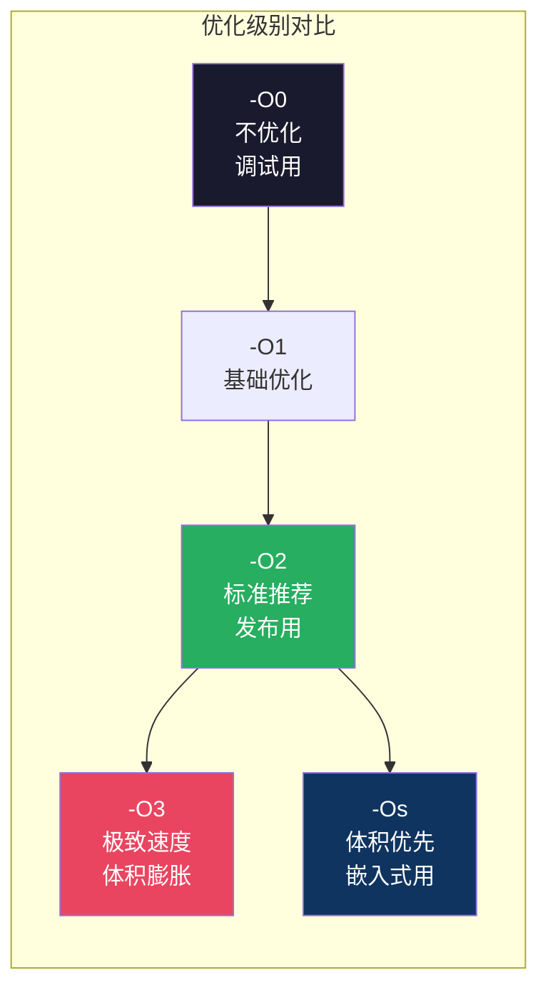

# 【金丹·63】编译：C代码怎么变成汇编

> **码农修仙传 · 金丹期 · 第63篇**
> 我是玄芯散人，带你从炼气修到大乘。

---

## 境界标识

```
╔══════════════════════════════════╗
║     金丹期 · 第63篇              ║
║     编译                          ║
║     C代码怎么变成汇编             ║
║     预计阅读：12分钟              ║
╚══════════════════════════════════╝
```

---

## 修仙引入

上一篇讲了预处理：#include和#define都是文本替换，预处理完的.i文件还是纯文本。

但CPU不认文本，它只认机器码。编译器要把这堆文本翻译成CPU能执行的指令。这个过程包括词法解析，语法解析，语义解析，代码生成几步，每一步都在"理解"你的代码然后改写。这几步的细节上一篇已经讲过，今天不重复。

今天讲一个更狠的：编译器在翻译的过程中会偷偷改你的代码。你以为你写的就是最终执行的？不一定。编译器可能帮你删掉没用的变量，把循环展开，甚至把 `60*60*24` 直接算成 `86400` 写死。

这篇文章带你看看编译器背着你做了哪些事，以及不同优化级别对最终代码的差异。

---

## 硬核主体

### 编译器做了什么（简短回顾）

编译器把C代码翻译成汇编，中间经过词法解析（切token）、语法解析（建AST语法树）、语义解析（查类型）、代码生成（输出汇编）。这个流程上一篇讲过了，不展开。

生成的汇编长这样：

```asm
    mov    DWORD PTR [rbp-4], 3    ; 直接把3写进变量a的内存位置
```

注意这里编译器已经帮你把 `1+2` 算成了 `3`。这就是常量折叠：编译时能算出来的常量表达式，直接算成结果，不生成运行时计算指令。

```c
// 你写的代码
int seconds = 60 * 60 * 24;

// 编译器看到的
int seconds = 86400;
```

常量折叠在-O1及以上自动开启。你不用做任何事，编译器自己就会算。

### 编译器背着你做的事

除了常量折叠，编译器还会做很多你看不见的改动。用 `gcc -O2` 编译时，你的代码可能被改得面目全非。

死代码消除：如果你写了一个变量但从来没使用过，编译器直接删掉。

```c
// 你写的
int unused = 42;
int a = 1 + 2;

// 编译器删掉unused后
int a = 3;
```

循环展开：把循环体复制几次，减少循环判断的开销。

```c
// 你写的
for (int i = 0; i < 4; i++) {
    sum += arr[i];
}

// 编译器展开后（-O3）
sum += arr[0];
sum += arr[1];
sum += arr[2];
sum += arr[3];
```

展开后少了4次循环判断和跳转，跑得更快，但代码体积变大了。这就是-O3的代价：用空间换速度。

函数内联：把短函数的代码直接复制到调用处，省掉函数调用的开销（压栈，跳转，返回）。

```c
// 你写的
inline int square(int x) { return x * x; }
int a = square(5);

// 内联后
int a = 5 * 5;  // 再经常量折叠变成 int a = 25;
```

### 五个优化级别怎么选

GCC提供五个优化级别，每个级别开启不同数量的优化选项：

```bash
gcc -O0 main.c   # 不优化（默认）
gcc -O1 main.c   # 基础优化
gcc -O2 main.c   # 标准推荐
gcc -O3 main.c   # 极致速度
gcc -Os main.c   # 体积优先
```

| 级别 | 编译速度 | 执行速度 | 代码体积 | 适用情况 |
|------|---------|---------|---------|---------|
| -O0 | 最快 | 最慢 | 中等 | 调试（GDB断点精准对应源码行） |
| -O1 | 快 | 较快 | 较小 | 快速编译验证 |
| -O2 | 中 | 快 | 较小 | 发布版本（推荐默认） |
| -O3 | 慢 | 最快 | 最大 | 性能敏感情况（体积膨胀） |
| -Os | 中 | 较快 | 最小 | 嵌入式（存储空间紧张） |

嵌入式开发通常用-Os或-O2。-Os在-O2基础上关闭了所有增大体积的选项（对齐填充等），适合Flash空间紧张的MCU。-O3在嵌入式里很少用，因为循环展开等策略导致代码膨胀会吃掉宝贵的Flash。



### 一个实验：看编译器改了多少

写一个简单的C文件，用不同优化级别编译，对比汇编输出：

```bash
# 生成汇编（编译完输出汇编，不汇编不链接）
gcc -O0 -S main.c -o main_O0.s
gcc -O2 -S main.c -o main_O2.s
gcc -O3 -S main.c -o main_O3.s

# 对比行数
wc -l main_O0.s main_O2.s main_O3.s
```

你会看到-O0的汇编最长（每行C代码对应多条汇编，没有合并），-O2短很多（死代码删了，常量折叠了），-O3可能比-O2长（循环展开增加了代码量）。

---

## 修仙术语对照表

| 修仙术语 | 技术现实 | 本篇位置 |
|----------|---------|---------|
| 炼丹预判 | 常量折叠（编译时算常量） | 回顾节 |
| 功法展开 | 循环展开 | 偷偷改节 |
| 法术融体 | 函数内联 | 偷偷改节 |
| 修炼档位 | 优化级别-O0到-O3 | 五个级别节 |
| 精简功法 | -Os体积优先 | 五个级别节 |
| 暗箱操作 | 编译器偷偷改代码 | 全篇 |

---

## 进阶条件

会写代码和理解编译器改了什么之间，差这几条：

- [ ] 能用 `gcc -S` 生成汇编，看编译器输出了什么
- [ ] 知道词法解析，语法解析，语义解析，代码生成这几步各自做什么
- [ ] 能解释常量折叠为什么 `60*60*24` 变成了 `86400`
- [ ] 知道死代码消除和循环展开和函数内联各是什么
- [ ] 能说出-O0，-O2，-O3，-Os的区别和适用情况
- [ ] 嵌入式项目知道选-Os还是-O2，能说出为什么

> 最后一条是金丹期的实操分水岭。优化级别不是随便选的，它决定代码体积和执行速度和调试体验。

---

## 下期预告 + 互动

> 下一篇：【金丹·64】undefined reference：链接器原理
>
> 编译器把C代码变成了汇编，但你的代码调用了printf，printf的实现在哪？
> 链接器负责把多个.o文件和库拼在一起，填上所有空着的地址引用。
> 下篇讲链接器怎么干活，以及为什么你会遇到undefined reference。

现在问你：

> 🔍 你试过用 `gcc -S` 看汇编输出吗？第一次看到编译器生成的汇编是什么感觉？
>
> ⚙️ 你的嵌入式项目用-O0还是-O2还是-Os？为什么选这个级别？
>
> 评论区聊聊你跟编译器打交道的经历。

> 我是玄芯散人，带你从炼气修到大乘。

---

*本文是「码农修仙传」系列第63篇。系列导航见 [xren.ren](https://xren.ren)*
