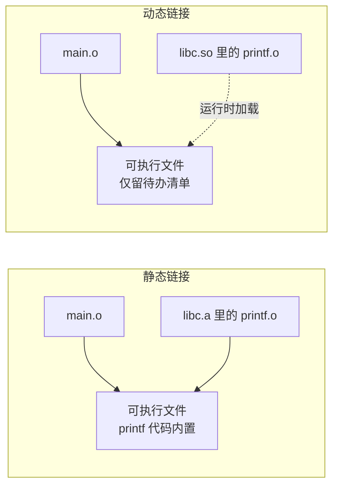
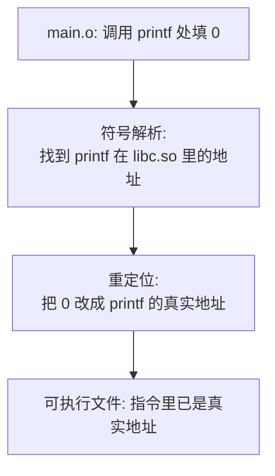
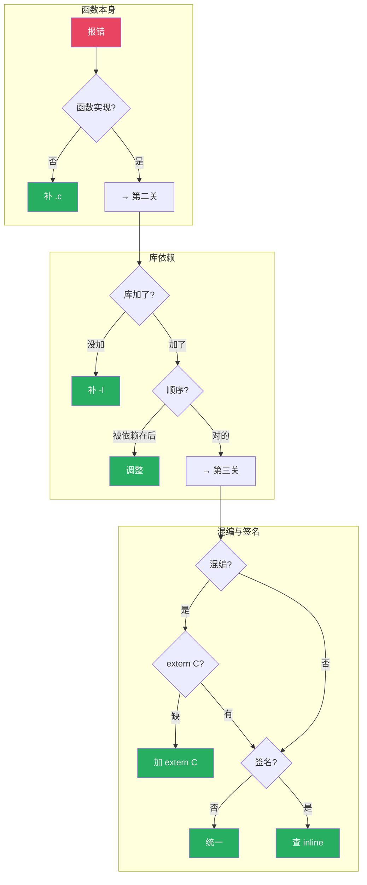

# 【金丹·64】undefined reference：链接器原理

> **码农修仙传 · 金丹期 · 第64篇**
> 我是玄芯散人，带你从炼气修到大乘。

---

## 境界标识

```
╔══════════════════════════════════╗
║     金丹期 · 第64篇              ║
║     undefined reference          ║
║     链接器原理                    ║
║     预计阅读：14分钟              ║
╚══════════════════════════════════╝
```

---

## 修仙引入

上篇讲到，编译器把你的C代码翻译成汇编，再由汇编器变成 .o 文件。你的 main.c 变成了 main.o，add.c 变成了 add.o。每个 .o 都是一个独立的二进制碎片，里面装着一段代码和一些尚未填实的地址引用。

这些碎片要拼成一个能跑的可执行文件，谁来拼？链接器（linker）。

链接器是修真界里的"祠堂执事"。每家弟子（.o 文件）把自己的名字和祖传功法登记进族谱（符号表），执事拿着族谱，把各家的名字和地址一一核对、填补进去。哪个弟子只写了"我会某种功法"却没写出来，执事就在祠堂墙上贴出告示：`undefined reference to xxx`。这就是每个C程序员都被折磨过的那行报错。

金丹期的你，要看清链接器怎么干活。看清之后，那行报错到底在说什么自然就明白了。

---

## 硬核主体

### 编译四步回顾：链接器在哪一关

复习一下上一篇的流水线：

```
预处理（.c -> .i） → 编译（.i -> .s） → 汇编（.s -> .o） → 链接（.o -> 可执行）
```

前三步每步只处理一个文件。第四步不一样，它要把所有相关的 .o 文件和库文件合到一起，才能产出最终的可执行文件。链接器（Linux 上是 `ld`，通常由 `gcc` 间接调用）干的就是这最后一关。

### 一个最简单的 undefined reference 现场

写两个文件，复现报错：

```c
// add.h
int add(int a, int b);  // 声明

// main.c
#include <stdio.h>
#include "add.h"

int main(void)
{
    printf("%d\n", add(1, 2));
    return 0;
}
```

只编译这两个文件，不写 add 的实现：

```bash
$ gcc main.c -o main
/tmp/ccXxx.o: in function `main':
main.c:(.text+0x1e): undefined reference to `add'
collect2: error: ld returned 1 exit status
```

报错信息有三个要点：

1. `undefined reference to add`：链接器在所有输入里都找不到 `add` 的实现。
2. `in function main`：谁在引用？主函数。
3. `ld returned 1 exit status`：链接阶段失败。

写上 add.c 再编译：

```c
// add.c
int add(int a, int b) { return a + b; }
```

```bash
$ gcc main.c add.c -o main
$ ./main
3
```

这下链接器能在 add.o 里找到 `add` 符号的实现，问题消失。

### 符号解析：链接器怎么"找名字"

链接器干活靠两件东西：符号表（symbol table）和重定位表（relocation table）。

符号表记录每个 .o 文件里"我定义了谁"和"我引用了谁"两类信息。每个符号条目至少包含：

| 字段 | 含义 |
|------|------|
| name | 符号名字（如 `add`、`printf`） |
| value | 该符号在当前 .o 里的地址偏移 |
| section | 属于哪个 section（.text / .data / .bss 等） |
| binding | GLOBAL（全局）/ LOCAL（局部）/ WEAK（弱符号） |
| type | FUNC（函数）/ OBJECT（变量）/ SECTION（节） |

可以用 `readelf -s main.o` 看符号表：

```bash
$ gcc -c main.c -o main.o
$ readelf -s main.o
```

输出会看到：

```
Symbol table '.symtab' contains 12 entries:
   Num:    Value          Size Type    Bind   Vis      Ndx Name
     0: 0000000000000000     0 NOTYPE  LOCAL  DEFAULT  UND
     ...
     8: 0000000000000000    35 FUNC    GLOBAL DEFAULT    1 main
     9: 0000000000000000    16 FUNC    GLOBAL DEFAULT  UND printf
    10: 0000000000000000     0 FUNC    GLOBAL DEFAULT  UND add
```

注意第 10 行：`add` 符号的 Ndx 是 `UND`，意思是 undefined（未定义）。在 ELF 符号表里，Ndx 字段是符号所在 section 的下标，但当符号尚未定义时，这个字段的值为 0，readelf 显示为 UND 标记。main.o 引用了 add，但 main.o 自己没实现它。链接器看到 UND，就会去其它输入文件里找 add 的定义。如果所有输入都找不到，就报 undefined reference。

这就是符号解析的全过程：把每个未定义符号，跟某个输入文件里的已定义符号配对。

修仙类比：每个 .o 像是一个弟子，符号表就是弟子手里的身份玉牌。写着"GLOBAL+UND"的玉牌是"我会某种功法但还没学"的声明，执事拿着所有玉牌去找谁手里有"GLOBAL+已定义"的同款，谁就是师父。

### 静态链接：把所有 .o 合并成一个可执行

静态链接是最直观的链接方式：链接器把用到的 .o 文件连同库里的代码，全部复制到最终的可执行里。

C 标准库里的 `printf` 通常以两种形式发布：

| 类型 | 文件后缀 | 链接时机 | 输出大小 |
|------|---------|---------|----------|
| 静态库 | `.a` | 链接时整段复制到可执行 | 可执行体积大 |
| 动态库 | `.so` | 运行时按需加载 | 可执行体积小 |

静态库其实是一组 .o 文件的归档，结构很像 tar：

```bash
$ ar t /usr/lib/x86_64-linux-gnu/libc.a | head
printf.o
scanf.o
fopen.o
fclose.o
...
```

链接器处理静态库时有个反直觉的规则：从左到右扫描，被引用的 .a 必须出现在引用的位置之后。

举例说明顺序问题：

```bash
# 报错：libfoo.a 引用了 libbar.a 的函数，但 libbar.a 写在了前面
$ gcc main.c -lfoo -lbar -o main
undefined reference to `bar_func'

# 修正：把 libbar.a 放前面
$ gcc main.c -lbar -lfoo -o main
# 链接通过
```

原因很简单：链接器扫描到 `-lfoo` 时，从 libfoo.a 里挑出 main.c 用到的 .o，再看这些 .o 里的未定义符号，去后面的库找。但 libbar.a 已经在 libfoo.a 之前被处理过了，链接器不会再回头看。

应对办法：把依赖顺序理清楚，或者把库放在命令最后（依赖库在前）。GCC 还有 `-Wl,--start-group ... -Wl,--end-group` 把一组库反复扫描，但会拖慢链接速度。

### 动态链接：运行时才把 .so 装进来

动态链接不一样，可执行文件里只留一份"待办清单"：哪些符号要从哪个 .so 里找。真正的代码在程序启动或者第一次用到时才由动态链接器（Linux 上是 `ld.so`）加载。

用一个命令看可执行文件依赖哪些动态库：

```bash
$ ldd ./main
    linux-vdso.so.1 (0x00007ffd...)
    libc.so.6 => /lib/x86_64-linux-gnu/libc.so.6
    /lib64/ld-linux-x86-64.so.2 (0x00007f...)  # 这就是 ld-linux.so（动态加载器）
```

`libc.so.6` 是动态版的 C 标准库。运行 `./main` 时，ld-linux.so（动态加载器）把 libc.so.6 装进进程内存，再把 main 里"未定义符号"的那几行指针指向 libc.so.6 里 printf 的真正地址。

动态链接的好处有三：

1. 节省磁盘：多个程序共享同一份 libc.so.6，不必每个程序都内置一份。
2. 节省内存：操作系统让所有进程的 libc.so.6 指向同一块物理内存，靠虚拟地址区分。
3. 独立升级：libc 出 bug 重编即可，不用重新链接所有依赖它的程序。

代价是首次启动慢一点，且对库的版本兼容性要求更严格。



### ELF 文件：链接器和加载器看到的格式不一样

.o 文件和可执行文件都是 ELF（Executable and Linkable Format）。ELF 是一份二进制"档案"，里面分两种视角：

| 视角 | 服务对象 | 单位 | 头表 |
|------|---------|------|------|
| 链接视图 | 链接器（ld） | Section（节） | Section header table |
| 执行视图 | 加载器（ld-linux.so） | Segment（段） | Program header table |

可执行文件同时包含两张头表（链接器用 section，加载器用 program）。纯 .o 文件只有 section 表，加载器不读它。

ELF 文件头是整个档案的索引，开头 16 字节是魔数 `7f 45 4c 46`（即 ASCII 的 `.ELF`）。用 `readelf -h` 能看到所有字段：

```bash
$ readelf -h main
ELF 头：
  Magic：   7f 45 4c 46 02 01 01 00 00 00 00 00 00 00 00 00
  类别:                              ELF64
  数据:                              2 补码，小端序 (little endian)
  类型:                              EXEC (可执行文件)
  系统架构:                          Advanced Micro Devices X86-64
  入口点地址：               0x401040
  Start of section headers:          15288 (bytes into file)
  ...
```

各字段含义：

| 字段 | 含义 |
|------|------|
| e_type | REL=可重定位（.o），EXEC=可执行，DYN=共享库（.so） |
| e_entry | 程序入口地址（main 函数的虚拟地址） |
| e_phoff / e_phnum | 程序头表偏移和数量（加载器用） |
| e_shoff / e_shnum | 节头表偏移和数量（链接器用） |

修仙类比：ELF 头是祠堂大门上的匾额，写着"某家族宗祠，第几代，掌门是谁"。执事（链接器）进门看节头表，谁家功法放在哪个架子上；执行官（加载器）进门看程序头表，先拜哪面墙再拜哪面墙。

### 重定位：把"占位符"换成真实地址

汇编器生成的 .o 里，调用 `printf` 的指令填的地址是 0，因为汇编器不知道 printf 最终会落在可执行文件的哪个位置。重定位表就是给链接器的一张清单，告诉它"这里有个待填的地址，按这个规则填"。

每个重定位条目至少包含：

| 字段 | 含义 |
|------|------|
| offset | .o 文件里的字节偏移，标记要修改的位置 |
| type | 重定位类型（如 R_X86_64_PC32 相对寻址） |
| symbol | 该位置最终要填哪个符号的地址 |
| addend | 额外的加数 |

```bash
$ readelf -r main.o
```

输出会看到一行类似：

```
00000000001a  0005 R_X86_64_PC32     000000000000  printf - 4
```

意思是：main.o 第 0x1a 字节处的 4 字节，是个 R_X86_64_PC32 类型的引用，最终要填上 printf 的地址，再减去 4。这个 -4 是编译器预设的加数，因为 x86_64 上 `call` 指令本身长 5 字节，下一条指令地址已经在当前位置 +5，相对寻址要回退一个 rip 偏移才能算出正确的相对距离，所以重定位时减 4。

链接器处理每个 .o 时，先做符号解析，把所有未定义符号跟某个输入的已定义符号对应上，得到每个符号的最终地址。然后扫每个 .o 的重定位表，按规则把占位地址 patch 成真实地址。这一步做完，.o 文件就变成可执行文件。



修仙类比：弟子写功法时只能写"此处调用师尊的某招"，地址是空的。执事核对族谱找到师尊在哪座山峰，再回来把"师尊的山峰编号"填进弟子的功法里。

### undefined reference 的四大常见原因

报错背后就这几类原因，按出现频率排序：

第一类：函数只声明没实现，或者实现没被编译进去

```c
// header.h
void foo(void);   // 声明

// main.c
#include "header.h"
int main(void) { foo(); return 0; }
```

但 foo.c 没写，也没加进编译命令。链接器扫遍所有输入都找不到 foo 的实现。

解决：补上 foo.c，或者确认它确实在编译命令里。

第二类：漏了库，或者库顺序错了

```bash
$ gcc main.c -o main   # 用到了 libm 里的 sin，但没加 -lm
undefined reference to `sin'
```

库的顺序问题更隐蔽：

```bash
$ gcc main.c -lbar -lfoo -o main   # libfoo 引用 libbar，但放反了
undefined reference to `xxx_func'
```

解决：补 `-lxxx`，或者把被依赖的库放在前面，或者用 `-Wl,--start-group ... -Wl,--end-group`。

第三类：C++ 名字修饰（C++ name mangling）

C++ 支持函数重载，编译器把函数名编码成包含参数类型信息的字符串，比如 `add(int, int)` 变成 `_Z3addii`。如果 C 代码调用一个 C++ 函数，链接器找不到名字对应的实现：

```cpp
// math.cpp
int add(int a, int b) { return a + b; }   // C++ 实现
```

```c
// main.c
extern int add(int, int);
int main(void) { return add(1, 2); }
```

```bash
$ gcc main.c math.cpp -o main
undefined reference to `add'   // 链接器在找 "add"，但 math.o 里只有 "_Z3addii"
```

解决：在 C++ 实现里包一层 `extern "C"`：

```cpp
extern "C" int add(int a, int b) { return a + b; }
```

第四类：函数声明和定义签名不一致

```c
// header.h
int add(int a, int b);

// add.c
int add(int a, int b, int c) { return a + b + c; }   // 多了个参数
```

编译器按各自的签名分别编译，符号表里 add.o 写的是 `add(int,int,int)`，main.o 引用的是 `add(int,int)`。两个名字不一样，链接器找不到匹配。

解决：让声明和定义一字不差。

### 排查链接错误的常规步骤

遇到 undefined reference，按这个顺序排查：

1. 看报错里提到的符号名：是项目里的函数，还是第三方库的函数？
2. 如果是项目函数：检查 .c 文件有没有被加进编译命令，函数有没有真的实现。
3. 如果是库函数：检查编译命令里有没有 `-lxxx`，库的顺序对不对。
4. 如果是 C/C++ 混编：检查有没有 `extern "C"`。
5. 用 `nm` 或 `readelf -s` 看符号：

```bash
$ nm main.o | grep add          # 看 main.o 里有没有 add 的引用
U add
$ nm libfoo.a | grep add         # 看 libfoo.a 里有没有 add 的定义
T add
```

`U` 表示 undefined（未定义），`T` 表示 text 段（已定义的函数）。



---

## 修仙术语对照表

| 修仙术语 | 技术现实 | 本篇位置 |
|----------|---------|---------|
| 祠堂执事 | 链接器 ld | 引入 |
| 家族族谱 | 符号表 .symtab | 符号解析 |
| 身份玉牌 | 符号条目 | 符号解析 |
| 未学功法 | 未定义符号 UND | 符号解析 |
| 已学功法 | 已定义符号 | 符号解析 |
| 家族宝库 | 静态库 .a | 静态链接 |
| 共享秘境 | 动态库 .so | 动态链接 |
| 宗门匾额 | ELF 文件头 | ELF 格式 |
| 功法架位 | Section | ELF 格式 |
| 拜祭路线 | Program header | ELF 格式 |
| 待填地址 | 重定位表 | 重定位 |
| 召唤阵眼 | 名字修饰 name mangling | 名字修饰 |
| 玉牌核验 | nm / readelf | 排查 |

---

## 进阶条件

会调用函数和理解链接器怎么干活之间，差这几条：

- [ ] 能用 `readelf -h` 读出 ELF 头，看到入口地址和类型
- [ ] 能用 `readelf -s` 看符号表，知道 `UND` 和 `T` 分别代表什么
- [ ] 能用 `readelf -r` 看重定位表，理解 `offset / type / symbol` 三个字段
- [ ] 能用 `ldd` 看可执行文件依赖哪些动态库
- [ ] 能用 `nm main.o | grep xxx` 排查某个符号有没有被定义
- [ ] 能解释静态库从左到右扫描的规则，写出正确的库顺序
- [ ] 看到 `undefined reference` 能按"漏库 / 顺序错 / 名字修饰 / 签名不一致"四类排查
- [ ] 知道 `extern "C"` 在 C/C++ 混编时的用法

> 最后两条是金丹期的实操分水岭。链接报错天天见，能 5 秒判断是哪一类，再去查具体原因，就脱离了"瞎百度"的阶段。

---

## 下期预告 + 互动

> 下一篇：【金丹·65】ELF文件解剖：一个可执行文件里有什么
>
> 这一篇讲了链接器怎么把 .o 拼成可执行文件，但可执行文件本身长什么样？
> 下篇拆开一个真实的 ELF 文件，用 readelf 把它的节头表、程序头表、符号表、重定位表照个透。

现在问你：

> 🔍 你被 `undefined reference` 卡过最久的一次，是漏了库？顺序错了？还是 C++ 名字修饰？
>
> ⚙️ 你项目里更常用静态库（.a）还是动态库（.so）？为什么选这个？
>
> 评论区聊聊你跟链接器斗智斗勇的经历。
>
> 我是玄芯散人，带你从炼气修到大乘。

---

*本文是「码农修仙传」系列第64篇。系列导航见 [xren.ren](https://xren.ren)*
