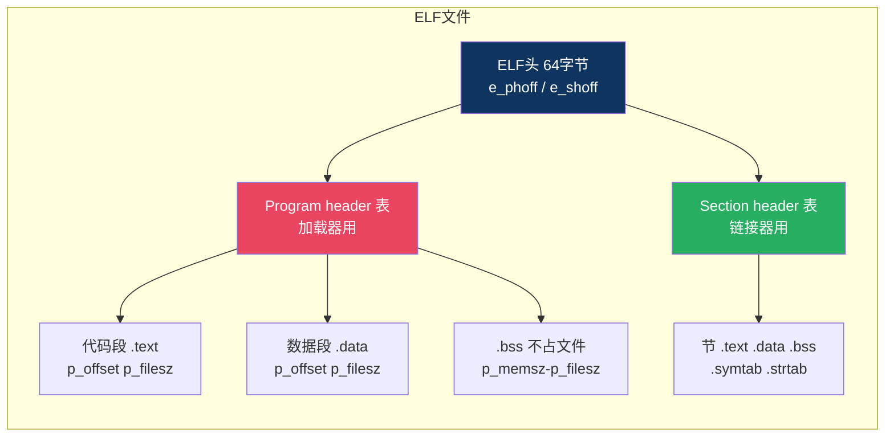
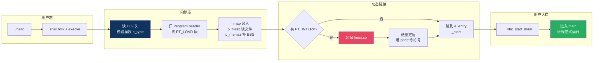

# 【金丹·65】ELF文件解剖：一个可执行文件里有什么

> **码农修仙传 · 金丹期 · 第65篇**
> 我是玄芯散人，带你从炼气修到大乘。

---

## 境界标识

```
╔══════════════════════════════════╗
║     金丹期 · 第65篇              ║
║     ELF文件解剖                    ║
║     一个可执行文件里有什么          ║
║     预计阅读：14分钟               ║
╚══════════════════════════════════╝
```

---

## 修仙引入

上一篇讲了链接器把 `.o` 拼成可执行文件。可执行文件本身到底长什么样？它是几段神秘字节流，还是有什么内部结构？

答案是：ELF（Executable and Linkable Format）格式。在 Linux 上 `.o` 文件、`.so` 动态库、可执行文件都采用 ELF 格式，里面装的"表"不一样。今天我们拿一个真实的 ELF 文件当标本，用 `readelf` 工具一层层剥开来看。先看 ELF 头是什么，再看加载器怎么用它把进程装起来，最后看链接器怎么靠它找到符号和节。

金丹期必修的内功：看懂 `readelf` 输出，是排查各种二进制问题的起点。

---

## 硬核主体

### 准备一个样本

写一段 C 代码，编译成可执行文件：

```c
// hello.c
#include <stdio.h>
int counter = 42;            // 已初始化全局变量 -> .data 节
int buffer[1024];            // 未初始化全局变量 -> .bss 节
static int token = 7;        // 静态全局变量 -> .data 节

int add(int a, int b) {      // 函数 -> .text 节
    return a + b;
}

int main(void) {
    printf("hello %d\n", add(1, 2));
    return 0;
}
```

```bash
$ gcc hello.c -o hello
$ file hello
hello: ELF 64-bit LSB pie executable, x86-64, ...
```

`file` 命令只是看一眼类型，真正的解剖要靠 binutils 里的 `readelf`。

### ELF 的统一身份：魔数和文件类型

`.o`、`.so`、可执行文件三类文件，开头 16 字节都一样：ELF 的"身份证"。第 0 到 3 字节是魔数 `7f 45 4c 46`，对应 ASCII 的 `.ELF`，第 4 字节标 32 位还是 64 位，第 5 字节标小端还是大端。

```bash
$ readelf -h hello | head -10
  Magic:   7f 45 4c 46 02 01 01 00 00 00 00 00 00 00 00 00
  Class:                             ELF64
  Data:                              2's complement, little endian
  Version:                           1 (current)
  OS/ABI:                            UNIX - System V
  Type:                              DYN (Position-Independent Executable file)
  Machine:                           Advanced Micro Devices X86-64
```

`DYN` 是 Position-Independent Executable（PIE）。现代 Linux 发行版的 GCC 默认开 `-pie` 安全选项，所以编译出来的可执行文件类型是 `DYN` 而不是 `EXEC`。老的 EXEC 类型不能随机地址加载，安全上有弱点。

下面这几种类型最常见：

| e_type 值 | 名称 | 含义 |
|----------|------|------|
| ET_REL (1) | REL | 可重定位文件，就是 .o |
| ET_EXEC (2) | EXEC | 不可重定位的可执行（旧式） |
| ET_DYN (3) | DYN | 共享对象（.so）或位置无关可执行（PIE） |

### ELF 头字段全解

ELF 头共 64 字节（ELF64），记录整个文件的索引信息。`readelf -h` 把它们都列出来：

```bash
$ readelf -h hello
ELF Header:
  Magic:   7f 45 4c 46 02 01 01 00 00 00 00 00 00 00 00 00
  Class:                             ELF64              # 64 位
  Data:                              2's complement, little endian   # 小端
  Type:                              DYN (Position-Independent Executable file)
  Machine:                           Advanced Micro Devices X86-64    # 目标 CPU 架构
  Version:                           0x1                # ELF 版本
  Entry point address:               0x1050             # 程序入口地址（_start）
  Start of program headers:          64 (bytes into file)
  Start of section headers:          12624 (bytes into file)
  Flags:                             0x0
  Size of this header:               64 (bytes)
  Size of program headers:           56 (bytes)
  Number of program headers:         12
  Size of section headers:           64 (bytes)
  Number of section headers:         29
  Section header string table index: 26
```

字段含义逐个看：

| 字段 | 含义 |
|------|------|
| e_entry | 程序入口虚拟地址，内核加载完后从这里开始执行 |
| e_phoff | Program header table 偏移字节数 |
| e_phnum | Program header 数量 |
| e_phentsize | 每个 Program header 的字节数 |
| e_shoff | Section header table 偏移字节数 |
| e_shnum | Section header 数量 |
| e_shentsize | 每个 Section header 的字节数 |
| e_shstrndx | 节名字符串表的下标 |

注意 `e_phoff` 和 `e_shoff` 是文件里的字节偏移，加载器从 `e_phoff` 处开始读 Program header 表，链接器从 `e_shoff` 处开始读 Section header 表。两个表可能完全分开存放。

修仙类比：ELF 头是祠堂的总账房。进门先看匾额，匾上写清家族分支、功法目录与弟子花名册各放哪一页。加载器和链接器拿着这块匾，去对应页码找自己的资料。

### 两套视角：链接器看 Section，加载器看 Segment

这是 ELF 最容易绕晕的地方。同样一份 ELF 文件，里面装两套信息：

| 视角 | 谁用 | 单位 | 头表位置 |
|------|------|------|---------|
| 链接视图 | 链接器 | Section（节） | Section header table（e_shoff 起） |
| 执行视图 | 加载器 | Segment（段） | Program header table（e_phoff 起） |

.o 文件只装链接视图（只有 Section header）。可执行文件两套都装，加载器只用 Program header。.so 也是两套都装。

Segment 由若干 Section 合并而成。比如 `.text`、`.rodata` 这些节，通常会被归进同一个 `PT_LOAD` 段一起加载。

### Program Header（段表）：加载器视角

`readelf -l` 列出所有 Program header：

```bash
$ readelf -l hello
Elf file type is DYN (Position-Independent Executable file)
Entry point 0x1050
There are 12 program headers, starting at offset 64

Program Headers:
  Type           Offset   VirtAddr           PhysAddr           FileSiz  MemSiz   Flags  Align
  LOAD           0x000000 0x0000000000000000 0x0000000000000000 0x000928 0x000928 R      0x1000
  LOAD           0x000928 0x0000000000000928 0x0000000000000928 0x000298 0x000298 R E    0x1000
  LOAD           0x000bc8 0x0000000000002bc8 0x0000000000002bc8 0x0001f0 0x000248 RW     0x1000
  INTERP         0x0001c8 0x00000000000001c8 0x00000000000001c8 0x00001c 0x00001c R      0x1
      [Requesting program interpreter: /lib64/ld-linux-x86-64.so.2]
  DYNAMIC        0x000cf0 0x0000000000002cf0 0x0000000000002cf0 0x0001a0 0x0001a0 RW     0x8
  ...
  GNU_STACK      0x000000 0x0000000000000000 0x0000000000000000 0x000000 0x000000 RW     0x10
  GNU_RELRO      0x000bc8 0x0000000000002bc8 0x0000000000002bc8 0x0001f0 0x000248 R      0x8
```

每个 Program header 字段：

| 字段 | 含义 |
|------|------|
| p_type | 段类型（LOAD / INTERP / DYNAMIC / TLS 等） |
| p_offset | 段在文件内的字节偏移 |
| p_vaddr | 段加载到内存后的虚拟地址 |
| p_paddr | 物理地址（一般忽略） |
| p_filesz | 段在文件里占多少字节 |
| p_memsz | 段在内存里占多少字节（可能比 filesz 大，留给 BSS） |
| p_flags | 权限位：R 读，W 写，X 执行 |
| p_align | 对齐要求 |

读者最该记住 `PT_LOAD`：内核会按这个段的描述把文件内容 `mmap` 到进程地址空间。`p_filesz` 是从文件读多少，`p_memsz` 是在内存里占多少，两者之差就是 `.bss`（零初始化区）。

注意看第三个 LOAD 段：`FileSiz 0x0001f0`，`MemSiz 0x000248`。差值 0x58 字节，就是 `.bss` 在文件里不占空间，但加载到内存后要分配并清零。

修仙类比：Program header 是朝廷的调度令，每条指令写明"哪个功法从哪页抄，抄到哪座山峰的哪间房，要腾出多少空位"。执行官拿着调度令，按部就班往进程地址空间里搬东西。



### Section Header（节表）：链接器视角

`readelf -S` 列出所有 Section header：

```bash
$ readelf -S hello
There are 29 section headers, starting at offset 0x3150:

Section Headers:
  [Nr] Name              Type             Address           Offset
       Size              EntSize          Flags  Link  Info  Align
  [ 0]                   NULL             0000000000000000  00000000
       0000000000000000  0000000000000000           0     0     0
  [ 1] .interp           PROGBITS         00000000000001c8  000001c8
       000000000000001c  0000000000000000   A       0     0     1
  [ 2] .note.gnu.property NOTE            00000000000001e8  000001e8
       000000000000002c  0000000000000000   A       4     0     8
  ...
  [ 9] .init             PROGBITS         0000000000001000  00001000
       0000000000000017  0000000000000000  AX       0     0     4
  [10] .plt              PROGBITS         0000000000001020  00001020
       0000000000000020  0000000000000010  AX       0     0     16
  [11] .plt.got          PROGBITS         0000000000001040  00001040
       0000000000000008  0000000000000008  AX       0     0     8
  [12] .text             PROGBITS         0000000000001050  00001050
       ...
  [15] .rodata           PROGBITS         0000000000002000  00002000
       ...
  [22] .data             PROGBITS         0000000000003c10  00002c10
       ...
  [23] .bss              NOBITS           0000000000003e00  00002c10
       0000000000000218  0000000000000000  WA       0     0     32
  [24] .symtab           SYMTAB           0000000000000000  00002c20
       ...
  [25] .strtab           STRTAB           0000000000000000  00002e88
       ...
  [26] .shstrtab         STRTAB           0000000000000000  00002f20
       ...
```

每个 Section header 字段：

| 字段 | 含义 |
|------|------|
| sh_name | 节名字符串在 .shstrtab 里的偏移 |
| sh_type | 节类型（PROGBITS / SYMTAB / STRTAB / NOBITS） |
| sh_addr | 节加载到内存后的虚拟地址 |
| sh_offset | 节在文件里的字节偏移 |
| sh_size | 节大小（字节） |
| sh_flags | 标志位：WRITE / ALLOC / EXECINSTR |
| sh_link / sh_info | 关联节的下标（含义跟 sh_type 相关） |
| sh_addralign | 对齐要求 |

常见 `sh_type` 值：

| 类型值 | 名称 | 含义 |
|--------|------|------|
| 1 | SHT_PROGBITS | 程序定义的数据（代码、常量） |
| 2 | SHT_SYMTAB | 符号表 |
| 3 | SHT_STRTAB | 字符串表 |
| 4 | SHT_RELA | 重定位条目（带 addend） |
| 5 | SHT_HASH | 符号哈希表（已废弃，GNU_HASH 替代） |
| 8 | SHT_NOBITS | 不占文件空间的节（典型 .bss） |
| 11 | SHT_DYNSYM | 动态链接用的符号表 |

注意 `.bss` 的 `sh_type` 是 NOBITS，`Offset` 列虽然有值但实际没有文件内容，加载器读到它的时候直接分配内存并清零。上一节 Program header 里看到的 `p_memsz > p_filesz`，差值就来自这里。

修仙类比：Section header 是祠堂里的货架清单。执事（链接器）进门看清单，知道 `.text` 是功法原文在第几架，`.symtab` 是花名册在第几架，`.bss` 是空架子要自己放东西。

### 符号表：链接器找人靠它

`readelf -s` 看全部符号表，`readelf --dyn-syms` 看动态符号表。符号表条目 `Elf64_Sym` 结构：

| 字段 | 含义 |
|------|------|
| st_name | 符号名在字符串表里的偏移 |
| st_info | 低 4 位是 binding（LOCAL / GLOBAL / WEAK），高 4 位是 type（FUNC / OBJECT / SECTION） |
| st_other | 可见性（DEFAULT / HIDDEN / INTERNAL） |
| st_shndx | 符号所在的 section 下标（UND 表示未定义） |
| st_value | 符号值（地址或对齐相关） |
| st_size | 符号占的字节数 |

看 `add`、`counter`、`printf` 这些符号在 .o 阶段长什么样：

```bash
$ readelf -s main.o
Symbol table '.symtab' contains 14 entries:
   Num:    Value          Size Type    Bind   Vis      Ndx Name
     0: 0000000000000000     0 NOTYPE  LOCAL  DEFAULT  UND
     ...
     8: 0000000000000000     4 OBJECT  GLOBAL DEFAULT    3 counter
     9: 0000000000000000  4096 OBJECT  GLOBAL DEFAULT    4 buffer
    10: 0000000000000000     4 OBJECT  LOCAL  DEFAULT    3 token
    11: 0000000000000000    16 FUNC    GLOBAL DEFAULT    1 add
    12: 0000000000000000    35 FUNC    GLOBAL DEFAULT    1 main
    13: 0000000000000000     0 FUNC    GLOBAL DEFAULT  UND printf
```

几条要点：

1. `counter`、`buffer` 类型是 OBJECT，对应数据。`add`、`main` 类型是 FUNC，对应函数。
2. `token` 的 Bind 是 LOCAL，因为它声明时加了 `static`，链接器看不到外部。
3. `printf` 的 Ndx 是 UND，main.o 引用了 printf，但自己没实现。链接器看到这个会去别的 .o 或库里找。
4. `add` 的 Ndx 是 1，对应 .text 节。链接器把 main.o 和 add.o 合到一起后，add 的 st_value 会从 0 变成它在最终可执行文件里的虚拟地址。

WEAK 是一种特殊 binding：它允许符号有多个定义，链接器优先用 GLOBAL，没找到 GLOBAL 才用 WEAK。常见用法是库的弱定义允许用户覆写：

```c
// libc.a 里：默认实现，WEAK
__attribute__((weak)) void *malloc(size_t sz) { ... }

// 用户代码里：GLOBAL 覆盖
void *malloc(size_t sz) { ... }
```

可执行文件里同样的 `malloc` 符号会有两条：一条 WEAK 来自 libc，一条 GLOBAL 来自用户文件，链接器选 GLOBAL。

### 程序加载：execve 到 main 之间的路

用户敲下 `./hello`，shell 调用 `fork` + `execve`，内核接手 ELF 文件，从 Program header 段表里读信息开始装。具体过程：



细节补充：

- 内核按 `p_offset`、`p_vaddr`、`p_filesz` 调 `mmap`。`p_memsz > p_filesz` 的部分另起新内存并填零，对应 `.bss`。
- 如果看到 `PT_INTERP` 段，里面是动态链接器的路径（通常是 `/lib64/ld-linux-x86-64.so.2`）。内核不直接跳到用户入口，而是先把控制权交给动态链接器。
- 动态链接器把所有 `.so` 装好，按 `.rela.plt`（PLT 重定位表）解析 printf、malloc 这类外部符号，填好 GOT（Global Offset Table）。
- 这一切做完，才跳到 `e_entry` 指向的 `_start`，`_start` 调用 `__libc_start_main`，后者才真正调 `main`。

注意 `PT_GNU_STACK` 这个段。它的 `p_flags` 标志是 `RW`（没有 X），告诉内核这个进程的栈不需要可执行权限。打开 NX（No-eXecute）位能挡住大多数栈溢出攻击。

### 常用 readelf 命令速查

金丹期实战里这几个命令天天见：

| 命令 | 含义 |
|------|------|
| `readelf -h file` | ELF 头 |
| `readelf -l file` | Program header（段表） |
| `readelf -S file` | Section header（节表） |
| `readelf -s file` | 全部符号表 |
| `readelf --dyn-syms file` | 只看动态符号（更精简） |
| `readelf -r file` | 重定位表 |
| `readelf -d file` | 动态段（DT_NEEDED 依赖的 .so） |
| `readelf -e file` | 等价于 -h -l -S 一次性全看 |
| `readelf -a file` | 显示所有信息（-h -l -S -s -r -d 全开） |

排查符号问题时配合 `nm` 更快：

```bash
$ nm hello | grep add
0000000000001139 T add
```

`T` 表示在 text 段已定义，`U` 表示 undefined（详见 064）。

### 验证一次端到端流程

```bash
# 直接看可执行文件依赖哪些 .so
$ readelf -d hello | grep NEEDED
 0x0000000000000001 (NEEDED)             Shared library: [libc.so.6]
 0x0000000000000001 (NEEDED)             Shared library: [ld-linux-x86-64.so.2]
```

`readelf` 输出始终是英文（`Shared library` 而不是中文"共享库"）。`DT_NEEDED` 是动态链接器要找的库文件清单。运行时 ld-linux 看到这条，就去磁盘上找对应 .so 装进进程。

排查 `undefined reference` 流程在 064 已讲，今天聚焦 ELF 本身。

### ELF 不是 Linux 独有：可执行文件格式的三大门派

ELF 是 Linux 阵营的事实标准，但可执行文件格式不止 ELF 这一家：

| 格式 | 使用平台 | 头部魔数 |
|------|---------|---------|
| ELF | Linux、Solaris、FreeBSD、OpenBSD 等 Unix-like | `7f 45 4c 46` |
| Mach-O | macOS 以及 iOS 等苹果系 | `ce fa ed fe`（64位） |
| PE/COFF | Windows | `4d 5a`（"MZ"） |

三类格式都能装代码和数据，思路相似但具体字段不一样。Mac 用户跑 `file hello.out` 会看到 "Mach-O 64-bit executable"，结构跟 ELF 是两套。

跨平台编译器（clang -target）能输出三类格式中的任意一种。判断一份二进制属于哪家门派，看头部四字节魔数最快。`readelf` 只能解析 ELF；Mach-O 用 `otool`；PE 用 `objdump -p` 或专门的 `dumpbin`。

为什么金丹期要知道这点？嵌入式和底层开发经常要在多个平台之间搬代码。看到一个陌生的二进制，先 `file` 看清格式，再选对应工具。不要上来就 `readelf`，否则会一头雾水。

### ELF 在嵌入式里的简化版

嵌入式 MCU（裸机 Cortex-M）跑的固件通常不带操作系统，也不走动态链接。这种情形下的 ELF 看着跟桌面 Linux 的 ELF 像，但内部精简很多：

- 没有 `PT_INTERP` 段。内核不存在，加载器是裸机启动文件自己写的。
- 没有 `.plt` 和 `.got.plt`。符号解析在链接阶段全部完成，没有运行时重定位。
- 没有 `.dynsym`。所有符号都在 `.symtab` 一份表里。
- Program header 通常只有 1-2 个 LOAD 段。代码放一个段，常量数据放另一个段，结束。

裸机 ELF 仍然要符合 ELF 规范，所以 jlink、openocd 烧录工具都直接读它。jlink 烧的是 ELF 文件，工具会按 Program header 切出实际的二进制镜像，再写进 Flash。

`arm-none-eabi-readelf -h firmware.elf` 跟桌面 `readelf` 输出格式几乎一致。掌握桌面 ELF 的解读能力后，看裸机 ELF 只是少几条段而已，迁移成本极低。

---

## 修仙术语对照表

| 修仙术语 | 技术现实 | 本篇位置 |
|---------|---------|---------|
| 祠堂总账房 | ELF 头 | ELF 头字段 |
| 家族分支匾 | e_type / e_machine | ELF 头字段 |
| 入门序号 | e_entry（程序入口） | ELF 头字段 |
| 朝廷调度令 | Program header | Program Header |
| 调度令条款 | p_type / p_flags / p_memsz | Program Header |
| 腾空位法 | .bss 零初始化区 | Program Header |
| 祠堂货架清单 | Section header | Section Header |
| 功法架 | .text 节 | Section Header |
| 数据架 | .data 节 | Section Header |
| 空架子 | .bss 节（NOBITS） | Section Header |
| 花名册 | .symtab 符号表 | 符号表 |
| 身份玉牌 | Elf64_Sym 条目 | 符号表 |
| 玉牌未学 | UND 未定义符号 | 符号表 |
| 弱功法覆写 | WEAK 符号 | 符号表 |
| 渡劫一刻 | e_entry 入口点（程序启动瞬间） | 程序加载 |
| 渡劫引路人 | ld-linux.so 动态链接器 | 程序加载 |
| 安民告示 | PT_INTERP 段 | 程序加载 |

---

## 进阶条件

会写代码和看懂 ELF 内部结构之间，差这几条：

- [ ] 能用 `readelf -h` 读出 ELF 头，看到 e_type、e_machine 等字段含义
- [ ] 能用 `readelf -l` 看到所有 Program header，认出 PT_LOAD 和 PT_INTERP
- [ ] 能解释 `p_memsz > p_filesz` 的差值对应哪个 Section
- [ ] 能用 `readelf -S` 看 Section header，区分 PROGBITS / NOBITS / SYMTAB
- [ ] 能用 `readelf -s` 看符号表，理解 Ndx=UND 的含义和 WEAK 的用法
- [ ] 能说清 Program header（段表）和 Section header（节表）各自服务谁
- [ ] 能描述从 `execve` 到 `main` 的加载路径：内核读 Program header → mmap PT_LOAD → 装动态链接器 → 跳到 e_entry
- [ ] 能用 `readelf -d` 看可执行文件依赖哪些 .so

> 最后一条是金丹期的实操分水岭。看到二进制问题先去 `readelf -a` 看一遍，比去论坛盲搜快得多。

---

## 下期预告 + 互动

> 下一篇：【金丹·66】为什么你的代码编译过了但链接报错

> 上一篇和这一篇已经讲了符号解析、重定位与 ELF 文件结构。常见的 `undefined reference` 报错，按大类拆开看其实就四种套路：
> 1. 函数只声明没实现，或者 .c 没被加进编译
> 2. 漏了库，或者库顺序反了
> 3. C/C++ 混编漏了 `extern "C"`
> 4. 声明和定义签名不一致
> 下篇挨个拆解，配真实报错截图。

现在问你：

> 🔍 你第一次用 `readelf -h` 看自己写的可执行文件时，看到 e_entry 是 `_start` 的地址，是不是有点意外？
>
> ⚙️ 排查二进制问题时，`readelf`、`nm`、`objdump` 你更常用哪一个？为什么？
>
> 评论区聊聊你看 ELF 文件的经历。

> 我是玄芯散人，带你从炼气修到大乘。

---

*本文是「码农修仙传」系列第65篇。系列导航见 [xren.ren](https://xren.ren)*