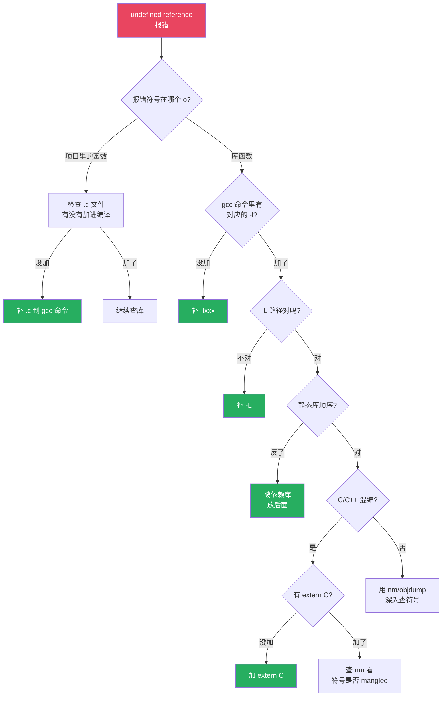

# 【金丹·66】为什么你的代码编译过了但链接报错

> **码农修仙传 · 金丹期 · 第66篇**
> 我是玄芯散人，带你从炼气修到大乘。

---

## 境界标识

```
╔══════════════════════════════════╗
║     金丹期 · 第66篇              ║
║     编译过了但链接报错           ║
║     undefined reference 实战   ║
║     预计阅读：14分钟              ║
╚══════════════════════════════════╝
```

---

## 修仙引入

上一篇讲了 ELF 文件的内部结构。这一篇拆修真界最常见的渡劫现场 `undefined reference` 这行报错。

前两篇你学了符号解析、静态与动态链接这一组底层知识，ELF 格式也跟着过了一遍。这一篇换个视角，从实战出发，把最常见的几种链接报错挨个摆开，讲排查顺序和 nm 等工具的用法。链接器这一关的金丹期修士，报错了 5 秒内判断属于哪一类，比会背 `readelf` 输出更管用。

金丹期修道者的内功在于从一行报错倒推出具体原因。百度搜索之前，先把 `nm` 跑一遍。

---

## 硬核主体

### 五个最常见的链接错误情境

链接器那一关的报错五花八门，按出现频率排，下面这五种占了大半。

第一种情境：函数只声明没实现，或者实现没进编译命令

入门弟子最常踩的坑。头文件里写了 `void foo(void);`，但 `foo.c` 没写出来，或者写了却没加到 `gcc` 命令里。

```c
// foo.h
void foo(void);   // 仅有声明

// main.c
#include "foo.h"
int main(void) { foo(); return 0; }
```

```bash
$ gcc main.c -o main
/tmp/ccXXXX.o: in function 'main':
main.c:(.text+0x12): undefined reference to 'foo'
collect2: error: ld returned 1 exit status
```

报错信息三个要点：`undefined reference to foo` 是要什么，`in function main` 是谁在要，`ld returned 1` 是链接阶段失败。

解决办法也直白：补上 `foo.c` 并加进编译命令，或者确认这个函数本来就在某个 `.c` 里、只是漏传了。

```bash
$ gcc main.c foo.c -o main    # 把 foo.c 加进来
$ ./main                       # 链接通过
```

修真比喻：每个弟子（`.o`）都登记了"我会某种功法"（UND 符号），但翻遍整座祠堂（链接器扫遍所有输入），都没找到这门功法的真正典籍，执事只能贴告示说"此法无人习得"。

第二种情境：库的顺序反了

GCC 链接静态库有一条铁则：左到右扫描，遇过不候。链接器扫到 `-lfoo` 时，从 `libfoo.a` 里挑出未定义符号对应的 `.o`，再把这些 `.o` 里的未定义符号去后面的库找。已经处理过的库，绝不会回头再扫一次。

依赖关系决定顺序：被依赖的库必须放后面。`libfoo.a` 引用了 `libbar.a` 里的 `bar_func` 时，必须是 `foo` 在前 `bar` 在后；反过来 `bar` 在前 `foo` 在后，链接器扫过 `libbar.a` 时还没人需要 `bar_func`，等扫到 `libfoo.a` 找出 `bar_func` 引用时，`libbar.a` 已经处理过了，不会回头找，于是报错。

```bash
# libfoo.a 引用 libbar.a 的函数，libbar 写在了前面（被依赖方在前，错误）
$ gcc main.c -lbar -lfoo -o main
undefined reference to 'bar_func'

# 把 libfoo 放前面（依赖方在前，被依赖方在后）
$ gcc main.c -lfoo -lbar -o main
# 链接通过
```

`-Wl,--start-group ... -Wl,--end-group` 是一组"反复扫描"指令，能处理循环依赖。代价是链接器会对组内库做多遍扫描，拖慢链接速度。gcc 官方都建议非必要不用。

```bash
$ gcc main.c -Wl,--start-group -lfoo -lbar -Wl,--end-group -o main
```

实际工程里更推荐的做法是把库顺序理清楚，或者把被依赖的库放在后面。第三库依赖复杂时（比如 OpenCV + FFmpeg + 系统库），用 `pkg-config --libs` 自动生成正确顺序。

修真比喻：执事捧着一摞功法目录从前往后翻。看到弟子需要的功法，核对姓名收下，再翻下一本。前一本没找到的，回头再翻？执事说不行，规矩就是这样。

第三种情境：C 和 C++ 混编的 name mangling

C++ 支持函数重载，编译器会把函数名编码成包含参数类型的字符串，比如 `add(int, int)` 变成 `_Z3addii`。这就是 Itanium C++ ABI 规定的 name mangling 规则。

C 语言没有函数重载，函数名就是函数本身。如果 C 代码调用一个 C++ 函数，链接器找的是 `add`，但 `.o` 里只有 `_Z3addii`，自然对不上号。

```cpp
// math.cpp
int add(int a, int b) { return a + b; }   // C++ 实现，符号名 _Z3addii
```

```c
// main.c
extern int add(int, int);
int main(void) { return add(1, 2); }
```

```bash
$ gcc main.c math.cpp -o main
undefined reference to 'add'   # 链接器找 "add"，但 .o 里只有 "_Z3addii"
```

解决办法是用 `extern "C"` 告诉 C++ 编译器"这段代码用 C 的命名约定"：

```cpp
// math.cpp
extern "C" int add(int a, int b) { return a + b; }   // 符号名就是 "add"
```

头文件里通常这么写，让 C 和 C++ 都能 include：

```cpp
#ifdef __cplusplus
extern "C" {
#endif

int add(int a, int b);

#ifdef __cplusplus
}
#endif
```

C 调用 C++ 库（特别是厂商 SDK、嵌入式 BSP）几乎一定会遇到这个问题。`nm` 跑一下能立刻看出来：库里的符号全是 `_Zxxx`，而你的代码要的是裸名。

修真比喻：C++ 弟子写功法要把"第几式""什么兵器"都编进功法名里（mangled name），C 弟子只记招式名（plain name）。两人隔行如隔山，只有 `extern "C"` 这本通行证能让 C++ 弟子把功法名换成 C 风格。

第四种情境：缺库路径

漏写 `-lxxx` 是基础问题，更隐蔽的是库文件不在默认搜索路径里。GCC 默认去 `/usr/lib`、`/usr/local/lib`、`/lib` 找 `.a` 和 `.so`。自家项目编译出来的库放在 `lib/` 目录下，必须用 `-L` 显式告诉链接器去哪里找。

```bash
# 编译报错：找不到 -lmylib
$ gcc main.c -lmylib -o main
/usr/bin/ld: cannot find -lmylib

# 加入 -L 指定路径
$ gcc main.c -L./lib -lmylib -o main   # 编译通过
```

运行时又出现新问题：可执行文件找不到动态库。

```bash
$ ./main
./main: error while loading shared libraries: libmylib.so: cannot open shared object file: No such file or directory
```

编译期是链接器找库，运行时是动态链接器（`ld.so`）找库。两边用的不是同一套搜索路径。运行时三种方式指定：

```bash
# 1. 环境变量（临时生效）
$ export LD_LIBRARY_PATH=./lib:$LD_LIBRARY_PATH
$ ./main

# 2. -Wl,-rpath 写进可执行文件（生产推荐）
$ gcc main.c -L./lib -Wl,-rpath,./lib -lmylib -o main
$ ./main   # 不需要设环境变量也能找到

# 3. 装到系统库目录（部署用）
$ sudo cp libmylib.so /usr/local/lib/
$ sudo ldconfig
```

`LD_LIBRARY_PATH` 是运行时环境变量，`LIBRARY_PATH` 是编译时环境变量，两者别混。

修真比喻：编译期是执事在自家藏经阁里翻书（`-L` + `-l`），运行时是弟子下山后去各地分舵取秘籍（动态链接器 + `-rpath`）。两个阶段找书的地点不一样，得各给一张地图。

第五种情境：重复定义（multiple definition）

头文件里写了非 inline 函数的实现，多个 `.c` 文件 include 之后，每个 `.o` 都会带一份同名函数的实现，链接器合并时报 `multiple definition`。

```c
// utils.h
int add(int a, int b) { return a + b; }   // 实现，不该放头文件
```

```c
// a.c
#include "utils.h"
int a(void) { return add(1, 2); }

// b.c
#include "utils.h"
int b(void) { return add(3, 4); }
```

```bash
$ gcc a.c b.c -o main
/tmp/ccYYYY.o: in function 'add':
b.c:(.text+0x0): multiple definition of 'add'
/tmp/ccZZZZ.o:a.c:(.text+0x0): first defined here
collect2: error: ld returned 1 exit status
```

三个常见根因：

1. 函数实现写在了头文件里（应该写在 `.c` 里）
2. 全局变量在头文件里声明又初始化（应该 `extern` 声明、`.c` 里定义）
3. C++ 里没用 `inline` 让头文件函数支持多翻译单元

修真比喻：每个弟子都复印了一份"祖传心法"夹在自家功法册里，链接器合并时发现好几本册子都有同一份心法，多人署名，谁是正版？修真界规矩是只能有一份，多了就要打架。

### nm 等排查工具

链接报错排查也讲套路。修真长老诊断弟子功法问题各有侧重，链接排查也有几件工具压箱底。报错了不知道从哪里入手，按下面这套流程走，5 秒判断属于哪一类。

nm：查符号表

`nm` 列出目标文件里的所有符号。报 `undefined reference` 时，先用它判断"谁在引用、谁应该提供"。

```bash
$ nm main.o | grep foo
U foo                 # U = undefined，main.o 引用了 foo
$ nm libfoo.a | grep foo
T foo                 # T = text 段已定义，libfoo.a 提供了 foo
```

常用符号字母含义：

| 字母 | 含义 |
|------|------|
| T / t | text 段已定义的函数（大写全局，小写局部） |
| U | undefined，未定义符号 |
| D / d | 已初始化数据段 |
| B / b | BSS（未初始化数据段） |
| R / r | 只读数据段 |
| W / w | weak symbol，弱符号 |

大写表示全局（global），小写表示局部（local）。`U` 是排查 undefined reference 时的关键线索。

```bash
$ nm main.o
                 U printf      # 引用了 printf（要去 libc.so 里找）
0000000000000000 T main        # main 函数的定义在这里
```

objdump：看反汇编和重定位

`objdump -d` 看反汇编，`objdump -r` 看重定位表。链接报错时，`objdump -r` 能直接定位"哪条指令引用了哪个未定义符号"。

```bash
$ objdump -r main.o
main.o:     file format elf64-x86-64

RELOCATION RECORDS FOR [.text]:
OFFSET           TYPE              VALUE
000000000000001a  R_X86_64_PC32     printf             # 0x1a 处引用了 printf

$ objdump -d main.o | head -30
0000000000000000 <main>:
   0:   f3 0f 1e fa             endbr64
   4:   55                      push   %rbp
  ...
  1a:   e8 00 00 00 00          call   0x1f  <main+0x1f>   # 这里就是 printf 的调用点
```

看到 0x1a 处 `call` 指令填的偏移是 `00 00 00 00`，这就是链接器待填的占位符。

objdump 还有一个常见用法是看静态库的成员：

```bash
$ objdump -a libfoo.a   # 列出所有成员文件
```

ldd：看运行时动态库依赖

linker error 解决了，可执行文件跑不起来？用 `ldd` 看运行时依赖的动态库是不是都能找到：

```bash
$ ldd ./main
    linux-vdso.so.1 (0x00007ffd123ab000)
    libmylib.so => not found           # 这就是运行时找不到的库
    libc.so.6 => /lib/x86_64-linux-gnu/libc.so.6
    /lib64/ld-linux-x86-64.so.2 (0x00007f...)
```

`not found` 就是问题所在。再用 `readelf -d main | grep NEEDED` 看可执行文件里登记了哪些 `.so`：

```bash
$ readelf -d main | grep NEEDED
 0x0000000000000001 (NEEDED)             Shared library: [libmylib.so]
```

`DT_NEEDED` 是动态链接器要找的清单，链接器当时把 `libmylib.so` 写进了可执行文件，但运行时找不到它。补 `-Wl,-rpath` 或者装到系统库目录都行。

修真比喻：`nm` 看弟子手里的身份玉牌登记了什么招式，`objdump` 看弟子写的功法原文细节，`ldd` 看弟子下山后能进哪些分舵取秘籍。三件套配合，编译期和运行时的链接问题都能定位。

### 静态库 vs 动态库：链接行为的实战差异

修真界有"宗门典籍"和"江湖流通本"之分。静态库是宗门典籍，抄一份带在身边；动态库是江湖流通本，需要时去分舵取。

静态库 `.a`

```bash
# 打包静态库：用 ar 把多个 .o 打成一个 .a
$ ar rcs libfoo.a foo.o bar.o baz.o

# 查看静态库内容
$ ar t libfoo.a
foo.o
bar.o
baz.o
```

链接器处理静态库的规则：

1. 左到右扫描命令里的库
2. 遇到 `-lfoo`（即 `libfoo.a`），从库里挑出能解决当前未定义符号的 `.o`
3. 把这些 `.o` 加入链接
4. 这些 `.o` 引用的新未定义符号，去后面的库找
5. 已经处理过的库不再回头

也就是说，被依赖的库必须放在后面。

动态库 `.so`

```bash
# 编译动态库：-fPIC 生成位置无关代码，-shared 生成 .so
$ gcc -fPIC -shared foo.c -o libfoo.so

# 编译可执行文件：链接动态库
$ gcc main.c -L. -lfoo -o main

# 指定运行时路径（推荐）
$ gcc main.c -L. -lfoo -Wl,-rpath,./lib -o main
```

动态库链接有几个要点：

1. `-fPIC`：位置无关代码（Position Independent Code）。库要被多个进程共享，必须能加载到任意地址。`-fPIC` 让代码用相对地址而不是绝对地址。
2. SONAME：动态库的"身份证号"。用 `gcc -Wl,-soname,libfoo.so.1` 指定，记录在 `.so` 内部。
3. DT_NEEDED：可执行文件登记"运行时需要哪些 `.so`"，由动态链接器（`ld-linux.so`）加载。
4. -Wl,-rpath：把运行时库搜索路径写进可执行文件。部署到目标机器时不依赖 `LD_LIBRARY_PATH` 环境变量。

修真比喻：静态库是宗门印发的纸质典籍，弟子随身带一份，副本多就占地方。动态库是江湖流通的玉简，所有人都到同一个分舵读取，省地方但依赖分舵一直开着。

两者链接行为的差异对比

| 对比项 | 静态库 `.a` | 动态库 `.so` |
|------|------------|-------------|
| 链接时机 | 链接时整段复制进可执行 | 链接时只留待办清单，运行时加载 |
| 库顺序 | 顺序敏感，反了会报错 | 顺序相对宽松 |
| 可执行大小 | 大（含库代码） | 小（只含引用） |
| 升级库 | 重新编译可执行 | 直接替换 `.so` 即可 |
| 编译依赖 `-fPIC` | 不需要 | 必须 |
| 排查命令 | `nm libfoo.a` 与 `ar t` | `nm -D libfoo.so` `ldd` `readelf -d` |

混淆两种库的报错也是常见现象：编译时用的是静态库路径（`-L./lib -lfoo`），运行时又找不到动态库。`file libfoo.a` 和 `file libfoo.so` 一眼就能分清，`ar t` 看静态库，`readelf -d` 看动态库的 SONAME 和 NEEDED。

### 实战排查流程：5 秒决策树

链接报错的排查有固定套路。把上面五种情境和三件套串起来，就是一套 5 秒决策树：



把这套流程记熟，看到 `undefined reference` 直接按节点走，比百度搜索快得多。

修真比喻：长老诊断弟子功法问题，先看弟子档案（`nm`），再看功法原文（`objdump`），最后查下山路线（`ldd`）。三步查下来，五种常见问题一网打尽。

---

## 修仙术语对照表

| 修仙术语 | 技术现实 | 本篇位置 |
|---------|---------|---------|
| 祠堂告示 | undefined reference 报错 | 五种情境 |
| 功法典籍未补 | 函数声明了但实现没编译 | 情境一 |
| 功法目录翻阅顺序 | 静态库从左到右扫描 | 情境二 |
| 反复翻阅 | `--start-group --end-group` | 情境二 |
| 招式名带兵器 | C++ name mangling | 情境三 |
| C 风格通行证 | `extern "C"` | 情境三 |
| 藏经阁与分舵 | 编译期库路径与运行时库路径 | 情境四 |
| 运行时地图 | `-Wl,-rpath` | 情境四 |
| 多弟子同修一法 | multiple definition | 情境五 |
| 身份玉牌查询 | nm 命令 | 三件套 |
| 功法原文校对 | objdump 反汇编 | 三件套 |
| 山下分舵路线 | ldd 查看动态库依赖 | 三件套 |
| 宗门纸质典籍 | 静态库 .a | 静态 vs 动态 |
| 江湖流通玉简 | 动态库 .so | 静态 vs 动态 |
| 位置无关心法 | -fPIC | 静态 vs 动态 |

---

## 进阶条件

会用编译命令和看到链接报错能 5 秒定位根因之间，差这几条：

- [ ] 能区分五种常见 `undefined reference` 情境（缺源文件 / 库顺序 / C++ 名字修饰 / 缺路径 / 重复定义）
- [ ] 能用 `nm main.o | grep xxx` 看符号的 U/T 状态
- [ ] 能用 `nm` 的大小写区分全局符号（大写）与局部符号（小写）
- [ ] 能用 `objdump -r` 看重定位表，定位哪条指令引用了哪个符号
- [ ] 能用 `ldd ./program` 看运行时动态库依赖，识别 `not found`
- [ ] 能用 `-Wl,-rpath` 把运行时库搜索路径写进可执行文件
- [ ] 能解释 GCC 静态库从左到右扫描的规则，并写出正确的库顺序
- [ ] 知道 `extern "C"` 在 C/C++ 混编时的用法

> 最后两条是金丹期实操分水岭。链接报错天天见，能 5 秒判断属于哪一类，再去查具体根因，就脱离了"瞎百度"的阶段。把这些排查工具练熟，几乎所有常见链接问题都能独立解决。

---

## 下期预告 + 互动

> 下一篇：【金丹·67】操作系统内核是天道规则
>
> 编译与链接讲完了，金丹期进入第二组操作系统内核。内核是电脑里的"天道"，普通程序跑在用户态（凡间），内核跑在内核态（天庭）。两边之间通过系统调用通信。本篇先勾勒内核的整体轮廓，从用户态与内核态的边界入手，再讲到系统调用的入口，最后过一遍 CFS 调度器的基本概念。

现在问你：

> 🔍 你被 `undefined reference` 卡过最久的一次，最后查到是哪种根因？
>
> ⚙️ 你项目里更常用静态库（.a）还是动态库（.so）？为什么选这个？
>
> 评论区聊聊你跟链接器斗智斗勇的经历。
>
> 我是玄芯散人，带你从炼气修到大乘。

---

*本文是「码农修仙传」系列第66篇。系列导航见 [xren.ren](https://xren.ren)*
