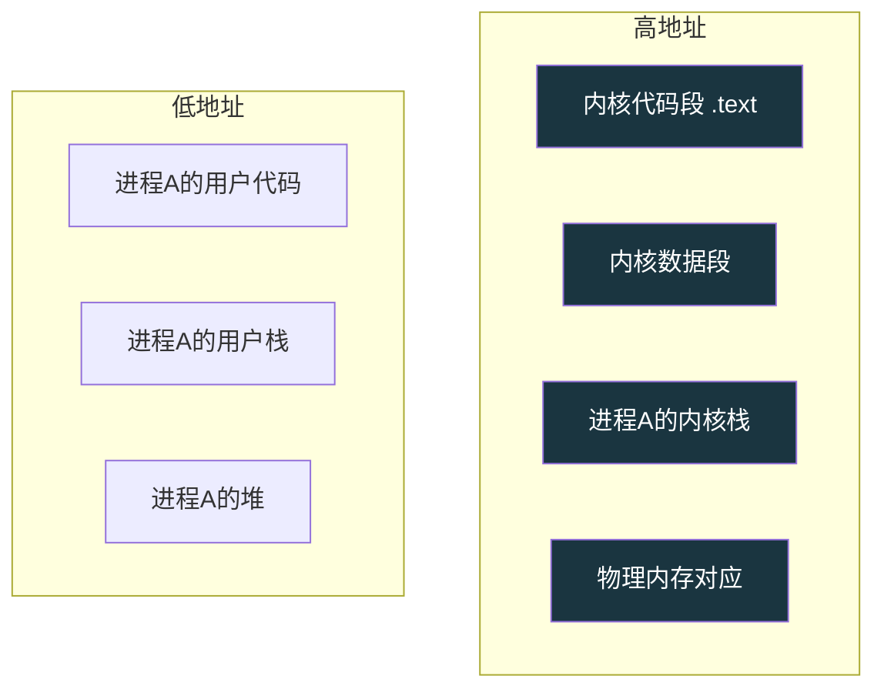
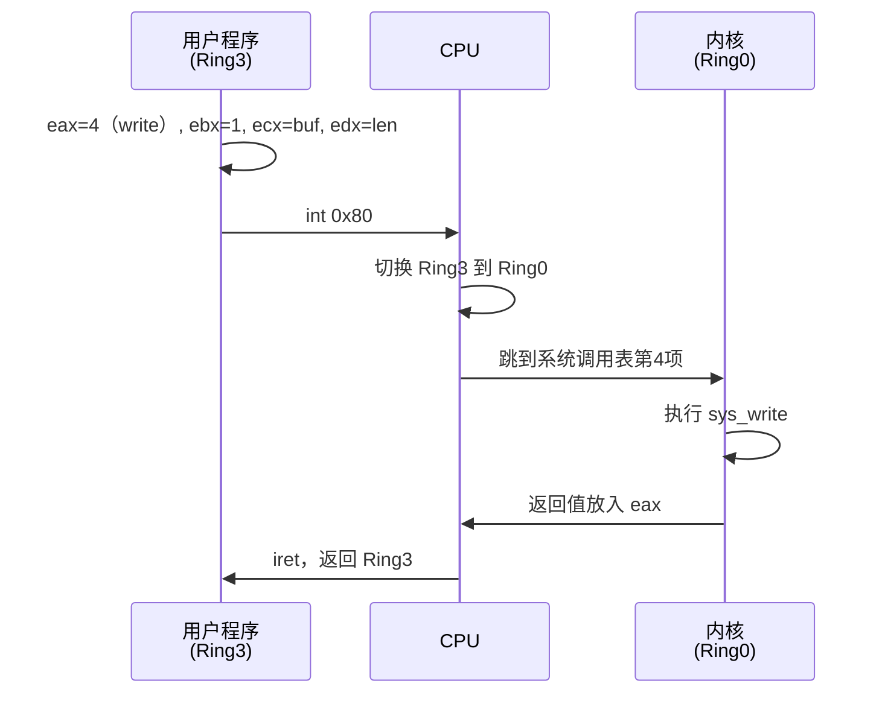
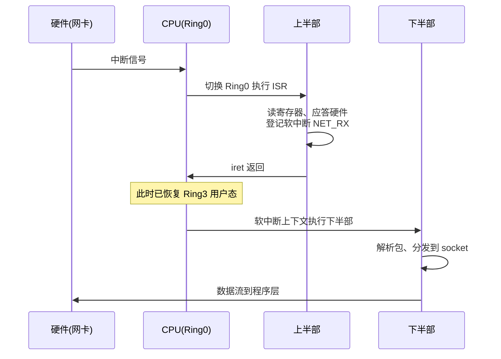
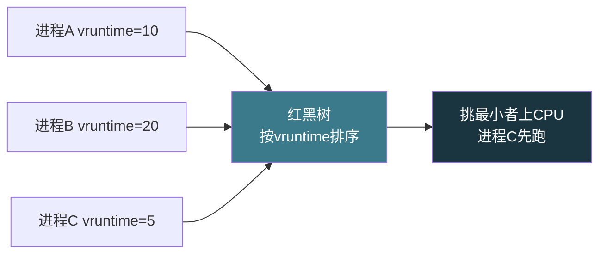

# 【金丹·67】操作系统内核是天道规则

> **码农修仙传 · 金丹期 · 第67篇**
> 我是玄芯散人，带你从炼气修到大乘。

---

## 境界标识

```
╔══════════════════════════════════╗
║     金丹期 · 第67篇              ║
║     操作系统内核是天道规则        ║
║     内核空间/用户空间/系统调用/中断 ║
║     预计阅读：16分钟              ║
╚══════════════════════════════════╝
```

---

## 修仙引入

前几篇拆过编译与 ELF 这些环节。我们的 `.c` 文件预处理后变成 `.i`，再经编译变成 `.s`，汇编出来是 `.o`，链接之后才出可执行文件。这一路解释的是"程序怎么变成一个文件"。

但这个文件跑起来后，谁在管它？谁决定它能访问哪些内存、何时被调度？这些事不归程序自己管，归一个更大的东西管，操作系统内核。

修真界里它就是\"天道\"。天道不显形，万物都按它的规则运行。弟子（用户程序）能做什么、能用什么资源，全看天道的规矩。内核就是这套天道规则的具体执行者。

金丹期的这篇，先讲内核空间和用户空间的隔离，再延伸到 CPU 特权级，然后到系统调用，最后讲中断。下一篇把系统调用单独拆开。这一组八篇（067-074）一起把操作系统的骨干搭起来。

---

## 硬核主体

### 操作系统不是\"一个程序\"

很多入门弟子把 Windows、Linux 当成\"一个软件\"。其实它们由两部分组成：内核（kernel）和用户程序。

内核是常驻内存、拿到 CPU 特权的那部分代码。用户程序是你写的、用编译器编译出来的可执行文件。它们的区别很像天庭（kernel）和凡间（userland）的关系。

天庭的官员常驻天宫，掌管灵气流转、弟子渡劫等大事。凡间的弟子各自修炼、各过各的日子。凡间弟子想调动天地灵气，得先写奏章递上去，批准了才能动手。

Linux 的内核设计思路是宏内核（monolithic kernel）。进程调度和内存管理等几样主干功能，都跑在内核空间，一起编译成一个二进制（`vmlinux`）。Windows NT、macOS 是混合内核，部分在内核、部分在用户态服务。微内核（如 Minix、QNX）只把最基本的东西放内核，其它都跑在用户态，通过消息传递通信。

金丹期不深挖内核分类，只记住一点。内核是常驻内存、被硬件保护起来的总线，所有控制动作都在它手里。

### 内核空间和用户空间：内存的天凡分界

现代 OS 把整个虚拟内存划成两块。

内核空间：放内核代码与内核栈、内核堆这几样，地址高位 1GB，只有内核态能访问，进程不能直接踩进来。

用户空间：放程序代码、用户栈与 malloc 拿到的堆，地址低位 3GB，所有进程都能在各自的页表里搬移出独立区域。



为什么要分开？两条硬约束。

第一条，稳定性。所有程序都跑在内核里，一个野指针就能踩坏内核、踩坏整个系统。Firefox 崩溃不能让 Windows 也蓝屏。隔离之后，用户程序出 bug，最多自己崩，内核和其它进程不受牵连。

第二条，安全。外设的控制权全部由内核管理，普通程序不能直接读写外设寄存器。内核提供受控接口（系统调用）给程序用，相当于天庭垄断了灵气调动权，弟子想调动得按规矩走流程。

修真界比喻：天道给天庭划了独立的地盘（天宫），凡间弟子踩不进天宫。弟子需要调动灵气，写奏章送上天庭，天庭批了再施法。这样弟子打架也只波及凡间，不会让天宫塌了。

### CPU 特权级：Ring0 与 Ring3

\"用户态\"和\"内核态\"这两个词常听到，但凭什么用户程序进不了内核空间？这个特权不是软件规定，是 CPU 硬件强制的。

Intel x86 CPU 设计了 4 个特权级，叫 Ring0-Ring3。

Ring 0（特权级 0，最高）：只有内核代码用，可以访问所有内存、所有 CPU 指令和所有设备。

Ring 1（特权级 1）：历史上给设备驱动用，现在闲置。

Ring 2（特权级 2）：历史上给设备驱动用，现在闲置。

Ring 3（特权级 3，最低）：所有用户程序用，只能访问用户空间内存，特权指令一律禁止。

Linux 和 Windows 都只用 Ring0 和 Ring3 两级，Ring1、Ring2 闲置。Ring3 的程序如果硬要执行特权指令（比如关中断、直接写控制寄存器），CPU 硬件直接抛"非法操作"异常（#GP），程序被强杀。


怎么进入 Ring0？两条路。

主动路：用户程序执行系统调用指令（x86 的 `syscall`，32 位的 `int 0x80`）。

被动路：CPU 在跑用户程序时，硬件（或异常）触发中断，CPU 自动切到 Ring0 执行中断处理程序。

这两条路都需要特殊的\"门\"机制（trap 门 / 中断门）配合，由 CPU 硬件完成 CPL（当前特权级）的切换。返回时再切回 Ring3。

修真比喻：Ring0 是天庭，Ring3 是凡间。两界之间隔着结界（CPU 硬件保护）。凡间弟子想入天庭，必须走官道（系统调用）或天象示警（中断），私自穿结界会被天雷劈死（CPU 抛异常）。

### 系统调用：凡间弟子向天庭的奏章

用户程序要做内核才能做的事（读文件或建进程这种），不能自己直接动手，必须走系统调用。

系统调用的执行流程（以 x86 32 位传统的 `int 0x80` 为例）。

第一步，用户程序把\"想做什么\"编号填进 `eax`，参数按顺序填进 `ebx, ecx, edx, esi, edi, ebp`。

第二步，执行 `int 0x80` 指令，CPU 硬件触发一个软中断，把控制权切到 Ring0。

第三步，内核根据 `eax` 里的编号查\"系统调用表\"（sys_call_table），跳到对应函数。

第四步，内核函数在内核栈上跑完，把返回值放回 `eax`。

第五步，内核执行 `iret` 指令返回，CPU 切回 Ring3，用户程序继续跑。

x86_64 下用专门的 `syscall` 指令替代 `int 0x80`，寄存器分工也变了。系统调用号放 `rax`，参数用 `rdi, rsi, rdx, r10, r8, r9`。`syscall` 比 `int 0x80` 快很多（不经过中断门）。

看一段最小的例子。

```c
// sys.c
#include <unistd.h>
#include <sys/syscall.h>

int main(void)
{
    // 直接用 syscall 库函数发起系统调用，等价于 write(1, "Hello\n", 6)
    syscall(SYS_write, 1, "Hello\n", 6);   // SYS_write 是内核给的编号
    return 0;
}
```

`syscall()` 库函数帮我们封装好了寄存器传参、触发软中断等动作。背后是同一套流程。

修真比喻：弟子想开山立派（建进程），写奏章\"臣请在某处立宗\"递上去。奏章格式是统一的，开头是编号（奏章类型），中间是参数（地点、人数），最后盖印。奏章送进天庭，执事按编号翻律条，批复相应。



### 中断处理：天象示警通知天庭

系统调用是用户程序主动发起的"奏章"。还有一类事件是被动的、硬件触发的。网卡收包、键盘按键这类事，CPU 自己不知道，需要硬件主动通知 CPU。

通知的机制就是中断。

CPU 硬件支持两种"停下来"的机制。

中断（Interrupt）是外部硬件异步通知 CPU，网卡收到包、键盘按键都是这类。

异常（Exception）是 CPU 内部同步出问题，例如除以零、缺页或者执行了非法指令。

两者在 CPU 看来差不多，都暂停当前指令流，切换到 Ring0，由内核的中断处理程序（ISR，Interrupt Service Routine）接管。

中断的处理流程。

第一步，外设发信号给中断控制器（如 x86 的 8259 PIC 或 APIC）。

第二步，中断控制器把中断号转发给 CPU 的 INTR 引脚。

第三步，CPU 查\"中断描述符表\"（IDT，Interrupt Descriptor Table）找到对应的 ISR。

第四步，CPU 自动切到 Ring0，保存现场（寄存器、当前 Ring3 的栈指针），跳转 ISR。

第五步，ISR 执行：读取硬件寄存器、应答硬件（比如通知网卡\"我收到了\"）、清除中断标志。

第六步，ISR 返回（iret），CPU 切回 Ring3，被打断的程序继续跑。

修真比喻：深夜小村落起火（网卡收到包），村口烽火台升起（中断控制器转发信号），天庭守将看到烽火（CPU 切到 Ring0），安排最近的救火队下山（ISR 执行），火灭了把弟子送回原职守（恢复现场继续跑）。这种紧急处置必须做得快，慢了就烧了半个镇子。

### 中断为什么要分上半部和下半部

ISR（Interrupt Service Routine）有个硬约束：执行时是关中断状态（防止中断嵌套自己），必须尽快结束，否则系统响应延迟会爆表。

但很多中断要做的事不能"尽快"。比如网卡收到一个 1500 字节的以太网帧，ISR 要从包缓冲区读出整个包、再把数据交给协议栈。这事干完可能几十微秒。

Linux 的解决方案是分两半。

上半部（Top Half）是硬中断处理，跑在中断上下文（关中断状态），约束是快进快出，只做必须立刻做的事（应答硬件、读寄存器）。

下半部（Bottom Half）是软中断 / tasklet / workqueue 的总称，跑在软中断上下文或进程上下文（开中断状态），可以慢慢干，允许睡眠，能耗时间。

下半部的几类实现进一步细化。

软中断（softirq）。静态分配，最多 32 个，目前固定使用约 10 个，运行在中断上下文，不能睡眠。

tasklet。基于软中断实现，动态创建，同类 tasklet 在单 CPU 上不能并发。

workqueue。工作队列，运行在进程上下文，可以睡眠，跑在内核线程 `kworker` 里。

什么时候用哪个？网络收包情形下，上半部读完包立刻登记软中断，下半部用 `NET_RX` 软中断处理协议栈（不能睡眠）。块设备情形下，上半部读完数据登记，下半部用 workqueue（可能睡眠等 I/O 完成）。用户按键情形下，上半部读出键值，立刻 `wake_up_interruptible` 通知读键盘的进程。

修真比喻：天庭接到告急文书（上半部 ISR），立刻批\"知道了，速派人去\"，然后立刻回去处理下一份紧急文书。下半部是真正的救火队员，被文书召集后慢慢赶到现场干活。两批人同时忙，谁也不耽误谁。



### CFS 调度器：天道怎么决定谁先修炼

天庭日常要管很多弟子，谁先修炼、谁后修炼？内核也要管很多进程，谁先跑？这事归调度器管。

Linux 2.6.23 之后默认的调度器是 CFS（Completely Fair Scheduler）。它的基本思路。

每个进程有个 `vruntime`（虚拟运行时间），跑得越久越大。调度的红黑树里挑 `vruntime` 最小的进程先跑。一个进程被调度走、放弃 CPU 时，更新 `vruntime`；下次轮到 `vruntime` 最小的。经过足够久，所有进程 `vruntime` 趋同，谁都分到差不多的 CPU 时间。

`nice` 值（-20 到 +19）作为权重。nice 越低（-20 最高），权重越高，跑得快，`vruntime` 涨得慢，更容易被优先调度。

金丹这一篇只点到为止，CFS 后面在 069 篇会展开讲。专门给实时进程用的另有 RT 调度器（SCHED_FIFO / SCHED_RR），优先级比 CFS 高，普通进程看不到。这一节让读者知道一件事。CPU 不会同时跑所有进程，它由内核在不同进程之间快速切换，谁先跑谁后跑由调度器决定。



修真比喻：CFS 是天庭的练功堂轮值表。每个弟子有一本\"已练功时长\"的簿子，簿子越长的越要往后排。新来的弟子簿子是空的，自然排前面。整张表定期重排，保证大家练得差不多。

### 为什么隔离设计是必需的

修真界按这套规矩稳定运行了几千年，OS 也按这套隔离设计稳定运行了几十年。这套设计的精髓在三件事。

第一，资源垄断。CPU 和内存、外设这几类硬件只有内核能直接配置，程序必须经内核批准。

第二，防御纵深。即使某个程序有 bug，最坏波及也只是自己崩，内核和其它进程不牵连。

第三，共享可控。多个程序同时跑在同一台机器上，每个都以为自己独占内存（虚拟内存）+ CPU 时间片（调度器）。操作系统把\"共享硬件\"变成\"各用各的幻觉\"。

没有这套设计会怎样？所有程序都能直接写硬件、所有程序共享同一份物理内存。一个小 bug 就能让整台机器蓝屏或重启，Win98 时代的\"蓝屏噩梦\"就是这么来的。

修真比喻：没有天道的世界叫"末法乱世"。灵气乱窜，弟子之间乱成一团，厉害的随便欺负弱的，整体效率反而低。有了天道，弟子各自修炼、天庭统一调度，反而个个都能稳步进阶。

---

## 修仙术语对照表

| 修仙术语 | 技术现实 | 本篇位置 |
|---------|---------|---------|
| 天道 | 操作系统内核 | 引入 |
| 天庭 | 内核空间 | 内存划分 |
| 凡间 | 用户空间 | 内存划分 |
| 天庭地盘 | Ring0 特权级 | CPU 特权级 |
| 凡间身份 | Ring3 特权级 | CPU 特权级 |
| 结界 | 硬件强制隔离 | CPU 特权级 |
| 奏章 | 系统调用 | 系统调用 |
| 奏章编号 | 系统调用号 | 系统调用 |
| 执事按编号翻律条 | 系统调用表 sys_call_table | 系统调用 |
| 奏章官方格式 | 系统调用调用约定 | 系统调用 |
| 天象示警 | 中断 | 中断处理 |
| 烽火台 | 中断控制器（8259 / APIC / GIC） | 中断处理 |
| 烽火编号 | 中断号 | 中断处理 |
| 救火令 | 中断描述符表 IDT | 中断处理 |
| 守将接到文书 | ISR 中断服务程序 | 中断处理 |
| 天宫火警出警 | 上半部（硬中断） | 上半下半 |
| 火场真正灭火 | 下半部（软中断 / tasklet / workqueue） | 上半下半 |
| 练功堂轮值 | CFS 调度器 | CFS |
| 弟子练功簿 | vruntime | CFS |
| 红黑树排班表 | 调度器红黑树 | CFS |

---

## 进阶条件

看完这一篇到能向别人讲清"内核为什么必须跟用户程序分开"，差这几条：

- [ ] 能画出 x86 的 Ring0-Ring3 四级特权级，说明 OS 为什么只用 0 和 3
- [ ] 能解释为什么用户程序不能直接写硬件寄存器（CPU 硬件禁止）
- [ ] 能列出系统调用的执行流程（参数入寄存器 → 触发软中断 → 切 Ring0 → 查表 → 执行 → 返回）
- [ ] 能解释 32 位 `int 0x80` 与 64 位 `syscall` 指令的区别（寄存器约定、性能）
- [ ] 能讲清中断和异常的区别，举出三个真实中断源（键盘 / 网卡 / 定时器）
- [ ] 能解释 ISR 为什么必须快（关中断状态、不能阻塞）
- [ ] 能区分上半部（硬中断）和下半部（软中断 / tasklet / workqueue）的适用情形
- [ ] 能说出 CFS 调度器的思路（按 vruntime 排序的红黑树）
- [ ] 能列出内核空间/用户空间隔离设计背后的几条原因（涉及安全和稳定、共享可控这几个理由）

> 最后一条是金丹期对操作系统理解的\"分水岭\"。能在面试里三句话讲清\"为什么 OS 要把内核和用户程序分开\"，操作系统基础这一关就过了。

---

## 下期预告 + 互动

> 下一篇：【金丹·68】系统调用：用户态到内核态的通道
>
> 这一篇只点了系统调用的轮廓。下一篇把这些全拆开看：`int 0x80` 与 `syscall` 路径之间的差别，以及 glibc 包装和 strace 抓调用。看完之后再有人问你"为什么 `printf` 这么慢"，你能直接答出来，慢就慢在中间的三次用户态内核态切换。

现在问你：

> 🔍 你写过的程序里，最常见的系统调用是哪几个？用 `strace -e trace=write,read,openat ./your_program` 跑一下，统计下哪个调用最多。
>
> ⚙️ 你有没有排查过\"网卡收包慢\"这种问题？十有八九是上半部把 CPU 跑满了，下半部还没来得及处理，这就是\"中断上下文开销\"的具体表现。
>
> 评论区聊聊你跟操作系统内核打过的交道。
>
> 我是玄芯散人，带你从炼气修到大乘。

---

*本文是「码农修仙传」系列第67篇。系列导航见 [xren.ren](https://xren.ren)*
