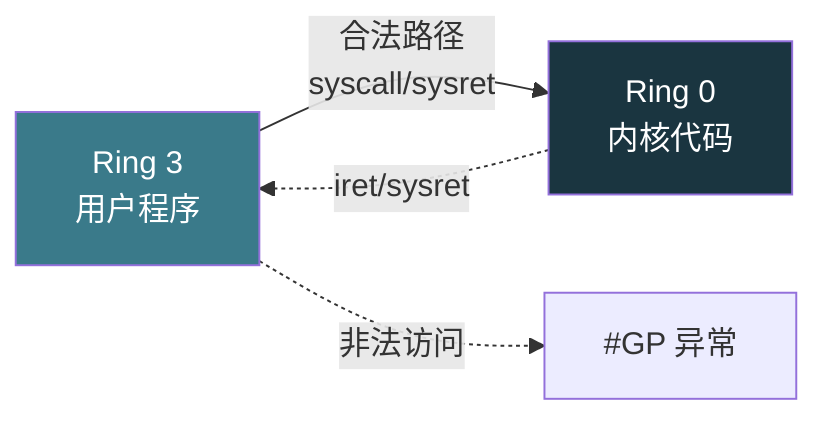
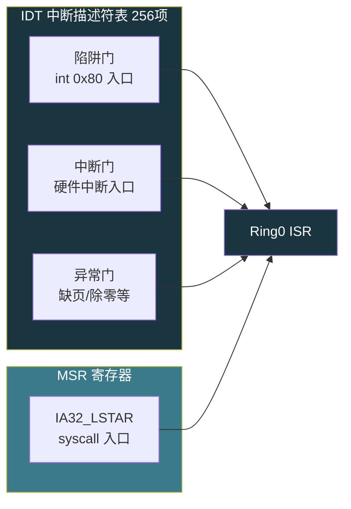
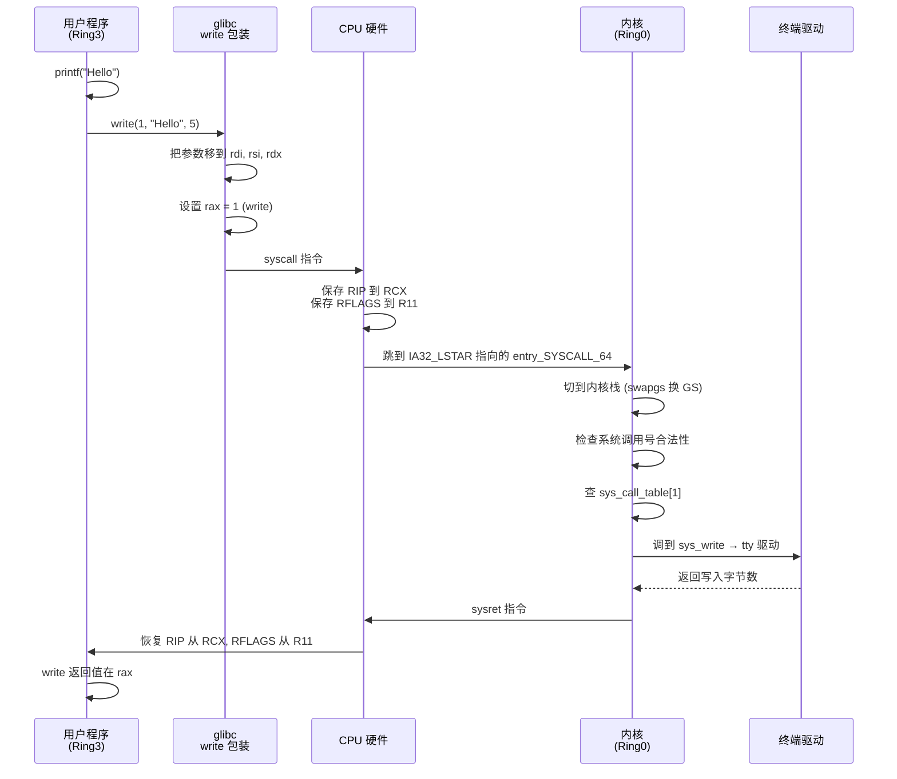
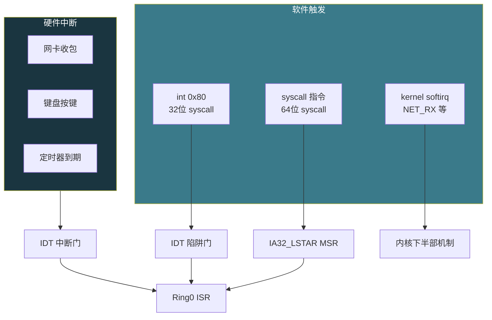
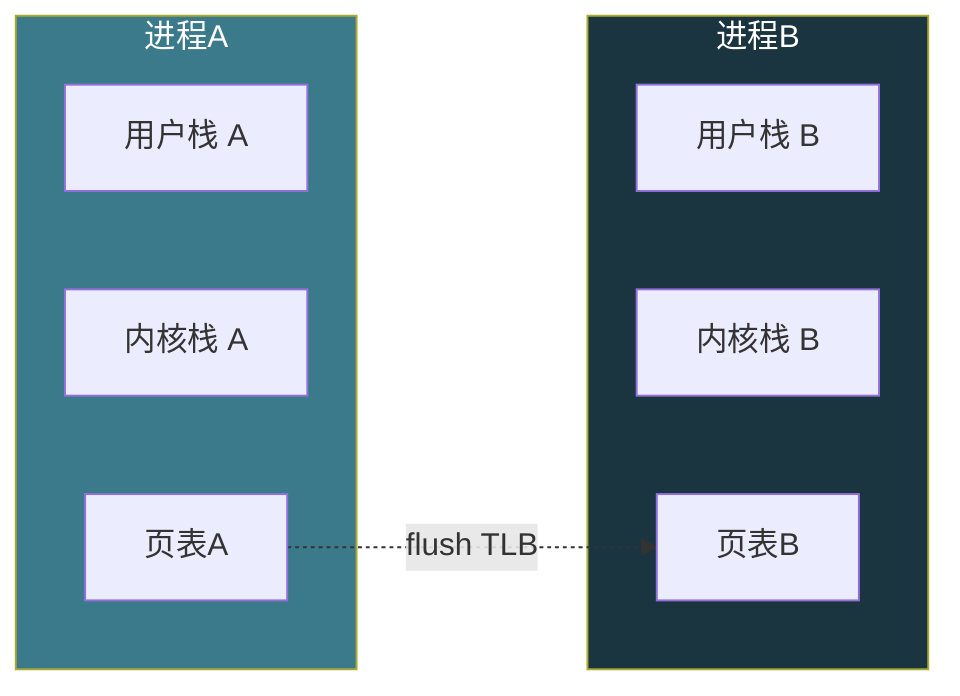

# 【金丹·68】用户态和内核态：CPU的特权级

> **码农修仙传 · 金丹期 · 第68篇**
> 我是玄芯散人，带你从炼气修到大乘。

---

## 境界标识

```
╔══════════════════════════════════╗
║     金丹期 · 第68篇              ║
║     用户态和内核态：CPU的特权级   ║
║     ring0/ring3切换、int 0x80/   ║
║     syscall、软中断vs硬中断       ║
║     预计阅读：18分钟              ║
╚══════════════════════════════════╝
```

---

## 修仙引入

上一篇把操作系统的整体骨架搭起来了：内核是天道，分用户空间和内核空间，特权级只用了 Ring0 和 Ring3。系统调用是弟子向天庭递奏章的正规通道，中断是天象示警，CFS 调度器决定谁先跑。

但那些是"是什么"和"为什么"。这一篇跳过概念铺垫，专注机制层细节：CPU 凭什么硬件上禁止 Ring3 访问内核？同一句 `syscall`，32 位 `int 0x80` 和 64 位 `syscall` 指令的硬件机制有什么差别？网卡收包和 `printf` 触发的中断，硬件上是同一回事吗？切换那一瞬间，CPU 到底保存了什么、丢了什么？

修真界里，这一篇就是打开天庭大门。弟子在门外递上奏章，守将验过玉牌放他进内门；弟子办完事，原路返回外门。这一篇就看守将在这条路上做了哪些事。

---

## 硬核主体

### CPU 的四个特权级：硬件写死的结界

x86 CPU 设计了 4 个特权级（Ring），编号 0 到 3。这个分级写在 CPU 硬件里，软件改不了。



- Ring 0（最高）：内核代码独占，可访问全部内存与所有指令，能直接操作硬件。
- Ring 1 / Ring 2（中间）：设计上给设备驱动用的，实际 Linux 和 Windows 都不碰，留空。
- Ring 3（最低）：所有用户程序跑在这里，能访问的内存被严格限制，能用的指令受限。

每个代码段有个 DPL（Descriptor Privilege Level），每个运行的程序有个 CPL（Current Privilege Level）。CPU 在每条指令执行前都会做一道检查：CPL 必须大于等于 DPL，否则直接抛 #GP（General Protection Fault）。

### CPL 和 DPL：进出天庭的令牌检查

具体怎么检查？想象修真界的山门。

天庭的每个建筑门口挂着一个牌子（DPL），写明\"内门弟子可入\"或\"外门弟子可入\"。每个弟子身上揣着一张身份牌（CPL），写明你是内门还是外门。守将（CPU 硬件）每一步都看：你的身份（CPL）够不够格进这道门（DPL）。

更严格的是：CPU 还检查你能不能跳过层级。Ring3 想直接跳到 Ring0？跳板不存在，CPU 抛异常把你拍回 Ring3。Ring0 想跳 Ring3 可以，但走的是 `iret` 或 `sysret`，由硬件自己切回去。

修真比喻：CPL 是弟子身上的玉牌，DPL 是山门的禁制等级。玉牌不够格，禁制就把弟子弹回去。

### 切换的三道门：硬件帮你完成 Ring 跃迁

Ring3 想进 Ring0，软件不能直接跳，必须走 CPU 提供的\"门\"（gate）。x86 提供了三类门：

- 陷阱门（Trap Gate）：用于系统调用（`int 0x80` / 旧版 `int 0x80` 等）。进入后不屏蔽中断。
- 中断门（Interrupt Gate）：用于硬件中断。进入后自动屏蔽中断（IF=0），保证 ISR 不会被自己打断。
- 任务门（Task Gate）：历史上用于任务切换，现代 OS 几乎不用。

门描述符放在 IDT（Interrupt Descriptor Table）里。IDT 是内核在启动时建好的 256 项表格，每项对应一个中断号或异常号。



CPU 切换 Ring 时自动做这几件事（硬件完成，不需要软件介入）：

1. 把 CPL 当前值压栈（连同 CS、EIP、EFLAGS、ESP、SS 等）。
2. 从 IDT 取出目标门描述符，检查 DPL。
3. 加载目标代码段描述符。
4. 把 CPL 改成目标段的 DPL。
5. 跳到目标指令地址。

返回时（`iret` / `sysret`），硬件反向操作一遍，把上面保存的东西弹回。

修真比喻：山门有三种门，奏章走侧门（陷阱门），紧急军报走正门（中断门），灾难警报走告急门（异常门）。进门那一刻，守将帮你把外门玉牌换成内门玉牌；出门那一刻，再换回去。

### 系统调用入口：int 0x80 vs syscall

从 Ring3 进 Ring0 跑系统调用，x86 历史上有两条指令路径。

32 位时代用 `int 0x80`（中断号 0x80 = 128）。这是传统的软中断指令，CPU 把它当成一个特殊中断处理。先查 IDT 第 128 项，跳到系统调用入口（Linux 内核里的 `system_call` 函数）。

```c
// 32位 Linux 写一个 syscall 的最简方式（汇编）
// 参数传递约定：eax=系统调用号, ebx=fd, ecx=buf, edx=count
mov $4, %eax        // 4 = __NR_write
mov $1, %ebx        // fd = stdout
lea buf, %ecx       // buf = 字符串地址
mov $6, %edx        // count = 6
int $0x80           // 触发软中断，进入 Ring0
```

64 位时代，Intel 和 AMD 各自加了一条专用指令：

- Intel：x86_64 用 `syscall`（AMD64 也支持）
- ARM：AArch64 用 `svc`（System Call）
- RISC-V：`ecall`

触发路径上，`int 0x80` 走 IDT 第 128 项触发，相当于一次中断流程；`syscall` 直接从 MSR（Model-Specific Register）`IA32_LSTAR` 读目标地址，跳过 IDT 查询，硬件路径短得多。

寄存器保存方面，`int 0x80` 由 CPU 自动压栈 EIP、CS、EFLAGS、ESP、SS；`syscall` 不压栈，只把 RIP 保存到 RCX，RFLAGS 保存到 R11，栈指针 RSP 完全不动。操作系统必须自己保存剩余寄存器。

返回指令也不同，`int 0x80` 用 `iret` 返回；`syscall` 用 `sysret`，速度比 `iret` 快。

```c
// 64位 Linux 写一个 syscall 的汇编
// 参数约定：rax=系统调用号, rdi, rsi, rdx, r10, r8, r9
mov $1, %rax        // 1 = __NR_write (64位)
mov $1, %rdi        // fd = stdout
lea buf(%rip), %rsi // buf = 字符串地址
mov $6, %rdx        // count = 6
syscall             // 触发快速系统调用
// 返回值在 rax，负数表示错误
```

参数寄存器顺序也不同：32 位 `int 0x80` 用 `ebx, ecx, edx, esi, edi, ebp`；64 位 `syscall` 用 `rdi, rsi, rdx, r10, r8, r9`。注意 64 位的第三个参数是 `r10` 而不是 `rcx`——因为 `rcx` 被 `syscall` 用来保存返回地址。

### 一次系统调用的执行流程

把上面几条线串起来，一次 `printf("Hello")` 触发的流程是这样：



整条链路上有几个硬件和软件的协作点：

第一，`syscall` 进入内核那一刻，CPU 还停留在用户栈上。Linux 内核用 `swapgs` 指令换掉 GS 段寄存器，把 GS 切到内核态 GS，再通过 GS 找到当前进程的 `thread_info`，拿到内核栈顶地址，把栈切到内核栈。这一步是软件做的，不是硬件自动完成。

第二，内核栈和用户栈是两个独立的栈。系统调用跑在内核栈上，结束后切回用户栈继续跑用户代码。这两个栈隔离设计是为了栈溢出保护：用户栈爆掉只会让本进程崩，不会污染内核栈。

第三，`syscall` 不会保存 FPU/SSE/AVX 等浮点寄存器和向量寄存器。Linux 用 `thread_info` 的标志位追踪是否需要保存，第一次进入时 lazy save。

修真比喻：弟子进了山门（`syscall`），守将先验玉牌（参数校验），再从律条库里按编号翻条款（查 syscall 表），调用对应执事去办事（驱动）。办完事执事回报，把结果写在折子上（返回 rax），守将送弟子出去（`sysret`）。整个过程弟子站在内门执事房（内核栈），出门回到外门自己房间（用户栈）。

### 软中断 vs 硬中断：硬件怎么通知 CPU

修真界里\"中断\"是个大筐，里面装了好几种来源完全不同的东西。

硬件中断（Hard IRQ）。来源是外设。网卡收到包，键盘被按一下，定时器到期，磁盘完成 IO——这些都是硬件往 CPU 的特定引脚（INTR）或本地 APIC 发信号。触发是异步的，CPU 不知道它什么时候来。

软中断（Soft IRQ）。来源有两种：一种是用户程序主动触发（`int n` 指令，比如 `int 0x80`），叫软中断指令；另一种是内核自己调度延后处理的工作（kernel softirq，比如 `NET_RX` `NET_TX`），叫软中断机制。

`int 0x80` 这种\"软中断指令\"严格说不是真正的中断，它是软件主动触发 CPU 走 IDT 跳到内核入口。Linux 在历史上有过一段时间把所有\"软中断\"语义都模糊化，但实际代码里两者区分得很清楚。



两者的差别：

| 方面 | 硬件中断 | 软件触发 syscall |
|------|---------|-----------------|
| 触发源 | 外设异步信号 | 用户程序同步执行 |
| CPU 上下文 | 不确定，随时可能 | 当前指令流确定 |
| 是否可屏蔽 | 大多数可屏蔽（NMI 不可） | 不可被硬件屏蔽 |
| 中断门 vs 陷阱门 | 中断门（屏蔽 IF）| 陷阱门（不屏蔽 IF）|
| 触发开销 | 高（硬件信号 + 中断控制器）| 低（CPU 内部指令）|

软中断机制（kernel softirq）和软中断指令（`int n`）是两个完全不同的东西。kernel softirq 是 Linux 内核延后处理硬件中断下半部的机制，最多静态分配 32 个，目前启用约 10 个。最常看到的是网络收发、定时器到期这类用途，对应的软中断号如 `NET_RX` `NET_TX`、`HI_TIMER` 等。它在中断上下文跑，不能睡眠。

修真比喻：硬件中断是\"烽火台突然起火\"（外设异步通知），守将立刻出警。软件触发 syscall 是\"弟子主动来敲山门\"（同步动作），守将按奏章办理。两者走的山门不一样，进门后的规矩也不同。

### 上下文切换：CPU 到底保存了什么

\"上下文切换\"这个词容易混淆。在 x86 上至少有三类上下文切换：

1. 用户态到内核态（同进程内）：系统调用。
2. 用户态到用户态（不同进程）：进程上下文切换。
3. 内核态到内核态（不同进程）：内核抢占或调度。

第一类最常见，开销也最小。`syscall` 触发时 CPU 自动做的事：

- 把 RIP 保存到 RCX
- 把 RFLAGS 保存到 R11
- 加载目标 CS、SS（CPL=0）
- RSP 不动（OS 自己用 swapgs + 切内核栈）

软件接着做的事：

- swapgs（换 GS 基地址）
- 切到内核栈
- 保存用户态寄存器（push 一堆寄存器到内核栈）
- 处理系统调用
- 恢复用户态寄存器
- swapgs 回用户 GS
- sysret

第二类最贵。内核栈要切到新进程的内核栈；页表基址要换成新进程的页表；TLB 大概率要 flush；FPU/SSE 状态可能要保存或恢复。x86 上一次进程切换的开销大致在 1-10 微秒级别（具体看内核版本和硬件）。



第三类是内核抢占。Linux 2.6 之后内核配置了 `CONFIG_PREEMPT`，在内核态跑了一段时间后可以主动调度。当前任务被换下时，内核栈顶保存它的 `thread_info` 和寄存器，下一个任务的内核栈顶加载它的 `thread_info` 和寄存器。这一类切换省了用户态那部分。

修真比喻：进程上下文切换就像宗门弟子轮值换岗。换岗要换一身新衣（页表基址），还要把身上的令牌换成新的（CPL），随身物品也要一件件搬过去（寄存器）。等一切就绪，还得重新熟悉新岗位的工作（TLB flush）。系统调用则像弟子短暂出门办事（切栈），办完事原路回房（切回原栈），不需要换岗。

### 一次系统调用的成本

普通 `read` / `write` 系统调用在裸机上大概 100-300 纳秒。看似很短，但如果一个程序一秒钟要调一百万次（比如高性能网络），开销就能占掉 10-30% 的 CPU。

内核和 glibc 用几种方式压这个开销：

第一，`vDSO`（virtual Dynamic Shared Object）。内核把某些本来需要进入内核的系统调用搬到用户态，比如 `clock_gettime`、`gettimeofday`。用户态直接读这个共享页，不进内核。

第二，`syscall` vs `int 0x80` 路径。64 位下 `syscall` 比 `int 0x80` 快几倍，因为省了 IDT 查询和压栈开销。glibc 默认走 `syscall`，只有少数情况走 `int 0x80`。

第三，`io_uring`（Linux 5.1 引入）。把提交 IO 和收割 IO 解耦，用户态准备好 sqe（Submission Queue Entry）后只触发一次 syscall，内核批量消费。

修真比喻：弟子跑一趟天庭，先要在门口验令牌，然后进门翻律条，办完事出门还要销账。如果天天跑（密集 IO），光跑腿就累垮了。聪明的做法是把多个奏章攒一起一次性提交（io_uring），或者某些例行查询直接看天庭贴在告示栏上的公开榜（vDSO），不用进门。

### 系统调用开销测量：用 strace 看时间

想看真实的系统调用耗时，最直接的方式是 `strace`。

```bash
# 跟踪程序的系统调用，并打印耗时
strace -T -e trace=write,read,openat ./your_program

# 示例输出（裸 write/read 通常 1-5 微秒）
openat(AT_FDCWD, "/etc/passwd", O_RDONLY) = 3 <0.000003>
read(3, "root:x:0:0:root:/root:/bin/bash\n", 4096) = 1234 <0.000002>
write(1, "Hello\n", 6) = 6 <0.000004>
```

每行末尾的 `<0.000003>` 就是这次系统调用在内核里花的时间，单位是秒。三个加起来不到 10 微秒。

如果想看更细的对比，可以加 `-c` 看汇总：

```bash
strace -c -e trace=read,write,openat ./your_program
% time     seconds  us/call     calls    errors    syscall
------ ----------- --------- --------- --------- ----------------
 45.23    0.000301      3.0       100           write
 32.10    0.000214      2.1       100           read
 22.67    0.000150      1.5       100           openat
```

修真比喻：`strace` 就像天庭门口的值班簿，上面密密麻麻写着每个弟子进门的时辰，出门时辰，办的是什么差事。守将翻看这本日记，就能看出一段时间里天庭的进出量。

---

## 修仙术语对照表

| 修仙术语 | 技术现实 | 本篇位置 |
|---------|---------|---------|
| 四圈结界 | x86 Ring0-Ring3 特权级 | CPU 特权级 |
| 玉牌 | CPL 当前特权级 | CPL/DPL |
| 山门禁制 | DPL 描述符特权级 | CPL/DPL |
| 山门守将 | CPU 硬件特权级检查 | CPL/DPL |
| 内门 | Ring0 内核态 | 切换门 |
| 外门 | Ring3 用户态 | 切换门 |
| 山门三道门 | IDT 中的陷阱门/中断门/异常门 | 切换门 |
| 奏章侧门 | 陷阱门 Trap Gate | 系统调用入口 |
| 军报正门 | 中断门 Interrupt Gate | 中断入口 |
| 32 位奏章指令 | int 0x80（软中断指令） | syscall 路径 |
| 64 位专用奏章指令 | syscall 快速指令 | syscall 路径 |
| 内门玉牌换发 | CPL 切换 | 切换流程 |
| 山门律条库 | IDT 中断描述符表 | 切换门 |
| 律条编号 | 系统调用号 eax/rax | 系统调用 |
| 内门执事房 | 内核栈 | 系统调用流程 |
| 外门弟子房 | 用户栈 | 系统调用流程 |
| 换岗令牌 | 进程页表基址切换 | 上下文切换 |
| 岗哨清理 | TLB flush | 上下文切换 |
| 公告栏 | vDSO 用户态共享页 | 系统调用加速 |
| 烽火台告急 | 硬件中断 | 软硬中断对比 |
| 弟子主动叩门 | 软中断指令 int n | 软硬中断对比 |

---

## 进阶条件

看完这一篇到能向别人讲清\"CPU 怎么硬件强制隔离用户态和内核态\"，差这几条：

- [ ] 能画出 x86 的 Ring0-Ring3 四级特权级，说明 OS 为什么只用 0 和 3（Ring1/2 历史给驱动）
- [ ] 能解释 CPL 和 DPL 的关系，举例说明什么样的访问会被 CPU 抛 #GP 异常
- [ ] 能讲清 int 0x80 与 syscall 在硬件实现上有什么差别，包括触发路径和返回指令
- [ ] 能列出 64 位 syscall 指令下 6 个参数的寄存器顺序（rdi, rsi, rdx, r10, r8, r9）和 rcx/r11 被占用的事实
- [ ] 能讲清硬件中断和软件触发的系统调用在触发方式上有何不同，可屏蔽性又是怎样的
- [ ] 能说清楚 swapgs 指令在内核栈切换里的用途，并解释为什么 syscall 自身不切栈
- [ ] 能说出同进程内 syscall 与跨进程切换、内核抢占这三类上下文切换各自要保存什么
- [ ] 能说出 vDSO 和 io_uring 减少系统调用开销的思路
- [ ] 能用 strace -T 跟踪自己的程序，统计最常见的几个 syscall 并算总耗时

> 最后一条是金丹期对\"用户态-内核态切换\"理解的\"分水岭\"。能在面试里三句话讲清\"为什么程序不能直接写硬件寄存器、必须走 syscall\"，操作系统基础这一关就过了。

---

## 下期预告 + 互动

> 下一篇：【金丹·69】谁在决定 CPU 归谁：进程调度 CFS
>
> 这一篇讲了 CPU 怎么在用户态和内核态之间切。下一篇要把视角反过来：内核里同时有几十个进程，CPU 这一刻该跑哪一个？CFS 用红黑树 + vruntime 把这件事算清楚。看完之后你再看到 `nice -n -20` 这种命令，能直接答出来它怎么把 CPU 时间多分给某个进程。

现在问你：

> 🔍 你写的程序里最常见的系统调用是哪几个？用 `strace -c -e trace=all ./your_program` 跑一次，把汇总贴到评论区，看看大家谁的 syscall 调用密度最高。
>
> ⚙️ 你有没有遇到过\"CPU 软中断占用率 100%\"这种告警？十有八九是网卡收包太多，`NET_RX` 软中断跑满了。下一篇讲 CFS 时会顺带讲怎么用 `taskset` 把软中断绑核。
>
> 评论区聊聊你跟 Ring3/Ring0 切换打过什么交道。

> 我是玄芯散人，带你从炼气修到大乘。

---

*本文是「码农修仙传」系列第68篇。系列导航见 [xren.ren](https://xren.ren)*
