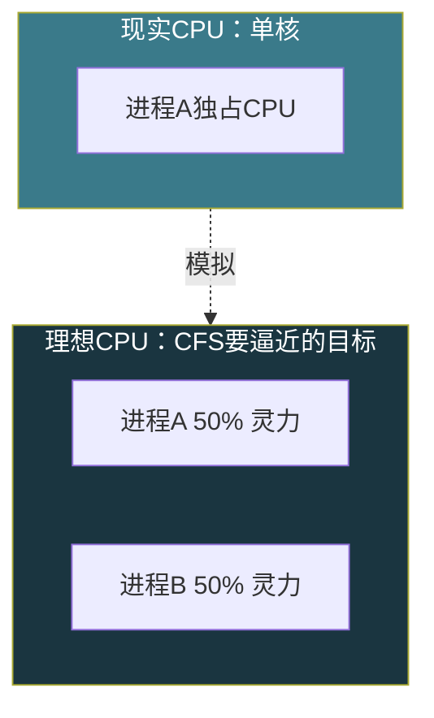
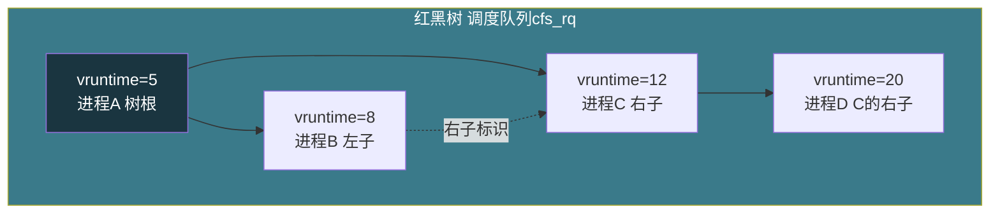
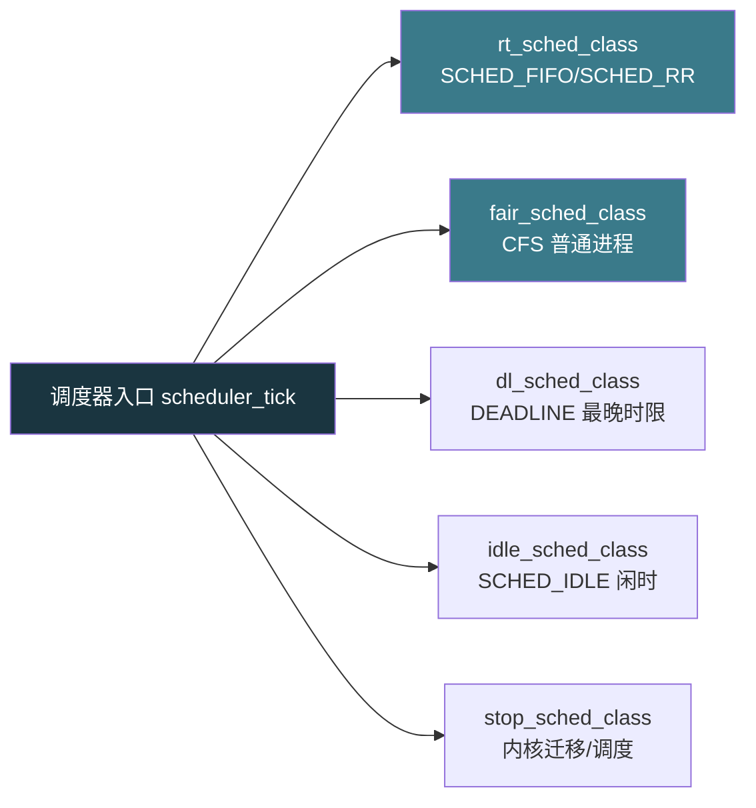

# 【金丹·69】谁在决定CPU归谁：进程调度CFS

> **码农修仙传 · 金丹期 · 第69篇**
> 我是玄芯散人，带你从炼气修到大乘。

---

## 境界标识

```
╔══════════════════════════════════╗
║     金丹期 · 第69篇              ║
║     谁在决定CPU归谁：进程调度CFS  ║
║     CFS调度器原理/vruntime/红黑树║
║     nice值/调度周期/实时调度器    ║
║     预计阅读：18分钟              ║
╚══════════════════════════════════╝
```

---

## 修仙引入

上一篇把 CPU 在 Ring3 和 Ring0 之间怎么切讲清楚了，从 `syscall` 进 Ring0、内核做完事、`sysret` 回 Ring3。但那一篇只讲了单次系统调用内的事，CPU 一直在同一个进程内跑。

修真界里，CPU 是天庭一座灵气炉。同一时刻炉子只够一个弟子用，但天庭弟子千百个，炉子这一秒归谁、下一秒归谁，规矩全在内核里定。这一篇看的就是这套规矩——Linux 2.6.23 之后默认的 CFS（Completely Fair Scheduler）调度器。

CFS 用了三样东西：`vruntime` 算每个弟子的"已练功时长"，红黑树当排班表，`nice` 值给弟子定灵气吸收倍率。它要做到一件事：经过足够长时间，每个进程分到的 CPU 时间都差不多公平。

---

## 硬核主体

### CFS 的设计理念：模拟一台不存在的理想 CPU

CFS 这套设计的 80% 能浓缩成一句话：模拟一台"理想的多任务 CPU"。这台理想 CPU 现实中不存在，但 CFS 想做到跟它一样公平。

想象修真界有一座灵气炉，灵力无限，每位弟子都能同时吸纳，每人拿 1/n 的灵力（n 是当前弟子数）。比如两位弟子同时吸纳，每人拿 50% 的灵力。

现实中 CPU 一次只能跑一个进程。CFS 用了"虚拟运行时间"（vruntime）来近似模拟那台理想 CPU。vruntime 记录的是"这个进程在理想 CPU 上应该已经跑了几纳秒"。在理想 CPU 上，所有可运行进程的 vruntime 时刻相等。现实中做不到同时跑，就只能让 vruntime 最小的进程先跑。

CFS 的思路其实朴素到了极点：永远挑 vruntime 最小的进程上 CPU。跑一段，更新它的 vruntime，再挑最小的。

修真比喻：理想 CPU 是天庭传说中灵力无限、大家并行吸纳的所在。现实中不可能存在。CFS 的目标就是用最少的折腾去逼近那种公平。



### vruntime 怎么算：用权重做归一化

vruntime 是 CFS 的命根子。它的计算公式看着简单：

```c
// kernel/sched/fair.c（简化版）
// NICE_0_LOAD = 1024，是 nice=0 进程的权重基准
// weight 由 nice 值查表得到

u64 calc_delta_fair(u64 delta_exec, struct sched_entity *se)
{
    // 计算公式：实际运行时间 × (1024 / 权重)
    // 权重越高，分母越大，vruntime 涨得越慢
    if (se->load.weight != NICE_0_LOAD) {
        delta_exec = (u64)delta_exec * NICE_0_LOAD;
        delta_exec = div64_u64(delta_exec, se->load.weight);
    }
    return delta_exec;
}
```

这段代码在每次调度器 tick 都被调用，把"这个进程刚跑了几纳秒"换算成 vruntime 增加量。基准 nice=0 的进程权重就是 1024（NICE_0_LOAD），所以基准进程的 vruntime 增量就等于它的实际运行时间。

修真比喻：vruntime 是弟子身上的"已练功时辰记录册"。权重 1024 的弟子练一息加一息册页。权重更高的弟子（nice 更低），同样练一息只加半息册页，这样他们更容易被排到前面。

举个具体例子。三个进程同时跑：

```text
进程A  nice=-5  权重 3121  跑了10ms
进程B  nice=0   权重 1024  跑了10ms
进程C  nice=10  权重 110   跑了10ms

A 的 vruntime 增加 = 10ms × 1024 / 3121 ≈ 3.3ms
B 的 vruntime 增加 = 10ms × 1024 / 1024 = 10ms
C 的 vruntime 增加 = 10ms × 1024 / 110  ≈ 93.1ms
```

A 的 vruntime 涨得最慢，下次调度 vruntime 最小的还是它，它就再跑一段。这个机制用单一 vruntime 排序，同时实现了"公平 + 优先级"。

### 红黑树怎么选下一个进程

CFS 用一棵红黑树当排班表。每个可运行进程在树里占一个节点，排序键是 vruntime。

红黑树选下一个进程的方式朴素到了极点：永远取最左边的节点（左子树的最小值）。这是红黑树的标准操作，时间复杂度 O(log N)（取最左节点）+ O(1)（从缓存读）。

CFS 在每个调度实体的 `cfs_rq` 结构里专门缓存了"最左节点"指针，所以 `pick_next_task` 的实际开销是 O(1)，不需要遍历。插入和删除 vruntime 变化的节点才走 O(log N) 的红黑树旋转。

修真比喻：红黑树是天庭练功堂外的一排座位，按弟子的"已练功时辰"从小到大排。最左边的座位是"练得最少的"，炉子一空闲就叫这位弟子先上炉子。这位弟子上炉时册页更新了，就重新排到右边去。



CFS 还维护一个 `min_vruntime`（单调递增的最小 vruntime），新激活的进程入队时，vruntime 至少被抬到 `min_vruntime` 附近，避免一个睡了好久刚醒的进程因为 vruntime 太小瞬间霸占 CPU。

### nice 值和权重的关系：怎么分时间

nice 是 Unix 时代留下来的"礼貌值"，范围 -20 到 +19。值越低优先级越高，默认是 0。root 才能把 nice 设成负数（提高优先级），普通用户只能往高了设。

nice 在 Linux 里需要查一张权重表换算成 weight。Linux 内核里这张表是 `sched_prio_to_weight[40]`（40 项覆盖 nice=-20 到 nice=+19）：

```c
// kernel/sched/core.c 里的权重表（简化版）
// 实际数字来自源码，每个 nice 值对应一个 weight
static const int prio_to_weight[40] = {
    /* -20 */ 88761, 71755, 56483, 46273, 36291,
    /* -15 */ 29154, 23254, 18705, 14949, 11916,
    /* -10 */  9548,  7625,  6100,  4904,  3906,
    /*  -5 */  3121,  2501,  1991,  1586,  1277,
    /*   0 */  1024,   820,   655,   526,   423,
    /*   5 */   335,   272,   215,   172,   137,
    /*  10 */   110,    87,    70,    56,    45,
    /*  15 */    36,    29,    23,    18,    15,
    /*  19 */    12
};
```

设计上的规律：从 nice=0 的 1024 起步，每加 1 级 nice 权重 × 1.25，每减 1 级 nice 权重 × 0.8（近似的数学关系，实际是黄金比例倒数附近的近似）。这意味着 nice=-20 比 nice=+19 重 88761/12 ≈ 7400 倍。

修真比喻：权重表是"灵气吸收倍率"对照表。nice=-20 的弟子灵气吸收倍率最高，是 nice=+19 弟子的 7400 倍。同等条件下，天庭炉子分给他的时间也多得多。

实际上手：

```bash
# 启动一个 nice=-5 的进程（比默认快一点）
nice -n -5 ./my_program

# 已经跑的进程改 nice
renice -n -10 -p 1234

# 查看进程的 nice 和 weight
top   # NI 列就是 nice
chrt  # 实时进程查 SCHED_FIFO/SCHED_RR
```

普通用户只能在 0 到 +19 之间调。要调负值需要 root 或 `CAP_SYS_NICE` capability。

### 调度周期和时间片怎么定

CFS 抛弃了"每个优先级一个固定时间片"的旧思路，它用的是"目标延迟"（sched_latency）和"最小粒度"（sched_min_granularity）两个参数。

`sched_latency` 默认是 6 毫秒（在最近的版本里常看到 4-24ms 这个范围）。CFS 的设计目标是：所有可运行进程在一个调度周期里都跑一遍。如果只有 1 个进程，它跑满 6ms；如果有 3 个，每个跑 2ms；如果有 100 个进程，按权重分，但每个最少也要跑 `sched_min_granularity`（默认 0.75ms 或 1ms 看版本）保证不会切得太频繁。

时间片不是写死的，CFS 跑前算：

```c
// 简化版逻辑
period = max(sched_latency, nr_running * sched_min_granularity);
time_slice = period * task_weight / total_weight;
```

修真比喻：调度周期是天庭定的"这一轮练功总时长"。弟子少，每人练完一整轮；弟子多，每人分一段但保证最小时间。

Linux 还留了一个用户态可调的接口 `/sys/kernel/debug/sched/base_slice_ns`，对应 `sysctl_sched_base_slice_ns`。桌面用途希望低延迟可调小，服务器用途希望批处理可调大。内核在 `kernel/sched/fair.c` 启动时会读这个值。

```bash
# 看看当前系统的调度参数
cat /proc/sys/kernel/sched_latency_ns        # 默认 6000000 = 6ms
cat /proc/sys/kernel/sched_min_granularity_ns  # 默认 750000 = 0.75ms
cat /proc/sys/kernel/sched_wakeup_granularity_ns  # 默认 1000000 = 1ms
```

新版本内核调度参数有所调整，`sched_latency_ns` 这个名字在不同版本之间出现过变化，但参数的设计思路没变。

### 调度类层级：CFS 不是唯一的调度器

CFS 不是 Linux 内核唯一的调度器。Linux 内核里调度器是分层的，叫"调度类"（sched_class）。每类负责一种调度策略。



调度器从最高优先级往低优先级选：先看 dl_sched_class 是否有任务，再看 rt_sched_class，再看 fair_sched_class（CFS），最后是 idle_sched_class。CFS 类里实现三种策略：

- SCHED_NORMAL（也叫 SCHED_OTHER）：普通进程的默认策略。
- SCHED_BATCH：批量任务，比 SCHED_NORMAL 切得少，更适合后台跑。
- SCHED_IDLE：比 nice=+19 优先级还低，但比真正的 idle 调度器优先级高，避免死锁。

`SCHED_FIFO/SCHED_RR` 由 `sched/rt.c` 实现，不走 CFS 的红黑树。它们用 99 个用户可见的优先级（1-99），每个优先级一个 FIFO 队列。普通进程看到的 nice 在它们面前无效——RT 进程永远比 CFS 进程优先。

修真比喻：调度类是宗门里不同品级的弟子。dl 是宗主亲传（最高），rt 是几位堂主，CFS 是普通内门弟子，idle 是外门杂役。宗主要事（一来一往）不分给堂主，堂主没活才轮到内门弟子。这套分层是写在内核里的硬规矩。

### 实时调度器：SCHED_FIFO 和 SCHED_RR 怎么用

Linux 实时调度分两种策略，都跑在 `rt_sched_class` 下。

SCHED_FIFO（First In First Out）。同优先级内先到先得。一个 SCHED_FIFO 进程不被更高优先级抢就一直跑。换人的几种情形：被更高优先级进程抢占；自己阻塞（I/O 等）；自己调 `sched_yield()`。没有时间片。

SCHED_RR（Round Robin）。SCHED_FIFO 加个时间片。同优先级内每个进程跑一段时间就排到队尾，下一个同优先级进程跑。时间片长度由 `sched_rr_get_interval()` 返回，Linux 默认大约 100ms（具体值跟内核版本和配置有关）。

实时优先级范围 1 到 99。POSIX 只要求最少 32 级，Linux 给 99 级。1 是最低，99 是最高。任何 RT 进程都比任何 CFS 进程优先。

修真比喻：SCHED_FIFO 是几位堂主，谁先叫就先接令，没人抢就一直办。SCHED_RR 是几位堂主轮流值班，每人办一个时辰换下一位。无论哪种，堂主一喊话普通弟子立刻停下手里的活。

上手命令 `chrt`：

```bash
# 启动一个 SCHED_FIFO 优先级 50 的进程（需要 root）
chrt -f 50 ./my_realtime_program

# 启动一个 SCHED_RR 优先级 10 的进程
chrt -r 10 ./my_realtime_program

# 查看进程的调度策略和优先级
chrt -p 1234

# 输出示例：
# pid 1234's current scheduling policy: SCHED_FIFO
# pid 1234's current scheduling priority: 50
```

⚠️ 实时进程用错会卡死整个系统。一个忙循环的 SCHED_FIFO 进程能锁住 CPU 几秒不释放，普通 shell、文件 IO 都跟着卡。所以实时调度只给经过严格测试的工业控制、音视频处理代码用。

### CFS 自己的取舍：Linux 6.6 之后是 EEVDF

CFS 不是调度器的终点。Linux 6.6（2023 年底发布）把默认调度器换成了 EEVDF（Earliest Eligible Virtual Deadline First）。它由 Peter Zijlstra 提出并合并进主线，是对 CFS 多年实际使用后做的进一步打磨。

EEVDF 保留 vruntime 的设计思路，但显式引入"虚拟截止时间"。每个任务有显式的 deadline，按 deadline 排序选下一个。能进一步压缩延迟敏感任务的反应时间，对桌面和交互用途更友好。Linux 7.x 系列基本都切到 EEVDF。

金丹这一篇讲 CFS，因为 CFS 是 2.6.23 之后 15 年来的默认调度器，市面上大部分资料都在讲它，新文章里 EEVDF 专题也越来越多。

修真比喻：CFS 是这代天庭立了 15 年的练功堂规矩，EEVDF 是下一代。设计思路没变（按某种虚拟时间排序），但对"何时该叫哪位弟子上炉"算得更精细。

### CFS 实现的几个工程细节

CFS 实际跑起来还有几个工程细节值得说一下。

调度 tick（scheduler tick）。CPU 每隔一段时间（默认是 HZ=250，即 4ms 一次）就触发一次时钟中断，调度 tick 函数会被调用。在 tick 里，CFS 更新当前任务的 vruntime，看是否需要换人。如果当前任务跑太久就触发调度。

新进程激活。刚激活的进程 vruntime 设成 `min_vruntime`（或稍小一点点），这样它入队就能尽快被调度，避免长时间睡眠的进程 vruntime 太小而霸占 CPU。

新 fork 的进程。子进程 vruntime 设成父进程的 vruntime，这样父子进程不会因为 fork 时机差导致一个总是抢另一个。

组调度（cgroup）。`CONFIG_FAIR_GROUP_SCHED` 打开后，CFS 不只对单进程公平，还能对一组进程公平。比如 `cpu.shares` 文件可以控制某个 cgroup 占多少 CPU 份额。这是容器（Docker/Kubernetes）做 CPU limit 的基础。

修真比喻：调度 tick 是天庭的更鼓，每隔一段时间敲一次，催调度器重新审一次排班表。组调度是把"弟子"概念扩展到"堂口"，堂口之间先公平分时间，堂口内部再分到各弟子。

### 一段最小验证代码：读自己的 vruntime 和 nice

`/proc/self/stat` 和 `/proc/self/sched` 能查到当前进程的调度信息：

```bash
# 读当前进程的 nice、vruntime 相关字段
cat /proc/self/stat | awk '{print "nice="$19, "priority="$18, "policy="$40}'

# /proc/self/sched 里能看到 vruntime（不同内核版本字段位置略有差异）
# se.sum_exec_runtime 是已运行时间（纳秒）
cat /proc/self/sched
```

也可以用 `chrt -p $$` 看当前 shell 的调度策略。

CFS 这套机制跑了几十年，Linux 调度器代码也经历过多次演进。抓住 vruntime + 红黑树 + nice 权重这三者怎么搭配，比硬记具体数字更顶用。

---

## 修仙术语对照表

| 修仙术语 | 技术现实 | 本篇位置 |
|---------|---------|---------|
| 理想灵气炉 | CFS 模拟的"理想多任务 CPU" | 设计理念 |
| 已练功时辰册 | vruntime | vruntime 计算 |
| 灵气吸收倍率对照表 | nice → weight 权重表 | nice 与权重 |
| 练功堂外座位排班 | 红黑树调度队列 | 红黑树 |
| 最左座位弟子 | vruntime 最小的进程 | 红黑树 |
| 排班堂主 | 调度器入口 pick_next_task | 调度类层级 |
| 宗主亲传 / 堂主 / 内门弟子 / 杂役 | dl / rt / fair / idle 调度类 | 调度类层级 |
| 堂主先到先接令 | SCHED_FIFO | 实时调度 |
| 堂主轮流值班 | SCHED_RR | 实时调度 |
| 练功总时长 | sched_latency 调度周期 | 调度周期 |
| 最少练功时长 | sched_min_granularity | 调度周期 |
| 桌前更鼓 | 调度 tick | 工程细节 |
| 新弟子入册页 | 新激活进程 vruntime = min_vruntime | 工程细节 |
| 父子同步册页 | fork 子进程 vruntime = 父进程 vruntime | 工程细节 |
| 堂口分灵气 | cgroup 组调度 | 工程细节 |
| 下一代规矩 | EEVDF 调度器（Linux 6.6+） | EEVDF 衔接 |

---

## 进阶条件

看完这一篇到能向别人讲清"CFS 怎么决定 CPU 归谁"，差这几条：

- [ ] 能说出 CFS 的设计思路（按 vruntime 排序的调度队列，挑最小的上 CPU）
- [ ] 能写出 vruntime 的计算公式并解释"为什么权重越大 vruntime 涨得越慢"
- [ ] 能画出红黑树里"vruntime 排序 + 最左节点最优先"的逻辑，解释为什么 pick_next_task 是 O(1)
- [ ] 能说出 nice 值范围（-20 到 +19）和权重基准（NICE_0_LOAD = 1024）
- [ ] 能讲清 sched_latency 与 sched_min_granularity 各自在干什么，举例说明进程数变多时时间片怎么切
- [ ] 能讲清 SCHED_FIFO 和 SCHED_RR 的差别（时间片 vs 无时间片）
- [ ] 能列出调度类分层（dl / rt / fair / idle）并说明 RT 进程与 CFS 进程的优先级关系
- [ ] 能用 chrt 启动一个实时进程，并用 chrt -p 查看调度策略
- [ ] 能说出 Linux 6.6 之后默认调度器换了哪个（EEVDF）以及原因

> 最后一条是金丹期对"进程调度"理解的"分水岭"。能在面试里三句话讲清"为什么 Linux 用红黑树 + vruntime 做进程调度"，操作系统调度这一关就过了。

---

## 下期预告 + 互动

> 下一篇：【金丹·70】虚拟内存：每个进程都以为自己独占4GB
>
> 这一篇讲了 CFS 怎么在多进程之间分配 CPU。下一篇把视角换到内存：每个进程都以为自己独占 4GB 内存，但物理内存只有几十 G，内核是怎么给每个进程演这出"独角戏"的？页表、TLB、缺页中断以及 `mmap` 这一组机制串起来就是答案。看完之后你再遇到 OOM（Out of Memory）能直接讲清楚是谁占用了内存。

现在问你：

> 🔍 用 `top -H -p $$` 或 `cat /proc/self/stat` 查查你 shell 的 nice 值和已运行时间。普通进程的 nice 默认是 0，但你也可以用 `renice` 调一下感受下优先级变化。

> ⚙️ 你有没有排查过"某进程 CPU 占用 100%"？除了业务逻辑问题，更多时候是 nice 没用好或者没绑核（`taskset`/`cpuset`）。下一篇讲虚拟内存时，会顺带讲 OOM 时内核怎么挑选进程杀掉。

> 评论区聊聊你跟进程调度打过什么交道。

> 我是玄芯散人，带你从炼气修到大乘。

---

*本文是「码农修仙传」系列第69篇。系列导航见 [xren.ren](https://xren.ren)*