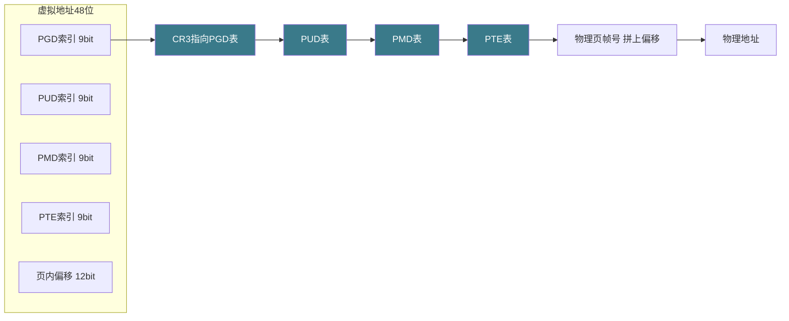
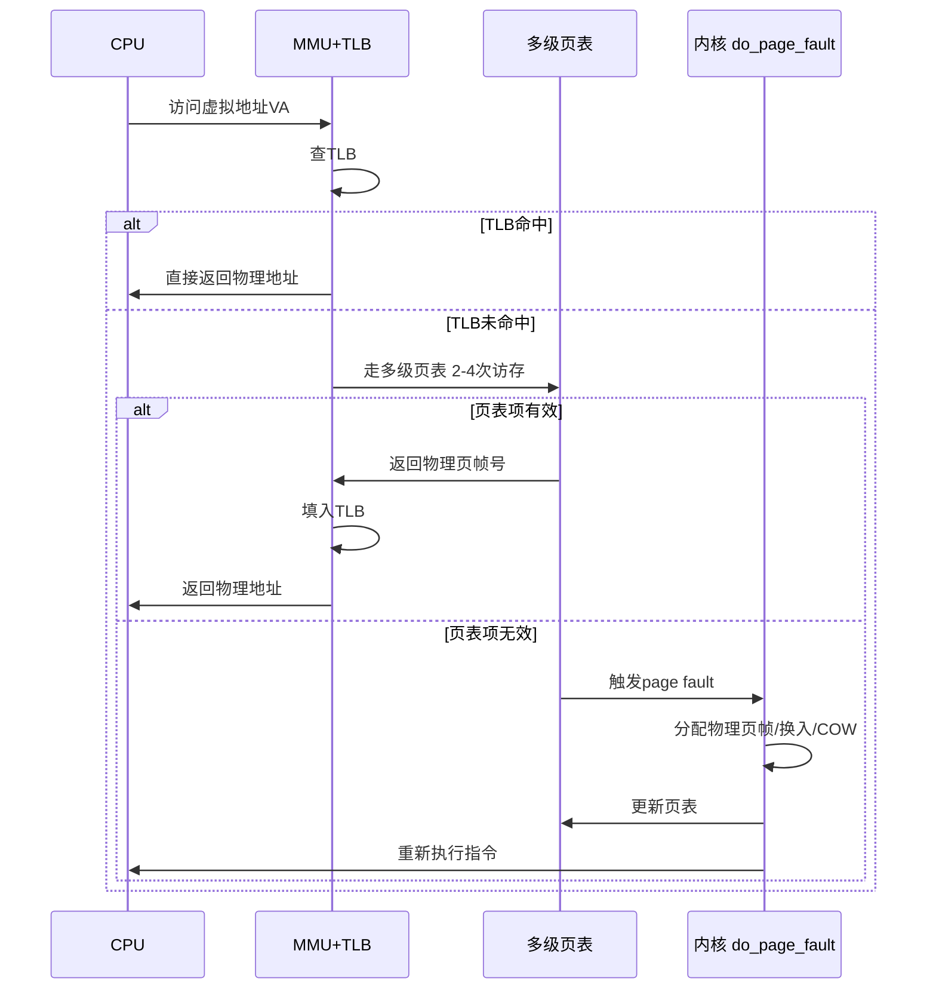
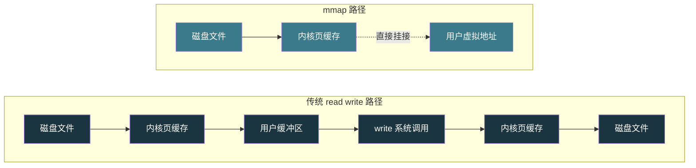

# 【金丹·70】虚拟内存：每个进程都以为自己独占4GB

> **码农修仙传 · 金丹期 · 第70篇**
> 我是玄芯散人，带你从炼气修到大乘。

---

## 境界标识

```
╔══════════════════════════════════╗
║     金丹期 · 第70篇              ║
║     虚拟内存：每个进程都          ║
║     以为自己独占4GB              ║
║     页表/TLB/缺页中断/mmap      ║
║     预计阅读：18分钟              ║
╚══════════════════════════════════╝
```

---

## 修仙引入

上一篇把 CPU 调度讲完了。CPU 决定哪个弟子先上灵气炉，但还有一件大事没讲：内存。每位弟子都觉得自己住在一座独立的洞府里，洞府大得很，足足 4GB（32 位机器）或 256TB（64 位机器）。可宗门实际拥有的灵气福地加一块也就几十 GB。这出独角戏是谁演的？怎么演的？

修真界里它就是内务府的那套令牌簿。每位弟子领一本令牌簿（页表），簿上写明他每个房间（虚拟页）对应的是宗门哪一处洞天（物理页）。弟子进房时，内务府的翻译使（MMU）按簿核对，查到才放行。弟子想用新房间，先得申请令牌的分配（缺页中断）。

这一篇把整套机制拆开看。先看为什么每个进程看到独立地址空间，再看页表怎么把虚拟地址变成物理地址，然后看多级页表为什么省内存，接着看 TLB 怎么加速以及缺页中断什么时候触发，最后讲 `mmap` 怎么把文件摆入进程地址空间。看完这一篇，再有人问"我机器 64G 内存，怎么跑了几十个进程没爆"，你能直接答出来。

---

## 硬核主体

### 为什么需要虚拟内存：每位弟子的独立洞府

先回到 067 那篇划好的部分：内核空间占高地址、用户空间占低地址。CPU 跑在某个进程 A 上时，MMU 把 A 看到的虚拟地址翻译成物理地址；切换到进程 B，MMU 立刻换一本令牌簿。两个进程的虚拟地址可以相同，但落到完全不同的物理地址上。从每个进程自己的视角看，它独占一整片 4GB 地址空间。

修真界比喻：每个弟子住在宗门划给他的独立洞府里。洞府编号（比如"东苑三号"）是宗门内统一发的，不会重复。但洞府底下对应的山头地块（物理页帧）是宗门实际拥有的。多个弟子的洞府编号可能相同，但他们脚下踩的地块完全错开，互不打扰。

为什么要绕这一圈？三条硬约束。

第一条，隔离。进程 A 的代码不能直接踩进程 B 的内存，反过来也不行。MMU 在翻译阶段就守好门，物理页帧只能被挂上这本令牌簿的进程看到。即使某个进程有野指针，最坏波及也只是自己崩。

第二条，安全。用户程序不能直接访问物理内存的所有位置。内核空间在每个进程的页表里都被标成不可访问，CPU 一旦发现用户态代码踩进来，直接抛 page fault 再由内核发信号强杀。

第三条，共享可控。两个进程想共享一段内存（比如共享库 `libc.so`），内核只要在两个进程的页表里把同一组物理页帧挂两次即可。一份物理内存，多个进程共用，谁修改了谁的数据由页表项的权限位决定。

修真比喻：内务府给每位弟子发一本独立的令牌簿，簿上每一条都注明"你这个房间号对应宗门哪处山头"。弟子想用哪个房间号，查簿就知道，但实际去的是宗门分配给他的真实地块。两位弟子可以拿同一处地块，内务府在他们簿上都写一笔就行。

### 虚拟地址到物理地址：MMU 与页表

虚拟地址怎么变成物理地址？中间隔着两层硬件：CPU 内的 MMU（Memory Management Unit），还有 MMU 用的那张页表。

MMU 的工作可以拆成两步。第一步，把虚拟地址切成"页号 + 页内偏移"。第二步，用页号当索引查页表，得到对应的物理页帧号；再把物理页帧号和页内偏移拼起来，得到物理地址。

页大小几乎所有主流 CPU 体系都用 4KB（2 的 12 次方），低 12 位就是页内偏移。32 位虚拟地址拆成"高 20 位页号 + 低 12 位偏移"。offset 范围 0-4095，对应一个物理页内的字节偏移。

如果只用一级页表，4GB 地址空间要 1M 个页表项（2 的 20 次方），每项 4 字节，单张页表就占 4MB。每个进程一张，100 个进程 400MB，进程多了页表本身就成灾。

修真比喻：单级页表就像内务府给每位弟子发了一本超厚的令牌簿，簿上把宗门每个房间号对应的地块全列了。一千间房列一千条，多数弟子一辈子也用不上十间。这本簿子放在袖子里太占地方。

### 多级页表：为什么用分级，省在哪

省内存的办法是分级。32 位 x86 用二级页表：外层叫页目录（PGD，Page Global Directory），内层叫页表（PT，Page Table）。每个都是 1024 项、每项 4 字节，单张占 4KB。

虚拟地址的 32 位拆成三段：10 位 PGD 索引 + 10 位 PT 索引 + 12 位偏移。MMU 先用 PGD 索引去 PGD 表里取一项，得到 PT 表的物理地址；再用 PT 索引去 PT 表里取一项，得到物理页帧号；最后拼上偏移，得物理地址。

64 位 x86_64 把这套思路扩到四级页表：PGD → PUD → PMD → PTE，每级 9 位索引，加上每页 12 位偏移，9+9+9+9+12 = 48 位地址空间，256TB。



省在哪？外层表项有"未使用"标记。一个进程实际只用几百 MB 内存，对应几万页表项。如果只用单级页表，没用到的地址空间也要占位。换成多级以后，某个 PGD 项对应的 PUD 表如果整张都没用到，可以完全不存在（标记为 invalid），既不占物理页帧也不占内存。内核在分配页表时按需创建中间层级（lazy allocation），没用到就不分配。

修真比喻：多级页表是分层的令牌簿。一级簿（PGD）只记"你这片区域有几间常用的房"，下一级才展开成具体房间对应地块的清单。一片区域你没住过，下级清单压根不存在。这样簿子总共只记你真用上的房间，没用上的不占纸。

CR3 寄存器是 x86 CPU 里专门保存当前进程 PGD 物理地址的寄存器。内核切换进程时，把新进程的 PGD 物理地址塞进 CR3，MMU 立刻按新簿子翻译。CR3 一变，整个地址翻译的"地图"就换了。

### TLB：MMU 自己的本地快取

多级页表省了内存，但每次翻译要查 2-4 张表（x86_64 四级），也就是 2-4 次内存访问。一次内存访问几十纳秒，一次翻译上百纳秒。CPU 一秒钟执行几亿条指令，每条指令可能要访存一次，每访存一次就要翻译一次，光翻译就把 CPU 拖垮了。

解决办法是在 MMU 里塞一个小缓存，叫 TLB（Translation Lookaside Buffer）。TLB 存的是"虚拟页号 → 物理页帧号"的最近翻译结果。MMU 先查 TLB，命中就直接拿结果，跳过查多级页表的全套流程；没命中才走多级页表，查完再把结果塞进 TLB。

主流 x86 CPU 的 TLB 大约 64-128 条目，全相联或组相联查找。TLB 一条记录几十字节，整个缓存不到 4KB，却把翻译开销压缩到一两纳秒级别。

修真比喻：TLB 是内务府翻译使袖里的小册子。最近翻译过的"房间号 → 山头地块"他都记着。再有人报同一个房间号，他翻袖里册子就答，不用回内务府翻大簿。册子翻得快，大簿放在仓库深处查得慢。

TLB 也有失效问题。CR3 切换（进程切换）后整个地址空间全变了，老 TLB 条目全部作废，硬件会自动 invalidate。内核里手动修改了页表（比如 `munmap` 解除挂接），要发 TLB flush 指令（`invlpg` 清单项，或重新加载 CR3 清全部）。x86 还有个 PCID（Process-Context Identifier）机制，TLB 条目标记属于哪个进程的地址空间，进程切换时不必全清，过期的条目不再命中即可。Linux 4.14 之后已经在 x86 上启用 PCID。

修真比喻：弟子退房换到别的洞府，内务府得把翻译使袖里的小册子重新记一遍。如果没清，小册子还是老洞府的对应关系，新弟子按老册子进房就会踩错地块。修真界里这种"残留记忆"就是 bug。

### 缺页中断：令牌簿没记录的访问

TLB 没命中要查多级页表。如果页表项标了"valid"，查完就翻译成功。如果页表项标了"invalid"或者权限不对，CPU 就触发 page fault 异常，控制权切到内核的 `do_page_fault` 函数。

什么时候触发 page fault？四种情形。

第一种，虚拟页还没分配。进程访问一段还没被访问过的内存，比方说 `malloc` 拿到指针但还没写过，或者访问 `mmap` 没创建的地址区间，对应页表项是 0。内核的处理是给这个虚拟页分配一个物理页帧，更新页表项，标记为 valid，重新执行那条指令。

第二种，权限不符。代码试图写只读页（比如代码段 `.text`），或者用户态代码试图访问内核空间。内核的处理是发 SIGSEGV 信号，进程被强杀。

第三种，写时复制（COW，Copy-On-Write）。`fork` 创建子进程时，内核并不真把父进程的物理页复制一份，而是让父子进程的页表项都指向同一组物理页帧，全部标成只读。任一方写这些页，CPU 触发 page fault，内核发现是 COW 情形。此时内核先分配新物理页帧，再把旧页内容复制过去，最后更新页表。fork 之后父子立即 exec 的情形，COW 省下了大量内存拷贝。

第四种，换入（swap in）。物理内存紧张时，内核把不常用的页写到磁盘 swap 分区，对应物理页帧被回收，页表项标成"不在内存"。进程再访问这个页，触发 page fault，内核从 swap 读回内容，然后找新物理页帧装上，最后更新页表。慢，但能跑。

修真比喻：缺页中断是弟子进了房间发现里面是空的，连桌椅都没摆。弟子向内务府报缺，内务府派人把桌椅搬进来、摆好，弟子再进来就有东西用了。要是弟子想进的是禁地（比如内核禁区），内务府直接拒之门外，严重的当场拿下（SIGSEGV）。



`/proc/self/maps` 是看一个进程虚拟地址布局的接口，每个进程都能读自己的。随手跑一下就能看到一批 `mmap` 出来的区间，可执行文件或者共享库，或者堆与栈这些都能在输出里看到。

```bash
# 读自己进程（shell）的虚拟地址布局
cat /proc/self/maps

# 输出示例（地址被截短）
# 55b8a0000000-55b8a0021000 r--p 00000000 08:01 123456 /usr/bin/bash
# 55b8a0021000-55b8a0035000 r-xp 00021000 08:01 123456 /usr/bin/bash
# 55b8a0035000-55b8a0040000 r--p 00350000 08:01 123456 /usr/bin/bash
# 7f1234000000-7f12340ff000 r-xp 00000000 08:01 234567 /lib/x86_64-linux-gnu/libc.so.6
# ...
# 7fff12345000-7fff12366000 rw-p 00000000 00:00 0  [stack]
```

每行格式：起始-结束地址 / 权限 / 偏移 / 设备 / inode / 文件名。权限字段里 `r` 表示读权限，`w` 表示写权限，`x` 表示执行权限，最后一位 `p` 表示私有挂接，`s` 则代表共享挂接。

修真比喻：`/proc/self/maps` 是弟子向内务府查"我的洞府总共有几间房、各房间用来做什么"的清单。读一次就知道整片地址空间是怎么布局的。

### mmap：把藏经阁的书直接摆入房间

`mmap` 是 Linux 系统调用里和虚拟内存关系最紧密的一个。它把一段虚拟地址挂到某种后端，后端可以是文件、匿名内存或共享内存对象这三类之一。挂上以后，进程访问这段虚拟地址，CPU 走 page fault 路径，内核在背后把文件内容装到物理页帧。

`mmap` 一次系统调用能做两件事。第一件是把文件内容摆入进程地址空间，进程像访问普通内存一样读写这段区域。第二件是让多个进程挂同一个文件或共享内存对象，实现零拷贝共享。

```c
// mmap.c
#include <sys/mman.h>
#include <fcntl.h>
#include <unistd.h>
#include <stdio.h>

int main(void)
{
    // 1. 打开一个文件
    int fd = open("hello.txt", O_RDWR);
    if (fd < 0) { perror("open"); return 1; }

    // 2. 把文件摆入进程地址空间
    // addr=NULL 让内核选地址，length=文件大小，prot=读写，
    // flags=MAP_SHARED 表示共享挂接，offset=0 从头开始
    char *buf = mmap(NULL, 4096, PROT_READ | PROT_WRITE,
                     MAP_SHARED, fd, 0);
    if (buf == MAP_FAILED) { perror("mmap"); return 1; }

    // 3. 像访问普通内存一样修改文件内容
    buf[0] = 'X';
    buf[1] = '\n';

    // 4. 写回磁盘（MAP_SHARED 下页表会标脏，但显式 msync 更稳）
    msync(buf, 4096, MS_SYNC);

    // 5. 解除挂接
    munmap(buf, 4096);
    close(fd);
    return 0;
}
```

修真比喻：`mmap` 是弟子把藏经阁某一卷经书的内容直接复制到自己书房，书房里有一个分身。弟子在书房里改字，分身也跟着变；其他弟子也复制同一卷，他们书房里的分身共享内容。

`mmap` 有两类需要搞清楚的标志位。

`MAP_PRIVATE`：私有挂接，写时复制。多个进程挂同一个文件时，物理页帧只有一份。任一进程写触发 COW，那一进程独占一份新的物理页。它的修改不会波及别的进程，也不会写回磁盘文件。

`MAP_SHARED`：共享挂接，所有挂同一对象的进程共享同一组物理页帧。任一进程写都会立刻让别的进程看到新内容，标记 dirty 后由内核在合适时机写回磁盘文件。

修真比喻：`MAP_PRIVATE` 是弟子从藏经阁借出经书后自己抄一份副本，副本怎么改都不波及原书。`MAP_SHARED` 是弟子一起围着一卷真经抄写，谁改一个字别人立刻看到新字，且最终都要回到藏经阁总册。

`mmap` 比传统的 `read`/`write` 快在哪？传统路径是"读文件到内核页缓存，再拷贝到用户缓冲区，write 时再从用户缓冲区拷回内核页缓存"，中间多了用户缓冲区一次拷贝。`mmap` 直接把文件页挂到用户空间，用户读写就是内核页缓存读写，省一次拷贝。对大文件、随机读写情形特别明显。



进程间共享内存最常见的实现就是 `mmap` 配合 `MAP_SHARED` 加 `MAP_ANONYMOUS`。父子进程 `fork` 之后共享内存还在（COW 之前都引用同一组物理页帧），父子两端都能读写同一段。下一篇会专门讲进程间通信，管道、共享内存与信号这些机制都会展开。

修真比喻：内务府给两位弟子发同一块令牌，上面盖同一个戳，他们都能去同一片灵田修炼。这块灵田就是共享内存。下一篇 071 专门讲怎么用这块灵田、怎么传信。

### 物理内存怎么挂：内核自己也有令牌簿

前面讲的页表是用户进程的角度。每个进程都有自己的页表，CR3 切换就换一本。但内核自己访问物理内存用什么页表？

内核的解决方案是"内核页表"加直接挂接区。x86_64 Linux 把内核虚拟地址空间的高位一段划成"直接挂接区"（direct mapping），线性挂接所有物理内存。比如 64GB 物理内存，内核直接挂接区 0xffff888000000000 起，能直接用 `virt_to_phys` 把内核虚拟地址转成物理地址。内核代码与内核数据这些基础段，加上 vmalloc 区与临时挂接区，全部由内核维护自己的页表。

为什么用户进程的页表要由内核管？因为每个用户进程的虚拟地址空间都是内核创建出来的：`execve` 是加载可执行文件的入口，`mmap` 是建挂接的接口，`malloc` 则是通过 brk 或 mmap 扩堆的接口，这些都是内核做的。内核给每个进程建一本令牌簿，簿上的每一条都自己说了算。CPU 切换进程时 CR3 切，TLB 清掉旧条目，再按新进程的令牌簿翻译。

修真比喻：内务府自己手上有一本《全宗门总册》，记录宗门所有洞府和物理地块的对应关系。给弟子发令牌簿是从总册里抄的副本，弟子房间号怎么用由总册定义。弟子之间不能互相篡改对方的副本，因为内务府把副本锁在每位弟子的袖子里。

---

## 修仙术语对照表

| 修仙术语 | 技术现实 | 本篇位置 |
|---------|---------|---------|
| 独立洞府 | 进程虚拟地址空间 | 为什么需要虚拟内存 |
| 山头地块 | 物理页帧 | MMU 与页表 |
| 内务府翻译使 | MMU（内存管理单元） | MMU 与页表 |
| 令牌簿 | 页表 | MMU 与页表 |
| 单层超厚令牌簿 | 单级页表 | 多级页表 |
| 分层令牌簿 | 多级页表（PGD/PUD/PMD/PTE） | 多级页表 |
| 一级簿"片区清单" | PGD 顶级页目录 | 多级页表 |
| CR3 切换 | 进程切换时装载新页表 | 多级页表 |
| 翻译使袖里小册 | TLB 翻译快取 | TLB |
| 小册残留记忆 | TLB 失效问题 | TLB |
| 报缺补缺 | 缺页中断 page fault | 缺页中断 |
| 内务府查房 | do_page_fault 内核函数 | 缺页中断 |
| 私抄副本 | COW 写时复制 | 缺页中断 |
| 写满换库 | swap 换出/换入 | 缺页中断 |
| 禁区拒入 | SIGSEGV 信号 | 缺页中断 |
| 藏经阁摆入 | mmap 文件摆入进程地址空间 | mmap |
| 私抄副本不归原书 | MAP_PRIVATE 私有挂接 | mmap |
| 围抄共用 | MAP_SHARED 共享挂接 | mmap |
| 内务府总册 | 内核页表 | 物理内存挂接 |

---

## 进阶条件

看完这一篇到能向别人讲清"虚拟内存是怎么让每个进程以为自己独占 4GB"，差这几条：

- [ ] 能说出为什么需要虚拟内存，从隔离这条是为了让进程互不踩内存说起
- [ ] 能解释为什么多级页表比单级页表省内存（未使用区域不分配中间表）
- [ ] 能讲清 TLB 在 MMU 翻译里扮演的角色（缓存最近翻译结果，跳过多级页表查询）
- [ ] 能列出 page fault 触发的四种情形，分别对应未分配、权限不符、COW、swap 换入
- [ ] 能讲清 fork 之后父子进程怎么共享物理内存（COW，写时才真正复制）
- [ ] 能讲清 mmap 的两种模式区别（MAP_PRIVATE 私有副本还是 MAP_SHARED 共享回写）
- [ ] 能解释 mmap 比 read/write 少一次拷贝的具体原因
- [ ] 能读懂 /proc/self/maps 输出里的每一列含义

> 最后一条是金丹期对"虚拟内存"理解的"分水岭"。能在面试里三句话讲清虚拟地址翻译到物理地址的流程，再讲清 TLB 加速原理以及 page fault 的处理路径，操作系统内存这一关就过了。

---

## 下期预告 + 互动

> 下一篇：【金丹·71】进程间通信：管道、共享内存、信号
>
> 这一篇把"每位弟子住独立洞府"讲透了，可弟子之间怎么通信？买卖功法与约斗切磋，以及紧急求救这些事都得有规矩。下一篇讲 IPC（Inter-Process Communication），展开管道、共享内存与信号这三类。共享内存这一篇埋的 `MAP_SHARED` 伏笔会在那里展开。看完之后再有人问"进程之间最快传数据的方式是什么"，你能直接答出来是共享内存。

现在问你：

> 🔍 跑一下 `cat /proc/self/maps`，看看你的 shell 自己挂上了哪些段。可执行文件或者共享库，或者栈段或匿名挂接这些，挂上的段各有几条？每个段权限分别是什么？

> ⚙️ 你有没有排查过"程序 OOM 被杀"或者"swap 用得太多导致卡顿"？原因都是物理页帧不够，内核按一套规则挑进程杀或者换出。下次遇到这种问题，先用 `dmesg | grep -i oom` 和 `vmstat 1` 看具体数据。

> 评论区聊聊你跟虚拟内存打过的交道。

> 我是玄芯散人，带你从炼气修到大乘。

---

*本文是「码农修仙传」系列第70篇。系列导航见 [xren.ren](https://xren.ren)*
