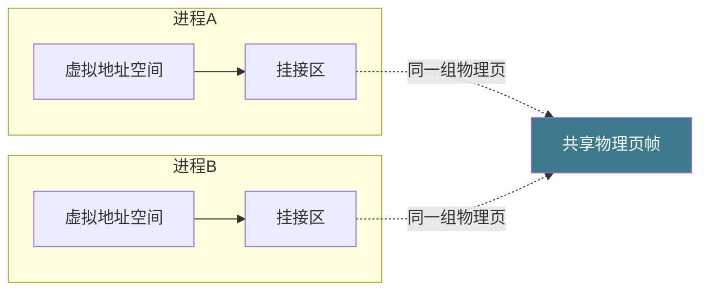

# 【金丹·71】进程间通信：管道、共享内存、信号

> **码农修仙传 · 金丹期 · 第71篇**
> 我是玄芯散人，带你从炼气修到大乘。

---

## 境界标识

```
╔══════════════════════════════════╗
║     金丹期 · 第71篇              ║
║     进程间通信：管道、             ║
║     共享内存、信号                 ║
║     pipe/fifo/shm/signal          ║
║     预计阅读：18分钟              ║
╚══════════════════════════════════╝
```

---

## 修仙引入

上一篇把每位弟子住独立洞府的事讲透了，每位弟子只能看到自己的虚拟地址空间，互相之间隔着一道无形的墙。可修真界不是孤岛，弟子之间要传信，要约斗，要买卖，急了还得紧急求救。怎么把一段话传给另一位弟子？怎么让两位弟子共用一块灵田？怎么在半夜喊醒一位闭关的弟子？

修真界里这是传讯使的事情，操作系统里这就是 IPC（Inter-Process Communication，进程间通信）。管道用来单向流水传信，共享内存用来两人同看一卷经，信号用来紧急敲门，消息队列用来按类收件，套接字用来跨宗门传信。这些传讯使各有各的脾气，各有各的跑腿范围。这一篇把它们的脾气摸清楚，让你下次再选传讯方式时不抓瞎。

---

## 硬核主体

### 为什么进程间需要通信：修真界的传讯

每位弟子住在宗门划给他的独立洞府里，每位弟子有自己的虚拟地址空间，上一篇把这件事讲得很清楚。隔离带来安全与简单，但也带来代价：两位弟子没法直接"读对方的脑"。修真界里两位弟子要协作，得有规矩地交换消息。

操作系统里有五条规矩，对应五类 IPC。

第一条，管道（pipe）。父子弟子之间单向传信的竹筒。一端写、一端读，写满就阻塞，读空也阻塞。

第二条，FIFO（命名管道）。两个不相关的进程之间用一根带名字的竹筒传信。文件系统里有路径，谁打开谁用。

第三条，共享内存（shared memory）。两位弟子共看同一卷经书，速度最快，因为没有数据搬运。

第四条，信号（signal）。弟子之间紧急传信。一边给另一边发一个数字编号，另一边的接收函数被立刻打断。

第五条，消息队列与套接字。消息队列是贴标签的竹筐，跨进程收发的快递；套接字是飞剑，能跨主机送信。

修真比喻：传讯使各有分工。管道是府内信使，共享内存是公用典籍，信号是惊堂木敲一下，消息队列是带签收的快递，套接字是跨界飞剑。

### 管道：父子弟子的竹筒

管道是 Linux 里最简单的 IPC 机制，就是一块内核缓冲区加两个文件描述符：一个写端、一个读端。`pipe(int fd[2])` 一次系统调用就建好这对描述符。父进程先建管道，再 `fork` 子进程。父子进程都拿到这对描述符，约定父写子读或者父读子写，另一端关掉。

```c
// pipe_demo.c
#include <unistd.h>
#include <stdio.h>
#include <string.h>
#include <sys/wait.h>

int main(void)
{
    int fd[2];
    if (pipe(fd) < 0) { perror("pipe"); return 1; }

    pid_t pid = fork();
    if (pid == 0) {
        // 子进程：只读
        close(fd[1]);
        char buf[64];
        int n = read(fd[0], buf, sizeof(buf));
        write(STDOUT_FILENO, buf, n);  // 把收到的话打印出来
        close(fd[0]);
        return 0;
    }

    // 父进程：只写
    close(fd[0]);
    const char *msg = "修真界里有什么\n";
    write(fd[1], msg, strlen(msg));
    close(fd[1]);
    wait(NULL);  // 等子进程收完
    return 0;
}
```

跑一下输出"修真界里有什么"，管道跑通。

管道有两条值得记住的属性。第一个是字节流，没有消息边界。连续写两次"abc"和"def"，读端可能一次读到"abcdef"，也可能两次读到"abc"和"def"。调用方要自己定边界（长度前缀或分隔符）。第二个是阻塞。缓冲区满时再写，写端阻塞；缓冲区空时再读，读端阻塞。所有写端关掉之后，读端 `read` 返回 0，这就是 EOF（End Of File，文件结束）。所有读端关掉之后，再写会触发 SIGPIPE 信号，进程默认被杀。

修真比喻：管道是父子弟子之间一根中空竹筒。父端写、子端读，竹筒有上限（65536 字节左右），写满就堵。读端读到竹筒空就等；父端把竹筒口封了，子端就知道"信没了"，停止等。

### 命名管道 FIFO：不相关进程的带名竹筒

匿名管道只能在有亲缘关系的进程之间用，因为 fd 是 fork 出来的。FIFO（也叫命名管道）解决这个问题：在文件系统里建一个特殊文件，谁都能 `open` 它。

```bash
# mkfifo 建一个命名管道
mkfifo /tmp/xianren_fifo

# 一个终端写
echo "剑气传书" > /tmp/xianren_fifo

# 另一个终端读
cat /tmp/xianren_fifo
```

FIFO 的用法与匿名管道几乎一致。区别只在创建方式：`pipe()` 改 `mkfifo()` / `open()`，路径换了。

FIFO 也遵守字节流与阻塞这两条规矩。`open` 一个 FIFO 时默认阻塞，直到另一端也 `open` 才返回，这也是常见的同步手段。

修真比喻：FIFO 是宗门告示板上挂出来的一根竹筒，谁都能去灌一口信，谁都能去舀一口读。竹筒还是同一根规矩，没有边界，写满堵、空了等。

### 共享内存：最快的 IPC，没有之一

管道要经过内核两次拷贝（用户 → 内核 → 用户）。共享内存省掉这两步。两位进程把同一段物理内存挂到各自的虚拟地址空间里，CPU 直接读那一段，写了对方立刻看到，没有数据搬运。

共享内存在 Linux 里有两种主流实现。第一种是 POSIX 共享内存，用 `/dev/shm` 下的文件加 `mmap`。`shm_open` 建一个共享内存对象，`ftruncate` 设大小，`mmap` 挂到进程地址空间。

```c
// shm_posix.c
#include <sys/mman.h>
#include <sys/stat.h>
#include <fcntl.h>
#include <unistd.h>
#include <stdio.h>
#include <string.h>

int main(void)
{
    // 建或打开一个共享内存对象，名字 /xianren_shm
    int fd = shm_open("/xianren_shm", O_CREAT | O_RDWR, 0666);
    ftruncate(fd, 4096);  // 设大小为 4KB

    // 挂到本进程地址空间
    char *buf = mmap(NULL, 4096, PROT_READ | PROT_WRITE,
                     MAP_SHARED, fd, 0);
    if (buf == MAP_FAILED) { perror("mmap"); return 1; }

    // 第一次跑：写
    // 后续跑：读
    if (fork() == 0) {
        // 子进程：读
        sleep(1);  // 等父写完
        printf("子进程读到: %s\n", buf);
        munmap(buf, 4096);
        close(fd);
    } else {
        // 父进程：写
        strcpy(buf, "灵力数据");
        wait(NULL);
        munmap(buf, 4096);
        close(fd);
        shm_unlink("/xianren_shm");
    }
    return 0;
}
```

第二种是 System V 共享内存，`shmget` / `shmat` / `shmdt` / `shmctl` 这一套老接口。`shmget` 给一个 key 创建或打开共享内存段，返回一个标识符；`shmat` 把它挂到当前进程；`shmdt` 解除挂接；`shmctl` 控制（删除、改权限等）。功能上和 POSIX 那套等价，只是接口老了三十年。

```c
// shm_sysv.c (精简版)
#include <sys/ipc.h>
#include <sys/shm.h>
#include <stdio.h>
#include <string.h>

int main(void)
{
    int id = shmget(0x1234, 4096, IPC_CREAT | 0666);
    char *buf = shmat(id, NULL, 0);

    if (fork() == 0) {
        sleep(1);
        printf("读到: %s\n", buf);
        shmdt(buf);
    } else {
        strcpy(buf, "灵力传输");
        wait(NULL);
        shmdt(buf);
        shmctl(id, IPC_RMID, NULL);  // 删除共享内存段
    }
    return 0;
}
```

修真比喻：共享内存是宗门设在大殿里的一卷公用经书，两位弟子各派一个分身去翻同一卷。分身看到的内容永远一致，谁翻了一页，另一位的分身立刻看到新页。速度最快，因为不用传信使。

共享内存的代价：没有内建同步。两位弟子同时改同一行，分身会读到不一致的内容。必须自己加锁，POSIX 信号量或 System V 信号量都行。这是后面 077 锁家族那一篇的内容。



### 信号：进程间的惊堂木

管道和共享内存都是"传输数据"，信号只传一个整数编号，含义由收发双方约定。`SIGINT` 是终端按 Ctrl+C 时发的，`SIGSEGV` 是段错误，`SIGKILL` 是强制杀死，`SIGCHLD` 是子进程退出，`SIGALRM` 是定时器到时。

```c
// signal_demo.c
#include <signal.h>
#include <stdio.h>
#include <unistd.h>

void on_sigint(int sig)
{
    // 收到 Ctrl+C 时执行
    write(STDOUT_FILENO, "\n弟子告辞\n", 14);
    _exit(0);
}

int main(void)
{
    signal(SIGINT, on_sigint);  // 注册 SIGINT 处理函数（教学用 signal；生产推荐 sigaction）

    while (1) {
        puts("弟子在修炼...");
        sleep(1);
    }
    return 0;
}
```

跑起来按 Ctrl+C，会打印"弟子告辞"再退出。注册的处理函数被打断后由内核调度执行。

信号有两个特别需要记住的约束。第一个是"信号安全"。信号处理函数里能调用的函数是受限的，`printf` 这种用全局缓冲区的函数不安全，应该用 `write` 或者标志位加主循环判断。第二个是"不可重入"。同一个信号在处理函数还没返回时再次到达，标准信号默认丢弃后续到达的同号信号（只记一次），实时信号才会排队。`SIGKILL` 和 `SIGSTOP` 不能被捕获、不能被阻塞，是内核给进程的"最后通牒"。

修真比喻：信号是惊堂木。某弟子执事敲一下，所有弟子停下手头的事去看执事写了什么数字。数字含义由宗门约定：1=集合，2=解散，9=立刻闭关被打断。敲惊堂木不传数据，只传紧急程度和约定编号。

修真界里惊堂木还有一个特点：惊堂木敲下去不能撤销。即使弟子正在闭关，一旦惊堂木敲了某条，立刻打断。这就是异步通知的意思。

### 消息队列：贴标签的快递

消息队列把"消息"作为单位传，每条消息有类型和数据。`msgsnd` 往队列里塞一条，`msgrcv` 从队列里按类型取一条。它在进程退出时会保留消息（默认），适合"留给下一个接手的人"这种情形。

```c
// msgq_demo.c (精简)
#include <sys/msg.h>
#include <stdio.h>
#include <string.h>

struct msg { long type; char text[64]; };

int main(void)
{
    int qid = msgget(0x5678, IPC_CREAT | 0666);
    struct msg m = { .type = 1 };

    if (fork() == 0) {
        msgrcv(qid, &m, sizeof(m.text), 1, 0);
        printf("子收到: %s\n", m.text);
    } else {
        strcpy(m.text, "修真任务");
        msgsnd(qid, &m, sizeof(m.text), 0);
        wait(NULL);
        msgctl(qid, IPC_RMID, NULL);
    }
    return 0;
}
```

消息队列和管道比，多了"类型"这一项。读端可以"只收 type=1 的"，其他留在队列里。

修真比喻：消息队列是带标签的竹筐。筐里每封信都贴了类型标签（紧急/普通/汇报），收信人按标签取走自己想看的那类。筐放在告示板上，下一个来的弟子也能取。

### 套接字：跨机器的飞剑

套接字（socket）才是 IPC 的终极形态，因为它能跨主机。Linux 上的 socket API 起源于 BSD 1983 年那一套，本地 IPC 用 AF_UNIX（也叫 AF_LOCAL）族，跨主机用 AF_INET（IPv4）/ AF_INET6（IPv6）。

```c
// unix_socket_server.c (精简)
#include <sys/socket.h>
#include <sys/un.h>
#include <stdio.h>
#include <unistd.h>

int main(void)
{
    int srv = socket(AF_UNIX, SOCK_STREAM, 0);
    struct sockaddr_un addr = { .sun_family = AF_UNIX };
    strcpy(addr.sun_path, "/tmp/xianren.sock");
    unlink("/tmp/xianren.sock");
    bind(srv, (struct sockaddr *)&addr, sizeof(addr));
    listen(srv, 1);

    int cli = accept(srv, NULL, NULL);
    char buf[64];
    int n = read(cli, buf, sizeof(buf));
    write(STDOUT_FILENO, buf, n);
    close(cli); close(srv);
    unlink("/tmp/xianren.sock");
    return 0;
}
```

把 `AF_UNIX` 换成 `AF_INET` 再加上 IP + 端口，就能跨主机通信。这正是 084 网络编程那一篇要展开的内容，本篇先提一句：套接字是修真界的飞剑，能在宗门之间传信。

修真比喻：套接字是修真界的飞剑。本地用竹筒（AF_UNIX 文件路径当地址），跨宗用罗盘定位（AF_INET IP+端口）。想发给哪台机器的哪个弟子，把信绑在飞剑上指定坐标即可。

### 各 IPC 机制对比：什么情形用什么

修真界传讯使有五位。怎么挑？给一张速查表。

| 机制 | 传输粒度 | 跨主机 | 速度 | 适用范围 |
|------|---------|--------|------|---------|
| 匿名管道 pipe | 字节流 | 否 | 中 | 父子进程简单传数据 |
| 命名管道 FIFO | 字节流 | 否 | 中 | 不相关进程单向传数据 |
| 共享内存 shm | 内存页 | 否 | 极快 | 大数据量传输、低延迟场合 |
| 信号 signal | 整数编号 | 否 | 快 | 异步通知、强制控制 |
| 消息队列 msgq | 结构化消息 | 否 | 中 | 带类型的消息、跨进程持久 |
| 套接字 socket | 字节流/消息 | 是 | 中/慢 | 跨主机、本地复杂通信 |

挑选思路。

要传的数据量大、追求最低延迟，选共享内存。视频处理可以用，内存数据库可以用，要做零拷贝日志还是用。

只是简单的命令触发或父子进程传一小段配置，管道最省事。`bash` 的 `cmd1 | cmd2` 就是匿名管道。

要"远程控制"或"紧急打断"，用信号。守护进程收到 SIGHUP 重新读配置，按 Ctrl+C 终止进程，这些是信号的强项。

要给消息分类、留待后续处理，消息队列合适。它的类型字段让消费端可以"只拿我关心的"，消息也不会因为发送方立刻退出而丢。

跨主机情形只有套接字能搞定。分布式服务基于 socket，远程 RPC 基于 socket，跨数据中心通信也是 socket。

修真比喻：选传讯使的法门有三步。第一步看距离：府内传信是管道，跨府传信是套接字。第二步看时效：传大宗货物（共享内存）一站到底，递紧急口令（信号）一敲即达。第三步看规矩：消息要贴标签上筐（消息队列），裸传一串字节就用管道。

修真界里这一条规则最为常用："数据量大就共享内存，简单通信用管道，紧急打断用信号，跨主机用套接字。"四句话记牢，面试遇到 IPC 选择题基本稳。

---

## 修仙术语对照表

| 修仙术语 | 技术现实 | 本篇位置 |
|---------|---------|---------|
| 传讯使 | IPC 进程间通信 | 为什么需要通信 |
| 父子弟子竹筒 | 匿名管道 pipe | 管道 |
| 告示板挂的竹筒 | 命名管道 FIFO | 命名管道 |
| 写满堵、空了等 | 管道阻塞行为 | 管道 |
| 信没了的标志 | 读端 EOF | 管道 |
| 共用一卷经书 | 共享内存 shared memory | 共享内存 |
| 分身翻经书 | mmap 挂接共享内存 | 共享内存 |
| System V 老规矩 | shmget/shmat 旧接口 | 共享内存 |
| 惊堂木 | 信号 signal | 信号 |
| 最后通牒 | SIGKILL/SIGSTOP 不可捕获 | 信号 |
| 贴标签的竹筐 | 消息队列 msgq | 消息队列 |
| 跨宗飞剑 | 套接字 socket | 套接字 |
| 府内传信 | AF_UNIX 本地套接字 | 套接字 |
| 罗盘定位 | AF_INET IP+端口 | 套接字 |
| 选传讯使三步法 | IPC 选择口诀 | 对比 |

---

## 进阶条件

看完这一篇到能向别人讲清"五种 IPC 各用在什么情形"，差这几条：

- [ ] 能讲清匿名管道为什么只能在有亲缘关系的进程间用（fd 是 fork 出来的）
- [ ] 能讲清管道字节流特性的实际后果（调用方要自己定边界，长度前缀或分隔符）
- [ ] 能讲清管道什么时候触发 SIGPIPE（所有读端都关掉再写）
- [ ] 能说出共享内存为什么是最快的 IPC（省掉内核两次拷贝）
- [ ] 能讲清共享内存为什么必须自己加同步（多进程并发改同一段会不一致）
- [ ] 能列出 mmap 共享内存与 shmget 共享内存的接口差异
- [ ] 能说出 SIGKILL 和 SIGSTOP 为什么不能被捕获（内核的最后通牒）
- [ ] 能讲清信号处理函数为什么不能调 printf（不可重入 + 全局缓冲区）
- [ ] 能说出消息队列与管道比多出来的一项能力（消息类型 + 持久）
- [ ] 能讲清套接字为什么是 IPC 的终极形态（AF_UNIX 本地 + AF_INET 跨主机）

> 最后一条是金丹期对"IPC 选择"的"分水岭"。面试里被问"什么情形用什么 IPC"，能直接说出"数据量大用共享内存，简单通信用管道，紧急打断用信号，跨主机用套接字"这套四句口诀，这一关就过了。

---

## 下期预告 + 互动

> 上一篇把虚拟内存与这一篇把 IPC 都讲完了。可操作系统还要管一样东西：弟子辛辛苦苦攒的灵石怎么存到宗门仓库里？宗门仓库怎么组织？下一篇讲文件系统，把数据落到硬盘上的整套规矩拆开看。`inode`、目录树这些都会展开，`VFS` 与 `ext4` 也都会讲到，看完之后再有人问"文件是怎么存到硬盘上的"，你能直接答出来。

现在问你：

> 🔍 跑一下 `ls -l /proc/self/fd/`，看看你自己的进程打开了哪些 fd。除了 0、1、2 这三件套之外还有没有别的 fd？跑一个命令管道（比如 `ls / | grep xren`），用 `pidof` 拿到 `grep` 的 pid，再 `ls -l /proc/<pid>/fd/` 看看 pipe 的两端是谁。

> ⚙️ 你有没有遇到过"父子进程通信数据丢失"或者"管道读端卡死"的诡异问题？通常是某端没关掉对的 fd，导致 `read` 永远不返回。下次遇到先用 `lsof -p <pid>` 看 fd 表，逐个排查。

> 评论区聊聊你跟进程间通信打过的交道。

> 我是玄芯散人，带你从炼气修到大乘。

---

*本文是「码农修仙传」系列第71篇。系列导航见 [xren.ren](https://xren.ren)*
