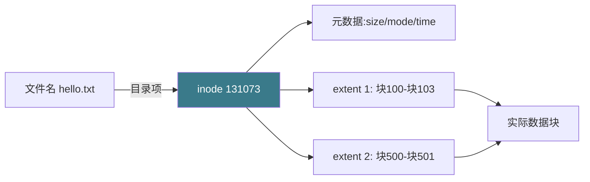
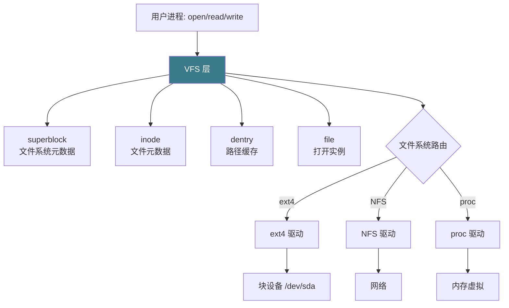

# 【金丹·72】文件系统：数据怎么存到硬盘上的

> **码农修仙传 · 金丹期 · 第72篇**
> 我是玄芯散人，带你从炼气修到大乘。

---

## 境界标识

```
╔══════════════════════════════════╗
║     金丹期 · 第72篇              ║
║     文件系统：数据怎么             ║
║     存到硬盘上的                  ║
║     inode/目录树/VFS/ext4        ║
║     预计阅读：20分钟              ║
╚══════════════════════════════════╝
```

---

## 修仙引入

上一篇把弟子之间传信的规矩讲透了。可修真界里还有一件大事没解决：弟子辛辛苦苦攒下的灵石和抄录的功法，最终都得落到宗门的仓库里。计算机也一样，进程跑完退出，内存里的数据清空，硬盘上的文件还得在。`/etc/passwd`、`/home/xianren/code.c`、下载的灵石矿藏文件，这些二进制字符怎么就老老实实待在了那块转得嗡嗡响的铁片子上？

修真界里这事归藏书阁管。藏书阁有阁主（VFS）管规矩，有库房（ext4）管分堆，有令牌（inode）管索引，有目录（dentry）管路径。这一篇把藏书阁拆开看：硬盘的最底层是什么，inode 这张"文件身份证"长什么样，目录凭什么能装下一万卷功法，VFS 怎么让一份代码能同时读 ext4 和 NTFS 的盘，ext4 比前辈多了哪些看家本领。看完这一篇，再有人问"我删的文件能不能找回"，你能直接答出来。

---

## 硬核主体

### 硬盘最底层：扇区、块、页

先从最底层说起。机械硬盘（HDD）和固态硬盘（SSD）在物理层不一样，但文件系统看的不是物理，是逻辑抽象。

扇区（sector）是硬盘出厂时划好的最小读写单位。HDD 一圈磁道切成几百段，每段 512 字节或 4096 字节（高级格式）。SSD 的最小写入单位叫 page，常见 16KB，擦除单位是 block，常见 4MB。但文件系统不直接看这些。

块（block）是文件系统层的最小单位。`mkfs.ext4` 时可以指定，默认 4KB。一个块对应 8 个 512 字节扇区。文件系统这些事都按块来：分配如此，释放如此，读和写也如此，按块记账效率最高。

修真比喻：扇区是石料铺子里切好的最小砖块，块是藏书阁用来盖书架的标准板材。一块板材由若干砖块拼成，盖书架时按板材算账不按砖块算账，效率更高。

块大小有讲究。太小，元数据开销大（每块都要记账），单文件最大能分到的块数又顶到上限。太大，小文件浪费空间（一个 1 字节文件占一整个 4KB 块，4096 倍浪费）。`mkfs.ext4 -b` 选 1024/2048/4096/8192 字节，最常见 4096。

```bash
# 查看当前文件系统的块大小
stat -f / | grep "Block size"
# 输出：Block size: 4096

# 查看当前目录占用的块数和实际文件大小
ls -ls /etc/passwd
# 输出形如：
# 4 -rw-r--r-- 1 root root 2965 Aug 28 10:00 /etc/passwd
# 第 1 列的 4 表示占用 4 个块 = 16KB（按 4KB 块算）
# 但文件实际大小是 2965 字节，远小于 16KB
```

### inode：文件的身份证

inode（index node，索引节点）是文件系统里绕不开的数据结构。每一个文件、每一个目录都是一个 inode。inode 不存文件名，只存元数据和数据块的索引。

ext4 的 inode 大小默认 256 字节，存的信息分三类。

第一类是文件属性。文件类型可以是普通文件，也可以是目录或符号链接，再特殊一点的还有设备文件，管道和 socket 也算。权限位标成 rwxrwxr-x，决定谁能读谁能写谁能执行。所有者记 UID 和 GID。链接数表示指向这个 inode 的目录项有几个。文件大小按字节算。时间戳里 atime 记访问时间，mtime 记修改时间，ctime 记元数据变更时间。ext4 还多一项 crtime（创建时间）。

第二类是数据块指针。早期 ext2/ext3 用 12 个直接指针 + 1 个单间接指针 + 1 个双间接指针 + 1 个三间接指针，最多支持 4KB × (12 + 1024 + 1024² + 1024³) ≈ 4TB。ext4 改用 extents，一组连续的块用一个 extent 描述，能塞进 inode 里。

第三类是扩展属性和 ACL。`chattr +i` 那个不可修改标志就是存这里的。

修真比喻：inode 是藏书阁给每一卷功法发的令牌。令牌上写明归谁所有；谁能看，谁能抄；卷有多大；这卷放在哪个书架的哪一格。但令牌上不写功法的名字，名字是目录的事。

```bash
# 查 inode 号
ls -i /etc/passwd
# 输出：131073 /etc/passwd

# 看 inode 详细信息
stat /etc/passwd
# 输出：
#   File: /etc/passwd
#   Size: 2965        Blocks: 8    IO Block: 4096   regular file
# Device: 802h/2050d  Inode: 131073   Links: 1
# Access: (0644/-rw-r--r--)  Uid: ( 0/ root)   Gid: ( 0/ root)
# Access: 2026-08-28 10:00:00
# Modify: 2026-08-28 10:00:00
# Change: 2026-08-28 10:00:00
# Birth: 2026-08-28 10:00:00
```

注意 `Birth` 那一行，就是 crtime。ext2/ext3 没有这个字段，ext4 才加上。

inode 编号是文件系统的内部编号。同一个 inode 号在不同文件系统里指向不同的文件。`mount` 一个新盘，inode 号会重新从 1 开始。`cp` 命令新建一份文件，新文件分配新的 inode 号，跟源文件完全无关。



### 目录：存文件名到 inode 的对照

目录也是一种 inode，类型是目录。但目录的数据块不存普通内容，存的是一组目录项（dir entry），每一项把一个文件名挂到一个 inode 号上。

最简单的目录文件长这样：`<文件名 1> <inode 号 1> <文件名 2> <inode 号 2> ...`。

```bash
# 直接读目录文件的内容（需要 root）
debugfs -R "stat /etc" /dev/sda2
# 输出包含目录项列表，每项含文件名和 inode 号
```

小目录（几百项以内）直接用链表。目录一大，链表线性查找就慢。ext4 默认开 HTree（hashed B-tree），把目录项按文件名哈希后塞进 B-tree，查找从 O(n) 变 O(log n)。Linux 2.6.23 起 HTree 默认开启，2 级 HTree 支持单目录约 1000 万到 1200 万条目；Linux 4.12 加入 large_dir 特性，开启 3 级 HTree，单目录可容纳约 60 亿条目，原本卡在 2GB 的目录大小上限也能解开。

修真比喻：目录是藏书阁的索引簿。簿上每一行写"《九阴真经》→ 阁-3-架-5-格"。索引簿本身也是一种"文件"，有自己的 inode 编号。索引簿太厚了查得慢，HTree 就是把索引按笔画哈希到多层抽屉里，翻一层就缩窄范围。

`ls -i` 能看到一个目录下所有文件的 inode 号。

```bash
ls -i /etc/ | head
# 输出：
# 131073 passwd
# 131074 shadow
# 131075 group
# 131077 ld.so.cache
# ...
```

每个目录至少有两个特殊目录项：`.` 指向自己，`..` 指向父目录。根目录的 `..` 指向自己。这就是路径解析时能往上走的依据。

`..` 指向父目录这件事，在 ext4 之前的传统 Unix 文件系统里，是禁止硬链接到目录的。原因是父目录的 `..` 必须指向唯一的一个父，硬链接会让一个目录有两个父，循环引用。`..` 是个固定目录项，不进 HTree，专门处理这事。

硬链接（hard link）和软链接（symbolic link）的区别正好用 inode 解释清楚。

```bash
# 硬链接：两个文件名指向同一个 inode
echo "原版" > original.txt
ln original.txt hardlink.txt
ls -i original.txt hardlink.txt
# 输出：
# 131073 original.txt
# 131073 hardlink.txt

# 删掉原版，硬链接还能访问
rm original.txt
cat hardlink.txt
# 输出：原版
```

硬链接这件事，落到机制上是同一个目录项集合里加一行，把同一个 inode 挂到两个名字下。inode 的链接数 +1。`rm` 删一个文件，链接数 -1，归零时 inode 才被回收。

软链接（symbolic link）则是另一种 inode，类型是 symlink。软链接的数据块存的是目标路径字符串。软链接可以跨文件系统，可以指向不存在的路径。原始路径没了，软链接就成"死链"。

```bash
ln -s original.txt softlink.txt
ls -l softlink.txt
# 输出：lrwxrwxrwx 1 root root ... softlink.txt -> original.txt
```

修真比喻：硬链接是给同一卷功法挂两个牌子，摘掉一个牌子另一块还在。软链接是给同一卷功法立一个"指路牌"，指路牌上写"那卷在阁-3-架-5"。原功法搬走或销毁了，指路牌就成了废物。

### VFS：把不同文件系统统一成一个

Linux 支持好几种文件系统。本地的有 ext 系列、XFS、Btrfs、FAT、NTFS 等，网络的 NFS，内核虚拟的 proc、sysfs 也算在内。它们实现方式各有差别，inode 布局和目录组织方式都不一样。如果每个程序都要根据文件系统类型写不同的代码，那就乱了。

VFS（Virtual File System Switch，虚拟文件系统）是内核里的一层抽象。它定义了一组通用的接口和数据结构，给所有文件系统提供统一的"合同"。不管是哪一种文件系统，都得按这套合同实现自己的细节。系统调用（`open`、`read`、`write`、`stat`）走 VFS 这一层，由 VFS 路由到具体的文件系统实现。

Linux VFS 里有四个主力数据结构。

第一，superblock。超级块，一个文件系统一份。它把整个文件系统的核心参数都收在里面，比如文件系统类型、块大小这样。还有些字段会随使用变化，空闲块数和空闲 inode 数都记在这。`mount` 时内核读 superblock 知道这个盘怎么用。`dumpe2fs /dev/sda2 | head` 能看到 ext4 的 superblock 内容。

第二，inode。前面讲过的元数据 + 数据块指针。VFS 层的 `struct inode` 是抽象，ext4 自己有 `ext4_inode_info` 嵌进去。

第三，dentry。directory entry 的内存表示。路径解析时内核建一个 dentry 缓存。路径被拆成多级 dentry：根目录一级，中间目录一级，文件名一级。命中缓存就不用重新查磁盘。

第四，file。进程打开一个文件后，内核建一个 `struct file` 结构体。这个结构体记录着当前的文件偏移和打开模式两个字段，再挂上对应的 dentry 和 inode 信息。多个进程可以同时打开一个文件，这时内核会建多个 `struct file`，它们都指向同一个 inode。

修真比喻：VFS 是藏书阁的总阁规。不管哪一房分阁都得按总阁规登记造册。每卷的令牌和索引簿都不能少，阅览凭证和总账也一样。具体分阁怎么放书随便，但接口得一致。弟子要查书，只认总阁规。



`/proc/filesystems` 列出了内核当前支持的所有文件系统类型。

```bash
cat /proc/filesystems | head
# 输出：
# nodev   sysfs
# nodev   tmpfs
# nodev   bdev
# nodev   proc
#         ext4
#         vfat
#         ...
```

前面 `nodev` 的表示不挂载到块设备上（proc、sysfs 是内核虚拟出来的）。

VFS 还有一项隐藏的工程壮举：`chroot` 和容器里的 rootfs，靠的就是用 VFS 把一棵树替换成另一棵树。Docker 镜像的分层文件系统（AUFS、OverlayFS）也是在 VFS 层做的叠加。所有这些"看起来像在文件系统上"的东西，底下全是 VFS 在统一调度。

### ext4：当下 Linux 的主力

ext4 是 ext2/ext3 的继承者，2008 年合入 Linux 2.6.28，现在是大多数发行版的默认文件系统（RHEL/CentOS、Ubuntu、Debian）。它在 ext3 的基础上做了四件大事。

第一，extents 替代间接块链表。ext2/ext3 用 12 个直接指针加间接指针链描述一个文件的数据块。100MB 的连续文件要几万个间接指针，文件一大，inode 装不下，元数据一通乱查。ext4 改用 extents，一个 extent 描述"从第 N 块开始的连续 K 块"，一个 inode 能塞 4 个 extent，每个 extent 最大 128MB。一个 1GB 连续文件只需要一个 inode 项就描述完了，文件越大优势越明显。

第二，HTree 目录索引。前面讲过。

第三，journaling 日志。写文件不只是改数据块，至少还要改 inode 自己的元数据，再去改目录项和位图（bitmap，记录哪些块被占用）。一次"创建文件"操作要改五六处地方。如果改到一半断电，系统启动时文件系统会不一致：inode 标记了已分配但位图还没标记，或者位图标记了但数据块还是旧内容。

journaling 的思路是把所有"先写什么后写什么"的顺序预先记到一份日志里。改文件前先写日志"我要做这些事"，然后去改。改完后再写一条"做完了"。系统启动时如果发现日志里有"我要做"但没"做完了"，就把这些操作重做一遍，确保文件系统一致。代价是写一次文件要做三次写盘动作（journal 头一次，数据改一次，journal 完一次），用延迟换来一致性。

修真比喻：journaling 是弟子每做一件大事前先去宗门记事堂登记。记事堂有"开始做事-事中-做完"三联单。先在第一联盖印，再去做事，事做完后去盖第三联。中途掉下悬崖失踪，下次宗门核账看到第一联就知道弟子在做什么，重新做一遍就是。

ext4 提供三种日志模式。`data=journal` 最稳，数据和元数据都写日志，最慢。`data=ordered`（默认）只把元数据写日志，但要求数据块在元数据日志提交前先落盘，能避免新数据覆盖旧文件这种糟心事。`data=writeback` 只日志元数据，数据落盘顺序不保证，最快但崩溃后可能看到垃圾数据。`mount -o data=ordered /dev/sda2 /mnt` 指定。

第四，多块分配和延迟分配（delalloc）。传统 ext3 一次 `write` 可能触发多个小块分配，效率低。ext4 攒一波再分配，多个连续块一起给，省位图操作。

```bash
# 创建一个 ext4 文件系统
mkfs.ext4 /dev/sdb1
# 输出：
# Creating filesystem with 262144 1k blocks and 65536 inodes
# Filesystem UUID: ...
# Superblock backups stored on blocks:
#     8193, 24577, 40961, 57345, 73729, 204801, 221185
# Allocating group tables: done
# Writing inode tables: done
# Creating journal (8192 blocks): done
# Writing superblocks and filesystem accounting information: done
```

`Superblock backups stored on blocks` 这一行说明 ext4 把 superblock 在多个位置做了备份。万一开头那个 superblock 所在的块坏了（早期 ext 系列经常被这个问题坑），从备份恢复。

ext4 的容量上限：单文件最大 16 TiB（4KB 块）或 256 TiB（64KB 块），单文件系统最大 1 EiB（1024 PiB）。最大文件数约 40 亿，最大文件名 255 字节。

```bash
# 看当前文件系统的特征
tune2fs -l /dev/sda2 | head -20
# 输出：
# Filesystem volume name:   <none>
# Last mounted on:          /
# Filesystem UUID:          ...
# Filesystem magic number:  0xEF53
# Filesystem revision #:    1 (dynamic)
# Filesystem features:      has_journal ext_attr resize_inode dir_index filetype extent 64bit flex_bg sparse_super large_file huge_file dir_nlink extra_isize metadata_csum
# Filesystem state:         clean
# ...
# Block size:               4096
# Fragment size:            4096
# ...
# Inode size:               256
```

`has_journal ext_attr dir_index filetype extent` 这一串就是 ext4 比 ext3 多出来的特性标签。

修真比喻：ext4 是藏书阁新一代总管。比上一代多了四件看家本领。用 extent 一段一段登记，省地方（extents）；目录索引改成 B-tree 哈希，大库房翻书快（HTree）；做事先登记，断电不乱账（journaling）；批量搬书省力气（多块分配）。

修真界里这一条要记住："ext4 是大多数发行版的默认，新盘格式化首选 ext4，老盘想升级用 `tune2fs -O extents,uninit_bg,dir_index /dev/sda2` 然后 `e2fsck` 一下。"

---

## 修仙术语对照表

| 修仙术语 | 技术现实 | 本篇位置 |
|---------|---------|---------|
| 藏书阁 | 文件系统 | 引入 |
| 石料铺子 | 硬盘物理层 | 块/扇区 |
| 标准板材 | 文件系统 block | 块/扇区 |
| 砖块 | 硬盘 sector | 块/扇区 |
| 功法令牌 | inode | inode |
| 索引簿 | 目录 dir entry | 目录 |
| HTree 多层抽屉 | hashed B-tree 目录索引 | 目录 |
| 父目录条目 | `..` 目录项 | 目录 |
| 两块牌子的同一卷 | hard link | 目录 |
| 指路牌 | symbolic link | 目录 |
| 总阁规 | VFS | VFS |
| 总账 | superblock | VFS |
| 阅览凭证 | struct file | VFS |
| 路径缓存 | dentry cache | VFS |
| 行事三联单 | journaling | ext4 |
| extents 段位登记 | extent 块组描述 | ext4 |
| 数据=ordered | 默认日志模式 | ext4 |

---

## 进阶条件

看完这一篇到能向别人讲清"数据怎么落盘 + 怎么跨文件系统"，差这几条：

- [ ] 能讲清块（block）和扇区（sector）的区别（块是文件系统最小单位，扇区是硬盘最小单位）
- [ ] 能讲清 inode 存什么不存什么（存元数据和数据块指针，不存文件名）
- [ ] 能用 `ls -i` 和 `stat` 看到 inode 号和元数据
- [ ] 能讲清硬链接和软链接落到机制上的差别（硬链接共享 inode，软链接存路径字符串）
- [ ] 能讲清为什么删除文件要看链接数（链接数归零 inode 才回收）
- [ ] 能列出 VFS 四个对象各自干什么（superblock 管文件系统元数据，inode 管文件元数据，dentry 管路径缓存，file 管打开实例）
- [ ] 能讲清 ext4 的 extents 比 ext3 的间接块指针好在哪（连续块一次描述，元数据紧凑）
- [ ] 能讲清 journaling 解决的是什么问题（断电或崩溃后文件系统能恢复一致）
- [ ] 能说出 ext4 的三个日志模式（journal/ordered/writeback）和默认是哪个（ordered）

> 最后一条是金丹期对"文件系统"的"分水岭"。面试里被问"ext4 比 ext3 多了什么"，能直接说出"extents、HTree、journaling、多块分配"这套四点口诀，这一关就过了。

---

## 下期预告 + 互动

> 上一篇把 IPC 讲完了，这一篇把文件系统收掉。可修真界还有一件大事：多位弟子同时动一件东西时怎么不出乱子。下一篇围绕线程安全展开，把锁和原子操作这两件兵器先拆开看，再讲内存屏障。看完了，再有人问"我那段多线程代码为什么结果偶尔不对"，你能直接答出来。

现在问你：

> 🔍 跑一下 `ls -i /etc/passwd` 拿到 inode 号，再 `find / -inum <那个号> 2>/dev/null` 看看整个文件系统上还有没有别的硬链接指向同一个 inode。如果没有，再用 `ln /etc/passwd /tmp/passwd_hardlink` 建一个硬链接，再 `ls -i /etc/passwd /tmp/passwd_hardlink` 看两个文件名指向同一个 inode 是怎么回事。

> ⚙️ 你有没有遇到过"删了大文件磁盘没释放"或者"rm 之后 df 看空间没变"的诡异问题？通常是文件还被某个进程持有（删的是文件名，inode 还在）。`lsof | grep deleted` 一查一个准。下次遇到先这么查。

> 评论区聊聊你跟文件系统打过的交道。

> 我是玄芯散人，带你从炼气修到大乘。

---

*本文是「码农修仙传」系列第72篇。系列导航见 [xren.ren](https://xren.ren)*
