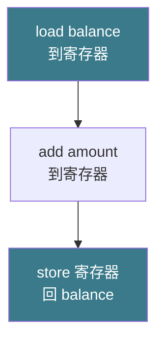
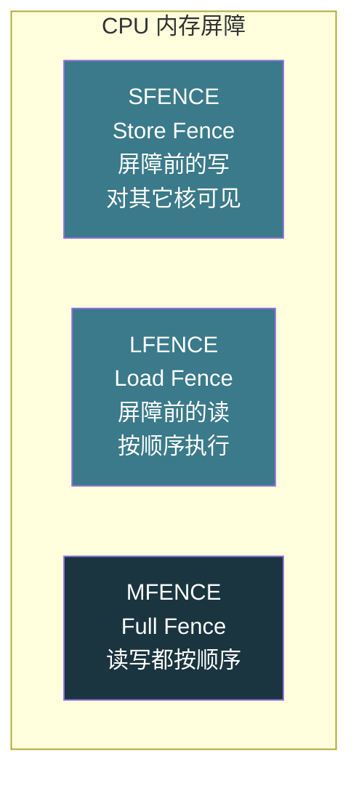

# 【金丹·73】线程安全：锁、原子操作与内存屏障

> **码农修仙传 · 金丹期 · 第73篇**
> 我是玄芯散人，带你从炼气修到大乘。

---

## 境界标识

```
╔══════════════════════════════════╗
║     金丹期 · 第73篇              ║
║     线程安全：锁、原子操作、      ║
║     内存屏障                     ║
║     mutex/spinlock/CAS/mb/volatile║
║     预计阅读：25分钟              ║
╚══════════════════════════════════╝
```

---

## 修仙引入

上一篇把文件系统收掉了。可修真界里还有一件大事没解决：多个弟子同时动一件东西时怎么不出乱子。两位金丹修士对同一卷功法同时抄录，一卷变两卷；十位弟子同时往同一个灵石账户里存灵石，最后少了几颗；某位弟子刚要去读令牌上的内容，另一位已经把这张令牌换成了新内容。这些事听起来像江湖恩怨，放到操作系统里就是线程安全问题。

修真界里这件事归山门戒律堂管。戒律堂有一套规矩：互斥锁让"密室同时只进一人"；自旋锁让"门外弟子原地等"；CAS 是"用探测术取代排队"；内存屏障是"看破幻术的定心咒"；`volatile` 是"看似厉害实则只挡内门幻术的护身符"。这一篇把戒律堂拆开看：每件兵器怎么用，适合什么情形。

---

## 硬核主体

### 为什么多线程需要同步

先把问题摆出来。线程是进程的"分身"，共享进程的地址空间。共享带来便利，也带来麻烦。

```c
// 两位弟子同时往共享账户里存灵石
int balance = 0;       // 共享变量

void deposit(int amount) {
    balance = balance + amount;  // 这一行不是原子的
}

// 启动 100 个线程，每个线程存 100 次 1
// 期望 balance = 10000
// 实际可能得到 9873 或其它值
```

修真比喻：两位弟子在同一个账本上记账。第一位弟子先看一眼账本（读到余额 100），记下要加 50；第二位弟子也看一眼（也读到 100），也记下要加 30。第一位弟子写回账本（变成 150），第二位弟子写回账本（变成 130）。最终账本上只有 130，丢了 50。

修真比喻对应到 CPU 视角：`balance = balance + amount` 这行 C 代码被编译器翻译成三条指令。



两个线程同时跑这三条指令，可能交错执行（interleaving）。交错顺序不同，最终结果不同。这叫竞态条件（race condition）。共享内存多线程编程的根上所有 bug，都来自这种"看起来是一件事，实际是三件事"。

修真比喻：修真界里"修炼密室"是共享资源。多个弟子同时在密室里修炼灵识，灵识会互相冲撞，修为会乱套。戒律堂的职责就是让同一时刻只允许一位弟子在密室里。

### 互斥锁 mutex：阻塞式同步

互斥锁（mutex，mutual exclusion）是修真界最常用的兵器。规矩是：进密室前先拿令牌，令牌被拿走了就在门外睡（阻塞），令牌还回来时守门人叫醒一个在等的弟子。

```c
#include <pthread.h>

int balance = 0;
pthread_mutex_t lock = PTHREAD_MUTEX_INITIALIZER;

void deposit(int amount) {
    pthread_mutex_lock(&lock);     // 拿令牌，没拿到就睡
    balance = balance + amount;    // 临界区
    pthread_mutex_unlock(&lock);   // 还令牌，叫醒一个等的人
}
```

修真比喻：修炼密室门口站着守门人。守门人手里有一把钥匙。弟子想进密室，先问守门人拿钥匙。拿到了，进去修炼。守门人手里没钥匙（被别人拿走了），弟子就席地而睡（阻塞）。进密室的弟子修炼完出来还钥匙，守门人摇醒睡着的某个弟子。

锁的实现在 Linux 上走 futex（fast userspace mutex）机制。2002 年由 Linux 内核引入，主要作者是 Franke、Kirkwood、Molnár 与 Russell。futex 的精髓是"无竞争时完全在用户态跑，碰上竞争才进内核"。

```c
// pthread_mutex_lock 的简化伪代码
void mutex_lock(int *lock) {
    // 第一阶段：用户态原子尝试
    if (atomic_compare_exchange(lock, 0, 1))  // CAS：当前是 0 吗？是就改成 1
        return;  // 拿到了，结束
    
    // 第二阶段：进内核等待
    while (atomic_load(lock) != 0)  // 自旋检查一遍
        futex_wait(lock, 1);        // 没人抢就睡，锁状态变了内核叫醒我
    // 被叫醒后再 CAS 一次
    while (!atomic_compare_exchange(lock, 0, 1))
        ;
}
```

修真比喻：守门人手里其实有一面旗。无竞争时弟子在门口看一眼旗（用户态读），旗上写"无人"（0），就把旗翻成"有人"（1）然后直接进密室（CAS 一次成功，完全不用打扰守门人）。竞争激烈时旗上写"有人"（1），弟子就去偏房睡觉（进内核阻塞），守门人记下有弟子在等。等里面的人出来把旗翻成 0（解锁），守门人就从偏房摇醒一个弟子。

mutex 的"阻塞"对 CPU 友好：不占 CPU 周期。所以 mutex 适合临界区比较长的情形（毫秒级以上的操作），比如文件读写和数据库事务。

mutex 的代价：线程阻塞要进内核，要切栈和改调度队列。一次进内核出内核的开销是几微秒（具体看内核版本和硬件）。临界区短到几百纳秒时，这笔开销反而成了主要成本。

修真比喻：守门人不能 24 小时盯着你。每次你进出都要登记和查玉牌（进内核）。修炼一炷香就出来（临界区短），登记换衣的时间比修炼还长。所以短活儿不要叫守门人，自旋锁更合算。

### 自旋锁 spinlock：忙等式同步

自旋锁（spinlock）规矩是：进密室前先拿令牌，令牌被拿走了就在门口转圈等（busy-wait），不睡觉。

```c
// Linux 内核自旋锁示例
#include <linux/spinlock.h>

spinlock_t my_lock;
int shared_counter = 0;

void increment(void) {
    spin_lock(&my_lock);          // 拿锁，转圈等
    shared_counter++;             // 临界区
    spin_unlock(&my_lock);        // 放锁
}
```

修真比喻：修炼密室门口挂着一条红绳。红绳一端有令牌。弟子想进密室，先拽红绳。令牌在（没人用），拽过来就进去。令牌被别的弟子拿着，弟子就站在门口转圈走（自旋），眼睛一直盯着红绳那端。对方一放令牌，弟子立刻拽过来冲进去。

自旋锁的实现走 CPU 硬件原子的 test-and-set 指令：

```c
// 自旋锁的简化伪代码（x86 上对应 XCHG 或 LOCK 指令）
typedef struct {
    int locked;  // 0 表示空闲，1 表示被持有
} spinlock_t;

void spin_lock(spinlock_t *lock) {
    while (1) {
        // test-and-set：原子地读旧值 + 写 1
        int old = atomic_xchg(&lock->locked, 1);
        if (old == 0)        // 旧值是 0（空闲），现在被我设成 1（占用）
            return;          // 拿到了
        // 否则继续循环
    }
}
```

修真比喻对应：每个红绳一端都贴着一张黄纸，上面写"无人"或"有人"。弟子伸手把黄纸翻成"有人"的同时看一眼旧字（test-and-set 是原子的）。旧字是"无人"，意味着没人在用，弟子拿着黄纸进密室。旧字是"有人"，意味着别人在用，弟子站在原地继续翻黄纸（自旋）。

自旋锁的几个细节：

第一，x86 上 test-and-set 用 `XCHG` 指令或 `LOCK` 前缀的指令实现。Wikipedia 确认 x86 自 80486 起有 `CMPXCHG` 和 `XCHG` 等原子指令。ARM 上用 `LDREX`/`STREX`（Load-Link / Store-Conditional）实现。

第二，ticket lock 解决了"自旋锁不公平"的问题。原版自旋锁所有等的人一拥而上抢令牌，可能导致某些弟子永远轮不上。ticket lock 改成发号排队的模式：每个线程拿号（ticket），锁上记录当前服务号（serving）。`serving == my_ticket` 才进。Wikipedia 确认 Linux 内核 2008 年起在部分场景用 ticket lock 替代纯自旋锁，强制 FIFO 行为。

```c
// ticket lock 伪代码
typedef struct {
    atomic_t next_ticket;    // 下一个要发的号
    atomic_t now_serving;    // 当前服务的号
} ticket_lock_t;

void ticket_lock(ticket_lock_t *lock) {
    int my_ticket = atomic_fetch_add(&lock->next_ticket, 1);  // 拿号
    while (atomic_load(&lock->now_serving) != my_ticket)     // 轮到我了吗？
        ;  // 自旋等
}

void ticket_unlock(ticket_lock_t *lock) {
    atomic_fetch_add(&lock->now_serving, 1);  // 叫下一个号
}
```

修真比喻：守门人手里有一本排队簿，簿上写"当前号"。弟子来领号，守门人在簿上记下这个号，弟子记在自己的玉牌上。弟子盯着簿，等"当前号"变成自己玉牌上的号，自己再进。绝对公平，先来先进。

第三，自旋锁适合临界区极短（纳秒级）的情形。锁等待时间短，自旋的 CPU 浪费小。Linux 内核里中断处理就用自旋锁，因为中断处理里不能睡眠。临界区长就改用 mutex。

自旋锁的致命禁忌：不能在用户态进程间随便用自旋锁。一个线程拿了自旋锁还没放，被操作系统切走（时间片到了），另一个线程在自旋就白白烧 CPU；如果只有这一颗核，整个系统死锁（持锁线程永远拿不回 CPU 跑完释放）。Linux 内核里的自旋锁专门用于中断上下文或内核态不能睡眠的场合。

### CAS 原子操作：无锁编程的基础

CAS（Compare-And-Swap，比较并交换）是另一种兵器，不用锁也能保证原子性。规矩是"用探测术取代排队"。

```c
// CAS 的逻辑（伪代码）
bool CAS(int *addr, int expected, int new_value) {
    if (*addr == expected) {     // 当前值符合预期？
        *addr = new_value;       // 是：换成新值
        return true;             // 成功
    }
    return false;                // 否：失败
}
```

CAS 在 x86 上对应 `CMPXCHG` 指令。Wikipedia 确认 x86 自 80486 起有 `CMPXCHG`，多处理器上必须加 `LOCK` 前缀。这条指令由 CPU 硬件保证原子性，不会被中断。

修真比喻：修炼密室不用门锁，改用符箓。弟子进密室前先掐诀念符："若密室无人（expected 符合），则推门进入并设置占用标记（new_value），返回成功"；"若有人（不符合），返回失败"。整个过程不阻塞任何人，弟子只是不断"念符-判定-再念符"。

无锁累加器的典型实现：

```c
#include <stdatomic.h>

atomic_int counter = 0;  // C11 原子类型

void increment(void) {
    int old = atomic_load(&counter);
    // atomic_compare_exchange_weak：当前是 old 吗？
    //   是：改成 old+1，返回 true
    //   否：把 old 更新为当前最新值，返回 false
    while (!atomic_compare_exchange_weak(&counter, &old, old + 1)) {
        // old 已被自动更新，继续循环
    }
}
```

修真比喻：多位弟子要往同一个灵石账户存灵石。第一位弟子读账户（读到 100），念符"若账户是 100，则改成 101"，成功了。第二位弟子读账户（也读到 100），念符"若账户是 100，则改成 101"，失败了，符箓把 old 自动更新成 101。第二位弟子再念符"若账户是 101，则改成 102"，这次成功。

CAS 看着比锁优雅，但有两个大坑。

第一是 ABA 问题。修真比喻：弟子 A 读账户读到 100，弟子 B 把账户从 100 改成 101，又改回 100。弟子 A 念符"若账户是 100，则改成 101"，成功，账户变成 101。可是中间账户从 100 变 101 变 100 这一段，B 可能存了又取了灵石，A 没看到。这在指针操作里尤其致命（指针指向的内存被释放又重新分配，A 还以为是原来的对象）。解法是加版本号（用 64 位 CAS，把版本号塞高 32 位）。

第二是 livelock（活锁）。所有线程都 CAS 失败不断重试，CPU 跑满但没进展。修真比喻：两位弟子同时去推门，门只能容一人，两人互相让路又同时进，结果谁都进不去。解法是失败时随机 sleep 一小段时间再重试（指数退避）。

CAS 适用的情形是临界区短、竞争不激烈的场合。竞争激烈时 CAS 失败率高，所有线程都重试，性能反而比锁差。无锁队列、无锁哈希表是 CAS 的经典用法。

修真比喻：修炼密室门口放一个签筒，弟子抽签决定先后。抽到的签写着"先"就能进。所有人各抽各的，不用排队。问题是大家同时抽到"先"就撞上了，得多抽几次（重试）。

### 内存屏障：解决指令重排

锁和 CAS 解决"原子性"，但并发还有第二类问题：可见性。修真比喻：弟子 A 把灵石放进宝箱，弟子 B 过了一会儿开箱看，发现灵石不在。这是因为 A 的"放"动作还没同步到 B 看的内存视图上。

更隐蔽的是第三类问题：指令重排。CPU 和编译器都会重排指令以提高性能，重排后单线程结果不变，但多线程可能错乱。

```c
// 看似合理的双线程同步
int ready = 0;
int data = 0;

// 线程 A
data = 42;       // (1) 写数据
ready = 1;       // (2) 标记就绪

// 线程 B（自旋等待）
while (ready == 0) ;  // (3) 等就绪
print(data);     // (4) 打印数据，期望 42
```

修真比喻：弟子 A 把灵石放进宝箱（步骤 1），再贴一张"已就绪"的封条（步骤 2）。弟子 B 看见封条（步骤 3）就开箱取灵石（步骤 4）。问题出在 A 心里：贴封条是小事，先做也行后做也行。A 可能先贴封条再放灵石。B 看见封条开箱，箱里是空的。

修真比喻对应到硬件：x86 是强内存模型（TSO），大多数写操作天然按顺序对其它核可见。但 ARM 和 POWER 是弱内存模型，写操作可能乱序到达其它核。即使是 x86，编译器也可能把 `data = 42` 重排到 `ready = 1` 之后（单线程看没区别，多线程就错了）。

内存屏障（memory barrier）就是破重排幻术的定心咒。Wikipedia 确认 memory barrier 又叫 memory fence。x86 上对应三条指令：



修真比喻：弟子 A 想确保"先放灵石再贴封条"，就在两步之间念一道"封字诀"（memory barrier）。这道诀的效果是：写灵石的动作必须真真切切落到主存（或对其它核可见），才能开始写封条。CPU 内部的乱序执行单元看到这道诀，前面的写就不能越过它。

屏障分两类。

第一类，CPU 内存屏障（hardware memory barrier / fence）。x86 上的 `SFENCE`、`LFENCE`、`MFENCE` 都是。`SFENCE` 保证屏障前的所有 store 在屏障后的 store 之前对其它核可见。`LFENCE` 保证屏障前的所有 load 按程序顺序执行。`MFENCE` 两边都管。ARM 上的 `DMB`（Data Memory Barrier）和 `DSB`（Data Synchronization Barrier）是对应物。

第二类，编译器屏障（compiler barrier）。编译器也会重排代码（C 编译器处理时，单线程语义不变就重排）。GCC 上对应 `asm volatile("" ::: "memory")`：

```c
// 编译器屏障：禁止编译器把屏障前后的内存操作重排
#define COMPILER_BARRIER() __asm__ __volatile__("" ::: "memory")

data = 42;                // (1)
COMPILER_BARRIER();       // 编译器不许把 (2) 排到 (1) 前面
ready = 1;                // (2)
```

Wikipedia 提到 compiler barrier 跟 CPU memory barrier 不是一回事。Compiler barrier 只挡编译器的处理（不让它重排），不挡 CPU 的乱序执行。挡 CPU 乱序得用 CPU 屏障。

修真比喻：弟子 A 心里先放灵石再贴封条，编译器（心里的算盘）觉得顺序无所谓就先贴封条再放灵石。`COMPILER_BARRIER()` 是定心诀，让算盘不许算这步。同样的，CPU（手）也可能先贴封条再放灵石，`SFENCE`/`MFENCE` 是定手诀，让手不许先贴。

高级语言把这一切都封装好了。Java 5 之后 `volatile` 自带 release/acquire 语义。C11/C++11 引入 `<stdatomic.h>` / `<atomic>`，提供六种内存序。最强的是 `memory_order_seq_cst`，模拟顺序一致性；最弱的是 `memory_order_relaxed`，只保证原子性不保证顺序。`memory_order_release` 和 `memory_order_acquire` 是最常用的两个，前者用于写、后者用于读，按需挑用。

### volatile 关键字的真相

C/C++ 里的 `volatile` 是程序员最常误用的词。它的本意是告诉编译器"这个变量随时可能被外部修改，别精简"。

修真比喻：弟子 A 在告示牌写"灵石已入箱"，用的是一张会褪色的符纸（volatile 变量）。弟子 B 路过看符纸，因为符纸颜色淡，B 一开始没看见就读了个"空"值。B 的眼睛（编译器）觉得这符纸反正会变，干脆只看一次，于是永远看到"空"。

`volatile` 在 C/C++ 里只防止编译器精简，不防止：

1. CPU 指令重排（编译器屏障不等于 CPU 屏障）
2. 多核缓存不一致（A 核写了，B 核的 L1 缓存可能还是旧值）
3. 读操作被合并到寄存器（不加 volatile 时，编译器可能把读精简成读寄存器缓存）

Wikipedia 直接点出：`volatile` 在 C/C++ 里不提供内存序保证，多线程同步不能用 `volatile` 当锁用。C 标准明确说明 `volatile` 的合法用途是访问硬件寄存器或与信号处理函数共享变量，不用于线程同步。

修真比喻：`volatile` 是"挡心魔诀"，挡的是弟子自己心里的偷懒（编译器精简）。它挡不了外面的天魔（CPU 重排和缓存不一致）。要把所有天魔都挡住，得用更高级的符箓：Java 的 `volatile`（JVM 5 之后有 release/acquire 语义）、C11/C++11 的 `_Atomic` / `std::atomic`。

正确写法（C11/C++11）：

```c
#include <stdatomic.h>

atomic_int ready = 0;   // 原子变量，自带内存屏障
int data = 0;

// 线程 A
data = 42;
atomic_store_explicit(&ready, 1, memory_order_release);  // 写屏障

// 线程 B
while (atomic_load_explicit(&ready, memory_order_acquire) == 0) ;
print(data);  // 一定看到 42
```

`memory_order_release` 保证 `ready = 1` 之前的写（`data = 42`）不会被重排到 `ready = 1` 之后。`memory_order_acquire` 保证 `ready == 1` 之后的读（`print(data)`）不会被重排到 `ready == 1` 之前。两者配合，形成 release-acquire 同步。

修真比喻：弟子 A 在写完"灵石已入箱"之前要先念一道"封字诀"（release），这道诀确保前面的写全完成。弟子 B 在看见"灵石已入箱"之后念一道"开字诀"（acquire），这道诀确保后面的读按顺序执行。两道诀合起来，A 的写和 B 的读形成"先来后到"的因果链。

### 选兵器：什么时候用什么

修真比喻收尾。线程安全兵器有四件，挑哪件要看情形。

| 情形 | 兵器 | 修真比喻 |
|------|------|---------|
| 临界区长（毫秒级）| mutex（阻塞）| 守门人+偏房，弟子睡下不烧 CPU |
| 临界区短（纳秒级）| spinlock（忙等）| 红绳转圈看，弟子站着等 |
| 简单计数器、标志位 | CAS 原子操作 | 签筒抽签，弟子各凭本事 |
| 复杂数据结构 | mutex 包住整个操作 | 整间密室只进一人 |
| 单变量标志位 | `_Atomic` + release/acquire | 符箓 + 封字诀 + 开字诀 |
| MMIO | `volatile` | 挡心魔诀，访问外设寄存器 |

修真比喻：弟子练功要看情形。短兵器（飞剑）灵巧但杀不了重甲兵（CAS 适合短临界区）。长兵器（长枪）威力大但笨重（mutex 适合长临界区）。符箓是辅助（内存屏障），不能当主战兵器。`volatile` 是练功时的护身符（挡心魔），不是杀招。

修真比喻落到底层：选 mutex 还是 spinlock，看临界区长度和能否睡眠。Linux 内核中断上下文不能睡眠，必须用 spinlock。用户态进程间一般用 pthread mutex。竞争激烈时 mutex 内部还是会先自旋（adaptive mutex，比如 glibc 的 `PTHREAD_MUTEX_ADAPTIVE_NP`），自旋几次还拿不到才进内核阻塞。

---

## 修仙术语对照表

| 修仙术语 | 技术现实 | 本篇位置 |
|---------|---------|---------|
| 修炼密室 | 临界区 | 互斥锁 |
| 守门人 | mutex 实现 | 互斥锁 |
| 偏房 | futex 等待队列 | 互斥锁 |
| 红绳转圈等 | 自旋锁忙等 | 自旋锁 |
| 黄纸翻面 | test-and-set 指令 | 自旋锁 |
| 排队簿 | ticket lock | 自旋锁 |
| 签筒抽签 | CAS 原子操作 | CAS |
| 符箓念诀 | CAS 探测 | CAS |
| ABA 偷梁换柱 | ABA 问题 | CAS |
| 活锁堵门 | livelock | CAS |
| 封字诀 | release 屏障 | 内存屏障 |
| 开字诀 | acquire 屏障 | 内存屏障 |
| 定心诀 | compiler barrier | 内存屏障 |
| 定手诀 | CPU memory fence | 内存屏障 |
| 挡心魔符 | `volatile` 词 | volatile |
| 真符箓 | `_Atomic` / `std::atomic` | volatile |

---

## 进阶条件

看完这一篇到能向别人讲清"多线程共享资源怎么不出乱子"，差这几条：

- [ ] 能讲清为什么 `balance = balance + 1` 不是原子的（编译器翻译成 load-add-store 三条指令，会被中断）
- [ ] 能讲清互斥锁和自旋锁的区别（mutex 阻塞让出 CPU，spinlock 忙等占 CPU）
- [ ] 能讲清 futex 机制的精髓（无竞争时完全在用户态，竞争时才进内核）
- [ ] 能讲清 ticket lock 解决的是什么问题（自旋锁的不公平）
- [ ] 能讲清 CAS 的两个坑（ABA 问题、活锁）
- [ ] 能讲清 CPU 内存屏障和编译器屏障的区别（前者挡硬件重排，后者挡编译重排）
- [ ] 能讲清 x86 三条内存屏障指令的区别（SFENCE/LFENCE/MFENCE 各自管什么）
- [ ] 能讲清为什么 C/C++ 的 `volatile` 不能用于线程同步（不保证内存序、不保证多核可见）
- [ ] 能讲清 C11/C++11 的 release/acquire 语义怎么用

> 最后一条是金丹期对"线程安全"的"分水岭"。面试里被问"`volatile` 能不能当锁用"，能直接说出"不能，volatile 只挡编译器精简不挡 CPU 重排，C11 之后用 `_Atomic` + release/acquire"，这一关就过了。

---

## 下期预告 + 互动

> 上一篇把文件系统收掉了，这一篇把线程安全拆开讲。可修真界里还有一件大事：弟子们收完外设通知（中断）之后，谁来处理善后，多大动静由谁来干。下一篇围绕中断下半部展开，把下半部那三件兵器（软中断、Tasklet、Workqueue）先拆开看，再讲什么时候用哪件。看完了，再有人问"我的网卡中断为什么把 CPU 跑满"，你能直接答出来。

现在问你：

> 🔍 写一段两个线程竞争 `counter++` 的代码，编译跑一下，循环十万次看结果是不是二十万。结果不是的话，试试用 `pthread_mutex` 包住，看结果变成二十万。再把 `pthread_mutex` 换成 `atomic_fetch_add(&counter, 1)`，看结果也对。这三个版本哪个最快？为什么？评论区聊聊你的实测结果。

> ⚙️ 调一下你的 Linux 内核，编译参数里加上 `-O3`，再编一份默认编译的。对比两份二进制对 `volatile` 变量的处理（用 `objdump -d` 看反汇编）。`volatile` 那份会真的每次都去内存取值，`-O3` 那份可能把读精简到寄存器。这是 `volatile` 唯一确定的副作用（挡编译器精简），挡不住其它东西。

> 评论区聊聊你跟线程安全打过的交道。

> 我是玄芯散人，带你从炼气修到大乘。

---

*本文是「码农修仙传」系列第73篇。系列导航见 [xren.ren](https://xren.ren)*
