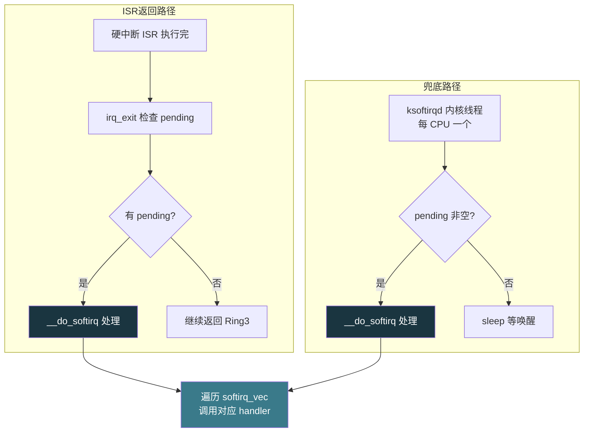
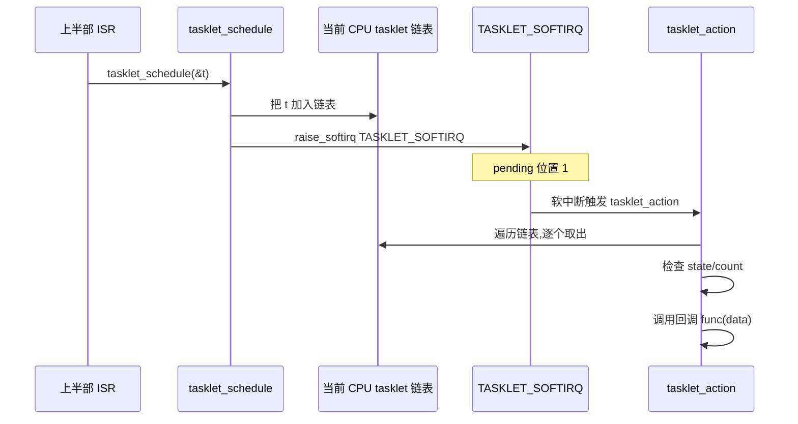
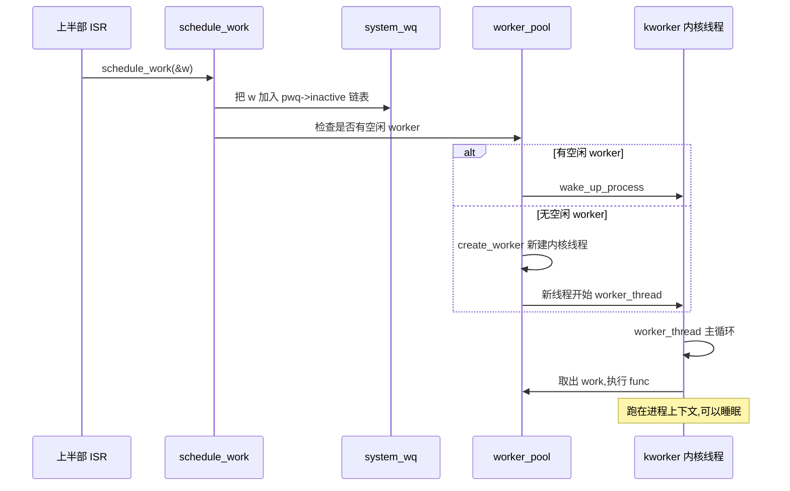
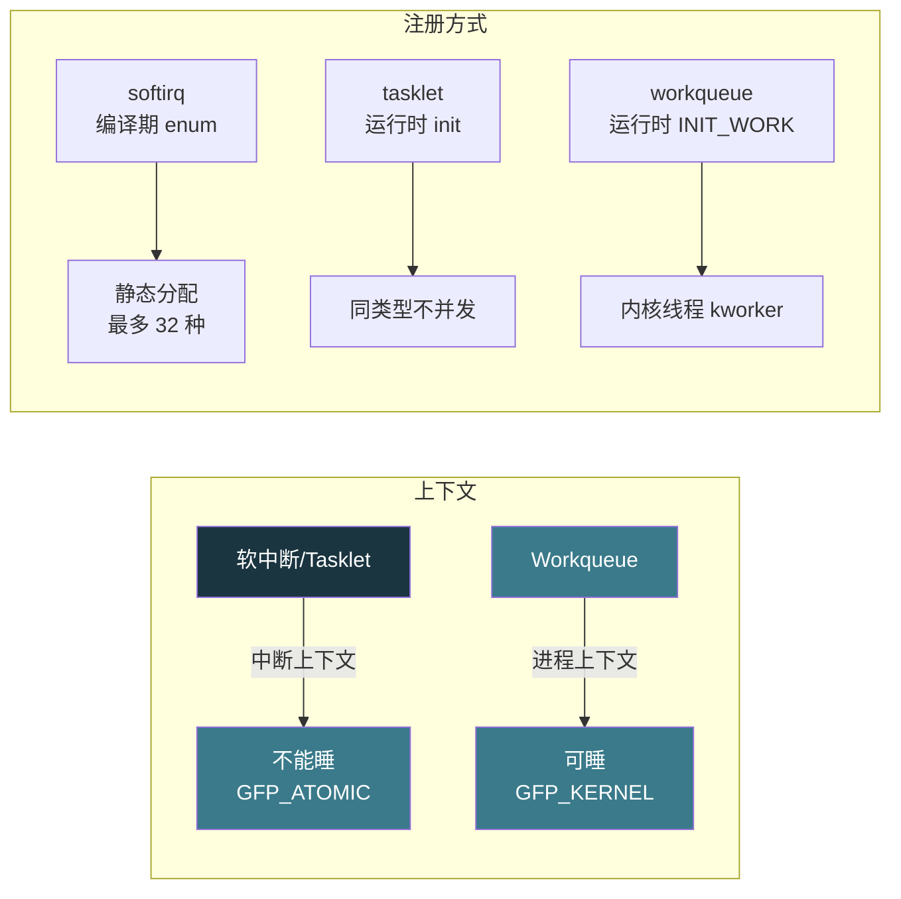

# 【金丹·74】软中断、Tasklet和Workqueue：中断下半部的三种机制

> **码农修仙传 · 金丹期 · 第74篇**
> 我是玄芯散人，带你从炼气修到大乘。

---

## 境界标识

```
╔══════════════════════════════════╗
║     金丹期 · 第74篇              ║
║     软中断/Tasklet/Workqueue     ║
║     中断下半部的三种实现机制       ║
║     预计阅读：20分钟              ║
╚══════════════════════════════════╝
```

---

## 修仙引入

上一篇 067 提到，中断处理要分上下半部。上半部是硬中断，跑在关中断的紧急上下文里，只做应答硬件、登记软中断这些必须立刻做的事。下半部这一层则把上半部没干完的活，按能不能睡等约束分成几条路线——分别是软中断机制、tasklet 机制，还有 workqueue 机制。

修真界里，上半部相当于烽火台上的守将接到告急文书，扫一眼文书编号（火情等级），立刻批「速派人去」。烽火台不能耽搁，后面还有文书陆续送来。真正的救火队员由天庭调度系统派出，这调度系统有三种：一种是就近的快反队（软中断），专门处理火情轻、不用吃饭不用睡的情形；一种是稍慢的快反小组（tasklet），每个小组只派一组人、不许重复出警；另一种是工程队（workqueue），要搬灵石、挖沟渠，可以慢慢干也可以休息。三种各有适用情形，挑错了要么救火慢，要么调度崩。

这一篇把这三种下半部机制拆开看：它们在内核里怎么实现，代码长什么样，分别适合什么情形。

---

## 硬核主体

### 为什么下半部要分三种

先把约束摆出来。中断上半部跑在关中断状态，处理时间一长，其它中断就被堵住了。网卡收到 1500 字节的以太网帧，从缓冲区读出整个帧可能要几十微秒；键盘按下一个键倒是只要几微秒，但后续要把按键事件转交给 tty 层，再做去抖，再分发给读键盘的进程，整套下来也是几十微秒。这些事都要尽快做完，但又不适合全堆在上半部里。

下半部要解决的事有差异。有的事不能睡（比如网络收包要走协议栈，软中断上下文里 `GFP_KERNEL` 这种允许睡眠的内存分配不能要）；有的事可以睡（比如块设备要把数据搬进内存再做处理，可能要等 DMA 完成、可能要睡眠等 I/O）；有的事要求同类型不能并发（避免重入）。Linux 内核根据这些差异设计了三种机制。

修真比喻：天庭的调度系统有三种编制。火情紧急不许歇的（软中断），走禁卫军路线，火警响起立刻冲上去不能停。中等火情按区域分组（tasklet），每组只有一支队伍出警，不会两支同组队伍同时到场。大工程要搬灵石、挖沟渠（workqueue），派工程队，可以休息可以换班。

### 软中断 softirq：内核预定义的快速机制

软中断是内核最早的下半部机制，也是最基础的。Linux 在 `include/linux/interrupt.h` 里用一个 enum 静态列出所有支持的软中断类型，最多 32 种，目前内核实际使用了 10 种。

```c
// include/linux/interrupt.h （v6.1 内核源码）
enum softirq_type {
    HI_SOFTIRQ=0,        // 高优先级 tasklet
    TIMER_SOFTIRQ,       // 定时器下半部
    NET_TX_SOFTIRQ,      // 网卡发送
    NET_RX_SOFTIRQ,      // 网卡接收
    BLOCK_SOFTIRQ,       // 块设备
    IRQ_POLL_SOFTIRQ,    // I/O polling
    TASKLET_SOFTIRQ,     // 普通 tasklet
    SCHED_SOFTIRQ,       // 调度器
    HRTIMER_SOFTIRQ,     // 高精度定时器
    RCU_SOFTIRQ,         // RCU 读拷贝更新（注释明确要求是最后一个）
    NR_SOFTIRQS
};
```

每种软中断注册一个处理函数，放在 `softirq_vec[NR_SOFTIRQS]` 数组里。`NR_SOFTIRQS` 等于 11（10 个真实类型 + 1 个 sentinel）。pending 字段是 `unsigned int`，一共 32 个 bit 位，每种软中断占一位，所以历史上 softirq 最多支持 32 种（再增加就要换 `unsigned long` 的位图了）。

```c
// kernel/softirq.c
const char * const softirq_to_name[NR_SOFTIRQS] = {
    "HI", "TIMER", "NET_TX", "NET_RX", "BLOCK", "IRQ_POLL",
    "TASKLET", "SCHED", "HRTIMER", "RCU"
};
```

软中断的触发和执行有两步。

第一步，上半部 ISR 调用 `raise_softirq(NET_RX_SOFTIRQ)`，内核把当前 CPU 的 pending 位图第 3 位置 1。`raise_softirq_irqoff` 是 `raise_softirq` 关中断后的版本。

```c
// kernel/softirq.c
inline void raise_softirq_irqoff(unsigned int nr)
{
    __raise_softirq_irqoff(nr);  // pending |= (1 << nr)

    // 如果在中断或软中断上下文，已经在执行了，不用通知
    // 否则通知 ksoftirqd 内核线程
    if (!in_interrupt())
        wakeup_softirqd();
}

void raise_softirq(unsigned int nr)
{
    unsigned long flags;
    local_irq_save(flags);
    raise_softirq_irqoff(nr);
    local_irq_restore(flags);
}
```

第二步，内核在合适的时机处理 pending。处理时机有这几条路径：硬中断返回时（`irq_exit`），或者 `local_bh_enable` 开下半部时，再或者专门的后台线程 `ksoftirqd`。



修真比喻：每种软中断相当于一种救火专案。`HI` 是皇宫救火队（最高优先级 tasklet）；`TIMER` 是定时巡逻队；`NET_TX`/`NET_RX` 是传送阵守卫（网卡收发）；`TASKLET` 是普通救火员小组；`RCU` 是最后才出动的清理班（注释明确要求排最后）。每种专案有一个处理函数（`softirq_vec[idx]`），pending 位图相当于告急文书柜的格子。

`ksoftirqd` 是每 CPU 一个的内核线程。当上半部密集到来，`irq_exit` 没空一次性把所有 pending 处理完（比如中断风暴、网卡狂收包），内核就通知 `ksoftirqd` 在后台慢慢消化剩余的软中断。

```c
// kernel/softirq.c
DEFINE_PER_CPU(struct task_struct *, ksoftirqd);

static int ksoftirqd_should_run(unsigned int cpu)
{
    return local_softirq_pending();  // 任意 pending 都跑
}

static void run_ksoftirqd(unsigned int cpu)
{
    ksoftirqd_run_begin();
    if (local_softirq_pending())
        do_softirq_own_stack();   // 软中断栈上跑 __do_softirq
    ksoftirqd_run_end();
}
```

`ksoftirqd_should_run` 返回非 0 时调度器就把 `ksoftirqd` 放上 CPU。`ksoftirqd` 的优先级比普通进程高，比硬中断低，它的存在是为了避免软中断处理时间过长把整个系统卡死。

软中断的约束：执行时仍然处于中断上下文（虽然开了中断），不能睡眠。`in_interrupt()` 返回真。这条约束决定了软中断里能做什么不能做什么：能用 `GFP_ATOMIC` 分配内存，不能用 `GFP_KERNEL`；能调 `spin_lock`，不能调 `mutex_lock`。

修真比喻：软中断是快反救火队员，接到命令立刻出动。火场作业不能睡觉（不能睡眠），可以借工具（原子上下文内存分配），但不能回营房取重型装备（睡眠操作）。

### Tasklet：基于软中断的动态机制

tasklet 建立在软中断之上。内核在初始化时把 `TASKLET_SOFTIRQ` 和 `HI_SOFTIRQ` 两种软中断的处理函数注册为 tasklet_action：

```c
// kernel/softirq.c
void __init softirq_init(void)
{
    open_softirq(TASKLET_SOFTIRQ, tasklet_action);
    open_softirq(HI_SOFTIRQ, tasklet_hi_action);
}
```

`tasklet_action` 遍历当前 CPU 的 tasklet 链表，逐个执行 tasklet 回调函数。tasklet 的数据结构在 `include/linux/interrupt.h`：

```c
struct tasklet_struct
{
    struct tasklet_struct *next;   // 链表指针
    unsigned long state;           // 状态位
    atomic_t count;                // 引用计数（disable 时 >0）
    bool use_callback;             // 新 API
    union {
        void (*func)(unsigned long data);          // 老 API
        void (*callback)(struct tasklet_struct *t); // 新 API
    };
    unsigned long data;
};
```

`state` 有两个值：`TASKLET_STATE_SCHED`（已调度）和 `TASKLET_STATE_RUN`（正在执行）。`count` 是 disable 计数器，>0 时表示被 disable，调度后也不会执行。

tasklet 的源码注释明确说：

> Tasklet is strictly serialized wrt itself, but not wrt another tasklets.

意思是同一个 tasklet 不会被两个 CPU 同时跑（保证自己内部状态安全），但不同 tasklet 之间没有保护，需要自己加锁。

tasklet 的使用分两步：声明/初始化、调度。

```c
#include <linux/interrupt.h>

// 静态声明（编译时定义，老 API）
DECLARE_TASKLET(my_tasklet, my_tasklet_callback);  // count=0（启用）

// 或者用新 API（Linux 5.x+，推荐）
// DECLARE_TASKLET 使用 callback(struct tasklet_struct *) 形式

// 或运行时初始化（老 API）
void my_tasklet_callback(unsigned long data)
{
    printk(KERN_INFO "tasklet fired! data=%lu\n", data);
}

struct tasklet_struct my_tasklet;
tasklet_init(&my_tasklet, my_tasklet_callback, 42);  // 第三个参数是 data
// 或者新 API：
// tasklet_setup(&my_tasklet, my_tasklet_callback_new);

// 在中断处理或其它上下文调度
tasklet_schedule(&my_tasklet);   // 标记并通知 ksoftirqd
```

`tasklet_schedule` 把 tasklet 加入当前 CPU 的 tasklet 链表，并把 `TASKLET_SOFTIRQ` 的 pending 位置 1。

tasklet 调度后的执行路径：



修真比喻：tasklet 是按地区编组的救火小组。`HI_SOFTIRQ` 那一组是高优先级小组，专管皇宫火情；`TASKLET_SOFTIRQ` 那一组是普通小组，专管城区的火情。每个小组只有一个队伍出警（同一个 tasklet 不会两个 CPU 同时跑），但不同小组可以同时出动（不同 tasklet 之间要自己协调）。

tasklet 比软中断多两层封装。第一，tasklet 是动态注册的，驱动程序可以随时 `DECLARE_TASKLET` 和 `tasklet_schedule`，软中断是编译期 enum 写死的。第二，tasklet 自己解决了并发问题，调用方不用关心同类型会不会重入。

但 tasklet 仍然跑在软中断上下文，不能睡眠。这是它和 workqueue 最显著的区别。

### Workqueue：基于内核线程的可睡眠机制

workqueue（工作队列）是最灵活的下半部机制。它的执行单元是内核线程 `kworker`，跑在进程上下文，允许睡眠。

workqueue 的数据结构：

```c
// include/linux/workqueue.h
struct work_struct {
    atomic_long_t data;        // 低位是 work 状态标志
    struct list_head entry;    // 链表节点
    work_func_t func;          // 处理函数
};

struct workqueue_struct {
    struct list_head pwqs;     // 每个 CPU 一个 pool_workqueue
    char name[WORKQUEUE_NAME_MAX];  // 例如 "events", "kblockd"
};
```

内核在启动时创建几个系统工作队列：

```c
// kernel/workqueue.c
struct workqueue_struct *system_wq __read_mostly;           // 普通
struct workqueue_struct *system_highpri_wq __read_mostly;  // 高优先级
struct workqueue_struct *system_long_wq __read_mostly;      // 长任务
struct workqueue_struct *system_unbound_wq __read_mostly;   // 非 CPU 绑定
struct workqueue_struct *system_freezable_wq __read_mostly; // 可冻结（系统挂起）
struct workqueue_struct *system_power_efficient_wq __read_mostly; // 节能模式
```

最常用的是 `system_wq`，可以通过 `schedule_work` 把 work 提交上去。

```c
#include <linux/workqueue.h>

static void my_work_handler(struct work_struct *work)
{
    printk(KERN_INFO "work running on kworker %s\n", current->comm);
    // 这里可以睡眠：msleep(100)、mutex_lock、kmalloc(GFP_KERNEL)...
}

static DECLARE_WORK(my_work, my_work_handler);

// 在 ISR 或其它上下文触发
schedule_work(&my_work);  // 加入 system_wq，当前 CPU 的 worker 处理
```

workqueue 的执行流程：



修真比喻：workqueue 是工程队，队员是 `kworker` 内核线程。每个 `kworker` 都对应修真界里一个固定的弟子，弟子可以吃饭（睡眠），可以闭关（阻塞等事件），可以调动重型装备（`GFP_KERNEL` 分配大块内存）。`system_wq` 是天庭的常规工程队，`schedule_work` 是把任务塞进工程队的任务簿。任务一多，工程队长（worker_pool）就再招几个新弟子（`create_worker`）来分担。

workqueue 最大的优势是允许睡眠。这条特性决定了它的用法：要么需要拿锁，要么需要等 I/O，要么需要分配大块内存，要么可能阻塞的情形。

修真比喻：网络收包时上半部收到一个 1500 字节的帧，把帧塞进 skb 然后 `raise_softirq(NET_RX_SOFTIRQ)`。下半部 `NET_RX` 在软中断上下文跑协议栈（不能睡眠，因为软中断里很多内存分配要走原子路径）。但块设备把数据搬进 page cache 后要做进一步处理（可能要睡眠等其它 I/O），这种情形就走 workqueue。

### 三种机制对比

| 比较项 | 软中断 softirq | Tasklet | Workqueue |
|------|---------------|---------|-----------|
| 实现位置 | 内核静态 enum 定义 | 基于软中断动态注册 | 内核线程 `kworker` |
| 上下文 | 中断上下文 | 中断上下文 | 进程上下文 |
| 能否睡眠 | 不能 | 不能 | 能 |
| 同类型并发 | 可以（同种类型可在多 CPU 并发）| 不可以（同一 tasklet 单 CPU 串行）| 不可以（同一 work 单 CPU 串行）|
| 调度函数 | `raise_softirq(nr)` | `tasklet_schedule(&t)` | `schedule_work(&w)` 或 `queue_work(wq, &w)` |
| 典型用途 | 网络和定时器等核心子系统 | 字符设备和 SCSI 这类驱动场景 | 块设备 I/O 等可能阻塞的任务 |
| 注册方式 | 编译期 enum | 运行时 `tasklet_init` / `DECLARE_TASKLET` | 运行时 `INIT_WORK` / 静态 `DECLARE_WORK` |

修真比喻收尾。三种机制如同修真界三种编制。软中断是禁卫军（最快最严，不能睡），tasklet 是快反小组（按地区分组，同组不重复出警），workqueue 是工程队（最灵活，可以睡觉）。天庭调度员（写驱动的工程师）根据火情挑队伍：网络收包火情紧急派禁卫军（软中断）；普通按键事件派快反小组（tasklet）；搬灵石挖沟渠派工程队（workqueue）。挑错了要么误事要么浪费资源。



### 用一个例子串起来

把上半部和下半部串成一个完整链路。以网卡收包为例：

```c
// 驱动代码（简化）
static irqreturn_t my_net_irq(int irq, void *dev_id)
{
    struct net_device *dev = dev_id;

    // 上半部：从网卡硬件读出 skb
    struct sk_buff *skb = dev->rx_skb;
    dev->rx_skb = NULL;

    // 把 skb 登记为 NET_RX 软中断
    napi_schedule(&dev->napi);  // 内部调用 raise_softirq(NET_RX_SOFTIRQ)
    return IRQ_HANDLED;
}

// 下半部：NET_RX 软中断处理（运行在软中断上下文）
static int my_poll(struct napi_struct *napi, int budget)
{
    struct net_device *dev = container_of(napi, struct net_device, napi);
    int work_done = 0;

    while (work_done < budget && dev->rx_skb) {
        struct sk_buff *skb = dev->rx_skb;
        dev->rx_skb = NULL;
        // 协议栈处理
        netif_receive_skb(skb);
        work_done++;
    }

    if (work_done < budget)
        napi_complete_done(napi, work_done);  // 停掉 NET_RX 软中断
    return work_done;
}
```

上半部（`my_net_irq`）跑在硬中断上下文，从网卡 DMA 寄存器读出 skb，把 skb 挂到设备队列，触发 NET_RX 软中断。下半部（`my_poll`）由 NET_RX 软中断的 handler 调度，跑在软中断上下文，调用协议栈把 skb 交给 IP/TCP 层。

修真比喻：烽火台守将（`my_net_irq`）接到告急文书（网卡中断），扫一眼是几级火情（`napi_schedule`），批「速派人去」然后回去接下一份文书（`return IRQ_HANDLED`）。救火队员（`my_poll`）由调度系统召集，到了火场后按预案拆火、分流（`netif_receive_skb`），活干完就回去待命（`napi_complete`）。

### 软中断上下文到底有什么约束

下半部三种机制最大的差异是执行上下文。理解了这个差异就知道什么时候用什么。

软中断上下文（包括 tasklet）：关中断或软中断 disable 状态下执行；不能睡眠（`might_sleep` 会触发 warning）；`GFP_KERNEL` 内存分配要走慢路径所以禁用，要用 `GFP_ATOMIC`；持锁不能调 `mutex_lock`，只能 `spin_lock`；`current` 指向被中断的进程，但 `in_interrupt()` 返回真；不能调 `schedule()` 让出 CPU。

进程上下文（workqueue）：跑在内核线程（`current` 是 `kworker`）；可以睡眠、可以 `GFP_KERNEL` 分配；可以用 mutex；可以 `schedule()` 主动让出；可以等其它 workqueue 完成（同步等待用 `flush_work`）。

修真比喻：软中断上下文如同在火场作业。火场里要快速判断，不能走神（不能睡眠），只能用现场工具（原子上下文 API）。workqueue 上下文如同在工坊干活。可以回屋取工具（睡眠），可以借其它弟子帮忙（mutex），可以暂停等雨停（schedule）。

```c
// 错误示范：软中断上下文里睡眠
static void my_tasklet_func(unsigned long data)
{
    msleep(100);  // BUG: sleeping function called from invalid context
}

// 正确写法：用 workqueue
static void my_work_func(struct work_struct *work)
{
    msleep(100);  // OK: 在进程上下文
}
```

金丹期这一篇只点到为止。具体什么时候用什么，驱动开发那一组（元婴期）会展开。下一篇进入并发与性能组，看 I/O 多路复用 `select`/`poll`/`epoll`，那是用户态监听多个文件描述符的机制，跟内核中断下半部正好对照。

---

## 修仙术语对照表

| 修仙术语 | 技术现实 | 本篇位置 |
|---------|---------|---------|
| 烽火守将批速派人去 | 上半部 ISR 触发下半部 | 引入 |
| 禁卫军（最快最严）| 软中断 softirq | 软中断 |
| 救火专案编号 | enum softirq_type 索引 | 软中断 |
| 告急文书柜格子 | pending 位图（unsigned int 32 位）| 软中断 |
| 软中断调度函数 | `raise_softirq(nr)` | 软中断 |
| 后台救火队员 | `ksoftirqd` 内核线程 | 软中断 |
| 城区快反小组 | tasklet | tasklet |
| 同组不出两支队伍 | 同一 tasklet 单 CPU 串行 | tasklet |
| 小组声明 | `DECLARE_TASKLET` / `tasklet_init` | tasklet |
| 小组调度 | `tasklet_schedule(&t)` | tasklet |
| 工程队 | workqueue | workqueue |
| 工程弟子 | `kworker` 内核线程 | workqueue |
| 任务簿 | work_struct 链表 | workqueue |
| 常规工程队 | `system_wq` | workqueue |
| 任务派单 | `schedule_work(&w)` | workqueue |
| 火场作业 | 软中断/中断上下文 | 上下文约束 |
| 工坊干活 | 进程上下文 | 上下文约束 |
| 现场工具 | `GFP_ATOMIC` 内存分配 | 上下文约束 |
| 回屋取工具 | `GFP_KERNEL` 内存分配、睡眠 | 上下文约束 |

---

## 进阶条件

看完这一篇到能向别人讲清「Linux 中断下半部为什么有三种机制」，差这几条：

- [ ] 能讲清中断上半部的硬约束（关中断状态下要快进快出、不能睡眠这两条）
- [ ] 能列出当前内核实际使用的 10 种 softirq 类型（HI/TIMER/NET_TX/NET_RX/BLOCK/IRQ_POLL/TASKLET/SCHED/HRTIMER/RCU）
- [ ] 能解释 softirq 为什么「最多 32 种」（pending 是 unsigned int，32 位位图）
- [ ] 能讲清 `ksoftirqd` 的作用（每 CPU 一个内核线程，软中断过载时兜底）
- [ ] 能写出 tasklet 的声明 + 调度示例（`DECLARE_TASKLET` + `tasklet_schedule`）
- [ ] 能讲清 tasklet 为什么是「同类型不并发」（内核源码注释明确说明）
- [ ] 能写出 workqueue 的 schedule_work 示例并说明为什么 workqueue 可以睡眠
- [ ] 能画一张表，列出下半部三种机制的差别
- [ ] 能用「软中断不能 `GFP_KERNEL`、workqueue 可以」这条规则解释二者差异

> 最后一条是金丹期对「内核中断下半部」理解的「分水岭」。能在面试里讲清「为什么内核要分上下半部，以及下半部为什么要分三种」，操作系统这一关就过了。

---

## 下期预告 + 互动

> 下一篇：【金丹·75】I/O 多路复用：select、poll和epoll
>
> 这一篇把下半部讲完。但「同时监听多个事件」这个需求不止内核有，用户态也有。一个线程想同时监听多个 socket、看哪个先到数据，传统做法是开多个线程每个 socket 一个（浪费）。这一篇进入第三组「并发与性能」，看 `select`/`poll`/`epoll` 怎么用单个线程监听大量文件描述符。

现在问你：

> 🔥 你写驱动或用过内核 API 吗？回忆一下：你在哪段代码里用过 `tasklet_schedule` 或 `schedule_work`？当时为什么挑这个而不是软中断？
>
> ⚙️ 你有没有排查过「网卡收包慢」「磁盘 I/O 不动」这种问题？十有八九是某个下半部把 CPU 跑满了，或者 `ksoftirqd` 一直没机会跑。`top` 里看到 `ksoftirqd` 占用高就是这类信号。
>
> 评论区聊聊你跟内核中断打过交道的事。
>
> 我是玄芯散人，带你从炼气修到大乘。

---

*本文是「码农修仙传」系列第74篇。系列导航见 [xren.ren](https://xren.ren)*
