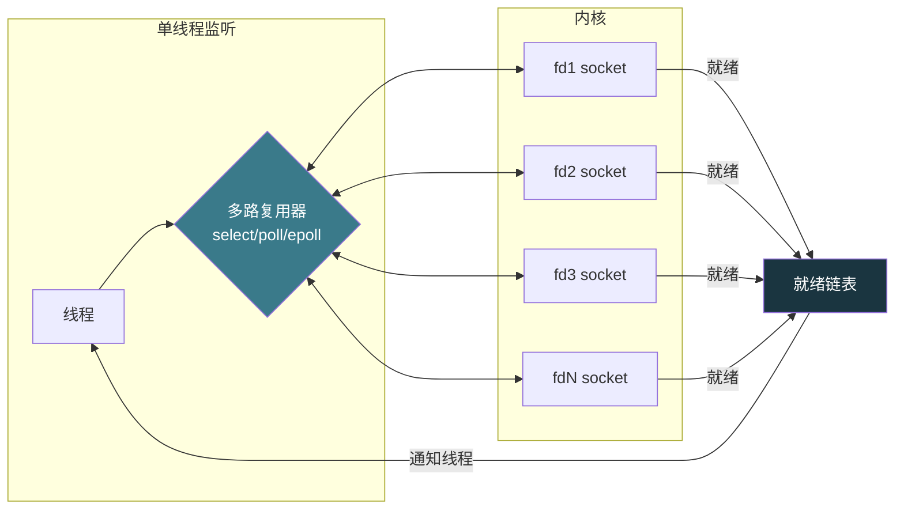
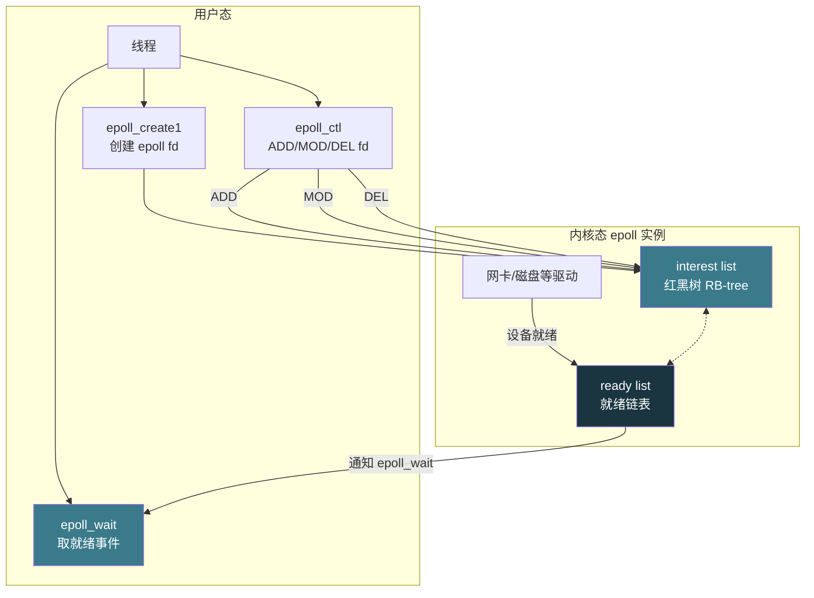

# 【金丹·75】I/O 多路复用：select、poll 和 epoll

> 码农修仙传 · 金丹期 · 第75篇
> 我是玄芯散人，带你从炼气修到大乘。

---

## 境界标识

```
╔══════════════════════════════════╗
║     金丹期 · 第75篇              ║
║     I/O 多路复用                  ║
║     select / poll / epoll        ║
║     三种监听机制的演进              ║
║     预计阅读：25分钟              ║
╚══════════════════════════════════╝
```

---

## 修仙引入

上一篇 074 把中断下半部收掉了。修真界里还有一类活没解决：一个金丹修士想同时盯多个传送阵（socket），看哪个先有信（数据）进来。最朴素的做法是开多个弟子（线程）一人盯一个传送阵，但传送阵一多弟子就不够用，调度也乱。

修真界真正的高手不需要这么多弟子。他只派一位「监天弟子」，把神识铺开挂到几十个、上百个传送阵上，传送阵一有动静神识立刻知道。系统调用 `select`、`poll`、`epoll` 就是这位监天弟子修的三种功法。这一篇把这三种功法拆开看，从最早只能挂 1024 个传送阵的简陋版，发展到能挂十万个还能 O(1) 查就绪的现代版，看看 Linux 内核怎么把监天弟子的本事一点点拔高。

---

## 硬核主体

### 为什么需要 I/O 多路复用

修真界里弟子是稀缺资源，每位弟子都得开洞府，发灵石，再养阵法，三样缺一不可。开一万个弟子盯一万个传送阵，洞府和灵石就把宗门吃垮了，调度弟子上 CPU 也让天庭调度器疲于奔命。这种「弟子不够但传送阵多」的情形，修真界管它叫「C10K 问题」，单个服务器要同时处理一万个连接。

修真比喻：宗门山门外有一百个传送阵，每个传送阵都可能随时有信。怎么办？派一百位弟子一人盯一个？弟子洞府和灵石开销太大。改成派一位弟子挨个传送阵跑过去问「有没有信」？弟子跑断腿还大多白跑（信没到的传送阵占绝大多数）。

正确做法：把传送阵登记到监天弟子的玉牌上，弟子坐定不动，玉牌上有传送阵响铃（中断），弟子再起身去处理。这就是 I/O 多路复用的思路。一个线程（一位弟子）监听多个文件描述符（传送阵），内核在 fd 就绪时主动通知，应用再去读/写数据。

修真比喻：监天弟子的玉牌就是内核维护的「就绪链表」。传送阵有信，内核把传送阵编号挂到就绪链表上，监天弟子的神识一扫就知道该处理谁。`select`、`poll`、`epoll` 三种功法，是监天弟子在不同时期打磨玉牌的过程。

修真比喻对应到 C10K 场景：1999 年前后互联网服务兴起，单机要处理几千上万并发连接。Dan Kegel 把这种情形总结成「C10K 问题」。`select` 和 `poll` 是上一代功法，最多挂几千个 fd，开销还大；`epoll` 是 2002 年 Linux 2.5.45 引入的新功法，专门为这种情形而生。



修真比喻：监天弟子（线程 A）坐在蒲团上，面前摆着一面玉牌（多路复用器）。玉牌上挂着几十枚传送阵铭牌（fd1 到 fdN）。传送阵一来信，内核（天道）就把对应铭牌点亮（就绪）。监天弟子的神识扫一眼就知道哪些传送阵有信，再起身去取信（read）和回信（write）。

修真比喻对应到系统调用：监天弟子的玉牌由内核维护，多路复用器（B）暴露三个操作给用户：

- 注册：告诉内核我要监听哪些 fd
- 等待：阻塞直到至少一个 fd 就绪
- 取结果：拿到就绪的 fd 列表

`select`、`poll`、`epoll` 三种功法，是这三种操作的不同实现。三种功法在内核侧的取舍决定了性能等级。

修真比喻：监天弟子的玉牌对应修真界监听术的几道关。监听集合怎么存放，阻塞时怎么扫，结果怎么传给弟子，三道关卡的取舍决定功法等级。

### select：第一代监天弟子（fd_set 轮询）

`select` 是 POSIX 标准定义的最古老的多路复用功法。1983 年前后随 BSD 4.2 引入 Unix，后来所有 Unix 系统都有。

修真比喻：监天弟子的玉牌是一块固定的玉片，玉片上只能刻 1024 个格子。每个格子对应一个传送阵编号。格子点亮了表示传送阵有信。

`fd_set` 是这套机制的数据结构。它是一个 1024 位的位图，每一位对应一个文件描述符（fd 0 到 fd 1023）。位图大小写死在 `FD_SETSIZE` 宏里，默认值就是 1024。

```c
// /usr/include/sys/select.h（glibc）
#ifndef FD_SETSIZE
#define FD_SETSIZE  1024   // 监听 fd 上限 1024
#endif

// fd_set 本质是个 1024 位的位图
typedef struct {
    unsigned long fds_bits[FD_SETSIZE / (8 * sizeof(unsigned long))];
} fd_set;

// 操作宏
FD_ZERO(&set);           // 清空位图
FD_SET(fd, &set);       // 把 fd 对应的位置 1
FD_CLR(fd, &set);       // 把 fd 对应的位置 0
FD_ISSET(fd, &set);     // 测试 fd 对应的位是否为 1
```

修真比喻：玉片只能刻 1024 个格子，传送阵超过 1024 个就挂不下了。这条限制是 `select` 的命门，修真界管它叫「1024 诅咒」。

`select` 系统调用的签名：

```c
int select(int nfds, fd_set *readfds, fd_set *writefds,
           fd_set *exceptfds, struct timeval *timeout);
// 返回值：>0 就绪 fd 数，0 超时，-1 出错
```

`nfds` 是三个位图中最大的 fd 值加 1（不是 fd 总数），内核只需要扫到位图中最高的位就停。

修真比喻：监天弟子每次坐到蒲团前都要先「重新挂铭牌」。玉牌上原来点亮的格子会被清空。弟子得把要监听的传送阵一个一个重新点亮（`FD_SET`），再把玉牌交给天道（内核）扫描。

修真比喻对应到 `select` 的开销，每次都要重建 fd_set 是一笔。每次要把整张位图（128 字节）拷贝到内核态又是一笔，几千个连接都走这一遍就是不小开销。最致命的是内核侧，哪怕只有一个 fd 就绪也要扫一遍 nfds 范围内的所有 fd，复杂度是 O(n)。

修真比喻：监天弟子把玉牌递给天道，天道扫描所有格子（不管点没点亮），扫描完把没点亮的格子擦掉，把玉牌还回来。弟子再把玉牌重新挂上要监听的格子，递给天道扫一遍。周而复始，每次都要走这个流程。

修真比喻对应到代码示例：用 `select` 监听标准输入（fd 0）有数据可读。

```c
#include <sys/select.h>
#include <stdio.h>
#include <unistd.h>

int main(void) {
    fd_set readfds;
    FD_ZERO(&readfds);
    FD_SET(0, &readfds);   // 监听 stdin（fd 0）

    struct timeval tv = { .tv_sec = 5, .tv_usec = 0 };

    // 阻塞等，最多等 5 秒
    int ret = select(1, &readfds, NULL, NULL, &tv);
    if (ret == -1) {
        perror("select");
        return 1;
    } else if (ret == 0) {
        printf("timeout\n");
    } else {
        if (FD_ISSET(0, &readfds))
            printf("stdin readable\n");
    }
    return 0;
}
```

修真比喻：这个示例里监天弟子只挂了一个传送阵（stdin），所以 1024 限制和遍历开销都不明显。修真界里真正吃亏的是同时挂几百上千个传送阵。

修真比喻对应到 `select` 的总结：易移植（POSIX 标准所有 Unix 都有）、接口简单。缺点是 1024 上限（编译期固定，要改就得重新编译 glibc）。每次调用都要重建和拷贝 fd_set，内核还要做 O(n) 扫描。1999 年面对 C10K 问题，`select` 撑不住了。

### poll：链表替代位图，没解决根问题

`poll` 是 1997 年前后 Linux 引入的改动版。它去掉了 1024 限制，改用链表管理 fd 数组。

修真比喻：监天弟子嫌玉片格子不够，跑到炼器阁换了一块新玉片。新玉片能挂的格子数不写死，传送阵多了就再买一块大的拼上。这就是 `poll` 的改动。

`pollfd` 是 `poll` 引入的新数据结构，每个元素描述一个 fd：

```c
// /usr/include/poll.h
struct pollfd {
    int   fd;         // 要监听的 fd
    short events;     // 关心的事件（POLLIN/POLLOUT/POLLERR...）
    short revents;    // 内核回填：实际发生的事件
};

int poll(struct pollfd *fds, nfds_t nfds, int timeout);
```

修真比喻：每个传送阵一张小铭牌，铭牌正面写要监听什么事件（events），背面写实际发生的事件（revents）。铭牌挂在一根长链子上（数组），链子有多长（nfds）由弟子自己定。

修真比喻对应到 `poll` 的改动点：

1. 去掉了 1024 限制：`nfds_t` 通常是 `unsigned long`，能挂几万个 fd。改成链表（数组）后想挂多少挂多少。
2. 不用每次重建监听集合：用户态维护一个 `pollfd` 数组，每次调用传进去即可。但内核返回后只回写 `revents`，`events` 和 `fd` 字段不改动，所以下次调用可以直接复用。
3. 细粒度事件：除了 read/write/except 三个集合，还支持 `POLLPRI`、`POLLHUP`、`POLLERR`、`POLLNVAL` 等更多事件类型。

修真比喻：监天弟子把长链子递给天道，天道沿链子扫一遍，对每张铭牌只在背面写「有信」或「无信」。弟子拿回链子，对着背面写有信的铭牌去取信。

修真比喻对应到 `poll` 的代码示例：监听标准输入。

```c
#include <poll.h>
#include <stdio.h>
#include <unistd.h>

int main(void) {
    struct pollfd fds[1];
    fds[0].fd = 0;             // stdin
    fds[0].events = POLLIN;    // 关心可读事件

    int ret = poll(fds, 1, 5000);  // 等 5000 ms
    if (ret > 0) {
        if (fds[0].revents & POLLIN)
            printf("stdin readable\n");
    }
    return 0;
}
```

修真比喻：看起来跟 `select` 差不多，但铭牌不用每次重挂，可以一直挂着等下一次有信。

修真比喻对应到 `poll` 的代价：内核还是要遍历整个 `fds` 数组，逐个调用 `poll` 回调查就绪状态。就算一万个 fd 里只有一个就绪，内核也得扫一万遍。这是 O(n)。修真界管这种情形叫「遍历之苦」。

修真比喻：链子上挂了一万张铭牌，哪怕只有一张有信，天道都得把一万张全扫一遍才告诉弟子。弟子哪受得了。

修真比喻对应到 `poll` 跟 `select` 的对比：

| 比较项 | `select` | `poll` |
|------|---------|--------|
| 数据结构 | `fd_set` 位图（1024 位） | `pollfd` 数组 |
| fd 上限 | `FD_SETSIZE` = 1024 | `nfds_t` 范围内随便 |
| 内核遍历 | O(n) | O(n) |
| 用户态拷贝 | 整张位图（128 字节） | 整个 `pollfd` 数组（8 字节 × n） |
| 跨平台 | POSIX 标准 | POSIX 标准但 Linux 扩展 |

修真比喻：两种功法的底层都是「遍历」，修真界都知道遍历是笨办法。监天弟子也知道自己扫一万遍太慢，但当时没有更好的数据结构。

修真比喻对应到 `epoll`：2002 年，Linus 在 Linux 2.5.45 里引入 `epoll`。这是为 C10K 问题量身定做的功法：内核不再遍历，红黑树管监听集合，就绪链表直接告诉监天弟子哪个 fd 有信。

### epoll：第三代监天弟子（红黑树 + 就绪链表）

`epoll` 是 Linux 专属的现代多路复用功法，2002 年 10 月随 Linux 2.5.45 引入。它有三个系统调用：`epoll_create1`、`epoll_ctl`、`epoll_wait`。

修真比喻：监天弟子跑到炼器阁重金打造了一块新玉牌。玉牌分两部分：左半边是「铭牌柜」（红黑树），按传送阵编号排序，监听的传送阵都登记在这里，编号一查就着；右半边是「回信玉盒」（就绪链表），天道直接把有信的传送阵编号塞进玉盒。弟子坐定时只看玉盒，不用扫铭牌柜。



修真比喻：监天弟子三步操作：

1. 打造玉牌（`epoll_create1`）：去炼器阁做一块新玉牌，玉牌本身也有编号（epoll fd）。
2. 登记传送阵（`epoll_ctl`）：把要监听的传送阵编号挂在铭牌柜上（红黑树），告诉天道关心什么事件（POLLIN/POLLOUT...）。
3. 坐等回信（`epoll_wait`）：坐在蒲团上等天道把有信的传送阵编号塞进回信玉盒，一次能拿走一批。

修真比喻对应到三个系统调用的签名：

```c
#include <sys/epoll.h>

// 1. 创建 epoll 实例，返回 epoll fd
int epoll_create1(int flags);   // flags 填 0 或 EPOLL_CLOEXEC
// 老版本：int epoll_create(int size);  // 2.6.27 之后被标记 deprecated

// 2. 控制监听集合
int epoll_ctl(int epfd, int op, int fd, struct epoll_event *event);
// op: EPOLL_CTL_ADD / EPOLL_CTL_MOD / EPOLL_CTL_DEL

// 3. 等待事件
int epoll_wait(int epfd, struct epoll_event *events,
               int maxevents, int timeout);
// 返回值：就绪 fd 数
```

`epoll_event` 结构体：

```c
struct epoll_event {
    uint32_t     events;   // 关心的事件：EPOLLIN/EPOLLOUT/EPOLLET/EPOLLONESHOT...
    epoll_data_t data;     // 用户自定义数据，通常存 fd
};

typedef union epoll_data_t {
    void     *ptr;
    int       fd;
    uint32_t  u32;
    uint64_t  u64;
} epoll_data_t;
```

修真比喻对应到 `epoll` 的两个数据结构：

- 兴趣列表（interest list）：红黑树（RB-tree），按 fd 排序。增删改是 O(log n)。
- 就绪列表（ready list）：双向链表，设备就绪时内核直接把 fd 挂上去。`epoll_wait` 把链表拷到用户态后清空。

修真比喻：铭牌柜（红黑树）按传送阵编号排好，新加铭牌是按编号二分查找位置（O(log n)）。天道接到信后不用遍历铭牌柜找对应铭牌，直接把传送阵编号挂到玉盒（就绪链表）里就行。弟子起身只扫玉盒，看玉盒里挂了几张铭牌（几个 fd 就绪）。这种设计是 O(1)。

修真比喻对应到 `epoll` 为什么 O(1)：注册 fd 是 O(log n)（红黑树插入），但事件就绪时内核直接挂就绪链表，应用取就绪事件也是 O(就绪数)。最坏情况是某个时间点有 n 个 fd 同时就绪，总开销是 O(log n) + O(n)，但平均摊销到每个 fd 上是 O(1)。

修真比喻：监天弟子的玉牌比 `select` 的位图玉片和 `poll` 的链子铭牌贵得多。但玉牌贵有贵的道理：

- 不用每次拷贝整张监听集合：内核记着铭牌柜，新加监听只发 `EPOLL_CTL_ADD`，不用每次重挂。
- 不用每次遍历所有 fd：天道只把有信的传送阵塞玉盒，弟子只扫玉盒。
- 能挂百万级 fd：铭牌柜（红黑树）理论上限是 `RLIMIT_NOFILE`（默认通常 1024，但可以改到几十万）。

修真比喻对应到代码示例：用 `epoll` 写一个简单的 TCP echo 服务器。

```c
#include <sys/epoll.h>
#include <sys/socket.h>
#include <netinet/in.h>
#include <unistd.h>
#include <stdio.h>
#include <string.h>
#include <errno.h>

#define MAX_EVENTS 64
#define PORT 8080

int main(void) {
    int listen_sock, epollfd, nfds;
    struct epoll_event ev, events[MAX_EVENTS];

    // 1. 创建监听 socket
    listen_sock = socket(AF_INET, SOCK_STREAM, 0);
    struct sockaddr_in addr = {
        .sin_family = AF_INET,
        .sin_port = htons(PORT),
        .sin_addr.s_addr = INADDR_ANY
    };
    bind(listen_sock, (struct sockaddr *)&addr, sizeof(addr));
    listen(listen_sock, 10);

    // 2. 创建 epoll 实例
    epollfd = epoll_create1(0);
    if (epollfd == -1) { perror("epoll_create1"); return 1; }

    // 3. 把监听 socket 加入兴趣列表，关心可读事件（连接到来）
    ev.events = EPOLLIN;
    ev.data.fd = listen_sock;
    epoll_ctl(epollfd, EPOLL_CTL_ADD, listen_sock, &ev);

    // 4. 事件循环
    for (;;) {
        nfds = epoll_wait(epollfd, events, MAX_EVENTS, -1);  // 阻塞等
        for (int n = 0; n < nfds; n++) {
            if (events[n].data.fd == listen_sock) {
                // 监听 socket 可读：新连接
                int conn_sock = accept(listen_sock, NULL, NULL);
                ev.events = EPOLLIN;       // 默认 LT 模式
                ev.data.fd = conn_sock;
                epoll_ctl(epollfd, EPOLL_CTL_ADD, conn_sock, &ev);
            } else {
                // 连接 socket 可读：客户端发数据
                char buf[1024];
                ssize_t n = read(events[n].data.fd, buf, sizeof(buf));
                if (n <= 0) {
                    // 客户端关闭或出错
                    close(events[n].data.fd);
                    epoll_ctl(epollfd, EPOLL_CTL_DEL, events[n].data.fd, NULL);
                } else {
                    // echo 回写
                    write(events[n].data.fd, buf, n);
                }
            }
        }
    }
    return 0;
}
```

修真比喻：监天弟子把监听 socket（守门弟子）和所有连接 socket（接待弟子）都登记到铭牌柜。守门弟子一可读（新人来拜山门），弟子就 `accept` 接入并挂上铭牌；接待弟子一可读（客人说话），弟子就 `read` 并 `write` 回声。

修真比喻对应到 `epoll` 的总结：三系统调用（`epoll_create1` + `epoll_ctl` + `epoll_wait`）分工清晰；红黑树 + 就绪链表让内核不用遍历所有 fd；能扛百万级连接。

修真比喻：但 `epoll` 还有两个隐藏设定跟用法相关：监听模式 LT 还是 ET。

### LT vs ET：玉牌的两种「回信方式」

`epoll` 默认是 LT（level-triggered，电平触发）。修真界用它处理大多数情形都够用。

修真比喻：监天弟子的玉牌有两种回信方式：

- LT 模式（默认）：天道检测到传送阵有信（电平高），就往玉盒塞编号。弟子取走后，传送阵里还有信没读（电平还高），天道下次还塞。这就是 LT，每次「有信就通知」。
- ET 模式：天道只在信从「无」变成「有」那一瞬间（边沿）塞编号。弟子取走后，传送阵里还有信没读，天道也不会再塞，必须等下次新信到来。这就是 ET，只在「状态变化时通知」。

修真比喻对应到 `epoll` 的事件标志：

```c
struct epoll_event ev;
// LT 模式（默认）
ev.events = EPOLLIN;             // 可读，电平触发
// ET 模式
ev.events = EPOLLIN | EPOLLET;   // 可读，边沿触发
```

修真比喻对应到 LT 模式的例子：管道里有 4 KB 数据，应用只 `read` 了 2 KB。

```c
// LT：下次 epoll_wait 立刻返回，通知还有 2 KB 没读
// ET：下次 epoll_wait 阻塞，直到再有新数据写入管道才返回
```

修真比喻对应到 ET 模式的硬约束（man page 明确说明）：

1. fd 必须设成非阻塞（`O_NONBLOCK`）：ET 模式下应用必须一次读完/写完，否则漏掉的事件再也不会通知。
2. read/write 必须循环到 `EAGAIN`：非阻塞 IO 的标志是返回 `EAGAIN` 表示「这次没数据了，下次再试」。

修真比喻对应到 ET 模式的代码片段：

```c
// ET 模式读取循环
ssize_t read_et(int fd, char *buf, size_t len) {
    ssize_t total = 0;
    ssize_t n;
    while ((n = read(fd, buf + total, len - total)) > 0) {
        total += n;
    }
    if (n == -1 && errno == EAGAIN)
        return total;  // 读完了
    return n;  // 出错或 EOF
}
```

修真比喻对应到 LT vs ET 的对比：

| 比较项 | LT（电平触发） | ET（边沿触发） |
|------|---------------|---------------|
| 触发时机 | fd 有事件就一直触发 | 仅在事件状态变化时触发 |
| 数据没读完 | 下次 `epoll_wait` 还会通知 | 不会再通知 |
| fd 模式 | 阻塞非阻塞都行 | 必须非阻塞 |
| 编程复杂度 | 简单 | 复杂，要循环到 `EAGAIN` |
| 适用场景 | 大多数场景 | 高吞吐、低事件数（如 Redis、Nginx） |

修真比喻：LT 像守门人每次开门都喊「有人进来」；ET 像守门人只在门口第一次有人经过时喊一声，之后门里还有人他也不喊。修真界大多数情况用 LT 即可，高吞吐场景用 ET 能减少通知次数。

修真比喻对应到补充的 `EPOLLONESHOT` 和 `EPOLLEXCLUSIVE`：

- `EPOLLONESHOT`（Linux 2.6.2 起）：一次事件只通知一次，处理完后必须用 `EPOLL_CTL_MOD` 重新激活。修真比喻：监天弟子只取一次玉盒里的铭牌，取走后天道就把这张铭牌摘下来，要再听必须重新挂。
- `EPOLLEXCLUSIVE`（Linux 4.5 起）：多个线程共享一个 epoll fd 时防止「惊群」（多个线程同时被通知但只有一个能拿到事件）。修真比喻：天道只喊一个监天弟子，不所有弟子都喊。

修真比喻：至此三种功法都讲完了。但修真界弟子修炼时不能只挑顺手的用，还得知道什么时候用哪个。

### 三种功法对比

修真比喻：修真界三种监天功法对照表。

| 比较项 | `select` | `poll` | `epoll` |
|------|---------|--------|---------|
| 数据结构 | fd_set 位图 | pollfd 数组 | 红黑树 + 就绪链表 |
| fd 上限 | 1024 | 限制宽松 | 限制宽松 |
| 内核复杂度 | O(n) | O(n) | O(1) |
| 每次拷贝 | 整张位图 | 整个数组 | 只传事件 |
| 跨平台 | POSIX 标准 | POSIX 标准 | Linux 专属 |
| 触发模式 | LT | LT | LT（默认）/ ET |
| 适用场景 | 跨平台小规模 | 历史过渡 | Linux 高并发 |

修真比喻：修真界最终推荐：如果只在 Linux 上跑，优先用 `epoll`。需要跨 Unix 兼容，用 `select` 或 `poll`。`select` 的 1024 限制让大多数情形都被排除，`poll` 性能又不够。Redis 与 Nginx 这类高并发程序都用 `epoll`（macOS 上 `epoll` 不可用，对应 `kqueue`）。

修真比喻：监天弟子的三种功法，对应修真界监听传送阵的三种境界。`select` 是入门功法，简单易学但格子只有 1024 个；`poll` 是中级功法，链子能挂很多但每次都得扫一遍；`epoll` 是高级功法，铭牌柜加玉盒，监天弟子只扫玉盒，效率最高。下一篇进入 CPU 缓存，看金丹期修士灵识运转跟缓存命中率的关系。

---

## 修仙术语对照表

| 修仙术语 | 技术现实 | 本篇位置 |
|---------|---------|---------|
| C10K 问题 | 单机处理一万并发连接 | 引入 |
| 监天弟子 | 单线程做多路复用 | 引入 |
| 传送阵铭牌 | fd（文件描述符） | select/poll/epoll |
| 玉片 1024 格 | fd_set 位图，FD_SETSIZE=1024 | select |
| 重挂铭牌 | 每次调用重建 fd_set | select |
| 链子铭牌 | pollfd 数组 | poll |
| 铭牌柜（红黑树） | interest list | epoll |
| 回信玉盒（就绪链表） | ready list | epoll |
| 打造玉牌 | `epoll_create1` | epoll |
| 登记传送阵 | `epoll_ctl ADD/MOD/DEL` | epoll |
| 坐等回信 | `epoll_wait` | epoll |
| 电平触发 | LT 模式（默认） | LT/ET |
| 边沿触发 | ET 模式（EPOLLET） | LT/ET |
| 状态变化通知 | ET 只在事件状态变化时通知 | LT/ET |
| 循环读到 EAGAIN | ET 模式必须配合非阻塞 IO | LT/ET |
| 只取一次玉盒 | EPOLLONESHOT | LT/ET |
| 不喊所有弟子 | EPOLLEXCLUSIVE 防惊群 | LT/ET |

---

## 进阶条件

看完这一篇到能向别人讲清「`epoll` 为什么比 `select`/`poll` 快」，差这几条：

- [ ] 能讲清为什么需要 I/O 多路复用（C10K 问题：单机处理一万连接）
- [ ] 能讲清 `select` 的 1024 上限（`FD_SETSIZE` 宏、位图结构）
- [ ] 能讲清 `select` 的两个开销（每次拷贝 fd_set + 内核遍历所有 nfds）
- [ ] 能讲清 `poll` 改用链表解决了 1024 限制但没解决 O(n) 遍历
- [ ] 能讲清 `epoll` 三个系统调用的分工（`epoll_create1` + `epoll_ctl` + `epoll_wait`）
- [ ] 能讲清 `epoll` 为什么 O(1)（红黑树管监听集合 + 就绪链表直接通知）
- [ ] 能讲清 LT 和 ET 的区别（LT 是电平触发，ET 是边沿触发）
- [ ] 能说出 ET 模式的两条硬约束（非阻塞 fd + 循环读到 EAGAIN）
- [ ] 能读懂 epoll echo 服务器代码（能跟到三个 epoll 调用与对应逻辑）

> 最后一条是金丹期对「Linux I/O 多路复用」理解的「分水岭」。能在面试里讲清 `select`/`poll`/`epoll` 的演进和 `epoll` O(1) 的原理，C10K 这一关就过了。

---

## 下期预告 + 互动

> 下一篇：【金丹·76】CPU 缓存三层塔：为什么改个字段顺序性能差 5 倍

> 这一篇把 I/O 多路复用讲完了。但修真界弟子处理完信之后还有一道坎：灵识（数据）要经过 L1/L2/L3 三层缓存塔才能搬到寄存器，搬得对就能一念千里，搬得错就一步一卡。下一篇进入缓存子系统，看缓存怎么分层，为什么改字段顺序能让性能差 5 倍。

现在问你：

> 🔥 你写服务端代码用过 `select` 或 `poll` 吗？回忆一下：当时 fd 数大概多少？有没有碰到 1024 上限或者遍历慢的问题？

> ⚙️ 你调过高并发服务吗？碰到过「惊群」（多个线程/进程同时被通知但只有一个能处理事件）吗？知道 Linux 4.5 加的 `EPOLLEXCLUSIVE` 是为这个情形设计的吗？

> 评论区聊聊你跟多路复用打过交道的事。

> 我是玄芯散人，带你从炼气修到大乘。

---

*本文是「码农修仙传」系列第75篇。系列导航见 [xren.ren](https://xren.ren)*