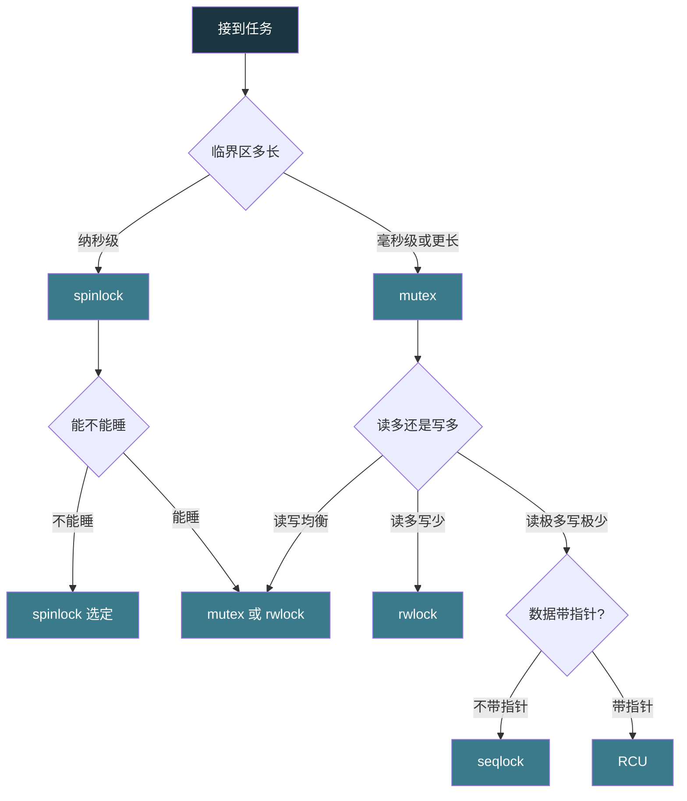

# 【金丹·77】锁的家族：自旋锁、互斥锁、读写锁、顺序锁、RCU

> 码农修仙传 · 金丹期 · 第77篇
> 我是玄芯散人，带你从炼气修到大乘。

---

## 境界标识

```
╔══════════════════════════════════╗
║     金丹期 · 第77篇              ║
║     锁的家族                      ║
║     自旋/互斥/读写/顺序/RCU      ║
║     适用场景 + 加锁代价对比        ║
║     预计阅读：28分钟              ║
╚══════════════════════════════════╝
```

---

## 修仙引入

上一篇 073 把戒律堂的几件兵器拆开看了——互斥锁，自旋锁，CAS，内存屏障，`volatile`。那一篇讲的是兵器本身的原理。这一篇换一个问题：戒律堂兵器铺里摆了七八件兵器，弟子接到任务时该挑哪件？

修真界里有些弟子守的是短活儿的门，弟子进出只换把钥匙的功夫（纳秒级）。有些弟子守的是长活儿的门，弟子进去读一卷功法要一炷香（毫秒级）。还有些弟子守的是「读的人多，写的人少」的门：典籍阁里上百弟子同时翻同一本典籍（只读），但偶尔需要修订典籍（写）。还有些弟子守的是「读的人超级多，写的人极少」的门：典籍阁里一万弟子同时翻一本时间戳（只读），只有一位长老每日初一刻改一次时间（写）。

戒律堂兵器铺挂着五面幡，对应修真界里四种常见的门型（短门与长门各算一种，加上读多写少门和读极多写极少门两种），五件兵器各有所长。挑错了，要么白烧 CPU 自旋死等，要么弟子堵在门口饿死，要么写者永远抢不到锁。挑对了，戒律堂和弟子两不误。

修真比喻：戒律堂兵器铺挂着五面幡，每面幡下贴一行小字，写明这件兵器在什么情形下能用。这一篇把这五面幡全拆开看，再列一张加锁代价对比表，最后给一份选兵器的流程图。

---

## 硬核主体

### 锁的设计目标

锁（lock）这东西看起来简单，不就是「让一段代码同时只进一人」嘛。可修真界把它做出了花，原因藏在两个互相矛盾的目标里：

目标一，互斥（mutual exclusion）。同一时刻只能有一位弟子在密室里，否则两个弟子同时改一份账本，账就乱了。互斥是锁的本职工作。

目标二，最小开销（minimum overhead）。互斥做到了还不够，还要快。弟子拿令牌进门，出来时再还令牌，每一步都耗时间。守门人要登记，要查玉牌，要念封字诀开字诀，每一步都耗 CPU。锁是程序里最热的热路径，每条指令都可能被成千上万次调用。

互斥和最小开销经常打架。强一点的互斥（让所有竞争者按序排队）就要记排队簿，开销就大。弱一点的互斥（让所有竞争者一拥而上抢令牌）开销小但可能某些弟子永远轮不上。锁家族的五件兵器，就是在互斥和开销之间取的折中。

修真比喻：戒律堂接到任务，先看这扇门要守多严，再看这扇门一天要走多少人。守得严、走得多，门上得多挂几道封印；守得松、走人少，一根红绳就够。把这两个角度画出来，五件兵器各占一个格子。

修真比喻对应到现代操作系统：互斥是基本需求，开销是实际工程的取舍。Linux 内核一个文件被成百上千线程访问是常态，每条加锁解锁指令都可能被一秒钟调用几十亿次。这就是为什么会有这么多种锁，每一种都针对某种特定的开销模式做调整。

### 自旋锁 spinlock：短活儿专用

自旋锁（spinlock）上一篇 073 讲过原理，这里只补加锁代价。

规矩是：弟子进密室前拽红绳抢令牌。抢到就进，没抢到就在门口转圈（自旋）盯着红绳那端，不睡觉。短活儿适合自旋锁是因为转圈的 CPU 浪费小，弟子转十几圈（纳秒级）就能进密室。

```c
// Linux 内核自旋锁示例
#include <linux/spinlock.h>

spinlock_t my_lock;
int shared_counter = 0;

void increment(void) {
    spin_lock(&my_lock);
    shared_counter++;
    spin_unlock(&my_lock);
}
```

加锁代价一项一项看：

CPU 占用上，抢锁失败方原地转圈，CPU 跑满（一个核心 100% 在做空循环）。N 个线程竞争，就有 N-1 个核心在烧电。内存占用上，只有锁状态一个字段（4 或 8 字节）。能否睡眠这一条，不能。Linux 内核里自旋锁专门用在中断上下文这种不能睡的地方。公平性上，原版自旋锁不保证。Wikipedia 确认 Linux 2.6.25（2008 年）起在内核部分场景用 ticket spinlock，强制 FIFO。临界区长度上，适合纳秒级到几十纳秒。临界区一旦超过微秒级，自旋的 CPU 浪费就超过上下文切换的开销。

致命禁忌：不能在用户态进程间随便用自旋锁。一个线程拿了自旋锁还没放，被操作系统切走（时间片到了），另一个线程在自旋就白白烧 CPU；如果只有一颗 CPU，整个系统死锁。

修真比喻：自旋幡下挂的小字是「守短门专用」。门后活儿超过一炷香（约一秒），守门弟子转圈转得腿软都比让轮值弟子去偏房睡觉更烧灵石。这扇门是「红绳 + 短活儿」组合。

### 互斥锁 mutex：长活儿专用

互斥锁（pthread mutex）上一篇 073 讲过完整原理和 futex 实现，这一篇只补加锁代价，代码引用 073 不重复贴。

加锁代价一项一项看：

CPU 占用上，抢锁失败方进内核阻塞，不占 CPU。守门人只在弟子进出时记一笔，平时不用盯。内存占用上，锁结构本身几十字节，加上内核调度队列的开销。能否睡眠，可以。线程可以放心睡下去。公平性上，glibc 默认 mutex 不保证严格 FIFO，但不会出现某些线程永远拿不到锁。临界区长度上，毫秒级以上都行。文件读写，数据库事务，socket 收发，这些地方都用 mutex。

互斥锁的代价主要在进出内核的开销。一次进内核出内核几微秒（具体看内核版本和硬件）。glibc 的 `PTHREAD_MUTEX_ADAPTIVE_NP` 在用户态先自旋几次（adaptive mutex），拿不到才进内核。

修真比喻：互斥幡下挂的小字是「守长门专用」。门后活儿超过一炷香，让守门弟子转圈看红绳太亏，不如让等的人去偏房睡觉。守门人只在他进出时登记，平时能歇着。这扇门是「令牌 + 偏房 + 长活儿」组合。

### 读写锁 rwlock：读多写少专用

读写锁（readers-writer lock）解决一个新问题：典籍阁里有 100 位弟子同时翻同一本典籍（只读），偶尔需要一位长老修订典籍（写）。如果用普通 mutex，100 位弟子只能排队一位位进，效率太低。读写锁让「读」可以并发，「写」必须独占。

规矩是：典籍阁门口守门人手里有一块令牌牌，牌面写「读」或「写」。多位弟子拿着「读」令牌能同时进；只有一位弟子拿着「写」令牌能进，进时其它读令牌全部暂停发放。

```c
#include "pthread.h"

pthread_rwlock_t rwlock = PTHREAD_RWLOCK_INITIALIZER;
int shared_data = 0;

void reader(void) {
    pthread_rwlock_rdlock(&rwlock);
    int local = shared_data;
    pthread_rwlock_unlock(&rwlock);
}

void writer(void) {
    pthread_rwlock_wrlock(&rwlock);
    shared_data++;
    pthread_rwlock_unlock(&rwlock);
}
```

加锁代价一项一项看：

CPU 占用上，读并发时占用 N 个核心（每位读弟子一核心）；写时只占 1 个核心，其它读暂停。内存占用上，比 mutex 多一个读计数器字段。能否睡眠，可以。读写锁内部走 mutex + 条件变量实现，可以阻塞。公平性上分三种策略。一种是读优先，一种是写优先，还有一种未指定。Wikipedia 直接点出读优先会导致写饥饿，写优先会导致读饥饿。POSIX 不规定具体策略，由实现选。临界区长度上，适合读多写少的常见情形。

写饥饿问题：读优先策略下，新来的读弟子不断插队，写弟子永远拿不到锁。修真是这么讲的，典籍阁里读弟子络绎不绝，每位读弟子进门都只要一瞬间就出。写弟子要修订一整卷典籍需要一炷香，可他刚要进守门人那边又来读弟子，守门人又放读弟子进，写弟子被堵在门口整炷香没动。

修真比喻：读写幡下挂的小字是「读多写少专用」。如果读弟子只有 1 位或写弟子比读弟子多，回普通 mutex。这扇门是「读并发 + 写独占 + 偏房」组合。

修真比喻落到底层：Linux 的 rwlock_t 默认实现是读优先。Java 的 `ReentrantReadWriteLock` 也是读优先（公平模式要单独开）。要避免写饥饿，要么用写优先版本（Linux 没原生，需要用 mutex + count 自己实现），要么用 Java 的 fair 模式。

### 顺序锁 seqlock：写极少但要快读专用

顺序锁（seqlock）是 Linux 内核 2.5.x 系列稳定下来的轻量级读写同步机制，最初由 Stephen Hemminger 提出，最早在 x86-64 的时间戳代码里用起来。Wikipedia 确认它专门为「读极多、写极少」的情形设计。

规矩是：典籍阁里长老修订典籍时给典籍编一个序号，编号从 1 开始递增，每次修订前+1，修订后+1。读弟子进门先看序号，读完出门再看一次。两次序号一致（且都为偶数），说明中间没被长老动过，数据可用。两次序号不一致（或者都是奇数，说明长老正在修订），读弟子就要重新读一遍。

```c
// Linux 内核 seqlock 示例（简化版）
#include <linux/seqlock.h>

seqlock_t seq_lock;
int time_stamp = 0;

void update_time(int new_val) {
    write_seqlock(&seq_lock);
    time_stamp = new_val;
    write_sequnlock(&seq_lock);
}

int read_time(void) {
    unsigned int seq;
    int val;
    do {
        seq = read_seqbegin(&seq_lock);
        val = time_stamp;
    } while (read_seqretry(&seq_lock, seq));
    return val;
}
```

加锁代价一项一项看：

CPU 占用上，读端几乎为零开销（两个原子读 + 对比），不阻塞任何读线程。内存占用上，锁结构只有序列号加一个自旋锁两个字段（8 字节）。能否睡眠上，读端可被抢占但不能自愿睡眠（要能重试），写端也不能睡眠（spinlock 持锁不能调度）。公平性上，写优先。Wikipedia 直接点出 seqlock 设计目标就是解决 rwlock 的写饥饿问题。临界区长度上，写端必须短到能在两次读序号之间完成。

修真比喻：顺序锁就是给典籍阁的修订加一道版本号。读弟子翻典籍时看版本号，翻完再看一次。版本没变，典籍可用。版本变了，重翻一遍。这种方式对读弟子零阻塞，写弟子永远抢到锁（写端持有 spinlock 不能调度，所以修订本身要短，几微秒内完成）。

修真比喻落到底层：Wikipedia 特别提醒，seqlock 不适合保护带指针的数据。指针指向的内存被释放又重新分配时，读弟子拿到的是已经失效的指针。这种情形要换 RCU。

顺序锁适合保护简单标量，比如时间戳或者计数器，这些数据「读极多写极少」。Linux 内核里 `jiffies`、`xtime`（墙上时间）和协议栈里的某些统计计数器都走 seqlock。

修真比喻：顺序幡下挂的小字是「写极少且数据不带指针」。这扇门是「版本号 + 写优先 + 读零阻塞」组合。典籍阁的钟表、藏经阁的索引牌都用这种门。

### RCU 读拷贝更新：读端零开销

RCU（Read-Copy-Update，读拷贝更新）是 Linux 内核的明星同步机制。Wikipedia 记录类似技术由 Kung 等人 1980 年代独立提出多次，McKenney 与 Slingwine 1995 年凭 DYNIX/ptx 实现拿到专利，Linux 社区 2002 年 10 月（2.5 内核）把它引入并发扬光大。Wikipedia 确认 RCU 是当读性能至关重要时使用的同步手段。

规矩是：典籍阁里的典籍换新版时，长老先抄一份副本，在副本上修订。修订完后挂出新副本，撤下旧副本。读弟子看到的一直是某一时刻的整体版本，不会看到「改到一半」的中间状态。

修真比喻拆解：

读端：进典籍阁借一本典籍。不拿锁，不做原子操作，也不阻塞。拿多久都没关系（不阻塞写）。

写端：先抄一份副本，然后在副本上修订。修订完后挂出新副本，撤下旧副本。等所有拿旧本的弟子都还了，再销毁旧本。

```c
// Linux 内核 RCU 简化示例
#include "rcupdate.h"

struct foo {
    int data;
    struct rcu_head rcu;
};
struct foo __rcu *g_foo;

void reader(void) {
    rcu_read_lock();
    struct foo *p = rcu_dereference(g_foo);
    int local = p->data;
    rcu_read_unlock();
}

void writer(struct foo *new_foo) {
    rcu_assign_pointer(g_foo, new_foo);
    synchronize_rcu();
    kfree(old_foo);
}
```

加锁代价一项一项看：

CPU 占用上，读端几乎为零（一个原子读加一个内存屏障），比 seqlock 还轻。Wikipedia 描述 RCU 是「所有读者像没有同步一样快」。内存占用上，写端要复制一份整体对象，对象大时占用翻倍。这是空间换时间。能否睡眠上，读端可被抢占但不能自愿睡眠（否则 grace period 无法结束）。写端 `synchronize_rcu()` 内部走内核等待，能睡。公平性上，写端要等所有在读临界区的线程退出（grace period，宽限期）。如果某位读弟子抱着旧本一炷香不放，写弟子就得等一炷香。临界区长度上，读端长度不限（这就是 RCU 比 seqlock 强的地方），写端要求严格走五步：拷贝副本，修改副本，再换指针，然后等旧读者退出，最后释放旧对象。

修真比喻：RCU 就像典籍阁的「版本并行制」。长老修订时抄副本，不动在读的典籍。副本修订完挂上去，读弟子下次借就借到新副本。旧副本要等所有拿它的弟子都还了才能销毁。这扇门适合读极多的情形，写要等所有读者读完才能动，读临界区长度不限。

修真比喻落到底层：Wikipedia 特别提到 RCU 适合链表、树、哈希表等带指针的共享数据结构。Linux 内核里 `list_for_each_entry_rcu` 遍历链表，路由表的查找，还有 `dentry`（目录项）缓存，这些都是 RCU 的常见用法。

修真比喻：RCU 幡下挂的小字是「读超级多，写要保证一致性，对象可拷贝」。这扇门是「读零开销 + 写拷副本 + 等宽限期」组合。Linux 内核里路由表，目录项缓存，模块列表都靠这种门。

### 加锁代价对比表

把五件兵器摆一起看：

| 兵器 | CPU 占用 | 内存开销 | 能否睡眠 | 公平性 | 适用情形 |
|------|---------|---------|---------|--------|---------|
| 自旋锁 spinlock | 抢锁失败方原地转圈 100% | 4 字节 | 不能 | 原版不保证（ticket 版 FIFO） | 临界区极短（纳秒级） |
| 互斥锁 mutex | 抢锁失败方阻塞让出 CPU | 几十字节 | 可以 | 一般 FIFO | 临界区较长（毫秒级） |
| 读写锁 rwlock | 读并发写独占 | 比 mutex 略大 | 可以 | 读优先/写优先/未指定 | 读多写少（10:1 以上） |
| 顺序锁 seqlock | 读端零阻塞，写端独占 | 8 字节 | 都不能（spinlock 持锁不能调度） | 写优先 | 读极多写极少（1000:1 以上）+ 简单数据 |
| RCU | 读端零开销，写端等宽限期 | 写时翻倍 | 读端不能，写端能 | 写要等所有读者退出 | 读极多写极少 + 指针/复杂结构 |

修真比喻：戒律堂兵器铺挂着五面幡。弟子接到任务，按四步问自己。

第一步，活儿多长？纳秒级选 spinlock，毫秒级选 mutex。第二步，读多还是写多？读多于写考虑 rwlock，读远多于写考虑 seqlock/RCU。第三步，数据带不带指针？带指针只能 rwlock 或 RCU。Wikipedia 直接点出 seqlock 不适合带指针数据。第四步，能不能睡？不能睡只能用 spinlock 或 seqlock/RCU 的读端。

修真比喻：选兵器不是看兵器多厉害，是看任务多复杂。短门用大锤是浪费，长门用小刀是自杀。



修真比喻对应到一张选兵器流程图：先问临界区长度，再问能不能睡，再问读写比例，再问数据带不带指针。四问过后，五面幡里就只剩一面合适。

修真比喻收尾：戒律堂兵器铺的精髓不是哪件最厉害，是哪件最合适。短门用大锤是浪费，长门用小刀是自杀，读门要用读幡，写极少的门用顺序幡或 RCU。每件兵器都对应修真界一种特定情形，挑对了四两拨千斤，挑错了事倍功半。

---

## 修仙术语对照表

| 修仙术语 | 技术现实 | 本篇位置 |
|---------|---------|---------|
| 兵器铺五面幡 | 五种锁 | 全篇 |
| 互斥+最小开销 | 锁设计的两个目标 | 锁的设计目标 |
| 短门 | 临界区极短（纳秒级） | 自旋锁 |
| 长门 | 临界区较长（毫秒级） | 互斥锁 |
| 读多写少 | 读写比例 10:1 以上 | 读写锁 |
| 读极多写极少 | 读写比例 1000:1 以上 | 顺序锁/RCU |
| 红绳抢令牌 | spinlock 的 test-and-set | 自旋锁 |
| 令牌 + 偏房 | mutex 的 futex 阻塞 | 互斥锁 |
| 读令牌并发 | rwlock 的读并发 | 读写锁 |
| 写令牌独占 | rwlock 的写独占 | 读写锁 |
| 写弟子饿死 | 写饥饿问题 | 读写锁 |
| 版本号比对 | seqlock 的序号校验 | 顺序锁 |
| 修订中读重试 | seqlock 的读 retry | 顺序锁 |
| 抄副本挂新本 | RCU 的 copy-update | RCU |
| 等旧本还完 | RCU 的 grace period | RCU |
| 旧本失效 | RCU 不能保护带指针数据 | RCU |

---

## 进阶条件

看完这一篇到能向别人讲清「线程同步的锁家族怎么挑」，差这几条：

- [ ] 能讲清锁设计的两个目标（互斥 + 最小开销）以及它们为何互相矛盾
- [ ] 能讲清自旋锁和互斥锁的代价差异（spinlock 烧 CPU 不睡，mutex 睡但进内核几微秒）
- [ ] 能讲清读写锁的「写饥饿」问题以及读优先/写优先的取舍
- [ ] 能讲清顺序锁 seqlock 的核心机制（版本号前后比对加写优先）和它的限制（不能保护带指针数据）
- [ ] 能讲清 RCU 的「拷贝-改-换指针-等宽限期」流程以及为何读端能零开销
- [ ] 能讲清 seqlock 和 RCU 的关键区别（seqlock 适合简单标量，RCU 适合带指针的复杂结构）
- [ ] 能讲清 mutex 内部「先自旋几次再进内核」的 adaptive mutex 改进
- [ ] 能讲清 Linux 内核哪些场景用了哪些锁（中断上下文走 spinlock；VFS 通用路径走 inode mutex；时间戳/jiffies 走 seqlock；路由表/dentry 走 RCU）

> 最后一条是金丹期对「锁家族」的分水岭。面试里被问「读极多写极少的场景用什么锁」，能直接说出「看数据带不带指针。不带指针用 seqlock，带指针用 RCU。两者的读端都几乎零开销，区别在写端是否需要拷贝副本」，这一关就过了。

---

## 下期预告 + 互动

> 上一篇 073 讲了锁的原理和原子兵器，这一篇 077 把锁的全家族摆开看了。可修真界里还有一件大事没解决：弟子们用了这么多锁，万一锁用错了就出大事。两个弟子互相等对方的令牌，谁都动不了。这就是死锁。下一篇 078 围绕死锁展开——四个必要条件怎么凑齐，怎么预防，怎么检测，怎么打破，全拆开讲。看完了，再有人问「我的程序卡住不动是不是死锁」，你能直接答出来。

现在问你：

> 🔍 在你的项目里搜一下用了哪些锁（grep `pthread_mutex_lock`、`spin_lock`、`rwlock`、`seqlock`、`rcu_read_lock`），看看实际项目里这五种锁各自用在哪里。算一下你项目里读写操作的比例，能不能把某些 rwlock 换成 seqlock 或 RCU？评论区聊聊你找到的锁类型分布。

> ⚙️ 写一段 RCU 风格的链表（参考 Linux 内核 `list_for_each_entry_rcu`），插入一个节点后用 `synchronize_rcu()` 等所有读者退出，再 `kfree` 旧节点。用 `perf stat` 跑一下，对比同样操作走 mutex 的版本。看 RCU 版本在读多写少情形下性能差多少。评论区报你的实测数字。

> 评论区聊聊你项目里挑锁踩过的坑。

> 我是玄芯散人，带你从炼气修到大乘。

---

*本文是「码农修仙传」系列第77篇。系列导航见 [xren.ren](https://xren.ren)*