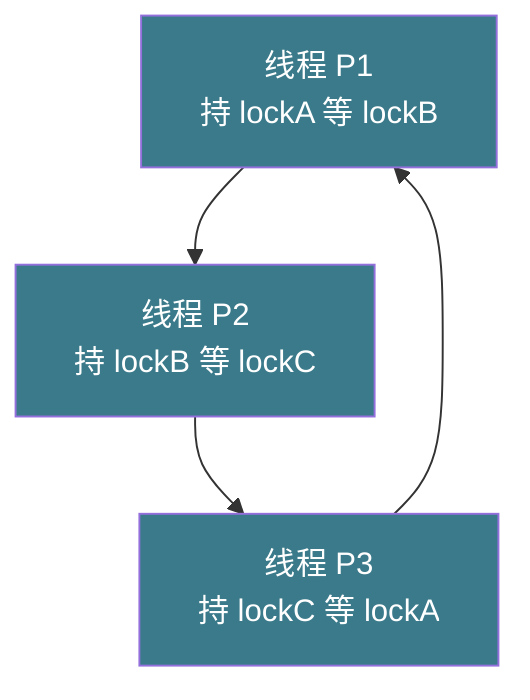
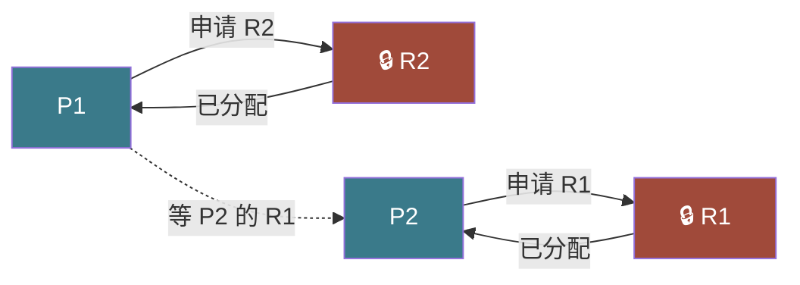

# 【金丹·78】死锁：四个条件和怎么破解

> 码农修仙传 · 金丹期 · 第78篇
> 我是玄芯散人，带你从炼气修到大乘。

---

## 境界标识

```
╔══════════════════════════════════╗
║     金丹期 · 第78篇              ║
║     死锁：四个条件和怎么破解       ║
║     互斥/占有等待/不可剥夺/循环等待║
║     死锁检测 / 预防 / 避免 / 恢复  ║
║     预计阅读：30分钟              ║
╚══════════════════════════════════╝
```

---

## 修仙引入

上一篇 077 把戒律堂兵器铺的五面幡拆开看了。可修真界里还有件让戒律堂长老头皮发麻的事：兵器用对了一切太平，用错了，整座密室从此再没人出来。

典籍阁里两扇门各自有令牌。一扇门是炼功密室，门后弟子要借走一卷「太极图副本」。一扇门是副本殿，门后弟子要先占下密室。某日弟子甲先去借密室令牌，进密室后又差人去副本殿借副本，令牌被弟子乙抢走。弟子乙先去副本殿副本，再去借密室，令牌又被弟子甲攥着。两边都不松手，两位弟子谁也出不来。守门人喊话，里面没人应。这不是传说，是修真界里挂了号的死局，叫死锁。

死锁不是修真界独有事。计算机里也天天发生：两个线程各拿一把锁，又要去抢对方手里的锁。结果就是两边无限等下去，CPU 不烧，内存不漏，进程就是不动。系统从外面看上去像卡死了，其实内部还活着，只是被环扣住了。

这一篇把死锁一个环节一个环节拆：Coffman 四个条件摆在台面上，预防要打破条件、避免靠事前检查、检测靠画图、恢复靠终止或回滚，全部讲清。看完这一篇，再有人程序卡住，你第一反应能往死锁方向排查。

---

## 硬核主体

### 死锁是什么：从一个经典 demo 看起

先看一段最经典的死锁代码。两个线程各自拿到一把锁，又要去拿对方手里的锁。

```c
#include <pthread.h>
#include <stdio.h>

pthread_mutex_t lock_a = PTHREAD_MUTEX_INITIALIZER;
pthread_mutex_t lock_b = PTHREAD_MUTEX_INITIALIZER;

void *thread_a(void *arg) {
    pthread_mutex_lock(&lock_a);          // 拿到 A
    printf("thread A got lock A\n");
    sleep(1);                              // 让对方有足够时间抢 B
    pthread_mutex_lock(&lock_b);          // 等 B
    printf("thread A got lock B\n");

    pthread_mutex_unlock(&lock_b);
    pthread_mutex_unlock(&lock_a);
    return NULL;
}

void *thread_b(void *arg) {
    pthread_mutex_lock(&lock_b);          // 拿到 B
    printf("thread B got lock B\n");
    sleep(1);                              // 让对方有足够时间抢 A
    pthread_mutex_lock(&lock_a);          // 等 A
    printf("thread B got lock A\n");

    pthread_mutex_unlock(&lock_a);
    pthread_mutex_unlock(&lock_b);
    return NULL;
}

int main(void) {
    pthread_t t1, t2;
    pthread_create(&t1, NULL, thread_a, NULL);
    pthread_create(&t2, NULL, thread_b, NULL);
    pthread_join(t1, NULL);
    pthread_join(t2, NULL);
    return 0;
}
```

跑起来，输出停在 `thread A got lock A` 和 `thread B got lock B` 两个打印。后面再也没动静。`htop` 看进程状态，两个线程一直在 `futex_wait_queue_me` 上挂着。CPU 接近 0，内存不涨，进程就是不动。

修真比喻：两扇门各有一把钥匙。弟子甲先开密室门拿 A，再拿副本殿钥匙 B。弟子乙先开副本殿门拿 B，再拿密室钥匙 A。两把钥匙都被对方攥在手里。两边都在等对方松手，谁都不松手。守门人喊话，里面没人应。

修真比喻对应到操作系统：两边都在内核态阻塞态等 futex，谁先松手都不可能。教科书把这种状态叫「deadlock」，直译死锁，一死一锁，谁也走不了。

### Coffman 四个必要条件

死锁不会随便发生。1971 年 Edward G. Coffman 写了一篇论文，把死锁发生的全部必要条件整理成四条。Wikipedia 直接引用这条结论，称作 Coffman 条件（Coffman conditions）。死锁发生，必须四条同时满足，缺一不可。

第一条，互斥（mutual exclusion）。资源一次只能被一个线程占用。令牌、密室这些独占资源，全是互斥资源。如果资源可共享（多线程同时读），死锁基础就没了。

第二条，占有并等待（hold and wait）。线程已经拿到至少一把锁，又要去抢别的锁，并且不释放手里的。修真比喻就是弟子甲攥着密室钥匙不放，又伸手去抓副本殿钥匙。

第三条，不可剥夺（no preemption）。线程手里的锁只能自己释放。系统不能从线程手里硬抢锁。锁的设计合约就是「谁申请谁释放」。如果允许系统强行剥夺，会引发新的不一致，例如把还没写完的事务强行抢走。

第四条，循环等待（circular wait）。存在一个等待环路。P1 等 P2 手里那把锁，P2 等 P3 手里那把锁，最后 PN 又等 P1。换成修真比喻，就是甲等乙，乙等丙，丙又等甲，三人围成一圈谁都不松手。



修真比喻对应：循环等待就是修真界「连环套」。三扇门的钥匙被三个人各拿一把，每个人都在等下一个人。守门人喊话没用，因为没人能开始。

四个条件之间有依赖。互斥是根本，不可能消除（互斥被消掉就无锁化了）。剩下三条条件各可被「打破」一条。这就是后面的预防（prevention）和避免（avoidance）策略的入口。

### 死锁预防：打破四条件之一

Coffman 论文出来后，操作系统研究者们陆续想出四条「预防」路径，每条都针对四条件之一。

打破占有并等待。两类办法。第一类是「一次性申请全部资源」，线程启动前把全部要用的锁列出来，系统检查不冲突才放行。问题是大多数线程没法提前知道会用哪把锁。第二类是「拿新锁前必须释放所有旧锁」，跟操作系统里事务的「全部回滚再重做」类似。代价是已经做完的工作得撤回，很多场景不能用。

打破不可剥夺。这一条最难。锁一旦授出，合约就是不能强行夺回。如果允许系统抢锁，就必须配合回滚（rollback），把已做的修改撤回。数据库的两阶段锁（2PL）里就用了这一招，事务做到一半被踢回来，所有已加的锁全部释放。当前主流操作系统里 mutex 一般不可剥夺。

打破循环等待。这是最实用的一条。办法是给所有锁编一个全局序号，规定线程必须按序号顺序加锁，反过来解锁。修真比喻对应：门和钥匙都按编号排队，甲想开 1、2、3 号门，必须先去 1 号再去 2 号最后去 3 号。任何两位弟子要进同一组门，都按序号走，不会出现「甲先抢 1 再抢 2，乙先抢 2 再抢 1」的反向环。

```c
// 按序号加锁，预防循环等待
void transfer(Account *from, Account *to, double amount) {
    Account *first  = (from < to) ? from : to;   // 先加小的
    Account *second = (from < to) ? to   : from;

    pthread_mutex_lock(&first->lock);
    pthread_mutex_lock(&second->lock);

    from->balance -= amount;
    to->balance   += amount;

    pthread_mutex_unlock(&second->lock);
    pthread_mutex_unlock(&first->lock);
}
```

这是 bank transfer 的经典写法。挑两个账户地址小的先加锁，任何两笔转账都按地址升序加锁。从来不会出现「甲等乙，乙等甲」的反向环路。

打破互斥。让资源可共享。读锁可共享，写锁独占。Spooling 技术把独占设备改成队列。代价是改动大，多数场景适用不上。

### 死锁避免：银行家算法

预防是把四条件整条打断。避免（avoidance）则是每次分配资源前做一次「安全检查」。Wikipedia 把这一类算法的代表直接点名：Dijkstra 设计的银行家算法（Banker's algorithm）。

银行家算法的核心思路是把系统当成银行。每个进程启动时申报每种资源的最大需求量（MAX）。每次进程申请资源时，系统假装批准，然后模拟一种「安全序列」：把所有进程排一个队，每个进程能从当前可用资源 + 已分配资源里凑齐 MAX，跑完，归还全部资源。如果排得出，状态安全，批准这次分配。如果排不出，回绝申请。

修真比喻：戒律堂接到弟子的调拨申请，先派弟子去查库房。假设这次申请批给这位弟子，盘面还能不能走完剩下所有弟子。如果能，再批。盘不出来，挂这位弟子的申请，让其他弟子先动。算法不保证公平，只保证不死锁。

```c
// 银行家算法数据结构（伪代码）
typedef struct {
    int available[M];               // 系统当前可用资源
    int max[N][M];                  // 每个进程最大需求
    int allocation[N][M];           // 当前已分配
    int need[N][M];                 // 还需多少 = max - allocation
} BankerState;

bool is_safe(BankerState *s) {
    int work[M];
    bool finish[N] = {false};
    memcpy(work, s->available, sizeof(work));

    while (true) {
        bool found = false;
        for (int i = 0; i < N; i++) {
            if (finish[i]) continue;
            bool can = true;
            for (int j = 0; j < M; j++)
                if (s->need[i][j] > work[j]) { can = false; break; }
            if (can) {
                for (int j = 0; j < M; j++)
                    work[j] += s->allocation[i][j];
                finish[i] = true;
                found = true;
            }
        }
        if (!found) break;
    }

    for (int i = 0; i < N; i++)
        if (!finish[i]) return false;
    return true;
}
```

修真比喻对应到工程现实：银行家算法在操作系统教材里讲得多，实际生产系统里几乎没人用。原因是它要求进程启动前必须申报 MAX，而真实业务里压根没法提前知道。银行家算法适合资源类型极少、数目固定的嵌入式或实时系统，例如航空电子、RTOS 场景。

### 死锁检测：资源分配图检测环

死锁预防把四条件打破，代价高。死锁避免靠事前检查，适用范围窄。多数操作系统走第三条路：允许死锁发生，但定期检测到后处理。

检测的核心工具叫资源分配图（Resource Allocation Graph）。节点分两类：进程节点（圆圈）和资源节点（方框）。边分两类：申请边（进程 → 资源，箭头指向资源）和分配边（资源 → 进程，箭头指向进程）。

Wikipedia 指出，对单实例资源系统（在用的资源只有一份），分配图里一旦出现环，就一定死锁。对多实例资源系统，环是必要不充分条件，需要配合可达性分析（跟银行家算法的安全检查是一回事）。



修真比喻：戒律堂每炷香盘点一次各弟子手里捏着哪些钥匙。等某位弟子来敲门时，画一张「谁想借谁手里这把钥匙」的图。盘出来发现图里出现环，就是死锁告警。Linux 内核不会自动做这件事（成本太高），但 MySQL InnoDB 的 `innodb_deadlock_detect` 是默认开启的，事务尝试加锁时立即检测，检测到立刻报错回滚一边的事务。

```sql
-- MySQL InnoDB 默认开启死锁检测
SHOW VARIABLES LIKE 'innodb_deadlock_detect';
-- 返回 ON
```

修真比喻：戒律堂查到环后怎么办？叫其中一位弟子放手。数据库查死锁后回滚代价较小的事务，另一笔继续跑。

### 死锁恢复：终止进程 / 回滚

检测到死锁之后，下一步是恢复。Wikipedia 把这条路分两类。

第一类叫进程终止（process termination）。粗暴但可靠：挑一个死锁里的进程，干掉它（kill 掉）。死锁的环路一旦被打破，剩下的进程就能继续。等价修真比喻：弟子被困在密室里，戒律堂直接破门把其中一位抬走，留下的弟子能继续借钥匙。

终止也有两种做法。一种叫「全部终止」，所有死锁进程一起 kill，简单粗暴，代价是大量已做工作丢光。另一种叫「逐个终止」，一次只杀一个，杀完重新检测环，没有环就停。代价是检测算法得反复跑，挑杀哪个进程则要参考优先级和运行时长这些参数。

第二类叫资源剥夺（resource preemption）。从某个死锁进程手里强行夺走资源，分给别的进程。这条路只能配合回滚用，剥夺之后还得让进程从某个一致点重新跑。数据库的事务就是这套：检测到死锁后，InnoDB 选代价小的事务回滚，释放它占的行锁，另一边继续。

修真比喻对应：戒律堂查到环，先看哪一位弟子修到一半，「回魂」一下损失少。如果选错了，回滚半天的活儿全丢，得返工。这条路在工程上极少裸用，绝大多数系统采用终止 + 检测组合。Linux OOM Killer 也是这条路的延伸。

### 实战：多线程编程里怎么避免死锁

修真界有句老话：「死锁不怕，怕的是没想到是死锁。」实战里有一套普适的「四步走」。

第一步，锁必须排序。不同模块要加同一组锁时，提前定下加锁顺序，全部按地址或编号升序加。Java 的 `Comparator` 接口、`equals` 方法都帮着定顺序。MySQL 也推荐按主键顺序加行锁。这些都是「打破循环等待」的工程体现。

第二步，能用 `trylock` 就别用阻塞加锁。`pthread_mutex_trylock` 拿不到就立刻返回，线程可以先做别的，再回来重试。

```c
// trylock 写法（外层是业务重试循环）
while (1) {
    pthread_mutex_lock(&lock_a);
    if (pthread_mutex_trylock(&lock_b) != 0) {
        pthread_mutex_unlock(&lock_a);  // 拿不到 B 就先释放 A
        usleep(1000);                    // 短等一下再重试
        continue;
    }
    break;  // 两把锁都拿到了，进临界区
}
```

第三步，必要时设超时。Linux 的 `pthread_mutex_t` 配合 `pthread_mutex_timedlock` 可以设超时。超时主动放弃，再走别的路径。Redis 的分布式锁里 lock 经常带 TTL，过期自动释放，是同一思路。

第四步，死锁检测工具走起来。Linux 有 `helgrind`（Valgrind 系列工具）和 ThreadSanitizer（`tsan`）能在线程级检测潜在死锁。

```bash
# 用 ThreadSanitizer 编译
gcc -fsanitize=thread -g deadlock.c -o deadlock -lpthread
./deadlock
# 跑几秒，tsan 会报 potential deadlock
```

修真比喻：戒律堂兵器铺上挂一份「禁止连环套」的告示牌。门下弟子接任务前先看一遍告示，能预防的死锁就预防。实际生产系统里，最常用的还是「锁排序 + 超时 + 检测」这套。

修真比喻收尾：死锁不是「锁坏了」，是「锁之间产生了环」。四个条件凑齐才会死。预防是把条件打破，避免是做事前检查，检测是环上画图，恢复是画完图抓一个出环。实战里多数项目走「排序 + 超时 + tsan」三件套，已经能挡掉九成死锁。

---

## 修仙术语对照表

| 修仙术语 | 技术现实 | 本篇位置 |
|---------|---------|---------|
| 密室与副本殿两扇门 | 两个线程交叉加两把锁 | 死锁是什么 |
| 四弟子各拿一把钥匙 | Coffman 四个条件 | Coffman 四个必要条件 |
| 互斥资源 | 锁一次只能被一个线程占用 | 条件一：互斥 |
| 攥钥匙不放又伸手抓新 | 占有并等待 | 条件二：hold and wait |
| 系统不能强夺钥匙 | 不可剥夺 | 条件三：no preemption |
| 三人围圈等钥匙 | 循环等待 | 条件四：circular wait |
| 钥匙全局编号 + 按序取 | 锁排序预防循环等待 | 死锁预防 |
| 戒律堂事前盘库 | 银行家算法 | 死锁避免 |
| 戒律堂画环告警 | 资源分配图检测环 | 死锁检测 |
| 抬走一位弟子破环 | 进程终止 | 死锁恢复 |
| 魂回重新修炼 | 资源剥夺 + 回滚 | 死锁恢复 |
| 拿不到就先还先等 | trylock + 短暂让步 | 实战规避 |
| 借钥匙限一炷香 | pthread_mutex_timedlock 超时 | 实战规避 |
| 告示牌防连环套 | 锁排序 + tsan 检测 | 实战规避 |

---

## 进阶条件

看完这一篇到能向别人讲清「死锁的来龙去脉」，差这几条：

- [ ] 能讲清 Coffman 四个条件是哪四条（互斥 / 占有并等待 / 不可剥夺 / 循环等待），并能说出 Coffman 1971 这篇论文的原作者名字
- [ ] 能讲清为什么互斥条件几乎不可能消除，以及消除它意味着什么（无锁编程方向）
- [ ] 能讲清「锁排序」是什么（按地址或编号升序加锁）以及为什么能打破循环等待
- [ ] 能讲清银行家算法的三张数据表（MAX / Allocation / Need）和一个安全序列检查的含义
- [ ] 能讲清为什么银行家算法在工程里几乎不用（需要提前申报最大需求）
- [ ] 能讲清资源分配图的节点类型与方向约定，并说明单实例资源系统里「环即死锁」的判定逻辑
- [ ] 能讲清死锁恢复的两条路（进程终止和资源剥夺）的代价差异
- [ ] 能用 `gcc -fsanitize=thread` 抓到一段故意写错的死锁 demo 并定位到出问题的两行加锁代码

> 最后一条是金丹期「线程安全」的真正分水岭。面试官追问「线程卡住不动，先排查什么」时，能答出「怀疑死锁，搜 `futex` 调用栈，看是否多把锁交叉等，再走锁排序或 trylock 改造」，这一关就过了。

---

## 下期预告 + 互动

> 死锁是把锁用错了的路数。可修真界里另一条更野的路子早就有人走过：根本不用锁，照样让多线程不出乱子。CAS 比较并交换（Compare-And-Swap）就是这条路的入口兵器。它用一条 CPU 指令完成「判断-改写」两件事，线程不停地试错，永远不阻塞。下一篇 079 就看这条野路子，重点是 CAS 原理；里面还藏一个反直觉的 ABA 问题；最后说原子操作的真代价。看完了，再有人问「无锁编程为什么写起来像玄学」，你能直接答出来。

现在问你：

> 🔍 用 `man pthread_mutex_lock` 看一遍手册里的 `EDEADLK` 部分。EDEADLK 是什么错误码？POSIX 标准怎么定义它？是用 `trylock` 还是 `timedlock` 才能避开这种自检报错？评论区聊聊你找到的细节。

> ⚙️ 写一段双线程 demo，线程 A 和 B 都做「先拿 lock_a 再拿 lock_b」两件事，跑起来让程序卡死。然后用 `gcc -fsanitize=thread` 编译跑一次，看 tsan 报哪一行。把报错贴出来对比你的猜。评论区报你的复现路径。

> 评论区聊聊你项目里见过的死锁，最后怎么排查定位的。

> 我是玄芯散人，带你从炼气修到大乘。

---

*本文是「码农修仙传」系列第78篇。系列导航见 [xren.ren](https://xren.ren)*
