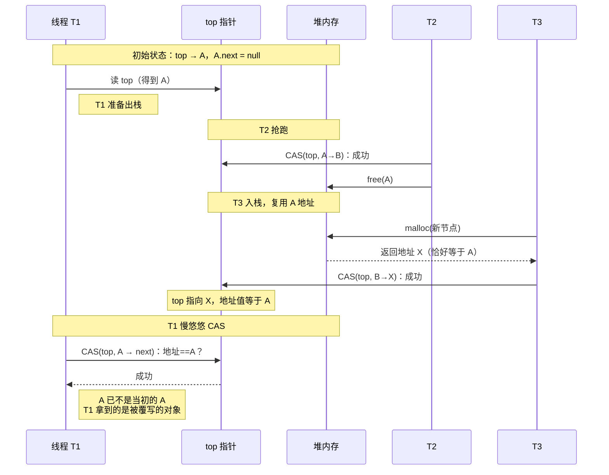

# 【金丹·79】无锁编程：CAS和原子操作

> **码农修仙传 · 金丹期 · 第79篇**
> 我是玄芯散人，带你从炼气修到大乘。

---

## 境界标识

```
╔══════════════════════════════════╗
║     金丹期 · 第79篇              ║
║     无锁编程：CAS和原子操作       ║
║     CMPXCHG / LL-SC / ABA / 缓存行║
║     预计阅读：30分钟              ║
╚══════════════════════════════════╝
```

---

## 修仙引入

上一篇 078 把戒律堂的几件兵器拆开看过一遍，互斥锁、自旋锁、CAS、内存屏障和 `volatile` 都在里面。那一篇讲的是 CAS 的基础概念和两道符箓（封字诀/开字诀）。可修真界里 CAS 还有更深的门道：这条「探测术」到底在 CPU 内部怎么念，念错了会出现什么幻象（ABA），修真界用了三百年才找到克制它的符箓（tagged pointer、hazard pointer），以及为什么「探测术」在某些时候比「令牌」更烧灵石（cache line bouncing）。

这一篇把这几件深一层的东西拆开看。看到这一篇，再有人讨论 lock-free queue 或者性能优化时绕不开的 ABA、伪共享，你能直接接上话。

---

## 硬核主体

### CAS 是怎么从硬件念出来的

073 讲过 CAS 的逻辑：探测一个值，符合预期就换成新值，否则什么都不做。逻辑简单，硬件怎么实现？这要看 CPU 的指令集。

修真比喻：探测术看着简单（念一句符），但符是用什么材料写的、写在什么载体上，不同山门差别很大。x86 山门用「比对符」（CMPXCHG 指令），ARM 山门用「借还符」（LDREX/STREX 配对），两条路殊途同归。

x86 上的 CMPXCHG。这条指令从 80486 处理器开始就有了。Wikipedia 确认 x86 自 80486 起支持 `CMPXCHG`，多处理器场景必须加 `LOCK` 前缀才能保证原子。语法长这样：

```c
// CMPXCHG dest, src  (AT&T 语法：cmpxchg src, dest)
// 等价逻辑：
// if (EAX == dest) {
//     ZF = 1;
//     dest = src;
// } else {
//     ZF = 0;
//     EAX = dest;
// }
```

`LOCK` 前缀是关键。Wikipedia 指出：`LOCK` 前缀让 CPU 锁住内存总线（或缓存行，取决于实现），保证这条指令的执行不会被其它 CPU 打断。`LOCK CMPXCHG` 这条组合是 x86 上 `__sync_bool_compare_and_swap` 和 C11 `atomic_compare_exchange` 的硬件底层。

修真比喻：`CMPXCHG` 是比对符，`LOCK` 是「请诸位同门回避」的喊声。没喊声，别的弟子可能在比对中把值改了，整个术就乱了。喊了，整条山道封锁，期间只许你一人动。

ARM 上的 LL-SC。ARM 用另一套思路：`LDREX`（Load-Link / Load-Exclusive）和 `STREX`（Store-Exclusive）配对。

```c
// ARM 上的 CAS 实现思路
do {
    old = LDREX(addr);            // 读，同时标记「我盯着这块地址」
    new_val = compute(old);
} while (STREX(addr, new_val));   // 写，如果中间地址被别的核改了，写失败
```

思路是乐观的。先假设不会被打扰，动手做做看。如果中间别人改了地址，硬件告诉你写失败，重来。Wikipedia 确认 ARM 的 LL-SC 机制从 ARMv6 起在 ARM 处理器上引入，后续 ARMv7/v8 持续支持。RISC-V 上的 `LR/SC`（Load-Reserved / Store-Conditional）是同一套思路的 RISC-V 移植版。

修真比喻：ARM 山门的弟子不喊「请诸位回避」，而是贴一张「此物在用」的灵符在地址上（LL）。弟子做事（STREX）。如果中间别人揭了灵符改了地址，弟子写符失败（返回非零），整个事作废重来。乐观，无人打扰就一路顺利，有人打扰就从头再来。

x86 和 ARM 思路对比。x86 走悲观：先把整条山道锁了再动手（`LOCK` 前缀锁总线）。ARM 走乐观：先动手，碰壁了再重来。两条路各有道理。x86 的强保证在短临界区里有优势（一次成功就完事），ARM 的乐观策略在低竞争场景下避免锁总线的开销。

修真比喻对应到工程现实：现代 C 编译器（GCC、Clang）针对不同 CPU 后端会生成不同指令。x86 后端默认用 `LOCK CMPXCHG`，ARM 后端默认用 `LDREX`/`STREX` 循环。性能特征在低竞争时差距很小（纳秒级），竞争激烈时差别才会显现。

### ABA 问题：值改了两遍，CAS 看不见

073 提过 ABA 一句话。这一篇把它掰开。

场景：栈顶指针 `top` 指向节点 A。线程 T1 读 `top` 拿到 A 指针，准备出栈。线程 T2 抢先把 A 出栈，节点 A 释放回内存。然后线程 T3 又把刚分配的 B 入栈，B 刚好分配到 A 释放的那块内存（B 的地址等于 A 的地址）。T1 这时候才慢吞吞跑 CAS：判断 `top` 还是 A？是。改成下一步。成功。可是 A 已经不是当初那个 A，里面字段可能全变了。

```c
// 简化版 lock-free stack pop（伪代码）
void pop(void) {
    Node *old_top = atomic_load(&top);            // T1 读 top，指向 A
    Node *new_top = old_top->next;
    // === 这时 T2 抢跑：A 出栈，A 释放 ===
    // === T3 入栈 B，B 复用了 A 的内存 ===
    // === old_top 指针此时指向 B ===
    if (CAS(&top, old_top, new_top)) {            // top 还是 A？是！换成 new_top
        // 成功，但 old_top 已经被 free 又重新分配
        // 用 old_top 是错的！
    }
}
```

修真比喻：弟子甲去查密室令牌（top），上面写着「A 弟子值班」。甲刚想换班，弟子乙抢先一步把 A 撤了（释放），弟子丙又安排弟子 D 接班，刚好坐在原来 A 的位置。甲这时慢悠悠跑去找「A 弟子」接班，看到椅子上坐的是 D，但牌子上还写着 A。甲 CAS「若牌子写 A 则换班」，成功，把 D 当 A 用了。可 D 是另一段人生，背景全变了。

ABA 在内存管理场景下尤其致命。分配器复用了释放块的内存地址，新对象覆盖旧对象，CAS 看不到区别，指针指向了错误的实体。

把 ABA 用时序图画出来更直观：



修真比喻对应到操作系统：Linux 内核的 `slab`/`slub` 分配器在并发场景下大量复用刚 free 的小块。`RCU` 解引用指针时如果中间被 free 又重新分配，读到的就是错误数据。用户态的 `malloc`/`free` 同样有这个隐患。

### 破 ABA 的三件符箓

修真界为了破 ABA 想出三招。各有适用场景。

第一招，双宽 CAS（double-word CAS）。x86 自 Pentium 以来支持 `CMPXCHG8B`（64 位）和 `CMPXCHG16B`（128 位，需 64 位模式）。把「指针 + 版本号」打包成 64 位或 128 位一起 CAS。版本号每次修改都加一，ABA 不可能再骗过 CAS。

```c
// 64 位双宽 CAS，地址存低 48 位，版本号存高 16 位
typedef struct {
    void *ptr;            // 48 位指针
    uint16_t version;     // 版本号
    uint16_t reserved;
} Packet_t;  // 8 字节对齐

// 一条 CMPXCHG8B 同时比较 ptr 和 version
```

修真比喻：牌子上不只写「谁值班」，还写「这是第几任」。弟子甲看牌子写「A 第 7 任」，CAS「若还是 A 第 7 任则换班」。弟子乙换成 A 第 8 任，弟子丙再换回 A 第 9 任（编号递增）。甲再来 CAS 时版本对不上，立刻发现。

第二招，hazard pointer（HP，危险指针）。Maged Michael 在 2002 年提出，2004 年发表于 IEEE TPDS。思路不靠版本号，靠「我要用」的标记。每个线程想访问共享指针前，先在公共的 HP 数组里占一个槽位（写「我正要用它」），标记这块地址暂时别释放。回收器看到 HP 里有这块地址的标记，就跳过不回收。

```c
// 简化版 hazard pointer
#define MAX_THREADS 128
volatile void *hp[MAX_THREADS] = {NULL};  // 全局 HP 表（实际工程中用 atomic_store 写 release 语义）

void retire(void *ptr) {
    // 标记为待回收
    pending_retire[retire_count++] = ptr;
    
    // 扫描 HP 表，如果没人引用 ptr，就真的回收
    for (int i = 0; i < MAX_THREADS; i++) {
        if (hp[i] == ptr) return;  // 有人用，不能回收
    }
    free(ptr);  // 没人用，回收
}
```

修真比喻：戒律堂设一个公示板，每位弟子想在密室用某件法器，先在公示板上写「弟子 X 正用法器 Y」（HP 标记）。回收弟子来收法器，先看公示板上有没有人引用 Y。有，跳过。没有人了，才真的回收。这样 ABA 的「地址复用」骗不了回收器，新分配的地址还在公示板上有人标记，回收器跳过旧的对象。

Wikipedia 指出 hazard pointer 的代价是每线程一个指针写入（HP 表）和回收扫描的开销。回收延迟有上限（bounded），但 HP 表的写入本身会带来 cache line 流量。HP 表项要原子写（release 语义），纯 `volatile` 不保证多核可见，回收器可能读到旧值错误回收。

第三招，引用计数（reference counting）。每个对象带引用计数，归零才回收。简单但每次引用增减都是原子操作，竞争激烈时反而慢。

修真比喻：每件法器挂一块玉牌，玉牌上写「当前被几人引用」。弟子用前玉牌加一，用完减一。归零才回收。三招之中最直观，但玉牌加减本身是热点，争的人多就堵。

修真比喻对应到工程现实：双宽 CAS 在 x86 上很自然（一条指令搞定），在 ARM 上没有原生支持，要用 LL-SC 循环模拟。hazard pointer 在 Linux 内核的 `RCU` 之外是一种用户态方案，Java 的 `ConcurrentLinkedQueue` 走类似思路。引用计数被 `std::shared_ptr` 用，但循环引用要小心（用 `weak_ptr` 破）。

### 原子操作的真实代价：缓存行颠簸

修真界里有一种错觉：CAS 比锁快，无锁编程一定赢。错了。CAS 在某些场景下反而更烧灵石。问题出在「缓存行颠簸」（cache line bouncing）。

先说缓存行的概念。前一篇讲过 CPU 三级缓存塔（缓存塔在 jindan/12-cache-tower）。这里只补一句：缓存的单位是「缓存行」（cache line），不是字节。x86 上一个缓存行是 64 字节，连续 64 字节的内存要么都在 L1 里要么都不在。

修真比喻：山门库房的钥匙按 64 把一盒装。弟子去库房取钥匙，是按盒取不是按把取。要么拿整盒要么不拿。所以多核 CPU 共享数据要「尽量挤进同一盒」才能共享。

MESI 协议。多个 CPU 核各自的 L1 缓存可能持有同一块内存的副本。Wikipedia 确认 MESI（Modified/Exclusive/Shared/Invalid）是现代 x86 CPU 使用的缓存一致性协议。每个缓存行有四种状态：M 表示本核独占且改过，E 表示独占未改，S 表示多核共享，I 表示失效。任何写操作都要先把其它核的副本失效（Invalidate），让对应缓存行变成 I 状态。这一步要广播消息给所有核，触发跨核通信（QPI/UPI 总线），一次几十纳秒。

修真比喻：戒律堂把一份文件复印多份，每位长老手边一份（各核缓存副本）。长老改文件，先大喊一声「诸位把自己那份烧了」（Invalidate 广播），再写新内容。各长老听广播销毁旧文件，需要几十纳秒（QPI 延迟）。

CAS 颠簸怎么发生的。两个 CPU 核同时对同一个原子变量做 CAS。每个核的 CAS 都包含「读-改-写」三步。每一步都要让对方核的缓存行失效。一个 CAS 失败回滚，下一轮再来一遍。N 个核竞争，每次成功的 CAS 都让其余 N-1 个核的缓存行失效一次。

修真比喻：两位弟子同时在改灵石账户。弟子甲念符「若 100 则改 101」（CAS），先把对方手里的副本标「失效」。弟子乙念符「若 100 则改 101」，发现对方标失效了，要重新读最新值，念符失败，再来一遍。每一次失败都要再广播一次失效消息。

修真比喻对应到性能：N 个核竞争同一个原子变量，吞吐量随核数增加反而下降。论文里把这种现象叫「cache line bouncing」或「N 核退化」。实际工程中，简单的全局计数器在 16 核以上的机器上，CAS 实现可能比 mutex 实现还慢。

修真比喻落到底层：硬件提供了 `LOCK` 前缀锁总线（旧 CPU）或 `LOCK` 前缀锁缓存行（新 CPU）。Wikipedia 确认现代 x86 上 `LOCK` 前缀锁的是缓存行不是整个总线，代价小很多。但即便锁缓存行，跨核广播和失效确认的开销仍是几十纳秒，纳秒级临界区会被这个开销吃掉。

修真比喻对应到工程现实：性能优化时常看到「别在热路径上用原子变量」的告诫。本质上原子操作不是「免费」的乐观，每条 `LOCK` 前缀的指令都可能在跨核通信。解决的思路有两个：第一，用线程局部变量攒批更新（thread-local counter，最后再合并）。第二，把热数据分散到不同缓存行（padding，避免伪共享）。两个技巧的根因都是减少跨核缓存行失效。

### 无锁队列：CAS 的工程实战

修真界里 CAS 用得最多的场景之一是无锁队列（lock-free queue）。最经典的实现叫 Michael-Scott 算法（1996 年由 Maged Michael 和 Michael Scott 提出）。

修真比喻：戒律堂的弟子排队取号。传统 mutex 方案要守门人盯着（拿锁）。无锁方案让每位弟子自己抽签决定前后（CAS 操作）。守门人可以去干别的事，整个队伍不用停下来。

Michael-Scott 算法的核心思想：队列用单向链表，头指针 `head` 和尾指针 `tail` 都是原子变量。入队只动 `tail`，出队只动 `head`。两个操作可能在不同线程并发跑，靠 CAS 保证不会同时改同一个指针。

```c
#include <stdatomic.h>
#include <stdlib.h>

typedef struct Node {
    void *data;
    struct Node *next;
} Node;

typedef struct {
    _Atomic(Node *) head;  // 队头
    _Atomic(Node *) tail;  // 队尾
} LFQueue;

void lfq_init(LFQueue *q) {
    Node *dummy = malloc(sizeof(Node));
    dummy->next = NULL;
    atomic_store(&q->head, dummy);
    atomic_store(&q->tail, dummy);
}

// 入队：把新节点挂到队尾
bool lfq_enqueue(LFQueue *q, void *data) {
    Node *node = malloc(sizeof(Node));
    node->data = data;
    node->next = NULL;
    
    Node *old_tail;
    Node *old_next;
    while (1) {
        old_tail = atomic_load(&q->tail);
        old_next = atomic_load(&old_tail->next);
        // 二次检查：tail 没变？
        if (old_tail != atomic_load(&q->tail)) continue;
        if (old_next != NULL) {
            // tail 落后于 head（被别的线程改过），帮它前进
            atomic_compare_exchange_weak(&q->tail, &old_tail, old_next);
            continue;
        }
        // 试着挂到队尾
        if (atomic_compare_exchange_weak(&old_tail->next, &old_next, node))
            break;
    }
    // 试着把 tail 推进到新节点
    atomic_compare_exchange_weak(&q->tail, &old_tail, node);
    return true;
}

// 出队：摘队头
bool lfq_dequeue(LFQueue *q, void **data) {
    Node *old_head;
    Node *old_tail;
    Node *first_node;
    while (1) {
        old_head = atomic_load(&q->head);
        old_tail = atomic_load(&q->tail);
        first_node = atomic_load(&old_head->next);
        if (old_head != atomic_load(&q->head)) continue;
        if (first_node == NULL) return false;  // 队列空
        if (old_head == old_tail) {
            // tail 落后，帮它前进
            atomic_compare_exchange_weak(&q->tail, &old_tail, first_node);
            continue;
        }
        *data = atomic_load(&first_node->data);
        if (atomic_compare_exchange_weak(&q->head, &old_head, first_node))
            break;
    }
    free(old_head);  // 释放旧的 dummy 节点
    return true;
}
```

修真比喻：戒律堂的排队簿有两本，「头簿」记当前服务谁，「尾簿」记最后排到的位置。弟子领号只在「尾簿」动手（CAS 改 tail）。弟子离开只在「头簿」动手（CAS 改 head）。两位弟子同时改簿也不会撞车，因为他们改的是不同簿页。修真界里还要小心一件事：两本簿页要分开印，不要印在同一本簿子的同一页上，否则两位弟子翻簿时簿页会争抢（false sharing），白白耗灵力（缓存行颠簸）。实际工程中常用 64 字节 padding 把 head 和 tail 隔到不同缓存行。

修真比喻对应到工程现实：Michael-Scott 算法是 Java `ConcurrentLinkedQueue` 和各种 lock-free MPMC 队列的理论源头。注意几点：

第一，节点内存的回收仍然需要小心。Node 被 `free` 后，新入队的 Node 可能复用同一地址（又是 ABA）。实际工程中常用 hazard pointer 或者 epoch-based reclamation（按代回收）来保证安全释放。这一篇不展开。

第二，无锁队列在竞争激烈时不一定比 mutex 队列快。Wikipedia 和多篇工业测试指出，2-4 个生产者/消费者场景下 mutex 队列往往更快，因为 mutex 进内核的 futex 等待让出 CPU，避免烧电。无锁队列的优势在「永不阻塞」。RTOS、嵌入式以及低延迟金融交易这类不能阻塞的环境才是它的主场。

第三，`atomic_compare_exchange_weak` 比 `strong` 版本性能略好，但允许「假失败」（即便值符合也返回失败）。在循环里用 weak 是常见做法，因为失败会自动重试。

修真比喻落到底层：CAS 是无锁编程的底层，但底层不等于万能。无锁编程能避免锁带来的优先级反转和死锁问题，但也带来 ABA 问题、内存回收难题以及 cache line 颠簸这种新麻烦。决定上无锁前，要先想清楚场景是不是真的需要「永不阻塞」，是不是真的能承担 ABA 和回收复杂度。

---

## 修仙术语对照表

| 修仙术语 | 技术现实 | 本篇位置 |
|---------|---------|---------|
| 比对符（CMPXCHG） | x86 CAS 指令 | CAS 硬件实现 |
| 借还符（LDREX/STREX） | ARM LL-SC | CAS 硬件实现 |
| 「请诸位回避」喊声 | LOCK 前缀 | CAS 硬件实现 |
| 贴灵符监视 | LL（Load-Link） | CAS 硬件实现 |
| 灵符被揭写符失败 | SC 失败重试 | CAS 硬件实现 |
| 值班牌改了两遍 | ABA 问题 | ABA |
| 牌子加「第几任」 | 版本号 / 双宽 CAS | 破 ABA |
| 公示板标记在用法器 | hazard pointer | 破 ABA |
| 法器玉牌引用计数 | reference counting | 破 ABA |
| 钥匙按盒装 | 缓存行 64 字节 | 缓存行颠簸 |
| 文件复印多份 | 多核缓存副本 | 缓存行颠簸 |
| 「烧旧文件」广播 | MESI Invalidate | 缓存行颠簸 |
| N 核退化 | cache line bouncing | 缓存行颠簸 |
| 排队簿两本 | head/tail 双指针 | 无锁队列 |
| 领号只在尾簿改 | tail CAS | 无锁队列 |
| 离队只在头簿改 | head CAS | 无锁队列 |
| dummy 哨兵节点 | 哨兵节点 | 无锁队列 |
| 按代回收 | epoch-based reclamation | 无锁队列回收 |

---

## 进阶条件

看完这一篇到能向别人讲清「CAS 的硬件底层和 ABA 该怎么破」，差这几条：

- [ ] 能讲清 x86 的 `CMPXCHG` + `LOCK` 前缀是什么组合，为什么需要 `LOCK`
- [ ] 能讲清 ARM 的 LL-SC 机制（`LDREX`/`STREX）和 x86 悲观锁思路的区别
- [ ] 能讲清 ABA 问题的内存复用场景（CAS 看不见中间被改过两次）
- [ ] 能讲清三种破 ABA 方案的适用场景（双宽 CAS / hazard pointer / 引用计数）
- [ ] 能讲清 cache line 是什么、MESI 四种状态分别是什么
- [ ] 能讲清 cache line bouncing 在多核竞争同一原子变量时为什么发生
- [ ] 能讲清 Michael-Scott 算法的核心思路（head/tail 双指针 + CAS）
- [ ] 能讲清为什么无锁队列在竞争激烈时不一定比 mutex 队列快

> 最后一条是金丹期对「无锁编程」的「分水岭」。面试里被问「无锁一定比有锁快吗」，能直接说出「不一定，竞争激烈时 cache line bouncing 可能让 CAS 比 mutex 还慢，且 ABA 和内存回收都更复杂」，这一关就过了。

---

## 下期预告 + 互动

上一篇 078 把死锁拆开讲过，再前面 077 把锁家族摆出来，最早的 073 把 CAS 基础讲过。这一篇把 CAS 的硬件实现、ABA、无锁队列一并拆完。可修真界里还有一件大事：弟子写完代码，跑起来发现慢，怎么知道慢在哪？是 CPU 跑满了，还是等 I/O 等的，还是 cache miss 太多？

下一篇围绕性能分析展开，把 perf 工具、火焰图、CPU 缓存命中率这些金丹修士必备的「望气术」讲一遍。看完了，再有人说「我的程序跑得慢」，你能直接掏出 perf 给它来一发。

现在问你：

> 🔍 在你的 Linux 机器上写一段两个线程对同一个 `atomic_int` 做 100 万次 CAS 竞争的代码，看竞争激烈时单次 CAS 的耗时。再用 `pthread_mutex` 包住同样的累加操作，对比耗时。竞争激烈时 CAS 真的一定比 mutex 快吗？评论区报一下你的实测数据。

> ⚙️ 在你的多核机器上（至少 4 核）跑一段经典的「伪共享」演示代码：两个线程分别累加两个相邻的 `int`（在同一缓存行），测耗时。然后给两个变量之间塞 64 字节 padding（让它们在不同缓存行），再测。对比两次的耗时差。伪共享真的能影响性能吗？差多少？

> 评论区聊聊你跟无锁编程打过交道，或者被 ABA 坑过的经历。

> 我是玄芯散人，带你从炼气修到大乘。

---

*本文是「码农修仙传」系列第79篇。系列导航见 [xren.ren](https://xren.ren)*