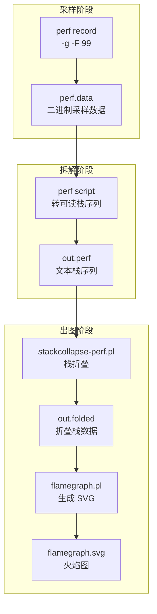
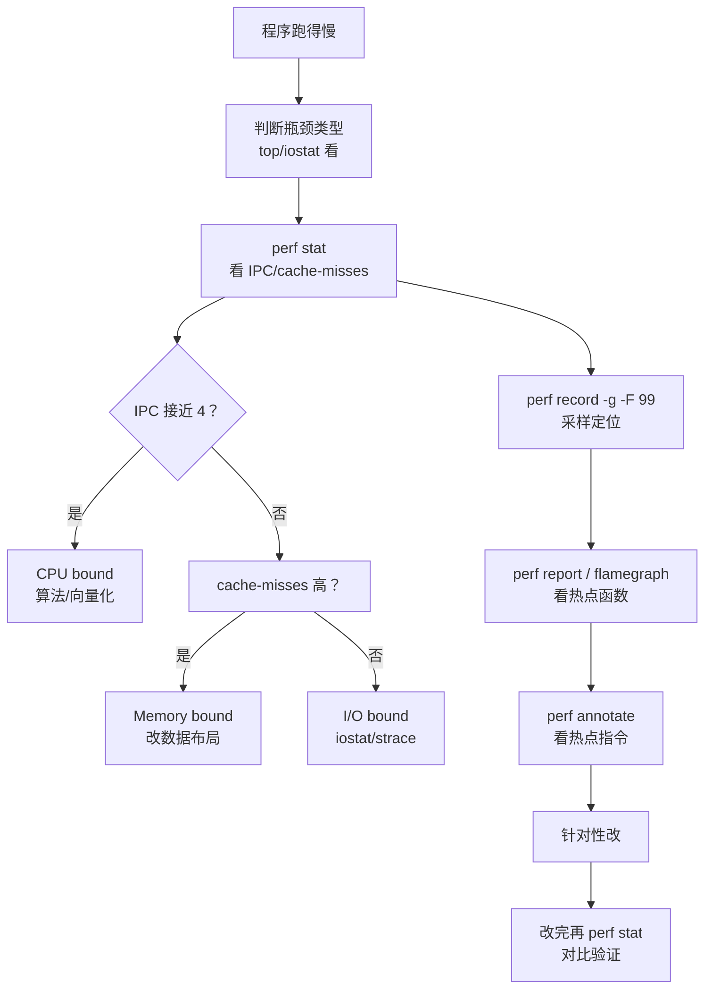

# 【金丹·81】性能分析：你的程序慢在哪

> **码农修仙传 · 金丹期 · 第81篇**
> 我是玄芯散人，带你从炼气修到大乘。

---

## 境界标识

```
╔══════════════════════════════════╗
║     金丹期 · 第81篇              ║
║     性能分析：你的程序慢在哪      ║
║     perf stat / record / report   ║
║     火焰图 / cache-misses        ║
║     预计阅读：30分钟              ║
╚══════════════════════════════════╝
```

---

## 修仙引入

上一篇 080 给金丹弟子开过天眼，gdb、strace 这些「观气小术」都讲了一遍。可修真界里有件更头疼的事：弟子好不容易把代码写完，跑起来一看，慢。慢在哪？是 CPU 跑满了，还是等 I/O 等的，还是 cache miss 太多？这时候 080 那点入门级的观气术就不够用了。

这一篇把金丹期必修的「望气大术」讲全：`perf stat` 看硬件计数器，`perf record` + `perf report` 做采样定位，`perf script` + Brendan Gregg 的 FlameGraph 出火焰图，最后用 `perf stat -e` 看 cache-misses 命中率。三件兵器配齐，再有人说「我的程序跑得慢」，你能直接掏出 perf 给它来一发，先看到底是哪里堵。

---

## 硬核主体

### 程序慢在哪：三种堵法

性能问题，说到底是资源争抢。资源分三大类：

第一类，CPU 资源（CPU bound）。CPU 一直在跑，但跑得满。计算密集型代码属于这一类，加密压缩属于这一类，图像处理也属于这一类。看 `top` 命令 CPU 占用率接近 100%，基本就是 CPU bound。

第二类，内存资源（Memory bound，又叫访存瓶颈）。CPU 大把时间在等内存。典型场合是 cache miss 太多，每次读数据都要从主存搬运，主存延迟几百纳秒，对比 CPU 一纳秒级别的运算慢了一两个数量级。看 `perf stat` 的 `cache-misses` 占比很高，就是这一类。

第三类，I/O 资源（I/O bound，又叫 I/O 等待）。CPU 没事干，比如等磁盘，或者等网络，或者等用户输入。看 `top` CPU 占用率不高，但程序就是慢，`iostat` 看磁盘 `await` 高，就是 I/O bound。

修真比喻：把 CPU 想象成戒律堂主事长老。长老手底下管三件事：处理宗门文书（CPU bound）、查典籍翻书（Memory bound）、出门送信（I/O bound）。长老说「我很忙」，可能是在写文书，也可能是在翻书找不到，也可能是在等送信弟子回来。先问清楚是哪一种堵，再对症下药。

知道是哪一种堵之后，下一步是量化。CPU 跑得满用 `top` 看得出来，I/O 慢用 `iostat` 看得出来，Memory bound 就要用 perf 才能看。Memory bound 是这一篇的重点。

### perf stat：硬件计数器看气色

`perf stat` 是 perf 工具集最常用的子命令，它读取 CPU 内部的「性能监控单元」（PMU，Performance Monitoring Unit），统计一段时间内硬件事件的发生次数。

修真比喻：每位金丹弟子身上都佩戴着戒律堂发的「灵脉计数器」，自动统计灵气消耗；周天运转它也记；丹炉点火也归它管。`perf stat` 就是去看这些计数器，看哪一项指标异常。

基础用法：

```bash
# 跑一个程序，顺手统计硬件事件
$ perf stat ./my_program

# 输出示例（精简版）
 Performance counter stats for './my_program':

    12,345,678,901      cycles                    # 3.201 GHz           (50.00%)
    18,765,432,109      instructions              # 1.52  insn per cycle  (50.00%)
     1,234,567,890      cache-misses              # 10.00% of all cache refs   (50.00%)
       123,456,789      cache-references
       456,789,012      branch-misses              # 2.50% of all branches       (50.00%)
     2,345,678,901      branch-instructions
     1,000,234,567      page-faults
       0.345678901      seconds time elapsed
```

修真比喻对应到每一行的含义：

`cycles`（时钟周期）：CPU 时钟走了多少拍。一拍约 0.3 纳秒（3GHz CPU）。这是程序占用 CPU 时间的直接度量。

`instructions`（指令数）：CPU 执行了多少条指令。和 `cycles` 比一比就是 IPC（Instructions Per Cycle），每拍执行多少条指令。

`IPC`（Instructions Per Cycle，每拍指令数）：这是判断「CPU 跑得满不满」的最直观指标。理想情况 IPC ≈ 4（超标量 CPU 每拍最多发 4 条指令）。IPC 接近 4 说明 CPU 流水线很忙。IPC 接近 0.5 说明 CPU 大部分时间在等，比如等内存，或者等分支预测，或者等锁。

修真比喻：IPC 就是「长老每息处理多少件文书」。IPC 接近 4 是长老手脚麻利，接近 0.5 是长老大部分时间在翻书找典籍（等内存）。

`cache-misses`（缓存未命中）：这是一个「通用 PMU 事件」，实际触发哪一级缓存要看硬件配置（多数 x86 CPU 默认指 LLC miss）。要精确统计哪一级缓存，要用分级事件 `L1-dcache-load-misses` / `LLC-load-misses` 等。076 讲过缓存塔的结构，L1 miss 一次约 1 纳秒，LLC miss 一次约 30 纳秒，主存 miss 一次约 100 纳秒。任何一次缓存 miss，CPU 这一拍就空转。

修真比喻：缓存就是长老书桌上的小抽屉（76 讲过），cache-misses 是「抽屉里没有，去库房取」的次数。库房在山门外，取一次要走几十纳秒。

`branch-misses`（分支预测失败）：现代 CPU 用分支预测提前猜 if/else 走向，猜错要清空流水线重来，代价十几拍。

`page-faults`（缺页）：程序访问的虚拟内存页不在物理内存里，要从磁盘调进来。这是 I/O bound 的早期信号。

实战案例一：判断 CPU bound 还是 Memory bound。

```bash
$ perf stat ./compute_heavy
   12,345,678,901      cycles
   48,765,432,109      instructions              # 3.95  insn per cycle
        12,345,678      cache-misses              # 0.05% of all cache refs
```

IPC 3.95 接近理论上限 4，cache-misses 极少。这是典型的 CPU bound。出手之处是减少指令数（算法改一改、向量化），CPU 自身没空着。

再看一个反例：

```bash
$ perf stat ./hash_lookup
    12,345,678,901      cycles
     7,765,432,109      instructions              # 0.63  insn per cycle
     3,234,567,890      cache-misses              # 30.00% of all cache refs
```

IPC 0.63，远低于 4。cache-misses 占比 30%，大量时间在等内存。这是典型的 Memory bound。出手之处是提高缓存命中率。比如改数据布局，或者加 prefetch，或者压缩数据，CPU 自身大部分时间在空转。

修真比喻：第一位弟子每息写 3.95 份文书（IPC 高），CPU 满载。第二位弟子每息写 0.63 份文书，但 30% 的时间在库房翻书（cache-misses）。第二位弟子的瓶颈不在文书能力，在书不在手边。

`perf stat` 还有几个常用选项：

```bash
# 指定要统计的事件
$ perf stat -e cycles,instructions,cache-misses,L1-dcache-load-misses ./program

# 看 cache-misses 在哪一级缓存发生
$ perf stat -e L1-dcache-load-misses,LLC-load-misses ./program

# 附加到已运行的进程
$ perf stat -p <PID> sleep 10
```

修真比喻对应到事件名：`L1-dcache-load-misses` 是 L1 数据缓存未命中，`LLC-load-misses` 是 Last Level Cache（LLC，就是 L3）未命中。L1 miss 之后是 L3 miss，再到主存，L1 miss 约 1 纳秒；L2 miss 约 10 纳秒；L3 miss 约 30 纳秒；主存 miss 约 100 纳秒。先看是哪一级缓存 miss 多，再决定从哪改起。

### perf record + perf report：抓现行

`perf stat` 给出宏观指标，但「哪个函数消耗了多少 CPU」答不上来。这就要靠 `perf record` 做采样，`perf report` 拆。

修真比喻：`perf stat` 是看灵脉计数器总账。`perf record` 是给弟子随身挂一个灵气采样器，每秒采 1000 次，记录「当前正在运行哪个函数」。跑完之后 `perf report` 把样本按函数聚合，告诉你「弟子有 60% 的时间在写文书，30% 在翻书，10% 在送信」。

基础用法：

```bash
# 采样运行（-g 记录调用栈，-F 99 每秒 99 次采样）
$ perf record -g -F 99 ./my_program
[ perf record: Woken up 1 times to write data ]
[ perf record: Captured and wrote 0.123 MB perf.data (~5386 samples) ]

# 拆开采样数据（交互式 TUI）
$ perf report
```

`-F 99` 是常用选择。Brendan Gregg 的 perf 教程指出，采样频率 99Hz（而不是默认的 1000Hz 或更高）是为了避开内核 hrtimer（默认 1kHz）与 NMI watchdog 的 lockstep 干扰，采样本身成为节拍的一部分会让数据失真。99Hz 既能定位热点，采样开销也不至于拖累程序本身。

修真比喻：采样频率不是越高越好。挂采样器本身有代价（每次采样 CPU 要记一笔），采样频率高，记录开销就高。99Hz 是一个工程上的折中点，足够定位热点，又不让采样开销拖累程序本身。

`perf report` 进入 TUI（文本界面），默认按「self」排序展示每个函数的耗时占比：

```
Samples: 5K of event 'cycles'
Overhead  Command     Shared Object     Symbol
  45.23%  my_program  my_program        [.] slow_function
  20.15%  my_program  my_program        [.] medium_function
  15.30%  my_program  libc.so.6         [.] __memcpy_avx_unaligned
   8.10%  my_program  my_program        [.] init_array
   5.20%  my_program  [kernel]          [k] _raw_spin_lock_irqsave
```

修真比喻对应到每一行：`45.23%` 是「弟子有 45.23% 的时间在跑 `slow_function`」，这就是热点函数。点进去还能看到调用栈，顺着 main 一路追下去，追到具体某一行代码。

修真比喻对应到工程现实：`perf report` 是定位「哪个函数慢」的工业标准。Brendan Gregg 在 2014 年发布的《Performance Analysis Methodology》是 perf 工作流的参考：「先 `perf stat` 看宏观，再 `perf record` + `perf report` 定位函数，最后 `perf annotate` 看具体指令」。

修真比喻对应到常见误区：很多人看到 `__memcpy_avx_unaligned` 占比高就以为 memcpy 是热点，其实往往是「调用 memcpy 的那个函数」才是热点。`perf report` 默认按 self 排序，要看调用栈用 `-g` 重新 record，或者在 TUI 里按「call graph」切换排序。

实战案例二：定位具体慢函数。

```bash
# 采样运行
$ perf record -g -F 99 ./my_program
$ perf report --stdio
# 找到占比 45% 的 slow_function，记下地址
# 进一步看具体哪行代码慢
$ perf annotate slow_function
```

`perf annotate` 显示该函数的汇编代码，每一行旁边标了采样命中次数。命中次数多的行就是热点指令。

修真比喻对应到这一段：`perf report` 是看「弟子主要在干什么」，`perf annotate` 是看「弟子做这件事时具体卡在哪一招」。两件兵器配合，才能问题定位到根因。

### 火焰图：把调用栈画成山

`perf report` 是命令行 TUI，看文本表格。火焰图（FlameGraph）是把 perf 采样的调用栈数据画成可视化图形，一眼看到热点。

火焰图由 Linux 性能排查工程师 Brendan Gregg 在 2011 年发明，现在是性能排查的工业标准可视化方式。

修真比喻：`perf report` 是账本，告诉你「slow_function 用了 45% 的时间」。火焰图是把账本画成山形图，山顶是 main，山腰是各个函数，山脚是叶子函数。一眼能看出哪座山最高、哪条路径最堵。

把 perf 的工具链画成流程图：



火焰图生成流程：

```bash
# 第 1 步：先 perf record 采样（必须用 -g 记录调用栈）
$ perf record -g -F 99 ./my_program
# 生成 perf.data

# 第 2 步：perf script 把采样数据转成栈折叠格式
$ perf script > out.perf

# 第 3 步：用 FlameGraph 工具栈折叠
# 先克隆仓库
$ git clone https://github.com/brendangregg/FlameGraph.git
$ cd FlameGraph

# stackcollapse-perf.pl 把 perf 脚本转成折叠栈格式
$ ./stackcollapse-perf.pl ../out.perf > out.folded

# flamegraph.pl 生成 SVG 火焰图
$ ./flamegraph.pl out.folded > flamegraph.svg
```

修真比喻对应到这三步：第 1 步是给弟子挂灵气采样器。第 2 步是把采样记录整理成「栈序列」，每个栈记录「弟子在做什么 → 为谁做事 → 为谁做事的为谁做事」这样的调用链。第 3 步是把栈序列折叠成 SVG 图，每个调用栈画成一个矩形，矩形宽窄就是该栈的耗时占比。

打开 flamegraph.svg 看效果。火焰图有几条阅读规则：

第一，y 轴是调用栈层数。最顶上是 main，往下是它调用的函数，再往下是再调用的函数。

第二，x 轴是采样数，不是时长。整张图宽窄等于总采样数，每个矩形的宽窄等于该函数的采样数（包括被它调用的子函数）。

第三，山顶是 main，山脚是叶子函数。宽矩形就是热点。

第四，颜色没有特殊含义，只是为了区分不同的栈。同一父函数的子函数颜色相近。

第五，「平顶山」比「尖顶山」更值得关注。平顶说明这个函数自己占用了大量 CPU，尖顶说明它大部分时间在调用别人。

修真比喻对应到几条规则：y 轴是「辈分」，辈分越高越靠山顶（main 是掌门）。x 轴是「干活的总量」。宽矩形就是大活人。平顶山是「自己干活的弟子」，尖顶山是「叫别人干活的弟子」。

实战案例三：用火焰图定位热点。

假设有个 Web 服务响应慢。`perf stat` 看 IPC 0.5，是 Memory bound。`perf record + perf report` 看到 `process_request` 占 40% CPU。生成火焰图后看到 `process_request` 自己只占 5%，剩下 35% 全在调 `json_decode`，`json_decode` 又把 30% 耗在 `hash_lookup` 上。

修真比喻对应到这个例子：火焰图显示「处理请求的弟子大部分时间在调「解符箓」的弟子（json_decode），「解符箓」的弟子又大部分时间在调「查典籍」的弟子（hash_lookup）」。出手之处直指 hash_lookup 的实现，可能要从线性搜索换成哈希表。

修真比喻对应到工程现实：火焰图最大的用处是「一眼看出调用栈哪里最宽」。文字报告你要逐行读，火焰图直接看哪个矩形最胖。Brendan Gregg 的原话：「火焰图是性能排查的可视化语言」。

火焰图的局限：火焰图是「采样快照」，反映的是「程序运行时某一刻的调用栈分布」，不是「每条具体代码路径的执行时间」。要找某次慢的调用，还是要靠 trace 类工具（bpftrace、SystemTap）。

修真比喻对应到这一段：火焰图是看「弟子整体在干什么」，不是看「某一刻某弟子在干什么」。要找具体某次请求慢，要用 trace 工具记录每一次调用。

### cache-misses 命中率拆解：定位访存瓶颈

性能提速的金科玉律：先量化瓶颈，再动手。`perf stat` 给出 cache-misses 总数，但要看「miss 在哪一级缓存」「miss 在哪个函数」还要更细的命令。

修真比喻：`perf stat` 告诉你「弟子去库房取了 1000 次书」，但没告诉你「是哪几类书」「是哪个弟子去取的」。要回答这两问，要用 `perf stat -e` 指定具体缓存事件，用 `perf record -e` 采样缓存事件。

缓存事件分级：

```bash
# L1 数据缓存未命中
$ perf stat -e L1-dcache-load-misses ./program

# L1 指令缓存未命中（少见，热点循环容易出现）
$ perf stat -e L1-icache-load-misses ./program

# 最后一级缓存（LLC，L3）未命中
$ perf stat -e LLC-load-misses ./program

# TLB 未命中（虚拟地址到物理地址转换失败）
$ perf stat -e dTLB-load-misses ./program

# 完整组合
$ perf stat -e L1-dcache-load-misses,LLC-load-misses,dTLB-load-misses ./program
```

修真比喻对应到这些事件：L1 miss 是「书桌小抽屉没有」，LLC miss 是「大柜子（库房）都没有」，TLB miss 是「弟子连「哪类书在哪排」都忘了，要重新查目录」。

从延迟看，L1 miss 是 1 纳秒，LLC miss 是 30 纳秒，主存 miss 是 100 纳秒。优先动的是先降低 LLC miss，再降低主存 miss。

修真比喻对应到延迟：抽屉里没有走一步（1ns）就到下一个抽屉，大柜子没有要走一段路（30ns）才能到库房，库房没有要走整个山门（100ns）。先解决大柜子没有的问题，再解决库房没有的问题。

实战案例四：拆链表遍历的 cache 行为。

```c
// 一个典型的 cache-unfriendly 例子：链表节点分散在堆上
struct Node {
    int data;
    struct Node *next;
};

long sum_list(struct Node *head) {
    long sum = 0;
    while (head) {
        sum += head->data;     // 每次访问触发一次 cache load
        head = head->next;     // next 指针指向下一个分散的节点
    }
    return sum;
}
```

修真比喻对应到这个 C 代码：弟子要查一长串名册，每查一个人就要去库房走一趟。每走一趟可能 cache miss，因为下一个人的名册可能在库房另一头。

出手之处是把链表改成连续数组（数组节点 `next` 是隐式的下标 +1），或者把分散的小对象重新组织让访存更连续。这两种改法都是让相邻访问的数据在内存上靠拢，减少 cache miss 概率。

注意，padding 在这里是另一回事。padding 是用在「多个线程同时改不同字段，但这些字段恰好落在同一缓存行」的场合。这种场合下，一个核写自己的字段，要广播让其它核把这个缓存行标失效（Invalidate），叫「伪共享」（false sharing，076 讲过）。padding 把不相关的字段塞进不同缓存行，避免这种互相干扰。

修真比喻对应到出手之处：要么把名册改成连续的本子（数组），要么把容易互相干扰的名册分开放，每本之间塞点没用的字（padding）隔开。

实战案例五：用 perf 看 cache miss 分布。

```bash
# 采样 cache miss 事件，看哪些函数 miss 最多
$ perf record -g -e cache-misses -F 99 ./program
$ perf report

# 输出示例：
#  35.20%  my_program  my_program        [.] hash_lookup
#  18.50%  my_program  my_program        [.] process_request
#  10.30%  libc.so.6                     [.] _int_free
#   ...
```

修真比喻对应到这段命令：`hash_lookup` 占了 35% 的 cache miss，这是热点。下一步就要去看 hash_lookup 的实现，看是不是哈希函数设计不好导致冲突多、链表长，每次都要走 cache miss。

修真比喻对应到工程现实：`perf record -e cache-misses` 是定位「访存瓶颈在哪」的利器。看到某个函数 cache miss 占比异常高，先看是不是数据布局问题（数组 vs 链表、AoS vs SoA），再看是不是访问模式问题（顺序 vs 跳跃），再看是不是容量问题（数据太大缓存放不下）。

### 实战：拆一个慢函数

把上面几件兵器串起来，跑一遍真实案例。

场合：C 程序 `slow.c`，运行时间异常长，需要定位瓶颈。

```c
// slow.c - 一个有多种瓶颈的示例程序
#include <stdio.h>
#include <stdlib.h>
#include <string.h>

#define N 1000000

// 1. 紧凑数据数组（cache friendly）
double arr[N];

// 2. 链表节点（cache unfriendly）
struct Node {
    int data;
    struct Node *next;
};

int main() {
    // 初始化数组
    for (int i = 0; i < N; i++) {
        arr[i] = i * 1.5;
    }
    
    // 初始化链表
    struct Node *head = NULL;
    for (int i = 0; i < N; i++) {
        struct Node *n = malloc(sizeof(struct Node));
        n->data = i;
        n->next = head;
        head = n;
    }
    
    // 操作1：数组求和（cache friendly）
    double sum1 = 0;
    for (int i = 0; i < N; i++) {
        sum1 += arr[i];
    }
    printf("array sum: %f\n", sum1);
    
    // 操作2：链表求和（cache unfriendly）
    long sum2 = 0;
    struct Node *p = head;
    while (p) {
        sum2 += p->data;
        p = p->next;
    }
    printf("list sum: %ld\n", sum2);
    
    // 清理链表
    while (head) {
        struct Node *tmp = head;
        head = head->next;
        free(tmp);
    }
    
    return 0;
}
```

修真比喻对应到这段 C 代码：弟子要做两件事，从连续的本子里数数（数组求和）和从分散的名册里数数（链表求和）。后一件要不停去库房。

第一步，`perf stat` 看宏观：

```bash
$ gcc -O2 slow.c -o slow
$ perf stat ./slow
array sum: 749999700000.000000
list sum: 499999500000

 Performance counter stats for './slow':

    4,567,890,123      cycles                    # 3.456 GHz
    6,789,012,345      instructions              # 1.49  insn per cycle
       12,345,678      cache-misses              # 5.20% of all cache refs
       234,567,890      cache-references
       0.123456789      seconds time elapsed
```

修真比喻对应到这一步：先看灵脉计数器总账。IPC 1.49 远低于理论上限 4，cache-misses 5.20%，主存访问占了一些时间。

第二步，`perf record + perf report` 定位函数：

```bash
$ perf record -g -F 99 ./slow
$ perf report --stdio | head -30
# 重点看占比前几的函数
```

修真比喻：看「弟子整体在干什么」。预期 `list sum` 那段（链表遍历）占比最高。

第三步，生成火焰图：

```bash
$ perf script > out.perf
$ ./stackcollapse-perf.pl out.perf > out.folded
$ ./flamegraph.pl out.folded > flamegraph.svg
# 用浏览器打开 flamegraph.svg
```

修真比喻：把账本画成山形图。一眼能看到「链表遍历」的山比「数组求和」的山宽得多，说明链表遍历是瓶颈。

第四步，针对性改一改：

```c
// 改法1：链表改成数组（如果场合允许）
// 改法2：链表节点之间改成连续分配（arena / pool），让访存局部性提升
//        避免用 padding[60] 让 Node 占 72 字节——那反而让节点跨缓存行
// 这是反例：padding[60] 让每个 Node 占 72 字节，跨缓存行
// 真正的用法是把两个并发写的独立字段塞进不同缓存行（避免伪共享）
struct Node {
    int data;
    char padding[60];    // ⚠️ 错误示例：Node 占 72 字节，跨缓存行
    struct Node *next;
};
```

修真比喻：要么把名册改成连续本子（数组），要么用 arena/pool 让节点在堆上连续分配，目的都是让一次取能多带几个名字。真实程序里瓶颈常常藏在「数据结构设计」上，先用 perf 看到底哪里慢，再决定改算法、改数据结构还是改编译选项。盲目改（不看 perf 就改代码）往往是事倍功半。

把性能排查的工作流画成瀑布图：



修真比喻对应到一些反模式：有人看到程序慢就加 `-O3`，效果不明显就换 `-Ofast`，还是慢就上 `-march=native`。这些编译改动都是指令这一层的，对 cache miss、内存布局问题帮助有限。先用 perf 看到底是哪一类慢，再选合适的提速手段。

修真比喻对应到下一步：性能提速的「分水岭」是「先量化再动手」。能看到 80% 的时间花在哪 20% 的代码上（80/20 法则在性能提速里同样适用），提速就是水到渠成的事。

---

## 修仙术语对照表

| 修仙术语 | 技术现实 | 本篇位置 |
|---------|---------|---------|
| 灵脉计数器 | PMU 硬件计数器 | perf stat |
| 灵脉总账 | 硬件事件汇总 | perf stat |
| 弟子挂采样器 | perf record 采样 | perf record |
| 栈序列记录 | 折叠栈格式 | 火焰图生成 |
| 山形图 | FlameGraph SVG | 火焰图 |
| 平顶山 / 尖顶山 | self 高 / 父调用多 | 看火焰图 |
| 库房取书 | 主存访问 | cache-misses |
| 抽屉里没有 | L1 cache miss | cache 分级 |
| 大柜子没有 | LLC cache miss | cache 分级 |
| 弟子查目录都忘了 | TLB miss | cache 分级 |
| 名册改连续本子 | 链表改数组 | 实战案例 |
| 名册间分开放避免冲突 | padding 避免伪共享 | 实战案例 |
| 80/20 法则 | 二八定律在性能定位 | 实战总结 |
| 望气大术 | 性能排查工具集 | 全文 |

---

## 进阶条件

看完这一篇到能向别人讲清「perf 工具链怎么用、火焰图怎么看、cache miss 怎么定位」，差这几条：

- [ ] 能讲清 perf 三件套的职责分工：stat 用来看指标，record 用来采样，report 用来聚合
- [ ] 能讲清 IPC 是什么、IPC 高和低各代表什么性能瓶颈
- [ ] 能讲清 cache-misses 在缓存塔（L1/LLC/主存）里的延迟差异
- [ ] 能讲清为什么 `-F 99` 是常用采样频率（避开 100Hz 倍数伪信号）
- [ ] 能讲清火焰图的 y 轴和 x 轴分别代表什么、怎么从火焰图读出热点
- [ ] 能用 stackcollapse-perf.pl 和 flamegraph.pl 生成火焰图
- [ ] 能用 `perf record -e cache-misses` 定位访存瓶颈在哪个函数
- [ ] 能讲清「先 perf stat 看宏观，再 record/report 定位函数」的动手顺序

> 最后一条是金丹期对「性能定位」的「分水岭」。面试里被问「程序跑得慢怎么排查」，能直接说出「先 perf stat 看 IPC 和 cache-misses 判断瓶颈类型，再 perf record -g + perf report 定位热点函数，需要时出火焰图，最后 perf annotate 看具体指令」，这一关就过了。

---

## 下期预告 + 互动

080 把调试技巧讲过，079 把 CAS 硬件底层讲过，076 把缓存塔讲过。这一篇把 perf 工具链讲一遍，再把火焰图讲一遍，最后把 cache miss 也讲一遍。

可修真界里还有一件大事：弟子写代码时申请内存，跑完忘记释放，进程越跑越胖，最后系统报 OOM（Out Of Memory）。这种「内存泄漏」怎么查？戒律堂有专门的「净坛符」（valgrind）和「天眼符」（ASan，Address Sanitizer）能照出哪里漏了内存、哪里越了界。

下一篇围绕内存泄漏排查展开，把 valgrind 的 memcheck、ASan 的 LeakSanitizer、ASan 的越界检测一并讲一遍。看完了，再有人说「我的程序内存越用越多」或者「偶尔崩一下像野指针」，你能直接掏 valgrind 或 ASan 给它来一发。

现在问你：

> 🔍 在你的 Linux 机器上跑 `perf stat ls -la /usr`，看 IPC 是多少、cache-misses 占比是多少。ls 这种简单命令的 IPC 和 cache-misses 是什么水平？再跑 `perf stat find / -name '*.c'`，看 IPC 变化。I/O bound 程序的 IPC 和 cache-misses 跟 CPU bound 程序有什么差别？评论区报一下你的实测数据。

> ⚙️ 在你的机器上写一个简单的链表遍历程序（参考实战案例五），用 `perf record -g -e cache-misses` 跑一遍，看 cache miss 占比。再把链表节点用 arena 一次性分配（连续内存），重跑一遍，对比 cache miss 占比变化。节点连续分配真的能降低 cache miss 吗？差多少？

> ⚙️ 再写一段两个线程并发累加两个相邻 `int` 的伪共享演示代码（参考 076），用 `perf stat -e cache-misses` 跑，对比两个 int 之间塞 padding 后的 cache miss 变化。padding 真的能避免伪共享吗？差多少？

> 评论区聊聊你跟 perf / 火焰图 / cache miss 打过的交道，或者被性能问题坑过的经历。

> 我是玄芯散人，带你从炼气修到大乘。

---

*本文是「码农修仙传」系列第81篇。系列导航见 [xren.ren](https://xren.ren)*
