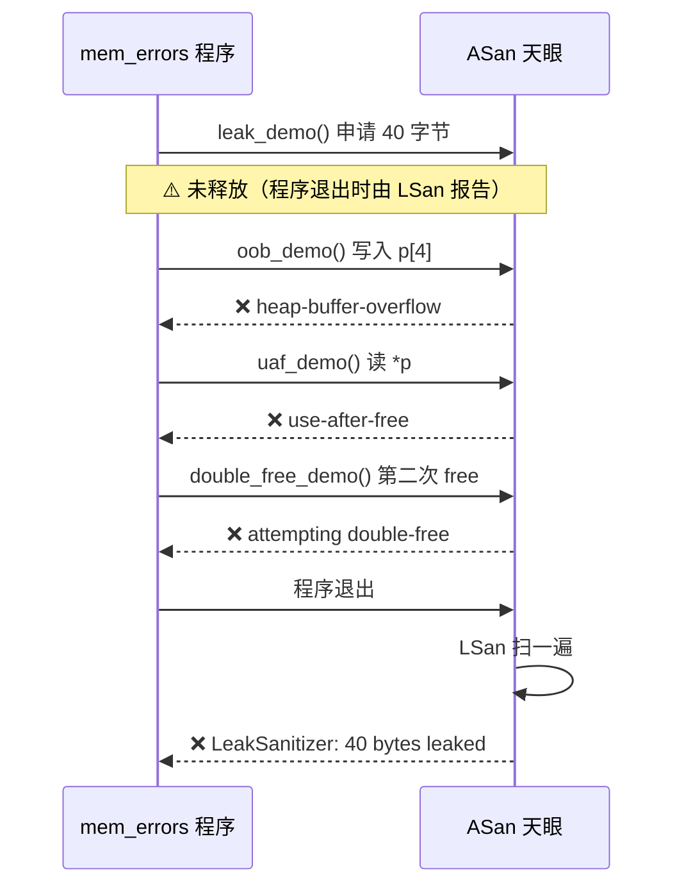
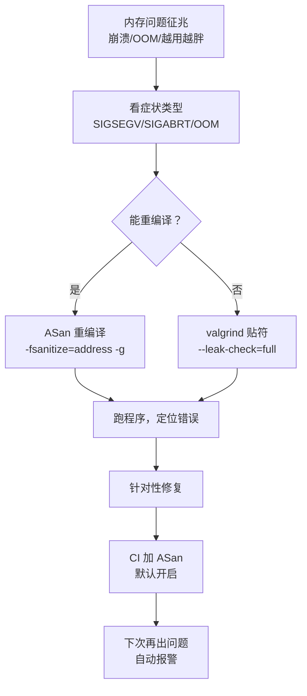

# 【金丹·82】内存泄漏怎么查：valgrind和ASan

> **码农修仙传 · 金丹期 · 第82篇**
> 我是玄芯散人，带你从炼气修到大乘。

---

## 境界标识

```
╔══════════════════════════════════╗
║     金丹期 · 第82篇              ║
║     内存泄漏怎么查：valgrind和ASan ║
║     memcheck / AddressSanitizer  ║
║     内存错误排查流程              ║
║     预计阅读：30分钟              ║
╚══════════════════════════════════╝
```

---

## 修仙引入

上一篇 081 给金丹弟子配齐了「望气大术」：perf stat 看硬件计数器，火焰图定位热点函数，cache-misses 揪出访存瓶颈。可修真界还有一件更头疼的事：弟子写代码时申请内存，跑完忘记 free，进程越跑越胖，戒律堂长老称之为「灵气泄漏」。跑久了，灵气耗尽，系统报 OOM（Out Of Memory）杀进程。

更阴险的是「野指针」。free 完的指针还拿去用，进程偶尔崩一次，重启又正常，戒律堂把这种「神出鬼没」的现象叫做「灵鬼缠身」。内存已经收了回去，弟子却以为还在，凭空往已释放的灵田里写入灵符，要么直接段错误，要么静默地毁了旁边的数据。

这一篇配两件专克内存问题的法器：戒律堂的「净坛符」（valgrind memcheck），不需重编译就能照出所有泄漏；炼器堂的「天眼符」（ASan，Address Sanitizer），编译时嵌入探针，跑一遍就能把内存里的越界、释放后使用这些毛病揪出来。配齐这两件，再有人问「我的程序内存越用越多」或者「偶尔崩一下像野指针」，你能直接掏出来给一发。

---

## 硬核主体

### 内存错误的四大门派

修真界把内存错误归为四类，搞清楚这四类是排查的第一步。

第一类，内存泄漏（Memory Leak）。malloc / new 申请了内存，但对应的 free / delete 没写，或者写在了不会执行的分支（异常分支提前 return，或者 break 跳出循环跳过释放）。进程越跑越胖，最后 OOM。这是「灵气泄漏」。

第二类，缓冲区越界（Buffer Overflow / Out-of-bounds Access）。可能是数组下标越界，可能是 C 字符串忘记留 `\0` 的位置，也可能是写满缓冲区多写了一个字节。这种错误有时候立刻段错误，有时候静默踩到别的变量，几年后才发现数据莫名其妙算错。ASan 把它细分为「堆缓冲区越界」（heap-buffer-overflow）和「栈缓冲区越界」（stack-buffer-overflow）。

第三类，Use-After-Free（UAF）。free 完指针还拿去用。这是修真界最阴险的「灵鬼缠身」，内存已经归还给系统，但你的指针还以为它活着，往里写一字节，下次 malloc 又把它分给别的弟子，旧数据被覆盖，调试时已经找不到凶器。

第四类，Double Free。同一块内存 free 两次。glibc 的 ptmalloc 会给最近释放的 chunk 头部写链表指针，第二次 free 时它顺着链表走，链表指针已经指向别的内存，于是整个堆结构被踩乱。后果是「此刻不崩，半小时后随机崩」。

修真比喻：把这四类对应到戒律堂的案件分类，泄漏是「欠债不还」（资源申请了没归还），越界是「闯入禁区」（写到不属于你的地址），UAF 是「人已逝、魂魄未散」（目标内存已还，却还往里写），double free 是「同一人被宣告两次死亡」（glibc 链表被踩乱）。

知道是四类中的哪一类之后，下一步是选兵器：valgrind 还是 ASan。

### 净坛符：valgrind memcheck

valgrind 是一套 Linux 下的动态排查工具集，由 Julian Seward 博士 2000 年前后开发。它通过把程序的每一条指令在「影子 CPU」上重跑一遍，让每一条内存访问都先经过 valgrind 的检查。代价是程序会慢 10 到 50 倍，所以 valgrind 不适合在生产环境跑，只适合在测试环境或开发机上跑。

修真比喻：valgrind 是戒律堂的「净坛符」。弟子一旦贴上这道符，他做的每一步操作都被符上记录的「法阵」盯住。无论申请灵气（malloc）还是释放灵气（free），无论写入灵田（store）还是读取灵田（load），每一步都要查「这一步是不是合法」。代价是弟子动作变慢 10 到 50 倍，泄漏也好、越界也好、UAF 也好、double free 也好，都会被符录下来，事后给弟子一份清单。

memcheck 是 valgrind 默认的子工具，专门盯内存错误。基础用法：

```bash
# 编译时记得带 -g 把调试符号加上，输出才能显示行号
$ gcc -g program.c -o program

# 跑 valgrind
$ valgrind --leak-check=full --show-leak-kinds=all ./program

# 输出示例（精简版）
==12345== Memcheck, a memory error detector
==12345== Copyright (C) 2002-2022, and GNU GPL'd, by Julian Seward et al.
==12345== Using Valgrind-3.22.0 and LibVEX; rerun with -h for copyright info
==12345== Command: ./program
==12345==
==12345== HEAP SUMMARY:
==12345==     in use at exit: 40 bytes in 1 blocks
==12345==   total heap usage: 5 allocs, 4 frees, 80 bytes allocated
==12345==
==12345== 40 bytes in 1 blocks are definitely lost in loss record 1 of 1
==12345==    at 0x4C2AB05: malloc (vg_replace_malloc.c:442)
==12345==    by 0x4005A3: leaky_func (program.c:12)
==12345==    by 0x4005C8: main (program.c:25)
==12345==
==12345== LEAK SUMMARY:
==12345==    definitely lost: 40 bytes in 1 blocks
==12345==    indirectly lost: 0 bytes in 0 blocks
==12345==      possibly lost: 0 bytes in 0 blocks
==12345==    still reachable: 32 bytes in 1 blocks
==12345==         suppressed: 0 bytes in 0 blocks
==12345== ERROR SUMMARY: 1 errors from 1 contexts (suppressed: 0 from 0)
```

修真比喻对应到每一项输出：

`HEAP SUMMARY`（堆汇总）：弟子一共申请了 5 次灵气（allocs），释放了 4 次（frees），程序结束时还占用 40 字节（in use at exit）。这是「灵气收支总账」。

`total heap usage: 5 allocs, 4 frees`：申请 5 次、释放 4 次。差 1 次就是泄漏。

`LEAK SUMMARY`（泄漏汇总）把泄漏按级别分类，valgrind 把泄漏分为四档：

- `definitely lost`（明确泄漏）：申请了，所有指针都丢了，程序再也无法访问它。修真比喻是「灵田荒废，再无人耕作」。这是最严重的泄漏。
- `indirectly lost`（间接泄漏）：被一个已经 definitely lost 的指针指向的内存。比如父结构泄漏，它指向的子结构也算间接泄漏。
- `possibly lost`（可能泄漏）：valgrind 不确定，可能是，也可能内部指针还在但找不到。谨慎处理。
- `still reachable`（仍可访问）：程序结束时还能通过全局指针访问，没释放但也没泄漏。修真比喻是「灵田有人管，只是没收尾」。修真界一般不认为这是错误，但严格项目会要求释放。

修真比喻对应到内存错误日志：`at 0x4C2AB05: malloc (vg_replace_malloc.c:442)` 告诉你泄漏点发生在 `malloc` 调用；`by 0x4005A3: leaky_func (program.c:12)` 告诉你调用 `malloc` 的 C 代码在 `program.c` 第 12 行。顺着这条线索直接定位。

实战案例一：用 valgrind 查泄漏。

```c
// leak_demo.c - 一个有泄漏的示例
#include <stdio.h>
#include <stdlib.h>
#include <string.h>

void leaky_func() {
    char *p = malloc(40);
    strcpy(p, "这是一段占内存的文字");
    printf("%s\n", p);
    // 忘了 free(p)
}

int main() {
    leaky_func();
    return 0;
}
```

修真比喻对应到这段 C 代码：弟子申请了 40 字节的灵田，写了点东西进去，然后就走掉了，灵田没收回来。修真界叫「溜单」，戒律堂称「欠债不还」。

跑 valgrind：

```bash
$ gcc -g leak_demo.c -o leak_demo
$ valgrind --leak-check=full --show-leak-kinds=all ./leak_demo
```

修真比喻对应到这一步：给弟子贴上净坛符，看他跑一遍结束后，灵田有没有被全部归还。结果会显示 40 字节 definitely lost，泄漏点在 `leaky_func` 第 5 行的 `malloc` 调用。补上 `free(p)` 之后泄漏归零。

常用选项：

```bash
# 显示每一种泄漏类型的详细位置
$ valgrind --leak-check=full --show-leak-kinds=all ./program

# 只查泄漏，不查越界（更快）
$ valgrind --leak-check=yes ./program

# 跟踪子进程
$ valgrind --trace-children=yes ./program

# 输出到文件
$ valgrind --log-file=valgrind_report.txt ./program
```

修真比喻对应到这些选项：`--leak-check=full` 是「详细查账」，把每一笔泄漏的申请位置都列出来；`--show-leak-kinds=all` 是「所有欠债类型都报」（definitely / indirectly / possibly / reachable 四档）；`--trace-children=yes` 是「弟子收的徒弟也一并查」。

### 天眼符：AddressSanitizer

AddressSanitizer（ASan）是 Google 在 2009 年前后开始研发、2012 年公开的编译器插桩工具。它通过在编译时往代码里插入「探针」（运行时检查），让每一次内存访问都先做合法性检查。和 valgrind 不同，ASan 不需要单独的进程，它直接在程序运行时检查。代价是程序会慢 2 到 3 倍，内存占用增加 2 到 3 倍。

修真比喻：ASan 是炼器堂的「天眼符」。弟子炼器（编译）时，符就被刻进法器（可执行文件）。一旦法器被启动，每一步读写都被天眼盯住：写灵田前先查「这块灵田是不是你的」「是不是已经还了」。代价是法器变慢 2 到 3 倍，但跑完就知道哪里有内存问题。

基础用法：

```bash
# 编译时带上 -fsanitize=address 和 -g
$ gcc -fsanitize=address -g program.c -o program

# 跑程序，出错会自动报
$ ./program

# 输出示例（堆缓冲区越界）
==12345==ERROR: AddressSanitizer: heap-buffer-overflow on address 0x6020000000d4
WRITE of size 4 at 0x6020000000d4 thread T0
    #0 0x4005a3 in main program.c:8
    #1 0x7f8b... in __libc_start_main
0x6020000000d4 is located 0 bytes to the right of 4-byte region [0x6020000000d0,0x6020000000d4)
allocated by thread T0 here:
    #0 0x4c2ab05 in malloc (asan_malloc.c:43)
    #1 0x400580 in main program.c:5
SUMMARY: addressSanitizer: heap-buffer-overflow program.c:8
```

修真比喻对应到这段输出：`heap-buffer-overflow` 是「写入禁区」；`WRITE of size 4 at 0x6020000000d4` 是「在天眼地址处写了 4 字节」；`is located 0 bytes to the right of 4-byte region` 是「这块灵田只有 4 字节大，你恰好写在最后一个字节之外 0 字节处」，也就是数组下标恰好越界 1 的典型场合。ASan 还把「这块灵田是谁分配的」也告诉你，看 `allocated by thread T0 here`，顺藤摸瓜追到 `main program.c:5` 的 `malloc`。

修真比喻对应到 ASan 能查的错误类型：堆缓冲区越界（heap-buffer-overflow）、栈缓冲区越界（stack-buffer-overflow）、全局缓冲区越界（global-buffer-overflow）、use-after-free（释放后使用）、use-after-scope（作用域外使用）、use-after-return（栈帧回收后使用）、double-free（双重释放）、invalid-free（释放非堆指针）、alloc-dealloc-mismatch（new/delete 和 malloc/free 不匹配）。这是 ASan 的全套家底。

实战案例二：用 ASan 查越界。

```c
// oob_demo.c - 数组下标越界
#include <stdio.h>
#include <stdlib.h>

int main() {
    int *p = malloc(4 * sizeof(int));   // 申请 4 个 int
    p[4] = 42;                          // ⚠️ 越界！只申请了 4 个，写到第 5 个
    printf("p[4] = %d\n", p[4]);
    free(p);
    return 0;
}
```

修真比喻对应到这段 C 代码：弟子申请了 4 块灵田（4 个 int），却要在第 5 块上写入数据。戒律堂称「闯入禁区」。

跑 ASan：

```bash
$ gcc -fsanitize=address -g oob_demo.c -o oob_demo
$ ./oob_demo
```

修真比喻对应到这一步：法器启动，天眼立刻抓住「弟子正在写入禁区」。ASan 会在程序结束时打印「heap-buffer-overflow on WRITE of size 4」并附上调用栈和分配点。

实战案例三：用 ASan 查 use-after-free。

```c
// uaf_demo.c - 释放后使用
#include <stdio.h>
#include <stdlib.h>

int main() {
    int *p = malloc(sizeof(int));
    *p = 100;
    free(p);
    printf("p = %d\n", *p);   // ⚠️ use-after-free
    return 0;
}
```

修真比喻对应到这段 C 代码：弟子先申请一块灵田，再往里播种，free 完还往已经收割的灵田里去看（读）。天眼会立刻报「use-after-free」并告诉你这块灵田是哪一行 malloc 出来的。

ASan 默认在 Linux 上同时启用 LeakSanitizer（LSan）。LSan 专门查泄漏，程序退出时扫一遍，看哪些 malloc 没对应的 free 并报出来。注意 macOS 上 LSan 默认是关闭的（detect_leaks=0），因为系统库本身会泄漏，容易误报。如果只想用 ASan 不要 LSan，加环境变量关掉：

```bash
# 关闭 LSan（只要越界和 UAF，不要泄漏）
$ ASAN_OPTIONS=detect_leaks=0 ./program

# ASan 默认遇到第一个错误就停（halt_on_error=1），
# 要一次跑完把全部错都收上来再停，就关掉 halt_on_error
$ ASAN_OPTIONS=halt_on_error=0 ./program

# 输出详细日志到文件
$ ASAN_OPTIONS=log_path=asan.log ./program
```

修真比喻对应到这些选项：`detect_leaks=0` 是「只看越界和 UAF，泄漏就不报了」；`halt_on_error=0` 是「这一轮不要立刻拉去戒律堂，让他继续往下试，把所有犯规一次性记完」；`log_path` 是「把符录写进专门的卷宗」。

### 净坛符 vs 天眼符：选哪一件

修真界对这两件法器的对比是入门弟子的必修课：

| 对比项 | valgrind memcheck | ASan |
|------|------------------|------|
| 原理 | 运行时翻译（dynamic translation） | 编译时插桩（compile-time instrumentation） |
| 速度代价 | 10 到 50 倍慢 | 2 到 3 倍慢 |
| 内存占用 | 2 到 3 倍 | 2 到 3 倍 |
| 是否需要重编译 | 不需要 | 必须带 `-fsanitize=address` |
| 泄漏检测 | 详细，分四档 | LSan 子模块，分类较粗 |
| 越界检测 | 栈越界较粗，堆越界中等 | 堆/栈/全局都细致 |
| UAF / double free | 支持 | 支持，且常报得比 valgrind 早 |
| 适合场合 | 没法重编译的二进制（如生产事故复现） | 开发期、测试期、CI |

修真比喻：valgrind 是「贴符」，不需要动程序本身，运行时翻译所以慢，但凡查到的都是真实错误，适合「我这程序跑线上崩一次，把它的二进制拷下来贴符查一遍」；ASan 是「刻符」，编译时就把符刻进可执行文件，跑得快，CI 里天天跑都行，但前提是你有源码。

实战选型建议：开发期把 ASan 默认打开，写代码时随手就抓到问题；测试期 CI 加 ASan + LSan 的编译流水线；不方便重编译的场合，比如生产事故复现、二进制没有源码，就用 valgrind 贴上符慢慢查。

修真比喻对应到一些坑：valgrind 跑在 32 位进程上时，栈越界不一定能查到，因为默认栈大小探测有偏差；ASan 在 32 位 Windows 上覆盖不周，推荐 64 位 Linux 跑；ASan 在 macOS 上能用，但 malloc 拦截有时会被某些工具链绕过。

### 实战案例：四类错误一次查清

把上面几件兵器串起来，跑一遍真实案例。

场合：C 程序 `mem_errors.c`，混合了四类错误，看 ASan 怎么把它们一并揪出来。

```c
// mem_errors.c - 混合四类内存错误
#include <stdio.h>
#include <stdlib.h>
#include <string.h>

void leak_demo() {
    char *p = malloc(40);
    strcpy(p, "泄漏示例");
    // 漏掉 free(p)
}

void oob_demo() {
    int *p = malloc(4 * sizeof(int));
    p[4] = 42;                 // 越界
    free(p);
}

void uaf_demo() {
    int *p = malloc(sizeof(int));
    *p = 100;
    free(p);
    printf("%d\n", *p);        // use-after-free
}

void double_free_demo() {
    int *p = malloc(sizeof(int));
    free(p);
    free(p);                   // double free
}

int main() {
    leak_demo();
    oob_demo();
    uaf_demo();
    double_free_demo();
    return 0;
}
```

修真比喻对应到这段代码：四个弟子各自犯一种错，戒律堂要把他们全揪出来。

第一步，编译带 ASan 跑：

```bash
$ gcc -fsanitize=address -g mem_errors.c -o mem_errors
$ ./mem_errors
```

修真比喻：法器刻上天眼，启动后四件案子一起报案。ASan 会按发生顺序打印：

1. `heap-buffer-overflow` 在 `oob_demo` 的第 13 行 `p[4] = 42`。
2. `use-after-free` 在 `uaf_demo` 的第 21 行 `*p`。
3. `attempting double-free` 在 `double_free_demo` 的第 27 行 `free(p)`。
4. `LeakSanitizer: detected memory leaks` 在程序退出时报 40 字节泄漏，来自 `leak_demo` 第 7 行 `malloc`。

修真比喻对应到这四件案子：戒律堂一口气把四类错误全抓获，省去一个个排查的时间。

第二步，valgrind 再补一遍：

```bash
$ gcc -g mem_errors.c -o mem_errors_noasan    # 不要带 -fsanitize
$ valgrind --leak-check=full ./mem_errors_noasan
```

修真比喻：再用净坛符慢慢查，看有没有 ASan 漏掉的细节。valgrind 的泄漏报告会按四档分（definitely / indirectly / possibly / still reachable），UAF 报告会显示哪块内存被 free 之后又写入。两者配合能查得很全。

第三步，定位修复：

修真比喻对应到动手之处：

- 泄漏：补 `free(p)`，或者改成返回指针让调用者 free。
- 越界：检查数组下标，确认分配大小和访问下标。
- UAF：free 后立刻把指针置 NULL（C++ 用智能指针）。
- double free：free 后立刻置 NULL，或者用智能指针。

把四类错误画成 mermaid 时序图，看 ASan 怎么一件件报：



修真比喻对应到这个时序图：弟子每犯一次错，天眼就当场叫停一次；最后离开戒律堂时还要补一次「离堂账目审查」（LSan）。四类错一件不漏。

### 排查流程：怎么入手

修真界对新弟子的标准排查顺序是：

第一步，确认症状。程序崩溃？是段错误（SIGSEGV）还是 abort（SIGABRT）？还是内存越用越多被 OOM Killer 杀？先看 `dmesg`（Linux 内核日志）有没有 OOM 记录；崩溃时看 core dump。

第二步，启用 ASan 重编译。开发期默认 `-fsanitize=address -g`，跑一遍回归测试，定位错误位置。

第三步，valgrind 补查。开发期如果 ASan 没漏过但线上出问题，多半是「编译时信息丢失」（比如 release 编译做了 LTO）或「运行环境特殊」（glibc 版本差异）。这种场合用 valgrind 贴符慢慢查，能看到 ASan 抓不到的边角细节。

第四步，针对性修复。修真界有句老话：「找到了就算修了八成」。修真界不鼓励「猜修」，看到 ASan 报 `oob_demo.c:13` 就去改第 13 行，不要凭印象乱改一通。

第五步，加 CI。把 `-fsanitize=address` 加到 CI 流水线，每次合并都跑一遍。这是戒律堂给整座山头装的「自动警戒阵」。

把排查流程画成 mermaid 流程图：



修真比喻对应到这个流程图：先看弟子犯了哪种案（症状），能重炼法器就用天眼符（ASan），不能就用净坛符（valgrind），抓住凶手后动手修，再把警戒阵刻进宗门法规（CI）。

---

## 修仙术语对照表

| 修仙术语 | 技术现实 | 本篇位置 |
|---------|---------|---------|
| 净坛符 | valgrind memcheck | valgrind 介绍 |
| 天眼符 | AddressSanitizer（ASan） | ASan 介绍 |
| 灵气泄漏 | 内存泄漏（memory leak） | 四类错误 |
| 闯入禁区 | 缓冲区越界（buffer overflow） | 四类错误 |
| 灵鬼缠身 | Use-After-Free（UAF） | 四类错误 |
| 双重宣告死亡 | Double Free | 四类错误 |
| 影子 CPU | valgrind 的运行时翻译 | valgrind 原理 |
| 符上刻的法阵 | ASan 编译时插桩 | ASan 原理 |
| 明确欠债（definitely lost） | 指针全丢，无法访问 | valgrind 泄漏分级 |
| 间接欠债（indirectly lost） | 父结构泄漏连带子结构 | valgrind 泄漏分级 |
| 可能欠债（possibly lost） | valgrind 不确定是否泄漏 | valgrind 泄漏分级 |
| 仍可追讨（still reachable） | 全局指针还在指向 | valgrind 泄漏分级 |
| 警戒阵 | CI 自动跑 ASan | 排查流程 |
| 离堂账目审查 | LeakSanitizer（LSan） | ASan 子模块 |

---

## 进阶条件

看完这一篇到能向别人讲清「内存问题排查选工具到定位修复的全流程」，差这几条：

- [ ] 能讲清四类内存错误各自的触发场景和具体行为差异
- [ ] 能讲清 valgrind memcheck 的 `--leak-check=full --show-leak-kinds=all` 各代表什么
- [ ] 能讲清 valgrind 泄漏分四档（definitely / indirectly / possibly / reachable）各自含义
- [ ] 能讲清 ASan 的 `-fsanitize=address -g` 编译选项和默认启用的子模块（LSan）
- [ ] 能用 `ASAN_OPTIONS=detect_leaks=0` 单独关掉 LSan
- [ ] 能讲清 valgrind 和 ASan 的速度差异（10-50x vs 2-3x）和适用场合
- [ ] 能讲清「能重编译用 ASan、不能重编译用 valgrind」的选型原则
- [ ] 能把 ASan 加进 CI 流水线

> 最后一条是金丹期对「内存问题排查」的「分水岭」。面试里被问「内存泄漏怎么查」，能直接说出「开发期 ASan 默认打开，CI 加 ASan + LSan 流水线；线上事故用 valgrind 贴符查；按四类错误看 ASan 报错位置针对性修」，这一关就过了。

---

## 下期预告 + 互动

081 把 perf 工具链讲过，080 把 gdb / strace 讲过，076 把 CPU 缓存塔讲过。这一篇把 valgrind 和 ASan 两件内存法器讲一遍，把四类错误和排查流程都串起来。

修真界还有一件大事：弟子自己写的代码跑得好好的，可一旦要和别人写的代码拼到一起，链接器就报错，提示某个函数找不到。这就是「静态库和动态库」的坑。下一篇 083 进系统编程实战组，围绕库的设计、生成与加载这条链路展开。看完了，再有人说「undefined reference」「multiple definition」「version `GLIBCXX_3.4.21' not found」，你能直接给他拆出库和符号的关系。

现在问你：

> 🔍 在你的 Linux 机器上写一段简单的泄漏代码（参考实战案例一），先 `gcc -g` 普通编译跑一遍，再用 `valgrind --leak-check=full` 跑一遍，看 LEAK SUMMARY 的四档分类填的是什么。再用 `gcc -fsanitize=address -g` 编译跑一遍，看 ASan 报的「LeakSanitizer」和 valgrind 的「definitely lost」是不是同一块内存。评论区报一下两种工具的输出对比。

> ⚙️ 写一段混合四类错误的代码（参考实战案例 mem_errors.c），用 ASan 跑一遍，看四类错误是不是都被抓到。然后把 `-g` 去掉（`-O2 -fsanitize=address`）重编译跑一遍，看报错位置还能不能定位到行号。` -g` 在 ASan 里到底起什么作用？

> ⚙️ 在你的项目里加一个 `Makefile`（或 `CMakeLists.txt`）的 debug 目标，编译选项带 `-fsanitize=address -g -O0`，跑一遍测试套。开发期的 ASan 默认编译要不要每次都开？开 ASan 对 runtime 性能拖累你能不能接受？

> 评论区聊聊你被内存问题坑过的经历，或者跟 valgrind / ASan 打过的交道。

> 我是玄芯散人，带你从炼气修到大乘。

---

*本文是「码农修仙传」系列第82篇。系列导航见 [xren.ren](https://xren.ren)*