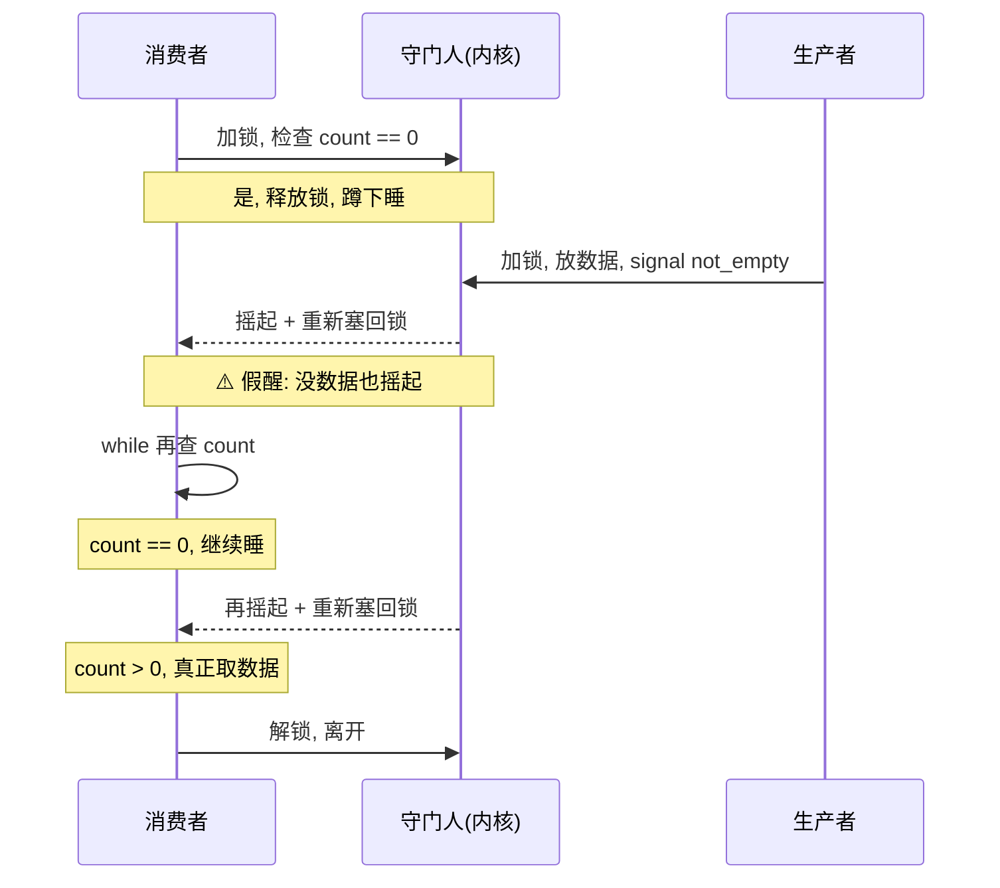
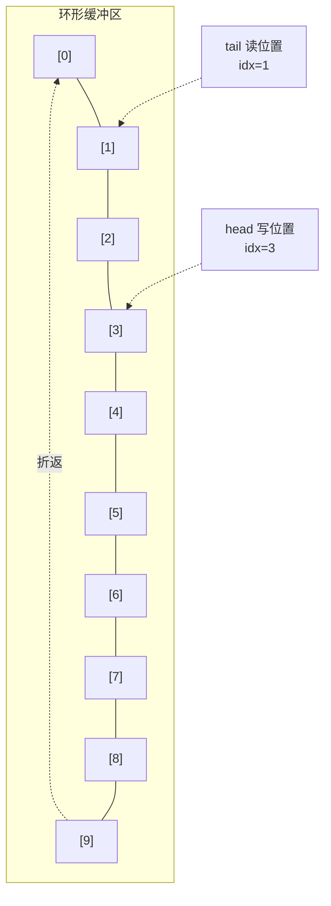
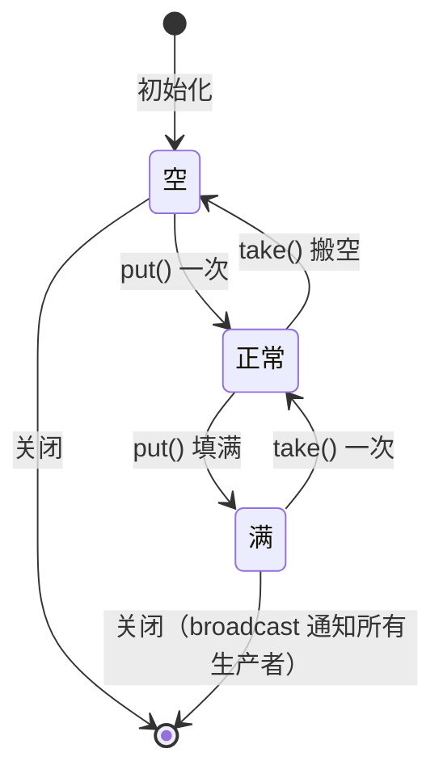

# 【金丹·83】多线程编程实战：生产者消费者

> 码农修仙传 · 金丹期 · 第83篇
> 我是玄芯散人，带你从炼气修到大乘。

---

## 境界标识

```
╔══════════════════════════════════╗
║     金丹期 · 第83篇              ║
║     多线程编程实战                ║
║     生产者消费者                  ║
║     mutex + condvar 实现          ║
║     虚假唤醒 / 环形缓冲           ║
║     预计阅读：30分钟              ║
╚══════════════════════════════════╝
```

---

## 修仙引入

上一篇 082 把戒律堂的净坛符（valgrind）和炼器堂的天眼符（ASan）配齐，弟子写的代码灵气泄漏还是越界，跑一遍就能揪出来。可修真界里还有一类麻烦，工具箱里现有的兵器都查不出来：弟子写的代码逻辑没问题，单独跑也对，放到多线程里就抽风，时灵时不灵，重启又正常，戒律堂把这种「灵脉紊乱」叫做并发 bug。

修真界遇到过的处境：一位弟子负责在灵矿边采灵石（生产者），另一位弟子负责把灵石搬到仓库（消费者）。两人共用一条传送带。采多了传送带堆不下，搬快了传送带空转。最笨的办法是两人互相喊一声「别采了」或「别搬了」。喊的人多了，嗓子哑了不说，喊早喊晚都出岔子。修真界把这件差事叫「生产者消费者」问题。073 讲过 mutex 是什么、futex 怎么实现的，077 讲过锁家族怎么挑，078 讲过死锁怎么破。这一篇把那三篇当作前置，直接动手：用 mutex 加条件变量（condvar）写一个能跑的生产者消费者，把路上踩到的坑一个个摆出来。

这一篇里出现的概念，比如「线程安全」「互斥」「阻塞通知」「死锁」，073 / 077 / 078 都讲过，这里只引用不重复。083 是实战篇，重点在「把代码写出来能跑」和「路上踩过的坑」。

---

## 硬核主体

### 生产者消费者套路：修真界的物流链

先把套路摆出来。修真界的物流链路靠三方协作：生产者负责往缓冲区塞数据，消费者负责从缓冲区往外搬，缓冲区就是那条传送带。生产者多了数据塞不下，消费者多了缓冲区空转。这里头有两个硬约束：

硬约束一，缓冲区有上限。修真界把传送带长度固定下来（比如 100 块灵石位），塞满了生产者必须等。

硬约束二，缓冲区不能空取。传送带空了消费者必须等。

硬约束翻译成代码语言：生产者往里写数据，写到上限就阻塞；消费者往外取数据，取到 0 就阻塞；写和取要互斥，不能两人同时动同一块灵石。

把这条物流链路画成 mermaid 图：


修真比喻：两位弟子共用一条传送带。采灵弟子把灵石放到传送带上，搬灵弟子从传送带上拿走灵石。传送带固定 100 个位置，放满了采灵弟子就得蹲在传送带前等；搬空了搬灵弟子也得蹲在传送带前等。两人都不会去动对方手里的灵石（互斥）。

修真界里这种套路用得很广。比如日志库一个线程写日志、另一个线程把日志刷到磁盘。再比如数据库有写入线程把数据塞进缓冲池，刷盘线程把脏页写回硬盘。音视频处理里采帧线程塞帧、编码线程取帧。网络服务器里接收线程塞请求、工作线程取请求。每一个跑得稳的多线程程序，背后几乎都蹲着一套生产者消费者的安排。

### 第一版：能跑就行

直接上代码。这一版起两个生产者、两个消费者，缓冲区容量 10。

```c
// pc_v1.c - 第一版生产者消费者
// 编译：gcc -pthread pc_v1.c -o pc_v1
#include <stdio.h>
#include <stdlib.h>
#include <string.h>
#include <pthread.h>
#include <unistd.h>

#define CAPACITY 10
#define ITEM_COUNT 100   // 每个生产者生产多少件

int buffer[CAPACITY];    // 共享缓冲区
int count = 0;           // 当前缓冲区里有几件

pthread_mutex_t mutex = PTHREAD_MUTEX_INITIALIZER;
pthread_cond_t  not_full  = PTHREAD_COND_INITIALIZER;   // 缓冲区不满的信号
pthread_cond_t  not_empty = PTHREAD_COND_INITIALIZER;   // 缓冲区不空的信号

void put(int item) {
    pthread_mutex_lock(&mutex);
    while (count == CAPACITY)              // ⚠️ 用 while 不用 if，详见后文
        pthread_cond_wait(&not_full, &mutex);
    buffer[count] = item;
    count++;
    pthread_cond_signal(&not_empty);       // 通知消费者「不空了」
    pthread_mutex_unlock(&mutex);
}

int take() {
    pthread_mutex_lock(&mutex);
    while (count == 0)                     // ⚠️ 同样 while
        pthread_cond_wait(&not_empty, &mutex);
    int item = buffer[count - 1];
    count--;
    pthread_cond_signal(&not_full);        // 通知生产者「不满」
    pthread_mutex_unlock(&mutex);
    return item;
}

void *producer(void *arg) {
    for (int i = 0; i < ITEM_COUNT; i++) {
        int item = rand() % 1000;
        put(item);
        printf("[P%ld] put %d\n", (long)arg, item);
    }
    return NULL;
}

void *consumer(void *arg) {
    for (int i = 0; i < ITEM_COUNT; i++) {
        int item = take();
        printf("[C%ld] take %d\n", (long)arg, item);
    }
    return NULL;
}

int main() {
    pthread_t p1, p2, c1, c2;
    pthread_create(&p1, NULL, producer, (void *)1);
    pthread_create(&p2, NULL, producer, (void *)2);
    pthread_create(&c1, NULL, consumer, (void *)1);
    pthread_create(&c2, NULL, consumer, (void *)2);
    pthread_join(p1, NULL);
    pthread_join(p2, NULL);
    pthread_join(c1, NULL);
    pthread_join(c2, NULL);
    return 0;
}
```

修真比喻对应到代码里几件紧要物事：

`pthread_mutex_t mutex` 是传送带上的「令牌」。同一时刻只有一位弟子能碰传送带上的灵石（操作共享变量 count 和 buffer[]）。这是 073 讲过的 mutex，修真界叫「戒律堂令牌」。

`pthread_cond_t not_full` 是「传送带还没满」的灵符。守门人（系统内核）把符贴在门上，传送带没满时把符点亮，采灵弟子看见符亮就把灵石放上去。`pthread_cond_wait(&not_full, &mutex)` 是「我把令牌交给守门人，等传送带不满再叫我」。

`pthread_cond_t not_empty` 是「传送带不空」的灵符。搬灵弟子等这个符亮。

修真比喻对应到 `pthread_cond_signal` 这一行：采灵弟子放完灵石喊一声「传送带不空了」，搬灵弟子听见就起身。`pthread_cond_signal` 只喊一个，`pthread_cond_broadcast` 会喊所有等在那个门前的弟子。

修真比喻对应到 `pthread_cond_wait` 内部：弟子把令牌交给守门人（解锁 mutex），自己蹲在门前睡。等守门人喊他时，守门人会先把令牌塞回他手里（重新加锁 mutex），他再继续干。这一来一回都是原子操作，戒律堂专门盯着。这就是 condvar 必须配 mutex 用的原因。

修真界把这一段写完，先跑一下：

```bash
$ gcc -pthread pc_v1.c -o pc_v1
$ ./pc_v1
[P1] put 383
[P2] put 886
[C1] take 383
[C1] take 886
...
```

四个线程抢同一块传送带，输出顺序看着乱，但每件灵石都被采、被搬一次，没多没少。第一版就这样，能跑。

### 虚假通知：为什么是 while 不是 if

第一版代码里有两个 `while`，不是 `if`。这是修真界新手最容易踩的坑，必须单独拎出来讲。

修真比喻：弟子蹲在门前睡，等守门人喊。可守门人不一定只在「传送带不空」时才喊弟子。有时候守门人自己眼花（系统内核的伪通知 spurious wakeup），有时候守门人听见别的弟子喊错了就顺手摇一下这位弟子（其他线程的 condvar_broadcast 顺带波及）。弟子起身不能立刻动手，必须先睁眼看一眼传送带：传送带不空才搬，空了继续睡。

POSIX 标准里 `pthread_cond_wait` 的描述就写了「may return prematurely」，意思是 condvar_wait 可能因为伪通知提前返回。这时候如果代码写的是：

```c
if (count == 0)
    pthread_cond_wait(&not_empty, &mutex);
int item = buffer[count - 1];   // ⚠️ 伪通知后 count 还是 0，越界！
```

弟子被喊后没看传送带，直接伸手去搬，结果传送带是空的，弟子搬了个寂寞（数组下标变成 -1，访问越界）。这就是修真界里挂了号的「假醒真摔」。

修真界里用 while 循环修这一手：

```c
while (count == 0)                     // 起身再查一次
    pthread_cond_wait(&not_empty, &mutex);
int item = buffer[count - 1];
```

起身睁眼一看，传送带还空，继续睡。再起身再查，直到传送带真的不空才动手。while 循环把假醒挡在外面。

把这一段画成 mermaid 时序图，看弟子和守门人之间的握手：



修真比喻对应到这一段时序：搬灵弟子蹲下睡，被摇起一次不算数，要睁眼看传送带；空了再睡，再摇再查，直到真的看见灵石才伸手搬。这是 while 的全部用处。

修真界有句老话：「condvar 永远配 while，不要问为什么，问就是历史上有太多人写 if 摔过。」

### 环形缓冲区：传送带不用从头走

第一版的 buffer 是普通数组：

```c
int buffer[CAPACITY];
int count = 0;
```

生产者总是往 buffer[count] 写，消费者总是从 buffer[count - 1] 取。这种写法能跑，但每次取完一件后 count 减一，下次取要访问 buffer[count - 1]，等于从传送带尾端拿。

修真比喻：传送带是单向的，采灵弟子从传送带尾端放，搬灵弟子也从传送带尾端拿。每拿一次，传送带上的「剩余尾端」往前挪一位。这种「只从一端拿」的写法叫 LIFO 栈，不是真正的传送带。真正的传送带是 FIFO：先放进去的先拿出来。

修真界把传送带做成环形：采灵弟子绕着传送带走，放满了回到起点继续放；搬灵弟子也绕着走，搬完了回到起点继续搬。

```c
// ring_buffer.c - 环形缓冲区实现
#define CAPACITY 10

typedef struct {
    int data[CAPACITY];
    int head;     // 写位置
    int tail;     // 读位置
    int size;     // 当前元素数量
} ring_buffer_t;

void rb_init(ring_buffer_t *rb) {
    memset(rb, 0, sizeof(*rb));
}

int rb_is_full(ring_buffer_t *rb)  { return rb->size == CAPACITY; }
int rb_is_empty(ring_buffer_t *rb) { return rb->size == 0; }

void rb_put(ring_buffer_t *rb, int item) {
    rb->data[rb->head] = item;
    rb->head = (rb->head + 1) % CAPACITY;   // 到尾巴折返起点
    rb->size++;
}

int rb_take(ring_buffer_t *rb) {
    int item = rb->data[rb->tail];
    rb->tail = (rb->tail + 1) % CAPACITY;   // 同样折返
    rb->size--;
    return item;
}
```

修真比喻对应到这段代码：`head` 是采灵弟子的当前位置，`tail` 是搬灵弟子的当前位置。两人绕着传送带走一圈，到末尾时 `(idx + 1) % CAPACITY` 自动折返到起点。环形缓冲区的精髓就在那个取模运算。

修真比喻对应到 `size` 字段：有 `head` 和 `tail` 不就够了，为什么还要 `size`？因为 `head == tail` 在两种情况下都成立：传送带空了（head 和 tail 重合）和传送带满了（head 追上 tail）。光看 head 和 tail 分不出空和满，加一个 size 字段就能区分。这叫「环形缓冲区空满判定」。

把环形缓冲区的读写画成 mermaid 流程图：



修真比喻对应到这张图：head 指着下一个要写的位置（这里是 [3]），tail 指着下一个要读的位置（这里是 [1]）。两人之间 [1] [2] 是当前传送带上的灵石。采灵弟子每写一件 head 就往前走一格，搬灵弟子每搬一件 tail 也往前走一格，谁也不会去动对方的位置。

修真界把第一版的 LIFO 栈换成环形 FIFO 传送带，整个物流链路就顺了。

### 第二版：环形缓冲区 + condvar

把环形缓冲区和 condvar 拼起来，第二版：

```c
// pc_v2.c - 环形缓冲区版
#include <stdio.h>
#include <stdlib.h>
#include <string.h>
#include <pthread.h>
#include <unistd.h>

#define CAPACITY 10
#define ITEM_COUNT 100

typedef struct {
    int data[CAPACITY];
    int head, tail, size;
} ring_buffer_t;

ring_buffer_t rb;
pthread_mutex_t mutex = PTHREAD_MUTEX_INITIALIZER;
pthread_cond_t not_full  = PTHREAD_COND_INITIALIZER;
pthread_cond_t not_empty = PTHREAD_COND_INITIALIZER;

void put(int item) {
    pthread_mutex_lock(&mutex);
    while (rb.size == CAPACITY)
        pthread_cond_wait(&not_full, &mutex);
    rb.data[rb.head] = item;
    rb.head = (rb.head + 1) % CAPACITY;
    rb.size++;
    pthread_cond_signal(&not_empty);
    pthread_mutex_unlock(&mutex);
}

int take() {
    pthread_mutex_lock(&mutex);
    while (rb.size == 0)
        pthread_cond_wait(&not_empty, &mutex);
    int item = rb.data[rb.tail];
    rb.tail = (rb.tail + 1) % CAPACITY;
    rb.size--;
    pthread_cond_signal(&not_full);
    pthread_mutex_unlock(&mutex);
    return item;
}

void *producer(void *arg) {
    for (int i = 0; i < ITEM_COUNT; i++) put(rand() % 1000);
    return NULL;
}

void *consumer(void *arg) {
    for (int i = 0; i < ITEM_COUNT; i++) take();
    return NULL;
}

int main() {
    rb.head = rb.tail = rb.size = 0;
    pthread_t p1, p2, c1, c2;
    pthread_create(&p1, NULL, producer, (void *)1);
    pthread_create(&p2, NULL, producer, (void *)2);
    pthread_create(&c1, NULL, consumer, (void *)1);
    pthread_create(&c2, NULL, consumer, (void *)2);
    pthread_join(p1, NULL);
    pthread_join(p2, NULL);
    pthread_join(c1, NULL);
    pthread_join(c2, NULL);
    return 0;
}
```

跑一遍：

```bash
$ gcc -pthread pc_v2.c -o pc_v2
$ ./pc_v2
（无输出，因为只放不取不打印）
```

修真界加一行 printf 看每件灵石的搬运过程，就能看见 FIFO 的效果：第一件放进去的灵石最先被搬出来。

修真比喻对应到这一版的改写：第一版是「传送带尾端堆栈」，第二版是「环形 FIFO 传送带」。生产者和消费者各走各的位置，谁也不踩对方的脚。

### 实战踩坑：四件容易摔的暗器

修真界里写完生产者消费者，多半会在自己机器上跑通，然后兴冲冲合到主程序里，第二天就被叫醒：「你的程序挂了。」这种故事修真界每个月都发生。常见的坑有四件，挨个拆。

#### 坑一：忘解锁

最常见的 bug。`pthread_mutex_lock` 之后忘了 `pthread_mutex_unlock`，或者中间 `return` / `break` 跳出去了。

修真比喻：采灵弟子拿了令牌进门，搬完灵石出门时忘了还令牌。下一位采灵弟子来拿令牌，守门人说「令牌被拿走了」（其实在第一位弟子的口袋里），蹲下等。等到地老天荒，整个传送带停摆。

修真界修这一手用 RAII（C++ 用 std::lock_guard）或 pthread_cleanup_push（POSIX 标准的清理栈）。C 语言里靠程序员细心：每写一个 `pthread_mutex_lock`，紧跟着立刻写 `pthread_mutex_unlock`，中间只放临界区代码，不放可能提前返回的分支。

```c
// 错误写法
pthread_mutex_lock(&mutex);
if (err) return -1;           // ⚠️ 提前返回，忘解锁
process();
pthread_mutex_unlock(&mutex);

// 正确写法（goto cleanup 模式）
pthread_mutex_lock(&mutex);
if (err) {
    ret = -1;
    goto cleanup;             // 跳到统一出口解锁
}
process();
cleanup:
pthread_mutex_unlock(&mutex);
return ret;
```

修真比喻对应到 goto cleanup：弟子进门后无论发生什么，出门那段路（unlock）永远走一遍。这是 C 语言里最干净的「离开密室必还令牌」写法。

#### 坑二：condvar 不配 mutex 用

`pthread_cond_wait` 必须用 mutex 调用，这是 POSIX 标准的硬规定。脱离 mutex 用 condvar，行为未定义（undefined behavior），可能卡死，可能乱跳。

修真比喻：弟子蹲在门前等守门人喊，可弟子没把令牌交给守门人。守门人喊弟子时，弟子手里还攥着令牌，可传送带上的灵石已经被其他弟子动过了。弟子醒来伸手去搬，搬的不是刚才的那块，整个数据就乱了。

修真界里写 condvar 的铁律：调用 `pthread_cond_wait` 之前必须持有 mutex。cond_wait 内部会自动释放 mutex 并把自己挂起，等被触发时再重新获取 mutex。`pthread_cond_signal` 和 `pthread_cond_broadcast` 不需要持有 mutex，但通常在持有 mutex 的临界区里调用（详见后文）。

#### 坑三：锁粒度太大

整个 `put` 函数或 `take` 函数通篇都拿锁，包括 `rand()` 和 `printf` 这种慢活儿。

修真比喻：采灵弟子拿了令牌进传送带，先算灵石的成色（rand），再放上传送带，再记个账（printf），才还令牌出门。这中间守门人看着都累，别的弟子全堵在门口。

修真界修这一手：把锁的范围缩到「只保护共享变量」的最小区域。`rand()` 和 `printf` 挪到锁外：

```c
// 锁粒度太大
void put(int item) {
    pthread_mutex_lock(&mutex);
    while (rb.size == CAPACITY)
        pthread_cond_wait(&not_full, &mutex);
    rb.data[rb.head] = item;
    rb.head = (rb.head + 1) % CAPACITY;
    rb.size++;
    printf("put %d\n", item);   // ⚠️ printf 在锁里，I/O 慢
    pthread_cond_signal(&not_empty);
    pthread_mutex_unlock(&mutex);
}

// 锁粒度合适
void put(int item) {
    pthread_mutex_lock(&mutex);
    while (rb.size == CAPACITY)
        pthread_cond_wait(&not_full, &mutex);
    rb.data[rb.head] = item;
    rb.head = (rb.head + 1) % CAPACITY;
    rb.size++;
    pthread_cond_signal(&not_empty);
    pthread_mutex_unlock(&mutex);
    printf("put %d\n", item);   // printf 在锁外
}
```

修真比喻对应到这一改：把搬完灵石后的记账（printf）挪到还令牌之后，守门人立马能叫下一位弟子进门，传送带的吞吐能涨几倍。

修真界有句老话：「锁住的时间要像守财奴数钱一样短。」

#### 坑四：signal 选错（signal vs broadcast）

`pthread_cond_signal` 只叫醒一个等在门前的弟子，`pthread_cond_broadcast` 叫醒所有等着的弟子。多数场合用 signal 没问题，但有些场合必须 broadcast，否则程序挂死。

修真比喻：传送带空着，一位搬灵弟子在门前等（not_empty）。采灵弟子放了一件灵石，喊 signal，只喊起一位弟子（就是这位）。这是对的。

修真比喻另一种场合：传送带满了，五位采灵弟子都在门前等（not_full）。搬灵弟子搬走一件灵石，喊 signal，只喊起一位采灵弟子。其余四位继续等。如果接下来搬运的人去做别的活儿，比如去关闭传送带，五位采灵弟子永远等不到，传送带空着也没人采。这就是悬挂等待。

修真界修这一手：两种办法。一种是把 wait 条件改成「状态机式」（比如 count < CAPACITY / 2）才 signal，broadcast 兜底；另一种是直接 broadcast，简单粗暴但有「惊群效应」（所有等着的弟子都被摇起，挤在令牌前抢）。具体怎么选看场合。

把生产者消费者的状态机画成 mermaid：



修真比喻对应到这张状态图：从「满」状态退出时必须 broadcast，因为可能有多个生产者同时在等；从「空」状态退出时用 signal，因为只有一个消费者会拿到数据（多数场合）。这是修真界里选 signal 还是 broadcast 的实战经验。

### 实战改写：把 demo 塞进项目

修真界写完第二版只是入门，真正放进项目里还要改几件东西。

第一件，加超时。`pthread_cond_wait` 永久等，生产者突然死掉消费者永远起不来。换成 `pthread_cond_timedwait` 加超时，起不过来就报错退出：

```c
#include <time.h>

struct timespec ts;
clock_gettime(CLOCK_REALTIME, &ts);
ts.tv_sec += 5;   // 5 秒超时
int rc = pthread_cond_timedwait(&not_empty, &mutex, &ts);
if (rc == ETIMEDOUT) {
    fprintf(stderr, "消费者等了 5 秒还没货，生产者可能死了\n");
    pthread_mutex_unlock(&mutex);
    return -1;
}
```

修真比喻：搬灵弟子蹲在门前等 5 秒，5 秒还没灵石就自己站起来喊「采灵弟子可能死了」，戒律堂派人去查。这是修真界里查死锁死线程的标准套路。

第二件，加优雅退出。生产者写完所有数据后，要让消费者能正常退出，不能让消费者死等：

```c
volatile int done = 0;

void *producer(void *arg) {
    for (int i = 0; i < ITEM_COUNT; i++) put(rand() % 1000);
    pthread_mutex_lock(&mutex);
    done = 1;
    pthread_cond_broadcast(&not_empty);   // 通知消费者「全部结束」
    pthread_mutex_unlock(&mutex);
    return NULL;
}

void *consumer(void *arg) {
    for (;;) {
        pthread_mutex_lock(&mutex);
        while (rb.size == 0 && !done)
            pthread_cond_wait(&not_empty, &mutex);
        if (rb.size == 0 && done) {        // 缓冲区空且生产者结束
            pthread_mutex_unlock(&mutex);
            break;
        }
        int item = rb.data[rb.tail];
        rb.tail = (rb.tail + 1) % CAPACITY;
        rb.size--;
        pthread_cond_signal(&not_full);
        pthread_mutex_unlock(&mutex);
        printf("take %d\n", item);
    }
    return NULL;
}
```

修真比喻：采灵弟子采完全部灵石，喊一声「采完了」并 broadcast 所有搬灵弟子。搬灵弟子看见传送带空、采灵弟子也收了，就各自收摊回家。这是修真界里多线程程序优雅退出的标准套路。

第三件，加统计。跑生产环境时想知道传送带的吞吐、采灵弟子的等待时长、搬灵弟子的等待时长，给这三件事各加 atomic 计数器：

```c
#include <stdatomic.h>

atomic_long total_produced = 0;
atomic_long total_consumed = 0;
atomic_long producer_wait_us = 0;   // 生产者累计等在 not_full 的时间
atomic_long consumer_wait_us = 0;
```

修真比喻：戒律堂在传送带边上挂几块牌，每块牌记一种统计。这些牌就是修真界里的「运行时指标」。

第四件，用工具查 race condition。`ThreadSanitizer`（TSan）专门查多线程数据竞争。`-fsanitize=thread` 一开，跑一遍就能揪出忘加锁或忘同步的地方。082 那篇讲过的 ASan 是查内存错，TSan 是查线程错，修真界把这两件符合起来用：

```bash
$ gcc -pthread -fsanitize=thread -g pc_v2.c -o pc_v2_tsan
$ ./pc_v2_tsan
```

修真比喻：戒律堂给传送带贴上专门查「弟子抢同一块灵石」的符。跑一遍，谁跟谁抢一目了然。

修真界里把这些改写合到一起，再把 073 / 077 / 078 / 082 的工具都用上。比如 mutex 选型翻 077、查死锁翻 078、查内存翻 082、查数据竞争用 TSan。一个生产级的生产者消费者模块就出来了。

---

## 修仙术语对照表

| 修仙术语 | 技术现实 | 本篇位置 |
|---------|---------|---------|
| 传送带 | 共享缓冲区 | 套路介绍 |
| 采灵弟子 | 生产者线程 | 套路介绍 |
| 搬灵弟子 | 消费者线程 | 套路介绍 |
| 戒律堂令牌 | pthread_mutex_t | 第一版代码 |
| 灵符 not_full | pthread_cond_t not_full | 第一版代码 |
| 灵符 not_empty | pthread_cond_t not_empty | 第一版代码 |
| 假醒 | 伪触发（spurious wakeup） | 虚假通知段 |
| while 循环守门 | wait 条件用 while 而非 if | 虚假通知段 |
| 环形传送带 | 环形缓冲区（ring buffer） | 环形缓冲段 |
| 折返起点 | 索引取模 (idx + 1) % CAPACITY | 环形缓冲段 |
| 忘记还令牌 | 忘解锁 pthread_mutex_unlock | 坑一 |
| goto 出门路 | goto cleanup 模式 | 坑一 |
| 蹲门不交令牌 | condvar 脱离 mutex 使用 | 坑二 |
| 守财奴数钱 | 缩小锁粒度 | 坑三 |
| 喊一声 | pthread_cond_signal | 信号段 |
| 喊全场 | pthread_cond_broadcast | 信号段 |
| 惊群效应 | 多线程被无效触发 | 信号段 |
| 五秒起身查 | pthread_cond_timedwait | 实战改写 |
| 采灵弟子收摊 | 优雅退出的 done 标志 | 实战改写 |
| 查抢符 | ThreadSanitizer（TSan） | 实战改写 |

---

## 进阶条件

看完这一篇到能独立写一个生产者消费者模块。模块要扛得住超时，退出路径要干净，还要能输出运行时统计。差这几条：

- [ ] 能讲清 pthread_cond_wait 必须配 mutex 用的硬规定和内部机制
- [ ] 能讲清虚假通知（spurious wakeup）是什么、为什么 wait 条件必须用 while 而不是 if
- [ ] 能写出一个全的环形缓冲区（含 head / tail / size 三字段和取模运算）
- [ ] 能讲清环形缓冲区为什么要单独加 size 字段（区分 head == tail 是空还是满）
- [ ] 能讲清 pthread_cond_signal 和 pthread_cond_broadcast 的差异和选型
- [ ] 能用 goto cleanup 模式避免忘解锁的 bug
- [ ] 能用 pthread_cond_timedwait 给 condvar 加超时，避免永久等待
- [ ] 能用 done 标志 + broadcast 实现多线程的优雅退出
- [ ] 能用 `-fsanitize=thread` 跑一遍 ThreadSanitizer 查数据竞争

> 最后一条是金丹期对「多线程实战」的「分水岭」。面试里被问「怎么写生产者消费者」，能直接说「mutex + 双 condvar + 环形缓冲区，wait 条件用 while，加超时和 done 标志做优雅退出，CI 加 TSan」，这一关就过了。

---

## 下期预告 + 互动

081 把 perf 工具链讲过，082 把 valgrind 和 ASan 讲过，083 把生产者消费者这个最经典的并发套路实现了一遍。这一篇是金丹期实战组的第一篇，下一篇 084 进网络编程入门：socket 编程。修真界里弟子写的程序终于要跟外门弟子通信了，要开一条「传送灵符」的链路。socket API 三件套（socket / bind / listen / accept）怎么用，echo 服务器怎么写，select / poll / epoll 跟生产者消费者套路怎么拼，看完 084 就串起来了。

现在问你：

> 🔍 把第一版 pc_v1.c 编译跑一遍，把 while 改成 if，再跑一遍，体会「假醒真摔」会发生什么。Linux 上可以用 strace 跟踪系统调用，看 pthread_cond_wait 被触发后是否真的拿了 mutex。
>
> ⚙️ 把环形缓冲区代码的 size 字段去掉，只用 head 和 tail，再写一遍 put 和 take。想想为什么光看 head == tail 没法区分「空」和「满」。
>
> ⚙️ 在你的项目里写一个 mini 生产者消费者模块，要求环形缓冲区必须配 condvar，超时必须上 cond_timedwait，退出必须有 done 标志，再用 TSan 跑一遍没 warning。跑出来在评论区贴一下你的代码片段。
>
> 评论区聊聊你被伪触发坑过的经历，或者写过最复杂的多线程同步逻辑。
>
> 我是玄芯散人，带你从炼气修到大乘。

---

*本文是「码农修仙传」系列第83篇。系列导航见 [xren.ren](https://xren.ren)*
