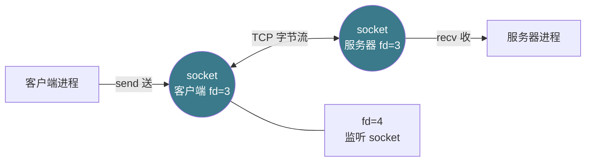
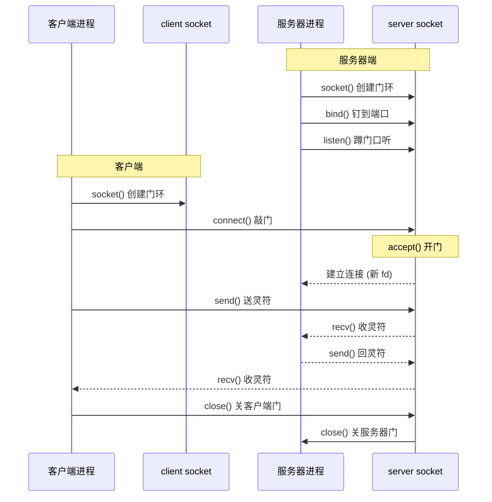
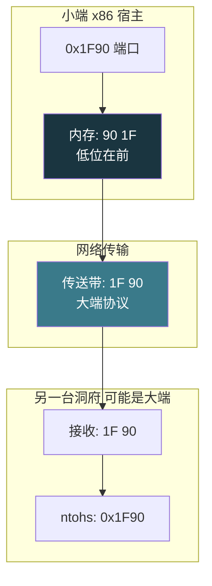

# 【金丹·84】网络编程：socket入门

> 码农修仙传 · 金丹期 · 第84篇
> 我是玄芯散人，带你从炼气修到大乘。

---

## 境界标识

```
╔══════════════════════════════════╗
║     金丹期 · 第84篇              ║
║     网络编程：socket 入门        ║
║     TCP socket API               ║
║     echo 服务器 / 五元组 / 字节序 ║
║     预计阅读：30 分钟             ║
╚══════════════════════════════════╝
```

---

## 修仙引入

修真界此前所有程序都跑在同一台洞府机器上。083 把洞府里多线程的传送带玩得飞起，073 / 077 / 078 把令牌和灵符的规矩定下来。问题来了：一位弟子写完灵矿采集程序，另一位弟子写完丹药炼制程序，洞府和洞府隔了几千里，怎么把灵石送过去？

修真界的解决方案是搭一条「传送灵符链路」，链路两端各开一扇门，门牌号是 IP 和端口，门的开关由两端各一对 socket 法力门环控制。这一篇把 socket 编程的七步法力（socket / bind / listen / accept / connect / send / recv）拆开看，再把一个能跑的 echo 服务器写出来。字节序那个坑单独拎一遍，免得真到传送时翻车。075 讲过 select / poll / epoll 三种监天弟子的玉牌功法，这一篇只在末尾点一句，不重复展开。

修真界把这一关叫「跨洞府通信」。跨过去，弟子写的程序才算真正连上了修真界互联网络。

---

## 硬核主体

### socket 是什么：跨洞府的法力门环

先讲 socket 是什么。socket 直译叫「套接字」，修真界把它叫「法力门环」。一扇门环在客户机这头，另一扇门环在服务器那头，两扇门环对齐了，灵气就能在两端往返流动。

修真比喻对应到代码层：socket 就是一个整数，Linux 上对应一个文件描述符。068 讲过文件描述符是弟子手里那张「灵物清单」，每张清单对应一扇门。清单里有标准输入和标准输出和标准错误三个常用编号，再往后就是 socket 门环。一对 socket 门环有四个地址：源 IP 是客户端地址，源端口是客户端端口，目标 IP 是服务器地址，目标端口是服务器端口。修真界把这四个地址再加上协议（TCP 或 UDP）合起来叫「五元组」。五元组在网络上唯一标识一条连接。

修真比喻对应到全双工：socket 是双向通道。一扇门环既能往外送灵符（send），也能往里收灵符（recv），互不干扰。这就是修真界里 socket 的两个属性：文件描述符（int 整数）和五元组（唯一标识一条连接）。



修真比喻对应到这张图：客户端洞府里有一扇门环（socket），服务器洞府里也有一扇门环（socket）。两边门环之间走的是 TCP 协议，灵气沿着这条链路流动。门环实际上就是 fd（文件描述符），操作系统把数据搬来搬去，弟子只管 send 和 recv。

修真界里 socket 有两类地址族：AF_INET（IPv4）和 AF_INET6（IPv6）。还有一类 AF_UNIX 走本地文件，速度飞快但不能跨主机。这一篇只讲 AF_INET，跨主机通信修真界里最常用。协议族又有 SOCK_STREAM（流式，TCP）和 SOCK_DGRAM（数据报，UDP）。这一篇讲 TCP，UDP 留给后续章节。

### TCP socket API：七步法力

修真界把 TCP socket 编程拆成七步法力。服务器端走五步（socket / bind / listen / accept / recv+send），客户端走三步（socket / connect / send+recv）。两端的 socket 都是同一对法力门环的入口。

修真比喻对应到具体调用顺序。服务器端先开门（socket），把门环钉到自家门框上（bind），然后蹲在门口听（listen），听见敲门声就开门迎客（accept），迎进来后送收灵符（send / recv）。客户端不用蹲门口听，开门（socket）后直接敲服务器的门环（connect），敲开了就送收灵符（send / recv）。

把这七步法力画成时序图：



修真比喻对应到这张时序：服务器进程先在自己这头把门环装好，蹲在门口等。客户端进程那头也装好门环，然后敲服务器的门。服务器 accept 接到敲门声，开门迎客，建立一条专属通道（新的 fd）。两端沿这条通道收发灵符，最后各自关门。

修真界里这七步法力对应的系统调用，逐一拆开：

第 1 步 socket()： 创建门环。`int fd = socket(AF_INET, SOCK_STREAM, 0);` 返回一个整数 fd。失败返 -1，错误码在 errno。

第 2 步 bind()： 把门环钉到自家门框（IP + 端口）上。`bind(fd, (struct sockaddr*)&addr, sizeof(addr));` addr 里装 IP 和端口。

第 3 步 listen()： 蹲门口听敲门声。`listen(fd, backlog);` backlog 是等待队列的长度。内核维护两个队列：未完成三次握手的连接和已完成三次握手等待 accept 的连接。backlog 满了新的连接请求被拒。

第 4 步 accept()： 开门迎客。`int client_fd = accept(fd, ...);` 阻塞直到有客户端敲门，返回新的 fd。这个新 fd 是给客户端专门开的门，原来的 fd 继续蹲门口等下一位。

第 5 步 connect()： 客户端敲门。`connect(fd, (struct sockaddr*)&server_addr, sizeof(server_addr));` 阻塞直到三次握手完成。

第 6 步 send() / recv()： 收发灵符。`send(fd, buf, len, 0);` 和 `recv(fd, buf, len, 0);` 是两端的传送门。send 把 buf 里 len 字节送出去，recv 把收到的灵符装到 buf 里，返回实际收到的字节数。

第 7 步 close()： 关自家门。`close(fd);` 关闭 socket。服务器端关闭后，对端的 recv 会返 0（EOF）。

修真界里这七步缺一不可。少一步，链路就立不起来。下面的 echo 服务器会把七步全走一遍。


### 写一个 echo 服务器：能跑版

修真界里 echo 服务器是弟子入门的第一关。逻辑极简：客户送一段灵符过来，服务器原样送回去。但代码里把七步法力全部用上，跑通就能当敲门砖。

```c
// echo_server.c - TCP echo 服务器
// 编译：gcc echo_server.c -o echo_server
#include <stdio.h>
#include <stdlib.h>
#include <string.h>
#include <unistd.h>

#include <arpa/inet.h>      // htons, inet_pton 等字节序/地址转换函数
#include <sys/socket.h>

#define PORT 8080
#define BUF_SIZE 1024

int main() {
    // 第 1 步：创建门环
    int server_fd = socket(AF_INET, SOCK_STREAM, 0);
    if (server_fd < 0) {
        perror("socket");
        return 1;
    }

    // 设置 SO_REUSEADDR，避免重启时「地址已在使用」
    int opt = 1;
    setsockopt(server_fd, SOL_SOCKET, SO_REUSEADDR, &opt, sizeof(opt));

    // 第 2 步：把门环钉到自家端口
    struct sockaddr_in addr;
    memset(&addr, 0, sizeof(addr));
    addr.sin_family = AF_INET;
    addr.sin_addr.s_addr = INADDR_ANY;     // 监听 0.0.0.0，所有网卡
    addr.sin_port = htons(PORT);           // 端口 8080，要转网络字节序

    if (bind(server_fd, (struct sockaddr*)&addr, sizeof(addr)) < 0) {
        perror("bind");
        close(server_fd);
        return 1;
    }

    // 第 3 步：蹲门口听敲门声
    if (listen(server_fd, 5) < 0) {        // 等待队列长度 5
        perror("listen");
        close(server_fd);
        return 1;
    }
    printf("echo server listening on port %d\n", PORT);

    // 第 4 步：开门迎客，循环接客
    while (1) {
        struct sockaddr_in client_addr;
        socklen_t client_len = sizeof(client_addr);
        int client_fd = accept(server_fd,
                               (struct sockaddr*)&client_addr,
                               &client_len);
        if (client_fd < 0) {
            perror("accept");
            continue;
        }

        // 打印客户端 IP + 端口
        char ip_str[INET_ADDRSTRLEN];
        inet_ntop(AF_INET, &client_addr.sin_addr, ip_str, sizeof(ip_str));
        printf("client connected: %s:%d\n",
               ip_str, ntohs(client_addr.sin_port));

        // 第 6 步：收发灵符
        char buf[BUF_SIZE];
        ssize_t n;
        while ((n = recv(client_fd, buf, sizeof(buf), 0)) > 0) {
            send(client_fd, buf, n, 0);     // 原样回送
        }

        // 第 7 步：关客户端门
        close(client_fd);
        printf("client disconnected\n");
    }

    close(server_fd);
    return 0;
}
```

修真比喻对应到代码每一处要紧位置：

`socket(AF_INET, SOCK_STREAM, 0)` 是第 1 步创建门环。AF_INET 用 IPv4，SOCK_STREAM 用 TCP，第三个参数 0 让系统自动选协议。这一行返 fd，fd < 0 就报错退出。

`bind(server_fd, ...)` 是第 2 步把门环钉到自家端口。`sin_addr.s_addr = INADDR_ANY` 表示监听所有网卡。修真界里弟子可以在云主机上跑，也可以在本机跑，两种情形都要让门环接收所有 IP 来的信。`sin_port = htons(PORT)` 把 8080 转成网络字节序，下一节专门讲。

`listen(server_fd, 5)` 是第 3 步蹲门口听。后面的 5 是 backlog，等待队列长度。这个值小一点没关系，Linux 2.2 之后 backlog 参数语义改为「已完成三次握手、等待 accept 的连接数」，实际值还会跟内核参数 net.core.somaxconn 取较小者。

`accept(server_fd, ...)` 是第 4 步开门迎客。accept 阻塞直到有客户端敲门。返回的 client_fd 是给这个客户端专门开的门。原来的 server_fd 继续蹲门口等下一位，弟子手里就两扇门。

`recv(client_fd, buf, sizeof(buf), 0)` 收灵符，返回实际收的字节数。`n > 0` 表示收到数据，`n == 0` 表示客户端关了对端门（EOF），`n < 0` 表示出错。这一版的循环只处理 `n > 0` 的情形。

`send(client_fd, buf, n, 0)` 把刚收到的灵符原样送回去。`n` 是 recv 返回的实际字节数，不能用 sizeof(buf) 那是缓冲区大小，比实际收到的字节数大。

`close(client_fd)` 关客户端这扇门。这一行之后，client_fd 就废了，下次再用就是 UB（未定义行为）。

修真界里写完 echo 服务器，编译跑起来：

```bash
$ gcc echo_server.c -o echo_server
$ ./echo_server
echo server listening on port 8080
```

跑起来后服务器蹲在 8080 端口等敲门。下一节写客户端去敲。


### 写一个客户端：能跑版

客户端逻辑比服务器简单，开门，然后敲门，送收灵符，最后关门。

```c
// echo_client.c - TCP echo 客户端
// 编译：gcc echo_client.c -o echo_client
#include <stdio.h>
#include <stdlib.h>
#include <string.h>
#include <unistd.h>
#include <arpa/inet.h>
#include <sys/socket.h>

#define PORT 8080
#define BUF_SIZE 1024

int main(int argc, char *argv[]) {
    if (argc != 2) {
        fprintf(stderr, "usage: %s <server_ip>\n", argv[0]);
        return 1;
    }

    // 第 1 步：创建门环
    int fd = socket(AF_INET, SOCK_STREAM, 0);
    if (fd < 0) {
        perror("socket");
        return 1;
    }

    // 服务器地址
    struct sockaddr_in server_addr;
    memset(&server_addr, 0, sizeof(server_addr));
    server_addr.sin_family = AF_INET;
    server_addr.sin_port = htons(PORT);
    if (inet_pton(AF_INET, argv[1], &server_addr.sin_addr) <= 0) {
        perror("inet_pton");
        close(fd);
        return 1;
    }

    // 第 5 步：敲门
    if (connect(fd, (struct sockaddr*)&server_addr, sizeof(server_addr)) < 0) {
        perror("connect");
        close(fd);
        return 1;
    }
    printf("connected to %s:%d\n", argv[1], PORT);

    // 第 6 步：收发灵符
    char buf[BUF_SIZE];
    while (fgets(buf, sizeof(buf), stdin) != NULL) {
        size_t len = strlen(buf);
        send(fd, buf, len, 0);
        ssize_t n = recv(fd, buf, sizeof(buf), 0);
        if (n <= 0) break;
        buf[n] = '\0';
        printf("echo: %s", buf);
    }

    // 第 7 步：关自家门
    close(fd);
    return 0;
}
```

修真比喻对应到客户端四步：

`inet_pton(AF_INET, argv[1], &server_addr.sin_addr)` 把字符串形式的 IP（比如 "127.0.0.1"）转成网络字节序的二进制。`p` 表示 presentation（字符串），`n` 表示 numeric（二进制）。

`connect(fd, ...)` 敲门，阻塞直到三次握手完成。客户端的 connect 成功意味着服务器 accept 到了，两端建立起一条专属通道。

`fgets(buf, sizeof(buf), stdin)` 从终端读一行。弟子在终端敲一句话，回车后由 fgets 装到 buf 里。

`send(fd, buf, len, 0)` 把 buf 里 len 字节送出去。`recv` 把服务器回送的灵符装回 buf。`n <= 0` 表示服务器关了门，循环退出。

修真界里跑起来测试。打开两个终端，一个跑服务器，一个跑客户端：

```bash
# 终端 1：启动服务器
$ ./echo_server
echo server listening on port 8080

# 终端 2：启动客户端，连本机服务器
$ ./echo_client 127.0.0.1
connected to 127.0.0.1:8080
hello
echo: hello
world
echo: world
^D                     # Ctrl+D 触发 EOF
```

修真比喻对应到这段交互：客户端洞府里弟子敲「hello」，服务器洞府里 recv 收到，原样 send 回去，客户端 recv 收到后打印。Ctrl+D 触发 fgets 返回 NULL，循环退出，关门走人。


### 字节序问题：大端小端的坑

修真界里这一节必须单独拎出来讲，不然弟子第一次跑跨主机通信一定翻车。

修真比喻：把灵符放在传送带上，传送带两端是两台洞府机器。两台机器读灵符里的数字时，谁先读高位、谁先读低位？有的洞府从左往右读（大端），有的从右往左读（小端）。修真界把这件事叫「字节序」。x86 / x86_64 全是小端（低位在前），网络协议规定必须用大端（高位在前）。这两件事撞上，弟子不转字节序就会出错。

修真比喻对应到具体代码：服务器设端口 8080，端口是 16 位整数 0x1F90。在 x86 机器上 8080 存成 `90 1F`（低位在前），网络协议规定必须存成 `1F 90`（高位在前）。`htons` 就是 host-to-network-short，把宿主字节序转成网络字节序。`ntohs` 是反向。

```c
// 数值含义：三个变量都等于 8080（十进制）= 0x1F90（十六进制）
// 区别只在内存字节序
uint16_t host_port = 8080;              // 小端内存: 0x90 0x1F（低位字节先存）
uint16_t net_port  = htons(host_port);  // 大端内存: 0x1F 0x90（高位字节先存）
uint16_t back      = ntohs(net_port);   // 转回小端，数值仍是 8080
```

修真比喻对应到代码里的 `htonl` 和 `ntohl`：32 位整数用 `htonl` / `ntohl`（l 表示 long，32 位）。`sin_addr.s_addr` 是 32 位，所以用 `htonl` 处理。但代码里直接用 `INADDR_ANY` 这种宏，就不用手动调 `htonl`，宏内部已经转好。

修真比喻对应到 INADDR_ANY 这个宏：它的值是 0（`#define INADDR_ANY 0`），代表所有 IP。但 0 转成网络字节序还是 0（因为全字节都一样）。修真界里这个巧合省了弟子很多事。

把字节序问题画成 mermaid 对比图：



修真比喻对应到这张图：x86 洞府把端口 8080 存成 `90 1F`（小端），传送带上必须按 `1F 90`（大端）走，对端洞府收到后用 ntohs 转回自家字节序。少调一次 htons，对端解出来的端口就是 0x901F，等于 36895，bind / connect 一定失败。

修真界里有句老话：「跨洞府通信三件套，htons、htonl、inet_pton，少一件链路就立不起来。」

修真界里还有一个常见踩坑：直接拿指针强转 IP 字符串。比如：

```c
// 错误写法
server_addr.sin_addr.s_addr = *(uint32_t*)"127.0.0.1";  // ⚠️ UB，强转字符串
```

字符串 "127.0.0.1" 在内存里是 ASCII 码序列，强转成 uint32_t 读出来不是想要的。正确写法用 `inet_pton`：

```c
// 正确写法
inet_pton(AF_INET, "127.0.0.1", &server_addr.sin_addr);
```

`inet_pton` 内部把字符串按点分十进制解析，再转成网络字节序。IPv6 用 `inet_pton(AF_INET6, ...)`，家族不同。

### select / poll / epoll：一句话带过

修真界里一个金丹修士同时跟多个洞府通信怎么办？上面写的服务器每次只能服务一个客户端：accept 一个，处理完才能 accept 下一个。要同时服务多个客户端，得用 I/O 多路复用。

修真比喻：弟子的 token（线程）只有一份，但他想同时盯多个门环（socket）。最简单的办法是给每个 socket 起一个线程盯，这就是 083 讲过的生产者消费者套路。但门环一多，线程就开爆了，调度也乱。修真界的解法是派一位监天弟子（单线程）把神识铺开挂在多个门环上，门环一有动静神识立刻知道。`select`、`poll`、`epoll` 是这位监天弟子的三种玉牌功法。

修真比喻对应到代码侧：075 那篇专门把三种功法从内到外拆开看了：

- `select`：玉牌固定 1024 格（FD_SETSIZE），每次扫一遍，O(N) 开销
- `poll`：玉牌不封顶，但每次调用都把整个玉牌传给内核
- `epoll`：内核维护就绪链表，弟子告诉内核「挂哪些门环」，内核在门环就绪时主动通知，O(1) 查就绪

修真界里这一篇不重复展开。075 把这三种功法的原理和性能对比讲得很清楚，要做高并发服务器的弟子读完 075 就能上手。这一篇的目标是入门：能写一个能跑的 echo 服务器，理解 socket 的概念和五元组的运作方式，以及字节序如何转换，就已经过关。

修真界里这一篇写到这里，七步法力讲完了，五元组也讲了，字节序这一关也过了。下一关就是进程间通信。


---

## 修仙术语对照表

| 修仙术语 | 技术现实 | 本篇位置 |
|---------|---------|---------|
| 法力门环 | socket 文件描述符 | socket 是什么 |
| 五元组 | 协议 + 源 IP + 源端口 + 目标 IP + 目标端口 | socket 是什么 |
| 双向通道 | TCP 全双工 | socket 是什么 |
| 蹲门口听 | listen() 系统调用 | 七步法力 |
| 开门迎客 | accept() 系统调用 | 七步法力 |
| 敲门 | connect() 系统调用 | 七步法力 |
| 送灵符 | send() 系统调用 | 七步法力 |
| 收灵符 | recv() 系统调用 | 七步法力 |
| 关自家门 | close() 系统调用 | 七步法力 |
| 等待队列 | listen backlog | 七步法力 |
| 原样回送 | echo 服务器 send(buf, n) | echo 服务器 |
| 等一行输入 | fgets 从 stdin 读 | 客户端代码 |
| 传送灵符链路 | TCP 字节流 | socket 是什么 |
| 字节序 | 大端小端 | 字节序问题 |
| 小端 x86 | 宿主字节序低位在前 | 字节序问题 |
| 大端网络 | 网络字节序高位在前 | 字节序问题 |
| htons | host-to-network-short 端口转换 | 字节序问题 |
| inet_pton | 字符串 IP 转网络字节序二进制 | 字节序问题 |
| 监天弟子玉牌 | I/O 多路复用 select/poll/epoll | 多路复用 |
| 跨洞府通信 | 跨主机 TCP 通信 | 修仙引入 |

---

## 进阶条件

看完这一篇到能独立写一个能跑的 echo 服务器，理解 socket 的概念和五元组的运作方式，以及字节序如何转换。差这几条：

- [ ] 能讲清 socket 是什么（它是个文件描述符，配五元组），AF_INET 和 SOCK_STREAM 又代表什么
- [ ] 能讲清 TCP socket 服务器端的五步法力：socket / bind / listen / accept / recv+send
- [ ] 能讲清客户端的三步法力：socket / connect / send+recv
- [ ] 能独立写出一个能跑的 echo 服务器和客户端，编译跑通收发自如
- [ ] 能讲清 TCP 三次握手在 socket API 里发生在哪一步（connect / accept 之间）
- [ ] 能讲清字节序为什么必须转换（x86 是小端而网络是大端，两者要靠 htons/htonl 来转换）
- [ ] 能讲清 inet_pton 为什么不能拿指针强转字符串代替
- [ ] 能讲清 listen 的 backlog 参数含义（Linux 2.2 之后指已完成握手等待 accept 的队列），以及被 net.core.somaxconn 封顶的事
- [ ] 能讲清 recv 返回值的三种情况：n > 0 收到数据、n == 0 对端关闭（EOF）、n < 0 出错
- [ ] 能讲清为什么单线程 echo 服务器一次只能服务一个客户端，以及 select / poll / epoll 怎么破这一关（详见 075）

> 最后一条是金丹期对「网络编程入门」的「分水岭」。面试里被问「写过 socket 编程吗」，能直接说「写过 echo 服务器，TCP socket 七步法力全用过，字节序用 htons / inet_pton 转，recv 三种返回值都处理过，监听多 socket 用 epoll（详见 075）」，这一关就过了。

---

## 下期预告 + 互动

083 把多线程的传送带玩熟了，084 把跨洞府的传送灵符链路立起来了。修真界里弟子写的程序现在能和外面的洞府通信了。但还有一类通信没解决：同一台洞府里的不同进程之间怎么传灵符？比如数据库进程要把数据传给日志进程，web 服务器进程要把请求传给业务逻辑进程。这种不走网络的「进程内通信」，修真界叫 IPC（Inter-Process Communication）。

下一篇 085 进 IPC：管道（pipe）、消息队列（message queue）、共享内存（shared memory）三种主流机制。每一种都拆开看代码看坑看适用场合。这三种机制覆盖修真界里大部分进程协作需求。

现在问你：

> 🔍 把 echo_server.c 和 echo_client.c 编译跑起来，客户端敲几句话，看服务器原样回送。然后用 strace 跟踪 echo_server 的系统调用，看 bind / listen / accept / recv / send 各发生了什么。Linux 上 `strace -e trace=network ./echo_server` 就能看见网络相关调用。

> ⚙️ 把 echo 服务器的 listen backlog 改成 1，然后用 ab（apache bench）压一下 `ab -n 100 -c 50 http://127.0.0.1:8080/`，看看到第几个连接会被拒。想想为什么 backlog 这么要紧。

> ⚙️ 把 echo 服务器的 recv 循环改成处理 HTTP 请求：客户端 `curl http://127.0.0.1:8080/`，服务器返回一行 HTML。做完这一步，弟子就算摸到了 web 服务器的门。

> 评论区聊聊你第一次写 socket 程序踩过的坑，或者你写过的最复杂的网络服务。

> 我是玄芯散人，带你从炼气修到大乘。

---

*本文是「码农修仙传」系列第84篇。系列导航见 [xren.ren](https://xren.ren)*
