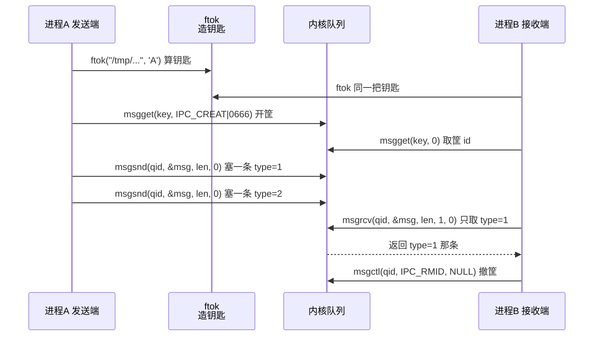
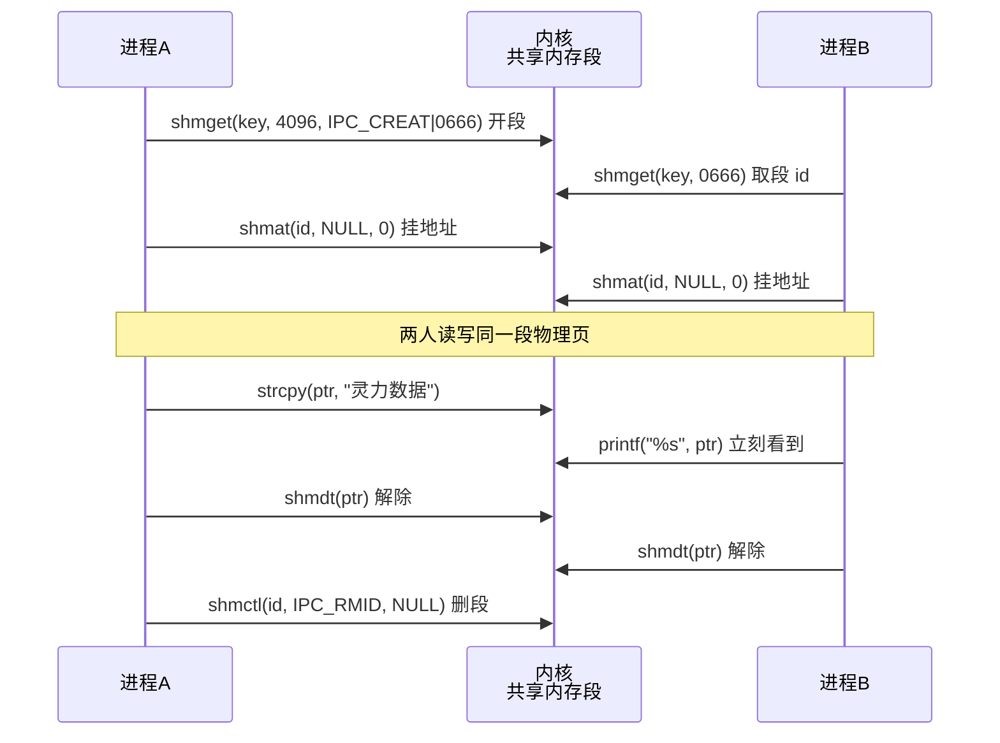
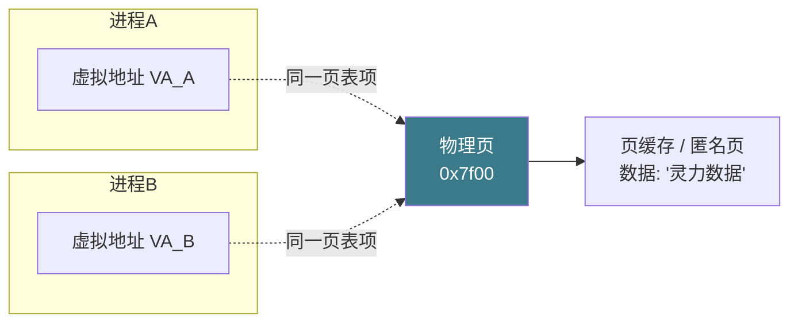

# 【金丹·85】进程间通信：管道、消息队列、共享内存 API 实战

> 码农修仙传 · 金丹期 · 第85篇
> 我是玄芯散人，带你从炼气修到大乘。

---

## 境界标识

```
╔══════════════════════════════════╗
║     金丹期 · 第85篇              ║
║     进程间通信：管道、            ║
║     消息队列、共享内存 API 实战    ║
║     msgget/shmget/shm_open/mmap   ║
║     预计阅读：35 分钟              ║
╚══════════════════════════════════╝
```

---

## 修仙引入

修真界 071 那篇把传讯使的脾气摸了一遍，管道是府内竹筒，共享内存是公用经书，信号是惊堂木，消息队列是带标签的竹筐，套接字是跨宗飞剑。可传讯使光是认识不够，弟子写代码时真正卡住的是把灵符塞进竹筒那段。`msgget` 拿到筐怎么用 `msgsnd` 塞信，`shmget` 拿到段往哪里 `shmat`，`mmap` 该挂哪个标志。这一篇把那几段塞灵符的功法挨个拆开看，每一招都跟着一段能跑的代码。

修真界把这一关叫「传讯使的招法」。会挑传讯使是入门，会用传讯使才是上路。

## 硬核主体

### IPC 机制快回顾：071 的传讯使都在哪

先把 071 摆出来的传讯使拉一个清单。修真界常用的传讯使有这么几位，包括管道、FIFO 这种字节流传讯使，共享内存这种零拷贝传讯使，信号这种异步通知传讯使，消息队列这种带标签传讯使，套接字这种跨主机传讯使。其中管道和信号 071 已讲过代码，这里只点一句不重复；套接字在 084 单独拆过。这一篇挑实战派三招：消息队列、共享内存，再加上 mmap 进阶招式。

修真比喻：071 是「传讯使脾气摸底」，讲各传讯使适合什么用法。085 是「传讯使招法上身」，讲怎么把每招使出来。两者互补，不重叠。

IPC 还可以按另一种方式分。一种是「内核中转」：数据先经一次用户态到内核的拷贝，再经一次内核到用户态的拷贝，最后才到对端。管道、套接字走的都是这条路，消息队列也是。另一种是「零拷贝」：两端进程把同一段物理页挂到自己地址空间，写完对方立刻看见，共享内存走这条路。零拷贝那一路最快，是修真界里弟子拿大数据量的首选。

修真界里还有一条规矩：所有 IPC 都假定两端进程互不信任，数据格式由双方约定，错误返回要处理。共享内存看似省了内核中转，但同步要自己扛，没有互斥两个进程同时改一段，会读到错乱的内容。这一篇把这条规矩在每个例子里都点一下。

### System V 消息队列：msgsnd / msgrcv 的全招

修真界里 System V 这一路走的是 `msgget` / `msgsnd` / `msgrcv` / `msgctl` 四件套。System V 是 1980 年代 AT&T 给 Unix 加的一套 IPC 接口，比 POSIX 那一套早了三十年。修老洞府的老程序里还能看见，修新洞府多半用 POSIX 那一路。但讲 IPC 不能不讲它。

先把「钥匙」这件事讲清。`msgget` 要一把钥匙（key）才能开队列。钥匙怎么造？修真界有两条路。

第一条路是「文件钥匙」。让两个进程都按同一条路径和同一个编号算出同一把钥匙。`ftok` 把路径加编号碾成整数，双方各调一次 `ftok`，路径编号一致就拿到同一把钥匙。代码示例：

```c
// 双方都用同一个路径 + 同一个编号
key_t key = ftok("/tmp/xianren_msgq", 'A');
```

第二条路是「固定编号」。直接挑一个整数当钥匙，比如 `0x1234`，双方硬编码。简单但容易撞车，修真界里不推荐生产用，写教学例子合适。

`ftok` 出来的 key 是个整数，`msgget` 用这把钥匙开门。`msgget` 的全部签名：

```c
int msgget(key_t key, int msgflg);
```

`msgflg` 里拼权限位和创建位。`IPC_CREAT | 0666` 表示「没有就建一个，权限 0666」。再加 `IPC_EXCL` 表示「已经有就报错」，常用来防止误开别人的队列。`msgget` 成功返队列 id（整数），失败返 -1，错误码在 `errno`。

修真比喻：`ftok` 是造一把宗门令牌，按路径和编号碾出来的；`msgget` 用令牌打开对应的竹筐柜子。柜子可能早就有人用了，已存在就拿 id；也可能要现场造一个（`IPC_CREAT`）。

接着看「消息」长什么样。System V 的消息必须有一个 long 类型的 type 在头上，再加任意长的数据。常见写法：

```c
struct msgbuf {
    long mtype;      // 消息类型，必须 > 0
    char mtext[256]; // 数据部分，长度任意
};
```

`mtype` 必须大于 0。0 在 msgrcv 里另有用途，后面讲。

`msgsnd` 把消息塞进队列。全部签名：

```c
int msgsnd(int msqid, const void *msgp, size_t msgsz, int msgflg);
```

`msgp` 指向「type + data」结构指针；`msgsz` 是 data 部分的长度，不算 type；`msgflg` 默认 0 阻塞，`IPC_NOWAIT` 不阻塞。`msgsnd` 成功返 0，失败返 -1。

`msgrcv` 从队列里取一条。全部签名：

```c
ssize_t msgrcv(int msqid, void *msgp, size_t msgsz, long msgtyp, int msgflg);
```

`msgtyp` 是按类型挑消息的要点。修真界里这一招是消息队列和管道最大的区别，能挑着取。三种值对应三种挑法：`msgtyp == 0` 取队列第一条不分类型；`msgtyp > 0` 取类型等于 `msgtyp` 的第一条（先进先出）；`msgtyp < 0` 取类型小于等于 `|msgtyp|` 的第一条中类型最小的那条。修真界里这一招用于「优先级队列」，把类型当优先级，数字小的优先。

`msgrcv` 加 `MSG_NOERROR`：如果 data 太长截断而不报错；不加就报错 `E2BIG`。`msgtyp > 0` 时再加 `MSG_EXCEPT` 可以取类型「不等于」`msgtyp` 的第一条，常用于「除了这条都拿」的场合。`IPC_NOWAIT` 不阻塞取，没消息返 `ENOMSG`。

修真比喻：消息队列是贴了标签的竹筐，筐放在告示板上。筐上每条信都标了类型（紧急/普通/汇报）。收信人可以按类型取自己关心的那一条，也可以「只要最紧急的」（`msgtyp < 0`）。

把消息队列的全流程画成时序图：



修真比喻：送信弟子用同一把令牌造出同一个筐，接收弟子用同一把令牌找到同一个筐。送信弟子塞了两条不同类型的信，接收弟子只取 type=1 的那条。最后撤筐是 `IPC_RMID`，修真界里筐不撤就一直占着，资源不释放。

写一个能跑的双进程版本：

```c
// msgq_demo.c - System V 消息队列父子进程版
// 编译：gcc msgq_demo.c -o msgq_demo
#include <stdio.h>
#include <stdlib.h>
#include <string.h>
#include <unistd.h>
#include <sys/ipc.h>
#include <sys/msg.h>
#include <sys/wait.h>

struct msgbuf {
    long mtype;
    char mtext[128];
};

int main(void) {
    // 父和子都用 ftok 算同一把钥匙
    key_t key = ftok("/tmp/xianren_msgq", 'A');
    if (key < 0) { perror("ftok"); return 1; }

    // 父创建队列，子只读不创建
    int qid = msgget(key, IPC_CREAT | 0666);
    if (qid < 0) { perror("msgget"); return 1; }

    pid_t pid = fork();
    if (pid < 0) { perror("fork"); return 1; }

    if (pid == 0) {
        // 子进程：睡 1 秒等父写，然后按 type=1 取一条
        sleep(1);
        struct msgbuf m;
        ssize_t n = msgrcv(qid, &m, sizeof(m.mtext), 1, 0);
        if (n >= 0) {
            m.mtext[n] = '\0';
            printf("子进程收到 type=%ld: %s\n", m.mtype, m.mtext);
        }
        return 0;
    }

    // 父进程：发两条不同类型的消息
    struct msgbuf m1 = { .mtype = 1 };
    struct msgbuf m2 = { .mtype = 2 };
    strcpy(m1.mtext, "紧急：灵石快没了");
    strcpy(m2.mtext, "普通：今日汇报");

    msgsnd(qid, &m1, strlen(m1.mtext) + 1, 0);
    msgsnd(qid, &m2, strlen(m2.mtext) + 1, 0);

    wait(NULL);

    // 父撤队列，不撤会留垃圾
    msgctl(qid, IPC_RMID, NULL);
    // 同时删 ftok 用的「种子文件」，避免下次冲突
    unlink("/tmp/xianren_msgq");

    return 0;
}
```

跑一下父塞两条不同类型，子只取 type=1，能看见「紧急：灵石快没了」被打印，type=2 那条留在队列里。修真界里这一段代码演示了全流程：先同 key 开筐，再用不同 type 塞信，最后按 type 取信。三步串起来，传讯使的招法就成了。

修真界里用 `msgget` / `msgsnd` / `msgrcv` 有几条规矩必须记牢。

规矩一：`ftok` 用的那个种子文件必须存在。`ftok` 只读路径的 inode 编号，文件不存在返 -1。所以代码里要先 `touch /tmp/xianren_msgq`，或者干脆别用 `ftok` 直接硬编码 key。

规矩二：`msgsnd` 长度参数是 data 部分的长度，不算 type 这一项。`msgrcv` 也是。`strlen(s)+1` 传 `\0` 是常见做法，避免读端拿到的字符串没有终止符。

规矩三：队列要显式 `msgctl(IPC_RMID)` 删。System V 的 IPC 对象涵盖三类：消息队列、共享内存和信号量，它们都不随进程退出自动消失，留着占资源。`ipcs` 命令能看见当前活着的队列，`ipcrm -q <id>` 能手动删。

### System V 共享内存：shmget / shmat / shmdt 全链路

修真界里 System V 共享内存走 `shmget` / `shmat` / `shmdt` / `shmctl` 四步。`msgget` 是开筐，`shmget` 是开一卷经书。套路几乎一样，差别在数据「落」的位置。消息队列是「内核暂存」，共享内存是「双方挂同一段」。

`shmget` 开一段共享内存：

```c
int shmget(key_t key, size_t size, int shmflg);
```

`key` 跟消息队列同源，可以用 `ftok` 也可以硬编码。`size` 是段大小，Linux 上以页（4KB）为单位向上取整。`shmflg` 跟 `msgget` 类似，`IPC_CREAT | 0666` 表示新建或打开已有。返共享内存 id。

`shmat` 把段挂到本进程地址空间：

```c
void *shmat(int shmid, const void *shmaddr, int shmflg);
```

`shmaddr` 一般传 `NULL`，让内核挑地址。`shmflg` 默认 0（可读可写），`SHM_RDONLY` 表示只读。返一个指针，指向挂接区，跟 `malloc` 返回的指针一样用。失败返 `void*`-1。

`shmdt` 把段解除挂接：

```c
int shmdt(const void *shmaddr);
```

传入 `shmat` 返回的指针。注意：`shmdt` 只是不挂接，不是删除段。修真界里弟子撤离洞府只搬走行李（数据还留在原洞府），不是拆洞府。段的生命周期独立于进程。

`shmctl` 控制段，最常用的操作是删除：

```c
shmctl(shmid, IPC_RMID, NULL);
```

`IPC_RMID` 立即把段标为「待删除」。如果还有进程挂着，段保留到最后一个进程 `shmdt` 才真删。这跟「引用计数」一个意思。

修真比喻：`shmget` 是在宗门大殿里挂出一卷经书并贴上编号；`shmat` 是弟子把这卷经书领到自己书房摊开；`shmdt` 是弟子把经书收起来送回大殿；`shmctl(IPC_RMID)` 是宗门下令把这卷经书烧了。最后一个弟子送回来的瞬间就烧。

把这条流程画成时序图：



修真比喻：两个弟子各去大殿请同一卷经书挂到自己书房看。甲在经书上落一笔「灵力数据」，乙的书房立刻看到。两个弟子都收书送回大殿，最后宗门下令烧掉。共享内存是宗门公共资源，删掉要显式下命令。

写一个能跑的父子进程版：

```c
// shm_sysv.c - System V 共享内存父子进程版
// 编译：gcc shm_sysv.c -o shm_sysv
#include <stdio.h>
#include <stdlib.h>
#include <string.h>
#include <unistd.h>
#include <sys/ipc.h>
#include <sys/shm.h>
#include <sys/wait.h>

#define SHM_SIZE 1024

int main(void) {
    // 父子用同一把钥匙
    key_t key = ftok("/tmp/xianren_shm", 'B');
    if (key < 0) { perror("ftok"); return 1; }

    // 父创建段，子只读不创建
    int shmid = shmget(key, SHM_SIZE, IPC_CREAT | 0666);
    if (shmid < 0) { perror("shmget"); return 1; }

    // 父挂接
    char *buf = (char *)shmat(shmid, NULL, 0);
    if (buf == (char *)-1) { perror("shmat"); return 1; }

    pid_t pid = fork();
    if (pid < 0) { perror("fork"); return 1; }

    if (pid == 0) {
        // 子进程：睡 1 秒等父写，读出来
        sleep(1);
        printf("子进程读到: %s\n", buf);
        shmdt(buf);                       // 子解除挂接
        return 0;
    }

    // 父进程：写一段字到共享内存
    strcpy(buf, "System V 共享内存");

    wait(NULL);

    shmdt(buf);                           // 父解除挂接
    shmctl(shmid, IPC_RMID, NULL);        // 删段
    unlink("/tmp/xianren_shm");           // 删 ftok 种子文件

    return 0;
}
```

跑一下父写、子读，能看见子进程读到「System V 共享内存」。两个进程的指针 `buf` 指向同一段物理内存，地址看着不一样（每个进程的虚拟地址不一样），但 `strcpy` 一写，对端立刻看见。

修真界里 System V 共享内存有一处最容易踩坑：`shmat` 返回的指针是 void*，强转 `(char*)-1` 用来判断失败，不能直接跟 `NULL` 比较。Linux 上 `shmat` 成功地址一般不会是 -1，但理论上 void* 的 -1 是 0xffffffffffffffff，转成 `char*` 还是 -1，必须这样判断：

```c
char *buf = shmat(shmid, NULL, 0);
if (buf == (char *)-1) { perror("shmat"); return 1; }
```

### POSIX 共享内存：shm_open + mmap 的现代走法

System V 那套接口老了三十年，修真界里新建洞府多半用 POSIX 这一路。POSIX 共享内存用的是「文件 + mmap」的思路：内核在 `/dev/shm` 下建一个特殊文件，两端进程把它 `mmap` 到各自地址空间。

`shm_open` 创建或打开共享内存对象：

```c
int shm_open(const char *name, int oflag, mode_t mode);
```

`name` 是 `/` 开头的字符串，比如 `/xianren_shm`。`oflag` 拼 `O_CREAT` / `O_RDWR` / `O_EXCL`，跟 `open` 文件语义一致。`mode` 在 `O_CREAT` 时生效，是权限位。返文件描述符（fd，跟普通文件一样）。注意：名字必须以 `/` 开头但不包含 `/dev/shm` 前缀，长度上限 NAME_MAX（一般 255 字符），里面不能再塞斜杠。内核自动把对象放在 `/dev/shm/<name>` 下。

修真比喻：`shm_open` 是在宗门大殿里挂出一个有名字的公用书袋。`/xianren_shm` 是牌子，谁拿着牌子都能找这袋书。`O_CREAT` 是「没有就造一个」，`O_EXCL` 是「已经存在就报错」。

`shm_open` 拿到 fd 后还有两步要做。第一步 `ftruncate` 设大小，刚 `shm_open` 出来的对象大小是 0，必须显式设：

```c
int fd = shm_open("/xianren_shm", O_CREAT | O_RDWR, 0666);
ftruncate(fd, 4096);  // 设 4KB
```

第二步 `mmap` 挂到本进程地址空间：

```c
void *ptr = mmap(NULL, 4096, PROT_READ | PROT_WRITE, MAP_SHARED, fd, 0);
```

`MAP_SHARED` 是要点，表示「这个挂接要共享出去，写了其他人看见」。如果误用 `MAP_PRIVATE`，写的内容只对自己可见（写时复制），共享就废了。

修真比喻：`MAP_SHARED` 是「我写的字要公示在大殿经书上」；`MAP_PRIVATE` 是「我在自己书房抄了一份，看的是抄本不是原本」。修真界里共享内存必须 `MAP_SHARED`。

`mmap` 返挂接区指针，跟 `malloc` 的指针一样用。`munmap` 解除挂接。`shm_unlink` 删除共享内存对象，名字从 `/dev/shm` 下消失，但已 `mmap` 的进程还能继续用，新进程就找不到了。

```c
munmap(ptr, 4096);             // 解除挂接
close(fd);                     // 关 fd
shm_unlink("/xianren_shm");    // 删对象（可选，最后一个进程关 fd 才真删）
```

写一个能跑的双进程版：

```c
// shm_posix.c - POSIX 共享内存父子进程版
// 编译：gcc shm_posix.c -o shm_posix -lrt
// 注意：shm_open 需要链接 librt
#include <stdio.h>
#include <stdlib.h>
#include <string.h>
#include <unistd.h>
#include <fcntl.h>
#include <sys/mman.h>
#include <sys/wait.h>

#define SHM_NAME  "/xianren_shm"
#define SHM_SIZE  4096

int main(void) {
    // 创建或打开共享内存对象
    int fd = shm_open(SHM_NAME, O_CREAT | O_RDWR, 0666);
    if (fd < 0) { perror("shm_open"); return 1; }

    // 设大小（刚创建的对象是 0 字节）
    if (ftruncate(fd, SHM_SIZE) < 0) { perror("ftruncate"); return 1; }

    // 挂到本进程地址空间
    void *ptr = mmap(NULL, SHM_SIZE, PROT_READ | PROT_WRITE,
                     MAP_SHARED, fd, 0);
    if (ptr == MAP_FAILED) { perror("mmap"); return 1; }

    pid_t pid = fork();
    if (pid < 0) { perror("fork"); return 1; }

    if (pid == 0) {
        // 子进程：睡 1 秒，读共享内存
        sleep(1);
        printf("子进程读到: %s\n", (char *)ptr);
        munmap(ptr, SHM_SIZE);
        close(fd);
        return 0;
    }

    // 父进程：写一段字
    strcpy((char *)ptr, "POSIX 共享内存");

    wait(NULL);

    munmap(ptr, SHM_SIZE);
    close(fd);
    shm_unlink(SHM_NAME);     // 删共享内存对象

    return 0;
}
```

编译时记得加 `-lrt`（链接 librt，老 GCC 强制要求，新 GCC 9+ 不需要但加一下没坏处）。跑一下父子两端能看见「POSIX 共享内存」。

修真界里 POSIX 这条路比 System V 干净：API 跟 `open` / `mmap` 一脉相承，新人上手快；`/dev/shm` 是 tmpfs（内存文件系统），读写在内存里走，不落硬盘；`shm_unlink` 名字直接清掉，资源回收比 `IPC_RMID` 直观。修真界里新写代码优先用这一路。

修真界里 `shm_open` 跟 `open` 不一样的地方：`shm_open` 打开的对象在 `/dev/shm` 下，不在普通文件系统里；用 `ls -l /dev/shm/` 能看见，跟文件一样有权限位、链接数；用 `stat` 能看大小。

### mmap 挂接方式拆开看：四种挂法

修真界里 `mmap` 不只是给 POSIX 共享内存用的。`mmap` 是 Linux 上最灵活的「把一段东西挂到进程地址空间」的招式。它能把文件挂进来，也能挂一块匿名内存，挂进来后读写就跟普通内存一样。把 mmap 的几种挂法摆清楚。

挂法一：私有文件挂接 `MAP_PRIVATE`。把一个文件 `mmap` 进进程，读到的就是文件内容。改了不写回文件（写时复制）。修真界里这是「在书房抄一份经书，看的是抄本，不动大殿原本」。

挂法二：共享文件挂接 `MAP_SHARED`。把文件 `mmap` 进来，改了会写回文件。修真界里这是「在大殿经书上直接落字，所有人都看到」。

挂法三：匿名私有挂接 `MAP_ANONYMOUS | MAP_PRIVATE`。不开文件，直接挂一块匿名内存。父进程创建后 `fork` 子进程，子进程继承这块内存视图（写时复制，不共享）。修真界里这是「书房里临时摊开一张草稿纸，子进程继承的是同一张纸但各写各的」。

挂法四：匿名共享挂接 `MAP_ANONYMOUS | MAP_SHARED`。不开文件，直接挂一块匿名内存，但显式声明共享。父进程创建后 `fork` 子进程，两端共享这块内存。修真界里这是父子进程共享内存的最简招式。不用 `shm_open`，不用 `shmget`，就一个 `mmap` 搞定。

修真比喻：四种挂法对应四种用法。文件共享挂接是「多人合读同一卷」，匿名共享是「父子传一块草稿纸」，文件私有是「各自抄一份」，匿名私有是「各自一块草稿纸互不打扰」。

匿名共享的具体写法：

```c
// mmap_anon_shared.c - 父子进程匿名共享内存
// 编译：gcc mmap_anon_shared.c -o mmap_anon_shared
#include <stdio.h>
#include <stdlib.h>
#include <string.h>
#include <unistd.h>
#include <sys/mman.h>
#include <sys/wait.h>

#define SIZE 4096

int main(void) {
    // 匿名共享挂接：父子共享一块内存
    int *shared = mmap(NULL, SIZE, PROT_READ | PROT_WRITE,
                       MAP_SHARED | MAP_ANONYMOUS, -1, 0);
    if (shared == MAP_FAILED) { perror("mmap"); return 1; }

    *shared = 0;  // 初始化

    pid_t pid = fork();
    if (pid == 0) {
        // 子进程：累加 5 次
        for (int i = 0; i < 5; i++) {
            (*shared)++;
            printf("子: shared=%d\n", *shared);
            usleep(100000);  // 100ms
        }
        return 0;
    }

    // 父进程：累加 5 次
    for (int i = 0; i < 5; i++) {
        (*shared)++;
        printf("父: shared=%d\n", *shared);
        usleep(100000);
    }

    wait(NULL);
    munmap(shared, SIZE);
    return 0;
}
```

跑一下父子交替累加同一块内存里的 `int`，两人轮流加，最后停在 10。这一段没有任何 `shm_open` 或 `shmget`，纯靠 `mmap` 加 `fork` 完成共享。修真界里这是父子进程共享内存的最简招式，记牢。

修真比喻：`MAP_ANONYMOUS | MAP_SHARED` 是一张父子弟子共用的空白符纸。父写一笔子看见，子加一笔父看见。`MAP_PRIVATE` 则是各自一份写时复制的纸，互不干扰。

`mmap` 的返回值也要小心：`MAP_FAILED` 是 `(void*)-1`，跟 `shmat` 一样不能直接跟 `NULL` 比。

### mmap 实现共享内存的原理：页缓存与写时复制

修真界里 `mmap` 为什么能「挂一段共享内存」？背后是 Linux 的页缓存（page cache）和虚拟内存机制在撑。

修真比喻：弟子写代码 `ptr[0] = 'A'`，内核把这件事翻译成「在 `ptr` 对应的虚拟页对应的物理页里写 'A'」。`MAP_SHARED` 表示这个物理页不复制，写完就改动了原本，所有挂着同一页的进程都看见。

修真比喻对应到 mmap 的内部流程：进程调 `mmap` 分配一段虚拟地址范围（VMA，Virtual Memory Area），但不立即分配物理页。这一段地址是「承诺给进程的」，但对应的物理页要等第一次读或写时才真正分配。修真界把这一招叫「延迟分配」（demand paging）。第一次访问触发缺页中断（page fault），内核才从页缓存找一块物理页挂上去。修真界里这一招的好处是：`mmap` 调用本身很快，不管分多大都不真占内存。

修真比喻对应到 mmap 匿名共享的物理页：第一次写时，内核从页分配器拿一页物理内存挂上；两端进程共享同一页框（page frame），修改直接落到同一页。这就是共享内存能「零拷贝」的根源，没有内核中转这一步。

修真比喻对应到 mmap 文件挂接：内核把文件的页缓存页挂到进程的虚拟地址，修改会写回文件（前提是 `MAP_SHARED`）。`MAP_PRIVATE` 则会触发写时复制（Copy-On-Write，COW）：写时内核单独给这个进程复制一个新页，原页不动。

修真界里把 mmap 的页机制画出来：



修真比喻：进程 A 和进程 B 的虚拟地址看着不一样，但通过页表都指向同一物理页。改物理页里的字节，两端都看见。修真界里这一招比管道快。管道是「内核暂存再拷贝」，共享内存是「两端直连同一段物理页」。

修真界里 mmap 共享还有一处要注意：`MAP_SHARED` 加上文件 fd 后，修改会写回文件。这个写回时机不一定是立刻。内核用页缓存管理脏页，写回由 `msync` 或 `pdflush`/`writeback` 后台线程触发。要确保数据落盘，调 `msync(addr, len, MS_SYNC)`。

修真界里还有一招：「父子进程的内存共享是 `fork` 自带的」。`fork` 之后父子进程虚拟地址空间一样，但物理页是写时复制的。子改一页，内核给子单独复制一页。`MAP_SHARED` 的 mmap 打破了这套复制规则，两端共享同一物理页。`MAP_PRIVATE` 反而更慢，写时要复制新页。

### 各 IPC 机制适用场合对比：选传讯使的口诀

修真界里这一篇把各 IPC 招法都拆开看了一遍。怎么挑？给一张速查表，比 071 那篇的对比更深一层，多了一列「同步方式」。

| 机制 | 数据粒度 | 跨主机 | 速度 | 内核开销 | 同步方式 | 典型场合 |
|------|---------|--------|------|---------|---------|---------|
| 管道 pipe | 字节流 | 否 | 中 | 两次拷贝 | 无（阻塞自带） | 父子进程简单传数据 |
| FIFO | 字节流 | 否 | 中 | 两次拷贝 | 无（阻塞自带） | 不相关进程单向传数据 |
| System V 消息队列 | 结构化消息 | 否 | 中 | 两次拷贝 | 无（阻塞自带） | 带类型消息、跨进程持久 |
| POSIX 消息队列 | 结构化消息 | 否 | 中 | 两次拷贝 | 无（阻塞自带） | 同上，API 更现代 |
| System V 共享内存 | 内存页 | 否 | 极快 | 零拷贝 | 需自配信号量 | 大数据量、需手动同步 |
| POSIX 共享内存 | 内存页 | 否 | 极快 | 零拷贝 | 需自配信号量 | 大数据量、API 更现代 |
| mmap 匿名共享 | 内存页 | 否 | 极快 | 零拷贝 | 需自配信号量 | 父子进程最快共享 |
| 信号 signal | 整数编号 | 否 | 快 | 内核投递 | 无 | 异步通知、强制控制 |
| 套接字 socket | 字节流/消息 | 是 | 中/慢 | 两次拷贝 | 无 | 跨主机、本地复杂通信 |

挑选思路按修真界三步法。

第一步看数据量。小数据（几字节到几 KB）走管道或消息队列都顺手，几百 MB 以上走共享内存。修真界里音视频帧处理、数据库缓冲池这些都走这条路，共享内存池也不在话下。

第二步看是否需要类型。消息队列有 type 字段，能「按类型取」。管道和共享内存都是裸字节流，要自己定边界（长度前缀或分隔符）。

第三步看同步需求。共享内存最快但必须自己加同步。多进程并发改同一段会读到错乱内容。修真界里这条规矩叫「零拷贝带锁」，常用 POSIX 信号量（`sem_open` / `sem_wait` / `sem_post`）或 System V 信号量配共享内存。管道和消息队列自带阻塞，不用额外加同步。

修真界里用 mmap 共享内存有一处大坑：`mmap` 出来的共享段本身没同步，要加信号量。常见组合是「`mmap` 一块共享内存 + `sem_open` 一个命名信号量」，两端进程通过信号量协调读写。这一段超出了本文范围，077 锁家族和 083 生产者消费者可以参考。

修真界里还有一招：「能用管道就别用共享内存」。共享内存快，但代码复杂度翻倍。同步自己配，边界自己定，生命周期自己管。管道和消息队列都自带阻塞，写入端不用关心对方有没有准备好。修真界里新写代码，默认走管道或消息队列，需要大数据量时才上共享内存。

修真比喻：修真界里弟子写代码选传讯使，先看距离（府内/跨府），再看数据量（小/大），最后看规矩（要不要贴标签、要不要同步）。三步问完，答案就出来了。

最后一条经验：「能用 POSIX 就别用 System V」。System V 接口老、API 跟文件方式脱节、清理要 `ipcrm` 命令手动。新写代码用 `shm_open` + `mmap`、`mq_open` + `mq_send`/`mq_receive`，API 跟文件系统一脉相承，资源清理跟文件一致（`close` + `unlink`）。

---

## 修仙术语对照表

| 修仙术语 | 技术现实 | 本篇位置 |
|---------|---------|---------|
| 令牌 | ftok 算出的 key | 消息队列钥匙 |
| 告示板竹筐 | System V 消息队列 | 消息队列 |
| 信的标签 | 消息 mtype 字段 | msgsnd/msgrcv |
| 按标签取信 | msgrcv msgtyp 选消息 | msgsnd/msgrcv |
| 撤筐命令 | msgctl(IPC_RMID) | msgsnd/msgrcv |
| 公用经书 | System V 共享内存段 | shmget/shmat |
| 请书挂书房 | shmat 把段挂进程地址空间 | shmget/shmat |
| 收书送回大殿 | shmdt 解除挂接 | shmget/shmat |
| 烧经书令 | shmctl(IPC_RMID) | shmget/shmat |
| 公用书袋 | POSIX 共享内存对象 | shm_open |
| 书袋挂牌 | /dev/shm 下文件 | shm_open |
| 摊开书袋 | mmap 挂接 | shm_open + mmap |
| MAP_SHARED | 公示在大殿原本上 | mmap 标志位 |
| MAP_PRIVATE | 在书房抄一份 | mmap 标志位 |
| 父子共用草稿纸 | MAP_ANONYMOUS \| MAP_SHARED | mmap 匿名共享 |
| 写时复制 | COW 机制 | mmap 原理 |
| 缺页中断 | page fault | mmap 原理 |
| 页缓存 | page cache | mmap 原理 |
| 零拷贝 | 无内核中转 | 共享内存优势 |
| 同步带锁 | POSIX/System V 信号量 | 共享内存坑 |

---

## 进阶条件

看完这一篇到能独立写一段代码用共享内存或消息队列在两进程间传数据，把同步坑自己填上，差这几条：

- [ ] 能讲清 ftok 为什么需要一个种子文件（只读路径 inode 编号，文件不存在返 -1）
- [ ] 能讲清 msgget 的 oflag 组合（IPC_CREAT / IPC_EXCL / 权限位）
- [ ] 能讲清 msgrcv 的 msgtyp 三种取值含义（0 任意取，正数按类型取，负数按最小类型取）
- [ ] 能讲清 MSG_NOERROR 和 MSG_EXCEPT 的差别（前者截断过长 data，后者取非指定类型）
- [ ] 能讲清 shm_open 名字为什么必须以 / 开头，长度上限 NAME_MAX 且不能再含斜杠
- [ ] 能讲清 msgsnd 的长度参数为什么不算 type（type 不算数据载荷）
- [ ] 能讲清 msgctl(IPC_RMID) 不撤会留垃圾（System V IPC 不随进程退出）
- [ ] 能讲清 shmat 返回值为什么不能用 NULL 判断失败（要跟 (char*)-1 比）
- [ ] 能讲清 shmdt 和 shmctl(IPC_RMID) 的区别（解除挂接 vs 删段）
- [ ] 能讲清 shm_open 名字为什么必须以 / 开头（POSIX 共享内存对象命名规则）
- [ ] 能讲清 ftruncate 为什么必需（shm_open 创建的对象默认大小为 0）
- [ ] 能讲清 MAP_SHARED 和 MAP_PRIVATE 的实际差别（写时复制 vs 直写）
- [ ] 能讲清 MAP_ANONYMOUS 父子共享为什么是最简招式（不用 shm_open 不用 shmget）
- [ ] 能讲清共享内存为什么必须自配同步（零拷贝但没并发保护）
- [ ] 能讲清 mmap 的延迟分配（VMA 先建，物理页缺页才分配）

> 最后一条是金丹期对「IPC API 实战」的「分水岭」。面试里被问「共享内存怎么用」，能直接说出「POSIX 那条路是 `shm_open` 拿 fd、`ftruncate` 设大小、`mmap` 挂地址空间（`MAP_SHARED`）、读写、`munmap` 加 `close` 加 `shm_unlink` 清理；父子进程最快的方案是 `mmap(NULL, size, PROT_READ|PROT_WRITE, MAP_SHARED|MAP_ANONYMOUS, -1, 0)` 加 `fork`，零拷贝但要配信号量」，这一关就过了。

## 下期预告 + 互动

084 把跨洞府通信的 socket 立起来了，085 把同一洞府内的传讯使招法拆开看完了。可修真界里还有一类紧急通信：弟子正在闭关修炼，外面有弟子按 Ctrl+C 想打断；进程跑飞了，OS 直接 SIGKILL 强杀；定时器到点了发个 SIGALRM 醒过来。这种「一个整数编号加立刻打断当前代码」的传讯方式，修真界叫信号。086 把信号拆开看：常见信号有哪些（SIGINT/SIGSEGV/SIGKILL/SIGCHLD/SIGALRM），signal vs sigaction 怎么选，信号处理函数为什么不能调 printf，可重入和阻塞分别讲什么。看完这一篇，弟子写守护进程和定时器都能上手，异常处理也不在话下。

现在问你：

> 🔍 跑一下 `cat /proc/sys/kernel/shmmax`，看 Linux 系统共享内存单段最大能多大（默认一般是物理内存一半或 32GB）。再跑 `ipcs -m`，看当前系统上有几段共享内存活着。生产环境的段残留经常是泄漏的源头，看到不认识的段就要查。

> ⚙️ 把 `shm_posix.c` 改成两个独立的进程（不靠 `fork`）：一个写者跑一遍退出，一个读者跑一遍读出来。用 `gcc shm_posix_writer.c -o writer -lrt` 和 `gcc shm_posix_reader.c -o reader -lrt` 编译，先跑 writer 再跑 reader，看 `/dev/shm/` 下文件能不能看见。这一步做完，弟子就算会跨进程共享内存了。

> ⚙️ 在 `mmap_anon_shared.c` 里加一个信号量（POSIX 信号量 `sem_open` / `sem_wait` / `sem_post`），让父子两个进程交替访问共享内存，避免累加结果乱掉。这一步做完，弟子就算摸到了「共享内存加同步」的整套路子。

> 评论区聊聊你用共享内存或消息队列踩过的坑，或者你在哪个项目里选了哪一招传讯使、为什么。

> 我是玄芯散人，带你从炼气修到大乘。

---

*本文是「码农修仙传」系列第85篇。系列导航见 [xren.ren](https://xren.ren)*