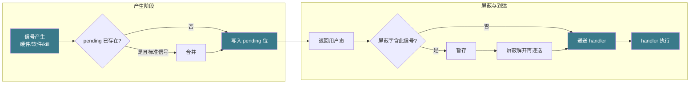

# 【金丹·86】信号：进程间的紧急信号

> 码农修仙传 · 金丹期 · 第86篇
> 我是玄芯散人，带你从炼气修到大乘。

---

## 境界标识

```
╔══════════════════════════════════╗
║     金丹期 · 第86篇              ║
║     信号：进程间的紧急信号         ║
║     signal/sigaction/sigprocmask   ║
║     预计阅读：25 分钟              ║
╚══════════════════════════════════╝
```

---

## 修仙引入

071 那篇把信号的脾气摸过一遍，信号是惊堂木，敲一下传一个编号，对端立刻被打断。可摸脾气只能算入门，修真界里真正让弟子卡住的是惊堂木落下来的那一瞬。

弟子写代码时真正纠结的，是 SIGINT 跟 SIGTERM 区别在哪。SIGKILL 为什么不能挡。`printf` 在信号处理函数里到底能不能用。阻塞信号会不会把信号丢。这一篇把这些卡点挨个拆开。修真界把这一关叫「惊堂木的招法」，会接惊堂木才是金丹期的真本事。

---

## 硬核主体

### 071 惊堂木回顾：本篇要往哪里走

071 把信号的概念讲了。`kill` 给另一个弟子发信号，`raise` 自己给自己发信号，按 Ctrl+C 终端给前台进程发 SIGINT。这三件事 071 写过，本篇不重复。

071 还埋了一个伏笔：「信号处理函数里 `printf` 这种用全局缓冲区的函数不安全，应该用 `write` 或者标志位加主循环判断」「标准信号默认丢弃后续到达的同号信号」「SIGKILL 和 SIGSTOP 不能被捕获」。伏笔埋到这就停了，没展开怎么用 `sigaction` 写安全的处理函数，没讲信号屏蔽怎么做，也没讲「丢弃」到底意味着什么。这一篇把伏笔填上。

修真比喻：071 是「惊堂木长什么样」，086 是「惊堂木落下来怎么接」。两者互补，不重叠。

### 常见信号表：修真界惊堂木的编号簿

修真界里惊堂木每敲一下，编号固定。Linux 给信号编号。1 至 31 这一段是标准信号，34 至 64 这一段是实时信号（`SIGRTMIN` 加 `SIGRTMAX`）。本篇先认编号簿里常见的几位。

| 信号 | 编号 | 默认动作 | 何时触发 |
|------|------|----------|----------|
| `SIGHUP` | 1 | Term | 终端连接断开；守护进程收到 SIGHUP 重新读配置 |
| `SIGINT` | 2 | Term | 终端按 Ctrl+C |
| `SIGQUIT` | 3 | Core | 终端按 Ctrl+\\ |
| `SIGILL` | 4 | Core | 非法指令 |
| `SIGTRAP` | 5 | Core | 调试断点 |
| `SIGABRT` | 6 | Core | `abort()` 调用 |
| `SIGFPE` | 8 | Core | 除零、浮点异常 |
| `SIGKILL` | 9 | Term | `kill -9` 强制终止 |
| `SIGSEGV` | 11 | Core | 段错误，访问非法内存 |
| `SIGPIPE` | 13 | Term | 管道读端关闭后写 |
| `SIGALRM` | 14 | Term | `alarm()` 定时器到时 |
| `SIGTERM` | 15 | Term | `kill` 默认、礼貌终止 |
| `SIGCHLD` | 17 | Ign | 子进程状态变化（退出、被信号杀死等） |
| `SIGCONT` | 18 | Cont | 恢复被 `SIGSTOP` 暂停的进程 |
| `SIGSTOP` | 19 | Stop | 暂停进程，不能捕获 |
| `SIGTSTP` | 20 | Stop | 终端按 Ctrl+Z |
| `SIGIO`/`SIGPOLL` | 29 | Term | I/O 可用（异步 I/O） |
| `SIGUSR1` | 10 | Term | 用户自定义 |
| `SIGUSR2` | 12 | Term | 用户自定义 |

修真界里默认动作分四种。Term 表示直接终止进程，进程没有机会善后。Core 表示终止并且产生 core dump 文件（进程崩溃时的内存快照），修真界里这一招用于事后断案。Ign 表示默认忽略，进程连一声都不吭。Stop 表示进程暂停，收到 `SIGCONT` 才会恢复。修真界里 SIGCHLD 是默认忽略的，所以子进程退出后必须显式 `wait` 才不会留僵尸。

特别要注意三个信号。

第一个，`SIGKILL`。修真界里这是「九号惊堂木」，一敲必倒，不可阻挡，不能捕获也不能阻塞。操作系统留这一手是为了应急：进程死锁、不响应 `SIGTERM`，管理员就用 `kill -9` 强制收掉。`SIGSTOP` 同样不可捕获，跟 `SIGKILL` 合称「不可阻挡两兄弟」。

第二个，`SIGSEGV`。修真界里这是「段错惊堂木」，弟子访问了不该访问的内存地址。修真界里常见原因有这几类：解引用空指针，或数组下标越界，或递归太深把栈撑爆。默认动作是 core dump，便于事后用 gdb 看是哪条指令出的事。段错误不能简单靠信号处理函数救回来，但可以注册处理函数在退出前留个日志或者写一段遗言。

第三个，`SIGCHLD`。修真界里这是「子弟子告惊堂木」，子进程退出时被触发。默认动作是忽略，所以子进程退出后默认不会自动通知父进程，必须 `wait` 或 `waitpid`。如果父进程不收尸，子进程就成了僵尸进程（zombie），占着 PID 不释放。`SIGCHLD` 在多进程服务器里被广泛用来收割子进程。

修真比喻：信号编号簿是修真界的惊堂木编号簿，每敲一下编号固定，含义由收发双方约定。1 号到 20 号是常用编号，9 号和 19 号是「最后通牒」，连掌门人都不能挡。

### signal vs sigaction：修真界为什么推荐 sigaction

修真界写惊堂木处理函数有两套接口，老接口叫 `signal`，新接口叫 `sigaction`。`signal` 看起来简单，但有几个修真界无法接受的缺陷。

第一，`signal` 的行为在不同 Unix 系统上不一样。Linux 上 `signal` 默认效果接近 `sigaction` 加 `SA_RESTART`，但历史上的 BSD 和 SysV 不一样，跨平台代码靠不住。第二，`signal` 安装的 handler 在执行期间没法自动屏蔽同号信号，老的 SysV 行为是处理完恢复默认动作（`SA_RESETHAND` 效果），意思是同一个信号第一次进来执行 handler，第二次进来直接走默认动作。这两条缺陷放在今天的多线程服务器里就是雷。

修真界推荐 `sigaction`，接口长这样：

```c
struct sigaction {
    void     (*sa_handler)(int);                  // 处理函数，简单版本
    void     (*sa_sigaction)(int, siginfo_t *, void *);  // 处理函数，带 siginfo 版本
    sigset_t sa_mask;                             // 处理函数执行期间额外屏蔽的信号
    int      sa_flags;                            // 选项
    void     (*sa_restorer)(void);                // 不再使用，留 NULL
};
```

`sigaction` 调用长这样：

```c
int sigaction(int signum, const struct sigaction *act, struct sigaction *oldact);
```

成功返 0，失败返 -1。`oldact` 传 NULL 表示不保存旧的。

修真界里写一段标准的 `sigaction` 代码：

```c
// sigaction_demo.c
#include <signal.h>
#include <stdio.h>
#include <string.h>
#include <unistd.h>

static volatile sig_atomic_t got_signal = 0;
// volatile + sig_atomic_t 是修真界标准写法
// sig_atomic_t 是保证读写原子性的整数类型

static void on_sigint(int sig)
{
    (void)sig;
    got_signal = 1;  // 只设标志位，不做复杂事
}

int main(void)
{
    struct sigaction sa;
    memset(&sa, 0, sizeof(sa));
    sa.sa_handler = on_sigint;
    sigemptyset(&sa.sa_mask);          // 处理函数期间不额外屏蔽其他信号
    sa.sa_flags = SA_RESTART;          // 让慢系统调用被信号打断后自动重启

    if (sigaction(SIGINT, &sa, NULL) < 0) {
        perror("sigaction");
        return 1;
    }

    while (!got_signal) {
        puts("弟子在修炼...");
        sleep(1);
    }
    puts("弟子告辞");
    return 0;
}
```

修真界里 `sa_flags` 常用值有三个。`SA_RESTART`：让本来可能被信号打断的慢系统调用（`read`、`write`、`accept`）自动重启，不用处理 `EINTR`。`SA_SIGINFO`：选了它就用 `sa_sigaction` 三个参数的版本，能拿到 `siginfo_t` 里的发送方 PID 和原因。`SA_NODEFER`：默认情况下，进程正在执行某信号的处理函数时，同号信号会被屏蔽，处理完才解锁。`SA_NODEFER` 让这个屏蔽失效，处理函数可以被同号信号打断。多数情况下用不到 `SA_NODEFER`，默认屏蔽反而是好事。

修真比喻：`signal` 是修真界早期留下的旧规矩，跨宗门行为不一致。`sigaction` 是新规矩，跨宗门统一，灵符怎么写效果都一样。新弟子写代码一律用 `sigaction`，`signal` 只在教学示例里出现。

### 信号处理函数编写规则：只能调 async-signal-safe 函数

修真界里惊堂木处理函数（handler）有一条铁律：处理函数执行时，进程原本正在跑的事被打断，处理函数跑在一个「不确定」的上下文里。所以处理函数里能调的函数是受限的。

受限的根因有三个。第一，处理函数可能打断 `malloc` 或 `printf` 这种用了全局链表/全局缓冲区的库函数，再进同号函数会破坏链表结构，造成死锁或崩溃。第二，处理函数里不能调任何可能阻塞的函数（`sleep`、`read` 阻塞版本），否则会把不该等的线程卡死。第三，处理函数里不能调 `longjmp` 跳到主流程，跨过中间栈帧的资源释放，会留下泄漏。

修真界里有一份「async-signal-safe 函数清单」，POSIX 标准明确列出哪些函数可以在信号处理函数里调。修真界里这些函数满足三条铁律：不碰全局共享状态，也不分配内存，更不会阻塞。修真界里这份清单的全文在 `man 7 signal-safety` 里可以查到，本篇只挑几类常见的记一下：

修真界里这份清单的精髓：用 `write` 不用 `printf`，用 `read` 不用 `fread`，用 `_exit` 不用 `exit`。`exit` 在退出前会清空 stdio 缓冲区并调用 atexit 注册的函数，链路里可能调 `printf` 之类不安全函数。处理函数要立刻退时，用 `_exit`。

修真界里这份清单不必死记，记一条原则就够了：处理函数能调的函数必须不碰全局共享状态，不能分配内存，也不会阻塞。这条原则下筛选，`write`、`_exit`、`signal`、`sigaction`、`sigprocmask`、`raise` 这些函数都在白名单里，`printf`、`malloc`、`sleep`、`exit` 都不在。

修真界里再写一段「安全处理函数 + 主循环收信」的样板：

```c
// safe_handler.c
#include <signal.h>
#include <stdio.h>
#include <unistd.h>
#include <errno.h>
#include <string.h>

static volatile sig_atomic_t got_signal = 0;

static void on_term(int sig)
{
    (void)sig;
    const char msg[] = "\n收到终止信号，准备善后\n";
    // write 是 async-signal-safe 的，可放心用
    write(STDOUT_FILENO, msg, sizeof(msg) - 1);
    got_signal = 1;
}

int main(void)
{
    struct sigaction sa = {0};
    sa.sa_handler = on_term;
    sigemptyset(&sa.sa_mask);
    sa.sa_flags = SA_RESTART;

    sigaction(SIGINT, &sa, NULL);
    sigaction(SIGTERM, &sa, NULL);

    while (!got_signal) {
        // pause() 是 async-signal-safe 的，会阻塞到下一个信号递送为止
        // pause 不会 spurious wakeup，但被信号打断时也会返 -1 EINTR
        pause();
    }

    // 主循环里做安全的事：刷缓冲、关文件、退出
    puts("弟子善后中...");
    return 0;
}
```

修真界里常见的反模式是处理函数里调 `printf` 或者 `malloc`。表面上能跑，但多线程、信号密集的条件下会随机崩溃。修真的金科玉律是：处理函数只设标志位，复杂的事回主循环做。

修真比喻：惊堂木落下来弟子要立刻接，但不能在接惊堂木的同时去翻书架找经书。只能先把惊堂木接住（设标志位），等主流程不忙时再翻书架（主循环处理）。修真界里这条规矩叫「接而不办」。

### 信号屏蔽：sigprocmask 把惊堂木挡在门外

修真界有时弟子正闭关到一半，不想被惊堂木打扰。操作系统给修真界提供了「信号屏蔽字」（signal mask）这套灵符，能临时把某些信号挡住。

修真界里信号的生命周期分三步。第一步信号产生。内核在三种情况下产生信号：硬件中断进来，或者软件条件触发，或者其他进程调 `kill` 发过来。第二步信号递送。内核把信号写到进程的 pending 位。第三步信号到达。进程从内核态返回用户态的瞬间，内核检查 pending 位和屏蔽字，决定递送哪个信号。



修真界里屏蔽字的用途就发生在第三步。屏蔽字里的信号不会被递送，但会被记在 pending 位里，等屏蔽字解开再递送。所以修真界里屏蔽字「暂存」信号，不会丢。

修真界里最常用的灵符是 `sigprocmask`：

```c
int sigprocmask(int how, const sigset_t *set, sigset_t *oldset);
```

`how` 三种值：

- `SIG_BLOCK`：把 `set` 里的信号加进屏蔽字（A ∪ B）
- `SIG_UNBLOCK`：把 `set` 里的信号从屏蔽字里移除（注意屏蔽未设置的信号不会报错）
- `SIG_SETMASK`：直接把屏蔽字设为 `set`（A 替换）

修真界里 `sigset_t` 是一组信号的位图，用这几个灵符操作：

```c
int sigemptyset(sigset_t *set);           // 清空
int sigfillset(sigset_t *set);            // 全设
int sigaddset(sigset_t *set, int signum); // 加一个
int sigdelset(sigset_t *set, int signum); // 删一个
int sigismember(const sigset_t *set, int signum);  // 查
```

修真界里写一段「敏感区屏蔽 SIGINT」的标准模板：

```c
// masked_critical.c
#include <signal.h>
#include <stdio.h>
#include <unistd.h>

int main(void)
{
    sigset_t mask, oldmask;
    sigemptyset(&mask);
    sigaddset(&mask, SIGINT);  // 屏蔽 SIGINT

    // 进入敏感区
    sigprocmask(SIG_BLOCK, &mask, &oldmask);
    printf("开始不能被打断的工作...\n");
    sleep(3);  // 这 3 秒按 Ctrl+C 不会被递送
    printf("敏感区完成\n");

    // 退出敏感区，恢复原屏蔽字
    sigprocmask(SIG_SETMASK, &oldmask, NULL);
    // 退出瞬间如果之前 Ctrl+C 已被 pending，会立刻递送
    printf("恢复可被打断\n");
    sleep(10);
    return 0;
}
```

修真界里还有一条进阶规矩：多线程程序里不能调 `sigprocmask`，必须用 `pthread_sigmask`。原因：`sigprocmask` 在多线程进程里行为由实现定义，Linux 上虽然能改当前线程的屏蔽字，但 POSIX 明确推荐 `pthread_sigmask`。修真界里这条规矩要在多线程服务器里严守。

修真比喻：信号屏蔽字是修真界闭关的「静音阵」，布下静音阵后惊堂木还会落下来，但不会打断闭关，等闭关结束解阵再统一处理。静音期间落下的惊堂木不会丢，会排队等处理。

### 信号的排队与丢弃：修真界的编号簿规则

修真界里标准信号（编号 1 到 31）有一个修真界修士容易误解的规则：标准信号不排队。

修真界里这意味着什么？举个例子，弟子在屏蔽 SIGINT 期间，按了三次 Ctrl+C。屏蔽解开时，进程只收到一次 SIGINT，不是三次。修真界里这叫「合并」（merge）：同号信号在 pending 期间多次产生，最后只递送一次。

修真界里实时信号（`SIGRTMIN` 加 `SIGRTMAX`，Linux 上一般是 34 到 64）排队。它们有独立的 pending 位图，能保存多次产生记录，按 FIFO 顺序递送。修真界里这条规矩在高性能服务器里有用，能用实时信号传消息编号。

修真界里「丢弃」和「丢失」是两码事。屏蔽期间的信号是「暂存」，解除屏蔽后照样递送。真正「丢弃」发生在：同号信号在处理函数还没返回时再次到达，标准信号会合并成一次递送；信号被显式忽略（`SIG_IGN`）；或者 `kill` 调用本身返了 `ESRCH`（目标进程不存在），这种情况信号连产生的边都没摸到，不算修真界的「丢弃」而是修真界里的「送信失败」。

修真比喻：修真界的惊堂木只敲一次代表「最高优先级通知」。弟子还没反应过来第二下，第三下就来了，三下只算一次。这是修真界对标准信号的简化。

### 常见坑：修真界的几颗雷

修真界里信号这条路上有几颗常踩的雷。

第一颗雷，`SIGKILL` 和 `SIGSTOP` 既不能被屏蔽，也不能被捕获，更不能被忽略。修真界里这两位是「不可阻挡两兄弟」，连掌门人（root）都拦不住。修真界里 `sigprocmask` 试图屏蔽这两个信号，内核静默忽略；`sigaction` 试图捕获会返 `EINVAL`；`signal` 试图忽略也是无效。

第二颗雷，处理函数里调 `printf` / `malloc`。修真界里表面能跑，但线程多、信号密集时会随机崩溃。`printf` 用了 stdio 全局缓冲区，处理函数里同时跟主流程的 `printf` 抢同一把锁，可能死锁或破坏链表。

第三颗雷，`fork` 后子进程继承信号屏蔽字和信号处置。修真界里 fork 的子进程出生时跟父进程一模一样，包括屏蔽哪些信号、用哪个 handler。如果修真界父进程屏蔽了 SIGTERM 后 fork，子进程也屏蔽 SIGTERM，可能导致后续管理困难。

第四颗雷，`exec` 后被捕获的信号处置被重置。修真界里 `exec` 替换进程映像，老的处理函数地址在新映像里无效，所以内核把信号处置重置为默认。但屏蔽字保留。所以修真界里父进程 exec 启动子程序后，子程序从干净的信号处置开始跑。

第五颗雷，`SIGCHLD` 默认忽略导致僵尸。修真界里父进程不 `wait` 收尸，子进程退出后变僵尸（zombie），占着 PID 不放。修真界服务器里收僵尸的标准做法是注册 `SIGCHLD` handler，里面 `waitpid(-1, NULL, WNOHANG)` 循环收所有退出子进程。

修真比喻：修真界这几颗雷，每一颗都让弟子写过不少 bug。`SIGKILL` 不可挡是「铁律」，`printf` 不安全是「金科玉律」，`fork` 继承是「血脉」，`exec` 重置是「投胎」，`SIGCHLD` 僵尸是「不收尸的祸根」。

修真界里这五颗雷踩中任何一颗，调试起来都痛苦。提前把规矩记牢，写代码时主动避开，是修真界少走弯路的正道。

### 几个进阶灵符：修真界的高阶用法

修真界里除了上面那些，还有几招高阶灵符值得一记。

第一招，`sigsuspend`。修真界里这一招是「原子地换屏蔽字并等信号」。它先换屏蔽字，再 `pause`，整个过程不会被其他信号打断。修真界里这条灵符常用于实现「等某个条件满足才解锁」的用法。

第二招，`sigpending`。修真界里查当前 pending 的信号有哪些，调试时有用。

第三招，`kill` 的「传 0」。修真界里 `kill(pid, 0)` 不真发信号，只检查 `pid` 是不是合法进程、有没有权限发，常用于修真界里探测进程是否存在。

第四招，`SIGIO`/`SIGPOLL`。修真界里这一招是异步 I/O 通知机制，配合 `O_ASYNC` 标志用。修真界里这条灵符在高性能网络服务器里有出场机会，但现代多路复用（epoll）更主流，修真界里这条灵符作为知识储备即可。

修真比喻：修真界里这几招都是进阶灵符，初学者先掌握前面那几招就够走江湖。后面这几招是高阶修士的看家本领，遇到对应场合再拿出来用。

---

## 修仙术语对照表

| 修仙术语 | 技术现实 | 本篇位置 |
|----------|----------|----------|
| 惊堂木编号簿 | Linux 信号编号 1~31 + 实时信号 34~64 | 常见信号表 |
| 九号惊堂木 | `SIGKILL` 不可捕获不可阻塞 | 常见信号表 |
| 段错惊堂木 | `SIGSEGV` 段错误 | 常见信号表 |
| 子弟子告 | `SIGCHLD` 子进程状态变化 | 常见信号表 |
| 新规矩 vs 旧规矩 | `sigaction` vs `signal` | signal vs sigaction |
| 接而不办 | 处理函数只设标志位，复杂事回主循环 | 处理函数规则 |
| async-signal-safe 清单 | POSIX 列出的处理函数可调函数 | 处理函数规则 |
| 静音阵 | `sigprocmask` 信号屏蔽 | 信号屏蔽 |
| 暂存不丢 | 屏蔽期间信号记在 pending 位 | 信号的排队与丢弃 |
| 合并递送 | 标准信号多次产生只递送一次 | 信号的排队与丢弃 |
| 不可阻挡两兄弟 | `SIGKILL` 和 `SIGSTOP` | 常见坑 |
| 不收尸的祸根 | 子进程变僵尸 | 常见坑 |
| 血脉继承 | `fork` 继承信号屏蔽字和处置 | 常见坑 |
| 投胎重置 | `exec` 重置信号处置 | 常见坑 |
| 原子换阵等信 | `sigsuspend` 原子操作 | 进阶灵符 |

---

## 进阶条件

- [ ] 能默写五个常见信号的编号、默认动作、触发条件
- [ ] 能解释为什么修真界推荐 `sigaction` 而不是 `signal`
- [ ] 能列出 async-signal-safe 函数清单的三条原则
- [ ] 能写一段带 `sa_mask` 和 `SA_RESTART` 的 `sigaction` 代码
- [ ] 能用 `sigprocmask` 实现「敏感区屏蔽 SIGINT」并解释屏蔽期间信号不会丢
- [ ] 能区分「信号合并」与「信号丢失」，并说明标准信号为什么要合并
- [ ] 能说出 `SIGKILL` 和 `SIGSTOP` 为什么不能被捕获
- [ ] 能解释 `fork` 后信号屏蔽字和处置如何继承、`exec` 后为什么处置重置但屏蔽字保留

修真界里这些条件全部通过，信号这一关就算破了。修真路不止，下一篇是 087 静态库和动态库，看看弟子写的代码怎么变成可复用的轮子。

---

## 下期预告 + 互动

下一篇：087 静态库和动态库——编译、链接和加载。修真界里弟子写好的轮子（代码）怎么打包成可复用的灵器？静态库（`.a`）和动态库（`.so`）各有什么脾气？`-fPIC` 是什么意思？`dlopen` 跟 `dlsym` 怎么用？符号版本管理又是怎么回事？下一篇把这些拆开看。

互动话题：

1. 你修真路上踩过信号处理函数里调 `printf` 的坑吗？是死锁还是输出乱？
2. 服务器里收僵尸是用 `SIGCHLD` handler 还是 `signal(SIGCHLD, SIG_IGN)` 显式忽略？两者的区别你分得清吗？

评论区等你。

---

## 落款

*本文是「码农修仙传」系列第86篇。系列导航见 [xren.ren](https://xren.ren)*
