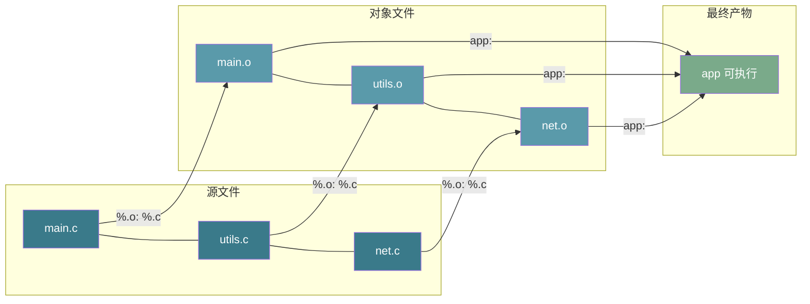

# 【金丹·88】Makefile从入门到放弃：手动编译自动化之路

> 码农·修仙传 · 金丹期 · 第88篇
> 我是玄芯散人，带你从炼气修到大乘。

---

## 境界标识

```
╔══════════════════════════════════╗
║     金丹期 · 第88篇              ║
║     Makefile入门与放弃              ║
║     target / dep / recipe          ║
║     := ?= += %  .PHONY wildcard    ║
║     预计阅读：30 分钟              ║
╚══════════════════════════════════╝
```

---

## 修仙引入

087 那篇讲到库的制作时，命令已经是 `gcc -fPIC -shared -Wl,-soname,libmath.so.1 add.c sub.c -o libmath.so.1.0.0` 这种长度。实际项目里这种命令要敲几十次：每个 `.c` 编一次，每个 `.o` 链一次，每次还得按依赖顺序排列。修一处源码就重敲一遍，三十秒的修改五分钟的编译，弟子整个人都不好了。

修真界里把这件事叫「自动化」，对应工具就是 Makefile。本篇算「铸器总纲」，把 Makefile 这门功法拆成几块讲。一行 target 的写法打底，再讲模式规则；再讲伪目标；再讲 `wildcard`/`patsubst` 收口函数；最后覆盖 CMake 这一层封装。087 把「矿石怎么熔」讲完了，088 要讲「熔完怎么一键出活」。

---

## 硬核主体

### 手动 gcc 的痛点：修真界为什么要造这把刀

弟子写一个 Hello World 的 C 程序，手动编译一句话搞定：

```bash
$ gcc main.c -o app
$ ./app
hello world
```

项目一旦膨胀到「三个文件」就开始痛苦。修真界里典型场景：修了 `main.c` 一行，重新编译时得敲两条命令，一条编 `main.c` 出 `main.o`，一条链 `main.o utils.o net.o -o app`。每修一行就敲一次，改三处敲六次，命令越长越容易敲错。十个文件就疯了。

Makefile 的解法是把构建规则写在一个叫 `Makefile` 的文件里，敲一条 `make` 让工具自己判断要不要重编。修真界里 `make` 的算法很简单：看每个 target 的 prerequisites 是不是比 target 新，新就重跑 recipe。这条规则让 Makefile 自动化编译，同时也避免重复编译（修真界里只重编被改过的 `.o`）。

修真界里第一条 Makefile 长这样：

```makefile
# Makefile
app: main.c utils.c
	gcc main.c utils.c -o app
```

修真界里这五行已经能跑。敲 `make` 它会做两件事：检查 `app` 这个文件存不存在；不存在就执行 `gcc main.c utils.c -o app`；存在就检查 `main.c` 和 `utils.c` 是不是比 `app` 新，新就重编。本节注意每条命令前必须是 Tab 字符，不是空格。这是历史包袱，make 这个工具是从 1977 年传下来的，从一开始就规定缩进用 Tab 字符。

### Makefile 的基本结构：target / dep / recipe

本节 Makefile 的最小单位叫「规则」（rule），三段式：

```
target: prerequisites
	recipe
```

修真界里这三段的含义要分清楚。

`target` 是要生成的文件或动作的名字。此处可执行文件、`.o`、`.so` 都算 target。`clean` 清屏用；`install` 装系统时跑；`test` 跑测试用。

`prerequisites`（依赖）是生成 target 需要的原料。此处可以是源文件，可以是别的 target，也可以是 `.PHONY` 这种伪目标。make 会按顺序检查依赖的时间戳。

`recipe`（命令）是生成 target 的具体步骤。修真界里 recipe 必须以 Tab 字符起手，可以多行，每行一条独立的 shell 命令。此时 make 默认用 `/bin/sh` 执行。

修真界里三条规则写一个完整的「编+链+清」流程：

```makefile
# Makefile
CC      = gcc
CFLAGS  = -Wall -O2 -Iinclude

# 目标 1：链接最终可执行
app: main.o utils.o
	$(CC) main.o utils.o -o app

# 目标 2：编译 main.o
main.o: main.c utils.h
	$(CC) $(CFLAGS) -c main.c -o main.o

# 目标 3：编译 utils.o
utils.o: utils.c utils.h
	$(CC) $(CFLAGS) -c utils.c -o utils.o

# 目标 4：清理产物
clean:
	rm -f app *.o
```

修真界里 `$(CC)` 和 `$(CFLAGS)` 是变量引用，下一节细讲。

一个项目可以并行多个规则。执行 `make` 时 make 看第一个 target（默认从 `Makefile` 第一个 target 开始），按依赖图自上而下递归解析。修真界里敲 `make clean` 可以指定执行某个 target，绕开默认目标。

注意 `clean` 后面没有依赖，是「伪目标」。它的意图不是生成一个叫 `clean` 的文件，目的就是跑一段清理命令。修真界里伪目标这个细节后面单开一节讲。

修真比喻：修真界里 Makefile 规则像丹方。丹方三段：丹药名（target）；药材清单（prerequisites）；炼制步骤（recipe）。修真界里丹师按方抓药，药材齐全就开炉，缺药材就先找药材。

### 变量与四种赋值：修真界的「丹方密文」

修真界里 Makefile 里有四种变量赋值方式，各管一摊事，混用容易出错。

修真界里四种赋值列出来：

| 操作符 | 名字 | 行为 |
|--------|------|------|
| `=` | 递归展开 | 变量值里引用别的变量，每次读取时才展开 |
| `:=` | 简单展开 | 变量值里引用别的变量，赋值时就立刻展开 |
| `?=` | 条件赋值 | 变量未定义时才赋值，已定义则保留原值 |
| `+=` | 追加赋值 | 在变量原值后追加新值 |

`=` 和 `:=` 的区别要掰开看。`=` 是「延迟绑定」，变量值里出现别的变量引用时，引用的是「当前 make 上下文里那个变量的最终值」。修真界里 `:=` 是「立即绑定」，变量值里出现别的变量引用时，引用的是「赋值这一刻那个变量的值」。

修真界里看一段代码：

```makefile
# 写法 A：用 =
CFLAGS = -Wall
CFLAGS = $(CFLAGS) -O2

# 写法 B：用 :=
CFLAGS := -Wall
CFLAGS := $(CFLAGS) -O2
```

写法 A 不会无限递归。make 在解析 `CFLAGS = -Wall` 时把 `$(CFLAGS)` 留作引用，等解析到 `CFLAGS = $(CFLAGS) -O2` 时把整个串再扩，最后展开成 `-Wall -O2`。但写法 A 在依赖关系复杂的场景里会出现「变量值不稳定」的怪问题，因为读取时机不同结果不同。

修真界里写法 B 就稳得多。第一行 `CFLAGS := -Wall` 让 `CFLAGS` 等于 `-Wall`。第二行 `CFLAGS := $(CFLAGS) -O2` 在赋值这一刻就把 `$(CFLAGS)` 展开为 `-Wall`，结果等于 `-Wall -O2`。写法 B 的语义跟 C 语言的局部变量赋值接近，是工业界推荐做法。

`?=` 用于「给变量一个默认值」：

```makefile
# 如果用户在命令行没传 PREFIX，就用 /usr/local
PREFIX ?= /usr/local
```

这条写法常用在 Makefile 顶部，让使用者可以 `make PREFIX=/opt` 临时覆盖而不用改 Makefile。

修真界里 `+=` 用于「累积配置」：

```makefile
CFLAGS  := -Wall
CFLAGS  += -O2
CFLAGS  += -g
# 最终 CFLAGS = -Wall -O2 -g
```

`+=` 在简单展开变量（`:=`）上是「字符串拼接」，在递归展开变量（`=`）上是「延迟引用拼接」。工业界常见做法是用 `:=` 定义基础值，再用 `+=` 在条件分支里追加。

修真界里还有两类「自动变量」是 make 内置的，每个规则里都能用：

| 变量 | 含义 |
|------|------|
| `$@` | 当前 target |
| `$<` | 第一个 prerequisite |
| `$^` | 全部 prerequisite（去重） |
| `$?` | 比 target 新的 prerequisite |
| `$*` | 模式匹配里的 stem（通配符匹配的那部分） |

这些变量的好处是把规则的「配方」写得抽象，跟具体 target 名解耦。下一节自动推导就会用到 `$@` 和 `$<`。

修真比喻：修真界里 `=` 像弟子抄录的丹方抄本，丹方里写了药材名，弟子照着抓药那一刻才知道药材到底是什么。这里 `:=` 像老师直接写好配方的丹方，抄下来就是成品。修真界里 `?=` 像长老的备注「若没传参就用这个」，修真界里 `+=` 像「在原方上再加三味药」。这些自动变量 `$@` 和 `$<` 像「此丹」和「主药」的指代。

### 自动推导规则：修真界的「以方类推」

前面那个手写 `.o` 的 Makefile 写到三个文件还凑合，写到三十个文件就崩溃了。修真界里每个 `.o` 都要写一条规则，每个规则都要重复 `gcc -Wall -O2 -c xxx.c -o xxx.o` 这一长串。

GNU Make 的解法叫 pattern rule（模式规则）。本节用 `%.o: %.c` 表示「凡是 `.o` 结尾的文件，都用对应的 `.c` 来生成」。修真界里 `%` 是通配符，匹配 stem（文件名主体）。

修真界里重写上面那个 Makefile：

```makefile
CC      = gcc
CFLAGS  = -Wall -O2 -Iinclude

OBJ = main.o utils.o

app: $(OBJ)
	$(CC) $(OBJ) -o app

# 模式规则：所有 .o 都从 .c 编出来
%.o: %.c
	$(CC) $(CFLAGS) -c $< -o $@

clean:
	rm -f app $(OBJ)
```

此处 `%.o: %.c` 这条规则让 make 在需要 `main.o` 时自动去找 `main.c`，找不到就报错；找到了就用 recipe 里的命令编。修真界里 `$<` 自动展开成 `main.c`，`$@` 自动展开成 `main.o`，所以 recipe 实际是 `gcc -Wall -O2 -Iinclude -c main.c -o main.o`。

这条规则不止匹配 `main.o`，`utils.o` 也用同一条规则编，不用每条单独写。此时「一次写规则，多次自动套用」就是模式规则的省事之处。

修真界里还有两条 make 内置的「隐式规则」，可以连 `%.o: %.c` 都不写：

- 从 `.c` 编译出 `.o`：等价于 `$(CC) $(CPPFLAGS) $(CFLAGS) -c $< -o $@`
- 从 `.o` 链接出可执行：等价于 `$(CC) $(LDFLAGS) $^ $(LOADLIBES) $(LDLIBS) -o $@`

理论上这个 Makefile 可以更短：

```makefile
CC      = gcc
CFLAGS  = -Wall -O2 -Iinclude
OBJ     = main.o utils.o

app: $(OBJ)
	$(CC) $(OBJ) -o app

clean:
	rm -f app $(OBJ)
```

实际项目里推荐显式写模式规则，因为隐式规则的细节（自动变量展开、`-O0` 默认优化等）不一定符合团队规范。修真界里显式写出来更可控。

`include` 头文件的依赖追踪也要单独处理。如果 `main.c` 改了，但 `utils.h` 也改了，光靠 `%.o: %.c` 不会重编 `main.o`。修真界里解法是用 `-MMD -MP` 让 gcc 自动生成 `.d` 依赖文件，再 `include $(OBJ:.o=.d)`：

```makefile
CC      = gcc
CFLAGS  = -Wall -O2 -Iinclude -MMD -MP
OBJ     = main.o utils.o

app: $(OBJ)
	$(CC) $(OBJ) -o app

%.o: %.c
	$(CC) $(CFLAGS) -c $< -o $@

-include $(OBJ:.o=.d)

clean:
	rm -f app $(OBJ) $(OBJ:.o=.d)
```

修真界里 `-MMD` 让 gcc 在编译时输出 `<source>.d` 依赖文件，列出所有被 `#include` 的头文件。`%.o: %.c` 重编时 make 会读到 `.d` 文件，把里面列出的头文件也当成 `.o` 的依赖。修真界里 `-MP` 给每个头文件生成一条假规则避免「头文件被删后 make 报缺依赖」。

修真比喻：修真界里模式规则像丹方的「批量版」。修真界里丹师给出一个总方「凡用 X 主药都按此法炼」，修真界里具体到「炼回春丹」「炼补气丸」都从这一条派生。`%.o: %.c` 是修真界里丹师的总方，修真界里每个具体的 `.o` 是从这个总方实例化的丹药。



### 伪目标（.PHONY）：修真界的「假目标」

修真界里 `clean` 这种 target 名字容易跟磁盘上的真实文件冲突。修真界里如果磁盘上有个叫 `clean` 的文件（没人会这么干，但 build 脚本偶尔会输出），make 会判断「`clean` 文件已经存在」就跳过 recipe，整个清理就不跑了。这种「我希望它总跑」的目标叫「伪目标」（phony target）。

`.PHONY` 就是告诉 make「这个 target 不是文件，跑就完了」：

```makefile
.PHONY: clean install test all

clean:
	rm -f app $(OBJ) $(OBJ:.o=.d)

install: app
	cp app /usr/local/bin/

test: app
	./app --self-test
```

修真界里 `.PHONY` 后面的 target 名都会被 make 视为伪目标，每次敲 `make clean` 都会跑 recipe，不会被文件存在性检查短路。

工业界常见的伪目标有这些：

| 伪目标 | 用途 |
|--------|------|
| `all` | 一次性编译所有目标（默认第一个 target 经常设为 all） |
| `clean` | 清理编译产物 |
| `install` | 把产物安装到系统目录 |
| `uninstall` | 卸载安装的产物 |
| `test` | 跑测试 |
| `distclean` | clean 之外再删 configure 生成的脚本 |
| `check` | 跑静态检查 |

修真比喻：修真界里伪目标是「丹方里的仪式动作」。此时「开炉」「敬香」「封炉」这些步骤不会产出任何实物丹，但每次炼丹都要走一遍流程。修真界里 `.PHONY` 是丹师在仪式动作前加的标记，告诉读者这不是炼制某颗丹，只是流程动作。

### 常用函数：修真界的「灵器公式」

修真中 Makefile 内置了一组字符串处理函数，常用的有 `wildcard`、`patsubst`、`subst`、`filter` 等。本篇只讲两个最常用的：`wildcard` 和 `patsubst`。

修真中 `wildcard` 是「按通配符找文件」，跟 shell 的 glob 类似：

```makefile
SRC = $(wildcard src/*.c)
```

修真界里这条让 `SRC` 变量等于 `src/` 目录下所有 `.c` 文件的列表。这里新增 `src/foo.c` 时不用改 Makefile，`make` 会自动找到它。

这里 `patsubst` 是「按模式替换」：

```makefile
OBJ = $(patsubst %.c,%.o,$(SRC))
```

修真界里这条把 `SRC` 列表里的每个 `.c` 替换成 `.o`。这条 `src/main.c` 变成 `src/main.o`，`src/utils.c` 变成 `src/utils.o`。

这条两个函数合起来写一个「自动发现源文件」的 Makefile：

```makefile
CC      = gcc
CFLAGS  = -Wall -O2 -Iinclude
SRC     = $(wildcard src/*.c)
OBJ     = $(patsubst src/%.c,build/%.o,$(SRC))
DEP     = $(OBJ:.o=.d)

app: $(OBJ)
	$(CC) $(OBJ) -o app

build/%.o: src/%.c
	@mkdir -p build
	$(CC) $(CFLAGS) -MMD -MP -c $< -o $@

-include $(DEP)

.PHONY: clean
clean:
	rm -rf build app

.PHONY: all
all: app
```

修真界里这条 Makefile 把源文件放到 `src/`，产物放到 `build/`，中间目录自动建。本节 `@mkdir -p build` 前面的 `@` 让 make 不要在终端回显这条命令。

本节还有几个常见的辅助函数值得提一句：

```makefile
# subst：把字符串里的某段全部替换（不是通配符模式）
$(subst .c,.o,main.c utils.c)   # → main.o utils.o

# strip：去掉首尾空格
$(strip   foo bar   )   # → foo bar

# filter：从列表里筛出匹配模式的元素
$(filter %.c,main.c main.o utils.c)   # → main.c utils.c

# filter-out：从列表里筛掉匹配模式的元素
$(filter-out %.c,main.c main.o utils.c)   # → main.o
```

修真界里函数调用语法统一是 `$(函数名 参数1,参数2,...)`，跟变量引用一样用 `$()` 包起来。

修真比喻：修真界里 `wildcard` 像丹师扫一眼药柜把所有需要的药材都点一遍。此处 `patsubst` 像「把所有标了『生』字的药材改成『熟』字」，修真界里丹师拿到生药材名字自动换成对应熟药材名字。

### CMake 概念入门：修真界的「宗门统一铸造令」

此处 Makefile 是「直接写构建脚本」的写法，每个项目都要自己手写一份。修真界里项目跨平台时（Linux、macOS、Windows）Makefile 要重写，编译器换成 clang 又要改，用 IDE（VS Code、CLion）打开项目还要点配置。此时这些问题催生了「构建系统生成器」。

此时最常见的构建系统生成器是 CMake。修真界里 CMake 不直接编译，而是读一份叫 `CMakeLists.txt` 的配置文件，按里面的指令生成 Makefile、Ninja 文件、Visual Studio 工程、Xcode 工程等。修真中同一份 `CMakeLists.txt` 在 Linux 上跑出 Makefile，在 Windows 上跑出 `.vcxproj`，跨平台不需要重写构建脚本。

修真中 `CMakeLists.txt` 的最小写法：

```cmake
# CMakeLists.txt
cmake_minimum_required(VERSION 3.10)

project(myapp C)

add_executable(app main.c)
```

修真界里这三行的语义：

- `cmake_minimum_required(VERSION 3.10)`：声明需要的 CMake 最低版本。
- `project(myapp C)`：声明项目名和用的语言（C、CXX 表示 C++）。
- `add_executable(app main.c)`：声明要生成一个叫 `app` 的可执行文件，源文件是 `main.c`。

这里编译流程：

```bash
$ mkdir build && cd build
$ cmake ..
-- The C compiler identification is GNU 11.4.0
-- Configuring done
-- Generating done
-- Build files have been written to: /path/to/build
$ make
[ 50%] Building C object CMakeFiles/app.dir/main.c.o
[100%] Linking C executable app
[100%] Built target app
$ ./app
```

这里 build 目录跟源码目录分离是 CMake 推荐做法，源码保持干净。修真界里 `cmake ..` 在 build 目录里生成 `Makefile`，后续 `make` 跟手写 Makefile 时一样。

这条多文件项目：

```cmake
cmake_minimum_required(VERSION 3.10)

project(myapp C)

# 头文件目录
include_directories(include)

# 源文件列表
add_executable(app
    src/main.c
    src/utils.c
    src/net.c
)

# 链接系统库（比如 pthread）
find_package(Threads REQUIRED)
target_link_libraries(app PRIVATE Threads::Threads)
```

这条几个 CMake 命令的语义：

| 命令 | 用途 |
|------|------|
| `cmake_minimum_required(VERSION x.x)` | 声明最低 CMake 版本 |
| `project(name LANG)` | 声明项目名和语言 |
| `add_executable(target src1 src2)` | 声明可执行文件 |
| `add_library(target STATIC src)` | 声明静态库 |
| `add_library(target SHARED src)` | 声明动态库 |
| `target_link_libraries(target lib)` | 给目标链接库 |
| `include_directories(dir)` | 添加头文件搜索路径 |
| `find_package(name)` | 查找外部库 |
| `target_compile_options(target FLAGS ...)` | 给目标加编译参数 |

修真界里 CMake 还有一种推荐的现代写法叫「target-centric」：

```cmake
cmake_minimum_required(VERSION 3.10)

project(myapp C)

add_executable(app
    src/main.c
    src/utils.c
)

# 用 target_xxx 而不是 include_xxx、add_xxx
target_include_directories(app PRIVATE include)
target_compile_options(app PRIVATE -Wall -O2)
target_link_libraries(app PRIVATE m)
```

本节 `PRIVATE` 表示这个依赖只在编译 `app` 时使用，不会传给依赖 `app` 的其他目标。`PUBLIC` 表示会传递，`INTERFACE` 表示只在「被使用方」需要。现代 CMake 推荐全用 `target_xxx` 形式的命令，避免全局命令污染。

本节把项目拆成多个子目录时，`CMakeLists.txt` 也可以嵌套。修真界里子目录里写自己的 `CMakeLists.txt`，顶层用 `add_subdirectory(subdir)` 包含：

```
project/
├── CMakeLists.txt          # 顶层
├── include/
│   └── utils.h
└── src/
    ├── CMakeLists.txt      # 子目录
    ├── main.c
    └── utils.c
```

```cmake
# src/CMakeLists.txt
add_library(utils STATIC utils.c)
target_include_directories(utils PUBLIC ../include)
```

```cmake
# 顶层 CMakeLists.txt
cmake_minimum_required(VERSION 3.10)
project(myapp C)
add_subdirectory(src)
add_executable(app src/main.c)
target_link_libraries(app PRIVATE utils)
```

修真比喻：修真界里 CMake 是「宗门统一铸造令」。此处 Makefile 是每个弟子自己写的丹方，修真界里 CMake 是长老签发的标准流程文件。此处弟子只关心要炼什么丹、补什么药材，至于分舵安排这些细节，由宗门统一下派。修真界里 Makefile 像弟子自己画的地图，CMake 像宗门发的统一地图。

### Makefile vs CMake：修真界的选择

此时两个工具不是替代关系，是分层关系。此时 CMake 是「上层」，Makefile 是「下层」。修真界里 CMake 生成 Makefile（或者 Ninja），Makefile 调 gcc 编译。

修真中按场景选：

| 场景 | 推荐 |
|------|------|
| 单文件小 demo、教程示例 | Makefile |
| 多文件项目，要跨 Linux/macOS | CMake |
| 嵌入式交叉编译（arm-none-eabi-gcc） | CMake 配合 toolchain 文件 |
| 集成第三方库（OpenCV、Boost） | CMake（`find_package`） |
| 开源库让别人编译 | CMake（标准做法） |
| 配合 IDE（CLion、Qt Creator） | CMake（一键导入） |

修真中工业界主流 C/C++ 项目几乎都走 CMake，Linux 发行版的包管理（apt、dnf）也认 CMake。修真界里 Makefile 在嵌入式小项目、教学场景里仍然常见，CMake 是「主流大项目」的默认。

这里还有几个跟 CMake 同级的构建生成器：Bazel（Google 系）、Meson（号称更快）、Ninja（只跑构建，不生成）。这里 Ninja 是 CMake 经常搭配的后端，编译速度比直接跑 Makefile 快很多。修真界里 `cmake -G Ninja` 一行就能切到 Ninja 后端。

修真比喻：修真界里 Makefile 是「弟子随身带的小炉子」，随开随用但要自己搬柴。这条 CMake 是「宗门的总调度」，丹方交上去统一安排哪个分舵用哪座炉子炼。这条 Ninja 是「调度下面那个跑腿快的小厮」，比丹师自己跑腿快得多。

---

## 修仙术语对照表

| 修仙术语 | 技术现实 | 本篇位置 |
|----------|----------|----------|
| 自动化丹炉 | Makefile 构建脚本 | 手动 gcc 到 Makefile |
| 丹方 | Makefile 规则 target:dep + recipe | 基本结构 |
| 丹方密文 | Makefile 变量赋值 | 变量与四种赋值 |
| 延迟抄录 | `=` 递归展开赋值 | 变量与四种赋值 |
| 即时抄录 | `:=` 简单展开赋值 | 变量与四种赋值 |
| 长老备注 | `?=` 条件赋值 | 变量与四种赋值 |
| 丹方加药 | `+=` 追加赋值 | 变量与四种赋值 |
| 「此丹」「主药」指代 | `$@` `$<` 自动变量 | 变量与四种赋值 |
| 批量丹方 | `%.o: %.c` 模式规则 | 自动推导规则 |
| 丹师总方 | make 内置隐式规则 | 自动推导规则 |
| 自动药材记录 | `-MMD -MP` 头文件依赖 | 自动推导规则 |
| 仪式动作 | `.PHONY` 伪目标 | 伪目标 |
| 灵器公式 | `wildcard` `patsubst` 函数 | 常用函数 |
| 扫药柜点药材 | `wildcard` 通配符 | 常用函数 |
| 生改熟药材 | `patsubst` 模式替换 | 常用函数 |
| 宗门统一铸造令 | CMake 构建系统生成器 | CMake 概念入门 |
| 宗门发的标准流程 | `CMakeLists.txt` | CMake 概念入门 |
| target-centric 写法 | `target_xxx` 系列命令 | CMake 概念入门 |
| 跑腿小厮 | Ninja 构建后端 | Makefile vs CMake |

---

## 进阶条件

- [ ] 能用最简三行 Makefile（target: dep + Tab + recipe）编译一个 Hello World 程序
- [ ] 能解释 `=` 和 `:=` 两种赋值的展开时机差异，并写出不会出错的工业界推荐版本
- [ ] 能用 `?=` 写一个「可被命令行覆盖」的 Makefile 默认值变量
- [ ] 能用 `%.o: %.c` 模式规则重写一个手写三条规则的 Makefile，让源文件数量变化时不改 Makefile
- [ ] 能用 `-MMD -MP` 加 `include $(OBJ:.o=.d)` 实现头文件依赖自动追踪
- [ ] 能写出 `.PHONY: clean install test` 并解释为什么要把 `clean` 标成伪目标
- [ ] 能用 `wildcard` 和 `patsubst` 自动发现 `src/*.c` 源文件并生成对应 `build/*.o` 目标
- [ ] 能写一个最小可用的 `CMakeLists.txt`（cmake_minimum_required + project + add_executable），跑通 `cmake .. && make` 流程

修真界里这些条件全通过，Makefile 和 CMake 这一关就算破了。修真路不止，下一篇是 089 sed/awk 文本三剑客，看看弟子怎么把日志文件里的字段切出来做统计。

---

## 下期预告 + 互动

下一篇：089 sed/awk 文本三剑客。Makefile 是「编译一次」，sed/awk 是「处理一次文本」。日志分析与批量改名这种脏活，两个工具就能顶大半边天。下一篇把这两个老牌 Unix 工具拆开看。本节这一篇聚焦在 sed 的流编辑，以及 awk 的字段处理；正则的实战写法，以及日志统计的常见套路都讲。

互动话题：

1. 你修真路上写过最长的 Makefile 有多少行？用了哪些花活（自动生成 target、条件分支、子 Makefile）？
2. 你的项目是用 Makefile 还是 CMake？选型的理由是什么？评论区等你。

---

## 落款

*本文是「码农修仙传」系列第88篇。系列导航见 [xren.ren](https://xren.ren)*