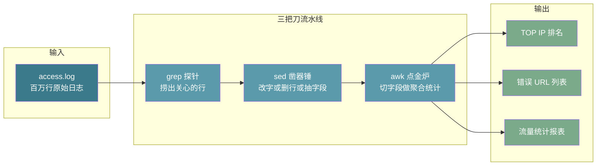

# 【金丹·89】sed/awk文本三剑客：日志分析和批量处理

> 码农·修仙传 · 金丹期 · 第89篇
> 我是玄芯散人，带你从炼气修到大乘。

---

## 境界标识

```
╔══════════════════════════════════╗
║     金丹期 · 第89篇              ║
║     sed/awk文本三剑客              ║
║     grep找行 / sed改行 / awk切列   ║
║     正则匹配 + 日志统计            ║
║     预计阅读：35 分钟              ║
╚══════════════════════════════════╝
```

---

## 修仙引入

088 那一篇把 Makefile 聊清楚了，编译这条流水线算是半自动。修真路不止编译这一条。还有一类更常见的脏活：服务跑了一晚上，access.log 多出 800MB，老板扔过来一句「看看哪个 IP 在刷接口」；运维给了 200 个配置文件，要批量改一行参数；CTO 想看这个季度哪个接口最常被调用。

这种活写 C 程序太重，写 Python 脚本又得先开个解释器。修真界里 Unix 祖师爷给弟子留了三把短刀：`grep`、`sed`、`awk`。`grep` 负责找出含关键字的行；`sed` 负责按条件替换或删行；`awk` 负责切字段做统计。这三把刀 1977 年传下来，比修真界里任何新潮工具都能扛。本篇把后两把讲透，正则打配合，最后拿 nginx 日志当样本走一遍统计流程。

修真比喻：修真界里 grep 是寻矿弟子，站在山头扫一眼就能锁定矿脉位置。sed 是凿器锤，矿石被敲成器胚。awk 是点金炉，按材料属性分拣熔铸。三把刀合起来就是一条完整的矿石加工线。

---

## 硬核主体

### 为什么是 sed/awk：修真界的文本三剑客

Unix 哲学第一条：「一个程序只做一件事，但做到极致」。修真界里 grep 找出行，sed 改字删行，awk 切字段统计——三者各管一摊，靠 `|` 管道串起来干大事：

| 工具 | 角色 | 典型场景 |
|------|------|----------|
| `grep` | 找出行 | 在日志里捞包含某个关键字的行 |
| `sed` | 编辑行 | 把所有 `old` 替换成 `new`，或按条件删行 |
| `awk` | 切列统计 | 按分隔符切开每行，对某列做聚合 |

三把刀叠加起来的套路：

```bash
# 第一刀：grep 捞出关心的行
grep "404" access.log | \
  # 第二刀：sed 把行改成想要的格式
  sed 's/.*: //' | \
  # 第三刀：awk 按 URL 聚合计数
  awk '{ count[$1]++ } END { for (u in count) print count[u], u }' | \
  # 第四步：sort 排序
  sort -rn | head
```

修真界里这一段五行命令顶得上一段 50 行的 Python 脚本。弟子会问：那 Python 不是更快吗？修真路里不是所有活都值得开脚本。像日志分析这种一次性任务，三把刀配合管道几分钟搞定。Python 一启动解释器就花一秒、加载 pandas 又得十秒。修真界里三把刀是「一次性刀法」，Python 是「开炉重铸」，各有各的适用场景。

修真比喻：修真界里 grep 像寻矿弟子的灵识探针，站在山头一指，弟子就知道哪片山有矿。sed 是凿器锤，凿完一块矿石就放下走人。awk 是点金炉，按材料属性把器胚熔成法器。整条流水线串起来就是「原矿入、成品出」的完整加工线。

### sed 基本用法：流编辑器一锤定形

`sed` 的全称是 Stream Editor，流编辑器。它一次读一行，处理完输出，原文件不动（除非加 `-i`）。这把凿器锤的设计哲学：凿一下改一个字，凿完就丢，从不回头。

#### 命令格式

```
sed [选项] '脚本' 输入文件
```

下面几个最常用的命令字符：

| 命令 | 含义 | 示例 |
|------|------|------|
| `s/old/new/` | 替换（每行只替换第一个匹配） | `sed 's/foo/bar/' file` |
| `s/old/new/g` | 全行替换（global） | `sed 's/foo/bar/g' file` |
| `d` | 删除匹配的行 | `sed '/pattern/d' file` |
| `p` | 打印匹配的行 | `sed -n '/pattern/p' file` |
| `i\text'` | 在行前插入 | `sed 'i\插入的行' file` |
| `a\text'` | 在行后追加 | `sed 'a\追加的行' file` |
| `c\text'` | 替换整行 | `sed 'c\新行' file` |

`p` 命令默认会把所有行再输出一遍，所以必须配 `-n`（安静模式）：`-n` 告诉 sed「没叫我打印的别出声」。

#### 替换命令 s

`S` 是 sed 最常用的命令。它有四种变体：

```bash
# 只替换每行第一个匹配
sed 's/foo/bar/' file.txt

# 全局替换（每行所有匹配都换）
sed 's/foo/bar/g' file.txt

# 忽略大小写
sed 's/foo/bar/gi' file.txt

# 替换第 N 个匹配（从 1 开始）
sed 's/foo/bar/2' file.txt
```

这条命令等价于 Python 的 `re.sub` + count 参数。区别是 sed 在流里逐行处理，不把全文读进内存。1GB 的日志也能凿完。

修真界里替换分隔符不一定是 `/`。如果原文里有 `/`，可以换 `|` 或 `#` 当分隔符：

```bash
# 路径里有 /，用 | 当分隔符
sed 's|/usr/local|/opt|g' file.txt

# 或用 #
sed 's#/usr/local#/opt#g' file.txt
```

这条细节常被忽略，工程里改路径命令用得上。

#### 删除命令 d

修真界里 `d` 命令删除匹配的行，常配正则地址：

```bash
# 删掉所有空行
sed '/^$/d' file.txt

# 删掉包含 DEBUG 的行
sed '/DEBUG/d' app.log

# 删掉第 5 行
sed '5d' file.txt

# 删掉 2-5 行
sed '2,5d' file.txt

# 删掉从匹配 start 到文件末尾
sed '/start/,$d' file.txt
```

这里 `^$` 是正则的「行首紧跟行尾」，等价于「这一行没东西」。这条写日志清理的时候常用：调试日志太多，先 `grep DEBUG` 出来看，再 `sed '/DEBUG/d'` 把 DEBUG 那一行剔掉。

修真路上有个坑：`-i` 选项之前要带扩展名（macOS 跟 Linux 不一样）。修真界里 macOS 的 BSD sed 要求 `-i ''`：

```bash
# Linux GNU sed
sed -i 's/foo/bar/g' file.txt

# macOS BSD sed
sed -i '' 's/foo/bar/g' file.txt
```

这条差异在跨平台脚本里一定要处理。

#### 地址范围

修真界里 sed 的地址不一定是「匹配某行」，可以用行号定位，也可以用行号范围圈一段：

```bash
# 10 到 20 行
sed '10,20d' file.txt

# 50 到结尾
sed '50,$d' file.txt

# 从 #BEGIN 到 #END 的范围
sed '/#BEGIN/,/#END/d' config.conf

# 只处理奇数行（步长）
sed '1~2d' file.txt
```

这条步长语法是 GNU sed 扩展，macOS 的 BSD sed 不支持。跨平台要删奇数行，改用 awk 处理：`awk 'NR%2==0' file.txt`（只保留偶数行，等价于删除奇数行）。

修真比喻：修真界里 sed 是流编辑器，像弟子手持一把凿器锤站在传送带旁。修真界里传送带送来一块矿石，弟子看一眼符纹（地址），符合的凿一下（s/d/p/i/a），不符合的直接传走。修真界里这条流水线永不回头，每块矿石只凿一次。

### awk 基本用法：点金炉切分字段

`awk` 名字取自三位创始人 Alfred Aho、Peter Weinberger、Brian Kernighan 三人姓氏首字母的组合（A、W、K）。修真界里它是一种「模式驱动的字段处理语言」。修真界里它的最小单位是「输入行 → 切字段 → 模式匹配 → 执行动作」。

#### 命令格式

```
awk 'BEGIN{初始化} 模式{动作} END{收尾}' 文件
```

awk 处理文件时，分三段走：BEGIN 在读文件前跑一次；正文对每行做模式匹配，匹配就跑动作；END 在文件读完跑一次。这三个段可以全省略，只写中间的动作也行。

一行里最常见的写法：

```bash
# 打印第 1 和第 3 列（默认分隔符是空白）
awk '{ print $1, $3 }' file.txt

# 打印每行的字段数
awk '{ print NF }' file.txt

# 打印行号
awk '{ print NR, $0 }' file.txt
```

这里 `$0` 是整行，`$1` 是第 1 列，`$2` 是第 2 列，`$NF` 是最后一列。

#### 内置变量

awk 自带一组内置变量，掌握了就能少写一半代码：

| 变量 | 含义 |
|------|------|
| `$0` | 当前整行 |
| `$1`、`$2`... | 第 N 个字段 |
| `NR` | 当前行号（Number of Record） |
| `NF` | 当前行的字段数（Number of Field） |
| `FS` | 输入字段分隔符（默认空白字符） |
| `OFS` | 输出字段分隔符（默认空格） |
| `RS` | 输入记录分隔符（默认换行） |
| `ORS` | 输出记录分隔符（默认换行） |
| `FILENAME` | 当前文件名 |

修改分隔符用 `-F` 或在 BEGIN 里设：

```bash
# 用冒号切（/etc/passwd 用冒号）
awk -F: '{ print $1, $3 }' /etc/passwd

# 用 BEGIN 改分隔符
awk 'BEGIN{ FS=":"; OFS="|" } { print $1, $3 }' /etc/passwd
```

#### 模式与动作

awk 的核心是「模式 + 动作」结构。模式能用正则写，也能用比较表达式写。不写模式默认对所有行生效：

```bash
# 模式：行包含 ERROR
awk '/ERROR/ { print $0 }' app.log

# 模式：第 3 列大于 100
awk '$3 > 100 { print $1, $3 }' data.txt

# 模式：第 1 列等于 "404"
awk '$1 == "404" { print }' log.txt

# 多个模式用逗号连：范围匹配
awk '/start/,/end/ { print }' log.txt
```

修真界里 `print` 不带参数默认打印 `$0`。修真界里 `printf` 用 C 语言格式化：

```bash
# 格式化输出
awk '{ printf "%-15s %5d\n", $1, $3 }' data.txt
```

#### 关联数组：awk 的杀手锏

修真界里 awk 最大的杀手锏是「关联数组」（associative array），可以拿字符串当下标：

```bash
# 统计每行第 1 列出现次数
awk '{ count[$1]++ } END { for (k in count) print count[k], k }' data.txt
```

修真界里 `count[$1]++` 意思是：把第 1 列当下标，访问一次自增一次。修真界里 END 段遍历数组打印。修真界里这种「一维表」统计比 Python 的 `collections.Counter` 还顺手。

修真界里想按值排序怎么办？awk 本身不排序，要靠管道：

```bash
# 统计 + 排序 + 取前 10
awk '{ count[$1]++ } END { for (k in count) print count[k], k }' data.txt | sort -rn | head
```

`sort -rn` 是按数字倒序排序，`head` 取前 N 行。这一串就是「前 10 名频次」统计的标准写法。

修真比喻：修真界里 awk 是点金炉，弟子把矿石按品类（字段）倒进对应的格子（数组）。炉子自动点数（++），最后弟子在 END 时打开格子按品类收金。这套「自动分拣计数」是 1977 年 Aho 三人组的遗产，比 Python 的 Counter 还早 25 年。

### 正则表达式基础：识丹纹的火眼金睛

修真界里 sed 和 awk 都依赖正则表达式定位文字。正则不是语言，是「字面模式匹配」的小语法。修真界里几个最常用的元字符：

| 元字符 | 含义 |
|--------|------|
| `.` | 任意单个字符（除换行） |
| `*` | 前一个字符 0 次或多次 |
| `+` | 前一个字符 1 次或多次 |
| `?` | 前一个字符 0 次或 1 次 |
| `^` | 行首 |
| `$` | 行尾 |
| `[abc]` | 字符集（a、b、c 之一） |
| `[^abc]` | 非字符集 |
| `[a-z]` | 范围 |
| `{n}` | 前一个字符恰好 n 次 |
| `{n,}` | 前一个字符至少 n 次 |
| `{n,m}` | 前一个字符 n 到 m 次 |
| `\|` | 或（GNU 扩展） |
| `\b` | 词边界 |
| `()` | 分组捕获 |
| `\1`、`\2` | 反向引用 |

修真界里这几个元字符的组合能描述现实世界大部分「文本形状」。

下面几个具体的例子（先看一下，后面实战会用）：

```bash
# 匹配 IP 地址（简化版）
grep -E '([0-9]{1,3}\.){3}[0-9]{1,3}' access.log

# 匹配邮箱
grep -E '[a-zA-Z0-9]+@[a-zA-Z0-9]+\.[a-z]+' users.txt

# 匹配时间戳（HH:MM:SS）
grep -E '[0-9]{2}:[0-9]{2}:[0-9]{2}' app.log

# 匹配 URL 中的路径
sed -nE 's|.*"GET (/[^ ]*).*|\1|p' access.log
```

这几个例子留个印象就行，下面实战再展开。

正则有两套语法：BRE（Basic Regular Expression）和 ERE（Extended Regular Expression）。BRE 里 `+` `?` `|` `()` 都是字面字符，要变功能得加 `\` 转义。ERE 里 `+` `?` `|` `()` 直接是元字符。`grep -E`、`sed -E`、`awk` 默认用 ERE。`grep`、`sed` 不带 `-E` 用的是 BRE。

```bash
# BRE：要转义
grep '\(foo\|bar\)' file.txt

# ERE：直接用
grep -E '(foo|bar)' file.txt
```

工程里推荐都用 ERE，省一半反斜杠。

修真比喻：修真界里正则像弟子修炼的火眼金睛。修真界里看一堆符纹（字符），能识别「这个纹路代表 IP 地址」「这个纹路代表邮箱」。修真界里元字符就是金睛的种类：`.` 表示任意单字符；`*` 和 `+` 表示重复次数；`[]` 是这一类纹路。修真界里金睛一亮，纹路对应的实体立刻浮出来。

### 实战：分析 nginx 访问日志

修真界里这一节拿真实 nginx 日志走一遍。修真界里 nginx 默认 access log 格式长这样：

```
192.168.1.10 - - [29/Aug/2026:10:23:45 +0800] "GET /api/user HTTP/1.1" 200 1024 "https://example.com/" "Mozilla/5.0 ..."
```

这一行字段顺序固定，先放客户端 IP 和占位符，再放时间和请求行，再放状态码和响应字节，最后挂 Referer 和 User-Agent。括号里是字段含义。修真界里 nginx 配置里用的是变量名：

```
log_format main '$remote_addr - $remote_user [$time_local] "$request" $status $body_bytes_sent "$http_referer" "$http_user_agent"';
```

这个默认格式是 nginx `combined` 类型，工业界 99% 的网站都用它。

为演练，先造一段样本日志：

```bash
# sample.log
cat > /tmp/sample.log << 'EOF'
192.168.1.10 - - [29/Aug/2026:10:00:01 +0800] "GET /index.html HTTP/1.1" 200 1024 "-" "Mozilla/5.0"
192.168.1.20 - - [29/Aug/2026:10:00:02 +0800] "GET /api/user HTTP/1.1" 200 512 "-" "curl/7.0"
192.168.1.10 - - [29/Aug/2026:10:00:03 +0800] "POST /api/login HTTP/1.1" 401 128 "-" "Mozilla/5.0"
192.168.1.30 - - [29/Aug/2026:10:00:04 +0800] "GET /api/user HTTP/1.1" 404 0 "-" "Mozilla/5.0"
192.168.1.10 - - [29/Aug/2026:10:00:05 +0800] "GET /api/order HTTP/1.1" 200 2048 "-" "Mozilla/5.0"
192.168.1.20 - - [29/Aug/2026:10:00:06 +0800] "GET /api/user HTTP/1.1" 200 512 "-" "curl/7.0"
192.168.1.10 - - [29/Aug/2026:10:00:07 +0800] "GET /api/order HTTP/1.1" 200 2048 "-" "Mozilla/5.0"
192.168.1.40 - - [29/Aug/2026:10:00:08 +0800] "GET /api/product/123 HTTP/1.1" 404 0 "-" "Mozilla/5.0"
192.168.1.20 - - [29/Aug/2026:10:00:09 +0800] "POST /api/login HTTP/1.1" 200 256 "-" "curl/7.0"
192.168.1.10 - - [29/Aug/2026:10:00:10 +0800] "GET /index.html HTTP/1.1" 304 0 "-" "Mozilla/5.0"
EOF
```

nginx 日志默认用空格切不干净——时间字段里有空格、引号里有空格。直接 `awk '{ print $1 }` 拿到的是 IP，但 `print $7` 拿到的是 `1024`，不是预期的请求行。解法是自定义分隔符：

```bash
# 用双引号当分隔符（请求行是带双引号的一段）
awk -F'"' '{ print $2 }' /tmp/sample.log | head
# 输出：
# GET /index.html HTTP/1.1
# GET /api/user HTTP/1.1
# ...
```

`awk -F'"'` 是用双引号当分隔符。修真界里日志被切成三段：第 1 段是 IP 和时间；第 2 段是请求行；第 3 段是状态码、字节大小、Referer 来源、User-Agent 这些尾巴。这一招是分析 nginx 日志的「起手式」。

#### 任务 1：TOP 10 访问 IP

这个问题就用「awk 关联数组 + sort」：

```bash
awk '{ count[$1]++ } END { for (ip in count) print count[ip], ip }' /tmp/sample.log | sort -rn | head -10
```

输出：

```
4 192.168.1.10
3 192.168.1.20
2 192.168.1.30
1 192.168.1.40
```

`$1` 默认就是 IP（空格切分，第 1 段就是 IP）。这一条命令跑在真实日志上，输出就是「哪个 IP 在刷接口」。

这一招还能扩展：把 IP 替换成 URL，看 TOP URL：

```bash
# 用双引号切，$2 是请求行
awk -F'"' '{ count[$2]++ } END { for (u in count) print count[u], u }' /tmp/sample.log | sort -rn | head -10
```

输出：

```
2 GET /api/order HTTP/1.1
2 GET /api/user HTTP/1.1
2 GET /index.html HTTP/1.1
1 POST /api/login HTTP/1.1
1 GET /api/product/123 HTTP/1.1
```

请求行里把 URL 抠出来用 sed：

```bash
# 把请求行换成只剩 URL（GET 和 POST 后面的路径）
# 注意：分隔符用 @ 避免和 ERE 中的 | 算符冲突
sed -nE 's@.*"(GET|POST) (/[^ ]*).*@\2@p' /tmp/sample.log | sort | uniq -c | sort -rn | head
```

`sed -E` 是 ERE 模式。`(GET|POST) (/[^ ]*)` 匹配「方法+空格+路径」。`\1` 是方法，`\2` 是路径。`uniq -c` 是「去重+计数」，这一招是统计频次的「瑞士军刀」。

#### 任务 2：找出所有 404 请求

awk 的 `$9` 是状态码（默认空格切分下，依次是 IP 段、ident 占位、user 名、时间段、请求行、状态码、字节数、referer 链、UA 标识）：

```bash
awk '$9 == "404" { print $7 }' /tmp/sample.log
```

这条命令输出所有 404 请求的 URL。再配 grep 抓详情：

```bash
# 看 404 详情
awk '$9 == "404"' /tmp/sample.log

# 看 4xx 和 5xx 错误
awk '$9 ~ /^[45]/ { print }' /tmp/sample.log
```

`-E` 模式，`$9 ~ /^[45]/` 匹配 4xx 或 5xx。`~` 是 awk 里的「匹配」运算符，`[45]` 比 `4|5` 更直白。

#### 任务 3：统计总流量

`$10` 是响应字节数（这个跟 nginx 配置有关）。流量累加用 awk 累加器：

```bash
# 总流量（字节）
awk '{ total += $10 } END { print total, "bytes" }' /tmp/sample.log
```

这一条命令输出全部请求的响应总字节数。想转成 KB/MB：

```bash
awk '{ total += $10 } END { printf "%.2f MB\n", total/1024/1024 }' /tmp/sample.log
```

`printf` 跟 C 语言一样用。`%.2f` 是保留两位小数。

#### 任务 4：找访问频次最高的 IP 时间段

这种任务要结合时间字段。时间字段是 `$4`（带方括号），先把它提取出来：

```bash
# 提取 IP 和小时（time_local 格式：[29/Aug/2026:10:00:01 +0800]）
awk -F'[:/]' '{ ip=$1; hour=$5 } { print hour, ip }' /tmp/sample.log
```

`awk -F'[:/]'` 是用冒号和斜杠当分隔符。这一招把一行切成多段：
- `$1` = `192.168.1.10 - - [29`
- `$2` = `Aug`
- `$3` = `2026`
- `$4` = `10`
- `$5` = `00`
- `$6` = `01 +0800] "GET ...`

这一招是把日志字段「按时间维度切片」的标准做法。

这一节所有命令合起来就是一条「管道流水线」：

```bash
# 完整流水线：TOP 10 错误 URL
awk '$9 ~ /^[45]/' /tmp/sample.log | \
  sed -nE 's@.*"(GET|POST) (/[^ ]*).*@\2@p' | \
  sort | uniq -c | sort -rn | head -10
```

这条流水线跑下来，弟子就能给老板交差：「昨晚 4xx 错误集中在 /api/login 路径，建议查认证逻辑。」这一段就是从海量日志里淘金。

修真比喻：修真界里分析 nginx 日志像「灵脉巡查」。弟子沿灵脉走（grep/sed 过滤），数每根灵脉的流量（awk 统计），最后给长老报一份灵脉图（sort + head）。这一套三把刀配合的活，师徒之间传了几百年没换过。



修真比喻：这张图是「矿脉加工流水线」。access.log 是原矿，三把刀是加工站，最后吐出的是「灵脉图」。每把刀只干一件事，但流水线一开就是「成品出」。

---

## 修仙术语对照表

| 修仙术语 | 技术现实 | 本篇位置 |
|----------|----------|----------|
| 三把短刀 | grep / sed / awk 文本三剑客 | 文本三剑客定位 |
| 寻矿弟子 | grep 按模式找行 | 文本三剑客定位 |
| 凿器锤 | sed 流编辑器 | sed 基本用法 |
| 矿石过传送带 | sed 一行行处理 | sed 基本用法 |
| 点金炉 | awk 字段处理器 | awk 基本用法 |
| 按品类分拣 | awk 字段分割 $1/$NF | awk 基本用法 |
| 自动点数 | awk 关联数组 count[k]++ | awk 关联数组 |
| 火眼金睛 | 正则表达式 | 正则基础 |
| 识丹纹 | 正则匹配字符串 | 正则基础 |
| 任意纹路 | `.` 元字符 | 正则基础 |
| 重复多次 | `*` `+` `?` 元字符 | 正则基础 |
| 纹路种类 | `[]` `[^]` 字符集 | 正则基础 |
| 灵脉巡查 | 日志分析 | nginx 日志实战 |
| 淘金流水线 | grep+sed+awk 管道 | nginx 日志实战 |
| 灵脉图 | TOP IP / 错误 URL / 流量报表 | nginx 日志实战 |

---

## 进阶条件

- [ ] 能用 `sed 's/old/new/g' file` 完成单文件全文替换
- [ ] 能用 `sed -i 's/.../.../g' *.conf` 批量改多个配置文件，处理 macOS/Linux 的 `-i` 差异
- [ ] 能用 `awk '{ print $1, $NF }' file` 按字段切分并打印
- [ ] 能用 `awk -F: '{ print $1 }' /etc/passwd` 自定义分隔符处理冒号分隔的文件
- [ ] 能用 `awk '{ count[$1]++ } END { for (k in count) print count[k], k }'` 写一维频次统计
- [ ] 能用 `sed -nE 's|.*"GET (/[^ ]*).*|\1|p' access.log` 抽出所有 GET 请求的 URL
- [ ] 能用 `awk '$9 == "404"' access.log` 过滤 nginx 错误请求
- [ ] 能用 `grep -E '([0-9]{1,3}\.){3}[0-9]{1,3}' file` 匹配 IP 地址（区分 BRE/ERE 写法）

这些条件全通过，sed/awk 这一关就算破了。修真路不止，下一篇是 090 金丹期毕业，能读懂任何系统级代码。弟子把这一摞功法串起来时，眼界能拔多高，毕业标准怎么列，下一篇见分晓。

---

## 下期预告 + 互动

下一篇：090 金丹期毕业，能读懂任何系统级代码。这一篇是把 061 到 089 的全部金丹期功法做一次收束。像编译原理、链接加载这类散落的功法，弟子要把它们串起来。毕业后应该具备什么能力？毕业标准怎么定？下一篇会列一份「金丹期毕业自测清单」。

互动话题：

1. 你修真路上写过最长的 awk 脚本有多少行？用 awk 干过哪些让你拍大腿的活？
2. 日志分析时你用 Python + pandas 还是直接上三把刀？两套工具的适用边界在哪？

---

## 落款

*本文是「码农修仙传」系列第89篇。系列导航见 [xren.ren](https://xren.ren)*