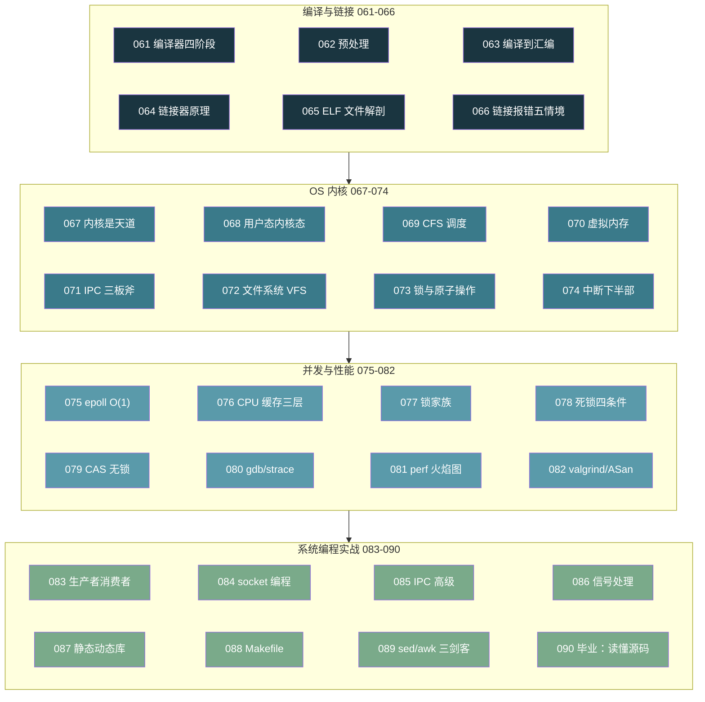

# 【金丹·90】金丹期毕业：能读懂任何系统级代码

> 码农修仙传 · 金丹期 · 第90篇（毕业篇）
> 我是玄芯散人，带你从炼气修到大乘。

---

## 境界标识

```
╔══════════════════════════════════╗
║     金丹期 · 第90篇（毕业篇）    ║
║     能读懂任何系统级代码          ║
║     知识体系回顾 / 源码阅读法     ║
║     Redis · SQLite · nginx 三选一 ║
║     预计阅读：38 分钟             ║
╚══════════════════════════════════╝
```

---

## 修仙引入

061 到 089，二十九篇金丹功法，走完了。

修真界里这段路弟子能看到：061 看到「编译器干了啥」，070 看到「每个进程都以为自己独占 4GB」，075 看到「epoll 是怎么做到 O(1) 的」，080 看到「原来程序员也能开天眼」……一篇一篇堆下来，眼界比炼气筑基期厚了一寸。可金丹期的毕业标准不止是「你学了多少」，还要看你「能看多少」。

这一篇把二十九篇串起来看，给弟子一张金丹期知识地图，再出一道毕业考试：用一个月时间选一个开源项目，从源码结构读起，把它读懂。再之后，元婴期大门打开，CPU 指令集、晶体管翻转，寄存器位操作会在那里等着。

修真比喻：修真界里金丹期毕业典礼不是一场庆典，是一场「开天眼」的考核。考核官把弟子扔到一个陌生的开源秘境，给一炷香时间，要弟子能在半炷香内摸清秘境结构，在剩下半炷香里指出一处可以改进的空间。能做到就算毕业，做不到继续修。

---

## 硬核主体

### 金丹期二十九篇：弟子都修了什么

修真界里 061 到 089 是金丹期的全部功法。按规划书分四组，每组约七到八篇。

第一组编译与链接（061 到 066）是金丹期第一关。弟子看到 `gcc main.c -o app` 不再是黑箱。四步流水线背得滚瓜烂熟：预处理展开头文件，然后编译出汇编，再汇编成 ELF `.o`，最后链接器解决符号。065 看到了 ELF 文件头里有 `.text` `.data` `.bss`，066 看到了 `undefined reference` 到底是链接器找不到符号还是库的顺序写反。066 还顺手把静态库和动态库的使用差异摸过一遍。修真比喻里这一关是「炼丹流程」：把矿石（源码）预处理，研磨，烧制，熔合，最后铸成灵器（可执行文件）。

第二组操作系统内核（067 到 074）是金丹期第二关。067 看 OS 内核是天道规则，068 看用户态和内核态切换（`int 0x80` 和 `syscall` 两条路），069 看 CFS 调度器用红黑树挑下一个进程，070 看虚拟内存怎么把物理内存伪装成 4GB，071 看 IPC 三种机制（管道或共享内存或信号）的取舍，072 看 inode 和 VFS，073 看 mutex/spinlock/CAS 三种锁的代价差，074 看中断下半部的实现（软中断或 tasklet 或 workqueue）为什么不能在进程上下文里 sleep。修真比喻里这一关是「天道规则」：弟子不再把 OS 当黑盒，开始懂得「系统调用」是凡人修士和天道之间的契约。

第三组并发与性能（075 到 082）是金丹期第三关。075 看 epoll 是怎么用红黑树加就绪链表做到 O(1) 的，076 看 L1/L2/L3 缓存和 MESI 协议，077 看锁家族怎么挑，078 看死锁的四个必要条件，079 看 CAS 怎么实现无锁队列，080 看 perf/strace/gdb 三件套，081 看 perf 火焰图，082 看 valgrind 和 ASan。修真比喻里这一关是「灵脉运用」：弟子先要会写并发代码，再要会写高性能代码，最后要会找性能瓶颈在哪。

第四组系统编程实战（083 到 090）是金丹期第四关。083 实战生产者消费者模型，084 实战 socket 网络编程，085 实战 IPC 三板斧，086 实战信号处理（信号安全函数列表），087 实战静态库动态库制作，088 实战 Makefile 自动化，089 实战 sed/awk 日志分析三剑客。修真比喻里这一关是「法器铸造」：弟子不再纸上谈兵，开始亲手铸剑，亲手磨刀，亲手打日志。

二十九篇功法串起来看，金丹期要的不是「会用 API」，是「看得到 API 背后那几层硬件和软件在配合」。这一关没过的弟子，看 Redis 源码会觉得是在看天书；这一关过的弟子，看 Redis 源码会觉得是在看一部精妙的机关图。

### 毕业标准：能读懂开源项目源码结构

修真界里金丹期毕业考核不是笔试，是实战。

考核官把弟子领到一个开源秘境门口（GitHub 仓库），告诉弟子三个条件：

其一，能在 1 小时内摸清这个项目的目录结构，知道 `src/` `include/` `tests/` `docs/` 各自放什么；

其二，能在 4 小时内找到这个项目的「主入口函数」，知道程序启动后第一行跑的是哪段代码；

其三，能在 1 周内指出这个项目至少一处「可以改进的点」，哪怕是注释不规范、变量命名不统一也行，但要言之有据。

三个条件全过，就算毕业。

修真比喻：考核官不要求弟子把整个秘境走完（开源项目动辄几十万行，十年老手也读不完）。考核官要的是弟子能在一炷香内画出秘境的结构图，能指出哪条主路通向大殿，哪条小路通向藏经阁。结构一清，剩下的就是功夫深浅的问题。

### 看源码的方法论：三把钥匙

修真界里读源码不是「逐行读到尾」，那是笨功夫。开源界有现成的三把钥匙，叫「三种读法」。金丹期弟子三把都得会，看不同情况换着用。

#### 钥匙一：自顶向下（Top-Down）

从「主入口」开始追。修 Redis 就追 `server.c` 里的 `main()`；修 SQLite 就追 `shell.c` 里的 `main`（命令行入口）或 `sqlite3.c` 里的 `sqlite3_open`（库入口）；修 nginx 就追 `nginx.c` 里的 `main()`。沿调用栈一层一层往下追，每追到新文件就回头看一眼「这是在做哪一层的事」。这条路适合「快速摸清结构」，1 到 2 小时能画出一张粗略的模块图。

修真比喻：自顶向下是「御剑俯瞰」。弟子站在秘境上空，先把整个秘境的轮廓画下来，再决定从哪个门进去。自顶向下要求弟子克制「逐行读」的冲动，不是每行都值得读，懂结构比懂细节优先。

#### 钥匙二：自底向上（Bottom-Up）

从「最底层的数据结构」开始读。比如修 Redis 先读 `dict.h` 哈希表，再读 `adlist.h` 双向链表，然后是 `sds.h` 简单动态字符串；修 SQLite 先读 `Btree` 然后读 `Pager`；修 nginx 先读 `ngx_buf_t` 然后读 `ngx_pool_t`。把数据结构读懂，再去看上层逻辑怎么操作这些结构。底层读懂后，上层代码的「为什么这么写」会变得自然。

修真比喻：自底向上是「寻脉掘井」。弟子先找到灵脉源头，把井打到头，看清水流方向。再去查河流走向就一目了然。底层数据结构是开源项目里最稳定的部分，几十年不变；上层业务逻辑会随版本迭代而变。从稳的地方入手，性价比最高。

#### 钥匙三：断点追踪（Trace-Driven）

挑一个具体的功能，跟踪它的链路。比如 Redis 跟一条 `SET key value` 命令，客户端连接进来后，解析协议，分发到 `setCommand`，再写入 dict，再写 AOF，最后回复 +OK 全链追踪一遍。跟踪时给函数打断点，看 call stack 一层层深入。GDB 的 `bt` 命令，或者 perf 的追踪，或者 printf 打日志都行。断点追踪适合「搞懂一个机制」，3 到 5 小时能把一条机制吃透。

修真比喻：断点追踪是「顺藤摸瓜」。弟子挑一根藤，一个命令或者一个请求或者一个中断，沿着藤一路摸过去直到藤尾，把中间经过的所有瓜都记录下来。一根藤追完，整个秘境的机关联动就懂了。

修真界里这三把钥匙不互斥。修一个项目一般是先用自顶向下画结构，然后用自底向上读关键数据结构，最后用断点追踪搞一两条主线。三把钥匙交替用，一个月下来就能摸清一个十万行级别的开源项目。

### 推荐练手项目：Redis / SQLite / nginx 三选一

修真界里开源项目多如星辰，金丹期弟子挑第一个练手对象时，建议从代码量适中、文档齐全的项目里选，再看社区是否活跃。三个候选都是这个标准的：Redis（约 5 万行 C）、SQLite（约 15 万行 C，但 amalgamation 后关键代码约 8 万行）、nginx（约 17 万行 C）。三选一即可，下表是它们的对比：

| 项目 | 主语言 | 代码量 | 入口文件 | 入门难度 | 推荐方向 |
|------|--------|--------|----------|----------|----------|
| Redis | C | 约 5 万行 | `server.c::main()` | ⭐⭐⭐ | 数据结构 / 网络 / 单线程 Reactor |
| SQLite | C | 约 15 万行（amalgamation 约 8 万行） | `shell.c::main` | ⭐⭐⭐⭐ | B-tree / 事务 / 编译器（SQL 解析） |
| nginx | C | 约 17 万行 | `nginx.c::main()` | ⭐⭐⭐⭐⭐ | 模块化 / 内存池 / 多进程 / 事件驱动 |

修真比喻：Redis 是「短兵器」，招式紧凑，五脏俱全；SQLite 是「长兵器」，功能庞大，结构精密；nginx 是「重兵器」，威力大但门槛高。修真界建议弟子先修短兵器（Redis），再修长兵器（SQLite），最后才碰重兵器（nginx）。

#### Redis 源码结构：短兵器范本

Redis 7.x 的源码根目录布局非常直观：

```
redis/
├── src/                # 全部 C 源码（约 100 个 .c 文件）
│   ├── server.c        # 主入口：main() + 命令表 + 事件循环
│   ├── networking.c    # 客户端连接管理
│   ├── db.c            # 数据库（dict 增删改查）
│   ├── dict.c          # 哈希表实现（关键数据结构）
│   ├── adlist.c        # 双向链表
│   ├── sds.c           # 简单动态字符串（Redis 的"string"类型）
│   ├── ae.c            # 事件循环（epoll/wakeup/kqueue 封装）
│   ├── object.c        # 五种数据类型的对象系统
│   ├── t_string.c      # 字符串命令实现
│   ├── t_hash.c        # 哈希命令实现
│   ├── t_list.c        # 列表命令实现
│   ├── t_set.c         # 集合命令实现
│   ├── t_zset.c        # 有序集合命令实现
│   ├── aof.c           # AOF 持久化
│   ├── rdb.c           # RDB 持久化
│   └── ...
├── tests/              # 单元测试和集成测试
├── deps/               # 第三方依赖（hiredis、jemalloc 等）
└── utils/              # 辅助工具
```

修真比喻里 Redis 的目录结构是「分层武器架」：`object.c` 是武器架总管，`t_*.c` 是按武器类型分格摆放（剑或者刀或者枪或者戟），`dict.c` `adlist.c` `sds.c` 是武器的材料仓库，`ae.c` 是武器测试场，`aof.c` `rdb.c` 是武器保养房。

看 Redis 源码建议从 `server.c::main()` 起手，跟完一遍「启动 → 监听端口 → 接收连接 → 解析命令 → 调用 `setCommand` → 写入 dict → 回复 +OK」的链路。然后单独读 `dict.c` 里的哈希表实现（Redis 最重要的数据结构），再读 `ae.c` 的事件循环。三块读完后，Redis 的骨架就立住了。

修真比喻里「Redis 主入口到 setCommand」是「弟子下山接第一单任务」的完整演练：接令是解析协议，派任务是查命令表，干活是写 dict，回执是回复客户端。

#### SQLite 源码结构：长兵器范本

SQLite 3.x 的源码有两种组织形式：一种是分目录的「canon（canonical）」源码；另一种是把全部源码塞进一个文件的「amalgamation」。修真界里初学者推荐先看 amalgamation 版的 `sqlite3.c`，单文件 23 万行，搜索跳转都方便。

amalgamation 文件结构按区块划分：

```
sqlite3.c
├── Main                # sqlite3.c: 顶层接口
├── Hash                # 哈希函数
├── StrAccum            # 字符串缓冲
├── UtilFunc            # 工具函数（内存分配、字符串处理）
├── VarInt              # 可变长度整数编码
├── Btree               # B-tree 存储引擎（关键）
├── Pager               # 页面缓存 + 日志（WAL）
├── OsFile              # 操作系统文件接口
├── VFS                 # 虚拟文件系统
├── Pcache              # 页缓存
├── Wal                 # 预写日志
├── Mem                 # 内存分配
├── Mutex               # 互斥锁
├── Vdbe                # 虚拟机（执行字节码）
├── VdbeAPI             # 虚拟机 API
├── VdbeCode            # 字节码生成器
├── Parser              # SQL 解析器（Lemon 生成）
├── Tokenize            # 词法分析器
├── Select              # SELECT 查询实现
├── Where               # WHERE 子句改进
├── Expr                # 表达式处理
├── Attach              # 多数据库附加
├── Trigger             # 触发器
├── Fkey                # 外键
├── Vacuum              # 数据库压缩
├── ...
└── Status              # 状态码
```

修真比喻里 SQLite 的 amalgamation 是「一卷长兵器图谱」：图谱开头是介绍（Main），中间是兵器构造（Btree 加上 Pager 加上 Wal），后半段是招式套路（Vdbe 加上 Parser 加上 Select）。每个区块都有大括号注释 `/* ----- xxx ----- */` 隔开，翻图谱时一目了然。

看 SQLite 源码建议先看 `Main` 区块的 `sqlite3_open` 到 `sqlite3_exec` 顶层接口，再跳到 `Btree` 和 `Pager`（关键存储），最后看 `Vdbe`（虚拟机执行）。三块读完后，整个 SQLite 的「数据怎么落盘、怎么取出来」就清楚了。

修真比喻里「SQLite 的 Btree 加上 Vdbe」是「剑宗的两条真传」：Btree 是铸剑术（怎么存数据），Vdbe 是剑招（怎么查数据）。两条真传都修了，弟子才算进了 SQLite 的大门。

#### nginx 源码结构：重兵器范本

nginx 1.20+ 的源码目录更复杂，因为它是高度模块化的：

```
nginx/
├── src/
│   ├── core/           # 核心：nginx.c（入口）、ngx_string.c、ngx_array.c
│   ├── event/          # 事件模块：ngx_event.c、ngx_epoll.c
│   ├── http/           # HTTP 模块：ngx_http.c、ngx_http_request.c
│   ├── mail/           # 邮件代理模块
│   ├── stream/         # TCP/UDP 代理模块
│   ├── os/             # OS 抽象层
│   │   ├── unix/       # Unix/Linux 实现
│   │   └── win32/      # Windows 实现
│   └── misc/           # 杂项工具
├── auto/               # 编译脚本（configure）
├── conf/               # 默认配置文件
├── contrib/            # 第三方工具
├── docs/               # 文档
└── tests/              # 测试
```

修真比喻里 nginx 的目录是「宗门堂口」：核心堂（`core/`）管总调度，事件堂（`event/`）管消息传递，HTTP 堂（`http/`）管网页往来，平台堂（`os/`）管跨宗门外交。每个堂口都是一个子宗门，堂主是各自的模块结构体（如 `ngx_event_module_t` 或 `ngx_http_module_t`）。

nginx 的入口在 `core/nginx.c::main()`，但它真正的工作模式在 `event/ngx_event.c` 和 `http/ngx_http.c` 里。修真界里读 nginx 建议从 `ngx_cycle_t` 这个全局数据结构入手。所有模块都挂在 `cycle` 上，像一棵倒长的树，根在 `cycle`，叶在各模块。看懂 `ngx_cycle_t` 的初始化流程，nginx 的整体框架就立住了。

修真比喻里 nginx 的「cycle」是「宗门议事堂」。议事堂每开一次会（初始化），各堂口（模块）就报到登记一次。会开完，整个宗门的运转规则就定下来了。

### 金丹期知识地图：四组功法全景

修真界里弟子把金丹期四组功法串起来，应该能用一张图看出整个阶段的脉络：



修真比喻：这张图是「金丹期修炼路线图」。弟子从左下角上山（编译与链接组入门），往右走完四组，最后一路走到右下角下山（毕业考核）。每组功法约七到八篇，前后组之间有依赖：编译与链接组打底（让弟子看到程序的「外壳」），OS 内核组深入（让弟子看到程序的「运行空间」），并发与性能组深化（让弟子看到程序的「运转方式」），系统编程实战组收口（让弟子动手铸剑）。

修真界里这张图还有一个隐藏含义：四组功法的颜色由深到浅（`#1A3540` 到 `#7AAA8A`），对应弟子眼界的提升过程。先是「看到程序的编译产物」，最后是「动手写一个高性能服务」，金丹期弟子的能力弧线就是这一笔渐变。

### 一个月读懂一个开源项目：修真界的时间表

修真界里读源码不是「三天打鱼两天晒网」，要按计划推。给弟子一份一个月的时间表（按 Redis 5 万行为例）：

```
第 1 周：环境准备 + 自顶向下画结构
  ├─ D1: git clone + make + 跑通单元测试
  ├─ D2: server.c::main() 通读，画调用栈
  ├─ D3: server.c 的命令表 + 事件循环主框架
  ├─ D4: networking.c 客户端连接
  ├─ D5: ae.c 事件循环源码
  ├─ D6: dict.c 哈希表数据结构
  └─ D7: 整理周报，画出模块依赖图

第 2 周：自底向上读数据结构
  ├─ D8-D9: dict.c + adlist.c 全部读完
  ├─ D10-D11: sds.c 字符串实现
  ├─ D12-D13: object.c 五种对象系统
  └─ D14: 整理数据结构总结

第 3 周：断点追踪两到三条主线
  ├─ D15-D16: SET 命令完整链路
  ├─ D17-D18: GET 命令完整链路
  ├─ D19-D20: AOF 持久化链路
  └─ D21: 整理命令执行链路文档

第 4 周：输出与复盘
  ├─ D22-D24: 写源码阅读笔记（一万字以上）
  ├─ D25-D26: 在 GitHub 提一个 PR（哪怕是文档或注释）
  ├─ D27-D28: 写一篇博客分享读源码心得
  └─ D29-D30: 复盘：哪些懂了，哪些没懂，下一步计划
```

修真比喻：修真界里这三十天相当于「闭关」。闭关第一天师傅把秘境入口打开（git clone），闭关中旬师傅每天检查一遍进度（周报加模块图），闭关最后一天弟子出关交作业（源码笔记加第一个 PR）。出关时师傅要看三样东西：结构图代表懂结构，笔记代表懂细节，PR 代表懂贡献流程。三样齐全就算闭关成功，金丹期毕业。

修真界里这个时间表也适用于 SQLite 和 nginx。SQLite 可以延长到 6 周（关键代码 8 万行），nginx 可以延长到 8 周（17 万行加模块化结构）。三个项目里任何一个按计划读完，金丹期毕业都站得住。

### 下一站预告：元婴期，代码穿透到物理世界

修真界里金丹期毕业，元婴期大门就开了。金丹期看的是「软件怎么跑」，元婴期看的是「代码怎么变成物理动作」。这一关过去，弟子就不再是「程序员」，是「能让硬件动起来的工程师」。

元婴期第一篇 091：x86/ARM/RISC-V 三大指令集对比。这一篇讲 ISA（指令集架构）的概念，CISC vs RISC 的设计哲学分歧，手写一段汇编看看 CPU 到底在跑什么。091 之后是 092 那一篇讲 C 代码到晶体管翻转，把「一条 C 语句」和「一根 MOS 管」串起来。093 是元婴期主场介绍，094 是 ARM 和 RISC-V 的商业模式大战。

修真比喻：修真界里金丹期毕业典礼的最后一幕是「天眼测试」。测试官问弟子：「你看到的是天道运行的画面，还是凡人修士的幻象？」金丹期弟子看到的还是「幻象」（软件位置的概念）；元婴期弟子要看到「天道」（硬件位置的真相）。这一关最难过的不是技术，是眼界。很多金丹期大能一辈子卡在这一关，不是因为不懂硬件，是因为不愿承认软件世界不是全部。

修真界里元婴期共三十篇（091 到 120），分四组：

```
第一组：元婴认知（091-097）——指令集、晶体管、布尔代数
第二组：STM32 外设实战（098-109）——GPIO、UART、SPI、I2C、ADC、定时器
第三组：高阶嵌入式（110-115）——DMA、低功耗、Bootloader、CAN、SD、以太网
第四组：RTOS 与调试（116-120）——FreeRTOS、JTAG/SWD、示波器、毕业
```

修真界里这四组的顺序是按「理论先行、实战跟上」排的：先认理（091 到 097），再动手（098 到 109），再进阶（110 到 115），最后是 RTOS 和调试收尾（116 到 120）。元婴期毕业的标准是「能独立设计一个嵌入式产品」，比金丹期毕业标准又上一阶。

---

## 修仙术语对照表

| 修仙术语 | 技术现实 | 本篇位置 |
|----------|----------|----------|
| 毕业典礼 | 金丹期毕业考核（能读懂开源项目源码） | 毕业标准 |
| 开天眼考核 | 能 1 周读懂一个开源项目 | 毕业标准 |
| 御剑俯瞰 | 自顶向下读源码（从 main() 追下去） | 看源码方法论 |
| 寻脉掘井 | 自底向上读源码（先读数据结构） | 看源码方法论 |
| 顺藤摸瓜 | 断点追踪读源码（跟踪一条命令链路） | 看源码方法论 |
| 三把钥匙 | 自顶向下 + 自底向上 + 断点追踪 | 看源码方法论 |
| 短兵器 | Redis（约 5 万行，入门推荐） | 推荐项目 |
| 长兵器 | SQLite（约 8 万行，进阶） | 推荐项目 |
| 重兵器 | nginx（约 17 万行，挑战） | 推荐项目 |
| 武器架总管 | `object.c`（Redis 五种数据类型） | Redis 源码 |
| 武器材料仓库 | `dict.c` `adlist.c` `sds.c`（Redis 数据结构） | Redis 源码 |
| 武器保养房 | `aof.c` `rdb.c`（Redis 持久化） | Redis 源码 |
| 一卷长兵器图谱 | SQLite amalgamation 单文件 | SQLite 源码 |
| 剑宗两真传 | Btree + Vdbe（SQLite 关键） | SQLite 源码 |
| 宗门议事堂 | `ngx_cycle_t`（nginx 全局数据结构） | nginx 源码 |
| 闭关 | 一个月时间表读懂一个开源项目 | 一个月时间表 |
| 天眼测试 | 元婴期毕业考核（看到物理真相） | 元婴期预告 |
| 幻象 | 软件世界（金丹期停留处） | 元婴期预告 |
| 天道 | 硬件世界（元婴期要抵达处） | 元婴期预告 |

---

## 毕业条件

- [ ] 能在 1 小时内对任意一个开源项目画出顶层目录结构图，知道 `src/` `include/` `tests/` `docs/` 各自放什么
- [ ] 能在 4 小时内找到一个开源项目的「主入口函数」（main / WinMain），并用 GDB 跑一遍启动流程
- [ ] 能在 1 周内对一个开源项目完成一次完整的「自顶向下 + 自底向上 + 断点追踪」三轮阅读
- [ ] 能在 GitHub 上对这个项目提交一个 PR（哪怕是文档或注释修正），走通 fork → commit → PR 的全流程
- [ ] 能讲清编译四阶段、虚拟内存、CFS 调度、epoll 四个金丹期概念（任意抽一个能讲半小时不卡）
- [ ] 能讲清 mutex/spinlock/CAS 三种锁的取舍，并能在实际项目里给出选型建议
- [ ] 能用 perf 火焰图看懂一段热点代码的瓶颈所在，并给出至少一处改进思路
- [ ] 至少读过 Redis 或 SQLite 或 nginx 之一的源码关键部分，并写过万字阅读笔记

这些条件全通过，金丹期就算毕业。元婴期大门已经在脚下，「CPU 指令集是天地法则」会是下一站。

---

## 下期预告 + 互动

下一篇：091 x86/ARM/RISC-V 三大指令集对比。这一篇是元婴期的开山之作。指令集是什么，CISC 和 RISC 在争什么，手写一段汇编后弟子会发现「原来 CPU 真的就是一台搬运工」。元婴期第一篇，硬件底层的大门第一次打开。

互动话题：

1. 你修真路上读过哪个开源项目让你「开天眼」了？是 Redis 还是 SQLite，或者别的项目？哪个函数或哪个数据结构让你「哦原来是这样」的瞬间？
2. 金丹期二十九篇里，哪一篇让你印象最深？比如编译四阶段，或者虚拟内存，或者 CFS 调度，哪一篇对你的实际工作影响最大？

---

## 落款

*本文是「码农修仙传」系列第90篇。系列导航见 [xren.ren](https://xren.ren)*