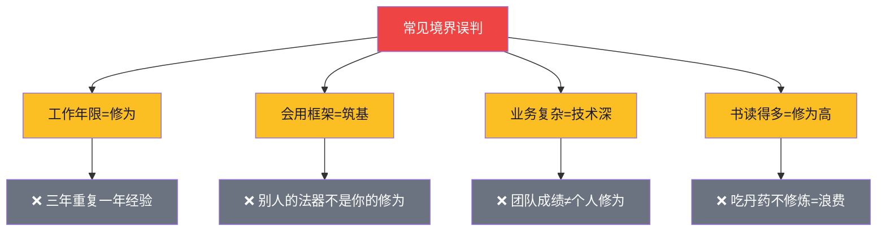

# 【炼气·02】你处于哪个阶段

> **码农修仙传 · 炼气期 · 第2篇**
> 我是玄芯散人，带你从炼气修到大乘。

---

## 境界标识

```
╔══════════════════════════════════╗
║     炼气期 · 第2篇               ║
║     你处于哪个阶段               ║
║     预计阅读：7分钟               ║
╚══════════════════════════════════╝
```

---

## 修仙引入

上一篇讲了炼气期长什么样。但你心里肯定有一个问题：

"我写了两年代码了，我还在炼气期吗？"
"我刚开始学Python，我算炼气几层？"
"我做了三年CRUD，到底修到什么境界了？"

修仙小说里有个经典桥段——修为自测。握住测灵石，灵力灌入，石碑亮几层就是几层修为。修为不够，石碑不亮；自欺欺人，石碑碎裂。

今天给你一把码农修为自测尺。20道题，精确定位你在哪个境界。

别急着往下翻。拿出纸笔，或者打开备忘录，诚实地做一遍。测完你才知道自己卡在哪、该往哪走。

---

## 硬核主体

### 修为自测尺——20道题定位你的真实境界

这套题分三组。第一组测炼气边界，第二组测筑基边界，第三组测金丹边界。不是考你会不会，是测你懂不懂原理。

#### 第一组：炼气边界测试（1-7题）

这组题测的是基础编程能力。如果你这组都过不了，说明你还在凡人→炼气的路上。

第1题：`a = 1; b = a; a = 2;` 执行完，b等于几？为什么？

第2题：`for i in range(5)` 循环了几次？i的值分别是什么？

第3题：写一个函数判断字符串是不是回文（如"aba"是回文，"abc"不是），不用查资料能写出来吗？

第4题：Git的 `add` 和 `commit` 区别是什么？

第5题：什么是递归？写一个计算阶乘的递归函数。

第6题：JSON是什么格式？它和Python字典有什么关系？

第7题：你的代码报错了，你会先看什么？

<details>
<summary>📋 点击查看评分标准</summary>

| 答对题数 | 你的修为 |
|---------|---------|
| 5-7题 | 炼气期已过半，基础语法没问题 ✅ |
| 3-4题 | 炼气中期，还在气行经脉阶段 🟠 |
| 不足3题 | 炼气初期，继续练功 🟡 |

</details>

#### 第二组：筑基边界测试（8-15题）

这组题测的是CS基础。如果你会写代码但答不上来这些，说明你还在炼气期没筑基。

第8题：哈希表的时间复杂度为什么是O(1)？

第9题：进程和线程的区别是什么？

第10题：TCP为什么要三次握手？两次不行吗？

第11题：什么是虚拟内存？为什么需要它？

第12题：二叉树的前序、中序、后序遍历有什么区别？

第13题：什么是死锁？举个例子。

第14题：HTTP和HTTPS的区别是什么？

第15题：快速排序的思路是什么？平均时间复杂度是多少？

<details>
<summary>📋 点击查看评分标准</summary>

| 答对题数 | 你的修为 |
|---------|---------|
| 6-8题 | 已经筑基，CS基础扎实 ✅ |
| 3-5题 | 筑基中，四座地基有缺口 🟠 |
| 不足3题 | 还在炼气期，先别急着跳 🔴 |

</details>

#### 第三组：金丹边界测试（16-20题）

这组题测的是系统级理解。能答上来的，你已经不是普通程序员了。

第16题：编译器的词法分析和语法分析分别做什么？

第17题：CPU的流水线（Pipeline）是什么概念？为什么能提高性能？

第18题：什么是内存屏障（Memory Barrier）？为什么需要它？

第19题：操作系统的调度算法你了解几种？简单说一种的原理。

第20题：给你一个全新架构的CPU，你能否写出最简单的启动代码（点亮一个LED）？

<details>
<summary>📋 点击查看评分标准</summary>

| 答对题数 | 你的修为 |
|---------|---------|
| 4-5题 | 金丹期，系统级理解到位 💎 |
| 2-3题 | 金丹初成，还在巩固 🟠 |
| 不足2题 | 还在筑基期，正常 🔴 |

</details>

---

### 自测结果解读——你卡在哪里？

做完了吧？诚实面对自己。修仙之路，最忌自欺欺人。

我见过太多人，工作年限和修为严重不匹配。来看看你是哪种画像：

| 画像 | 自测结果 | 真实状态 | 突破建议 |
|------|---------|---------|---------|
| "写了两年代码还在炼气" | 第一组全对，第二组3题以下 | 炼气后期卡瓶颈 | 停止刷框架教程，开始补CS基础 |
| "面试造火箭工作拧螺丝" | 第二组能对4-5题 | 筑基中期，不稳固 | 针对薄弱项专项突破 |
| "我觉得我已经很厉害了" | 第三组0题 | 筑基后期，未结丹 | 开始读源码、学系统设计 |
| "我是转行的" | 第一组就能对3题 | 炼气中期，正常速度 | 多做项目，少看视频 |
| "我做了五年后端" | 第二组6题以上，第三组1题 | 筑基圆满，金丹门口 | 深入一个方向，从会用到理解 |

重点说第一种——**"写了两年代码还在炼气"** 的人。

这类人通常是这样的：工作了两年，每天都在写CRUD（增删改查），业务逻辑写得很溜，框架用得很顺。但你问他"进程和线程什么区别"，他卡壳了；问他"哈希表为什么O(1)"，他说"因为很快"。

他不是没能力，是没修对方向。 两年时间全花在练功（写业务代码）上，从没出关实战（学原理）。练功不出真功夫——就像一个人打了两年太极操，但从未实战对练过。

突破方法很简单：停下来，花一个月补第二组的知识。 不需要报班，不需要买课，就找一本《计算机系统要素》或者看CSAPP的视频。一个月，你的筑基地基就能打下第一根桩。

---

### 境界误判——你以为的不一定是你以为的

做完自测，有人慌了——"我工作三年了，怎么还在炼气？"

别慌。修仙界有几个常见的境界误判，你中了几条：

**误判一：工作年限 = 修为境界**

修仙小说里，有人修炼三年筑基，有人修炼三十年还在炼气。差别不在于时间长短，在于修炼方法。工作三年还在炼气的人比比皆是——不是天赋不够，是三年都在重复第一年的经验。

**误判二：会用框架 = 筑基**

```python
# 你会写这个
from flask import Flask
app = Flask(__name__)

@app.route("/")
def hello():
    return "Hello"
```

但你知道Flask内部是怎么路由的吗？知道WSGI是什么吗？知道一个HTTP请求从浏览器到你的函数经历了什么吗？

如果你不知道，你只是在用别人的法器，不是自己炼的。框架是别人的功法，不是你的修为。 面试官一问源码原理就卡壳——因为你筑基的"地基"其实是别人替你打的，一抽就塌。

来，把Flask的核心拆开看。我们手写一个最简版的"路由法器"，三十行代码看清它的骨架：

```python
# mini_flask.py —— Flask 路由的本质：一个字典 + 一个装饰器
class MiniApp:
    def __init__(self):
        self.routes = {}  # 路径 -> 处理函数 的字典

    def route(self, path):
        # 这就是 @app.route("/") 背后做的事
        def decorator(func):
            self.routes[path] = func  # 把路径和函数绑进字典
            return func
        return decorator

    def handle(self, path):
        # 模拟一次请求：拿路径，去 self.routes 查函数
        func = self.routes.get(path)
        if func:
            return func()
        return "404 Not Found"

app = MiniApp()

@app.route("/")
def hello():
    return "Hello, 码农修仙传"

@app.route("/bye")
def bye():
    return "Bye, 散人"

# 浏览器访问 "/" 时，框架做的事：
# 1. 拿到字符串 "/" 作为 key
# 2. 去 self.routes 字典里查 hello 这个函数
# 3. 调用它，把返回值塞进 HTTP 响应体
print(app.handle("/"))    # Hello, 码农修仙传
print(app.handle("/bye")) # Bye, 散人
print(app.handle("/xyz")) # 404 Not Found
```

跑一遍你会发现，所谓的"Web框架"最核心的路由，就是一个dict[key]查询。这不是贬低Flask——它还要处理WSGI、线程、异常、中间件、模板渲染等等——但你只要把上面三十行代码跑通，脑子里"框架"这层神秘面纱就掉了一块。从"我会用框架"到"我知道框架是个字典"——这一步跨出去，筑基就动了一寸。

不会也没关系。打开Python解释器，把这段代码贴进去跑一遍，二十分钟就懂。

**误判三：业务复杂 = 技术深度**

"我们的系统有200个接口，日均百万QPS"——这是业务复杂，不是你的技术深度。你在这200个接口里负责3个CRUD，你的修为还是炼气。不要拿团队的成绩当自己的修为。

**误判四：书读得多 = 修为高**

丹药吃多了不消化就是毒。教程看了100个视频，书籍啃了10本，但如果不动手——知识会很快遗忘。读书是吃丹药，实践是修炼。 只吃不练，灵力不进经脉，全浪费了。

用一张图总结修仙路上的常见误判：



四大误判讲完了，给你一件趁手的兵器——把上面"修为自测尺"装进一个能跑的Python脚本，存成 `check.py`，python check.py 就能给自己当场测一次：

```python
# check.py —— 一把随身携带的小测灵碑
def ask(question, answer):
    user = input(question + " ")
    return user.strip().lower() == answer.lower()

score = 0

# 炼气三道：基础经脉
if ask("Python 里 a = [1]; b = a; b.append(2); 现在 a 也是 [1,2] 吗？(y/n)", "y"):
    score += 1
if ask("for i in range(3): 这个循环执行 3 次对吗？(y/n)", "y"):
    score += 1
if ask("函数内部要给全局变量赋值，需要 global 关键字对吗？(y/n)", "y"):
    score += 1

print(f"\n答对 {score}/3")

if score == 3:
    print("修为判定：炼气后期，基础经脉已通 🟠")
    print("下一步：去测筑基边界的那八道题。")
elif score >= 1:
    print("修为判定：炼气中期，继续练功 🟡")
    print("下一步：把今天错的两道题查清楚，每个写十行代码验证。")
else:
    print("修为判定：炼气初期，从第一道题开始补 🔴")
    print("下一步：找一本入门书，先把变量、循环、函数这三关过掉。")
```

跑完一遍你会发现，"修为自测"这件事不需要修仙界的测灵石——一段二十行的 Python 脚本就够了。脚本本身不产生修为，但它强迫你诚实回答：你到底会不会？答案不会骗人，脚本也不会陪你演戏。

老修士推荐"自测清单"也是这个道理。清单本身不神圣，神圣的是它没法自欺——你勾不下去的勾，就是真实的修为缺口。

再说一个很多人忽略的点：自测不是考你"知不知道答案"，是考你"能不能用代码验证"。比如有人问你 `range(3)` 到底是 `[0,1,2]` 还是 `[1,2,3]`，你可以嘴上说"是 012"，但如果你真会写代码，直接敲一行 `print(list(range(3)))` 就能确认。炼气期最该练的不是背概念，是养成"用代码验证想法"的肌肉记忆。到了筑基期你会接触大量"听起来都对"的说法，没有这种验证习惯，很容易被带偏。

---

## 修仙术语对照表

本篇用到的修仙术语，跟技术现实的对应关系：

| 修仙术语 | 技术现实 | 本篇详解 |
|---------|---------|---------|
| 测灵碑 | 20道技术自测题 | §修为自测尺 |
| 灌灵入碑 | 做自测题的过程 | §修为自测尺 |
| 修为自测 | 技术能力评估 | 全篇主线 |
| 境界误判 | 工作年限≠技术深度 | §境界误判 |
| 吃丹药 | 看教程/读文章 | §境界误判 |
| 借法器 | 使用框架 | §境界误判 |
| 炼法器 | 理解框架原理 | §境界误判 |
| 闭关 | 专项学习某个方向 | §自测结果解读 |

想查全系列术语？看[术语词典](/glossary)。

---

## 突破条件

根据你的自测结果，找到对应的突破方向。这里多说一句：下面列的练习量不是硬性指标，核心判断标准只有一个——你能不能脱离教程独立写出来。能写出来就算过了，写不出来就说明还差练。

**如果你卡在炼气期（第一组没全对）**：

- [ ] 把第一组不会的题搞懂，每道题动手写代码验证
- [ ] 独立完成一个300行以上的小项目，不抄教程
- [ ] 开始接触第二组的知识——买一本《CSAPP》或看CS50课程

**如果你卡在筑基期（第二组答对不足6题）**：

- [ ] 针对薄弱项专项突破（数据结构/OS/网络/数据库）
- [ ] 每个方向做一个小项目，不只看概念要动手
- [ ] 开始问"为什么"——不满足于"能用"，要懂原理

**如果你卡在金丹门口（第三组答对不足2题）**：

- [ ] 读完过一个开源项目的核心源码
- [ ] 能从系统层面分析性能瓶颈
- [ ] 开始深入一个细分方向（编译/内核/体系结构）

> 诚实面对自己的修为，是修炼的第一步。自欺欺人，测灵碑不会配合你演戏。自测脚本也不会。如果你连自测的勇气都没有，那说明你心里清楚答案，只是不愿意面对。这一步迈过去了，后面的路反而好走。

---

## 下期预告 + 互动

> **下一篇：【炼气·03】为什么有人三个月筑基——高效修炼路径**
>
> 同样学编程，有人三个月就能独立做项目，有人学了三年还在看教程。
> 不是天赋差异，是修炼方法的问题。
> 下篇讲炼气期的最优修炼路径，以及90天高效筑基法。

现在问你：

> 🎮 **自测结果**：你20道题答对了几道？真实修为在哪个境界？评论区诚实报出来！
>
> 💬 **话题**：你工作几年了？修为跟年限匹配吗？有没有"三年重复一年经验"的情况？
>
> 🔔 关注玄芯散人，下一篇教你高效筑基。

> 我是玄芯散人，带你从炼气修到大乘。

---

*本文是「码农修仙传」系列第2篇。系列导航见 [xren.ren](https://xren.ren)*
