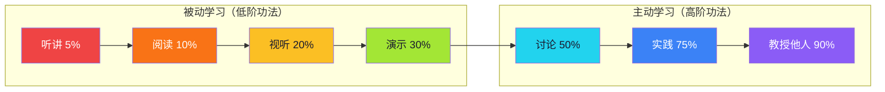

# 【炼气·03】为什么有人三个月筑基

> **码农修仙传 · 炼气期 · 第3篇**
> 我是玄芯散人，带你从炼气修到大乘。

---

## 境界标识

```
╔══════════════════════════════════╗
║     炼气期 · 第3篇               ║
║     为什么有人三个月筑基          ║
║     预计阅读：8分钟               ║
╚══════════════════════════════════╝
```

---

## 修仙引入

你有没有见过这种人：

同样零基础学编程，有人三个月就能独立做项目，有人学了三年还在看教程。你以为这是天赋？不是。你以为是努力程度？也不全是。

修仙小说里有个概念叫"修炼功法"。功法有高低之分，同一灵力消耗，效率差十倍。低阶功法练一年，不如高阶功法练一个月。

编程学习也一样。你用什么方法学，比你学多久重要十倍。用对方法，三个月筑基；用错方法，三年还在炼气徘徊。

今天讲清楚：炼气期的最优修炼路径是什么，以及为什么大多数人走错了路。

---

## 硬核主体

### 三种修炼路径效率对比

修炼功法分三等。你用的哪一等？

**功法等级 vs 学习方式：**

| 功法等级 | 学习方式 | 修炼效率 | 典型表现 | 三个月后 |
|---------|---------|---------|---------|---------|
| 低阶功法 | 看视频教程跟敲 | 10% | "教程都看懂了，自己写就懵" | 炼气初期 🟡 |
| 中阶功法 | 看书 + 做练习题 | 30% | "概念都记住了，但不会用" | 炼气中期 🟠 |
| 高阶功法 | 项目驱动学习 | 70% | "遇到不会的再学，学完就用" | 炼气后期→筑基 🔴 |

为什么差这么多？有一个经典数据——**学习金字塔**：



看视频教程跟敲代码，你同时在"听讲"和"阅读"——留存率5-10%。你感觉"都看懂了"，但过了三天，80%的内容已经忘了。因为你在"看别人修炼"，自己从未"运功"。

看一百遍别人打太极，自己上还是不会。

所以视频教程只能算低阶功法——它在给你展示修炼过程，但灵力没有流过你的经脉。你的手指在动，但你的大脑在做"模式匹配"，不是"问题解决"。

---

### 三个月筑基路线图

高阶功法的核心原则只有一个：项目驱动，缺什么补什么。

不是按教材目录从第一章学到最后一章，而是定一个目标，遇到不会的就去学，学完立刻用。这样效率高的原因很简单——有目标驱动，学了立刻用，记忆牢固，而且每完成一步都有成就感，不会中途放弃。

给你一份90天筑基路线图：

| 时间 | 阶段 | 修炼方式 | 产出物 |
|------|------|---------|--------|
| Day 1-7 | 引气入体 | 基础语法速通（2x倍速看慕课，边看边敲） | 命令行计算器 |
| Day 8-21 | 气行经脉 | 做小工具，遇到不会的查文档 | 文件批量重命名工具 |
| Day 22-45 | 凝气成流 | 稍复杂项目，开始读别人的代码 | 日志分析工具 |
| Day 46-75 | 气沉丹田 | 完整项目，带版本管理 | 个人记账本Web版 |
| Day 76-90 | 冲击筑基 | 项目做完后回头补概念 | 能回答筑基自测题 |

看完路线图，可能还是觉得虚——"Day 1-7 引气入体"到底长什么样？来一份实操样本，"命令行计算器"是这模样：

```python
# calc.py —— Day 3 的产出物，30 行内完成
def calculator():
    a = float(input("第一个数: "))
    op = input("运算符 (+, -, *, /): ")
    b = float(input("第二个数: "))

    if op == "+":
        print(f"结果: {a + b}")
    elif op == "-":
        print(f"结果: {a - b}")
    elif op == "*":
        print(f"结果: {a * b}")
    elif op == "/":
        if b == 0:
            print("除数不能为零")
        else:
            print(f"结果: {a / b}")
    else:
        print(f"不支持的运算符: {op}")

calculator()
```

跑起来：输入 3、空格、*、空格、5、回车，看到 15.0 —— Day 3 收功。看着太简单？本来就应该简单。炼气期练的是"经脉初通"，不是上来就造支付系统。

然后故意输入 `abc` 代替第一个数，看屏幕上的报错：

```
ValueError: could not convert string to float: 'abc'
```

把这段报错读三遍。报错信息在告诉你：Python 不知道怎么把字符串 abc 转成浮点数。筑基灵觉的第一缕就此浮现——你不再只会看"它跑起来了"，还会开始看"它为什么没跑起来"。

继续 Day 4：加 while 循环让用户能连续算；Day 5：把运算逻辑拆成 add / sub / mul / div 四个函数；Day 6：加 try-except 把异常兜住；Day 7：收功，给计算器写一份 README 说明用法。每天一个小闭关，七天下来，第一个能用的命令行工具就算炼成。

**关键原则：**

1. 每天必须有产出

哪怕只有20行代码，也要写。修炼讲究"日日不断之功"，断一天就要花两天来补。你可以少写，但不能不写。20行连续30天 > 600行一次性。

2. 遇到报错先自己想5分钟

不要一报错就搜答案。先读报错信息，自己想5分钟，实在搞不定再搜。这个过程锻炼的是排错能力——这个能力比学新知识重要十倍。后面到了筑基、金丹，你花在调试上的时间会远超写代码的时间。

排错现场长这样——上面那个计算器跑通之后，你尝试给它加一个"加法专用函数"，写了这么一段：

```python
def add(a, b):
    return a + b

print(add("3", 5))   # 字符串和整数相加
```

一跑就炸：

```
TypeError: can only concatenate str (not "int") to str
```

"5 分钟排错"怎么做？

- 第 1 分钟：读报错最后一行 TypeError，定位错误类型——类型错。
- 第 2 分钟：往上看是哪一行触发——line 4，print(add("3", 5))。
- 第 3 分钟：想一下传进去的参数——"3" 是字符串，5 是整数。
- 第 4 分钟：尝试修——把 "3" 改成 3，或者把 5 改成 "5"，看哪种符合业务意图。
- 第 5 分钟：再跑一遍，验证问题消失。

整个过程没搜搜索引擎，没截图发"求大佬看看"。五分钟走完，筑基灵觉的雏形已经立起来——报错信息是你的第一手线索，读懂它比问别人强十倍。这个习惯从炼气期养成，到金丹期就会发现，90% 的 bug 你自己就能摁住。

3. 第二周开始用Git

```bash
# 第一天就要装好Git
git init my-project
git add .
git commit -m "Day 1: 命令行计算器初版"

# 之后每天提交
git add .
git commit -m "Day 2: 加了加减乘除"
```

版本管理是修仙者的基本功。你不会Git，就像修仙者不会用储物袋——东西到处乱放，找不到了从头来。

4. 不追求完美

项目能跑就行，先完成再完善。很多人卡在"我想做一个完美的系统"，结果一个项目都没做完。三个丑陋但能跑的项目 > 一个完美但没完成的项目。

---

### 为什么大多数人走错了路

说了高阶功法好，但为什么大多数人还是在用低阶功法？因为低阶功法有个致命的诱惑——它让你觉得很舒服。

看视频的时候，你跟着敲，一切顺利，代码跑起来了，成就感满满。但这种成就感是虚假的——就像在健身房看别人举铁，你坐在旁边做了几个一样的动作，感觉自己也练了。

炼气期三大修炼误区，你中了几个：

| 误区 | 修仙设定 | 编程现实 | 后果 |
|------|---------|---------|------|
| 藏经阁综合症 | 藏在藏书阁读古籍，从不出关修炼 | 一直在看教程/看书，从不动手写 | 理论全会，一写就废 |
| 等待完美功法 | 一直在找"最好最全的教程"，不肯开始 | "学Python还是Java？""哪个框架好？" | 永远在起点 |
| 抄功法不修炼 | 抄别人的修炼笔记，以为是自己的 | 抄教程代码跟着敲，离开教程就写不出 | 虚假修为 |

**误区一：藏经阁综合症**

症状：买了一堆课程，收藏了一堆教程链接，但很少真正动手写代码。觉得自己"还没学够"，还不能开始做项目。

真相：你永远不会觉得"学够了"。知识是学不完的，但你的时间是有限的。你需要的不是更多知识，是开始动手。 做项目的过程中你会发现缺什么，那时候去学，效率最高。

破解：给自己定一个死线——7天内必须做出一个能跑的项目，不管多丑。

**误区二：等待完美功法**

症状：纠结学什么语言、用什么框架、Mac还是Windows、VSCode还是PyCharm。研究了三个月还没开始写代码。

真相：不存在"完美的功法"。任何一门语言都能让你入门，任何一个编辑器都能写代码。选择本身不产生价值，行动才产生价值。

破解：今天就选一门语言（推荐Python），装一个编辑器（推荐VSCode），写第一行代码。选择困难症的本质是害怕做错决定——但学错语言浪费的时间，远不如你想的多。

**误区三：抄功法不修炼**

症状：跟着教程一步一步敲，教程里代码跑起来了，你觉得"我会了"。但关掉教程，面对空白编辑器，什么都写不出来。

真相：判断标准很简单——关掉教程，能不能从头写出来？ 如果不能，你只是在抄功法，没有修炼。抄100遍也不算你的修为。

破解：学完一个教程后，不参考原教程，自己从零写一个类似的东西。写不出来就说明你还没学会，回去重学。

---

### 筑基检验——你怎么知道自己筑基了？

炼气期到筑基期的跨越，标志不是"学了多少"，而是理解了多少原理。

具体来说：

- 以前写 `list.append(x)`，现在知道底层是动态数组，满了要扩容拷贝
- 以前用 `import os`，现在知道模块加载的过程和 `sys.path`
- 以前用 Git commit，现在理解 Git 的对象模型——blob、tree、commit
- 以前用 `requests.get()`，现在知道底层是TCP连接和HTTP报文

当你对代码的好奇心从"怎么用"变成"为什么"——筑基的灵觉就苏醒了。

**自检清单：**

- [ ] 能脱离教程独立写300行以上项目
- [ ] 遇到报错不慌，能读traceback定位问题
- [ ] 开始对"为什么"好奇，不满足于"能用就行"
- [ ] 能用Git管理项目，理解branch/merge
- [ ] 做完一个项目后，能说清楚每个部分在干什么

全勾了？恭喜，你已经摸到筑基的门槛了。


注意中间那个黄色的节点——**"开始问为什么"**——筑基灵觉就体现在这里。它不是知识点，是心态的转变。从"我会用这个API"到"这个API底层怎么实现的"，这一步跨过去，你就从炼气迈向了筑基。

---

## 修仙术语对照表

| 修仙术语 | 技术现实 | 本篇详解 |
|---------|---------|---------|
| 修炼功法 | 学习方法/学习策略 | §三种修炼路径 |
| 低阶功法 | 被动看视频教程 | §三种修炼路径 |
| 高阶功法 | 项目驱动学习 | §三个月筑基路线图 |
| 藏经阁综合症 | 只看教程不动手 | §为什么大多数人走错了路 |
| 等待完美功法 | 选择困难，不肯开始 | §为什么大多数人走错了路 |
| 抄功法不修炼 | 跟教程敲代码不自创 | §为什么大多数人走错了路 |
| 出关 | 开始独立做项目 | §三个月筑基路线图 |
| 筑基灵觉 | 对原理的好奇心觉醒 | §筑基检验 |

想查全系列术语？看[术语词典](/glossary)。

---

## 突破条件

炼气期 → 筑基期，高效突破清单：

- [ ] 完成至少2个独立小项目（不看教程从零写）
- [ ] 每天写代码，连续30天不断
- [ ] 遇到报错能独立排查（搜索 + 读文档 + 调试）
- [ ] 用Git管理所有项目
- [ ] 开始问"为什么"——对至少3个"理所当然"的概念产生了好奇
- [ ] 能在5分钟内向别人解释清楚自己的项目做了什么

> 清单最后一项——"开始问为什么"——是筑基灵觉苏醒的标志。当你写完一个项目，不再满足于"它能跑"，而是开始好奇"它为什么能跑"——恭喜，筑基的大门已经向你打开。

六条全勾，下一篇就带你进入筑基期。筑基要筑四座地基：数据结构、操作系统、网络、数据库。第一座地基——"你已经筑基了吗"，第四篇会详细讲。

---

## 下期预告 + 互动

> **下一篇：【筑基·04】你已经筑基了吗——码农修炼体系四座地基**
>
> 炼气期三篇讲完了。接下来进入筑基期。
> 筑基要筑四座地基：数据结构与算法、操作系统、计算机网络、数据库。
> 缺任何一座，后续修为都是空中楼阁。
> 第四篇带你认清筑基四座地基全貌。

现在问你：

> 🎮 **行动挑战**：今天就开始你的第一个独立项目。评论区打出你的项目想法和选择的灵根！
>
> 💬 **话题**：你之前用了哪种"功法"？视频？书籍？项目？效果怎么样？有没有踩过"藏经阁综合症"的坑？
>
> 🔔 关注玄芯散人，下一篇带你筑基。

> 我是玄芯散人，带你从炼气修到大乘。

---

*本文是「码农修仙传」系列第3篇。系列导航见 [xren.ren](https://xren.ren)*
