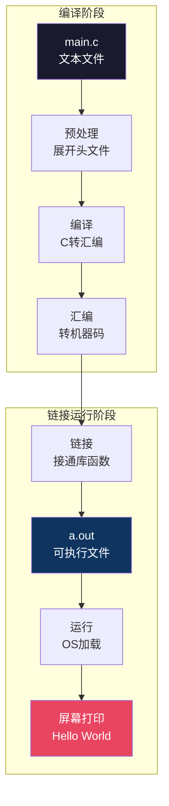
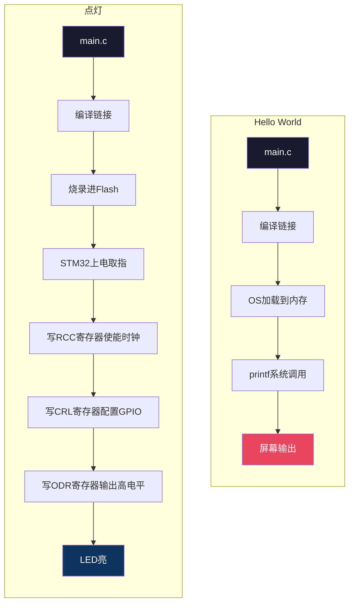

# 【炼气·04】你的第一个程序：Hello World到点灯有多远

> **码农修仙传 · 炼气期 · 第4篇**
> 我是玄芯散人，带你从炼气修到大乘。

---

## 境界标识

```
╔══════════════════════════════════╗
║     炼气期 · 第4篇               ║
║     你的第一个程序                ║
║     Hello World到点灯有多远       ║
║     预计阅读：10分钟              ║
╚══════════════════════════════════╝
```

---

## 修仙引入

你可能已经写过 `printf("Hello World")`。屏幕上跳出那行字的时候，你觉得编程不过如此。

但如果我告诉你，屏幕上打印一行字和让一颗LED灯亮起来之间，要经过编辑器和编译器和汇编器和链接器这些工具链，还要经过烧录器、Flash、复位电路、时钟树、GPIO寄存器这些硬件环节。你会不会觉得，自己写的第一个程序其实没"到"硬件？

修仙小说里，凡人引灵气入体，感受到丹田有了一丝温热，就以为自己能飞天了。但你问那丝灵气是怎么进来的，沿哪条经脉走，过没过窍穴，他答不上来。

今天这篇文章，带你走一遍：你按下回车之后LED亮起来之前，中间每一步发生了什么。走完这条路，你才真正知道自己写的第一个程序"到了哪里"。

---

## 硬核主体

### 第一步：你敲的代码是什么

你在编辑器里写了这么一行C代码：

```c
#include <stdio.h>

int main(void)
{
    printf("Hello World\n");
    return 0;
}
```

文件保存为 `main.c`，存在硬盘上。此刻它只是一堆文本字符，跟Word文档没有区别。CPU看不懂，硬件更看不懂。

这一步对应修仙里的"功法口诀"。你背了一段口诀，但还没运转。

### 第二步：预处理，展开口诀

编译器先做预处理。`#include <stdio.h>` 这一行告诉预处理器：把 stdio.h 这个头文件的内容原封不动地复制到你的 main.c 里面。

stdio.h 里有 printf 函数的声明，告诉编译器"这个函数存在，参数长这样，返回值是int"。注意只是声明，没有实现。真正的实现在C标准库里，链接的时候才找。

预处理完，你的代码变成了一大坨（stdio.h 展开后有好几千行），但还是文本文件。

### 第三步：编译，口诀转成符文

编译器把C代码翻译成汇编语言。你的 `printf("Hello World\n")` 大概会变成这样的汇编（x86为例）：

```asm
    push   rbp
    mov    rbp, rsp
    sub    rsp, 16             ; 栈对齐16字节（System V ABI要求）
    lea    rdi, [rip + .LC0]   ; "Hello World\n" 的地址放进第一个参数寄存器
    call   printf@PLT           ; 调用printf函数
    mov    eax, 0
    leave                       ; 恢复栈（等价于 mov rsp,rbp + pop rbp）
    ret
```

你看不懂这些没关系。需要知道的一点是：编译器把你的C代码翻译成了CPU能理解的"符文指令"，但还不是0和1，还是文本格式的汇编。

### 第四步：汇编，符文变灵力

汇编器把汇编文本翻译成机器码，真正的0和1。到这一步，你的 `main.c` 变成了一个 `.o` 文件（object文件），里面全是二进制。

但这个文件还不能跑。因为你的代码调用了 printf，printf 的实现在 libc.a（C标准库）里，你的 `.o` 文件里只有一行"我要调用printf"的引用，实际地址是空的。

修仙类比：你的功法口诀已经转化成灵力了，但还缺一条灵脉连接。printf的实现在外面，你还没接上。

### 第五步：链接，接通灵脉

链接器把你的 `.o` 文件和C标准库连在一起。它找到 printf 函数的真实地址，填回你的代码里那个空着的引用位置。

链接完，输出一个可执行文件（Linux下是ELF格式，Windows下是exe）。到这一步，你的程序终于"活了"，可以被执行了。

```bash
# Linux下看链接后的文件
file a.out
# 输出：ELF 64-bit LSB pie executable, x86-64, dynamically linked

# 看里面引用了哪些库
ldd a.out
# 输出：libc.so.6 => /lib/x86_64-linux-gnu/libc.so.6
```

### 第六步：运行，灵力运转

你在终端输入 `./a.out`，操作系统做了这些事：

1. fork创建一个新进程
2. exec把a.out加载进内存，包括代码段和数据段和栈
3. 把PC（程序计数器）指向main函数的入口地址
4. CPU开始取指、解码、执行，你的程序跑起来了

屏幕上打印出 `Hello World`。



这就是"Hello World"的全部旅程。六步走完：编辑，然后预处理，然后编译，然后汇编，然后链接，最后执行。

### 但是LED灯呢？

Hello World只在屏幕上打印字符，没碰到硬件。现在我们换成点灯，让一颗LED亮起来。

如果是PC上的C程序，你没法直接点灯（PC没有GPIO）。但在STM32单片机上，点灯是这样的：

```c
#include "stm32f1xx.h"

int main(void)
{
    /* 使能GPIOA时钟，不使能时钟寄存器不工作 */
    RCC->APB2ENR |= RCC_APB2ENR_IOPAEN;

    /* 配置PA5为推挽输出模式 */
    GPIOA->CRL &= ~(0xF << (5 * 4));      /* 清除PA5的配置位 */
    GPIOA->CRL |= (0x1 << (5 * 4));      /* 设置为输出模式，速度10MHz */

    /* 置位PA5，LED亮 */
    GPIOA->ODR |= (1 << 5);

    while (1) {
        /* 死循环，保持程序不退出 */
    }
}
```

这段代码的编译流程和Hello World一样：预处理，编译，汇编，链接。但链接完之后不在PC上跑，而是要用烧录器把二进制文件写进STM32的Flash里。

烧录的过程：你的电脑通过USB连接ST-Link（或J-Link），烧录软件把二进制通过SWD接口送进STM32的Flash。

STM32上电后，CPU在Flash里取指令执行。它读到你写的 `RCC->APB2ENR` 赋值语句，往对应寄存器地址写了一个数，GPIOA的时钟接通了。然后它配置CRL寄存器把PA5设为输出模式。最后往ODR寄存器的第5位写1，PA5引脚输出高电平，LED亮了。

```
你的代码 → 编译 → 机器码 → 烧录进Flash → STM32上电取指 → 写寄存器 → 引脚电平变化 → LED亮
```

这就是"点灯"的全部链路。和Hello World的区别在于：Hello World止步于屏幕，操作系统帮你搞定了输出。点灯则穿透了操作系统，没有OS帮你，你自己往硬件寄存器写值，直接控制物理世界。



---

## 修仙术语对照表

| 修仙术语 | 技术现实 | 本篇位置 |
|----------|---------|---------|
| 功法口诀 | 你写的C源代码 | 第一步 |
| 展开口诀 | 预处理（#include展开） | 第二步 |
| 口诀转符文 | 编译（C转汇编） | 第三步 |
| 符文变灵力 | 汇编（汇编转机器码） | 第四步 |
| 接通灵脉 | 链接（接通库函数） | 第五步 |
| 灵力运转 | 执行（OS加载到内存运行） | 第六步 |
| 引灵入体 | 烧录（把固件写进Flash） | 点灯部分 |
| 灵脉接驳 | 配置RCC寄存器使能时钟 | 点灯代码 |
| 法器激活 | 配置GPIO寄存器点亮LED | 点灯代码 |

---

## 进阶条件

只会跑Hello World和理解程序怎么变成物理动作，中间差这几条：

- [ ] 能说出预处理和编译和汇编和链接这几个步骤各自做了什么
- [ ] 知道 `.o` 文件和可执行文件的区别（前者没链接，后者链接了）
- [ ] 理解"编译过了但链接报错"是什么意思
- [ ] 能用STM32（或任意单片机）点亮一个LED，而不只是在PC上打印文字
- [ ] 知道烧录是把二进制写进Flash，不是"复制文件"
- [ ] 理解"配置寄存器"就是"往特定内存地址写数字"
- [ ] 能区分PC运行环境（有OS帮你）和裸机运行环境（你自己管硬件）的区别

> 最后一条是炼气期的分水岭。如果你能理解"写代码就是往内存地址写数字，数字变成寄存器值，寄存器值变成电平变化"，你就摸到了筑基的门槛。

---

## 下期预告 + 互动

> 下一篇：【炼气·05】学编程到底在学什么
>
> 你会写Hello World了，会点灯了。但你到底"学会了"什么？
> 编程能力 = 语法 + 逻辑 + 调试 + 工程，四者缺一不可。
> 下篇帮你搞清楚：你在学的是哪一块，哪一块最弱，怎么补。

现在问你：

> 💡 你的第一个程序：你写的第一个程序是什么语言？Hello World还是点灯？
>
> 🔧 烧录经历：第一次烧录单片机是什么感觉？紧张还是兴奋？
>
> 评论区聊聊你的"引灵入体"时刻。

> 我是玄芯散人，带你从炼气修到大乘。

---

*本文是「码农修仙传」系列第4篇。系列导航见 [xren.ren](https://xren.ren)*
