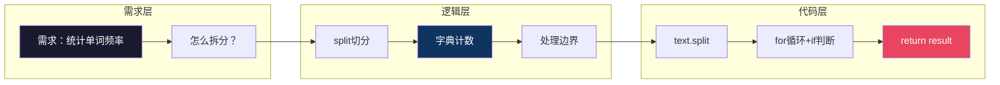
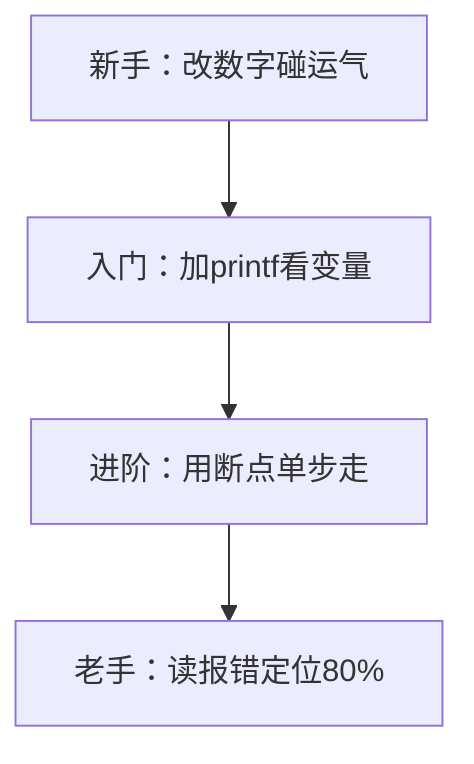
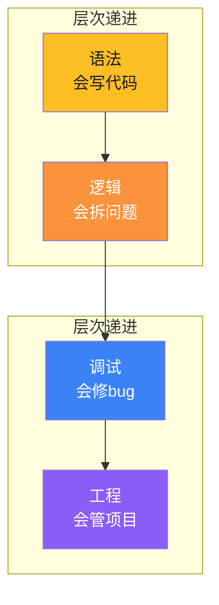

# 【炼气·05】学编程到底在学什么

> **码农修仙传 · 炼气期 · 第5篇**
> 我是玄芯散人，带你从炼气修到大乘。

---

## 境界标识

```
╔══════════════════════════════════╗
║     炼气期 · 第5篇               ║
║     学编程到底在学什么            ║
║     预计阅读：9分钟              ║
╚══════════════════════════════════╝
```

---

## 修仙引入

你可能经历过这种困惑：教程跟敲了三十集，每集都看懂了，但关掉视频自己写，脑子一片空白。或者反过来，你已经能独立写几百行的小项目了，但面试一问"你掌握什么编程能力"，你支支吾吾说不出来。

修仙小说里，弟子拜入山门，师父先传口诀（语法），再教运转路线（逻辑），然后带他历劫（调试），最后才让他独立开府建洞（工程）。四步走完，才算出师。跳过任何一步，遇到真正的敌人就会露馅。

编程也一样。你学的不是"一门语言"，是四种能力。它们各自独立，缺一块就站不稳。

---

## 硬核主体

### 第一块：语法，口诀背诵

语法是编程最表层的东西。变量怎么声明，循环怎么写，函数怎么定义，数组怎么访问。这些规则就像修仙界的口诀，背了就能念，不需要理解为什么这么设计。

```c
int x = 10;           // 变量声明
for (int i = 0; i < x; i++) {   // 循环
    printf("%d\n", i);          // 输出
}
```

三行代码，涉及变量声明，循环结构，函数调用。学会C语言语法大概需要两周。学会Python语法更快，一周够了。

但语法只是入门门票。会语法不等于会编程，就像会背口诀不等于会修炼。很多初学者卡在这里，以为把所有语法规则都记住就算学会了，结果一到实战就懵。

语法学习的陷阱在于：它给你一种虚假的掌控感。跟着教程敲代码，每行都看得懂，你觉得"我会了"。但语法只是告诉CPU"做什么"，没有告诉CPU"怎么做"。怎么把一个需求拆成步骤，怎么组织代码让逻辑清晰，这些语法不教。

一个判断标准：关掉教程，你能不能从空白文件开始，凭记忆写出一个冒泡排序？如果能，语法关过了。如果不能，你还在"抄口诀"阶段。

### 第二块：逻辑，功法运转

逻辑能力是把现实问题翻译成代码步骤的能力。别人说"帮我写个程序统计文本里每个单词出现几次"，你得能在脑子里把这个需求拆解成：

1. 读取文件内容
2. 按空格和标点切分成单词
3. 用一个字典记录每个单词出现次数
4. 输出结果

每一步再翻译成具体代码。这个过程就是功法运转，把口诀变成实际的灵力流动。

来看一段真实代码，体会逻辑和语法的区别：

```python
# 统计单词频率
def word_count(text):
    words = text.split()        # 切分成列表
    result = {}                 # 空字典存结果
    for word in words:
        word = word.lower().strip('.,!?;:"')   # 清理标点
        if not word:            # 空字符串跳过
            continue
        if word in result:
            result[word] += 1   # 已存在则加1
        else:
            result[word] = 1    # 首次出现
    return result

text = "the cat sat on the mat, the cat was fat."
for word, count in word_count(text).items():
    print(f"{word}: {count}")
```

这段代码语法很简单，没有任何花哨的特性。但逻辑在于：你想到了用字典做计数器，想到了清理标点，想到了处理空字符串的边界情况。这些步骤，语法书不会教你。

逻辑能力的培养没有捷径，只能靠做题和做项目。LeetCode刷题练的是纯逻辑，做项目练的是带上下文的逻辑。两者都需要。

一个自测方法：找一道LeetCode简单题（比如两数之和），不看题解自己写。如果20分钟内写不出来，你的逻辑能力还需要练。如果写出来了，再看看题解里别人怎么写的，对比一下思路差异。

逻辑和语法的关系，可以这样理解：



语法解决的是F到H（怎么写），逻辑解决的是A到E（怎么想）。初学者通常卡在B那个位置，不知道怎么把需求拆成步骤。

### 第三块：调试，灵脉逆行排查

调试能力可能是四种能力里最被低估的。新手以为调试就是"找bug改bug"，但调试做的事情是：在信息不充分的情况下，通过推理定位问题根因。

代码跑出来的结果和预期不一样，可能的原因有几十种。变量没初始化，循环边界差一，类型转换丢精度，多线程竞争，内存越界踩了别人的数据。你要看着现象出发，一层层剥，直到找到根因。

一个调试案例。有人写了这么一段C代码：

```c
#include <stdio.h>

int main(void)
{
    int arr[5] = {1, 2, 3, 4, 5};
    int sum = 0;

    for (int i = 0; i <= 5; i++) {   /* 注意这里是 <= 不是 < */
        sum += arr[i];
    }

    printf("sum = %d\n", sum);      /* 期望输出15，但实际不确定 */
    return 0;
}
```

预期输出15，但跑出来可能是一个奇怪的数字，也可能恰好是15，取决于内存布局。因为循环条件写了 `i <= 5`，数组只有5个元素（索引0到4），访问 `arr[5]` 越界了。

新手看到结果不对，可能直接改个数字试。老手会怎么调试？

1. 先确认现象：sum不等于15
2. 加printf打印每一步的值
3. 发现多循环了一次，i到5了
4. 检查循环条件，发现 `<=` 应该是 `<`
5. 改完验证

```c
    for (int i = 0; i < 5; i++) {   /* 修正：< 不是 <= */
        sum += arr[i];
    }
```

这个过程就是调试。它需要你冷静地观察现象，提出假设，验证假设，缩小范围。

调试能力的成长曲线：



新手遇到bug只会改了再跑，跑出来不对再改，纯靠运气。入门后会加printf看变量值，这比瞎改强十倍。进阶学会用gdb或IDE的断点功能，能单步执行，能看调用栈。老手读完报错信息就能定位80%的问题，因为常见bug的模式都见过。

调试能力只能靠积累。你调过的bug越多，下次遇到类似的就越快。所以遇到bug不要怕，每个bug都是一次修炼。

### 第四块：工程，开府建洞

工程能力是把代码组织成可维护项目的能力。一个人写的500行脚本和五个人协作的5000行项目，完全是两个概念。

工程能力包括：

- 文件怎么拆分（一个main.c塞5000行 vs 按功能分文件）
- 接口怎么设计（函数参数太多 vs 参数封装成结构体）
- 版本怎么管理（手动备份文件夹 vs 用Git）
- 文档怎么写（一句话注释都没有 vs 需要的函数都有说明）
- 依赖怎么处理（硬编码路径 vs 配置文件）

看两个对比：

```c
/* 反面教材：所有逻辑塞一个函数 */
int main(void) {
    /* 读文件 */
    FILE *f = fopen("data.txt", "r");
    char buf[1024];
    fread(buf, 1, 1024, f);
    fclose(f);
    /* 解析 */
    char *token = strtok(buf, ",");
    while (token != NULL) {
        /* 处理每个token */
        int val = atoi(token);
        /* 存到数组 */
        /* ... 200行后 ... */
    }
    /* 输出 */
    /* 又100行 */
    return 0;
}
```

```c
/* 正面教材：拆分成函数 */
#include <stdio.h>
#include <stdlib.h>
#include <string.h>

#define MAX_VALUES 256

/* 读取文件内容 */
int read_file(const char *path, char *buf, int size)
{
    FILE *f = fopen(path, "r");
    if (!f) return -1;
    int n = fread(buf, 1, size, f);
    fclose(f);
    return n;
}

/* 解析逗号分隔的数字 */
int parse_values(const char *buf, int *values, int max)
{
    int count = 0;
    char tmp[1024];
    strncpy(tmp, buf, sizeof(tmp) - 1);
    tmp[sizeof(tmp) - 1] = '\0';

    char *token = strtok(tmp, ",");
    while (token != NULL && count < max) {
        values[count++] = atoi(token);
        token = strtok(NULL, ",");
    }
    return count;
}

/* 打印结果 */
void print_values(const int *values, int count)
{
    for (int i = 0; i < count; i++) {
        printf("%d: %d\n", i, values[i]);
    }
}

int main(void)
{
    char buf[1024];
    int values[MAX_VALUES];

    if (read_file("data.txt", buf, sizeof(buf)) < 0) {
        fprintf(stderr, "文件读取失败\n");
        return 1;
    }

    int count = parse_values(buf, values, MAX_VALUES);
    print_values(values, count);

    return 0;
}
```

第二个版本代码量更多，但每个函数只做一件事，可以单独测试，别人接手也看得懂。第一个版本虽然短，但逻辑全堆在main里，改一处可能碰坏另一处。

工程能力在炼气期不要求多高，但至少要意识到：代码写出来是给人读的，不只是给机器跑的。函数要有注释，文件要有README，项目要用Git管理。

### 四种能力的关系

语法、逻辑、调试、工程，四种能力有层次递进关系：



语法是地基，没有语法你写不出任何代码。逻辑在地基之上，有了语法你还得能把需求拆成步骤。调试在逻辑之上，代码写出来一定有bug，你得能找到。工程在最上层，代码能跑了，你还得让它长期可维护。

很多人卡在语法和逻辑之间。语法会了，但看到需求不知道怎么下手。这时候需要的不是再学一门语言，得开始做项目。做项目会逼你练逻辑，遇到bug会逼你练调试，项目大了会逼你练工程。

四种能力对应修炼的不同阶段：

| 能力 | 修仙术语 | 炼气期目标 |
|------|---------|-----------|
| 语法 | 口诀背诵 | 会写基本C语法 |
| 逻辑 | 功法运转 | 能独立拆解300行项目 |
| 调试 | 灵脉排查 | 能读报错定位常见bug |
| 工程 | 开府建洞 | 用Git管理代码，函数有注释 |

炼气期不需要四种能力都精通，但四种能力都要有。语法及格，逻辑能跟上，调试会看报错，工程知道用Git。四条腿缺一条，走路就会瘸。

---

## 修仙术语对照表

| 修仙术语 | 技术现实 | 本篇位置 |
|----------|---------|---------|
| 口诀背诵 | 语法学习，变量循环函数 | 第一块 |
| 功法运转 | 逻辑能力，需求拆解成代码步骤 | 第二块 |
| 灵脉逆行 | 调试能力，看现象推理到根因 | 第三块 |
| 灵脉排查 | 逐步缩小bug范围的过程 | 第三块 |
| 开府建洞 | 工程能力，代码组织和项目管理 | 第四块 |
| 抄口诀 | 跟教程敲代码不加理解 | 第一块 |
| 历劫 | 遇到bug并解决 | 第三块 |
| 四条腿 | 四种能力缺一不可 | 四种能力关系 |
| 功法层次 | 四种能力的递进关系 | 四种能力关系 |
| 出师 | 四种能力都及格 | 炼气期目标 |

---

## 突破条件

四种能力自检，炼气期毕业前每条都要过：

- [ ] 关掉教程能独立写冒泡排序或等量小程序（语法及格）
- [ ] 给一个需求，能在纸上画出解决步骤再写代码（逻辑及格）
- [ ] 遇到报错能读完信息说出错误类型和大概位置（调试入门）
- [ ] 用Git管理自己的项目，至少有10次以上commit记录（工程入门）
- [ ] 能区分"语法错误"和"逻辑错误"（前者编译不过，后者编译过了但结果不对）
- [ ] 写函数时习惯加注释说明参数和返回值（工程意识萌芽）
- [ ] 遇到bug能冷静地加printf或打断点，而不是瞎改碰运气（调试习惯养成）

> 最后一项是调试习惯的分水岭。新手遇到bug靠运气改，老手遇到bug靠推理查。把"瞎改"换成"推理"，这一步跨过去，你就从炼气初期迈向了炼气后期。

---

## 下期预告 + 互动

> 下一篇：【炼气·06】从点灯到工程师：炼气期毕业标准
>
> 四种能力都摸到了，接下来该问：炼气期到底要达到什么水平才算毕业？
> 下篇给你一份明确的毕业清单，能写代码，能做项目，能找工作，每条都有验收标准。
> 毕业之后，就该筑基了。

现在问你：

> 💡 你觉得自己四种能力里哪块最弱？语法还是逻辑还是调试还是工程？
>
> 🔧 分享一个你调过最久的bug：是off-by-one还是空指针还是循环条件写错？花了多久才反应过来？
>
> 评论区聊聊你的修炼短板，看看大家是不是都卡在同一块。

> 我是玄芯散人，带你从炼气修到大乘。

---

*本文是「码农修仙传」系列第5篇。系列导航见 [xren.ren](https://xren.ren)*
