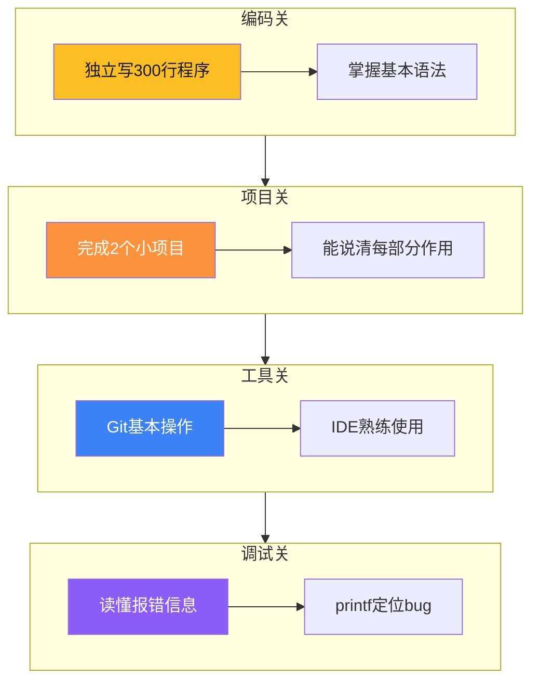
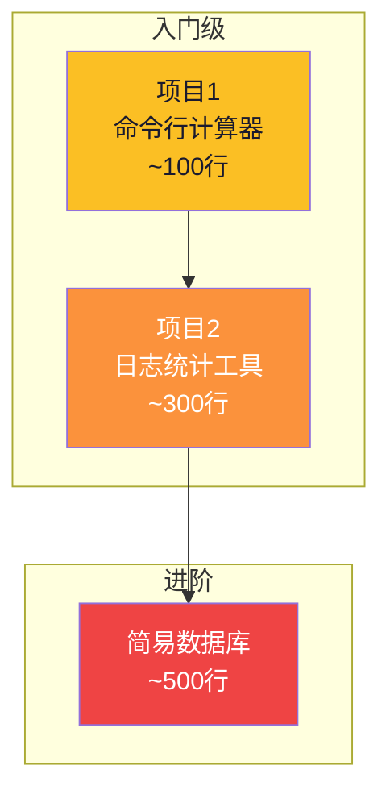
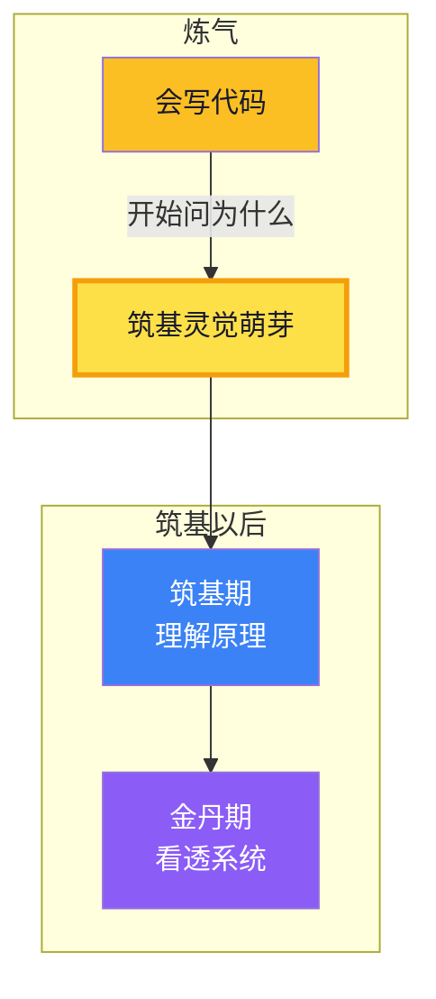

# 【炼气·06】从点灯到工程师：炼气期毕业标准

> **码农修仙传 · 炼气期 · 第6篇**
> 我是玄芯散人，带你从炼气修到大乘。

---

## 境界标识

```
╔══════════════════════════════════╗
║     炼气期 · 第6篇               ║
║     从点灯到工程师：炼气期毕业标准 ║
║     预计阅读：10分钟              ║
╚══════════════════════════════════╝
```

---

## 修仙引入

修仙小说里，弟子在山门修炼数年，师父会设一道毕业考：给你一个任务，独立完成，过程中不许问人，不许翻书。做得出来，出师；做不出来，继续练。

编程入门也一样。前五篇讲了炼气期是什么、你怎么定位自己、怎么修炼才快、第一个程序怎么跑起来、编程到底在学什么。现在到了验收的时候。

这篇给你一份明确的毕业标准，每条都能自测，不是"理解了XX"这种虚的。全部达标，你就可以进入下一阶段，开始C语言基础（007-017）的系统修炼，为筑基打地基。

---

## 硬核主体

### 毕业标准概览

先看全貌，炼气期毕业要过六关：



六关不是并列的，有先后顺序。编码是地基，项目是检验，工具是保障，调试是内功。先能写代码，再能做项目，然后用工具管好项目，遇到问题能查。四层递进，缺一层就站不稳。

下面逐关拆解。

### 第一关：编码能力，独立写300行程序

炼气期毕业的最低门槛：关掉所有教程，从空文件开始，独立写出一个300行以上的程序。

300行是什么概念？不是300行hello world的重复，是300行有逻辑的代码。包含函数定义和循环判断，能做文件读写，会用数组组织数据，各部分协作完成一个功能。

来看一个达标水平的代码片段：

```c
#include <stdio.h>
#include <stdlib.h>
#include <string.h>

#define MAX_STUDENTS 100
#define NAME_LEN 50

/* 学生结构体 */
typedef struct {
    char name[NAME_LEN];
    int score;
} Student;

/* 从文件读取学生成绩 */
int load_students(const char *path, Student *students, int max)
{
    FILE *f = fopen(path, "r");
    if (!f) {
        fprintf(stderr, "打开文件失败: %s\n", path);
        return -1;
    }

    int count = 0;
    while (count < max && fscanf(f, "%s %d", students[count].name, &students[count].score) == 2) {
        count++;
    }
    fclose(f);
    return count;
}

/* 计算平均分 */
double calc_average(const Student *students, int count)
{
    if (count == 0) return 0.0;
    int sum = 0;
    for (int i = 0; i < count; i++) {
        sum += students[i].score;
    }
    return (double)sum / count;
}

/* 找最高分的学生 */
int find_top(const Student *students, int count)
{
    int top_idx = 0;
    for (int i = 1; i < count; i++) {
        if (students[i].score > students[top_idx].score) {
            top_idx = i;
        }
    }
    return top_idx;
}

int main(void)
{
    Student students[MAX_STUDENTS];
    int count = load_students("grades.txt", students, MAX_STUDENTS);

    if (count <= 0) {
        printf("没有读取到学生数据\n");
        return 1;
    }

    double avg = calc_average(students, count);
    int top = find_top(students, count);

    printf("学生人数: %d\n", count);
    printf("平均分: %.1f\n", avg);
    printf("最高分: %s (%d分)\n", students[top].name, students[top].score);

    return 0;
}
```

这段代码大约60行，涉及结构体定义和文件读写，做了函数封装，用了数组遍历和指针传参。你能独立写出来，说明语法和逻辑都过关了。再扩展排序功能，加个命令行菜单，处理异常输入，凑到300行不难。

自测方法：找一个题目，比如学生成绩管理或者简易通讯录，关掉教程，打开空编辑器，开始写。写不下去就说明还差，写得出来就算过。

注意"独立"两个字。可以查API文档，可以搜"fscanf怎么用"，但不能抄别人的代码。查文档是学一个用法然后自己组织，抄代码是照搬别人的逻辑，两者不一样。

### 第二关：项目经验，完成2个独立小项目

编码能力解决的是语法和逻辑问题，项目经验解决的是需求和工程问题。一个300行的学生成绩管理程序是写代码，一个带菜单且有文件存储还能增删改查的成绩管理系统才是做项目。

毕业要求：完成至少2个独立小项目，不参考教程，全程自己来。

什么样的项目算达标？给几个例子：



项目1是入门级，100行左右。比如一个命令行计算器，支持四则运算，能连续计算，做了错误处理。这个项目练的是基本语法和函数封装。

项目2是进阶级，300行左右。比如一个日志统计工具，读取日志文件，按关键词过滤，统计出现次数，输出报告。这个项目练的是文件IO和字符串处理，还有数据组织。

两个项目都完成后，你应该具备了把一个模糊需求拆解成代码步骤的能力。这个能力比语法本身值钱得多。招聘面试考的也是这个：给你一个需求，你能不能拆成模块，写成代码，跑出结果。

做完项目后要能回答这几个问题：
- 这个项目分了几个模块，每个模块干什么
- 遇到了什么bug，怎么定位和修复的
- 如果重写，你会改哪些地方

答得上来，说明你真的理解了自己写的东西。答不上来，说明你在抄代码或者撞运气写出来的，修为还不够扎实。

### 第三关：工具链，Git和开发环境

炼气期不要求精通工具链，但Git基本操作必须会。

Git是修仙者的储物袋。没有Git，你的代码版本管理靠"复制文件夹改名"：main.c, main_v2.c, main_最终版.c, main_真的最终版.c。这种管理方式在炼气期勉强能混，到了筑基期就是灾难。

毕业要求掌握的Git操作：

```bash
# 初始化仓库
git init

# 查看状态
git status

# 暂存和提交
git add .
git commit -m "添加学生成绩管理功能"

# 查看历史
git log --oneline

# 分支操作
git branch feature-sort
git checkout feature-sort
git checkout main
git merge feature-sort

# 远程操作
git remote add origin <url>
git push -u origin main
git pull
```

不需要理解Git内部的对象模型（那是筑基期的事），但上面的命令要会用。判断标准：你的项目仓库至少有10次以上的commit记录，每次commit信息说明白了改了什么，不是"update"或者"改了"。

开发环境方面，你至少熟练使用一个编辑器或IDE。VS Code也行，CLion也行，Keil也行，不挑。但你要会用这些功能：创建项目和文件，编译和运行，设置断点和单步调试，搜索替换，安装插件。

这些听起来理所当然，但真的有人用了两年VS Code还不会打断点。工具是手的延伸，手不熟练，脑子再清楚也白搭。

### 第四关：调试能力，读懂报错，定位bug

调试能力在第五篇讲过，这里给毕业标准。

炼气期调试要求不高，但必须做到两条。

第一，遇到报错能读完整个错误信息，说出错误类型和大致位置。

看这段代码：

```c
#include <stdio.h>

int main(void)
{
    int arr[5] = {1, 2, 3, 4, 5};
    int *p = NULL;

    *p = arr[0];    /* 对空指针解引用 */

    printf("%d\n", *p);
    return 0;
}
```

编译能过，运行时崩溃。终端输出：

```
Segmentation fault (core dumped)
```

炼气期毕业生应该知道：Segmentation fault是段错误，通常是访问了非法内存地址。往上看代码，`*p = arr[0]`这一行对NULL指针解引用了，这就是问题所在。

第二，会用printf调试。

gdb在炼气期不要求精通（金丹期会专门讲），但printf调试法必须会。在代码里加printf打印变量值，运行后看输出，根据值的变化推断哪一步出了问题。

```c
/* 调试示例：加printf查循环执行情况 */
for (int i = 0; i < n; i++) {
    printf("[debug] i=%d, arr[i]=%d\n", i, arr[i]);  // 临时调试输出
    sum += arr[i];
}
printf("[debug] sum=%d, expected=%d\n", sum, expected);  // 查最终结果
```

调试结束后删掉这些printf。这不是优雅的方法，但在炼气期够用。等你到了筑基期学会gdb，就可以用断点单步走，不用满屏幕printf了。

### 第五关：工程意识，代码是给人读的

炼气期不要求多高的工程能力，但要有工程意识。什么是工程意识？三条。

第一，函数要有注释。不是每行都注释，但函数开头要写清楚这个函数干什么，参数怎么传，返回什么值。

```c
/*
 * 从文件读取学生成绩
 * 参数: path - 文件路径
 * 参数: students - 学生数组指针
 * 参数: max - 数组最大容量
 * 返回: 实际读取的学生数，-1表示文件打开失败
 */
int load_students(const char *path, Student *students, int max)
```

第二，代码要分文件。一个main.c塞500行不是炼气期该做的事。把不同功能的代码拆到不同文件，用头文件声明接口。

第三，项目要有README。哪怕只有三行，写清项目名称，怎么编译，怎么运行。别人拿到你的代码能跑起来，这就算有工程意识。

```markdown
# 学生成绩管理系统

## 编译
gcc -o grade_mgmt main.c student.c

## 运行
./grade_mgmt grades.txt

## 功能
- 从文件读取学生成绩
- 计算平均分和最高分
- 按分数排序输出
```

这三条做到，工程意识就算及格了。不要求设计模式，不要求分层，炼气期只要知道代码写出来是给别人看的就行。

### 第六关：心态转变，开始问"为什么"

这一关最特殊，因为它不是技能，是心态。

炼气期你学的全是"怎么用"：怎么写变量，怎么用循环，怎么定义函数，怎么读写文件。毕业的标志是开始问"为什么"：

- 为什么C语言要区分int和char？
- 为什么数组索引从0开始而不是从1开始？
- 为什么函数参数传递有的能改变原值有的不能？
- 为什么printf输出到屏幕要经过操作系统？

这些问题你可能答不上来，没关系。答不上来很正常，答案在筑基期甚至金丹期才讲。要紧的是你开始问了。

修仙小说里，弟子修炼到一定境界会产生"灵觉"，开始感知到以前察觉不到的灵气流动。编程也一样，写代码写到一定量，你会开始对"代码背后发生了什么"产生好奇。这种好奇心就是筑基灵觉的萌芽。



图里黄色那个节点就是毕业的真正标志。六关里前五关是技能，第六关是心态。技能可以用时间堆出来，心态只能靠自己悟。但你把前五关认真过一遍，第六关通常会自然到来，因为你写了足够多的代码，自然会开始想代码背后的道理。

---

## 修仙术语对照表

| 修仙术语 | 技术现实 | 本篇位置 |
|----------|---------|---------|
| 毕业考 | 炼气期毕业标准自测 | 毕业标准概览 |
| 出师 | 六关全部达标 | 第一至第六关 |
| 储物袋 | Git版本管理 | 第三关 |
| 灵觉萌芽 | 开始问"为什么"的心态转变 | 第六关 |
| 山门 | 编程入门阶段 | 修仙引入 |
| 练功 | 编码能力训练 | 第一关 |
| 实战 | 独立项目经验 | 第二关 |
| 修为扎实 | 能说清项目每部分的作用 | 第二关 |
| 走火入魔 | 抄代码堆项目但不理解 | 第二关 |

---

## 突破条件

六关自检，全部达标才算炼气期毕业：

- [ ] 关掉教程独立写出300行以上程序，代码包含结构体和文件读写（编码关）
- [ ] 完成2个独立小项目，全程自己来，包含需求拆解和调试（项目关）
- [ ] 能说清自己项目分了几个模块，每个模块干什么，遇到最难的bug是什么（项目关）
- [ ] Git仓库有10次以上commit记录，每次信息说明白了改了什么（工具关）
- [ ] 遇到Segmentation Fault能说出"段错误=访问非法内存"并定位到哪一行（调试关）
- [ ] 函数有注释说明参数和返回值，项目有README能让人跑起来（工程关）
- [ ] 能说出3个自己写代码时产生的疑问，比如"为什么数组从0开始"（心态关）

> 最后一项是炼气期到筑基期的分水岭。技能可以靠时间堆，好奇心只能靠写够量的代码自然催生。七条全勾，下一篇带你进入C语言基础修炼，为筑基打地基。

---

## 下期预告 + 互动

> 下一篇：【炼气·07】C语言：嵌入式工程师的母语
>
> 炼气期认知篇到此结束。接下来进入C语言基础组（007-017），系统过一遍嵌入式工程师必备的C语言知识。
> 007先讲清楚：C语言哪些部分嵌入式必须会，哪些部分嵌入式用不到，为什么C语言是嵌入式工程师的"母语"。

现在问你：

> 你炼气期做过的项目是什么？计算器还是日志工具还是别的？用了多久？遇到最头疼的bug是什么？
>
> 七条毕业标准里，你觉得哪条最难达标？是300行独立编码还是Git还是心态转变？

> 评论区聊聊你的炼气期修炼历程，看看大家都卡在哪一关。

> 我是玄芯散人，带你从炼气修到大乘。

---

*本文是「码农修仙传」系列第6篇。系列导航见 [xren.ren](https://xren.ren)*
