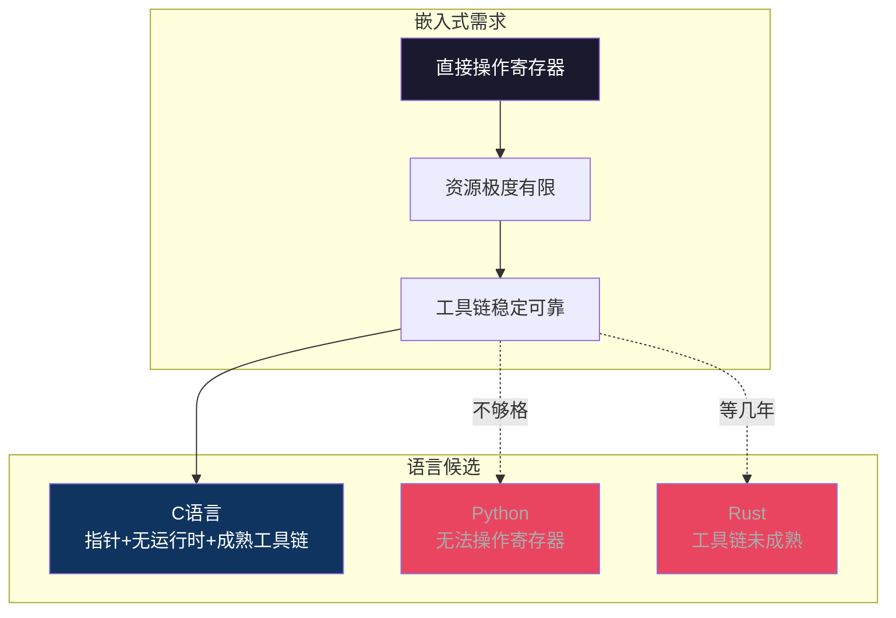
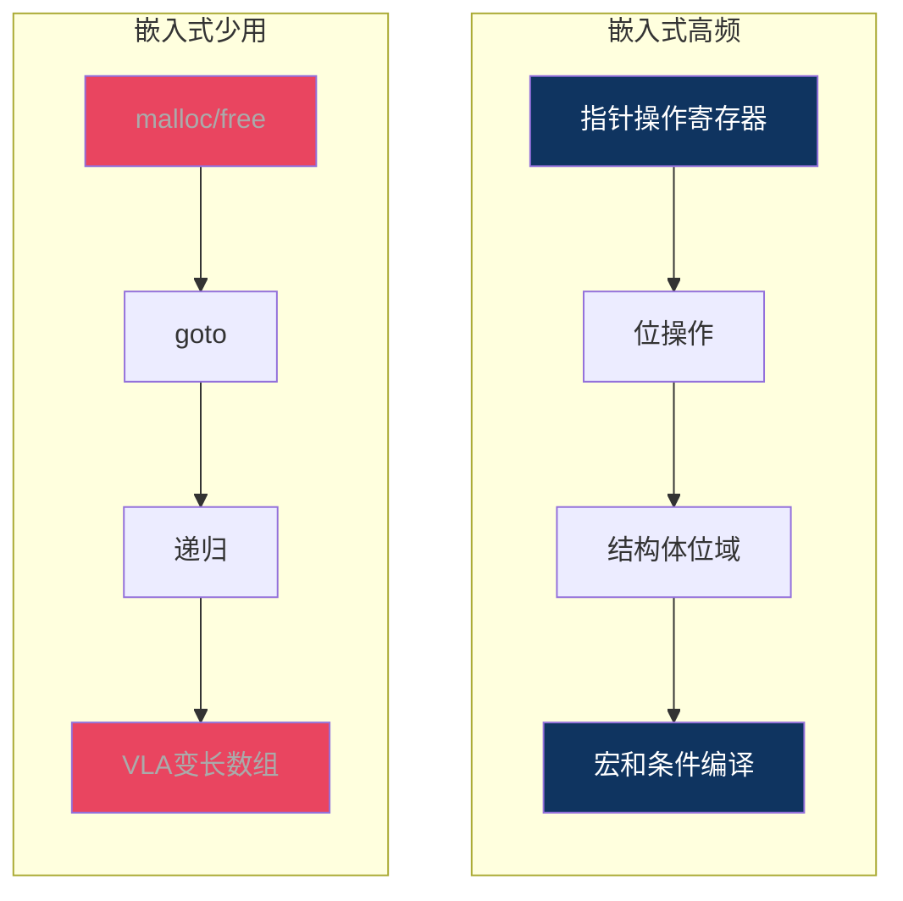

# 【炼气·07】C语言：嵌入式工程师的母语

> **码农修仙传 · 炼气期 · 第7篇**
> 我是玄芯散人，带你从炼气修到大乘。

---

## 境界标识

```
╔══════════════════════════════════╗
║     炼气期 · 第7篇               ║
║     C语言：嵌入式工程师的母语     ║
║     预计阅读：12分钟              ║
╚══════════════════════════════════╝
```

---

## 修仙引入

修仙界有上万种功法，有人练剑，有人练丹，有人练符。但所有宗门的新弟子，入门第一件事都是学同一门基础功法。因为它是所有高阶功法的底子，你绕不开它。

编程语言也一样。世界上有几百种语言，Python优雅，Rust安全，Go简洁。但在嵌入式这个领域，C语言是不可绕过的母语。你用的芯片厂家给的库是C写的，编译器支持的第一个语言是C，操作系统内核是C写的，连RTOS的源码也是C。

这篇不讲C语法教程（那是你该自己看书练的），讲的是：C语言在嵌入式里到底用了哪些部分，哪些部分你一辈子碰不到，为什么嵌入式工程师跟C语言绑定这么深。

---

## 硬核主体

### 为什么嵌入式选C，不选别的

C语言刚好够用，目前没有更好的替代。

嵌入式开发有几个硬约束。第一，你要直接操作硬件寄存器，需要能精确控制内存布局的语言。第二，芯片资源有限，几十KB的Flash和RAM是常态，不能像Python那样带个庞大的运行时。第三，工具链要稳定可靠，编译出来的二进制可预测。

C语言恰好满足这三条。它有指针，能直接读写任意内存地址（也就是寄存器）。它没有运行时，编译出来的就是机器码，不需要解释器。它的编译器（GCC和Clang和IAR和Keil）经过几十年打磨，在ARM Cortex-M这些平台上生成的代码质量极高。

Python不行，它有GIL，有运行时，没法直接操作寄存器。Java不行，JVM太重，垃圾回收的延迟在实时系统里不可接受。Rust在嵌入式领域有希望，但工具链还不够成熟，学习曲线也陡。



所以你看，STM32的HAL库是C写的，FreeRTOS源码是C写的，Linux内核是C写的。你学嵌入式，C语言是绕不过去的母语。

### C语言标准：C89/C99/C11/C17

C语言不是一成不变的。它有自己的标准演进，每隔几年更新一版。

- C89（也叫C90）：第一版正式标准，规定了C语言的基础语法。最经典，几乎所有编译器都支持。
- C99：加了几个实用特性，比如 `//` 单行注释，还有 `for` 循环内声明变量，以及 `stdint.h` 定宽整型。变长数组VLA也是C99引入的。
- C11：加了原子操作和多线程支持和 `_Generic` 泛型选择。但变长数组被改成可选了。
- C17：主要是修bug，没加什么新东西。

嵌入式开发用什么标准？大部分项目用C99，因为 `stdint.h` 太有用了。你写 `uint8_t`、`int32_t` 这种定宽类型，比 `unsigned char`、`long` 这种大小不确定的类型靠谱得多。在STM32上，`int` 是32位，但在某些8位单片机上 `int` 可能是16位。用 `int32_t` 就不用担心这个问题。

```c
#include <stdint.h>

/* C99的定宽整型，嵌入式首选 */
uint8_t  reg_value;      /* 8位无符号，对应寄存器值 */
uint32_t base_addr;     /* 32位无符号，对应内存地址 */
int16_t  temperature;   /* 16位有符号，温度可能为负 */

/* C89风格，大小不确定 */
unsigned char val;      /* 可能8位，但不直观 */
unsigned long addr;     /* 在STM32上是32位，在8051上是16位 */
```

C99还允许在 `for` 循环里声明变量，这在C89里是不行的：

```c
/* C99写法，嵌入式常用 */
for (int i = 0; i < 10; i++) {
    /* ... */
}

/* C89写法，i要在循环外声明 */
int i;
for (i = 0; i < 10; i++) {
    /* ... */
}
```

C11的原子操作和多线程在嵌入式里很少直接用。因为嵌入式要么跑裸机（没有线程概念），要么用RTOS（RTOS有自己的任务调度API，不需要C11的线程库）。C11的 `_Generic` 也很少用，嵌入式代码讲究简单直接，泛型编程在资源受限的环境里反而增加复杂度。

### 嵌入式必会的C语法

C语言总共没多少语法，但嵌入式开发高频用到的只有一部分。我给你列一下。

### 1. 变量和数据类型

这是最基础的。你需要知道 `uint8_t`、`uint16_t`、`uint32_t` 的区别，知道 `float` 在某些没有FPU的芯片上慢得要命（用软件模拟浮点运算），知道 `char` 在不同平台上有无符号不一致的问题。

### 2. 指针

嵌入式里指针用得比任何地方都多。因为操作寄存器就是往特定地址写值。`volatile uint32_t *` 这种类型你会天天写。`volatile` 告诉编译器：这个地址的值可能在代码控制之外被改变（比如硬件寄存器），每次都要重新读，不要缓存到寄存器里。

```c
/* 嵌入式最经典的指针用法：操作寄存器 */
#define RCC_AHB1ENR  (*(volatile uint32_t *)0x40023830)

/* 往寄存器地址写值，使能GPIOA时钟 */
RCC_AHB1ENR |= (1 << 0);
```

这段代码的意思是：把地址 `0x40023830` 强制转换成 `volatile uint32_t *` 类型的指针，然后解引用它，对它指向的内存地址做按位或操作。这就是嵌入式工程师天天干的事。

### 3. 位操作

寄存器是按位控制的，每一位对应一个功能。设第3位为1，清第5位为0，读取第7位的值。这些操作天天写。

```c
uint32_t reg = *(volatile uint32_t *)0x40020000;

reg |= (1 << 3);       /* 置位第3位 */
reg &= ~(1 << 5);      /* 清零第5位 */
uint32_t bit7 = (reg >> 7) & 1;  /* 读取第7位 */
```

### 4. 结构体和位域

有些寄存器结构复杂，一个32位寄存器里有十几个字段。用结构体加位域可以让代码更清晰。

```c
/* 用位域定义GPIO寄存器结构 */
typedef struct {
    uint32_t mode   : 2;    /* 2位：输入/输出/复用/模拟 */
    uint32_t cnf    : 2;    /* 2位：推挽/开漏等 */
    uint32_t pull   : 2;    /* 2位：上下拉配置 */
    uint32_t reserved : 26; /* 填充到32位 */
} GPIO_Config;
```

### 5. 宏定义和条件编译

嵌入式项目经常需要跨平台，同一套代码跑在不同芯片上。用宏来切换。

```c
/* 根据芯片型号选择不同的寄存器地址 */
#ifdef STM32F407
    #define GPIOA_BASE  0x40020000
#elif defined(STM32F103)
    #define GPIOA_BASE  0x40010800
#else
    #error "Unsupported chip"
#endif
```

### 6. 函数

这个不用多说，C语言的函数是组织代码的基本单位。嵌入式里函数通常简短，一个函数只做一件事。

### 嵌入式用不到的C语法

C语言有些特性，在PC开发里常用，但在嵌入式里几乎不碰。

### 1. 动态内存分配（malloc/free）

嵌入式系统内存极小，碎片化是致命的。malloc分配失败怎么处理？内存碎片导致系统运行几天后崩溃？在RTOS里虽然有堆，但大部分固件工程师能不用malloc就不用。

```c
/* PC开发常用，嵌入式尽量不用 */
char *buf = malloc(1024);   /* 分配可能失败，碎片不可控 */
free(buf);

/* 嵌入式常用：静态分配 */
char buf[1024];            /* 编译时确定大小，放在栈或BSS段 */
```

### 2. goto语句

goto在C语言里争议几十年了。Linux内核确实大量使用goto做错误处理，但MISRA C标准（汽车和工业安全领域的C语言规范）禁止使用goto。嵌入式项目如果需要过功能安全认证（如IEC 61508），goto是不能用的。

```c
/* PC/内核风格：goto做错误处理 */
int init_device(void) {
    if (setup_a() < 0) goto fail_a;
    if (setup_b() < 0) goto fail_b;
    if (setup_c() < 0) goto fail_c;
    return 0;            /* 成功 */
fail_c:
    cleanup_b();
fail_b:
    cleanup_a();
fail_a:
    return -1;
}

/* 嵌入式风格：不用goto，用标志位 */
int init_device(void) {
    int ret = -1;
    if (setup_a() == 0) {
        if (setup_b() == 0) {
            if (setup_c() == 0) {
                return 0;    /* 成功 */
            }
            cleanup_b();
        }
        cleanup_a();
    }
    return ret;
}
```

### 3. 递归

递归调用函数，每次调用都消耗栈空间。嵌入式系统的栈可能只有几KB，递归层数不可控就会栈溢出。如果确实需要递归算法（比如树的遍历），用循环加显式栈来替代。

### 4. setjmp/longjmp

这两个函数实现跨函数跳转，类似"超级goto"。在嵌入式里几乎没人用，因为它绕过正常的函数调用返回机制，在RTOS环境下可能导致资源泄漏。

### 5. 变长数组VLA

C99引入了变长数组，数组大小可以在运行时确定。但C11把它改成可选特性了。嵌入式编译器不一定支持，而且栈上的变长数组很容易溢出。用固定大小数组或动态分配替代。

```c
/* VLA，C99引入但嵌入式不用 */
void func(int n) {
    int arr[n];        /* n在运行时才知道，栈空间不可控 */
}

/* 嵌入式写法：固定大小 */
void func(int n) {
    int arr[128];      /* 编译时确定，最坏情况128够用 */
    if (n > 128) return;  /* 超出范围直接返回 */
}
```

**6. 复杂的指针技巧。** 比如指向函数的指针的指针的数组。这些在PC编程里偶尔有用，嵌入式里代码讲究可读性和可维护性，太绕的写法会被review打回来。



### MISRA C：嵌入式的安全绳（选读，筑基期会深入）

聊到嵌入式C语言，绕不开MISRA C。它是汽车工业软件可靠性协会制定的C语言使用规范，规定了哪些C语法能用、怎么用、哪些不能用。

MISRA C不是C语言的替代品，它是C语言的使用约束。C语言本身设计时留了很多自由度（比如有符号整数溢出的行为未定义），MISRA C把这些自由度收窄，让你写出来的代码行为可预测，不会出现意料之外的执行路径。

MISRA C的规则包括：

- 禁止使用goto语句
- 禁止使用动态内存分配
- 指针算术运算受限（推荐用数组下标代替）
- if/else if必须有else分支
- 函数不能递归调用
- 禁止使用隐式类型转换

嵌入式项目如果涉及功能安全（比如汽车电子和医疗器械和航空航天），MISRA C是强制要求。即使不做安全认证，了解这些规则也有助于写出更稳健的代码。

### volatile：嵌入式工程师的老朋友

PC编程里很少有人用 `volatile` 修饰符。但在嵌入式里，它天天见。

`volatile` 告诉编译器：这个变量的值可能在代码之外被改变，每次访问都要重新读内存，不要缓存到寄存器里。

两种情况必须用 `volatile`：

```c
/* 情况1：硬件寄存器 */
volatile uint32_t *status_reg = (volatile uint32_t *)0x40020010;

/* 编译器不能省略这个循环 */
while ((*status_reg & 0x01) == 0) {
    /* 等待硬件置位。如果没有volatile，
       编译器可能只读一次就不再读了 */
}

/* 情况2：中断和主程序共享的变量 */
volatile int flag = 0;

void EXTI0_IRQHandler(void) {    /* 中断服务函数 */
    flag = 1;                    /* 中断里修改变量 */
}

int main(void) {
    while (1) {
        if (flag) {              /* 主循环里检查 */
            flag = 0;
            /* 处理事件 */
        }
    }
}
```

如果 `flag` 没有 `volatile`，编译器可能认为 `while(1)` 循环里 `flag` 的值不会被改变（因为主循环里没有修改它的地方），直接省略重复读取。结果就是中断改了 `flag` 的值，但主循环永远看不到。这种bug极难排查，因为代码逻辑看起来完全正确。

### C语言在嵌入式的未来

有人问：Rust会不会取代C语言在嵌入式的地位？

短期内不会。C语言在嵌入式领域的积累太深了。芯片厂商的SDK是C写的，RTOS是C写的，几十年的遗留代码是C写的。Rust虽然在内存安全上比C强很多，但工具链对各种芯片的支持还不够全，学习曲线也陡。等Rust的工具链和配套追上来，可能还要5到10年。

但方向是明确的。C语言的内存安全问题（比如缓冲区溢出和空指针解引用和用后释放）是嵌入式系统崩溃的主要原因之一。如果Rust能解决这些问题且不牺牲性能，长期来看替代是可能的。

对于现在的你来说，学C语言不会过时。至少在未来5年内，嵌入式工程师不会C语言是寸步难行的。

---

## 修仙术语对照表

| 修仙术语 | 技术现实 | 本篇位置 |
|----------|---------|---------|
| 母语 | C语言在嵌入式的不可替代地位 | 标题和引入 |
| 功法标准 | C89/C99/C11/C17语言标准 | 标准演进段落 |
| 灵力精度 | 定宽整型stdint.h | C99特性 |
| 法器操控术 | 指针操作硬件寄存器 | 嵌入式必会语法 |
| 符文位序 | 位操作控制寄存器位域 | 嵌入式必会语法 |
| 禁术 | malloc/goto/递归等嵌入式少用的语法 | 嵌入式用不到的语法 |
| 安全锁链 | MISRA C规范 | MISRA C段落 |
| 灵视术 | volatile修饰符防止编译器省略读取 | volatile段落 |
| 功法迭代 | C语言标准演进（C89到C17） | 标准演进段落 |
| 新派功法 | Rust语言对C的竞争 | 未来展望段落 |
| 跨境修炼 | 条件编译跨平台适配 | 嵌入式必会语法 |
| 功法总纲 | C语言语法概览 | 整篇 |

---

## 进阶条件

炼气期学C语言，不要求精通，但以下几条得过：

- [ ] 能说出C89和C99至少3个区别（比如 `//` 注释、for内声明变量、`stdint.h`）
- [ ] 能用 `volatile uint32_t *` 指针往指定内存地址写一个值
- [ ] 能用位操作完成置位、清零，以及读取一个32位寄存器的任意一位
- [ ] 知道嵌入式为什么尽量不用malloc，能说出至少2个原因
- [ ] 能写一个带条件编译的宏，根据不同芯片型号选择不同定义
- [ ] 知道 `volatile` 的用途，能说出至少2种必须用它的情况
- [ ] 能区分 `uint32_t` 和 `unsigned long` 在嵌入式开发中的区别

> 最后一项是跨平台的意识。用 `stdint.h` 的定宽类型，你的代码换个芯片也能跑。用 `unsigned long`，换个平台可能位数就不一样了。这种意识是嵌入式工程师的基本功。

---

## 下期预告 + 互动

> 下一篇：【炼气·08】变量在内存里怎么存的
>
> 你会用 `uint8_t` 和 `uint32_t` 了，但它们在内存里到底怎么排列的？int和char占几个字节？结构体里字段顺序不同为什么sizeof不一样？大小端又是什么东西？
> 下篇带你看看内存里变量的真实长相。

现在问你：

> 💡 你学C语言时觉得哪个概念最难懂？指针还是位操作还是内存布局？
>
> 🔧 你的嵌入式项目用C89还是C99？有没有被编译器的某个C标准差异坑过？
>
> 评论区聊聊你的C语言修炼经历。

> 我是玄芯散人，带你从炼气修到大乘。

---

*本文是「码农修仙传」系列第7篇。系列导航见 [xren.ren](https://xren.ren)*
