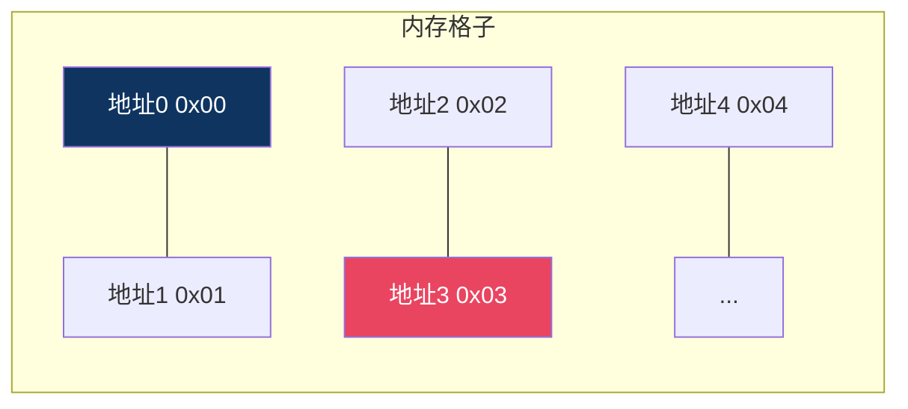
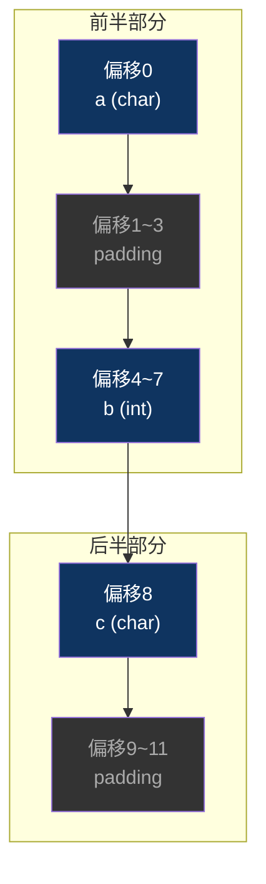
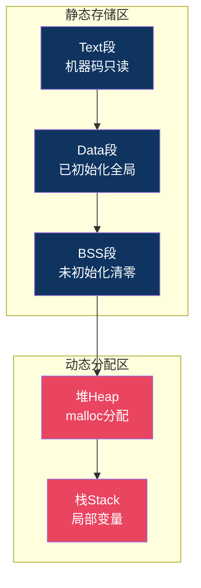

# 【炼气·08】变量在内存里怎么存：int/char/结构体的内存布局

> **码农修仙传 · 炼气期 · 第8篇**
> 我是玄芯散人，带你从炼气修到大乘。

---

## 境界标识

```
╔══════════════════════════════════════╗
║     炼气期 · 第8篇                    ║
║     变量在内存里怎么存的              ║
║     int/char/结构体的内存布局+大小端   ║
║     预计阅读：15分钟                   ║
╚══════════════════════════════════════╝
```

---

## 修仙引入

修仙小说里有个常见桥段：主角进了一个洞府，发现地上摆满了瓶瓶罐罐。丹药装在葫芦里，灵石码在木箱里，功法卷轴挂在架子上的格子里。每样东西都有自己待的地方，不能瞎放。你要取什么，得知道它在哪个格子。

内存就是计算机的洞府。你写的每个变量，都要在内存里占一块地方。但你有没有想过：一个 `int` 占几个格子？一个 `char` 跟一个 `int` 在内存里长什么样？你写一个 `struct` 把几个变量打包，它们在内存里是紧紧挨着还是有空隙？为什么 `sizeof(struct)` 经常比你以为的大？

这些问题不搞清楚，后面学指针和调试时，看内存窗口会一脸懵。今天带你扒开内存的盖子，看看变量在里面到底怎么放的。

---

## 硬核主体

### 先认识内存：一条长长的一维格子

内存不是一片复杂的二维空间，它就是一条很长很长的一维格子。每个格子有编号，编号从0开始，一直往上数。这个编号就是"地址"。

每个格子能存1个字节（8个bit）。你声明一个变量，编译器就给它分配若干个连续的格子。



一个字节是8个bit，能表示0到255（无符号）或者-128到127（有符号）。如果一个变量需要更大的数，就占多个格子。

### 各种类型占几个格子

C语言的基本类型，在不同平台上占的字节数不一样。但在同一个平台上是有规律的。下面列的是32位ARM Cortex-M（也就是STM32）上的数据：

```c
#include <stdio.h>
#include <stdint.h>

int main(void)
{
    printf("sizeof(char)   = %u\n", (unsigned)sizeof(char));    /* 1 */
    printf("sizeof(short)  = %u\n", (unsigned)sizeof(short));   /* 2 */
    printf("sizeof(int)    = %u\n", (unsigned)sizeof(int));     /* 4 */
    printf("sizeof(long)   = %u\n", (unsigned)sizeof(long));    /* 4 */
    printf("sizeof(float)  = %u\n", (unsigned)sizeof(float));   /* 4 */
    printf("sizeof(double) = %u\n", (unsigned)sizeof(double));  /* 8 */
    printf("sizeof(int *)  = %u\n", (unsigned)sizeof(int *));  /* 4 */

    return 0;
}
```

在STM32上跑一下，你会看到：char是1字节，short是2，int是4，指针也是4。

但这里有个坑：`long` 在STM32上是4字节，但你换到64位Linux上编译，`long` 可能是8字节。这就是为什么嵌入式代码里用 `uint32_t` 这种定宽类型，不用 `long`。上一篇讲过这个道理。

`char` 比较特殊。C标准规定 `sizeof(char)` 永远等于1，不管在什么平台上。但 `char` 是有符号还是无符号，编译器可以自己决定。用Keil（ARM Compiler 5）编译时 `char` 默认是无符号的，但换GCC或Clang编译就是有符号的。如果你写的代码依赖 `char` 的符号性，最好显式写 `signed char` 或 `unsigned char`。

### 一个int在内存里长什么样

你写 `int a = 0x12345678;`，这个数在内存里怎么放？

一个 `int` 占4个字节，值是 `0x12345678`。这4个字节分别是：`0x12`、`0x34`、`0x56`、`0x78`。

问题来了：这4个字节在内存里，谁放低地址，谁放高地址？

有两种放法：

小端模式（Little Endian）：低位字节存低地址。

```
地址:    0x00   0x01   0x02   0x03
内容:   0x78   0x56   0x34   0x12
         ↑低    ←————————→    ↑高
```

大端模式（Big Endian）：高位字节存低地址。

```
地址:    0x00   0x01   0x02   0x03
内容:   0x12   0x34   0x56   0x78
         ↑高    ←————————→    ↑低
```

x86是小端。ARM Cortex-M（STM32）也是小端。但ARM可以配置成大端模式，只是实际项目里几乎没人这么干。网络传输用的是大端（所以叫"网络字节序"）。

怎么判断你的机器是大端还是小端？写几行代码就知道：

```c
#include <stdio.h>
#include <stdint.h>

int main(void)
{
    uint32_t a = 0x12345678;
    uint8_t *p = (uint8_t *)&a;  /* 拿到a的首字节地址 */

    if (*p == 0x78) {
        printf("Little Endian\n");    /* 小端：低字节在低地址 */
    } else if (*p == 0x12) {
        printf("Big Endian\n");      /* 大端：高字节在低地址 */
    }

    return 0;
}
```

这段代码的逻辑是：取变量 `a` 的地址，转成 `uint8_t *` 指针，解引用后看第一个字节是什么。如果是 `0x78`（最低位字节），说明低字节放在低地址，小端。如果是 `0x12`（最高位字节），大端。

### 数组在内存里怎么放

数组比单个变量好理解。数组就是一排连续的格子，每个元素大小一样。

```c
int arr[4] = {10, 20, 30, 40};
```

在内存里就是4个 `int` 紧挨着：

```
地址:    0x00~0x03   0x04~0x07   0x08~0x0B   0x0C~0x0F
内容:      arr[0]      arr[1]      arr[2]      arr[3]
值:         10          20          30          40
```

`arr` 这个名字本身不占内存，它是首元素的地址的别名。`arr` 和 `&arr[0]` 是同一个值。数组名就是指向数组第一个元素的指针。

这里有个新手常犯的错：

```c
int arr[4] = {10, 20, 30, 40};
int *p = arr;

/* p指向arr[0] */
printf("%d\n", *p);       /* 10 */
printf("%d\n", *(p + 1)); /* 20 */

/* p+1是什么意思？ */
/* 指针加1，不是地址加1，而是加一个元素的大小 */
/* p是int*，int是4字节，所以p+1实际加了4个地址 */
```

指针的加减法是按元素大小算的，不是按字节算的。`p + 1` 意思是"往前走一个int的距离"，也就是4个字节。这个概念很有用，后面讲指针的时候会专门讲。

### 结构体在内存里怎么放

结构体是把不同类型的变量打包在一起。但你可能不知道，结构体在内存里不一定是紧紧挨着的。

先看一个例子：

```c
#include <stdio.h>
#include <stdint.h>

typedef struct {
    char  a;      /* 1字节 */
    int   b;      /* 4字节 */
    char  c;      /* 1字节 */
} Example;

int main(void)
{
    printf("sizeof(Example) = %u\n", (unsigned)sizeof(Example));
    return 0;
}
```

你算一下：1 + 4 + 1 = 6。但实际输出是12。

为什么多了6个字节？因为"内存对齐"。

编译器为了让CPU取数据更快，会在结构体成员之间插入空隙（padding），让每个成员的地址对齐到自己大小的整数倍。具体规则：

- `char` 对齐到1字节边界（任何地址都行）
- `short` 对齐到2字节边界（地址必须是2的倍数）
- `int` 对齐到4字节边界（地址必须是4的倍数）
- 结构体总大小是最大成员对齐数的倍数

看一下 `Example` 的内存布局：

```
偏移:  0     1  2  3     4  5  6  7     8     9  10  11
字段:  a     ←padding→    b              c     ←padding→
大小:  1     3            4              1     3
```

`a` 在偏移0，占1字节。`b` 是int，必须对齐到4的倍数，所以跳到偏移4开始放，中间3个字节空着。`c` 在偏移8，占1字节。总大小9，但结构体大小要是4的倍数（int的对齐数），所以补3个字节到12。

这就是为什么 `sizeof(Example)` 是12而不是6。



### 怎么压缩结构体大小

把字段顺序换一下，大小就不一样了：

```c
typedef struct {
    char  a;
    char  c;
    int   b;
} Example2;
```

现在 `a` 和 `c` 挨着放（偏移0和1），padding只需要2字节（偏移2和3），`b` 从偏移4开始。总大小8。

```c
typedef struct {
    char  a;
    char  c;
    /* padding 2字节 */
    int   b;
} Example2;  /* sizeof = 8 */
```

你看，同样的三个字段，换个顺序就省了4字节。在PC上你可能不在意，但在STM32上，SRAM只有几十KB到几百KB，省4字节是有价值的。如果有一百个这样的结构体，就是400字节。所以嵌入式工程师写结构体时有个习惯：按大小从大到小排，先放大的类型，再放小的。

如果你不想让编译器做对齐，可以用 `#pragma pack` 强制取消padding：

```c
#pragma pack(push, 1)   /* 按1字节对齐 */
typedef struct {
    char a;
    int  b;
    char c;
} PackedExample;
#pragma pack(pop)

/* sizeof(PackedExample) = 6，没padding */
```

但这样做的代价是CPU读取 `b` 时可能要多次访问内存（因为地址没对齐），速度变慢。有些芯片（比如某些ARM核）直接抛异常。所以 `#pragma pack(1)` 用在通信协议解析（比如一个数据包的格式是固定的，不能有padding）比较多，不用在追求速度的地方。

### 内存里还有哪些区域

你写的变量不只放在一个地方。内存分为好几个区域，不同变量待在不同地方。



看一个例子，搞清楚每个变量在哪个段：

```c
#include <stdint.h>
#include <stdlib.h>

int global_init = 42;       /* Data段：已初始化的全局变量 */
int global_uninit;           /* BSS段：未初始化的全局变量，值为0 */

static int static_init = 10;    /* Data段：已初始化的static变量 */
static int static_uninit;       /* BSS段：未初始化的static变量，值为0 */

const int const_val = 100;      /* Text/RO段：const常量，只读 */

int main(void)
{
    int local = 7;              /* 栈：局部变量 */
    static int local_static = 5; /* Data段：函数内static仍然是全局存储 */
    int *p = malloc(sizeof(int)); /* p本身在栈上，malloc的4字节在堆上 */

    free(p);
    return 0;
}
```

几个要点：

- 全局变量和 `static` 变量不在栈上，它们在Data段或BSS段，程序整个运行期间都存在
- BSS段不占可执行文件的空间（因为值全是0，加载时由启动代码清零），所以未初始化的全局变量不增大你的固件大小
- 局部变量在栈上，函数返回后自动销毁
- `malloc` 分配的内存在堆上，需要手动 `free`，不释放就泄漏

在STM32上，这些段的地址是固定的。Flash从 `0x08000000` 开始，SRAM从 `0x20000000` 开始。Text段和Data段（初始值）在Flash里，BSS段和堆栈在SRAM里。启动代码会把Data段的初始值从Flash搬移到SRAM，然后清零BSS段。

### 在调试器里看变量的内存

如果你用Keil或STM32CubeIDE调试，可以打开内存窗口（Memory Window），输入变量地址，直接看内存里的十六进制数据。

比如你设了断点，停下来后看 `int a = 0x12345678;` 的内存：

```
地址 0x20000010:  78 56 34 12   ← 小端模式下看到的
```

注意这里是小端，低位字节 `78` 在前面。很多人第一次看内存窗口会读反，以为是 `0x12345678` 对应 `12 34 56 78`。不是的。小端模式下内存里的字节顺序和你写的数字顺序是反的。

这个能力很关键。调试时遇到"变量值不对""数组被覆盖""结构体某个字段莫名被改"，打开内存窗口看一眼，比print有用得多。

---

## 修仙术语对照表

| 修仙术语 | 技术现实 | 本篇位置 |
|----------|---------|---------|
| 洞府格子 | 内存地址，每个地址存1字节 | 内存介绍 |
| 瓶罐大小 | sizeof返回的字节数 | 各种类型占几字节 |
| 药瓶摆放朝向 | 大端和小端字节序 | int在内存里 |
| 瓶子紧挨 | 数组连续存储 | 数组在内存里 |
| 货架隔板 | 结构体padding内存对齐 | 结构体在内存里 |
| 隔板空隙 | padding字节 | 结构体在内存里 |
| 货架重排 | 调整字段顺序减少padding | 压缩结构体大小 |
| 强拆隔板 | #pragma pack取消对齐 | 压缩结构体大小 |
| 洞府分区 | 内存分区Text/Data/BSS/Heap/Stack | 内存区域 |
| 长期储物柜 | Data段和BSS段（全局/static） | 内存区域 |
| 临时用物台 | 栈上的局部变量 | 内存区域 |
| 外借储物格 | 堆上malloc的内存 | 内存区域 |
| 法宝查看 | 调试器内存窗口查看字节 | 调试器看内存 |
| 灵脉坐标 | STM32 Flash从0x08000000 SRAM从0x20000000 | 内存区域 |

---

## 进阶条件

- [ ] 能说出char/short/int/指针在32位ARM上各占几个字节
- [ ] 能写出判断大小端的代码，并解释为什么这么判断
- [ ] 给一个结构体，能画出每个字段的偏移量和padding位置
- [ ] 能解释为什么 `sizeof(struct{char a; int b; char c;})` 是12而不是6
- [ ] 知道怎么调整字段顺序让结构体更紧凑
- [ ] 能区分全局变量和局部变量分别存在内存的哪个段
- [ ] 在调试器的内存窗口里看到 `78 56 34 12` 能认出这是小端模式下的 `0x12345678`

> 最后一条是实战能力。嵌入式调试时，看内存窗口是家常便饭。能一眼读对小端字节序，你的调试效率会高很多。下篇讲二进制和十六进制，和本篇是连着的。

---

## 下期预告 + 互动

> 下一篇：【炼气·09】二进制和十六进制：计算机的唯一语言
>
> 你在内存窗口里看到的全是十六进制数，`0x78`、`0x56` 这种。十六进制跟二进制是什么关系？为什么寄存器值用十六进制写而不是十进制？`0xFF` 到底等于多少？
> 下篇带你搞清楚进制转换和补码，把这些"天书"看懂。

现在问你：

> 💡 你有没有被sizeof的结果坑过？以为结构体是6字节结果出来12？
>
> 🔧 你的项目里有没有用 `#pragma pack` 的地方？为什么要用？
>
> 评论区聊聊你踩过的内存对齐的坑。

> 我是玄芯散人，带你从炼气修到大乘。

---

*本文是「码农修仙传」系列第8篇。系列导航见 [xren.ren](https://xren.ren)*
