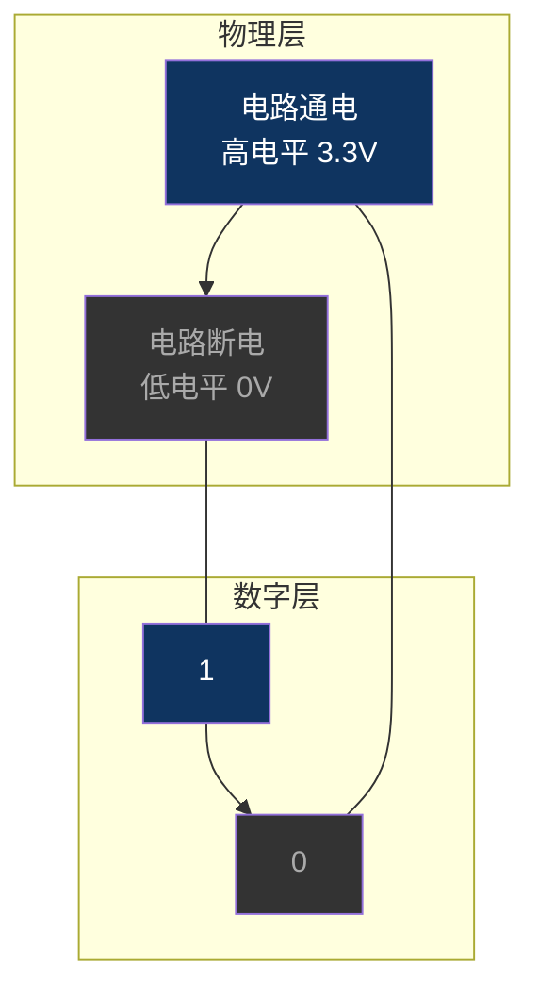
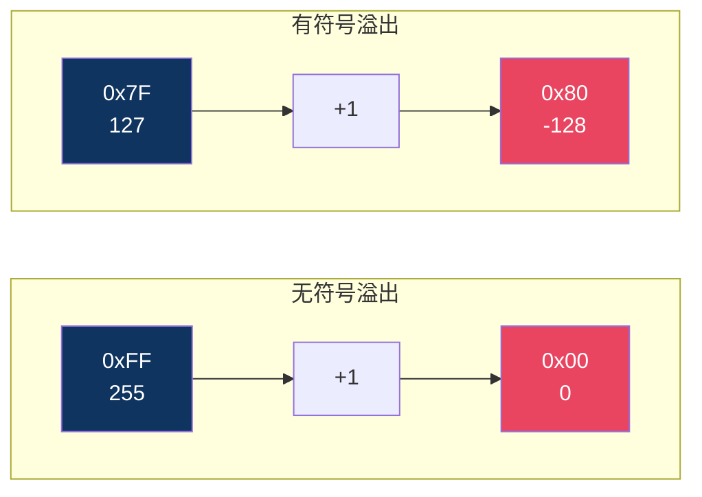

# 【炼气·09】二进制和十六进制：计算机的唯一语言

> **码农修仙传 · 炼气期 · 第9篇**
> 我是玄芯散人，带你从炼气修到大乘。

---

## 境界标识

```
╔══════════════════════════════════════╗
║     炼气期 · 第9篇                    ║
║     二进制和十六进制                  ║
║     计算机的唯一语言                  ║
║     预计阅读：15分钟                   ║
╚══════════════════════════════════════╝
```

---

## 修仙引入

你在调试器里看寄存器值，满屏的 `0x40021000`、`0x00000001`。你翻Datasheet，每个寄存器的默认值都写成 `0x00000000` 或 `0x00000004`。你心里想：为什么不写十进制？这些十六进制的数到底什么意思？

修仙界有符文。大能刻在洞府墙上的，是符文。符文只有固定的几个笔画，但组合起来能表达万物。凡人看不懂符文，觉得是天书。但你修炼到一定境界，会发现符文比日常语言更精确，更贴近天地法则。

计算机的符文就是二进制。0和1这两个"笔画"，组合起来能表达所有数据。十六进制是二进制的手写体，方便人阅读和书写。搞懂这两套数字系统，你才能跟计算机和寄存器对话。

---

## 硬核主体

### 为什么计算机用二进制

计算机底层是电路。电路只有两种状态：通电和断电。高电平和低电平。用数字表示就是1和0。

你可能会问：为什么不用三进制？理论上三进制的信息密度更高。但用三进制意味着电路要区分三种电压状态，比如0V，2.5V，5V，抗干扰能力大幅下降。一根线上来个噪声，2.5V抖到3V，你就分不清了。二进制只有两档，0V和5V（或者1.2V或者3.3V，取决于芯片工艺），抗干扰能力强得多。

所以早在第一个电子管计算机的时代，工程师就选了二进制。一直到现在手机芯片，底层全是二进制。物理定律决定了这个选择。



一个0或1叫一个"位"（bit，比特）。8个bit组成一个"字节"（byte）。一个字节能表示256种不同的状态（2的8次方）。内存地址按字节编号，寄存器按字节配置，ASCII码也用一个字节表示一个字符。

### 十进制：人类习惯的计数法

你打小用的十进制，有十个数字符号：0到9。逢十进一。为什么人类选了十进制？因为人有十根手指。这不是玩笑，考古学家发现的最早的计数工具就是手指和脚趾。

十进制里，每个位置代表10的幂次：

```
十进制数 253
= 2 × 10² + 5 × 10¹ + 3 × 10⁰
= 200 + 50 + 3
= 253
```

百位的权重是100，十位是10，个位是1。

### 二进制：计算机的母语

二进制只有两个数字符号：0和1。逢二进一。

每个位置的权重是2的幂次：

```
二进制数 1011
= 1 × 2³ + 0 × 2² + 1 × 2¹ + 1 × 2⁰
= 8 + 0 + 2 + 1
= 11（十进制）
```

从右到左，权重依次是1，2，4，8，16，32，64，128……

记住这几个2的幂次，以后看二进制数就能快速换算：

```
2⁰ = 1
2¹ = 2
2² = 4
2³ = 8
2⁴ = 16
2⁵ = 32
2⁶ = 64
2⁷ = 128
2⁸ = 256
2⁹ = 512
2¹⁰ = 1024（1KB）
2¹⁶ = 65536
2³² = 4294967296（4GB）
```

你看，2的10次方是1024，这就是1KB等于1024字节而不是1000字节的原因。2的32次方约43亿，这就是32位系统能寻址4GB内存的原因。

### 二进制和十进制怎么互转

十进制转二进制：除2取余，逆序排列。

拿十进制的42举例：

```
42 ÷ 2 = 21 余 0
21 ÷ 2 = 10 余 1
10 ÷ 2 = 5  余 0
5  ÷ 2 = 2  余 1
2  ÷ 2 = 1  余 0
1  ÷ 2 = 0  余 1
```

从下往上读余数：`101010`。所以42的二进制是 `101010`。

验证一下：1×32 + 0×16 + 1×8 + 0×4 + 1×2 + 0×1 = 32 + 8 + 2 = 42。对。

二进制转十进制就是上面那个加权求和，不重复了。

用C语言可以快速验证：

```c
#include <stdio.h>

int main(void)
{
    int a = 0b101010;    /* 0b前缀表示二进制（GCC/Clang扩展，C23标准化） */
    printf("%d\n", a);   /* 输出42 */
    return 0;
}
```

`0b` 前缀是GCC和Clang的编译器扩展，直到C23（ISO/IEC 9899:2024）才正式纳入C语言标准。MSVC不支持，Keil的ARM Compiler v5也不支持 `0b` 前缀。如果不支持，就用十六进制代替。

### 十六进制：二进制的手写体

二进制写起来太长了。一个32位的数，写成二进制是 `0010 0100 0000 0010 0001 0000 0000 0000`，谁受得了。

十六进制就是二进制的简写。十六进制有16个数字符号：0到9，然后是A到F（大小写都行）。A代表10，F代表15。

逢十六进一。每个位置的权重是16的幂次：

```
十六进制数 0x2A
= 2 × 16¹ + A(10) × 16⁰
= 32 + 10
= 42（十进制）
```

十六进制最大的好处是：1个十六进制位刚好对应4个二进制位（2的4次方等于16）。所以二进制和十六进制之间的转换非常直接。

```
二进制  1010 1010
十六进制  A    A
即 0xAA
```

```
二进制  0010 0100 0000 0010 0001 0000 0000 0000
十六进制  2    4    0    2    1    0    0    0
即 0x24021000
```

你只需要记住一个对照表：

| 十进制 | 二进制 | 十六进制 |
|--------|--------|----------|
| 0 | 0000 | 0 |
| 1 | 0001 | 1 |
| 2 | 0010 | 2 |
| 3 | 0011 | 3 |
| 4 | 0100 | 4 |
| 5 | 0101 | 5 |
| 6 | 0110 | 6 |
| 7 | 0111 | 7 |
| 8 | 1000 | 8 |
| 9 | 1001 | 9 |
| 10 | 1010 | A |
| 11 | 1011 | B |
| 12 | 1100 | C |
| 13 | 1101 | D |
| 14 | 1110 | E |
| 15 | 1111 | F |

记住这张表，你看 `0xFF` 立刻知道是二进制 `11111111`，十进制255。`0x0F` 是 `00001111`，十进制15。`0xAA` 是 `10101010`，十进制170。

C语言里十六进制以 `0x` 或 `0X` 开头。这是约定俗成的标记，告诉编译器"这是十六进制不是十进制"。

```c
int a = 0xFF;    /* 255 */
int b = 0x10;    /* 16，不是10 */
int c = 0x2A;    /* 42 */
int d = 0x100;   /* 256 */
```

一个常见的坑：`0x10` 不是十，是十六。新手经常把 `0x10` 和 `10` 搞混。

### 为什么寄存器值都用十六进制

你看STM32的Datasheet，GPIOA的基地址是 `0x48000000`（F4系列）或者 `0x40020000`（F1系列）。这些地址用十进制写毫无规律，但用十六进制有结构：

```
0x40020000
   │
   └── 0x4 = 0100，表示这是ARM Cortex-M的内存区域（高地址位）
```

更实际的原因是位操作。一个32位寄存器，每一位可能控制一个功能。你要把第5位置1，写：

```c
GPIOA->BSRR = 0x0020;   /* 第5位置1（0x20 = 0b00100000） */
```

如果用十进制，`0x0020` 就是十进制的32。你看32能看出第5位被设了吗？不能。但看 `0x20` 你能直接对应到二进制 `00100000`，一眼看到第5位是1。

再看一个例子，配置寄存器的位域。GPIO的模式寄存器每2位控制一个引脚的模式：

```c
/* 配置PA5为输出模式（01） */
GPIOA->MODER &= ~(0x03 << (5 * 2));  /* 清零第10~11位 */
GPIOA->MODER |=  (0x01 << (5 * 2));  /* 设为01：通用输出 */
```

这里的 `0x03` 是 `0b11`，`0x01` 是 `0b01`。用十六进制写，你一眼能看出有几个bit被设了。用十进制写3和1，看不出位模式。

所以寄存器操作几乎全用十六进制，不是装高级，是确实方便。

### 补码：计算机怎么表示负数

到现在为止，我们说的都是正数。但程序里经常要用负数。`int a = -5;`，这个负号在内存里怎么存？

你可能会想：加一个符号位。最高位0表示正数，1表示负数。这叫"原码"表示法。但原码有个大问题：0有两种表示（`00000000` 和 `10000000`，即正0和负0），而且加减法不能统一处理（正数加负数要变成减法）。

计算机实际用的是"补码"（two's complement）。补码的规则很简单：

- 正数：跟原码一样，最高位是0
- 负数：取反加1

拿 `int8_t`（8位有符号整数）举例，-5的补码怎么算：

```
第一步：写5的二进制
5 = 00000101

第二步：按位取反
~00000101 = 11111010

第三步：加1
11111010 + 1 = 11111011

所以 -5 的补码是 11111011
```

验证一下。用C代码：

```c
#include <stdio.h>
#include <stdint.h>

int main(void)
{
    int8_t a = -5;
    printf("a = %d\n", a);         /* -5 */
    printf("a的十六进制 = 0x%02X\n", (uint8_t)a);  /* 0xFB */
    return 0;
}
```

`0xFB` 就是二进制 `11111011`。对上了。

补码的好处是：加减法统一处理。CPU不需要区分正数和负数，同一套加法器就能算。比如 `5 + (-5)`：

```
  00000101   (5)
+ 11111011   (-5，补码)
-----------
 000000000   (结果，最高位溢出丢弃，剩下0)
```

你不用管正负号，直接按位加就行。这就是为什么所有现代CPU都用补码。

补码还有几个特点你要记住：

一个8位有符号数的范围是 -128 到 127。为什么不是 -127 到 127？因为补码里0只有一种表示，省下来的那个编码（`10000000`）用来表示 -128。所以范围比原码多一个负数。

```
8位无符号（uint8_t）：0 ~ 255
8位有符号（int8_t）：-128 ~ 127

32位无符号（uint32_t）：0 ~ 4294967295
32位有符号（int32_t）：-2147483648 ~ 2147483647
```

怎么看一个补码表示的正数还是负数？看最高位。最高位是0就是正数，是1就是负数。`0xFB` 的最高位是1，是负数。`0x05` 的最高位是0，是正数。

快速算负数的绝对值：取反加1。看到 `11111011`，取反得到 `00000100`，加1得到 `00000101`，就是5。所以这个补码表示的是 -5。

### 几个容易踩的坑

### 坑1：0x开头和0b开头

`0x` 是十六进制前缀，`0b` 是二进制前缀（部分编译器支持）。但有些新手把数字前面的0当成二进制前缀。在C语言里，以0开头的整数字面量是八进制：

```c
int a = 010;    /* 八进制，等于十进制的8！ */
int b = 0b10;   /* 二进制，等于十进制的2 */
int c = 10;     /* 十进制，10 */
int d = 0x10;   /* 十六进制，等于十进制的16 */
```

`010` 不是十，是八。这个坑踩过一次就记住了。

### 坑2：移位和溢出

```c
uint8_t a = 0xFF;    /* 255 */
a = a + 1;           /* 溢出，a变成0 */

int8_t b = 127;      /* 最大正数 */
b = b + 1;           /* 溢出，b变成-128！ */
```

127加1不是128，是 -128。因为补码的 `01111111`（127）加1变成 `10000000`（-128）。这就是整数溢出，是无数Bug的根源。



### 坑3：printf格式化

打印十六进制用 `%x` 或 `%X`（大小写的区别），打印二进制没有标准格式符。打印有符号和无符号数用 `%d` 和 `%u`：

```c
#include <stdio.h>
#include <stdint.h>

int main(void)
{
    uint8_t val = 0xFB;

    printf("十进制（无符号）: %u\n", val);           /* 251 */
    printf("十进制（有符号）: %d\n", (int8_t)val);   /* -5 */
    printf("十六进制: 0x%02X\n", val);              /* 0xFB */

    return 0;
}
```

同一个字节 `0xFB`，用 `%u` 打印是251，用 `%d` 打印是-5。取决于你把它当有符号还是无符号。上一篇讲内存布局时说过，`char` 的符号性编译器可以自定，这就是为什么你有时打印出来的值跟预期不一样。

### 实战：手动换算一个寄存器值

看一个STM32的GPIO配置。GPIOA->MODER寄存器，每个引脚占2位。你想把PA5配置为通用输出模式（01），同时保持其他引脚不变。

```c
/* 先清零PA5对应的2位（第10~11位） */
GPIOA->MODER &= ~(0x03 << 10);

/* 再设为01 */
GPIOA->MODER |= (0x01 << 10);
```

`0x03 << 10` 是什么？`0x03` 是 `0b00000000000000000000000000000011`，左移10位变成 `0b00000000000000000011000000000000`，也就是 `0x00000C00`。

所以第一步是把这个寄存器的第10和11位清零（`&= ~`），第二步把第10位置1（`|=`），结果是第10位为1，第11位为0，即二进制 `01`，对应通用输出模式。

你在脑子里走一遍这个过程：`0x03` → 左移10位 → `0xC00` → 取反 → 清零对应位 → 置位。十六进制让你的位操作清清楚楚。如果用十进制，`0x03` 是3，左移10位是3072，你看到3072能想到是第10和11位吗？

### 为什么说进制是嵌入式基本功

你做嵌入式，每天都在做这些事：

- 看Datasheet的寄存器位域定义，每个位域用十六进制标注
- 写位操作代码，移位和掩码和或与运算
- 在调试器的Memory窗口里看十六进制字节
- 算寄存器配置值，比如分频系数、波特率
- 看反汇编输出，全是十六进制地址和机器码

进制转换和补码不是考试用的知识点，是你每天用的工具。熟练了以后，你看到 `0x40010800` 能立刻反应过来这是GPIOA_CRH的地址，看到 `0xFFFF` 能立刻想到这是16位全1。

这篇讲的是概念和规则，下一篇讲指针。指针跟地址直接相关，而地址就是十六进制数。所以这篇的基础打好了，下篇学指针会轻松很多。

---

## 修仙术语对照表

| 修仙术语 | 技术现实 | 本篇位置 |
|----------|---------|---------|
| 符文 | 二进制0和1 | 修仙引入 |
| 符文笔画 | bit，一个0或1 | 为什么用二进制 |
| 符文组合 | byte，8个bit组成一个字节 | 为什么用二进制 |
| 笔画权位 | 二进制每位对应2的幂次 | 二进制母语 |
| 手写符文 | 十六进制，二进制的简写 | 十六进制 |
| 符文对照表 | 二进制/十进制/十六进制对照表 | 十六进制 |
| 符号正反 | 补码，正数原码，负数取反加1 | 补码 |
| 正符极限 | 有符号正数最大值127或2147483647 | 补码 |
| 反符极限 | 有符号负数最小值-128或-2147483648 | 补码 |
| 符文溢出 | 整数溢出，127加1变-128 | 容易踩的坑 |
| 前缀混淆 | 0x十六进制，0b二进制，0八进制 | 容易踩的坑 |
| 位域配置 | 寄存器位操作用十六进制 | 寄存器值用十六进制 |
| 灵脉读数 | 调试器Memory窗口看十六进制 | 进制是基本功 |

---

## 进阶条件

- [ ] 能默写2的0次方到2的10次方的值（1, 2, 4, 8, 16, 32, 64, 128, 256, 512, 1024）
- [ ] 能在30秒内把一个8位十六进制数转成二进制和十进制
- [ ] 能手算-1的8位补码，并验证结果（应该是0xFF）
- [ ] 看到 `0x03 << 10` 能说出结果是 `0xC00`，对应第10和11位被置1
- [ ] 能解释为什么 `int8_t` 的范围是-128到127而不是-127到127
- [ ] 知道C语言中以0开头的整数字面量是八进制，不是十进制
- [ ] 在printf里能用 `%x` 和 `%d` 分别打印同一个字节的十六进制和十进制值

> 最后一项是实战检验。写个小程序，定义 `uint8_t val = 0xFB`，用不同格式符打印，确保你能预测每个输出。下一篇讲指针，指针的值就是地址，地址都是十六进制写的，进制这关必须过。

---

## 下期预告 + 互动

> 下一篇：【炼气·10】指针到底指什么
>
> 上一篇讲了变量在内存里的布局，你知道了每个变量有个地址。这个地址就是一个十六进制数。指针就是存这个地址的变量。`int *p` 里的 `*` 到底什么意思？`p+1` 加的是4个字节还是1个字节？指针和数组到底是什么关系？

现在问你：

> 💡 你被八进制坑过吗？写 `010` 以为等于10，结果跑出来是8？
>
> 🔧 你的代码里有没有因为整数溢出导致的Bug？比如127加1变成-128？
>
> 评论区聊聊你踩过的进制和补码的坑。

> 我是玄芯散人，带你从炼气修到大乘。

---

*本文是「码农修仙传」系列第9篇。系列导航见 [xren.ren](https://xren.ren)*
