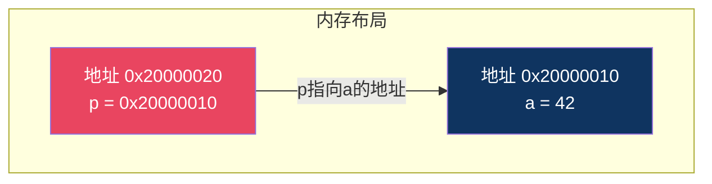
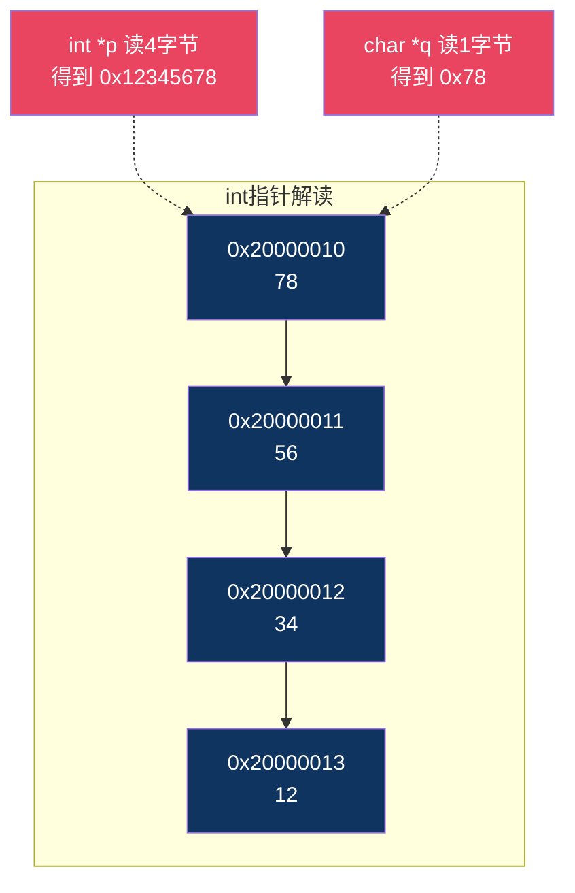
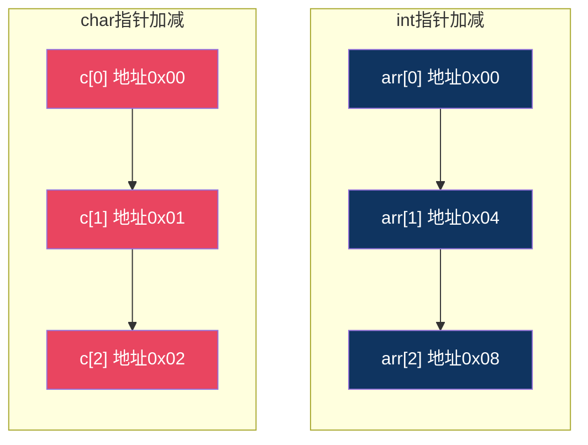
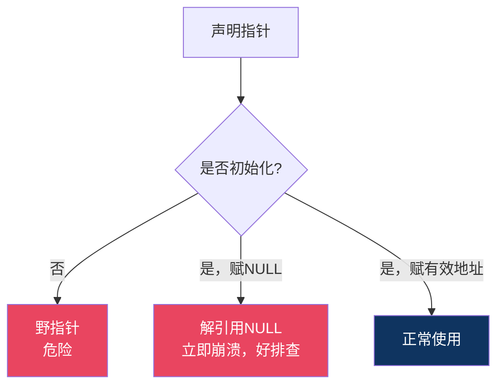

# 【炼气·10】指针到底指什么：地址和解引用

> **码农修仙传 · 炼气期 · 第10篇**
> 我是玄芯散人，带你从炼气修到大乘。

---

## 境界标识

```
╔══════════════════════════════════════╗
║     炼气期 · 第10篇                   ║
║     指针到底指什么                    ║
║     地址、解引用和指针运算             ║
║     预计阅读：18分钟                   ║
╚══════════════════════════════════════╝
```

---

## 修仙引入

修仙小说里，有一种法器叫"寻龙尺"。你拿着它，它不存宝物，只指方位。指针指向哪里，你就去哪里找东西。指针本身不是宝物，但它知道宝物在哪。

C语言的指针就是程序世界里的寻龙尺。一个 `int a = 42;`，变量 `a` 存在内存里某个地址。指针 `int *p = &a;` 存的不是42，是 `a` 的地址。你拿着这个指针，顺藤摸瓜就能找到42这个值。

很多人学指针学到崩溃，觉得指针是天书。其实指针就三件事：它存的是地址，用 `*` 拿地址里的东西，指针加减按元素大小走。搞清这三点，指针就不吓人了。

---

## 硬核主体

### 指针到底存了什么

先看一行代码：

```c
int a = 42;
int *p = &a;
```

`a` 是一个普通变量，里面存了42。`p` 是一个指针变量，里面存了什么？存的是 `a` 的地址。

上一篇讲过，内存是一排格子，每个格子有编号。假设 `a` 被放在地址 `0x20000010`（STM32的SRAM区域），那么 `p` 里存的就是 `0x20000010` 这个值。

```
变量  存的内容      存在哪
 a    42           地址 0x20000010
 p    0x20000010   地址 0x20000020（另一个地方）
```

注意，`p` 自己也是个变量，它也占内存。在32位STM32上，指针占4个字节，因为地址是32位的。在64位PC上，指针占8个字节。

```c
#include <stdio.h>
#include <stdint.h>

int main(void)
{
    int a = 42;
    int *p = &a;

    printf("a的值:     %d\n", a);        /* 42 */
    printf("a的地址:   %p\n", (void*)&a); /* 比如 0x7ffd... */
    printf("p的值:     %p\n", (void*)p);  /* 和&a一样 */
    printf("p的地址:   %p\n", (void*)&p); /* 另一个地址 */

    return 0;
}
```

跑一下这段代码，你会看到 `p` 的值和 `&a` 的值一模一样。指针就是个存地址的变量，没有别的。



### `*p` 到底干了什么：解引用

你知道 `p` 存的是 `a` 的地址。但光知道地址没用，你得能读出地址里存的东西。`*p` 就是这个操作，叫"解引用"（dereference）。

```c
int a = 42;
int *p = &a;

printf("%d\n", *p);  /* 打印42，因为p存的地址里放的是42 */
```

`*p` 的意思就是：去 `p` 存的那个地址，取回来放在那里的东西。

反过来，你还能通过 `*p` 写值：

```c
*p = 100;   /* 把a的值改成了100 */
printf("%d\n", a);   /* 100 */
```

`*p = 100` 等价于 `a = 100`，因为 `p` 指向 `a`。这就是指针的威力：你不直接碰 `a`，通过指针就能改 `a` 的值。

函数传参时就靠这个。C语言函数传参是值传递，函数里改形参不会动外面的变量。但你传指针进去，函数里通过指针解引用就能改外面的变量：

```c
void add_one(int *x)
{
    *x = *x + 1;   /* 通过指针改外面的变量 */
}

int main(void)
{
    int a = 42;
    add_one(&a);
    printf("%d\n", a);   /* 43 */
    return 0;
}
```

如果你不传指针，传的是 `a` 的副本，函数里改了副本，外面的 `a` 不变。传指针才能让函数动外面的变量。这个模式在嵌入式代码里到处都是。

### 指针的类型有什么用

你写 `int *p;` 和 `char *q;`，两个指针都存地址，地址的值都是32位的（在STM32上）。那类型有什么用？

类型决定了指针解引用时读几个字节，以及指针加减法走多大步。

```c
int a = 0x12345678;
int *p = &a;
char *q = (char *)&a;

printf("%x\n", *p);   /* 12345678，读4个字节 */
printf("%x\n", *q);   /* 78（小端），只读1个字节 */
```

`int *p` 解引用读4个字节，`char *q` 解引用读1个字节。同样是 `&a` 的地址，用不同类型指针去读，读出来的东西不一样。



`void *` 是一种特殊指针，叫"无类型指针"。它只存地址，不知道指向的是什么类型的数据。你拿到一个 `void *` 后没法直接解引用，得先转成具体类型的指针才能用。`malloc` 的返回值就是 `void *`，因为它不知道你要存什么类型的数据。

```c
void *pv = &a;          /* 合法，任何指针都能隐式转void* */
/* *pv; 编译报错，void指针不能解引用 */
int *pi = (int *)pv;   /* 转成int*后才能用 */
printf("%d\n", *pi);    /* 42 */
```

### 指针加减法：不是加1个字节

这是指针最容易出错的地方。`p + 1` 跳的是 `sizeof(指针指向的类型)` 个字节，不是1个字节。

```c
int arr[4] = {10, 20, 30, 40};
int *p = arr;   /* arr就是数组首元素地址 */

printf("%d\n", *p);       /* 10 */
printf("%d\n", *(p + 1)); /* 20 */
printf("%d\n", *(p + 2)); /* 30 */
```

`p` 指向 `arr[0]`。`p + 1` 跳过1个 `int` 的距离，也就是4个字节。所以 `p + 1` 落在了 `arr[1]` 的位置。

```c
char c_arr[4] = {'A', 'B', 'C', 'D'};
char *q = c_arr;

printf("%c\n", *q);       /* A */
printf("%c\n", *(q + 1)); /* B */
```

`q` 是 `char *`，`char` 占1字节，所以 `q + 1` 地址只加1。



规律就是：`p + n` 等于 `p的地址值 + n × sizeof(指向类型)`。编译器根据指针类型自动算好步长，你不用自己乘。

这也意味着，不同类型的指针不能随便互相赋值。`int *` 加1跳4字节，`char *` 加1跳1字节。如果你把 `int *` 强转成 `char *`，步长就变了。在需要逐字节操作内存的场合（比如串口数据解析），你会经常把别的指针转成 `char *` 或 `uint8_t *` 来逐字节读取。

### 指针和数组的关系

数组和指针在C语言里关系很紧密，但它们不是一回事。

数组是连续的内存块。数组名在大多数表达式中会"退化"成指向首元素的指针：

```c
int arr[4] = {10, 20, 30, 40};
int *p = arr;   /* arr退化成 &arr[0] */

/* 以下两种写法等价 */
printf("%d\n", arr[2]);    /* 30 */
printf("%d\n", *(p + 2));  /* 30 */
printf("%d\n", p[2]);      /* 30，指针也能用下标 */
```

`arr[i]` 在编译器眼里就是 `*(arr + i)`，也就是"从首地址往后走i个元素，取那个位置的值"。指针 `p` 也能用 `p[i]` 的写法，因为 `p[i]` 就是 `*(p + i)`。

但数组名和指针有个区别：数组名是地址常量，不能自增。指针是变量，可以移动。

```c
int arr[4] = {10, 20, 30, 40};
int *p = arr;

p++;          /* 合法，p现在指向arr[1] */
/* arr++; */  /* 编译报错，数组名不是可修改的左值 */

printf("%d\n", *p);   /* 20 */
```

还有一个坑：`sizeof` 对数组和指针的返回值不同。

```c
int arr[4] = {10, 20, 30, 40};
int *p = arr;

printf("%u\n", (unsigned)sizeof(arr));  /* 16，4个int */
printf("%u\n", (unsigned)sizeof(p));    /* 4，指针本身的大小 */
```

`sizeof(arr)` 给的是整个数组占的内存大小。但把数组传给函数后，函数里拿到的只是指针，`sizeof` 出来是指针的大小，不是数组的大小。这就是为什么C语言函数里没法知道数组有几个元素，你得另外传一个长度参数进去。

```c
/* 函数里拿不到数组长度 */
void print_array(int *arr, int len)
{
    /* sizeof(arr)在这里是指针大小4，不是数组大小 */
    for (int i = 0; i < len; i++) {
        printf("%d ", arr[i]);
    }
    printf("\n");
}
```

### 常见指针错误

学指针时，有几个错误几乎人人踩过。

第一个：未初始化的指针。

```c
int *p;       /* p的值是随机的，可能指向任何地方 */
*p = 42;      /* 往随机地址写42，可能崩，可能不崩 */
```

局部变量不初始化，值是垃圾。指针也是局部变量，不初始化就是野指针。你往随机地址写东西，运气好什么也不发生，运气差直接段错误。解决方法很简单，声明指针时初始化：

```c
int *p = NULL;   /* 不指向任何地方 */

if (p != NULL) {
    *p = 42;      /* 只有p不为NULL才用 */
}
```

`NULL` 是一个特殊值，表示"指针不指向任何东西"。解引用 `NULL` 指针会立刻段错误（大多数系统上），这比野指针的随机崩溃好排查得多，因为崩在固定位置。

第二个：返回局部变量的地址。

```c
int *get_value(void)
{
    int x = 42;
    return &x;   /* 返回局部变量的地址 */
}

int main(void)
{
    int *p = get_value();
    printf("%d\n", *p);   /* 未定义行为，x已经被销毁 */
    return 0;
}
```

`x` 是局部变量，函数返回后栈帧被回收，那块内存可能被别的函数覆盖。`p` 指向的地址还在，但里面放的已经不是42了。这种Bug最恶心，调试时值时对时错，因为取决于那块内存被谁覆盖了。

第三个：越界访问。

```c
int arr[4] = {10, 20, 30, 40};
int *p = arr;

*(p + 10) = 99;   /* 越界写，写到不属于arr的地方 */
```

C语言不检查数组越界，指针也不检查。你往 `p + 10` 写东西，编译器不报错，运行时可能崩可能不崩。这种问题要靠开发者自己守规矩，或者用AddressSanitizer之类的工具辅助检测。



### 指针的实际用处

你可能觉得指针全是坑，为什么C语言非要用指针？因为指针让你能直接操作内存，这是C语言接近硬件的原因。

在嵌入式开发里，指针几乎无处不在：

```c
/* STM32里点LED，操作GPIO寄存器（示意地址，具体看芯片手册） */
#define GPIOA_ODR   (*(volatile uint32_t *)0x48000014)

GPIOA_ODR |= (1 << 5);    /* PA5输出高电平，点亮LED */
```

这一行代码里藏着一个指针。`0x48000014` 是GPIOA输出数据寄存器的地址（具体地址因芯片型号而异，这里只是示意），`(volatile uint32_t *)` 把这个整数转成指针，最前面的 `*` 解引用它，让你能读写这个寄存器的值。`volatile` 告诉编译器"这个地址的值可能被硬件改掉，别优化掉对它的读写"。嵌入式工程师每天都在用这种方式直接操作硬件，只是你不一定意识到这是一次指针解引用。

函数传参也靠指针。你要传一个大的结构体给函数，传指针只传4字节地址，传值要拷贝整个结构体。在SRAM只有几十KB的MCU上，省内存很要紧。

```c
typedef struct {
    int   id;
    float temperature;
    float humidity;
    char  name[32];
} SensorData;   /* sizeof可能40+字节 */

/* 传值：拷贝整个结构体，慢 */
void process_value(SensorData data) { ... }

/* 传指针：只传4字节地址，快 */
void process_pointer(SensorData *data)
{
    data->temperature += 1.0f;   /* 通过指针改结构体字段 */
}
```

注意结构体指针用 `->` 而不是 `.` 来访问字段。`data->temperature` 等价于 `(*data).temperature`，是语法糖。

---

## 修仙术语对照表

| 修仙术语 | 技术现实 | 本篇位置 |
|----------|---------|---------|
| 寻龙尺 | 指针，存地址的变量 | 修仙引入 |
| 宝物坐标 | 指针里存的地址值 | 指针存了什么 |
| 顺藤摸瓜 | 解引用 `*p`，通过地址取值 | 解引用 |
| 指尺刻度 | 指针类型决定读取的字节数 | 指针类型 |
| 无属性法宝 | void指针，只存地址不指类型 | 指针类型 |
| 步长 | `p+1` 移动sizeof(类型)个字节 | 指针加减法 |
| 大步小步 | int指针加1跳4字节，char指针跳1字节 | 指针加减法 |
| 法宝退化 | 数组名退化为首元素指针 | 指针和数组 |
| 固定法器 | 数组名是地址常量不能自增 | 指针和数组 |
| 随机指向 | 野指针，未初始化的指针 | 常见错误 |
| 空法器 | NULL指针，不指向任何地方 | 常见错误 |
| 寻物失效 | 返回局部变量地址，栈帧已销毁 | 常见错误 |
| 出界探宝 | 指针越界访问 | 常见错误 |
| 灵脉直触 | 用指针直接操作硬件寄存器 | 指针实际用处 |
| 传送符 | 函数传指针避免拷贝大结构体 | 指针实际用处 |

---

## 突破条件

- [ ] 能说出"指针变量存的是地址"这句话，并解释指针自己也在内存中占空间
- [ ] 能区分 `p`、`&p`、`*p`、`&a` 四个表达式的含义
- [ ] 能写出通过指针修改函数外部变量的代码（传指针给函数）
- [ ] 能解释为什么 `int *p` 加1跳4字节而 `char *q` 加1跳1字节
- [ ] 能解释为什么C语言函数里拿不到数组长度（数组退化为指针后sizeof变4）
- [ ] 能说出野指针、NULL指针和越界指针各自的危险，以及怎么排查
- [ ] 能看懂 `(*(volatile uint32_t *)0x48000014)` 这个嵌入式寄存器操作的含义

> 最后一条是嵌入式工程师的基本功。在STM32开发里，所有裸机寄存器操作都是指针解引用。你理解了这一行，就理解了C语言怎么跟硬件打交道。下一篇讲指针进阶，函数指针和指针数组。

---

## 下期预告 + 互动

> 下一篇：【炼气·11】指针进阶：函数指针和指针数组
>
> 这篇讲了指针存地址和解引用。下一篇深入一点，讲函数指针（指针指向函数的地址），指针数组（一组指针放在一起），还有数组指针和指针的指针。这些在嵌入式回调机制和命令解析器里用得很多。

现在问你：

> 💡 你第一次学指针是被什么卡住的？是 `*p` 的含义还是指针加减法？
>
> 🔧 你在嵌入式项目里有没有直接用地址操作过寄存器？有没有写错过地址导致崩溃？
>
> 评论区聊聊你踩过的指针坑。

> 我是玄芯散人，带你从炼气修到大乘。

---

*本文是「码农修仙传」系列第10篇。系列导航见 [xren.ren](https://xren.ren)*
