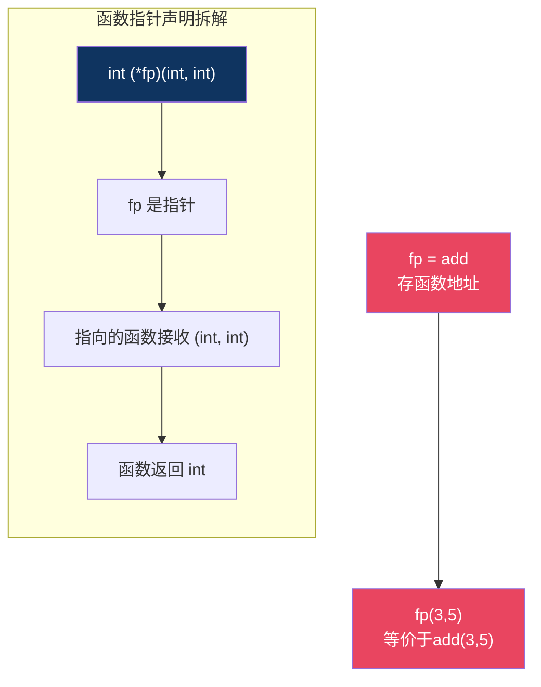
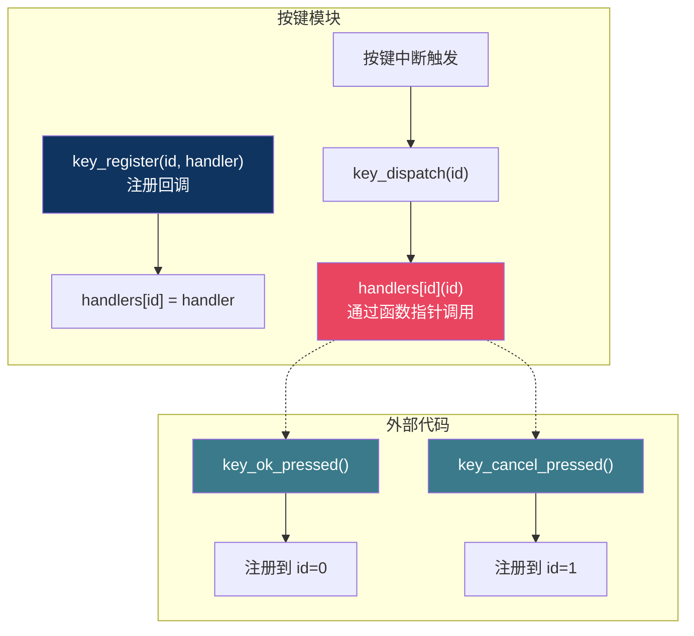
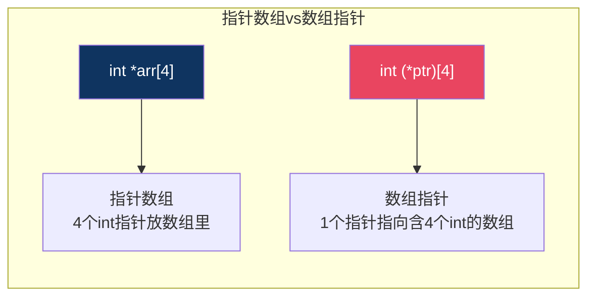
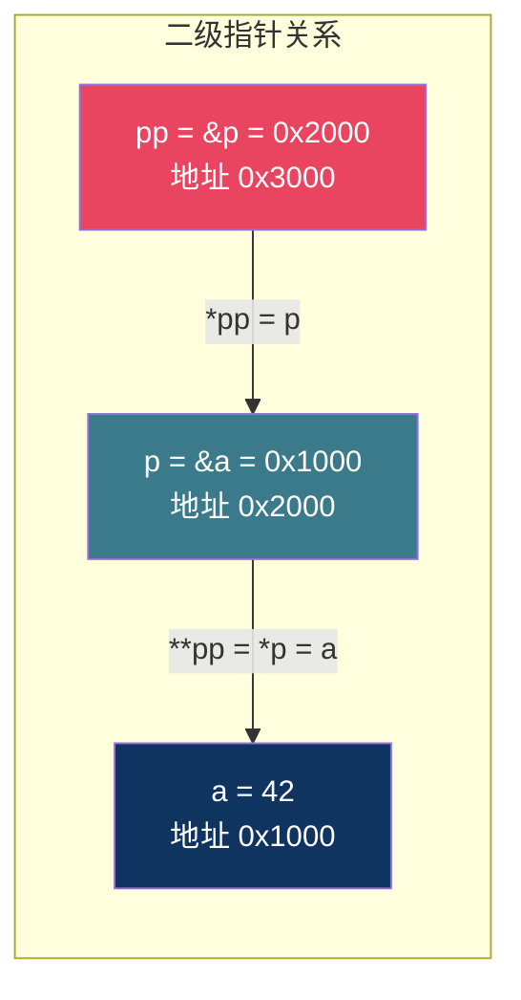

# 【炼气·11】指针进阶：函数指针、指针数组和回调机制

> **码农修仙传 · 炼气期 · 第11篇**
> 我是玄芯散人，带你从炼气修到大乘。

---

## 境界标识

```
╔══════════════════════════════════════╗
║     炼气期 · 第11篇                   ║
║     指针进阶                          ║
║     函数指针、指针数组、回调机制       ║
║     预计阅读：20分钟                   ║
╚══════════════════════════════════════╝
```

---

## 修仙引入

上一篇讲指针存地址和解引用。那篇讲的是指针跟变量之间的关系。但指针能指的东西不止变量，它还能指函数。

修仙小说里有一种法术叫"远程传音符"。你不用亲自到场，把法术封在符里，别人触发符箓就能释放你留的法术。函数指针就是这种传音符，你把一个函数的地址存起来，到了该调用的时候，通过指针触发那个函数，不用直接喊它的名字。

这篇讲四个东西：函数指针，指针数组，数组指针，指针的指针。名字绕，但每个都有实际用处。嵌入式代码里的回调机制和命令解析器，背后都是这些东西。

---

## 硬核主体

### 函数指针：存函数地址的指针

函数在内存里也有地址。编译器把函数编译成机器指令，这些指令放在代码段里，函数名就是这段指令的起始地址。

你可以用一个指针变量把这个地址存起来，然后通过指针来调用函数。这就是函数指针。

先看一个最简单的例子：

```c
#include <stdio.h>

int add(int a, int b)
{
    return a + b;
}

int main(void)
{
    int (*fp)(int, int);   /* 声明函数指针 */
    fp = add;              /* 把函数地址赋给fp */
    int result = fp(3, 5); /* 通过指针调用函数 */
    printf("%d\n", result); /* 8 */
    return 0;
}
```

`int (*fp)(int, int)` 这行声明了一个函数指针 `fp`。拆开读：`(*fp)` 表示 `fp` 是个指针，右边的 `(int, int)` 表示它指向的函数接收两个int参数，最左边的 `int` 表示函数返回int。

函数名 `add` 在赋值时会自动退化成函数地址。`fp = add` 把 `add` 的地址存进 `fp`。然后 `fp(3, 5)` 就等同于调用 `add(3, 5)`。

注意函数指针的声明语法很特殊。那个括号 `(*fp)` 不能省，因为 `()` 的优先级比 `*` 高。如果你写 `int *fp(int, int)`，编译器会认为你在声明一个函数叫 `fp`，接收两个int参数，返回 `int *`。完全是另一个东西。



函数指针有什么用？直接调用 `add(3, 5)` 不是更简单吗？确实，如果调用哪个函数在写代码时就确定了，直接调就行。但很多时候，调用哪个函数要等运行时才知道。这就是函数指针发光的地方。

### 回调机制：函数指针最典型的用法

回调（callback）这个词听着玄，其实就是"你把函数地址给我，我在合适的时机替你调"。

举个例子。你写一个按键处理模块，按下不同按键要做不同事情。你可以在模块里写一堆 `if-else` 判断按了哪个键，然后调对应的处理函数。但每加一个新按键就要改这个模块的代码。

更好的做法是让外部注册回调函数：

```c
/* 按键处理模块 */
typedef void (*key_handler_t)(uint8_t key_id);

static key_handler_t handlers[12] = {NULL};  /* 12个按键的回调 */

/* 注册回调：外部调用这个函数把处理函数传进来 */
void key_register(uint8_t key_id, key_handler_t handler)
{
    if (key_id < 12) {
        handlers[key_id] = handler;
    }
}

/* 按键中断里调用 */
void key_dispatch(uint8_t key_id)
{
    if (key_id < 12 && handlers[key_id] != NULL) {
        handlers[key_id](key_id);  /* 通过函数指针调用注册的函数 */
    }
}
```

外部代码这样用：

```c
void key_ok_pressed(uint8_t key_id)
{
    printf("确认键按下\n");
}

void key_cancel_pressed(uint8_t key_id)
{
    printf("取消键按下\n");
}

/* 注册回调 */
key_register(0, key_ok_pressed);
key_register(1, key_cancel_pressed);
```

按键模块不需要知道每个按键具体做什么，它只负责在按键按下时调用注册的回调函数。外部代码注册什么，它就调什么。两边通过函数指针解耦，加新按键时只在外部注册，不用动按键模块。

这种模式在嵌入式代码里非常常见。HAL库的回调机制和串口接收完成后的处理函数，背后都是函数指针。



### 指针数组：一组指针放在一起

指针数组就是数组里每个元素都是指针。声明方式：

```c
int *arr[4];   /* arr是数组，有4个元素，每个元素是 int* */
```

注意这里 `[]` 的优先级比 `*` 高，所以 `arr` 先跟 `[4]` 结合，它是一个数组。数组的每个元素是 `int *`。

最常见的用途是字符串数组。C语言里字符串是 `char` 数组，字符串的地址就是 `char *`。多个字符串放一起，用 `char *` 数组：

```c
const char *weekdays[] = {
    "Monday",
    "Tuesday",
    "Wednesday",
    "Thursday",
    "Friday"
};

printf("%s\n", weekdays[2]);  /* Wednesday */
```

`weekdays` 是一个数组，每个元素是 `const char *`，指向一个字符串字面量。`weekdays[2]` 拿到的是指向 `"Wednesday"` 的指针，`printf` 用 `%s` 打印出来。

在嵌入式里，指针数组经常用来做命令解析器。你有一组命令字符串，每个命令对应一个处理函数。把命令字符串放一个指针数组，处理函数放一个函数指针数组，两个数组下标对应：

```c
const char *cmd_names[] = {
    "help",
    "led_on",
    "led_off",
    "reset"
};

typedef void (*cmd_func_t)(void);
cmd_func_t cmd_funcs[] = {
    cmd_help,
    cmd_led_on,
    cmd_led_off,
    cmd_reset
};

#define CMD_COUNT  (sizeof(cmd_names) / sizeof(cmd_names[0]))

void execute_cmd(const char *input)
{
    for (int i = 0; i < CMD_COUNT; i++) {
        if (strcmp(input, cmd_names[i]) == 0) {
            cmd_funcs[i]();   /* 调用对应的处理函数 */
            return;
        }
    }
    printf("未知命令: %s\n", input);
}
```

输入 `"led_on"`，循环找到 `cmd_names[1]` 匹配，调用 `cmd_funcs[1]()`，也就是 `cmd_led_on()`。加新命令只要在两个数组末尾各加一行，不用改 `execute_cmd` 的逻辑。

### 数组指针：指向数组的指针

数组指针跟指针数组名字像，但完全不是一回事。

指针数组：数组的元素是指针。`int *arr[4]` 是4个指针放数组里。

数组指针：一个指针，指向一个数组。`int (*ptr)[4]` 是一个指针，指向含4个int的数组。

```c
int arr[4] = {10, 20, 30, 40};
int (*ptr)[4] = &arr;   /* ptr指向整个数组 */

printf("%d\n", (*ptr)[1]);  /* 20 */
```

`&arr` 是整个数组的地址，跟 `arr`（首元素地址）数值相同但类型不同。`arr` 的类型是 `int *`，`&arr` 的类型是 `int (*)[4]`。

数组指针在简单代码里不太常用，但在二维数组操作时会碰到。二维数组 `int matrix[3][4]` 传给函数时，参数类型是 `int (*row)[4]`，也就是指向含4个int的数组的指针：

```c
void print_matrix(int (*row)[4], int row_count)
{
    for (int i = 0; i < row_count; i++) {
        for (int j = 0; j < 4; j++) {
            printf("%d ", row[i][j]);
        }
        printf("\n");
    }
}

int matrix[3][4] = {
    {1, 2, 3, 4},
    {5, 6, 7, 8},
    {9, 10, 11, 12}
};

print_matrix(matrix, 3);
```

`matrix` 传给 `print_matrix` 后，`row` 是一个数组指针，指向 `matrix` 的第一行。`row[i]` 跳到第i行，`row[i][j]` 取第i行第j个元素。



区分技巧：看变量名先跟谁结合。`*arr[4]` 中 `arr` 先跟 `[4]` 结合（方括号优先级高），是数组。`(*ptr)[4]` 中 `ptr` 先跟 `*` 结合（括号改变优先级），是指针。

### 指针的指针：二级间接

指针的指针，就是存指针地址的指针。

```c
int a = 42;
int *p = &a;       /* p存a的地址 */
int **pp = &p;     /* pp存p的地址 */

printf("%d\n", **pp);  /* 42 */
```

`pp` 是 `int **` 类型，存的是 `p` 的地址。`*pp` 拿到 `p` 本身（也就是 `a` 的地址），`**pp` 等于 `*p`，拿到 `a` 的值42。

二级指针最常见的用途是修改函数外部的指针。跟上一篇讲的"传指针改外部变量"一个道理，只不过这次要改的外部变量本身也是指针。

典型例子是函数里动态分配内存，把结果传出去：

```c
#include <stdlib.h>

void alloc_buffer(int **buf, int size)
{
    *buf = (int *)malloc(size * sizeof(int));
    if (*buf != NULL) {
        for (int i = 0; i < size; i++) {
            (*buf)[i] = i;   /* 填充数据 */
        }
    }
}

int main(void)
{
    int *data = NULL;
    alloc_buffer(&data, 10);  /* 传data的地址进去 */

    if (data != NULL) {
        printf("%d\n", data[5]);  /* 5 */
        free(data);
    }
    return 0;
}
```

如果 `alloc_buffer` 的参数是 `int *buf`，函数里 `malloc` 的地址赋给了 `buf` 这个局部副本，函数返回后外面的 `data` 还是NULL。传 `int **` 进去，函数里改 `*buf` 才能真正改外面的 `data`。



### 它们在实际代码里的样子

把上面几个概念串起来，看一个嵌入式里常见的模式：命令分发表。

你写一个串口命令行界面，用户输入命令，程序解析后执行对应操作。用函数指针数组做分发表：

```c
#include <string.h>
#include <stdio.h>

/* 命令处理函数原型 */
typedef void (*cmd_handler_t)(const char *args);

/* 各命令的处理函数 */
void cmd_help(const char *args)   { printf("可用命令: help, led, temp\n"); }
void cmd_led(const char *args)    { printf("LED控制: %s\n", args); }
void cmd_temp(const char *args)   { printf("读取温度传感器\n"); }

/* 命令表：名字和处理函数的对应关系 */
struct cmd_entry {
    const char *name;
    cmd_handler_t handler;
};

const struct cmd_entry cmd_table[] = {
    {"help", cmd_help},
    {"led",  cmd_led},
    {"temp", cmd_temp},
};

#define CMD_COUNT  (sizeof(cmd_table) / sizeof(cmd_table[0]))

void process_command(const char *input)
{
    char cmd_name[16];
    /* 提取命令名（第一个空格前的部分） */
    int i = 0;
    while (input[i] && input[i] != ' ' && i < 15) {
        cmd_name[i] = input[i];
        i++;
    }
    cmd_name[i] = '\0';

    /* 跳过空格，args指向参数部分 */
    const char *args = "";
    if (input[i] == ' ') {
        args = &input[i + 1];
    }

    /* 在命令表里查找 */
    for (int j = 0; j < CMD_COUNT; j++) {
        if (strcmp(cmd_name, cmd_table[j].name) == 0) {
            cmd_table[j].handler(args);  /* 函数指针调用 */
            return;
        }
    }
    printf("未知命令: %s\n", cmd_name);
}
```

这段代码用到了函数指针（`cmd_handler_t`），指针数组（`cmd_table[].name` 是 `const char *`），还间接用到了二级间接（结构体数组里存函数指针）。加新命令只需在 `cmd_table` 末尾加一行，不用改 `process_command` 的逻辑。

这种模式在FreeRTOS的shell组件和U-Boot的命令行里都能看到。理解了函数指针和指针数组，你就能读懂这些代码。

---

## 修仙术语对照表

| 修仙术语 | 技术现实 | 本篇位置 |
|----------|---------|---------|
| 传音符 | 函数指针，存函数地址的指针 | 修仙引入 |
| 触发符箓 | 通过函数指针调用函数 | 函数指针 |
| 远程传咒 | 回调机制，外部注册函数指针 | 回调机制 |
| 符箓阵 | 指针数组，一组指针放数组里 | 指针数组 |
| 咒语名录 | 字符串指针数组存命令名 | 指针数组 |
| 法器阵列 | 数组指针，指向整个数组的指针 | 数组指针 |
| 阵中寻位 | 数组指针访问二维数组元素 | 数组指针 |
| 二重符箓 | 指针的指针，二级间接 | 指针的指针 |
| 传符改符 | 传二级指针修改外部指针 | 指针的指针 |
| 分发令牌 | 命令分发表用函数指针数组 | 实际代码 |
| 符箓解耦 | 回调使模块间不直接依赖 | 回调机制 |
| 优先级破阵 | 括号改变声明优先级区分指针数组和数组指针 | 数组指针 |

---

## 进阶条件

- [ ] 能写出函数指针的声明语法 `int (*fp)(int, int)` 并解释每个部分的含义
- [ ] 能用函数指针实现回调机制：注册函数，在合适时机通过指针调用
- [ ] 能区分 `int *arr[4]`（指针数组）和 `int (*ptr)[4]`（数组指针）的声明差别
- [ ] 能用指针数组实现字符串数组或命令名表
- [ ] 能解释为什么修改外部指针要传 `int **` 而不是 `int *`
- [ ] 能写出一个简单的命令分发表，用函数指针数组根据输入调用对应函数
- [ ] 能读懂HAL库或FreeRTOS中回调函数注册的代码模式

> 最后一条是实战检验。嵌入式代码里回调注册到处都是，你能在真实代码里认出函数指针的用法，就算过了这一关。下一篇讲结构体，把多个变量打包在一起。

---

## 下期预告 + 互动

> 下一篇：【炼气·12】结构体：把数据打包在一起
>
> 这篇讲了函数指针和指针数组。下一篇讲结构体，怎么把多个不同类型的变量打包成一个整体，typedef和结构体的搭配，结构体嵌套。结构体在嵌入式代码里无处不在，传感器数据和通信协议都靠结构体组织。

现在问你：

> 💡 你在项目里有没有用过回调函数？是按键处理还是通信协议解析？
>
> 🔧 `int *arr[4]` 和 `int (*ptr)[4]` 你第一眼能分清哪个是指针数组哪个是数组指针吗？
>
> 评论区聊聊你用函数指针踩过的坑。

> 我是玄芯散人，带你从炼气修到大乘。

---

*本文是「码农修仙传」系列第11篇。系列导航见 [xren.ren](https://xren.ren)*
