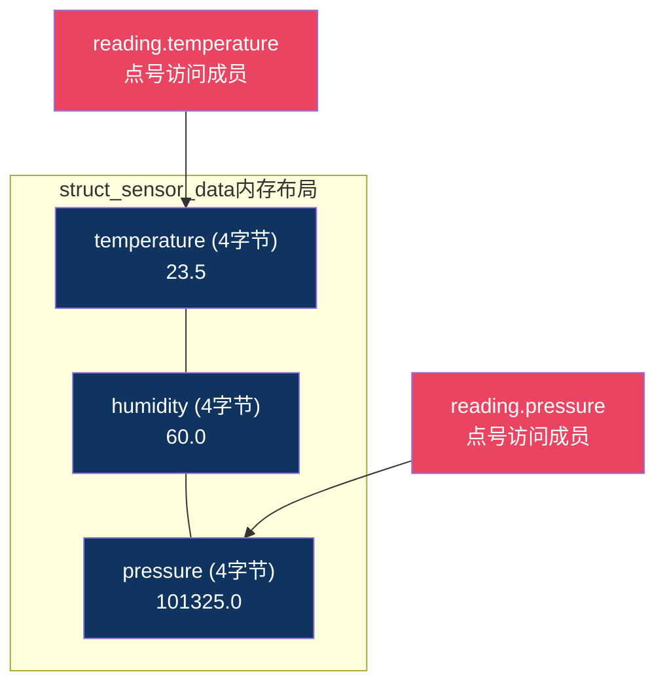
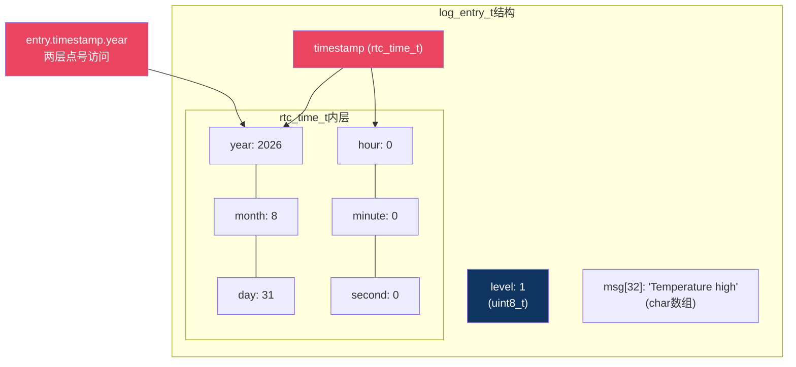
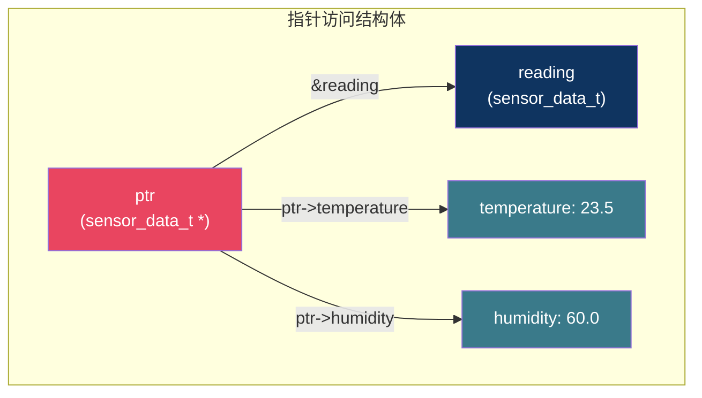

# 【炼气·12】结构体：把数据打包在一起

> **码农修仙传 · 炼气期 · 第12篇**
> 我是玄芯散人，带你从炼气修到大乘。

---

## 境界标识

```
╔══════════════════════════════════════╗
║     炼气期 · 第12篇                    ║
║     结构体：把数据打包在一起            ║
║     struct定义、初始化、嵌套、typedef   ║
║     预计阅读：18分钟                    ║
╚══════════════════════════════════════╝
```

---

## 修仙引入

修仙小说里每个修士腰间都挂着储物袋。丹药放一格，灵石放一格，符箓放一格，飞剑挂背面。你伸手进去掏，不用翻遍整个袋子，直奔对应格子。东西虽然混在一起，但各有各的位置，取的时候靠格子定位。

C语言里的变量也有这个问题。一个传感器读回来的数据，温度一个值，湿度一个值，气压一个值。你用三个独立变量 `temp`、`humidity`、`pressure` 散着放，传给函数要传三个参数，管理起来像东西扔了一地。结构体就是给这些变量缝一个储物袋，把它们装到一起，取用方便，搬运也方便。

---

## 硬核主体

### 结构体是什么：把多个变量绑成一个整体

结构体（struct）让你把几个不同类型的变量捆在一起，形成一个新的类型。访问时通过成员名定位，不会像散装变量那样搞混。

先看一个最简单的定义：

```c
struct sensor_data {
    float temperature;   /* 温度，单位摄氏度 */
    float humidity;      /* 湿度，单位%RH */
    float pressure;      /* 气压，单位Pa */
};
```

这段代码定义了一个名叫 `struct sensor_data` 的新类型。注意末尾的分号不能省，很多人在这里踩坑。`temperature`、`humidity`、`pressure` 是它的三个成员（member），每个成员有自己的类型和名字。

定义了类型之后，就可以声明变量：

```c
struct sensor_data reading;   /* 声明一个reading变量 */
reading.temperature = 23.5f;  /* 给成员赋值，用点号访问 */
reading.humidity    = 60.0f;
reading.pressure    = 101325.0f;
```

点号 `.` 是成员访问运算符。`reading.temperature` 的意思是：取出 `reading` 这个结构体里的 `temperature` 成员。跟翻储物袋掏某个格子一个道理。



### 初始化的几种方式

声明结构体变量的同时可以初始化。C语言有几种常见写法。

逐成员赋值，最直白：

```c
struct sensor_data reading;
reading.temperature = 23.5f;
reading.humidity    = 60.0f;
reading.pressure    = 101325.0f;
```

按顺序初始化，用花括号：

```c
struct sensor_data reading = {23.5f, 60.0f, 101325.0f};
```

花括号里的值按成员声明顺序依次赋给 `temperature`、`humidity`、`pressure`。顺序不能搞错，搞错了编译器不会报错，但数据全乱。

指定初始化器（C99），按名字赋值，推荐这种写法：

```c
struct sensor_data reading = {
    .temperature = 23.5f,
    .humidity    = 60.0f,
    .pressure    = 101325.0f
};
```

`.temperature = 23.5f` 这种写法明确指定给哪个成员赋值，不用管顺序，读代码时也一目了然。没在花括号里出现的成员会被自动置零。嵌入式代码里推荐用这种写法，因为结构体成员经常会增减，按位置初始化很容易漏。

### typedef：给结构体起个短名字

每次写 `struct sensor_data` 太长了。`typedef` 可以给类型起别名，之后只用别名就行：

```c
typedef struct sensor_data {
    float temperature;
    float humidity;
    float pressure;
} sensor_data_t;
```

这样声明变量时可以简写：

```c
sensor_data_t reading;   /* 不用写struct了 */
```

嵌入式代码里几乎都会加 `_t` 后缀（t代表type），这是常见的命名约定。你看 `uint8_t`、`int32_t` 也是同样的规则。

还有一种写法把定义和typedef分开，更清晰：

```c
struct sensor_data {        /* 先定义结构体 */
    float temperature;
    float humidity;
    float pressure;
};

typedef struct sensor_data sensor_data_t;  /* 再起别名 */
```

两种写法效果一样，选哪种看个人习惯。嵌入式项目里通常用第一种，定义和别名放一起，少写一行。

### 结构体嵌套：袋子里套袋子

结构体的成员可以是另一个结构体。比如你有一个时间结构体，还有一个日志结构体，日志里需要带时间戳：

```c
typedef struct {
    uint16_t year;
    uint8_t  month;
    uint8_t  day;
    uint8_t  hour;
    uint8_t  minute;
    uint8_t  second;
} rtc_time_t;

typedef struct {
    uint8_t  level;        /* 日志级别：0=INFO, 1=WARN, 2=ERROR */
    char     msg[32];      /* 日志信息 */
    rtc_time_t timestamp;  /* 嵌套的时间结构体 */
} log_entry_t;
```

访问嵌套成员时连续用点号：

```c
log_entry_t entry;
entry.level = 1;
strcpy(entry.msg, "Temperature high");
entry.timestamp.year  = 2026;
entry.timestamp.month = 8;
entry.timestamp.day   = 31;
```

`entry.timestamp` 先取出内层结构体，再 `.year` 取出它的成员。两层点号连起来就行，跟剥洋葱一样一层一层往里。



### 结构体数组：一批数据排排坐

结构体可以放数组里。比如你采集了10次传感器读数，用数组存：

```c
sensor_data_t readings[10];

for (int i = 0; i < 10; i++) {
    readings[i].temperature = read_temp();    /* 假设read_temp返回float */
    readings[i].humidity    = read_humidity();
    readings[i].pressure    = read_pressure();
}
```

`readings[i]` 先取出数组里第i个结构体，再 `.temperature` 取成员。数组下标和成员访问可以混着用，顺序无所谓，`readings[i].temperature` 和 `(readings[i]).temperature` 等价。

### 结构体指针和箭头运算符

结构体也可以用指针指向。通过指针访问成员时，用的是 `->` 运算符而不是 `.`：

```c
sensor_data_t reading = {23.5f, 60.0f, 101325.0f};
sensor_data_t *ptr = &reading;

printf("温度: %.1f\n", ptr->temperature);   /* 箭头运算符 */
printf("湿度: %.1f\n", ptr->humidity);
```

`ptr->temperature` 等价于 `(*ptr).temperature`。因为 `.` 的优先级比 `*` 高，`*ptr.temperature` 会被解析成 `*(ptr.temperature)`，完全错了。所以通过指针访问成员时，要么用 `->`，要么加括号写 `(*ptr).temperature`。

实际写代码中几乎都用 `->`，简洁也不容易出错。



### 结构体传给函数：值传递和指针传递

结构体作为函数参数时有两种传法，效果差别很大。

值传递，把整个结构体复制一份传进去：

```c
void print_reading(sensor_data_t data)
{
    printf("T=%.1f H=%.1f P=%.0f\n",
           data.temperature, data.humidity, data.pressure);
}

sensor_data_t reading = {23.5f, 60.0f, 101325.0f};
print_reading(reading);   /* 整个结构体被拷贝 */
```

函数内部拿到的是 `reading` 的副本，修改 `data` 不会改动外面的 `reading`。如果结构体很大（比如包含一个256字节的数组），值传递会复制整个结构体，浪费栈空间和时间。

指针传递，只传地址：

```c
void print_reading(const sensor_data_t *data)
{
    printf("T=%.1f H=%.1f P=%.0f\n",
           data->temperature, data->humidity, data->pressure);
}

sensor_data_t reading = {23.5f, 60.0f, 101325.0f};
print_reading(&reading);   /* 只传一个地址 */
```

加 `const` 表示函数不会修改结构体内容，编译器会帮你检查。指针传递只拷贝一个地址（4字节或8字节），不管结构体多大。嵌入式代码里，结构体传参几乎都用指针，值传递只在结构体很小的时候偶尔用。

如果函数要修改结构体，去掉 `const`：

```c
void update_reading(sensor_data_t *data)
{
    data->temperature = read_temp();
    data->humidity    = read_humidity();
    data->pressure    = read_pressure();
}

sensor_data_t reading;
update_reading(&reading);   /* 通过指针直接修改reading */
```

### 实际用法：通信协议帧

结构体在嵌入式代码里最常见的用途之一是定义通信协议帧。比如一个简单的传感器数据上报协议，包含帧头和设备ID，再带数据字段和校验：

```c
#include <stdint.h>

#define FRAME_HEADER  0xAA55

typedef struct {
    uint16_t header;          /* 帧头，固定0xAA55 */
    uint8_t  device_id;       /* 设备编号 */
    float    temperature;     /* 温度数据 */
    float    humidity;        /* 湿度数据 */
    uint16_t crc;             /* CRC校验 */
} frame_t;

/* 填充一个帧 */
frame_t make_frame(uint8_t id, float temp, float hum)
{
    frame_t frame = {
        .header      = FRAME_HEADER,
        .device_id   = id,
        .temperature = temp,
        .humidity    = hum,
        .crc         = 0          /* 先填0，后续计算CRC */
    };
    frame.crc = calc_crc(&frame, sizeof(frame_t) - 2);  /* 算CRC填上 */
    return frame;
}
```

收到数据后，按结构体成员解析：

```c
void process_frame(const uint8_t *raw_data, uint16_t len)
{
    if (len < sizeof(frame_t)) {
        return;   /* 数据不够一个帧 */
    }

    const frame_t *frame = (const frame_t *)raw_data;  /* 强制转换 */

    if (frame->header != FRAME_HEADER) {
        return;   /* 帧头不对，丢弃 */
    }

    printf("设备%d: T=%.1f H=%.1f\n",
           frame->device_id, frame->temperature, frame->humidity);
}
```

这段代码把收到的字节数据直接当成 `frame_t` 来读，不用手动解析每个字段。这种用法在串口通信和网络协议解析里非常普遍。

不过要注意一个陷阱：结构体在内存里的布局可能因为内存对齐而产生空隙，直接把收到的字节流强制转换成结构体指针，在某些平台上可能对不上。这个问题留到下一篇讲内存对齐时展开。

---

## 修仙术语对照表

| 修仙术语 | 技术现实 | 本篇位置 |
|----------|---------|---------|
| 储物袋 | 结构体，把多个变量打包成整体 | 修仙引入 |
| 袋中格子 | 结构体成员，每个变量有自己的名字和位置 | 结构体定义 |
| 掏格子取物 | 点号运算符访问成员 `reading.temperature` | 结构体定义 |
| 袋子标签 | typedef给结构体起短别名 `sensor_data_t` | typedef |
| 袋中套袋 | 结构体嵌套，成员是另一个结构体 | 结构体嵌套 |
| 剥洋葱 | 连续点号访问嵌套成员 `entry.timestamp.year` | 结构体嵌套 |
| 排排坐的储物袋 | 结构体数组，一批结构体放数组里 | 结构体数组 |
| 灵识探物 | 指针访问成员用箭头运算符 `ptr->temperature` | 结构体指针 |
| 传送灵符 | 值传递复制整个结构体传给函数 | 函数传参 |
| 传送坐标 | 指针传递只传地址，效率高 | 函数传参 |
| 封印保护 | const修饰指针参数，防止被修改 | 函数传参 |
| 通信令牌 | 通信协议帧用结构体定义字段 | 实际用法 |
| 令牌解读 | 字节流强制转换成结构体指针解析协议 | 实际用法 |
| 袋中暗格 | 内存对齐产生的空隙，留到下一篇讲 | 实际用法 |

---

## 进阶条件

- [ ] 能写出结构体定义语法 `struct name { ... };` 并说明末尾分号不能省
- [ ] 能用多种方式初始化结构体：逐成员赋值、顺序花括号、指定初始化器
- [ ] 能用typedef给结构体起别名，并说明 `_t` 后缀的含义
- [ ] 能定义嵌套结构体并用连续点号访问内层成员
- [ ] 能区分 `.` 和 `->` 两种成员访问运算符的使用时机
- [ ] 能写一个函数用 `const struct *` 参数接收结构体，解释为什么不用值传递
- [ ] 能用结构体定义一个简单的通信协议帧并填充字段

> 最后一条是实战检验。嵌入式代码里协议帧解析到处都是，你能用结构体组织协议字段，就算过了这一关。下一篇讲内存对齐，扒开结构体在内存里的真实布局，看看 `sizeof` 为什么经常比你算的大。

---

## 下期预告 + 互动

> 下一篇：【炼气·13】内存对齐：为什么sizeof不准
>
> 这篇讲了结构体怎么定义和使用。下一篇扒开内存盖子看结构体里每个成员到底怎么排的，为什么 `sizeof(struct)` 经常比你手算的大，`#pragma pack` 能干什么，编译器为什么要塞空隙。

现在问你：

> 💡 你在项目里用结构体组织过什么数据？传感器读数还是通信协议帧？
>
> 🔧 `ptr->temperature` 和 `(*ptr).temperature` 你平时用哪个？知道为什么推荐前者吗？
>
> 评论区聊聊你用结构体踩过的坑，尤其是 `sizeof` 对不上的情况。

> 我是玄芯散人，带你从炼气修到大乘。

---

*本文是「码农修仙传」系列第12篇。系列导航见 [xren.ren](https://xren.ren)*
