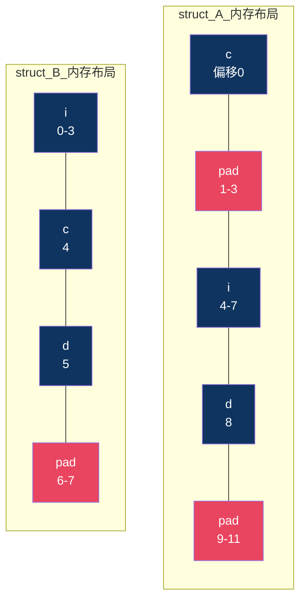
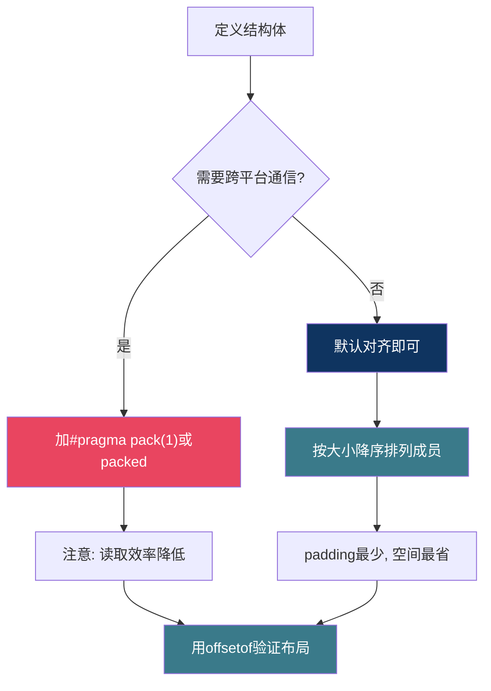

# 【炼气·13】内存对齐：为什么sizeof不准

> **码农修仙传 · 炼气期 · 第13篇**
> 我是玄芯散人，带你从炼气修到大乘。

---

## 境界标识

```
╔══════════════════════════════════════╗
║     炼气期 · 第13篇                    ║
║     内存对齐：为什么sizeof不准          ║
║     对齐规则、padding、#pragma pack     ║
║     预计阅读：20分钟                    ║
╚══════════════════════════════════════╝
```

---

## 修仙引入

上一篇讲了结构体，把一堆变量缝进储物袋里打包搬运。当时提了一句"袋中有暗格"，说结构体在内存里可能比你算的大。这个暗格是怎么来的？为什么你定义了三个变量，明明手算只要6字节，编译器却给你分配了12字节？

编译器其实在帮你。CPU读取内存有自己的规矩。这个规矩叫内存对齐。理解了这个，你才能解释为什么 `sizeof` 的结果经常跟你想的不一样。

---

## 硬核主体

### 先看一个现象：sizeof为什么比你算的大

定义一个结构体，三个成员加起来6字节：

```c
#include <stdio.h>

struct A {
    char c;   /* 1字节 */
    int  i;   /* 4字节 */
    char d;   /* 1字节 */
};

int main() {
    printf("sizeof(struct A) = %zu\n", sizeof(struct A));  /* 输出12 */
    return 0;
}
```

1加4加1等于6，但 `sizeof` 告诉你是12。多出来的6字节去哪了？被编译器塞了空白填充，专业术语叫padding。

调换一下成员顺序，把大的放前面：

```c
struct B {
    int  i;   /* 4字节 */
    char c;   /* 1字节 */
    char d;   /* 1字节 */
};

/* sizeof(struct B) = 8 */
```

同样的三个成员，换个顺序，大小从12变成8。少了4字节。再换个排法：

```c
struct C {
    char  c;   /* 1字节 */
    short s;   /* 2字节 */
    int   i;   /* 4字节 */
};

/* sizeof(struct C) = 8 */
```

还是同样三个类型，只是换了个短一点的中间成员，大小也是8。这些差异不是随机的，背后有明确的规则。

### 对齐规则：每个成员都有自己的"座位要求"

内存对齐的规则可以用两句话概括：

1. 每个成员的起始地址必须是自身大小的整数倍。`int` 是4字节，所以它的地址必须能被4整除。`short` 是2字节，地址必须能被2整除。`char` 是1字节，任何地址都行。
2. 整个结构体的大小必须是最大成员大小的整数倍。

用第一个结构体来推演：

```c
struct A {
    char c;   /* 偏移0，占1字节 */
              /* 偏移1-3，3字节padding（i需要4的倍数地址） */
    int  i;   /* 偏移4，占4字节 */
    char d;   /* 偏移8，占1字节 */
              /* 偏移9-11，3字节padding（总大小需是4的倍数） */
};
/* 总计12字节 */
```

`c` 在偏移0，没问题。`i` 需要放在4的倍数处，下一个可用位置是偏移4，所以偏移1到3被填充。`d` 放在偏移8。最后总大小9字节，但结构体大小必须是4的整数倍，所以补到12。

第二个结构体：

```c
struct B {
    int  i;   /* 偏移0，占4字节 */
    char c;   /* 偏移4，占1字节 */
    char d;   /* 偏移5，占1字节 */
              /* 偏移6-7，2字节padding */
};
/* 总计8字节 */
```

`i` 在偏移0，`c` 在偏移4，`d` 在偏移5。总大小6，补到8（4的倍数）。只浪费了2字节。



红色就是padding，白白浪费的空间。同样三个成员，A浪费6字节，B只浪费2字节。差别就在成员排列顺序。

### offsetof：看清楚每个成员的位置

C语言有个宏叫 `offsetof`，能告诉你每个成员在结构体里的偏移量。用 `#include <stddef.h>` 引入：

```c
#include <stdio.h>
#include <stddef.h>

struct A {
    char c;
    int  i;
    char d;
};

int main() {
    printf("c offset: %zu\n", offsetof(struct A, c));  /* 0 */
    printf("i offset: %zu\n", offsetof(struct A, i));  /* 4 */
    printf("d offset: %zu\n", offsetof(struct A, d));  /* 8 */
    printf("total size: %zu\n", sizeof(struct A));     /* 12 */
    return 0;
}
```

看到偏移量，padding的存在就一目了然了。`c` 在0，`i` 在4，中间1到3就是padding。调试结构体布局时，`offsetof` 是你最好的工具。

### 为什么编译器要这么做

CPU读取内存不是按字节一个个读的。32位CPU一次读4字节，64位CPU一次读8字节，而且地址必须是读取大小的整数倍。如果一个 `int` 放在地址1（不是4的倍数），CPU要分两次读：先读地址0到3取后半段，再读地址4到7取前半段，然后拼起来。慢了一倍不说，有些平台直接报错。

编译器替你把成员对齐到合适的地址，CPU一次就能读完。代价是多占几个字节的空间。这是用空间换时间，几乎所有的编译器默认都这么干。

作为炼气期，你不需要深入CPU总线和缓存行的细节，记住一句话就够了：对齐让CPU读得快，padding是为此付出的空间代价。

### 调整对齐：#pragma pack和__attribute__((packed))

有时候你不想要padding。比如定义通信协议帧，对方设备用紧凑格式发过来的字节流，一个字节都不能错位。这时候可以强制取消对齐。

用 `#pragma pack`：

```c
#pragma pack(1)    /* 按1字节对齐，等于不对齐 */
struct D {
    char c;
    int  i;
    char d;
};
#pragma pack()     /* 恢复默认对齐 */

/* sizeof(struct D) = 6，没有padding */
```

`#pragma pack(1)` 告诉编译器后面的结构体按1字节对齐，成员之间不填充。用完之后 `#pragma pack()` 恢复默认。

GCC和Clang还支持另一种写法：

```c
struct E {
    char c;
    int  i;
    char d;
} __attribute__((packed));

/* sizeof(struct E) = 6 */
```

`__attribute__((packed))` 跟 `#pragma pack(1)` 效果一样，只对标注的结构体生效，不影响其他代码。

取消对齐的代价是CPU读取效率降低，甚至某些平台直接崩溃。所以只在确实需要的时候用，比如通信协议帧、解析固定格式文件。普通结构体该对齐就对齐，别折腾。

### 成员排列技巧：大个子排前面

既然成员顺序决定了大小，怎么排最省空间？一个实用技巧：按成员大小从大到小排列。

对比两个结构体，成员一样，顺序不同：

```c
struct F {
    double d;   /* 8字节 */
    char   c;   /* 1字节 */
    int    i;   /* 4字节 */
};
/* sizeof = 16, padding: 3字节(c后), 0字节(末尾) */

struct G {
    char   c;   /* 1字节 */
    double d;   /* 8字节 */
    int    i;   /* 4字节 */
};
/* sizeof = 24, padding: 7字节(c后), 4字节(末尾) */
```

`struct F` 把8字节的 `double` 放前面，4字节的 `int` 放后面，只浪费3字节，总大小16。`struct G` 把1字节的 `char` 放前面，后面 `double` 需要8的倍数地址，中间塞了7字节padding，末尾再补4字节，总大小24。同样的成员，换个顺序多浪费8字节。

养成习惯：定义结构体时，大的成员放前面，小的放后面。`double` 然后 `int` 然后 `short` 然后 `char`，这样padding最少。

### 嵌套结构体的对齐

结构体里套另一个结构体时，内层结构体的对齐值等于它最大成员的对齐值。外层结构体计算padding时，把内层结构体当作一个整体，对齐值取内层最大成员的对齐值。

```c
struct inner {
    char  c;     /* 1字节 */
    int   i;     /* 4字节 */
};
/* sizeof(inner) = 8, 对齐值为4 */

struct outer {
    char     tag;        /* 1字节, 偏移0 */
                          /* 3字节padding（inner对齐值为4） */
    struct inner data;   /* 8字节, 偏移4 */
    char     flag;       /* 1字节, 偏移12 */
                          /* 3字节padding（总大小需是4的倍数） */
};
/* sizeof(outer) = 16 */
```

`inner` 的对齐值是4（因为它的最大成员 `int` 对齐值为4），所以 `outer` 里 `data` 必须放在4的倍数处。`tag` 在偏移0，`data` 在偏移4，中间3字节padding。

### 什么时候要关注对齐

日常写代码，大部分时候不用操心内存对齐，编译器默认处理得很好。但有几种情况你必须知道：

通信协议解析。上一篇讲过把字节流强制转换成结构体指针的用法。如果通信双方的对齐规则不一样，解析出来的数据就全是错的。嵌入式开发中跟其他设备通信时，协议帧结构体通常加 `#pragma pack(1)` 或 `__attribute__((packed))`，保证没有padding。

跨平台代码移植。不同编译器、不同平台的默认对齐规则可能不同。同样的结构体在32位和64位平台上 `sizeof` 可能不一样。写跨平台代码时要考虑这个差异，别假设结构体大小固定。

内存敏感场合。单片机RAM可能只有几KB，每个字节都得省。这时候合理排列成员，省下的padding可能够你多存好几组数据。



### 一个容易踩的坑：强制类型转换

上一篇通信协议帧的代码里，有这样一行：

```c
const frame_t *frame = (const frame_t *)raw_data;
```

把收到的字节数组直接当成结构体来读。如果 `frame_t` 有padding，而发送方是紧凑排列的，数据就对不上。`device_id` 读到的可能是padding里的垃圾值。

解决方法是协议帧结构体加 `__attribute__((packed))` 或 `#pragma pack(1)`：

```c
#pragma pack(1)
typedef struct {
    uint16_t header;
    uint8_t  device_id;
    float    temperature;
    float    humidity;
    uint16_t crc;
} frame_t;
#pragma pack()
```

这样结构体里没有padding，收到的字节流和结构体布局完全对应。代价是CPU读取效率低一些，但通信协议帧本来就不是性能瓶颈，这点代价可以接受。

---

## 修仙术语对照表

| 修仙术语 | 技术现实 | 本篇位置 |
|----------|---------|---------|
| 袋中暗格 | padding，编译器填充的空白字节 | 修仙引入 |
| 座位要求 | 每个成员地址必须是其大小的整数倍 | 对齐规则 |
| 储物袋总量规则 | 结构体大小必须是最大成员的整数倍 | 对齐规则 |
| 探查暗格 | offsetof宏查看成员偏移量 | offsetof |
| 灵脉疏通 | CPU一次读取对齐数据，效率高 | 为什么需要对齐 |
| 走火入魔 | int放非4倍数地址，CPU分两次读甚至报错 | 为什么需要对齐 |
| 破除暗格 | #pragma pack(1)取消对齐填充 | 调整对齐 |
| 封印解除 | __attribute__((packed))取消对齐 | 调整对齐 |
| 大个子排前 | 成员按大小降序排列减少padding | 排列技巧 |
| 袋中套袋的对齐 | 嵌套结构体对齐值取内层最大成员 | 嵌套对齐 |
| 传送阵校准 | 通信协议帧加packed保证布局一致 | 什么时候关注 |
| 跨界传送 | 跨平台时对齐规则可能不同 | 什么时候关注 |
| 灵石紧缺 | 单片机RAM小，省padding省内存 | 什么时候关注 |
| 暗格误读 | 强制转换时padding导致数据错位 | 踩坑 |

---

## 进阶条件

- [ ] 能解释为什么 `struct {char c; int i; char d;}` 的sizeof是12而不是6
- [ ] 能用 `offsetof` 查看任意结构体成员的偏移量，画出内存布局图
- [ ] 能通过调换成员顺序，把一个结构体的sizeof从12减到8
- [ ] 能说明 `#pragma pack(1)` 和 `__attribute__((packed))` 各自怎么用和有什么区别
- [ ] 能解释为什么通信协议帧结构体要加packed，不加会出什么问题
- [ ] 能说出"按大小降序排列成员"这条规则的原因
- [ ] 能判断什么情况需要手动处理对齐，什么情况交给编译器默认处理

> 最后一道是判断题，实战中大部分时候不用管对齐，但你得知道什么时候必须管。下一篇讲宏定义和条件编译，编译器在正式编译之前还会做一轮文本替换，那又是一个容易踩坑的地方。

---

## 下期预告 + 互动

> 下一篇：【炼气·14】宏定义和条件编译：编译前的文本替换
>
> 这篇讲了结构体在内存里怎么排的。下一篇讲编译的第一个阶段：预处理。`#define` 不只是定义常量那么简单，带参数的宏，条件编译，嵌入式切换硬件平台的技巧，全在这一步发生。

现在问你：

> 你的项目里有没有遇到过sizeof比预期大的情况？当时是怎么发现的？
>
> 通信协议帧你平时加packed吗？还是手动逐字节解析？

> 我是玄芯散人，带你从炼气修到大乘。

---

*本文是「码农修仙传」系列第13篇。系列导航见 [xren.ren](https://xren.ren)*
