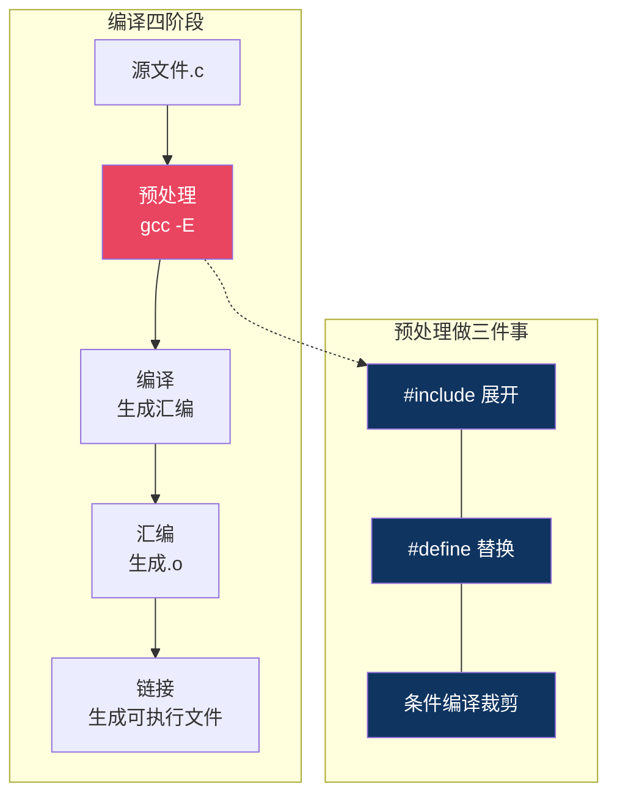
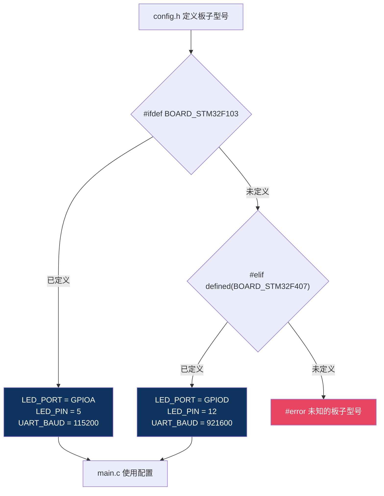
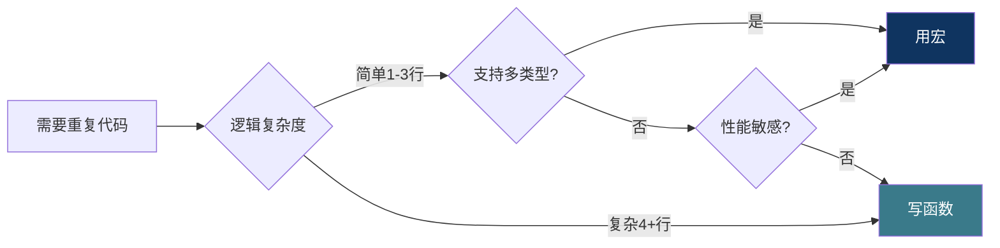

# 【炼气·14】宏定义和条件编译：编译前的文本替换

> **码农修仙传 · 炼气期 · 第14篇**
> 我是玄芯散人，带你从炼气修到大乘。

---

## 境界标识

```
╔══════════════════════════════════════╗
║     炼气期 · 第14篇                    ║
║     宏定义和条件编译：编译前的文本替换  ║
║     #define、带参宏、#ifdef、#和##     ║
║     预计阅读：22分钟                    ║
╚══════════════════════════════════════╝
```

---

## 修仙引入

上一篇讲内存对齐时，代码里出现了 `#pragma pack(1)` 和 `#pragma pack()`。这对指令是怎么生效的？为什么写在一个 `.c` 文件里的代码，在不同平台上能编译出不同的结果？答案在编译器开始干活之前，有一个叫"预处理器"的角色先跑了一趟，把你写的代码做了一遍文本替换。这个过程发生在正式编译之前，但决定了最终编译的代码长什么样。

预处理器不认识C语言语法，它只认自己那套指令。所有以 `#` 开头的行，都是预处理器的地盘。`#define`、`#ifdef`、`#include`，这些都是。理解预处理器，你才能看懂嵌入式项目里那些宏套宏、条件嵌套的配置头文件。

---

## 硬核主体

### 预处理器到底干了什么

C语言的编译分四个阶段：预处理，编译，汇编，链接。预处理器是第一个阶段，它干的事情很纯粹：文本替换。它不管你语法对不对，不管类型匹不匹配，只管把文本按规则替换掉。

你可以用 `gcc -E` 让编译器只做预处理、不做后面的步骤，亲眼看看替换后的代码长什么样：

```bash
gcc -E main.c -o main.i
```

打开 `main.i`，你会发现 `#include <stdio.h>` 那行没了，取而代之的是一大堆标准库的声明。`#define` 定义的常量被换成了实际值。条件编译不满足的分支整段消失了。这就是预处理器的全部工作。



### #define：定义常量和宏

`#define` 最基础的用法是定义常量，把一个名字替换成一段文本：

```c
#define MAX_DEVICES   8
#define BUFFER_SIZE   256
#define VERSION_STR   "1.0.0"

char buffer[BUFFER_SIZE];       /* 替换后: char buffer[256]; */
int  device_count = MAX_DEVICES; /* 替换后: int device_count = 8; */
```

预处理器看到 `BUFFER_SIZE` 就替换成 `256`，看到 `MAX_DEVICES` 就替换成 `8`。注意它不是变量，不占内存，没有类型。它只是一个文本标签，在预处理阶段就被替换掉了。

用 `#define` 定义常量比用 `const` 变量有个好处：它不占RAM。在单片机上，RAM可能只有几KB，用 `#define` 定义的数组大小在编译期就确定了，编译器可以直接分配静态存储区，省下来的RAM能存更多运行时数据。

### 带参数的宏：像函数但不是函数

`#define` 还能带参数，写出来像函数调用，但机制完全不同：

```c
#define SQUARE(x)   ((x) * (x))
#define MAX(a, b)   ((a) > (b) ? (a) : (b))

int y = SQUARE(5);    /* 替换后: int y = ((5) * (5)); → 25 */
int z = MAX(3, 7);    /* 替换后: int z = ((3) > (7) ? (3) : (7)); → 7 */
```

预处理器做的是纯文本替换。`SQUARE(5)` 被替换成 `((5) * (5))`。参数 `x` 的位置被 `5` 替换了。不经过函数调用，没有栈帧分配，没有参数压栈，在预处理阶段就展开好了。

这里有个必须讲清楚的陷阱。看这个调用：

```c
int n = 5;
int result = SQUARE(n++);  /* 你以为结果是25？ */
```

替换后变成了：

```c
int result = ((n++) * (n++));
```

`n++` 被执行了两次。而且两次自增时机在C标准里是未定义行为，不同编译器结果不同。可能得到25，也可能得到30。这就是带参宏的陷阱：参数被求值多次。函数调用不会有这个问题，因为参数在调用前只求值一次。

### 括号：宏的保命符

看这个宏：

```c
#define DOUBLE(x)  x * 2
```

调用 `DOUBLE(3 + 4)`，替换后变成 `3 + 4 * 2`，结果是11而不是14。因为乘法优先级高于加法。

正确写法是给参数和整个表达式都加括号：

```c
#define DOUBLE(x)  ((x) * 2)
```

替换后变成 `((3 + 4) * 2)`，结果14。每个参数都要用括号包住，整个表达式也要用括号包住。这不是多余的，是防止运算符优先级搞鬼。写宏不加括号，迟早会踩坑。

### 多行宏：用反斜杠续行

宏太长一行写不下，用 `\` 续行：

```c
#define SWAP(a, b)  do {    \
    int tmp = (a);           \
    (a) = (b);                \
    (b) = tmp;               \
} while (0)
```

为什么要套 `do { ... } while (0)` 而不是直接用 `{ ... }`？考虑这个场景：

```c
if (condition)
    SWAP(x, y);
else
    do_something();
```

如果宏是 `{ ... }`，展开后变成：

```c
if (condition)
    { int tmp = (x); (x) = (y); (y) = tmp; };  /* 块后分号让else悬空 */
else
    do_something();
```

`if` 后面跟了个代码块加分号，变成了一条完整语句，后面的 `else` 找不到归属，编译报错。`do { ... } while (0)` 是一个完整的语句，后面加分号刚刚好，在任何需要单条语句的地方都不会出问题。这是C语言宏的经典套路。

### 条件编译：#ifdef和#ifndef

条件编译让同一段代码在不同条件下编译出不同的结果。最常见的是 `#ifdef`、`#ifndef`、`#endif`：

```c
#define USE_WIFI

#ifdef USE_WIFI
    /* WIFI相关代码，编译时保留这段 */
    wifi_init();
    wifi_connect("MySSID", "password");
#endif

#ifndef USE_WIFI
    /* WIFI没定义时编译这段 */
    uart_init();
    uart_println("WIFI disabled, using UART");
#endif
```

`#ifdef USE_WIFI` 检查 `USE_WIFI` 是否被 `#define` 过。定义了就保留 `#ifdef` 到 `#endif` 之间的代码，没定义就删掉。`#ifndef` 正好相反，没定义时才保留。

这在嵌入式开发里太常用了。同一套代码，板子A用的是STM32F103，板子B用的是STM32F407，引脚不同、时钟不同、外设不同。你不可能给每个板子维护一套代码，用条件编译来切换：

```c
/* config.h */
#define BOARD_STM32F103
/* #define BOARD_STM32F407 */

/* main.c */
#ifdef BOARD_STM32F103
    #define LED_PORT     GPIOA
    #define LED_PIN      5
    #define UART_BAUD    115200
#elif defined(BOARD_STM32F407)
    #define LED_PORT     GPIOD
    #define LED_PIN      12
    #define UART_BAUD    921600
#endif
```

改一行 `#define`，切到另一个板子，编译出来的代码就全换了。不用改业务代码，配置集中在头文件里。这就是条件编译在嵌入式里的价值，一套代码适配多块板子。

顺带说一下 `#error`，上面代码最后那个分支用了它。`#error` 让预处理器在遇到这行时直接报错并输出消息，编译中止。当你定义了一个不认识的板子型号时，编译阶段就能发现问题，不用等到运行时莫名其妙地崩溃。类似的还有 `#warning`，报但不中止编译。



### #if和#elif：用值判断

`#ifdef` 只能判断定义没定义，`#if` 能判断值：

```c
#define DEBUG_LEVEL 2

#if DEBUG_LEVEL >= 2
    /* debug级别2及以上编译这段 */
    log_debug("detailed debug info");
#endif

#if DEBUG_LEVEL == 0
    /* release版本，不编译任何debug代码 */
#elif DEBUG_LEVEL == 1
    log_info("basic info");
#elif DEBUG_LEVEL >= 2
    log_debug("detailed debug info");
    log_trace("trace level info");
#endif
```

`#if` 后面跟的是常量表达式，预处理器在预处理阶段就能算出结果。表达式里只能用 `#define` 定义的常量和字面量，不能用变量。因为预处理器不认识变量，变量是运行时才存在的。

### #ifndef防重复包含

头文件被多个 `.c` 文件包含时，如果不用条件编译保护，同一个声明会被处理多次，编译报"重复定义"错误。标准做法是每个头文件开头加：

```c
/* uart.h */
#ifndef UART_H
#define UART_H

/* 头文件内容 */
void uart_init(uint32_t baudrate);
void uart_send(uint8_t *data, uint16_t len);

#endif /* UART_H */
```

第一次包含 `uart.h` 时，`UART_H` 还没定义，`#ifndef` 为真，进入头文件内容，同时定义 `UART_H`。第二次再包含时，`UART_H` 已经定义了，`#ifndef` 为假，整段跳过。这样无论 `uart.h` 被包含多少次，实际内容只处理一遍。

这个模式叫"include guard"，几乎每个头文件都要加。有些编译器还支持 `#pragma once`，效果一样但写法更简洁：

```c
/* uart.h */
#pragma once

void uart_init(uint32_t baudrate);
```

`#pragma once` 告诉编译器这个文件只包含一次，不靠宏名来判断。好处是不用起宏名，坏处是非标准写法，老编译器可能不认。

### #和##：字符串化和拼接

`#` 运算符把宏参数变成字符串：

```c
#define STR(x)  #x

printf("%s\n", STR(Hello World));  /* 替换后: printf("%s\n", "Hello World"); */
```

`STR(Hello World)` 替换成 `"Hello World"`。`#` 把参数原封不动地变成字符串字面量。调试时打印变量名很有用：

```c
#define PRINT_VAR(x)  printf(#x " = %d\n", (x))

int count = 42;
PRINT_VAR(count);  /* 替换后: printf("count" " = %d\n", (count)) */
                   /* 输出: count = 42 */
```

C语言里相邻字符串字面量会自动拼接，所以 `"count" " = %d\n"` 等价于 `"count = %d\n"`。一个宏就能打印任意变量名和值，写调试日志非常方便。

`##` 运算符把两个标识符拼接成一个新的标识符：

```c
#define CONCAT(a, b)  a##b

int xy = 10;
int val = CONCAT(x, y);  /* 替换后: int val = xy; → 10 */
```

`CONCAT(x, y)` 替换成 `xy`，一个合法的变量名。这在批量生成变量名或函数名时用得到：

```c
#define GPIO_PORT(letter)  GPIO##letter

GPIO_PORT(A)->BSRR = 0x01;  /* 替换后: GPIOA->BSRR = 0x01; */
GPIO_PORT(B)->BSRR = 0x02;  /* 替换后: GPIOB->BSRR = 0x02; */
```

一行宏就能用字母参数生成不同的寄存器指针，比手写 `GPIOA`、`GPIOB` 更整洁。不过 `##` 用多了代码可读性会变差，适度使用。

### 预定义宏

C语言标准规定了一些预定义宏，编译器自带，不需要你 `#define`：

```c
printf("文件: %s\n", __FILE__);      /* 当前文件名 */
printf("行号: %d\n", __LINE__);      /* 当前行号 */
printf("日期: %s\n", __DATE__);      /* 编译日期 */
printf("时间: %s\n", __TIME__);      /* 编译时间 */
printf("标准: %ld\n", __STDC_VERSION__); /* C标准版本，如201112L表示C11 */
```

`__STDC_VERSION__` 只在遵循标准的编译器中定义。GCC默认可能用GNU扩展模式，需要加 `-std=c11` 才会定义这个宏。嵌入式调试经常用 `__FILE__` 和 `__LINE__` 做assert断言：

```c
#define ASSERT(cond)  do {                                  \
    if (!(cond)) {                                          \
        printf("ASSERT FAIL: %s @ %s:%d\n",                 \
               #cond, __FILE__, __LINE__);                  \
        while (1);  /* 死循环，等待看门狗复位 */             \
    }                                                       \
} while (0)

ASSERT(buffer != NULL);
/* 如果buffer为NULL，输出: ASSERT FAIL: buffer != NULL @ main.c:42 */
```

出了bug一看打印就知道哪个文件第几行出了问题。嵌入式调试手段有限，没有gdb单步，这类打印就是你的眼睛。

### 宏 vs 函数：什么时候用什么

宏在预处理阶段展开，没有函数调用开销。但宏没有类型检查，参数可能被多次求值，调试器也看不到宏的展开结果。什么时候用宏，什么时候用函数？

需要类型泛化的简单操作用宏。比如 `MAX(a, b)` 对 `int`、`float`、`double` 都能用，写成函数就得为每种类型写一个。

性能敏感且调用频繁的简单操作用宏。比如位操作、取极值，宏展开后没有调用开销。

复杂逻辑用函数。宏超过三四行就该考虑写成函数，否则调试和维护都是噩梦。

有递归或需要局部变量很多的操作用函数。宏里定义局部变量容易和调用处冲突，函数有独立的作用域。



### 一个实战例子：调试开关

把学的东西串起来，写一个实际项目里常见的调试日志系统：

```c
/* debug.h */
#ifndef DEBUG_H
#define DEBUG_H

#define DEBUG_ENABLE   1
#define DEBUG_LEVEL    2   /* 0=关闭 1=基本信息 2=详细 */

#if DEBUG_ENABLE
    #define LOG(level, fmt, ...)  do {                                    \
        if (level <= DEBUG_LEVEL) {                                       \
            printf("[%s:%d] " fmt "\n", __FILE__, __LINE__, ##__VA_ARGS__);\
        }                                                                 \
    } while (0)
#else
    #define LOG(level, fmt, ...)  /* 空宏，release版本编译后什么都不剩 */
#endif

#define LOG_INFO(fmt, ...)   LOG(1, fmt, ##__VA_ARGS__)
#define LOG_DEBUG(fmt, ...)   LOG(2, fmt, ##__VA_ARGS__)

#endif /* DEBUG_H */
```

```c
/* main.c */
#include "debug.h"

int main() {
    int sensor_val = read_sensor();
    LOG_INFO("sensor = %d", sensor_val);
    LOG_DEBUG("entering calibration mode");
    return 0;
}
```

DEBUG版本下，调试信息全部输出。发布时把 `DEBUG_ENABLE` 改成0，所有 `LOG` 宏变成空宏，预处理器替换成空白，编译出的代码里一点调试代码的影子都没有。不需要删代码，不需要注释，改一个宏就行。

这里的 `##__VA_ARGS__` 是GCC扩展写法，`##` 要紧贴在逗号后面，作用是当 `...` 没有传入参数时去掉前面那个多余的逗号。标准C写法是直接用 `__VA_ARGS__`，不加 `##`，在C99中合法但如果传空参数某些编译器会报错。工程上为了跨编译器兼容，通常用 `##` 写法。

---

## 修仙术语对照表

| 修仙术语 | 技术现实 | 本篇位置 |
|----------|---------|---------|
| 先行斥候 | 预处理器在正式编译前先跑一遍 | 预处理器 |
| 文本替换 | #define把名字替换成实际内容 | 定义常量 |
| 傀儡术 | 带参宏展开像函数但不是函数 | 带参宏 |
| 分身误伤 | 宏参数被多次求值(n++被执行两次) | 宏陷阱 |
| 保命符 | 宏定义里给参数和表达式加括号 | 括号 |
| 续命术 | 用反斜杠续行写多行宏 | 多行宏 |
| 套壳术 | do { } while(0)让宏安全展开 | 多行宏 |
| 分支秘术 | 条件编译按条件保留或删除代码 | 条件编译 |
| 换甲术 | 切换硬件平台只需改一行宏 | 条件编译 |
| 防重影 | include guard防止重复包含 | 防重复 |
| 言出法随 | #运算符把参数变成字符串 | #运算符 |
| 炼名术 | ##运算符拼接标识符 | ##运算符 |
| 天机碑文 | 预定义宏记录文件名行号 | 预定义 |
| 隐身术 | release版宏变空宏，调试代码消失 | 实战例子 |

---

## 突破条件

- [ ] 能用 `gcc -E` 查看预处理后的代码，说清楚 `#include` 展开发生了什么
- [ ] 能解释 `SQUARE(n++)` 为什么会出问题，说出至少一个解决方案
- [ ] 能写一个带参宏，每个参数都正确加了括号，解释不加括号会出什么错
- [ ] 能用 `#ifdef` 写一个切换两个硬件平台的配置段，说清楚改哪一行就能切换
- [ ] 能写一个完整的 include guard，解释不用会出什么编译错误
- [ ] 能用 `#` 运算符写一个打印变量名和值的调试宏
- [ ] 能说明宏和函数各适合什么场景，列出至少两条判断依据

> 这篇讲完了编译前发生的事。下一篇讲位域和枚举，C语言里两种组织常量的方式，位域直接操控bit位，枚举给整型常量起名字，什么时候用哪个有讲究。

---

## 下期预告 + 互动

> 下一篇：【炼气·15】位域和枚举
>
> 宏能定义常量，但有时候你需要在一字节里塞8个开关。位域让你按bit分配空间，枚举给你一组有名字的整型值。这篇讲清楚两种方式的内存布局和适用场景，嵌入式配置寄存器时用得上。

问你：

> 你的项目里是怎么管理调试日志的？用宏控制还是用全局变量？release版怎么去掉调试代码？
>
> 带参宏你踩过哪些坑？有没有遇到过括号问题导致的诡异bug？

> 我是玄芯散人，带你从炼气修到大乘。

---

*本文是「码农修仙传」系列第14篇。系列导航见 [xren.ren](https://xren.ren)*
