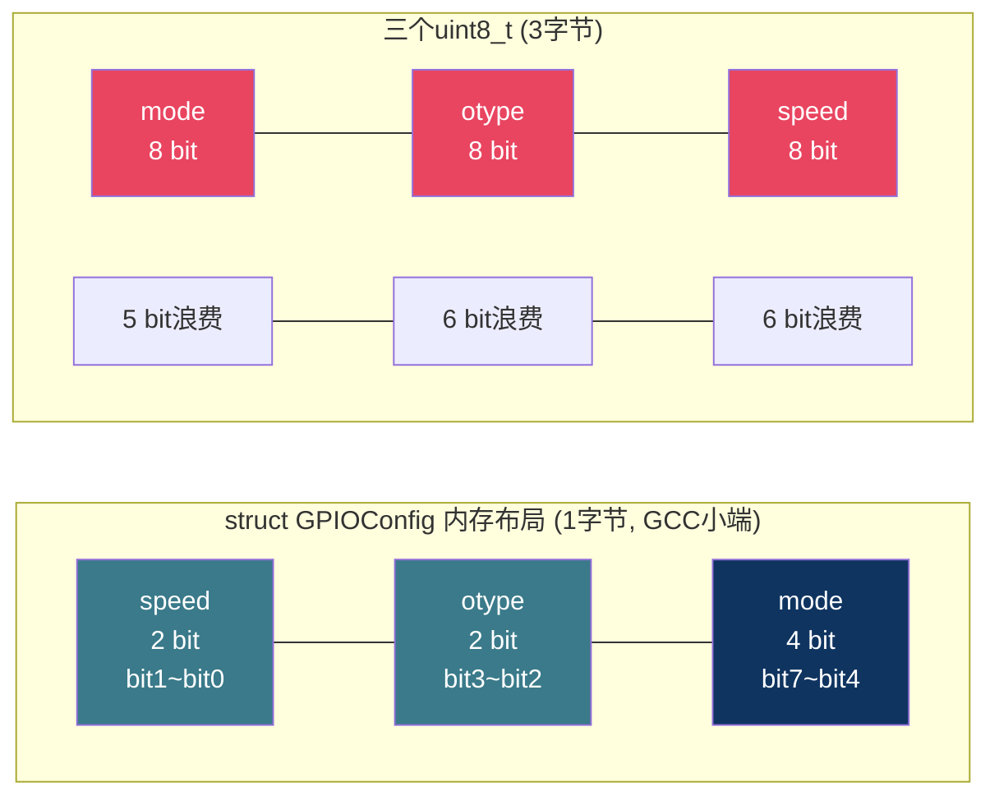
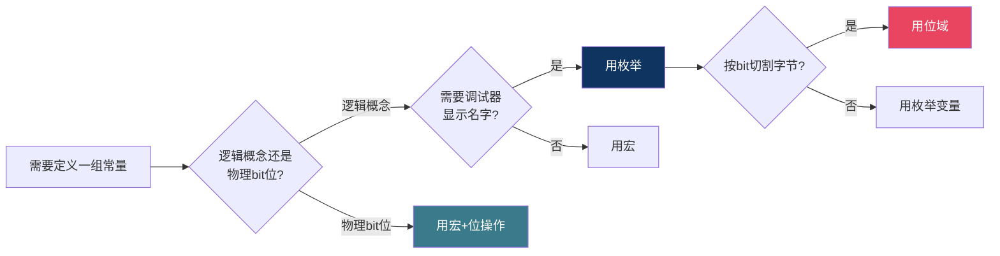

# 【炼气·15】位域和枚举：操控bit位和给常量起名字

> **码农修仙传 · 炼气期 · 第15篇**
> 我是玄芯散人，带你从炼气修到大乘。

---

## 境界标识

```
╔══════════════════════════════════════╗
║     炼气期 · 第15篇                    ║
║     位域和枚举：操控bit位和给常量起名字  ║
║     bit-field、enum、什么时候用哪个     ║
║     预计阅读：20分钟                    ║
╚══════════════════════════════════════╝
```

---

## 修仙引入

上一篇讲条件编译时，代码里用 `#define` 定义了一堆常量：`STATUS_OK`、`STATUS_ERROR`、`DEBUG_LEVEL`。这些常量都是孤零零的数字标签，互相之间没有关系，编译器也不知道它们属于同一组。

C语言提供了两种更体面的方式来组织常量。位域让你在一个字节里精确划分bit位，每个小区域存一个值，适合寄存器配置这种"一个字节当八个用"的情况。枚举给一组相关的整型值起名字，编译器能帮你检查类型，代码可读性也更好。这两个东西看起来简单，但该用位域还是枚举还是宏，很多人搞不清楚。

---

## 硬核主体

### 位域：在字节里画格子

先看一个实际的寄存器配置需求。STM32的GPIO寄存器，每个端口配置需要4个bit（MODE寄存器），2个bit（OTYPER），2个bit（OSPEEDR），1个bit（PUPDR）。如果每个配置都用一个独立变量存，太浪费RAM。位域让你在一个字节里精确切割：

```c
struct GPIOConfig {
    uint8_t mode   : 4;   /* 4 bit: 0~15 */
    uint8_t otype  : 2;   /* 2 bit: 0~3 */
    uint8_t speed  : 2;   /* 2 bit: 0~3 */
};
```

冒号后面的数字是这个成员占的bit位数。`mode` 占4位，`otype` 占2位，`speed` 占2位，加起来正好8位，也就是1个字节。用 `sizeof` 验证：

```c
printf("sizeof = %zu\n", sizeof(struct GPIOConfig));  /* 输出: 1 */
```

1个字节存了三个配置值。如果用普通变量，三个 `uint8_t` 要占3个字节，浪费了2个。



### 位域的取值范围

N个bit能表示的范围是固定的。无符号位域，N位能存 `0` 到 `2^N - 1`。有符号位域，N位能存 `-2^(N-1)` 到 `2^(N-1) - 1`。

```c
struct Bits {
    uint8_t a : 3;   /* 无符号: 0 ~ 7 */
    int8_t  b : 3;   /* 有符号: -4 ~ 3 */
};
```

`a` 是3位无符号，能存0到7。`b` 是3位有符号，最高位是符号位，能存-4到3。

赋值超出范围会怎样？编译器不报错，直接截断高位，只保留低N位：

```c
struct Bits bits;
bits.a = 9;   /* 9 = 1001b, 3位只能存001, 结果是1 */
bits.b = 4;   /* 4 = 100b, 有符号3位认为这是-4 */
```

GCC会给出截断警告（`-Wbitfield-constant-conversion`），但编译能过。运行时 `bits.a` 的值是1，`bits.b` 的值是-4。这种截断行为是C标准明确允许的，不是未定义行为，但你得知道会发生，否则debug时一头雾水。

### 位域跨存储单元

当位域成员的bit数加起来超过一个存储单元（通常是声明类型的宽度）时，编译器会分配新的存储单元。看这个例子：

```c
struct CrossByte {
    uint8_t a : 5;   /* 第一个字节用5 bit */
    uint8_t b : 5;   /* 剩3 bit放不下5 bit, 开新字节 */
};
```

`a` 占5位，第一个字节还剩3位。`b` 需要5位，3位放不下，编译器把 `b` 放到第二个字节。`sizeof` 结果是2。这是GCC在x86上的行为，不同编译器和平台可能不同，后面会讲。

### 匿名位域和零宽度位域

有时候你只想跳过几个bit，不给它们命名。用匿名位域：

```c
struct RegLayout {
    uint8_t enable   : 1;   /* bit0: 使能 */
    uint8_t          : 2;   /* bit1~2: 保留, 不用 */
    uint8_t mode     : 3;   /* bit3~5: 模式 */
    uint8_t          : 2;   /* bit6~7: 保留 */
};
```

匿名位域占位但不命名，你不能读写它。这在对应硬件寄存器的保留位时很常用，保持内存布局跟寄存器bit位一一对应。

还有一种特殊用法，零宽度位域：

```c
struct ForceAlign {
    uint8_t a : 4;
    uint8_t   : 0;   /* 强制对齐到下一个存储单元边界 */
    uint8_t b : 4;
};
```

`a` 占4位，本来 `b` 可以接着占同一个字节的后4位。但中间插了个 `: 0`，编译器会把 `b` 放到下一个字节。`sizeof` 结果是2。零宽度位域干的事就是"这个存储单元到此为止，后面的成员从新单元开始"。

### 位域的三个限制

位域很好用，但有几个硬限制。

不能取地址。位域成员没有独立的内存地址，它只是字节里的某几个bit。`&bits.a` 编译报错。你没法拿到一个指向 `bits.a` 的指针。

不能用在数组里。不能写 `uint8_t flags[8] : 1`，位域成员不能是数组。要存8个1位标志，得写8个成员名。

内存布局跟编译器和平台相关。C标准没有规定位域成员在存储单元里的排列顺序。位域 `a:4; b:4` 在GCC小端机器上，`a` 占低4位，`b` 占高4位。换到MSVC或其他编译器可能反过来。不同编译器对跨存储单元的处理也不同，有的会把成员挤进同一个单元，有的会开新单元。写跨平台代码时别依赖位域的具体bit布局。

### 枚举：给整型值起名字

枚举的定义方式：

```c
enum Color {
    RED,      /* 自动赋值0 */
    GREEN,    /* 自动赋值1 */
    BLUE      /* 自动赋值2 */
};
```

不手动赋值时，编译器从0开始自动递增。你也可以指定值：

```c
enum HttpStatus {
    HTTP_OK = 200,
    HTTP_NOT_FOUND = 404,
    HTTP_SERVER_ERROR = 500
};
```

手动赋值后面的成员会接着递增：

```c
enum Weekday {
    MON = 1,   /* 1 */
    TUE,       /* 2 */
    WED,       /* 3 */
    THU,       /* 4 */
    FRI,       /* 5 */
    SAT = 6,
    SUN        /* 7 */
};
```

### 枚举的底层类型

C标准规定枚举的底层类型必须能容纳所有枚举值，具体选 `int` 还是更小的类型由实现决定。大多数编译器实际选 `int`。在我的GCC x86环境上测试：

```c
enum Color { RED, GREEN, BLUE };
enum BigEnum { SMALL = 0, BIG = 1000000 };

printf("sizeof(enum Color) = %zu\n", sizeof(enum Color));     /* 4 */
printf("sizeof(enum BigEnum) = %zu\n", sizeof(enum BigEnum)); /* 4 */
```

不管枚举值多大，`sizeof` 都是4字节，跟 `int` 一样。GCC在这里选了 `int` 作为底层类型。C标准允许编译器选更小的类型来存枚举，但实际中大多数编译器还是用 `int`。C++11引入了 `enum class` 可以指定底层类型，但C语言不行。

枚举值就是整数，可以直接参与运算：

```c
enum Color c = GREEN;
if (c == 1) {  /* GREEN的值是1, 这个判断为真 */
    printf("green\n");
}
```

但反过来，拿任意整数赋给枚举变量，编译器不一定报错：

```c
enum Color c = 42;  /* 合法但没意义, 42不在枚举值列表里 */
```

C标准允许这种行为，因为枚举的底层类型是整型，任何整型值都能存。所以枚举的类型检查比你想的弱。它更多是给程序员看的，不是给编译器看的。

### 枚举 vs 宏：什么时候用哪个

上一篇讲了 `#define` 定义常量。枚举也能定义一组常量。区别在哪？

```c
/* 用宏 */
#define STATUS_OK      0
#define STATUS_ERROR   1
#define STATUS_PENDING 2

/* 用枚举 */
enum Status {
    STATUS_OK = 0,
    STATUS_ERROR = 1,
    STATUS_PENDING = 2
};
```

功能上几乎一样，但有几个区别：

枚举值在编译期可见，调试器能显示名字。`#define` 在预处理阶段就被替换成数字了，调试器看到的是裸数字0和1。

枚举有自动递增。写 `MON=1, TUE, WED` 就行，不用手写每个值。`#define` 每个都得手写。

枚举有作用域限制。在函数内定义的枚举，外面看不到。`#define` 从定义位置到文件结尾都有效，容易污染。

嵌入式项目里的惯例：状态机用枚举，硬件寄存器bit位定义用宏或位域。状态值是逻辑概念，枚举的自动递增和调试器友好性有优势。寄存器bit位跟物理地址绑定，用宏更直接，也方便跟Datasheet对照。

### 位域 vs 宏：寄存器操作的两种方式

配置硬件寄存器时，你有两种写法。

用位域：

```c
struct GPIO_CRH {
    uint32_t mode8  : 2;
    uint32_t cnf8   : 2;
    uint32_t mode9  : 2;
    uint32_t cnf9   : 2;
    /* ... 重复到bit31 ... */
};

/* volatile告诉编译器不要优化掉对这个地址的访问
   这里直接写地址是为了让寄存器配置看着直观
   volatile的原理留到筑基期讲 */
volatile struct GPIO_CRH *crh = (volatile struct GPIO_CRH *)0x40010804;
crh->mode9 = 3;   /* 输出模式50MHz */
crh->cnf9  = 0;   /* 通用推挽输出 */
```

用宏+位操作：

```c
#define GPIO_CRH   (*(volatile uint32_t *)0x40010804)

#define MODE9_SHIFT   4
#define MODE9_MASK    (0x3 << MODE9_SHIFT)
#define CNF9_SHIFT    6
#define CNF9_MASK     (0x3 << CNF9_SHIFT)

GPIO_CRH = (GPIO_CRH & ~MODE9_MASK) | (3 << MODE9_SHIFT);  /* mode9=3 */
GPIO_CRH = (GPIO_CRH & ~CNF9_MASK)  | (0 << CNF9_SHIFT);   /* cnf9=0 */
```

位域写法简洁直观，读起来像访问结构体成员。但位域的bit排列顺序依赖编译器，换编译器可能错位。宏+位操作写法啰嗦，但bit位置是显式写死的，不依赖编译器，跨平台安全。

实际嵌入式项目里，两种都有人用。STM32的HAL库内部用宏和位操作，不依赖位域，因为HAL库要支持多种编译器。个人项目里如果只用一种编译器，位域写法更舒服。



### 一个实战例子：状态机用枚举，寄存器用位域

把两个概念串起来，写一个传感器采集模块的状态定义：

```c
/* 传感器状态 -- 用枚举, 因为是逻辑概念 */
typedef enum {
    SENSOR_IDLE = 0,       /* 空闲 */
    SENSOR_SAMPLING,       /* 采集中 */
    SENSOR_PROCESSING,     /* 处理中 */
    SENSOR_ERROR           /* 错误 */
} SensorState;

/* 传感器配置寄存器 -- 用位域, 因为要精确控制bit位 */
typedef struct {
    uint8_t enable    : 1;   /* bit0: 使能 */
    uint8_t channel   : 3;   /* bit1~3: 通道号 0~7 */
    uint8_t resolution: 2;   /* bit4~5: 分辨率 */
    uint8_t           : 2;   /* bit6~7: 保留 */
} SensorConfig;

/* 状态转换 */
void sensor_update(SensorState *state, SensorConfig *cfg) {
    switch (*state) {
    case SENSOR_IDLE:
        if (cfg->enable) {
            cfg->channel = 3;        /* 选通道3 */
            cfg->resolution = 2;     /* 12位分辨率 */
            *state = SENSOR_SAMPLING;
        }
        break;
    case SENSOR_SAMPLING:
        /* 采集完成, 转处理 */
        *state = SENSOR_PROCESSING;
        break;
    case SENSOR_PROCESSING:
        *state = SENSOR_IDLE;
        break;
    case SENSOR_ERROR:
        *state = SENSOR_IDLE;
        break;
    }
}
```

状态值用枚举，`switch` 里写名字比写数字清楚。寄存器配置用位域，`cfg->channel = 3` 比手写位操作直观。这就是两种工具各自的用武之地。

注意 `SensorConfig` 里的匿名位域 `: 2` 占了bit6和bit7，不用起名字但保持了bit位对齐。如果硬件手册说bit6~7是保留位，你在代码里照样留出来，读寄存器值的时候就能一一对应。

### typedef搭配枚举

实际项目里，枚举通常配合 `typedef` 用，省得每次写 `enum`：

```c
typedef enum {
    UART_BAUD_9600 = 0,
    UART_BAUD_115200,
    UART_BAUD_921600
} UartBaud;

void uart_set_baud(UartBaud baud) {  /* 参数类型是UartBaud */
    switch (baud) {
    case UART_BAUD_9600:   /* ... */ break;
    case UART_BAUD_115200: /* ... */ break;
    case UART_BAUD_921600: /* ... */ break;
    }
}

uart_set_baud(UART_BAUD_115200);  /* 调用时用枚举常量 */
```

类型名 `UartBaud` 比裸 `int` 更有表达力，调用者一看就知道该传什么值。虽然C编译器不会阻止你传 `42` 进去，但代码审查时一眼就能发现问题。

---

## 修仙术语对照表

| 修仙术语 | 技术现实 | 本篇位置 |
|----------|---------|---------|
| 画格子 | 位域在一个字节里精确划分bit位 | 位域定义 |
| 裁缝术 | 冒号后面的数字决定占几个bit | 位域定义 |
| 溢出截断 | 超出范围的值被截断保留低位 | 取值范围 |
| 隔墙术 | 匿名位域占位但不命名 | 匿名位域 |
| 断层术 | 零宽度位域强制对齐到新存储单元 | 零宽度 |
| 锁魂咒 | 位域不能取地址不能用数组 | 三个限制 |
| 易容术 | 不同编译器位域布局可能不同 | 三个限制 |
| 赐名符 | 枚举给整型值起有意义的名字 | 枚举定义 |
| 自增法 | 枚举常量不赋值时自动从0递增 | 枚举定义 |
| 显形符 | 调试器能显示枚举常量名 | 枚举vs宏 |
| 分身术 | 枚举变量占4字节但常量不占内存 | 枚举vs宏 |
| 画饼术 | 枚举类型检查比想象弱,可传任意int | 枚举特性 |
| 赐名术 | typedef给枚举起简短别名 | typedef |

---

## 突破条件

- [ ] 能定义一个位域结构体，让三个成员刚好占满一个字节，用 `sizeof` 验证
- [ ] 能说出3位无符号位域的取值范围（0~7）和3位有符号的范围（-4~3）
- [ ] 能解释为什么 `bits.a = 9` 存进去变成1，说出截断发生在哪一步
- [ ] 能用匿名位域跳过保留bit位，保持内存布局跟硬件寄存器bit位一一对应
- [ ] 能定义一个枚举，前3个值自动递增从0开始，后2个手动赋值为200和404
- [ ] 能说出枚举比 `#define` 的优势：调试器可见名字，自动递增不用手写，有作用域不会污染
- [ ] 能说明寄存器配置用位域的风险（跨编译器布局不同），以及什么时候该改用宏+位操作

> 下一篇讲C语言常见陷阱：未初始化的变量、野指针和缓冲区溢出。这些是编译器不报但运行时爆炸的错误，每个嵌入式工程师都被坑过。

---

## 下期预告 + 互动

> 下一篇：【炼气·16】C语言常见陷阱：未初始化、野指针和缓冲区溢出
>
> 位域和枚举是组织数据的工具，但C语言还有一类坑是工具救不了的。局部变量不初始化就是随机值，指针释放了还去用就是野指针，数组写穿了就是缓冲区溢出。编译器一声不吭，程序跑起来莫名其妙崩溃。这篇把这些经典陷阱一次说清楚。

问你：

> 你的项目里寄存器配置用位域还是用宏+位操作？有没有踩过位域跨编译器布局不一致的坑？
>
> 枚举的类型检查你觉得够用吗？有没有遇到过传错值但编译器不报的情况？

> 我是玄芯散人，带你从炼气修到大乘。

---

*本文是「码农修仙传」系列第15篇。系列导航见 [xren.ren](https://xren.ren)*
