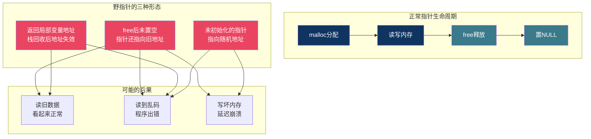
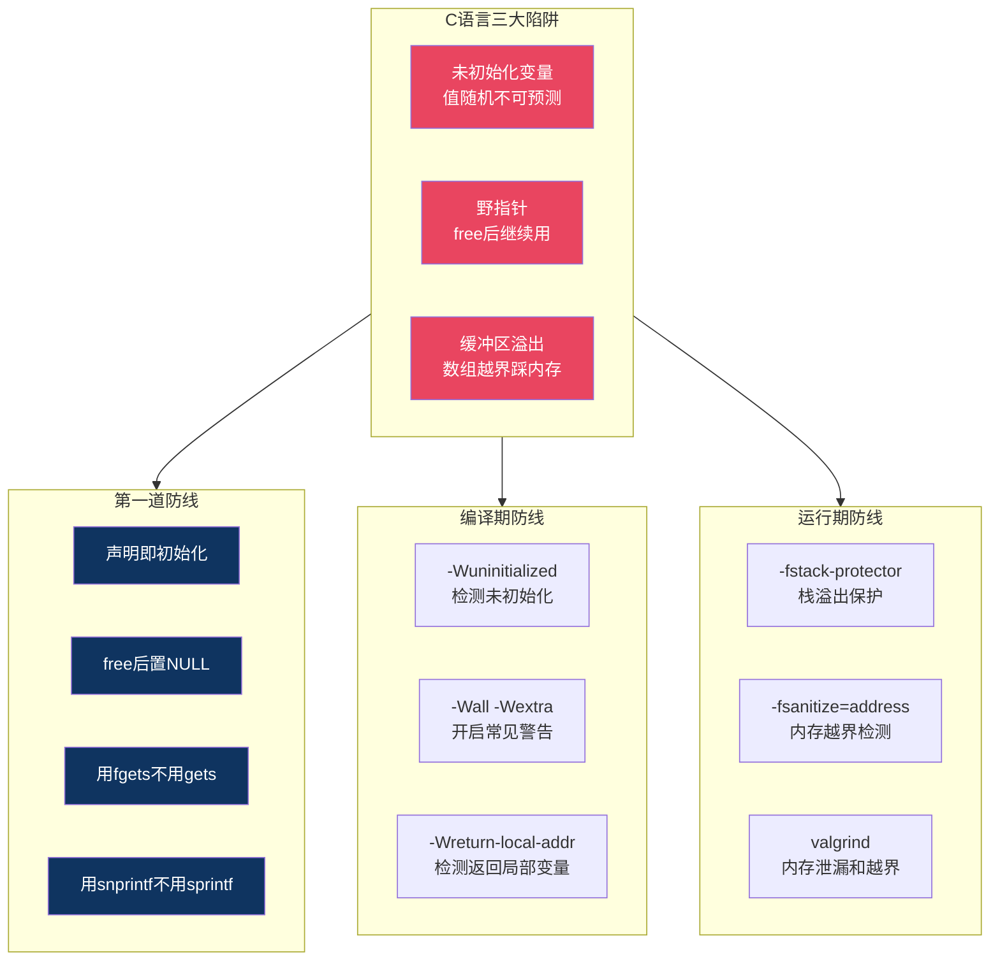

# 【炼气·16】C语言常见陷阱：未初始化、野指针和缓冲区溢出

> **码农修仙传 · 炼气期 · 第16篇**
> 我是玄芯散人，带你从炼气修到大乘。

---

## 境界标识

```
╔══════════════════════════════════════╗
║     炼气期 · 第16篇                    ║
║     C语言常见陷阱                      ║
║     未初始化、野指针、缓冲区溢出        ║
║     预计阅读：25分钟                    ║
╚══════════════════════════════════════╝
```

---

## 修仙引入

修炼界有三种暗器，杀人于无形。一种是毒，吃下去没事，过几个时辰毒发。一种是蛊，藏在体内不知道什么时候发作。一种是咒，你根本不知道自己被施了咒，直到倒下那一刻才发现。

C语言里也有三种这样的暗器。变量不初始化，值是随机的，程序行为不可预测。指针释放了还去用，指向的内存可能已经被别人改过。数组写过了头，把栈上相邻的数据踩烂了。编译器一声不吭，程序跑起来要么莫名其妙崩溃，要么给你一个看起来对但实际错的结果。每个C程序员都被这三样坑过，区别只在被坑了几次。

---

## 硬核主体

### 陷阱一：未初始化的变量

C语言里，局部变量声明后不赋值，它的值不是0，是一个随机值。这个值取决于栈上这个位置之前存过什么。

```c
#include <stdio.h>

void func_a(void) {
    int x;  /* 没初始化 */
    printf("x = %d\n", x);  /* 输出什么? 不确定 */
}

void func_b(void) {
    int y = 42;
    printf("y = %d\n", y);
}

int main(void) {
    func_b();   /* 先调用func_b, y=42写到栈上 */
    func_a();   /* 再调用func_a, x可能复用y的位置 */
    return 0;
}
```

`func_a` 里的 `x` 没初始化，但很可能输出42。因为 `func_b` 先执行，`y` 的值42写到了栈上某个位置。`func_b` 返回后栈空间回收，`func_a` 调用时 `x` 恰好复用了那个位置，读到的是上次留下的42。

这不是巧合，是栈内存复用机制决定的。栈是一块连续内存，函数调用时往里写，返回时只是移动栈指针，不会清零。下一个函数用到同一块区域，读到的就是上次留下的残留值。

为什么C语言不自动给局部变量清零？因为性能。每次函数调用都要把局部变量清零，在频繁调用的场景下有明显开销。C语言选择"不做不必要的事"，把初始化的责任交给程序员。全局变量和static变量存在BSS段，程序启动时由系统统一清零，所以它们不初始化也是0。

```c
#include <stdio.h>

int global_val;          /* 全局变量, 自动初始化为0 */
static int static_val;   /* static变量, 也是0 */

void func(void) {
    int local_val;       /* 局部变量, 随机值 */
    static int s_val;    /* 函数内static, 也是0 */

    printf("global = %d\n", global_val);    /* 0 */
    printf("static = %d\n", static_val);    /* 0 */
    printf("local  = %d\n", local_val);     /* 不确定 */
    printf("s_val  = %d\n", s_val);         /* 0 */
}
```

GCC开启 `-Wuninitialized` 或 `-Wall` 后，编译器会对未初始化的局部变量发出警告。但警告不是错误，很多人忽略了。养成习惯：声明变量时顺手赋初值。

```c
int count = 0;
int *ptr = NULL;
char buffer[256] = {0};   /* 整个数组清零 */
```

指针初始化为NULL特别需要留意。一个没初始化的指针指向随机地址，解引用它可能导致段错误，也可能恰好写到一个有效地址上，数据被悄悄改掉你还不知道。初始化为NULL后，解引用NULL指针必定段错误，问题能立刻暴露，比"不知道哪里被改了"好排查一百倍。

### 陷阱二：野指针

野指针是指向"不该指向的内存"的指针。最常见的情况：`malloc` 分配的内存 `free` 掉了，但指针还保留着原来的地址，继续读写。

```c
#include <stdlib.h>
#include <string.h>
#include <stdio.h>

int main(void) {
    char *p = malloc(32);
    strcpy(p, "hello");
    printf("before free: %s\n", p);  /* hello */

    free(p);
    /* p现在指向已释放的内存, 但p的值没变 */
    printf("after free: %s\n", p);   /* 可能还打印hello, 可能乱码, 可能崩溃 */

    strcpy(p, "world");  /* 写已释放的内存! */
    /* 上面这行可能不报错, 但内存管理器内部数据结构可能被破坏 */

    return 0;
}
```

`free(p)` 做的事情是把 `p` 指向的内存还给内存管理器，但 `p` 这个变量本身的值没变，还存着原来的地址。这个地址现在指向的内存已经不属于你了。读它可能读到旧数据，也可能读到内存管理器写入的管理信息。写它可能改掉别人的数据，也可能踩坏内存管理器的元数据，导致后续 `malloc` 或 `free` 崩溃。

最阴险的是"看起来没问题"。`free(p)` 之后立刻读 `p` 指向的内容，很多情况下能读到原来的数据，因为内存管理器还没把这块内存分配给别人。程序照常跑，你以为没事。等到某个时刻内存被复用了，bug才暴露，而且很难定位到是哪次 `free` 造成的。

修复方法很简单，`free` 之后立刻把指针置空：

```c
free(p);
p = NULL;   /* 以后再误用p, 立刻段错误, 容易定位 */

/* 或者用宏封装 */
#define SAFE_FREE(ptr) do { free(ptr); ptr = NULL; } while(0)

SAFE_FREE(p);  /* 释放并置空 */
```

置空后如果误用 `*p`，必定段错误，一眼就能定位问题。比野指针悄无声息地踩内存好太多。

还有一种野指针：返回局部变量的地址。

```c
int *get_value(void) {
    int x = 42;
    return &x;  /* 返回局部变量的地址! */
}

int main(void) {
    int *p = get_value();
    printf("%d\n", *p);  /* 可能是42, 可能是随机值, 行为未定义 */
    return 0;
}
```

`x` 是 `get_value` 的局部变量，存在栈上。函数返回后，这块栈空间就回收了。`p` 拿到的是一个已经失效的地址，跟 `free` 后的指针一样危险。GCC开 `-Wall` 会给出警告 `function returns address of local variable`，但仍然不是错误。



### 陷阱三：缓冲区溢出

C语言的数组不检查边界。你声明了 `char buf[16]`，往里写32个字节，编译器不拦你，程序也不报错。多出来的16个字节直接踩到数组后面的内存上。

```c
#include <stdio.h>
#include <string.h>

int main(void) {
    char buf[16];
    int secret = 0;

    strcpy(buf, "AAAAAAAAAAAAAAAAAAAAAAAA");  /* 24个A + '\0' = 25字节 */
    /* buf只有16字节, 多出来的9字节踩到了后面的内存 */

    printf("secret = %d\n", secret);  /* secret可能被改成了0x41414141 */
    return 0;
}
```

`buf` 在栈上占16字节，`secret` 紧跟在后面（实际布局取决于编译器，这里简化说明）。`strcpy` 不检查目标空间大小，把25个字节灌进了16字节的空间，多出来的9字节可能覆盖了 `secret` 的值。如果 `secret` 真的被覆盖，`0x41` 是字符 `'A'` 的ASCII码，`secret` 可能被改成 `0x41414141`，也就是十进制的1094795585。注意这是未定义行为，实际结果取决于编译器布局，这里只是说明溢出的原理。

这就是经典的栈缓冲区溢出。1996年Aleph One在Phrack杂志发表的"Smashing The Stack For Fun And Profit"讲的就是这个原理，用溢出数据覆盖函数返回地址，让程序跳转到攻击者指定的位置执行代码。这个攻击方式至今仍是安全漏洞的重灾区。

日常开发中更常见的是无意的溢出。`gets` 函数是最臭名昭著的罪魁祸首：

```c
char buf[64];
gets(buf);  /* 危险! gets不检查输入长度, 输入100字节就溢出 */
```

`gets` 在C99里被标记为不推荐，在C11里直接被删除了。但 `scanf("%s", buf)` 也有同样的问题，`%s` 不限制读取长度。安全的替代方案：

```c
/* 用fgets代替gets */
fgets(buf, sizeof(buf), stdin);  /* 最多读sizeof(buf)-1个字符 */

/* 用scanf的宽度限制 */
scanf("%15s", buf);  /* 最多读15个字符, 给buf[16]留一个位置放'\0' */

/* 用snprintf代替sprintf */
snprintf(buf, sizeof(buf), "value=%d", 123);  /* 不会超过buf的大小 */
```

`fgets` 和 `snprintf` 都接收一个长度参数，保证写入不超过目标空间。这不是编译器强制的，是你主动写的。C语言的安全靠程序员自觉，不靠语言机制保护。

### 编译器能帮你多少

GCC和Clang提供了一些编译选项来检测这些问题，但都有局限：

```c
/* 编译时加这些选项 */
// gcc -Wall -Wextra -Wuninitialized -fstack-protector -fsanitize=address
```

`-Wuninitialized` 在编译期检查可能未初始化的变量，但只能检测编译器能分析到的情况。如果变量通过指针间接赋值，编译器不一定能跟踪到。

`-fstack-protector` 在函数栈帧里放一个随机值（叫canary，金丝雀），函数返回前检查这个值有没有被改。如果溢出覆盖了canary，程序会立刻中止，防止返回地址被篡改。但并非所有函数都加canary，编译器只对有局部数组等高风险的函数启用，而且这只能保护返回地址，不能阻止数据被改坏。

`-fsanitize=address`（ASan）在运行时检测内存越界和释放后使用，非常有用，但有性能开销，通常只在调试时开启，正式发布时关闭。

```c
/* 编译: gcc -fsanitize=address -g test.c -o test */
/* 运行时如果越界访问, ASan会立刻报错并打印调用栈 */
```

ASan不是万能的。它的检测依赖影子内存和页保护机制，对同一栈帧内相邻变量的越界访问可能漏报，但大部分堆越界和释放后使用都能抓到。开发阶段开着ASan跑一遍，能发现绝大部分内存问题。



### 一个综合例子：三个陷阱同时出现

```c
#include <stdlib.h>
#include <string.h>
#include <stdio.h>

char *create_message(void) {
    char msg[16];
    strcpy(msg, "Hello, World!");   /* 13字节+'\0'=14, 放得下 */
    return msg;                      /* 陷阱: 返回局部数组地址 */
}

void process_data(void) {
    char *p = create_message();      /* p指向已失效的栈地址 */
    printf("data: %s\n", p);        /* 陷阱: 野指针读取 */

    char buf[8];
    strcpy(buf, p);                 /* 陷阱: 从野指针读, 长度未知, 可能溢出buf */

    free(p);   /* 陷阱: p不是malloc分配的, free栈地址, 行为未定义 */
}

int main(void) {
    process_data();
    return 0;
}
```

这段代码集齐了三个陷阱：返回局部变量地址造成野指针，从野指针读取长度未知的数据造成缓冲区溢出，对非堆指针调用 `free` 是未定义行为。编译可能只有几个警告，运行结果完全不可预测。

修正版：

```c
#include <stdlib.h>
#include <string.h>
#include <stdio.h>

char *create_message(void) {
    /* 用malloc分配, 返回的指针在函数返回后仍然有效 */
    char *msg = malloc(16);
    if (msg == NULL) {
        return NULL;   /* 分配失败返回NULL, 调用者要检查 */
    }
    strcpy(msg, "Hello, World!");
    return msg;        /* 返回堆地址, 合法 */
}

void process_data(void) {
    char *p = create_message();
    if (p == NULL) {
        return;   /* 检查返回值 */
    }
    printf("data: %s\n", p);

    char buf[32];              /* 空间给够 */
    snprintf(buf, sizeof(buf), "%s", p);  /* snprintf限长, 比strncpy更安全 */

    free(p);
    p = NULL;   /* 释放后置空 */
}

int main(void) {
    process_data();
    return 0;
}
```

改了四件事：局部数组改 `malloc` 分配，让返回的指针在函数退出后依然有效；检查 `malloc` 返回值是否为NULL；`strcpy` 换 `snprintf` 限制写入长度，由 `snprintf` 自动补 `'\\0'`；`free` 后置空。这些都是习惯，不难，但漏掉一个就可能埋下隐患。

### 嵌入式里的特殊情况

嵌入式开发中，这三个陷阱的后果往往更严重。PC上程序崩溃最多重启，嵌入式设备跑在裸机或RTOS上，没有内存保护，野指针踩到的可能是硬件寄存器，缓冲区溢出可能改掉中断向量表。设备在出厂后出了这种问题，只能召回。

而且嵌入式调试手段有限，PC上能跑ASan和valgrind，嵌入式上往往只有串口和几个LED。所以嵌入式工程师对这三个陷阱的警惕性要比PC程序员更高。

```c
/* 嵌入式里常见的防御性写法 */

/* 1. 所有局部变量声明即初始化 */
int count = 0;
int index = 0;
uint8_t *ptr = NULL;

/* 2. 所有动态分配配对检查 */
uint8_t *buf = malloc(BUF_SIZE);
if (buf == NULL) {
    /* 嵌入式通常没有stderr, 用串口或LED报错 */
    return ERR_NO_MEMORY;
}
/* ... 使用buf ... */
free(buf);
buf = NULL;

/* 3. 所有字符串操作限长 */
char log_buf[64];
snprintf(log_buf, sizeof(log_buf), "temp=%d, humi=%d", temp, humi);
```

---

## 修仙术语对照表

| 修仙术语 | 技术现实 | 本篇位置 |
|----------|---------|---------|
| 暗器 | 编译器不报但运行时爆炸的错误 | 修仙引入 |
| 残毒 | 未初始化局部变量残留的旧值 | 未初始化变量 |
| 净身术 | 全局变量和static自动清零 | 未初始化变量 |
| 锁魂针 | 指针初始化为NULL确保崩溃可定位 | 未初始化变量 |
| 幽魂 | free后指针仍指向旧地址 | 野指针 |
| 夺舍 | 野指针指向的内存被别人复用 | 野指针 |
| 送魂符 | free后立刻置NULL | 野指针 |
| 回光返照 | free后读到旧数据看起来正常 | 野指针 |
| 毒蛊 | 返回局部变量地址后地址失效 | 野指针 |
| 破阵 | 缓冲区溢出踩烂相邻内存 | 缓冲区溢出 |
| 暗器之王 | gets函数不检查输入长度 | 缓冲区溢出 |
| 护体罡气 | fgets和snprintf限长写入 | 缓冲区溢出 |
| 金丝雀 | -fstack-protector的栈保护canary | 编译器防线 |
| 天眼术 | ASan运行时检测内存越界 | 编译器防线 |
| 自律心法 | 声明即初始化等编码习惯 | 程序员自律 |

---

## 突破条件

- [ ] 能解释局部变量不初始化为什么是随机值，说出栈内存复用机制
- [ ] 能区分全局变量（自动清零）和局部变量（随机值）的初始化行为
- [ ] 能写出free后置NULL的代码，解释为什么置空比留野指针好
- [ ] 能说出返回局部变量地址为什么危险，给出用malloc替代的修正方案
- [ ] 能用snprintf替代strcpy限制写入长度，说出snprintf比strncpy更安全的原因
- [ ] 能列出三个编译选项（-Wall、-fstack-protector、-fsanitize=address）各自防护什么
- [ ] 能把一段同时包含三个陷阱的代码改写成安全版本

> 下一篇讲printf的坑：格式化字符串和整数溢出。%d和%x和%p有什么区别，格式化字符串漏洞怎么被攻击者利用，整数溢出怎么让程序行为失控。

---

## 下期预告 + 互动

> 下一篇：【炼气·17】printf的坑：格式化字符串和整数溢出
>
> printf是C程序员用得最多的函数，也是坑最多的函数。%d还是%x？%p打印地址为什么带0x？格式化字符串漏洞是怎么被黑客利用的？int加法溢出了会变负数？这些坑你踩过几个？

问你：

> 你在项目里被未初始化变量坑过吗？花了多久才找到原因？
>
> 你的编译选项里开了-fstack-protector和-Wall吗？有没有因为忽略警告导致线上事故的经历？

> 我是玄芯散人，带你从炼气修到大乘。

---

*本文是「码农修仙传」系列第16篇。系列导航见 [xren.ren](https://xren.ren)*
