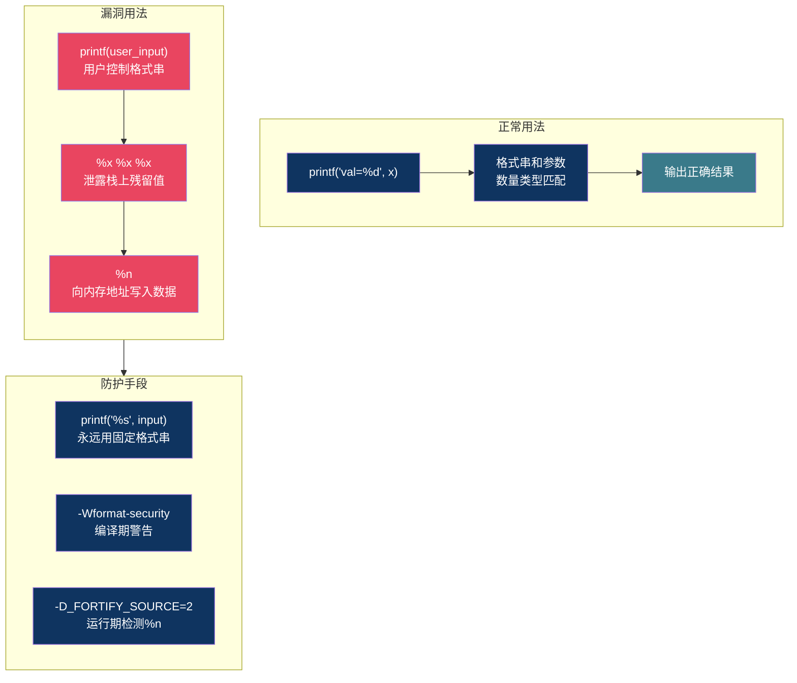
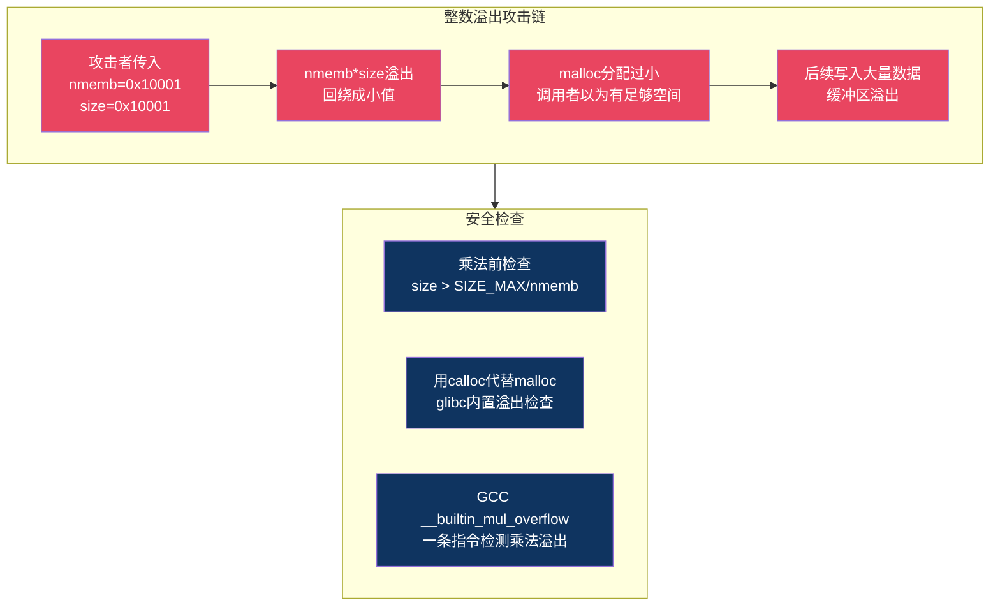

# 【炼气·17】printf的坑：格式化字符串和整数溢出

> **码农修仙传 · 炼气期 · 第17篇**
> 我是玄芯散人，带你从炼气修到大乘。

---

## 境界标识

```
╔══════════════════════════════════════╗
║     炼气期 · 第17篇                    ║
║     printf的坑                         ║
║     格式化字符串和整数溢出              ║
║     预计阅读：20分钟                    ║
╚══════════════════════════════════════╝
```

---

## 修仙引入

修仙界有一种符箓，叫"引灵符"。你画好符箓的骨架，留几个空位，然后往空位里注入灵力，符箓才能生效。注错了灵力，轻则符箓失效，重则反噬自身。

C语言的printf就是这种符箓。`%d` `%x` `%s`这些格式化符号是符箓的骨架空位，后面跟的参数是注入的灵力。类型对不上，轻则输出乱码，重则程序崩溃，甚至被人利用来读取内存里的秘密。而整数溢出更隐蔽，两个数加着加着突然变负数，程序逻辑全乱。这些坑每个C程序员都踩过，有人踩了还不自知。

---

## 硬核主体

### 格式化符号速查

printf的格式化字符串里，百分号开头的是转换说明符（conversion specifier），告诉printf把后面的参数以什么格式输出。常用的几个：

```c
#include <stdio.h>

int main(void) {
    int a = 255;
    char c = 'A';
    char *s = "hello";
    int *p = &a;

    printf("十进制:   %d\n", a);    // 255
    printf("八进制:   %o\n", a);    // 377
    printf("十六进制: %x\n", a);    // ff
    printf("大写hex:  %X\n", a);    // FF
    printf("字符:     %c\n", c);    // A
    printf("字符串:   %s\n", s);    // hello
    printf("指针地址: %p\n", (void*)p);  // 0x7ffd... (地址值)
    printf("无符号:   %u\n", a);    // 255

    return 0;
}
```

几个容易搞混的点：

`%d`和`%x`打印的是同一个数的不同进制表示，值没变，只是展示方式不同。`%p`专门用来打印指针的地址值，输出带`0x`前缀，类型是`void*`。`%u`把参数当成无符号整数打印，如果传一个负数进去，`%d`输出负数，`%u`输出一个很大的正数。

```c
int x = -1;
printf("%d\n", x);   // -1
printf("%u\n", x);   // 4294967295 (假设int是32位)
```

`-1`在内存里以补码存储，32位下是`0xFFFFFFFF`。`%d`把它当有符号数解读，最高位是1表示负数，值是-1。`%u`把它当无符号数解读，忽略符号位，值是4294967295。同一个内存内容，格式化符号决定了printf怎么解释它。

### 长度修饰符：%d不是万能的

`%d`默认假设参数是`int`。但C语言有`long`，`long long`，`size_t`等不同长度的整数，类型不匹配时printf按你给的格式说明符去读对应大小的字节，多读少读都是灾难。

```c
#include <stdio.h>
#include <stdint.h>

int main(void) {
    long long big = 0x123456789ABCDEF0LL;
    long l = 0x1234567890L;
    size_t sz = 100000;

    // 正确用法
    printf("long long: %lld\n", big);   // 用lld
    printf("long:      %ld\n", l);     // 用ld
    printf("size_t:    %zu\n", sz);    // 用zu

    // 错误用法
    printf("错误: %d\n", big);   // 只读了4字节, 高位丢失
    printf("错误: %d\n", l);     // 32位平台long和int都是4字节可能碰巧没问题
                                 // 64位平台long是8字节, 读4字节, 出错

    return 0;
}
```

长度修饰符对照：

| 修饰符 | 对应类型 | 说明 |
|--------|---------|------|
| `%d` | int | 默认32位整数 |
| `%ld` | long | 32位平台4字节，64位平台8字节 |
| `%lld` | long long | 至少64位 |
| `%u` | unsigned int | 无符号32位 |
| `%lu` | unsigned long | 无符号long |
| `%zu` | size_t | sizeof的返回类型 |
| `%hhd` | int(实际读char) | 打印char的数值 |

最常见的坑是64位平台上用`%d`打印`long`。64位Linux上`long`是8字节，`int`是4字节。`%d`只读4字节，如果值的低位4字节恰好是0，你可能看到输出0，但实际值很大。更麻烦的是如果printf在读取参数时字节对齐错位，后面的参数全跟着乱。

```c
// 经典翻车: 在32位int的printf里传64位值
long long val = 0x00000000FFFFFFFFLL;
printf("%d, %d\n", val, val);
// 可能输出: -1, 0  (高位4字节被当成第二个%d读了)
```

### 格式化字符串漏洞

到目前为止讲的都是"用错了输出乱码"的问题。但有一种用法更危险：把用户输入直接当格式化字符串传给printf。

```c
#include <stdio.h>

// 危险写法
void log_message(const char *msg) {
    printf(msg);  // 如果msg里包含%n, 会被攻击者利用
}

// 安全写法
void log_message_safe(const char *msg) {
    printf("%s", msg);  // msg只被当作字符串内容输出, 不当格式化字符串
}
```

区别在于：`printf(msg)`把msg的内容当格式化字符串解析。如果用户输入了`%x%x%x%x`，printf会去栈上找4个参数来填充这些格式说明符，但实际没有传参数，它读的是栈上残留的值，把内存内容泄露出去。

更危险的是`%n`。`%n`不输出内容，而是把目前为止已输出的字符数写到一个指针参数指向的地址。攻击者构造特殊的输入串，利用`%n`向任意内存地址写入值，可以修改程序的返回地址，劫持执行流。

```c
#include <stdio.h>

int main(void) {
    int count = 0;
    // %n把已输出的字符数写到count
    printf("hello world%n\n", &count);
    printf("count = %d\n", count);  // count = 11 ("hello world"共11字符)

    return 0;
}
```

`%n`在正常编程里几乎不用，但在攻击者手里是利器。很多现代编译器（GCC、Clang）默认开启了`-Wformat-security`或`-D_FORTIFY_SOURCE`，对`printf(user_input)`这种写法发出警告，甚至用`__printf_chk`替换printf，检测到`%n`时直接abort。但这不是标准强制的，你不开就没有。

这个漏洞不是理论上的。1999年发现的"format string attack"在2000到2010年间造成了大量真实漏洞，包括SSH和FTP服务器以及Windows组件。很多CTF比赛至今还有格式化字符串漏洞的题目。



### 整数溢出：悄无声息的bug

C语言的整数类型有固定位宽。`int`通常是32位，能表示的范围是-2147483648到2147483647。超出这个范围，事情就变得诡异。

有符号整数溢出在C标准里是未定义行为（undefined behavior）。编译器可以假设它不发生，基于这个假设做指令重排，后果难以预测。无符号整数溢出是定义良好的，结果按模2的n次方计算。

```c
#include <stdio.h>
#include <limits.h>

int main(void) {
    int a = INT_MAX;  // 2147483647
    printf("a = %d\n", a);       // 2147483647
    printf("a+1 = %d\n", a+1);  // 未定义行为, 可能输出-2147483648

    unsigned int b = 0;
    printf("b = %u\n", b);       // 0
    printf("b-1 = %u\n", b-1);  // 4294967295, 无符号溢出是定义良好的

    return 0;
}
```

`a+1`溢出是未定义行为，实际上大多数平台上会回绕到最小值`-2147483648`，输出一个负数。但你不能依赖这个行为，因为编译器如果开了`-O2`，可能基于"有符号溢出不会发生"的假设，把`if (a+1 > a)`简化成`if (1)`，直接跳过溢出检查。

```c
// 危险: 编译器可能删掉这个检查
int safe_add(int a, int b) {
    if (a + b < a) {   // 本意: 检查溢出
        return -1;     // 溢出了
    }
    return a + b;
}
// -O2下, 编译器认为"有符号加法不会溢出"
// 所以 a+b >= a 恒成立, if条件被删掉
// 这个检查形同虚设
```

安全的整数溢出检查方式：

```c
// 有符号加法溢出检查(正确写法)
int safe_add(int a, int b, int *result) {
    if (a > 0 && b > INT_MAX - a) {
        return -1;   // 正溢出
    }
    if (a < 0 && b < INT_MIN - a) {
        return -1;   // 负溢出
    }
    *result = a + b;
    return 0;
}

// 另一种: 用无符号运算检测
int safe_add2(int a, int b, int *result) {
    unsigned int ua = (unsigned int)a;
    unsigned int ub = (unsigned int)b;
    unsigned int uc = ua + ub;   // 无符号加法, 不会UB
    // 检查是否溢出: 看符号位是否合理
    if ((ua ^ INT_MIN) + (ub ^ INT_MIN) < (int)0x80000000) {
        // 简化: 用GCC内置函数更清晰
    }
    *result = (int)uc;
    return 0;
}

// 最简洁: GCC/Clang内置函数
// __builtin_add_overflow(a, b, &result) 返回1表示溢出
int safe_add3(int a, int b, int *result) {
    return __builtin_add_overflow(a, b, result) ? -1 : 0;
}
```

第一种写法在加之前判断：如果a是正数，检查b是否大于`INT_MAX - a`，大于则溢出。逻辑清晰，所有编译器都支持。第三种用GCC和Clang提供的`__builtin_add_overflow`，一条指令完成检测，最简洁。

### 整数溢出导致的安全问题

整数溢出不只是输出负数的问题，它能直接导致安全漏洞。最典型的情况是长度计算溢出后导致缓冲区溢出。

```c
#include <stdlib.h>
#include <string.h>

// 分配n个元素的空间, 每个size字节
void *calloc_overflow(size_t nmemb, size_t size) {
    // 危险: nmemb * size 可能溢出
    size_t total = nmemb * size;  // 两个无符号数相乘, 溢出后回绕
    char *buf = malloc(total);    // total很小, 分配成功
    // 但调用者以为有nmemb*size的空间
    // 实际只有total字节, 后续写入溢出
    return buf;
}

// 安全写法
void *calloc_safe(size_t nmemb, size_t size) {
    if (nmemb != 0 && size > SIZE_MAX / nmemb) {
        return NULL;   // 乘法会溢出, 拒绝
    }
    size_t total = nmemb * size;
    return malloc(total);
}

// 或者用 calloc, glibc的calloc内部做了溢出检查
// char *buf = calloc(nmemb, size);
```

`nmemb * size`在两个无符号数相乘时溢出，结果回绕成一个很小的值。`malloc`分配一小块内存，调用者以为有足够空间往里写数据，实际踩到了后面的内存。2000到2010年间很多网络服务器的远程漏洞都是这么来的。



### 嵌入式里的整数坑

嵌入式开发中整数溢出更常见也更危险。MCU的RAM通常只有几十KB，数据量稍有意外就溢出。

```c
#include <stdint.h>

// 坑1: uint8_t运算升级
uint8_t a = 200;
uint8_t b = 100;
uint8_t c = a + b;   // c = 300 % 256 = 44, 溢出了
// 但如果用int接收:
int d = a + b;       // d = 300, 正确
// C语言里uint8_t参与运算会隐式转换为int
// 所以 a + b 的结果是int 300
// 赋值给uint8_t时截断, 变成44

// 坑2: 定时器计数溢出
uint16_t counter = 0;
void timer_callback(void) {  // 每1ms调用
    counter++;
    // 65535ms后(约65秒) counter溢出回0
    // 如果用counter计算时间差, 会出问题
}
// 例如: 计算两次事件间隔
// 事件A counter=60000, 事件B counter=1000(溢出后)
// 间隔 = 1000 - 60000 = 负数(有符号) 或 6536(无符号回绕)
// 正确算法: (uint16_t)(current - previous) 自动处理回绕
```

定时器计数回绕在嵌入式里很常见。处理方式是用更大的类型（`uint32_t`能撑49天），或者用差值法：`(uint16_t)(current - previous)`，无符号减法自动回绕，差值是对的（只要间隔不超过65535）。

### 一个综合例子

```c
#include <stdio.h>
#include <stdlib.h>
#include <string.h>
#include <limits.h>
#include <stdint.h>

// 模拟: 接收用户输入的字符串, 打包成消息发送
int pack_message(const char *user_input, size_t input_len,
                 char **out_buf, size_t *out_len) {
    // 消息格式: 4字节长度 + 内容 + 1字节校验
    // 长度字段用uint32_t

    // 坑: input_len + 5 可能溢出
    size_t total = input_len + 5;
    if (total < input_len) {  // 溢出检查
        return -1;
    }

    char *buf = malloc(total);
    if (buf == NULL) {
        return -1;
    }

    // 写长度(小端)
    uint32_t len = (uint32_t)input_len;
    buf[0] = (char)(len & 0xFF);
    buf[1] = (char)((len >> 8) & 0xFF);
    buf[2] = (char)((len >> 16) & 0xFF);
    buf[3] = (char)((len >> 24) & 0xFF);

    // 写内容
    memcpy(buf + 4, user_input, input_len);

    // 写校验(简单累加和)
    uint8_t checksum = 0;
    for (size_t i = 0; i < input_len; i++) {
        checksum += (uint8_t)user_input[i];  // uint8_t溢出自动回绕, 没问题
    }
    buf[total - 1] = (char)checksum;

    *out_buf = buf;
    *out_len = total;
    return 0;
}

int main(void) {
    const char *data = "hello";
    char *msg = NULL;
    size_t msg_len = 0;

    if (pack_message(data, 5, &msg, &msg_len) == 0) {
        // 错误: 用 %d 打印 size_t
        printf("msg_len = %d\n", msg_len);  // 可能碰巧对, 但不安全
        // 正确:
        printf("msg_len = %zu\n", msg_len);

        // 错误: 直接printf(msg) 如果msg内容有%
        printf(msg);   // 危险
        // 正确:
        printf("%.*s\n", (int)msg_len, msg);

        free(msg);
        msg = NULL;
    }

    return 0;
}
```

这段代码里有三个坑点：`input_len + 5`可能溢出需要检查，`%d`打印`size_t`类型不匹配，`printf(msg)`把消息内容当格式化字符串。修正方式都在注释里了。

### snprintf：比sprintf安全的选择

sprintf把格式化后的字符串写到目标缓冲区，但不检查空间。snprintf多一个长度参数，保证不会越界。

```c
char buf[16];

// 危险
sprintf(buf, "value=%d", 123456789);  // "value=123456789"共15字符+'\\0'=16
                                       // 恰好放得下, 但再多一个字符就溢出
// 安全
snprintf(buf, sizeof(buf), "value=%d", 123456789);  // 最多写16字节(含'\\0')
// snprintf保证写入不超过指定大小, 且一定以'\\0'结尾
// 如果截断了, 返回值是"全文字符串的长度"(可能大于size)
// 可以用返回值判断是否被截断
```

snprintf的返回值是全文格式化后的字符串长度，不包含`\0`。如果返回值大于等于指定的size，说明被截断了。这个返回值检查在实际开发中经常被忽略。

```c
int n = snprintf(buf, sizeof(buf), "data=%s", long_string);
if (n < 0) {
    // snprintf出错(glibc可能返回-1)
} else if ((size_t)n >= sizeof(buf)) {
    // 被截断了, 全文长度是n, 但buf里只有sizeof(buf)-1个字符
    // 如果需要全文内容, 要分配n+1字节重新格式化
}
```

---

## 修仙术语对照表

| 修仙术语 | 技术现实 | 本篇位置 |
|----------|---------|---------|
| 引灵符 | printf格式化字符串 | 修仙引入 |
| 符箓骨架 | %d %x %s等转换说明符 | 格式化符号速查 |
| 注错灵力 | 格式说明符与参数类型不匹配 | 格式化符号速查 |
| 吞噬符 | %n向内存地址写入字符数 | 格式化字符串漏洞 |
| 窥魂术 | %x泄露栈上残留值 | 格式化字符串漏洞 |
| 护体符 | printf("%s", input)固定格式串 | 格式化字符串漏洞 |
| 灵力溢出 | 整数超过类型表示范围 | 整数溢出 |
| 回绕 | 无符号溢出按模运算 | 整数溢出 |
| 天劫 | 有符号溢出的未定义行为 | 整数溢出 |
| 偷天换日 | 整数溢出导致缓冲区分配过小 | 整数溢出安全 |
| 截断术 | uint8_t运算赋值时截断高位 | 嵌入式整数坑 |
| 时辰回绕 | 定时器计数溢出回零 | 嵌入式整数坑 |
| 限量储物袋 | snprintf限长写入 | snprintf |

---

## 进阶条件

- [ ] 能说出`%d` `%x` `%u` `%p` `%s`各自的用途，解释`%d`和`%u`打印`-1`的区别
- [ ] 能解释为什么64位平台用`%d`打印`long`会出错，写出正确的长度修饰符`%ld`和`%lld`
- [ ] 能说出`printf(msg)`和`printf("%s", msg)`的区别，解释`%n`为什么危险
- [ ] 能写出有符号整数加法溢出检查代码（不用`a+b<a`这种被编译器删掉的写法）
- [ ] 能解释`nmemb * size`乘法溢出导致缓冲区分配过小的攻击原理
- [ ] 能用`snprintf`替代`sprintf`，说出返回值大于size意味着什么
- [ ] 能解释`uint8_t`参与运算时整数隐式转换的规则

> 下一篇讲函数调用栈：main调用子函数时发生了什么。栈帧是怎么分配的，参数怎么传递，返回地址存在哪，局部变量的生命周期是什么。

---

## 下期预告 + 互动

> 下一篇：【炼气·18】函数调用栈：从main到子函数发生了什么
>
> 你写了个函数调用了另一个函数，函数返回后一切恢复正常。但栈帧是怎么创建和销毁的？参数是左到右压栈还是右到左？返回地址存在哪？为什么递归太深会栈溢出？

问你：

> 你在项目里被`%d`打印`long long`坑过吗？输出的值是怎么错的？
>
> 你见过`printf(user_input)`这种写法吗？当时有没有意识到这是个安全漏洞？

> 我是玄芯散人，带你从炼气修到大乘。

---

*本文是「码农修仙传」系列第17篇。系列导航见 [xren.ren](https://xren.ren)*
